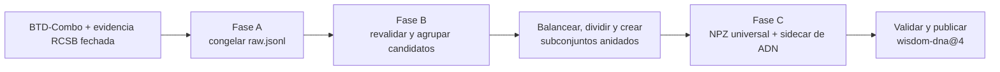

# WISDOM — estructura y aprendizaje superficial de proteínas

[English](README.md) | **Español**

WISDOM construye un benchmark defendible de unión proteína–ADN, convierte estructuras proteicas en
representaciones geométricas universales, proyecta la referencia de interfaz con ADN sobre esas
superficies fijas y entrena los dos primeros modelos WISDOM. «Geométrico» significa que el modelo
razona sobre grafos moleculares y superficiales. El preprocesado estructural es estrictamente
independiente del problema: las etiquetas de unión a ADN viven en catálogos y archivos auxiliares
separados, llamados *sidecars*.

El preprocesador convierte estructuras PDB o PDBx/mmCIF en un NPZ determinista y compacto por
proteína. Un NPZ es un contenedor comprimido de arrays numéricos nombrados. Se mantiene sin pickle:
no incorpora objetos Python arbitrarios serializados que podrían ejecutar código al cargarlos. Cada
archivo combina datos atómicos normalizados, un grafo espacial/covalente, una nube fija accesible al
solvente, geometría local, un grafo superficial y relaciones superficie–átomo. La sección 4.1
construye una imagen mental en lenguaje llano antes del detalle matemático.

WISDOMv1 clasifica proteínas y produce puntuaciones superficiales locales usando durante el
entrenamiento solo una etiqueta para toda la proteína. WISDOMv2 conserva el mismo codificador de
átomos y superficies y compara reglas de *pooling*, que combinan muchas puntuaciones de puntos en
una sola predicción para la proteína. Ninguna implementa
todavía las etapas posteriores de química rica, comunicación bidireccional, geometría cuasi-geodésica,
dMaSIF, contraste o modelos de lenguaje.

## 0. Índice

- [1. Inicio rápido](#1-inicio-rápido)
- [2. Instalación](#2-instalación)
  - [2.1. Requisitos](#21-requisitos)
  - [2.2. Instalación automática con Conda](#22-instalación-automática-con-conda)
  - [2.3. Activación, actualizaciones y comprobaciones](#23-activación-actualizaciones-y-comprobaciones)
- [3. Benchmark de unión a ADN y anotaciones](#3-benchmark-de-unión-a-adn-y-anotaciones)
  - [3.1. Por qué la unión a ADN es el primer problema de WISDOM](#31-por-qué-la-unión-a-adn-es-el-primer-problema-de-wisdom)
  - [3.2. Fase A — construcción y congelación de la evidencia raw](#32-fase-a--construcción-y-congelación-de-la-evidencia-raw)
  - [3.3. De la evidencia congelada a un dataset gestionado](#33-de-la-evidencia-congelada-a-un-dataset-gestionado)
  - [3.4. Fase B — diseño de un benchmark balanceado sin fugas](#34-fase-b--diseño-de-un-benchmark-balanceado-sin-fugas)
  - [3.5. Auditoría estadística e interpretación](#35-auditoría-estadística-e-interpretación)
  - [3.6. Fase C — arrays estructurales y referencia superficial](#36-fase-c--arrays-estructurales-y-referencia-superficial)
- [4. Preprocesado estructural](#4-preprocesado-estructural)
  - [4.1. Imagen mental y recorrido completo](#41-imagen-mental-y-recorrido-completo)
  - [4.2. Preparación, ejecución e inspección del dataset](#42-preparación-ejecución-e-inspección-del-dataset)
  - [4.3. De la entrada del manifiesto a coordenadas normalizadas](#43-de-la-entrada-del-manifiesto-a-coordenadas-normalizadas)
  - [4.4. De los átomos normalizados al grafo atómico](#44-de-los-átomos-normalizados-al-grafo-atómico)
  - [4.5. De las esferas atómicas a la geometría superficial](#45-de-las-esferas-atómicas-a-la-geometría-superficial)
  - [4.6. De los puntos superficiales al NPZ final](#46-de-los-puntos-superficiales-al-npz-final)
  - [4.7. Validación, reproducibilidad y ejecución paralela](#47-validación-reproducibilidad-y-ejecución-paralela)
  - [4.8. Arquitectura del código y tests](#48-arquitectura-del-código-y-tests)
  - [4.9. Limitaciones científicas](#49-limitaciones-científicas)
- [5. Modelos entrenables de WISDOM](#5-modelos-entrenables-de-wisdom)
  - [5.1. Índice del dataset y batching de grafos](#51-índice-del-dataset-y-batching-de-grafos)
  - [5.2. Modelos, ecuaciones y formas tensoriales de WISDOMv1](#52-modelos-ecuaciones-y-formas-tensoriales-de-wisdomv1)
  - [5.3. Pooling y diagnósticos de localización de WISDOMv2](#53-pooling-y-diagnósticos-de-localización-de-wisdomv2)
  - [5.4. Entrenamiento, evaluación y artefactos](#54-entrenamiento-evaluación-y-artefactos)
- [6. Bibliografía](#6-bibliografía)

## 1. Inicio rápido

WISDOM construye el benchmark de ADN con dos comandos independientes. `dna_design.yaml` transforma
la evidencia pública congelada en splits balanceados, sin fugas, y subconjuntos anidados bajo
`data/dna/design`. Después de completarlo una vez, `dna_preprocess.yaml` lee directamente ese
directorio, crea los arrays geométricos, los valida y publica el dataset de LambdaForge. El
preprocesado nunca repite el diseño ni el descubrimiento de datos públicos.

WISDOM se instala mediante Conda. El instalador del repositorio puede usar una instalación de Conda
existente o instalar Miniforge sin privilegios de administrador, crear el entorno `wisdom` desde
`environment.yml`, obtener un checkout compatible de LambdaForge e instalar ambos proyectos en
modo editable. «Editable» significa que los cambios en el código fuente surten efecto sin volver a
instalar el paquete.

```bash
./install.sh
conda activate wisdom

# Revisa y después prepara el entorno gestionado completo en el clúster de destino.
lf clusters bootstrap citius-ctgpgpu12 --project . --dry-run
lf clusters bootstrap citius-ctgpgpu12 --project .

lf validate experiments/dna_design.yaml
lf explain experiments/dna_design.yaml
lf run experiments/dna_design.yaml --dry-run

# Preprocesar el directorio de diseño ya publicado; no se repite el diseño.
lf validate experiments/dna_preprocess.yaml
lf explain experiments/dna_preprocess.yaml
lf run experiments/dna_preprocess.yaml --dry-run
lf validate experiments/validate_dna.yaml  # después de publicar wisdom-dna@4
lf validate experiments/wisdom_v1.yaml
lf run experiments/wisdom_v1.yaml --dry-run
lf validate experiments/wisdom_v2.yaml
```

`validate` comprueba el YAML compacto, la firma de `Work.run()`, imports y argumentos resolubles.
`explain` muestra clases, tipos de parámetros, valores elegidos y defaults exactos en LambdaForge
0.12. `run` ejecuta las clases Work seleccionadas y solo publica una ubicación inmutable cuando
todos los miembros y el índice canónico son válidos.
Una publicación local tiene esta forma:

```text
runs/datasets/published/wisdom-dna/4/<content-id-prefix>/
├── index.jsonl
├── dataset-artifact.json
└── assets/
    ├── <first-protein>/
    │   ├── universal_npz
    │   ├── dna_annotation
    │   ├── source_structure
    │   └── dataset_design/
    │       ├── catalog.csv
    │       ├── train.txt, validation.txt, test.txt
    │       ├── clusters/{sequence,structure}-pairs.tsv
    │       ├── clusters/{sequence,structure,exact}-edges.csv
    │       ├── clusters/{global,positive-interface}-phenotypes.csv
    │       ├── dilutions/replicate-00/train-<porcentaje>.txt
    │       └── {selection,split,dilution}-audit.json
    └── <other-protein>/{universal_npz,dna_annotation,source_structure}
```

`index.jsonl` es el índice streaming autoritativo: cada línea identifica una proteína, split,
tier, etiqueta global de ADN, disponibilidad de referencia local y assets base/sidecar con checksum.
La pertenencia a diluciones es metadata del miembro, así que una vista pequeña reutiliza los mismos
arrays. El artefacto de diseño completo sigue siendo un contrato previo reutilizable. LambdaForge
guarda una sola vez las tablas globales de auditoría como el asset `dataset_design` del primer
miembro; no las duplica para cada proteína. El dataset gestionado contiene así la evidencia final de
pares, fenotipos, splits y diluciones necesaria para auditar cada decisión.
`dataset-artifact.json` guarda el ID de contenido y la procedencia. La representación se abre sin pickle así; 4.2 explica cómo descubrir la ubicación
real en Registry y 4.4–4.6 define cada array:

```python
import json

import numpy as np

with np.load("runs/datasets/published/wisdom-dna/4/<content-id-prefix>/base/<hash>.npz",
             allow_pickle=False) as protein:
    atom_positions    = protein["atom_positions"]
    atom_edges        = protein["atom_edge_index"]
    surface_positions = protein["surface_positions"]
    metadata          = json.loads(str(protein["metadata_json"].item()))
```

## 2. Instalación

### 2.1. Requisitos

- Linux o macOS sobre `x86_64`, `aarch64` o Apple Silicon;
- Bash y acceso a Internet para crear inicialmente el entorno y descargar los datos públicos;
- espacio suficiente, local o en el clúster, para archivos de coordenadas, bases de datos de las
  herramientas especializadas, superficies y checkpoints de LambdaForge;
- Conda es opcional antes de instalar: si no existe, `install.sh` ofrece instalar Miniforge en
  `~/miniforge3`;
- no se necesita una GPU NVIDIA para diseñar o preprocesar el dataset. El entrenamiento puede usar
  un entorno CPU o CUDA seleccionado por el perfil de clúster de LambdaForge.

La lista reproducible de paquetes está en [environment.yml](environment.yml). Crea Python 3.11 e
instala Biopython, MMseqs2 y Foldseek desde `conda-forge`/`bioconda`; al instalar WISDOM se resuelven
después las dependencias de Python, entre ellas NumPy, SciPy, scikit-learn, Gemmi, PyTorch y
LambdaForge. Las secciones 3.2 y 3.4 presentan el papel científico de Gemmi, MMseqs2 y Foldseek.

La tabla `[tool.lambdaforge.environment]` de [pyproject.toml](pyproject.toml) declara ese mismo
`environment.yml` y nombra `mmseqs` y `foldseek` como ejecutables nativos obligatorios. Aquí
«nativo» significa un programa de línea de comandos que no se instala mediante el mecanismo de
paquetes wheel de Python. La declaración forma parte de la identidad del entorno gestionado; no se
repite en cada YAML de experimento.

WISDOM está adaptado a LambdaForge `0.12.0`. Toda acción ejecutable es una subclase directa de
`Work` con un único método `run()`. LambdaForge resuelve files/datasets tipados, mapas acotados,
checkpoints JSON seguros, progreso, publicación inmutable, Registry, logs, recursos, semillas,
búsquedas y ejecuciones. WISDOM conserva la interpretación proteica, la geometría científica, la
validación exacta de NPZ/sidecars y la visualización específica.

### 2.2. Instalación automática con Conda

Clona WISDOM, entra en el repositorio y ejecuta el instalador:

```bash
git clone <URL del repositorio WISDOM>
cd WISDOM
./install.sh
```

El instalador es interactivo para no sustituir un entorno ni escoger un directorio de LambdaForge
sin que el usuario lo vea. En este orden:

1. localiza Conda o propone una instalación de Miniforge limitada al usuario;
2. crea el entorno `wisdom` o propone actualizar el existente con `--prune`;
3. reutiliza `./LambdaForge` o `../LambdaForge`, permite indicar otro checkout o clona el repositorio
   oficial;
4. comprueba que LambdaForge pertenece al intervalo compatible `>=0.12.0,<0.13.0`;
5. instala LambdaForge y `wisdom[dev]` en modo editable dentro del entorno Conda;
6. opcionalmente comprueba Python, la coherencia de dependencias, LambdaForge, MMseqs2, Foldseek,
   Biopython y el import de WISDOM.

Para aceptar los valores predeterminados sin interacción:

```bash
./install.sh --yes
```

El script no instala paquetes globales del sistema, un controlador NVIDIA ni un toolkit CUDA del
sistema. Si acaba de instalar Miniforge e inicializar la shell, abre un terminal nuevo antes de
activar el entorno.

### 2.3. Activación, actualizaciones y comprobaciones

Activa el entorno en cada terminal nuevo antes de ejecutar WISDOM:

```bash
conda activate wisdom
```

Si Conda aún no está inicializado en la shell actual, carga una vez la ruta que muestra el
instalador o ejecuta `conda init <shell>` y abre un terminal nuevo. Volver a ejecutar `./install.sh`
es la vía prevista para actualizar: permite sincronizar el entorno existente con `environment.yml`,
reutilizar el checkout de LambdaForge elegido y reinstalar ambos proyectos editables.

Estas comprobaciones de solo lectura muestran qué puede ejecutar el entorno:

```bash
python --version
python -m pip check
lf --version
mmseqs version
foldseek version
python -c 'import Bio, gemmi, wisdom; print("Entorno WISDOM correcto")'
```

Para un perfil de clúster con `environment: managed`, prepara el entorno remoto específico del
proyecto desde la raíz del repositorio WISDOM:

```bash
# Inspecciona plataforma, paquetes, ejecutables y conectividad sin cambiar el clúster.
lf clusters bootstrap citius-ctgpgpu12 --project . --dry-run

# Aplica el plan revisado. El comando es idempotente si el entorno ya está completo.
lf clusters bootstrap citius-ctgpgpu12 --project .
lf doctor --on citius-ctgpgpu12
```

`--project .` es importante: indica a bootstrap que lea `pyproject.toml` y `environment.yml` de
WISDOM, construya la wheel de WISDOM y prepare esas dependencias, en lugar de realizar únicamente
un bootstrap genérico del clúster. LambdaForge utiliza su propio ejecutable micromamba verificado
por checksum, por lo que la máquina remota no necesita una instalación global previa de Conda.
Crea un único prefijo inmutable con Python, los paquetes Conda resueltos, LambdaForge, WISDOM y la
versión de PyTorch/CUDA seleccionada; después verifica el inventario Conda y ambos ejecutables
obligatorios antes de permitir reutilizar el entorno. Un `lf run ... --on citius-ctgpgpu12`
posterior descubre automáticamente la misma declaración del proyecto.

`DatasetDesign` realiza un segundo preflight inmediato de ejecutables y versiones al principio del
Work, antes de solicitar una estructura a RCSB o iniciar el cálculo de descriptores. Si no se aplicó
el bootstrap, desapareció una herramienta o su comando de versión no funciona, `work.log`
identifica el ejecutable afectado y muestra los comandos exactos para corregirlo localmente o en un
clúster gestionado. El Work posterior `Preprocessing` no necesita MMseqs2 ni Foldseek: consume el
diseño ya fijado y usa Python/Gemmi para la geometría, por lo que imponerle herramientas ajenas
haría innecesariamente frágil el preprocesado geométrico independiente.

LambdaForge 0.12 importa únicamente clases derivadas de `Work`; ya no existen targets de función ni
la antigua pila `Task`/`TaskContext`/`PreprocessingTask`. `DatasetDesign` usa `self.resume_map` para
reutilizar registros con sus dependencias, mientras `Preprocessing` usa mapas acotados más la
revalidación numérica de NPZ de WISDOM. Ambos emplean cachés gestionadas para las coordenadas,
checkpoints validados para tablas especialistas y salidas gestionadas de todo o nada. LambdaForge
también resuelve y ejecuta herramientas externas, captura versiones/logs y
proporciona HDBSCAN y la evidencia genérica de estabilidad. WISDOM no implementa otro lock de
descarga, protocolo atómico de caché, runner de subprocesos, backend de clustering, Registry ni
publicador. La sección 4.7 explica esta frontera.

## 3. Benchmark de unión a ADN y anotaciones

### 3.1. Por qué la unión a ADN es el primer problema de WISDOM

La primera pregunta de WISDOM es: **¿puede la cadena proteica seleccionada unirse a ADN en un
contexto biológicamente relevante?** Es un buen primer problema porque la unión ocurre en una
superficie tridimensional: el modelo debe relacionar los átomos internos con la forma y la química
expuestas a otra molécula.

Un **benchmark** es una población fija con etiquetas explícitas, particiones de
entrenamiento/validación/test y un protocolo de evaluación. Estas reglas permiten que distintos
modelos respondan a la misma pregunta bajo las mismas condiciones.

Cada proteína aceptada tiene asociadas dos respuestas distintas; confundirlas invalidaría el
experimento:

- la **etiqueta global** indica si la proteína completa se considera capaz (`1`) o no capaz (`0`) de
  unirse a ADN;
- la **referencia local** marca los puntos de la superficie que forman una interfaz conocida con
  ADN. También se denomina *ground truth* (GT), es decir, una respuesta de referencia usada para
  evaluar la localización. No se muestra al modelo como entrada ni se usa como objetivo de la
  función de pérdida débilmente supervisada actual.

Una estructura depositada representa solo una situación estudiada experimentalmente. Los
investigadores pueden cristalizar la proteína sola, eliminar regiones flexibles, emplear una
condición sin ADN o depositar solo uno de los estados de un sistema con varias partes. Por tanto,
**«este archivo PDB no contiene ADN» no implica «esta proteína no puede unirse a ADN».** Incluso ver
una proteína cerca del ADN pero sin contacto en un ensamblaje concreto no demuestra que nunca se
una en otras condiciones. WISDOM trata por ello una proteína como *desconocida* mientras no tenga
evidencia positiva o negativa defendible; los registros desconocidos no se transforman en
negativos.

Esto hace que los negativos sean más difíciles que los positivos. Un contacto físico proteína–ADN
respalda un positivo, pero un número finito de estructuras no puede demostrar que una proteína
nunca se una a ADN. WISDOM obtiene su conjunto negativo inicial de **BTD**, el benchmark de Rahman
*et al.* [22]. BTD parte de registros de Swiss-Prot revisados por especialistas, elimina proteínas
anotadas como ligantes conocidos o posibles de ADN/ARN y reduce la redundancia de secuencia. No usa
la ausencia de ADN en una estructura como evidencia negativa.

**BTD-Combo** combina BTD con los benchmarks anteriores PDB1075 y PDB14K y reduce la redundancia en
cada clase. WISDOM usa sus etiquetas como evidencia de origen y añade comprobaciones estructurales
y de contacto porque la evaluación superficial necesita coordenadas. Un negativo queda así bien
curado, pero continúa siendo una etiqueta de benchmark, no una demostración de que la unión sea
imposible en todos los contextos biológicos.

El entrenamiento usa **supervisión débil**: recibe la etiqueta global, mientras que la interfaz
local queda reservada para evaluar. El modelo debe descubrir qué regiones superficiales explican su
decisión sobre la proteína completa.

El flujo completo de selección y preprocesado es:



| Fase | Operación principal | Resultado que recibe la fase siguiente |
|---|---|---|
| A | Reunir etiquetas defendibles y estructuras exactas. | Evidencia congelada en `raw.jsonl`; todavía no hay particiones. |
| B | Revalidar, agrupar proteínas relacionadas, balancear, dividir y auditar. | Catálogo fijo, archivos train/validation/test y subconjuntos anidados de train. |
| C | Generar geometría proteica y una referencia de interfaz de ADN separada. | Dataset inmutable validado para entrenamiento y evaluación. |

### 3.2. Fase A — construcción y congelación de la evidencia raw

La fase A es un **preanálisis** poco frecuente: convierte anotaciones públicas de secuencia y
estructuras experimentales en una tabla congelada de candidatos. El diseño y el preprocesado
normales reutilizan esa tabla. Para reconstruirla:

```bash
python scripts/create_fasta.py --workers 36
```

La entrada es `scripts/btd_combo.fasta`, una exportación local de BTD-Combo. En FASTA, una línea que
comienza por `>` identifica el registro y las letras siguientes codifican su secuencia de
aminoácidos. El script añade a esos registros una identidad estructural exacta y su evidencia.

La salida es `data/dna/raw/raw.jsonl`, con un objeto JSON por candidato: identificador, cadena,
ensamblaje biológico y copia, etiqueta, evidencia, fuente y secuencia de aminoácidos. La población
**RAW** congelada actual contiene unos 4.484 candidatos (3.529 positivos y 955 negativos). Es
evidencia, todavía no un conjunto de entrenamiento balanceado. `raw.fasta` es solo una vista
compatible con herramientas de secuencia.

**A1 — adaptar BTD-Combo a la evaluación de superficies.** BTD-Combo se basa en secuencias, mientras
que WISDOM necesita una cadena tridimensional concreta. El script elimina secuencias ambiguas y
duplicadas y solo acepta un mapeo al **RCSB PDB** cuando coincide la secuencia depositada completa.
RCSB son las siglas de *Research Collaboratory for Structural Bioinformatics*. Su portal es el
centro de datos estadounidense del archivo PDB mundial, la colección pública de estructuras
tridimensionales de macromoléculas [1, 17]. Un identificador como `1ABC_A` representa la cadena A de
la entrada PDB `1ABC`: apunta a coordenadas experimentales, no solo al nombre de una proteína.

La estructura mapeada debe tener resueltos átomos pesados —todos salvo el hidrógeno— para al menos
el 90 % de la secuencia, porque una cadena muy incompleta no permite construir una referencia
superficial fiable. El script reconstruye el **ensamblaje biológico**, la disposición molecular
propuesta como biológicamente activa y no necesariamente el contenido directo de una celda
cristalográfica. Los positivos de BTD solo se conservan si los átomos pesados de la proteína y el
ADN presentan el contacto directo definido matemáticamente en 3.4. Si no aparece ese contacto,
WISDOM no puede obtener la interfaz local basada en coordenadas que necesita y retira el candidato
de este benchmark estructural; no lo convierte en negativo.

Los negativos de BTD siguen una comprobación distinta. Su etiqueta global continúa procediendo del
proceso de curación de BTD explicado en 3.1. WISDOM comprueba que exista una estructura mapeada lo
bastante completa para auditarla y que no contradiga esa etiqueta. Se pone en cuarentena cualquier
negativo cuyo ensamblaje biológico inspeccionado contacte directamente con ADN, además de las
descargas fallidas y auditorías estructurales incompletas. Superar esta comprobación significa
«negativo de BTD sin contradicción en la estructura auditada», no «se ha demostrado
experimentalmente que ningún punto de su superficie puede unirse a ADN». La referencia local de
ceros que se crea después está condicionada a esa etiqueta global aceptada.

**A2 — añadir positivos con interfaces observables.** La segunda fuente es una consulta de RCSB,
congelada por fecha, que busca ensamblajes biológicos experimentales con proteína y ADN. La consulta
solo descubre candidatos: aparecer en el mismo archivo no basta. WISDOM utiliza **Gemmi**, una
biblioteca de biología estructural de código abierto que lee registros PDB/PDBx/mmCIF y aplica sus
operaciones de simetría para construir ensamblajes [3]. Una cadena solo pasa a ser positiva cuando
supera el test de contacto entre átomos pesados de proteína y ADN. Una cadena depositada sin ADN, o
que no lo toca en una estructura que sí lo contiene, permanece desconocida y nunca aporta un
negativo.

**A3 — resolver conflictos y congelar la procedencia.** Una secuencia exacta con etiquetas
incompatibles se pone en cuarentena. El script registra versiones y hashes de las fuentes,
evidencia CSV detallada, `raw.jsonl` tipado y vistas FASTA. El FASTA balanceado solo sirve para
inspección: la fase B siempre lee toda la población RAW para que incluso una proteína omitida pueda
revelar una relación de similitud entre dos proteínas retenidas.

> **Resultado tras la fase A:** cada fila aceptada tiene una fuente de etiqueta, una cadena y un
> ensamblaje RCSB exactos, una secuencia y evidencia reproducible. Todavía no se ha asignado ninguna
> proteína a train, validation o test.

### 3.3. De la evidencia congelada a un dataset gestionado

[`experiments/dna_design.yaml`](experiments/dna_design.yaml) ejecuta solo la fase B. Revalida todos
los candidatos RAW, calcula descriptores de similitud y físicos, forma grupos de dependencia y
selecciona la población balanceada **CANONICAL** que se dividirá. RAW sigue siendo mayor porque
incluso un candidato omitido puede conectar dos proteínas seleccionadas. El límite de resolución de
producción de 4 Å deja un objetivo de 907 miembros por clase para el RAW actual. Todos los registros
válidos excluidos siguen explicados en `catalog-all.csv`; excluir significa «fuera de este
benchmark», no «biológicamente inválido».

[`experiments/dna_preprocess.yaml`](experiments/dna_preprocess.yaml) ejecuta solo la fase C. Su input
de archivo tipado apunta al directorio `data/dna/design` ya completado. El Work no puede cambiar
miembros ni splits y solo publica `wisdom-dna@4` cuando supera la validación científica.

La entrada de preprocesado tiene esta puerta de acceso compacta:

```text
data/dna/design/
├── catalog.csv
├── train-labelled.txt
├── validation-labelled.txt
├── test-labelled.txt
└── dilutions/
    └── replicate-00/
        ├── train-10-labelled.txt
        ├── train-25-labelled.txt
        ├── train-50-labelled.txt
        ├── train-75-labelled.txt
        └── train-100-labelled.txt
```

Cada línea de los TXT etiquetados tiene el formato `RCSB_CHAIN<TAB>ETIQUETA`; por ejemplo,
`1ABC_A<TAB>1`. Las etiquetas son `0` o `1` y los grupos de cadenas usan el guion bajo descrito en
4.2. Estos manifiestos definen activamente miembros y etiquetas. Antes de descargar, Preprocessing
los contrasta con `catalog.csv`. El catálogo sigue siendo necesario porque un TXT de dos columnas
no puede representar el ensamblaje biológico, la copia transformada de la cadena, el hash de la
estructura, las cadenas de ADN, la evidencia de contacto, el grupo de fuga, el fenotipo y la
procedencia necesarios para anotar y auditar correctamente.

El nombre canónico es `validation-labelled.txt`, no `val-labelled.txt`; posteriormente el loader de
entrenamiento expone ese split mediante el valor abreviado `val`.

Un **Work** de LambdaForge es un paso ejecutable. Una **versión** de dataset identifica contenido
lógico inmutable; un **placement** es una copia física verificada de esa versión en una máquina. El
Registry registra esas copias. El YAML solicita recursos y `workers` limita los registros
concurrentes: reservar 36 CPU no crea por sí solo 36 workers.

El flujo de producción hace explícita la frontera del artefacto:

```bash
# Inspeccionar o ejecutar solo el diseño antes de la geometría costosa.
lf validate experiments/dna_design.yaml
lf explain experiments/dna_design.yaml
lf run experiments/dna_design.yaml --dry-run

# Preprocesar el directorio data/dna/design existente y publicar el dataset.
lf validate experiments/dna_preprocess.yaml
lf explain experiments/dna_preprocess.yaml
lf run experiments/dna_preprocess.yaml --dry-run
lf run experiments/dna_preprocess.yaml --on citius-ctgpgpu12

# En otra terminal, inspeccionar todos los jobs o seguir el log durable de este build.
lf top --history 300
lf logs wisdom-dna-preprocess --follow

# Inspeccionar la versión inmutable y su placement local seleccionado.
lf datasets show wisdom-dna@4
lf datasets stats wisdom-dna@4
lf datasets members wisdom-dna@4 --partition split=train --limit 20
lf datasets verify wisdom-dna@4

# Repetir la auditoría científica completa sin modificar el dataset inmutable.
lf validate experiments/validate_dna.yaml
lf run experiments/validate_dna.yaml --on citius-ctgpgpu12
```

`dataset-design` es un directorio con checksum que contiene catálogos, evidencia de similitud,
fenotipos, manifiestos de split, diluciones e informes. LambdaForge registra cada mmCIF y resultado
de herramientas especialistas usado por un elemento del mapa; por eso un reintento compatible
reutiliza descargas y checkpoints válidos. `--restart` los descarta explícitamente.

El Work también copia el resultado completo de forma atómica al `output_directory` configurado
(`data/dna/design` por defecto). `REPORT.md` explica su auditoría; los archivos `*.txt` contienen IDs
y los `*-labelled.txt` contienen `RCSB_CHAIN<TAB>0|1`. `catalog.csv` conserva la autoridad sobre
etiquetas, ensamblajes y procedencia.

Para disponer del mismo dataset válido en otro clúster se copia la versión inmutable, sin repetir
descubrimiento, mapeo, geometría ni anotación:

```bash
# LambdaForge elige un placement fuente verificado y lo copia al clúster destino.
lf datasets materialize wisdom-dna@4 --on OTRO_CLUSTER --strategy replicate --apply

# O se indican explícitamente origen y destino.
lf datasets replicate wisdom-dna@4 --from citius-ctgpgpu12 --to OTRO_CLUSTER --apply
```

Ambos comandos verifican los bytes y registran otro placement de la misma versión. Para preprocesar
en otro lugar se transfiere la salida `dataset-design` completa: una lista de IDs no contiene
ensamblajes ni procedencia. `lf top` y `lf logs ... --follow` muestran progreso y el `work.log`
durable.

> **Resultado operativo:** ejecuta `dna_design.yaml` una vez para crear el directorio de diseño y
> después ejecuta `dna_preprocess.yaml` de forma independiente cuando sea necesario. Una ejecución
> correcta compatible se reutiliza; el Work de diseño nunca forma parte del preprocesado.

### 3.4. Fase B — diseño de un benchmark balanceado sin fugas

La fase B valida todo RAW, construye grupos de dependencia, descubre fenotipos físicos, elige
CANONICAL, asigna splits y deriva diluciones de train, en ese orden. Los grupos deben preceder a la
selección: si una proteína B omitida conecta A con C, A y C deben seguir juntas. De otro modo, test
podría contener información ya vista mediante un pariente cercano: una **fuga de datos**. Train
ajusta el modelo, validation guía las decisiones y test se reserva para la estimación final.

**Identidad y revalidación estructural.** Cada fila JSONL indica identificador, ensamblaje, copia,
evidencia de etiqueta, origen, fuente y secuencia. Para cada entrada PDB, un worker acotado descarga
o reutiliza el mmCIF, verifica su hash SHA-256, reconstruye ese ensamblaje biológico y selecciona la
copia declarada. Así no se confunde una cadena del mismo nombre situada en otra copia del
ensamblaje con el mismo objeto físico.

Para un átomo pesado proteico $p$ y otro de ADN $d$, sean $x_p$ y $x_d$ sus centros cartesianos en
ångströms y $r_p$ y $r_d$ sus radios de van der Waals específicos del elemento. Hay contacto directo si

$$
\lVert x_p-x_d\rVert_2 < r_p+r_d+0.5\ \text{Å}.
$$

La norma es la distancia recta. Los 0,5 Å toleran pequeñas incertidumbres de coordenadas alrededor
de las envolventes atómicas; no implican un enlace covalente. Un índice espacial KD-tree evita
comparar cada átomo proteico con cada átomo de ADN. Cada positivo RAW debe reproducir un contacto en
su ensamblaje/copia exactos. La auditoría conserva secuencia, cobertura, método experimental,
resolución, año, tamaño, forma, composición y descriptores de interfaz.

En rayos X y cryo-EM, una resolución mayor significa menos detalle espacial. Las estructuras peores
que el límite predeterminado de 4 Å permanecen en los grupos de dependencia, pero no pueden entrar
en CANONICAL. Los registros sin una resolución numérica comparable, como muchos modelos de NMR,
siguen siendo elegibles en vez de recibir un valor inventado. Cada exclusión aparece en
`quality-exclusions.txt` y `selection-audit.json`.

**Los grupos de fuga usan todos los candidatos RAW.** **MMseqs2** encuentra similitud de secuencia;
**Foldseek** encuentra similitud entre plegamientos tridimensionales que puede persistir cuando las
secuencias divergen. Ambas relaciones pueden hacer dependientes dos ejemplos.

Una arista de dependencia no afirma igual función; solo prohíbe separar el par. MMseqs2 exige
identidad ≥ 0,30, cobertura bidireccional ≥ 0,80 y E-value ≤ 0,001. La identidad es la fracción
coincidente del alineamiento, la cobertura es la fracción alineada de cada secuencia completa y un
E-value menor indica menos coincidencias esperadas por azar. Foldseek exige probabilidad ≥ 0,90,
TM-score normalizado y cobertura ≥ 0,75 y 0,80 en ambas direcciones, y E-value ≤ 0,001. Las
secuencias exactas, la procedencia compartida y, por defecto, una misma entrada PDB añaden aristas
duras.

Las componentes conexas de la unión de todas las aristas son **grupos de fuga** indivisibles. Así,
A–B y B–C mantienen juntas A, B y C aunque no exista arista A–C. Es una restricción de seguridad,
no una asignación de familia biológica. Las salidas crudas, aristas aceptadas, razones, versiones,
comandos y umbrales quedan en `clusters/` y `provenance.json`.

**Los fenotipos físicos miden representación.** A diferencia de los grupos de fuga, los grupos de
fenotipo describen perfiles medidos parecidos; no definen independencia ni funciones biológicas.
Los globales usan tamaño, forma, composición, compacidad y variables experimentales. Los de
interfaz positiva usan densidad de contacto, extensión, número de regiones y composición
contactada. Ayudan a repartir la diversidad observada, pero nunca rompen un grupo de fuga ni se
usan como entrada del modelo.

Antes de HDBSCAN se escala robustamente cada columna finita $j$. Si $x_{ij}$ es el descriptor $j$
de la proteína $i$, $\operatorname{median}_j$ es la mediana de ese descriptor e
$\operatorname{IQR}_j$ es su percentil 75 menos su percentil 25,

$$
z_{ij}=\frac{x_{ij}-\operatorname{median}_j}{\operatorname{IQR}_j}.
$$

El escalado por mediana/IQR limita el efecto de tamaños extremos. **HDBSCAN** encuentra regiones
densas sin fijar antes el número de grupos y marca proteínas aisladas como **ruido**. Aquí ruido
significa «sin grupo denso estable», no «corrupta» ni «negativa». Es preferible a forzar una
estructura excepcional dentro de una familia arbitraria.

La estabilidad usa el adjusted Rand index (ARI). El Rand index (RI) ordinario cuenta con qué
consistencia dos particiones colocan cada par de proteínas junto o separado. Se elimina el acuerdo
por azar mediante

$$
\operatorname{ARI}=\frac{\operatorname{RI}-\mathbb{E}[\operatorname{RI}]}
{\max(\operatorname{RI})-\mathbb{E}[\operatorname{RI}]}.
$$

El término de esperanza es el acuerdo por pares esperado al azar. ARI vale 1 para particiones
idénticas, se aproxima a 0 al nivel del azar y puede ser negativo. WISDOM compara configuraciones
HDBSCAN vecinas; con menos de dos grupos o mediana ARI inferior a 0,60, marca el resultado como ruido
en vez de inventar un tipo estable. Mucho ruido limita las conclusiones sobre fenotipos, pero no es
una fuga.

La elongación de interfaz
se mide dentro de su plano. Si `s1 >= s2 >= s3` son las dispersiones espaciales principales de los
centros de residuos contactantes, la razón es `s1/s2`; `s3` mide el grosor de la lámina y no se usa
como denominador. Una interfaz casi colineal con `s2` próxima a cero queda no disponible. Así se
evitan razones artificiales cercanas a mil millones del informe preliminar, causadas por dividir
una lámina plana por su grosor casi nulo.

**Selección CANONICAL y splits fijos.** Tras fijar grupos de todo RAW, elegibilidad por calidad y
fenotipos, el valor por defecto conserva todos los negativos elegibles y elige el mismo número de
positivos. Preserva core positivos y aumenta cobertura de
grupos, fenotipos y origen, aproxima distribuciones técnicas y desempata con SHA-256 y semilla.
catalog-all.csv conserva RAW; catalog.csv, CANONICAL; selection-audit.json explica los recuentos y
omitted-positives.txt enumera positivos válidos innecesarios para el ratio solicitado.

Un objetivo ponderado asigna grupos completos hacia 70% train, 15% validation y 15% test,
penalizando tamaño, clases, fenotipos, origen positivo y medias técnicas. Como condiciones duras,
cada grupo ocupa un split y validation/test tienen ambas etiquetas. Fenotipos estables con al menos
tres grupos movibles se siembran en los tres splits cuando es factible; la falta se informa.
train.txt, validation.txt y test.txt son vistas solo con ID de las asignaciones de catalog.csv e
index.jsonl. Sus archivos hermanos `-labelled.txt` añaden una etiqueta binaria separada por tabulador
y se comprueban contra el catálogo. Cada dilución de train contiene las dos vistas.

De forma precisa, para el split $s$, sea $f_s$ su fracción solicitada, $n_s$ su tamaño
observado y $n$ el tamaño canónico. Para una categoría $k$—etiqueta, fenotipo u origen
positivo—sean $n_{s,k}$ y $n_k$ sus recuentos en el split y la población. El optimizador
minimiza una suma cuyos términos de recuento tienen la forma

$$
J_{count}=\sum_s w_{size}\left(\frac{n_s-f_sn}{\max(f_sn,1)}\right)^2
+\sum_s\sum_k w_k\left(\frac{n_{s,k}-f_sn_k}{\max(f_sn_k,1)}\right)^2.
$$

Cada $w$ es el peso YAML correspondiente. Elevar al cuadrado penaliza más las desviaciones
grandes; normalizar impide que una categoría frecuente domine solo por tener más miembros. Para una
variable técnica $t$, como resolución o cobertura de coordenadas, se añade

$$
J_{technical}=\sum_s\sum_t w_{technical}
\left(\frac{\bar{x}_{s,t}-\bar{x}_t}{\max(|\bar{x}_t|,1)}\right)^2,
$$

donde $\bar{x}_{s,t}$ y $\bar{x}_t$ son sus medias finitas en el split y la población. Es una
preferencia blanda de balanceo, no permiso para romper un grupo. Los objetivos inicial/final y los
movimientos deterministas aceptados se guardan para hacer auditable el compromiso.

**Curvas de aprendizaje anidadas.** Las diluciones solo cambian train y conservan grupos completos:
`train-10` está contenido en `train-25`, después `train-50`, hasta `train-100`. Los tamaños exactos
pueden desviarse porque los grupos son indivisibles. Validation y test no cambian.

> **Resultado tras la fase B:** miembros, etiquetas, grupos de fuga, asignaciones de
> train/validation/test y subconjuntos anidados de entrenamiento quedan fijados y auditados. La fase
> C puede añadir geometría, pero no modificar estas decisiones.

### 3.5. Auditoría estadística e interpretación

La fase B termina con una auditoría estadística. `REPORT.md`, los CSV y la evidencia JSON se generan
a partir de los mismos resultados, de modo que el texto, las gráficas y los valores legibles por
programas describen la misma población.

Antes de presentar las ecuaciones, la auditoría plantea estas preguntas:

- **balance:** ¿aparecen positivos y negativos en las proporciones previstas en cada partición y
  dilución de entrenamiento?;
- **fugas:** ¿cruza entre entrenamiento, validación y test alguna secuencia exacta, relación de
  similitud estructural o de secuencia aceptada, grupo PDB o componente de dependencia completo?;
- **representación:** ¿conservan las particiones las formas globales y de interfaz estables
  descubiertas en la fase B, en vez de reservar accidentalmente un tipo de proteína para test?;
- **atajos técnicos:** ¿podrían el método experimental, la resolución, el año, la cobertura de
  coordenadas o la base de procedencia predecir la etiqueta sin aprender una interacción molecular?;
- **estabilidad:** ¿un cambio pequeño y razonable en los parámetros de agrupamiento por fenotipo
  produce casi la misma agrupación o revela que el patrón era frágil?

Para valores positivos $x_+$ y negativos $x_-$, WISDOM define la escala combinada y SMD como

$$
s_p=\sqrt{\frac{s_+^2+s_-^2}{2}},\qquad
\operatorname{SMD}=\frac{\bar{x}_+-\bar{x}_-}{s_p}.
$$

Las barras son medias de clase y $s_+^2,s_-^2$, varianzas muestrales. SMD cero significa medias
iguales; el signo indica qué clase es mayor y la magnitud mide separación en desviaciones estándar
combinadas. WISDOM avisa con $|\mathrm{SMD}|\geq0,25$ y considera fuerte
$|\mathrm{SMD}|\geq0,50$; son umbrales de auditoría, no leyes biológicas. KS es la mayor separación
entre las distribuciones acumuladas empíricas y detecta cambios de forma además de media.
Wasserstein normalizada mide cuánto tendría que desplazarse una distribución para coincidir con la
otra, dividido por $s_p$.

Mann–Whitney pregunta si una clase tiende a tener rangos mayores sin asumir una distribución
gaussiana. Su p-valor aporta evidencia contra «no hay desplazamiento», no indica el tamaño ni la
importancia biológica. Benjamini–Hochberg corrige los múltiples p-valores para controlar la fracción
esperada de falsos descubrimientos.

Para una tabla etiqueta--categoría con estadístico chi-cuadrado $\chi^2$, $n$ proteínas,
$r$ filas y $c$ columnas, la V de Cramér sin corregir es

$$
V=\sqrt{\frac{\chi^2/n}{\min(r-1,c-1)}}.
$$

WISDOM aplica la corrección para muestras pequeñas. V próxima a 0 indica poca asociación; próxima a
1, que la categoría casi determina la etiqueta. Asociación no implica causalidad. La referencia
local de interfaz queda fuera de estas comparaciones y de las entradas del modelo.

Los baselines de atajos usan AUROC: la probabilidad de que un positivo aleatorio se ordene por
encima de un negativo. Los valores 0,5 y 1,0 significan azar y ranking perfecto. Los folds conservan
los grupos de fuga. Una AUROC alta usando solo adquisición o fuente avisa de que la etiqueta es
predecible por variables técnicas; no demuestra reconocimiento proteína–ADN.

**Qué dice el artefacto preliminar actual.** El artefacto revisado de `test_dataset/` es anterior al
filtro de calidad de 4 Å, a los nuevos valores globales de HDBSCAN y a la corrección de la razón de
aspecto de interfaz dentro del plano; sirve para refinar, no es el resultado final de
`wisdom-dna@4`. Sus hallazgos principales sí son concretos:

| Observación | Valor preliminar | Lectura científica |
|---|---:|---|
| Balance canónico | 955 positivos / 955 negativos | Es exactamente 1:1; la accuracy simple no puede beneficiarse de una clase mayoritaria. |
| Splits fijos | 669/669 train; 143/143 validation; 143/143 test | Cada split está balanceado. Ningún grupo de fuga, secuencia exacta, grupo PDB, arista MMseqs2 aceptada ni Foldseek aceptada cruza splits. |
| Mayor grupo de dependencia en RAW | 271 proteínas (270 positivas, 1 negativa); 6,04% de RAW | Supera el aviso del 5%. CANONICAL conservó solo un positivo y su negativo de este grupo, por lo que no dominó train. Mantener ambos en un split es más seguro que obtener tamaños bonitos filtrando homólogos. |
| HDBSCAN de fenotipo global | 30 grupos; 76,45% ruido; ARI mediana 0,835 | Los grupos supervivientes son estables, pero demasiadas proteínas carecen de soporte denso. No se debe exagerar la cobertura de familias globales discretas. El valor de producción `(15, 2)` es menos conservador y se juzgará en el siguiente informe. |
| HDBSCAN de interfaz positiva | 3 grupos; 2,64% ruido; ARI mediana 0,976 | Modos amplios muy estables y poco dato sin soporte; es evidencia útil de diversidad, no prueba de tres mecanismos biológicos. |
| Origen frente a etiqueta | V corregida 0,887 | Confusión de fuente grave: la procedencia casi revela la etiqueta y nunca debe suministrarse a WISDOM. |
| Atajo técnico sin origen | AUROC 0,638 ± 0,036 | Resolución, cobertura, año y método conservan información predictiva modesta, bajo la alarma 0,75 pero no despreciable. |
| Atajo técnico con origen | AUROC 0,960 ± 0,007 | Confirma el aviso de fuente; este diagnóstico no es una entrada entrenable de WISDOM. |
| Baseline fisicoquímico global simple | AUROC 0,836 ± 0,013 | Propiedades globales separan buena parte de la tarea. Puede mezclar biología real con sesgo de fuente/selección y exige controles por grupo. |

Los mayores desplazamientos continuos fueron fracción de residuos positivos (SMD 0,991), punto
isoeléctrico teórico (0,939), carga neta a pH 7 (0,720), hidropatía GRAVY (-0,655) y densidad de
empaquetamiento (-0,522). Carga positiva y punto isoeléctrico alto son plausibles para interactuar
con el ADN cargado negativamente, pero la plausibilidad no demuestra que el benchmark haya aprendido
el mecanismo deseado. El informe de producción final debe releerse tras filtrar y reseleccionar; sus
valores legibles por máquina, no esta captura preliminar, gobiernan la aceptación de la versión.

> **Resultado de la auditoría:** el conjunto preliminar está balanceado y no muestra dependencias
> entre splits, pero el origen predice fuertemente la etiqueta y la cobertura de fenotipos globales
> es incompleta. El próximo `REPORT.md` de producción debe superar las mismas comprobaciones; esta
> tabla preliminar no certifica la versión final.

### 3.6. Fase C — arrays estructurales y referencia superficial

La fase B fijó miembros, etiquetas y splits, pero no creó la geometría para el modelo. La fase C
escribe dos archivos separados por proteína: un **NPZ universal** con átomos y superficie, y un
**sidecar** de ADN ligado a la huella y al orden de puntos de ese NPZ. El NPZ no contiene etiquetas,
splits, ADN ni targets, por lo que otra tarea puede reutilizarlo sin información del benchmark. El
dataset actual deriva cada sidecar positivo de coordenadas de ADN observadas; nunca sustituye en
silencio la ruta de compatibilidad con máscaras de residuos DyProL. La sección 4 deriva los arrays
universales.

Si $s'_i$ es el punto centrado almacenado y $o$ es `coordinate_origin`, la coordenada fuente es
$s_i=s'_i+o$. Para el átomo de ADN $j$, $x_j$ es su centro y $r_j$ su radio de van der Waals
tabulado por Gemmi. La separación física es

$$
d_i=\min_j\left(\lVert s_i-x_j\rVert_2-r_j\right).
$$

Restar el radio transforma distancia entre centros en una aproximación a la distancia desde el
punto superficial a la envolvente de van der Waals del ADN. Con $a=1,4$ Å y $b=3,0$ Å:

$$
y_i^{hard}=\mathbb{1}[d_i\leq a],\qquad
m_i=\mathbb{1}[d_i\leq a\ \lor\ d_i\geq b].
$$

$\mathbb{1}$ vale uno cuando se cumple la condición. `surface_target_hard` almacena
$y_i^{hard}$ y `surface_valid_mask`, $m_i$. Los puntos $a<d_i<b$ forman una banda ambigua:
siguen visibles pero no participan en métricas binarias. Definiendo
$t_i=\operatorname{clip}((d_i-a)/(b-a),0,1)$, el target continuo es

$$
y_i^{soft}=\frac{1+\cos(\pi t_i)}{2}.
$$

Vale uno en la interfaz segura, cero más allá del negativo seguro y cambia suavemente entre ambos.
El sidecar guarda además distancia, máscara de distancia válida, targets para umbrales de
sensibilidad, los umbrales, JSON de procedencia y SHA-256 del NPZ base. Los negativos curados tienen
target cero en todo punto válido. Su distancia al ADN no puede calcularse: aparece como NaN solo
donde `surface_distance_valid` es falso, nunca como una distancia cero ficticia.

Para registros DyProL importados por separado, la ruta de compatibilidad asigna a cada punto la
máscara de su residuo representado más cercano y registra
`local_gt_method=binding_residue_mask`. No posee umbrales de sensibilidad por distancia y no se usa
en `wisdom-dna@4`.

La elegibilidad global y local son distintas. Un positivo fiable puede entrenar con su etiqueta
global aunque no tenga referencia local utilizable. Si no se etiqueta ningún punto superficial,
mantiene `label=1`, recibe una máscara local inválida, queda fuera de las métricas de localización y
se restringe a train; nunca se convierte en una superficie negativa. Las diluciones reutilizan los
mismos bytes NPZ/sidecar y no modifican validation ni test.

Con pesos adimensionales de área representada $w_i>0$, normalizados para sumar uno, se guardan

$$
W_+=\sum_i w_i y_i^{hard},\qquad
W=\sum_i w_i=1,\qquad
f_{interface}=W_+/W.
$$

Son peso representado positivo, peso normalizado total y fracción de interfaz, no áreas físicas en
Ų. Las componentes conexas positivas del grafo superficial proporcionan
`number_of_positive_regions`, permitiendo estudiar tamaño y regiones sin cambiar el entrenamiento
weakly supervised.

Antes de publicar, el destino rechaza arrays objeto, longitudes incompatibles, máscaras o
probabilidades inválidas, valores de ausencia de distancia incorrectos y discrepancias de huella
NPZ/sidecar. `index.jsonl` registra después el split, targets, estadísticas y NPZ, sidecar y
estructura fuente con checksum de cada miembro. Las rutas relativas hacen movible la versión; su ID
de contenido depende de miembros y bytes exactos, no del equipo ni del clúster.

> **Resultado tras la fase C:** cada miembro publicado tiene una representación proteica sin
> etiquetas y reutilizable, un sidecar de evaluación de ADN verificado por separado, metadata de
> split fija y procedencia con checksum. Este es el dataset que consume el entrenamiento de WISDOM.

## 4. Preprocesado estructural

El preprocesado convierte archivos de coordenadas destinados a la biología estructural en arrays
numéricos que podrá consumir un modelo de machine learning posterior. Esta sección sigue la
conversión en el mismo orden que el programa. Cada subsección presupone únicamente los conceptos
introducidos antes.

### 4.1. Imagen mental y recorrido completo

**De una proteína física a un archivo de coordenadas.**

Una proteína es una molécula física formada por átomos. Los experimentos y los programas de
predicción estructural no entregan a WISDOM la molécula física, sino un **archivo de coordenadas**.
Este archivo es una tabla estructurada que describe nombres atómicos, elementos químicos y posiciones
tridimensionales. La posición de un átomo es una terna `(x,y,z)` medida en ångströms; un ångström
(Å) equivale a `10^-10 m`.

Los archivos estructurales organizan los átomos en una jerarquía:

- un **átomo** es un elemento químico situado en una posición;
- un **residuo** es un bloque químico, normalmente un aminoácido, que contiene varios átomos;
- una **cadena** es una secuencia ordenada de residuos;
- un **modelo** es una interpretación completa de las coordenadas. Un archivo puede contener varios
  modelos, por ejemplo conformaciones experimentales alternativas.

Las dos familias de formatos admitidas son PDB y PDBx/mmCIF. Codifican ideas estructurales parecidas
con sintaxis diferentes. WISDOM delega su lectura en Gemmi en vez de interpretar manualmente el
texto. Los archivos `.gz` contienen el mismo texto PDB o mmCIF tras descomprimir gzip; gzip cambia el
tamaño de almacenamiento, no el significado molecular.

**Por qué el dataset comienza con un manifiesto TXT.**

Un dataset científico puede mezclar entradas públicas del Protein Data Bank con estructuras
privadas o generadas localmente. Copiarlas todas a un directorio único dificultaría mover, auditar y
reproducir el dataset. Por eso WISDOM parte de un pequeño **manifiesto**: un TXT donde cada línea no
comentada indica de dónde procede una proteína.

La línea puede ser un identificador PDB público como `4hhb_A`, y entonces WISDOM puede obtener el
archivo desde RCSB PDB, o una ruta local como `../structures/model.cif.gz`. El manifiesto es la
definición ordenada del dataset; los archivos de coordenadas son sus entradas físicas. Esta separación
permite reutilizar una caché, descargar entradas públicas ausentes y notificar el fallo de una
proteína sin perder los resultados correctos de las demás.

**Por qué WISDOM crea tres grafos.**

Un modelo geométrico posterior necesita algo más que una tabla desordenada de átomos: necesita saber
qué objetos pueden intercambiar información. WISDOM representa esos intercambios posibles mediante
**grafos**. Un grafo es un conjunto de nodos y un conjunto de aristas; una arista indica que dos nodos
están relacionados. La arista no es por sí sola una fuerza química ni un mensaje aprendido, sino una
conexión estructural fija sobre la que podrá operar un modelo futuro.

WISDOM crea tres grafos complementarios:

1. El **grafo atómico** usa átomos como nodos. Une átomos próximos en el espacio, enlazados
   químicamente o ambas cosas, y describe tanto vecindarios tridimensionales como conectividad
   molecular.
2. El **grafo superficial** usa puntos muestreados de la superficie como nodos. Une puntos próximos
   que probablemente pertenecen a la misma lámina local, proporcionando un vecindario disperso sin
   construir todos los pares posibles.
3. El **grafo superficie–átomo** es bipartito: sus nodos izquierdos son puntos superficiales y los
   derechos son átomos. Los une por proximidad para que un cálculo futuro pueda transferir
   información entre el interior molecular y su frontera. «Bipartito» significa simplemente que las
   aristas cruzan entre dos tipos de nodos diferentes.

La salida NPZ contiene medidas de los nodos y estas listas de aristas, pero no activaciones de redes
neuronales, embeddings, valores de atención ni predicciones.

**El recorrido completo de los datos.**

Con esos objetos en mente, una línea del manifiesto sigue este recorrido:

```text
línea del manifiesto
    -> archivo local existente o PDBx/mmCIF descargado de forma segura
    -> modelo, cadenas, residuos y átomos seleccionados
    -> jerarquía Protein -> Chain -> Residue -> Atom
    -> arrays atómicos compactos y grafo atómico
    -> frontera accesible al solvente muestreada y geometría local
    -> grafo superficial y grafo superficie–átomo
    -> NPZ comprimido y validado más metadatos de procedencia
```

Cada flecha consume el resultado inmediatamente anterior. La sección 4.2 explica cómo ejecutar e
inspeccionar el recorrido. Las secciones 4.3–4.7 vuelven sobre las mismas flechas con detalle
científico y matemático.

### 4.2. Preparación, ejecución e inspección del dataset

DatasetDesign escribe el contrato portátil completo bajo `data/dna/design`. Los tres manifiestos
`*-labelled.txt` definen activamente etiqueta y pertenencia al split; `catalog.csv` aporta los campos
estructurales y de procedencia necesarios después de esa selección. El YAML independiente de
preprocesado prepara el directorio completo mediante un único marcador tipado `{file: ...}`.
Internamente, Preprocessing verifica la unión TXT/catálogo y proyecta los identificadores aceptados
a un checkpoint de geometría.

Ese único manifiesto completo combina deliberadamente train, validation y test. La geometría
molecular no depende del split supervisado, por lo que procesar cada estructura una vez es más
barato y seguro que tres ejecuciones independientes. Split y etiqueta permanecen en los manifiestos
etiquetados y `catalog.csv`. `preprocessing-report.json` aporta el join exacto
`identifier -> output` para la anotación. La validación demuestra que las tres vistas etiquetadas
son disjuntas, cubren exactamente el catálogo y coinciden con sus etiquetas. Los metadatos del split
entran después en `members.jsonl`, nunca en el NPZ universal.

**Entradas remotas.**

```text
1abc
4hhb_A
4hhb_AB
4hhb_A_B
```

El código de cuatro caracteres `4hhb` es el identificador público asignado por el Protein Data Bank.
Un guion bajo introduce el selector opcional de cadenas descrito en 4.1. Cada campo separado por
guiones bajos contiene un nombre de cadena completo: `4hhb_AB` conserva la única cadena llamada
`AB`, mientras que `4hhb_A_B` conserva dos cadenas llamadas `A` y `B`. Esto importa porque
PDBx/mmCIF permite nombres de cadena de varios caracteres. Las comas y la antigua forma `#A,B` son
inválidas. El selector de la línea es específico de esa proteína y prevalece sobre el ajuste global
`config.chains`.

**Estructuras locales.**

```text
/data/protein.pdb
/data/protein.pdb.gz
/data/protein.cif
/data/protein.mmcif
/data/protein.cif.gz
../structures/protein.mmcif.gz
```

Las rutas relativas se resuelven respecto a su TXT. El nombre local es opaco: `_AB` **no** selecciona
cadenas; el caller usa en su lugar la configuración global `chains`. Esta gramática local pertenece
al componente estructural reutilizable y sus tests. El diseño WISDOM-DNA de producción solo usa IDs
RCSB verificados. Cualquier Work personalizado futuro que exponga rutas locales debe prepararlas
como inputs de archivo tipados de LambdaForge, para que sus bytes participen en la huella del Work y
no se reutilice silenciosamente un resultado creado con otras coordenadas.

Solo se aceptan `.pdb`, `.cif`, `.mmcif` y sus variantes comprimidas con gzip. BinaryCIF, MMTF, XML,
trayectorias y contenedores de archivos quedan fuera del contrato actual.

**Configuración y ejecución.**

[`experiments/dna_preprocess.yaml`](experiments/dna_preprocess.yaml) es la descripción estructural
editable. Ejecuta únicamente `Preprocessing`, prepara el directorio `data/dna/design` existente
como input de archivo tipado y elige parámetros científicos, concurrencia, identidad del dataset y
recursos.

```bash
lf validate experiments/dna_preprocess.yaml
lf explain experiments/dna_preprocess.yaml
lf run experiments/dna_preprocess.yaml --dry-run
lf run experiments/dna_preprocess.yaml
```

`validate` detecta argumentos incorrectos, inputs preparados ausentes y callables no disponibles.
`explain` muestra la firma del Work y sus valores configurados/defaults. `--dry-run` no envía jobs
ni transforma proteínas. El último comando genera geometría y anotaciones para el diseño fijo y
solo publica tras validar el índice.

Los tres conceptos de preprocesado tienen papeles acotados. `ProteinSource` lee la entrada nombrada
`protein_identifiers` y asigna una clave estable a cada línea TXT única. `PreprocessPipeline` es la
transformación: recibe una línea y devuelve en memoria una representación validada de una proteína.
`ProteinSink` es la única frontera de publicación: escribe el NPZ atómicamente, decide si uno existente
es reutilizable científicamente y genera el informe propio de proteínas. LambdaForge rodea esas tres
clases con iteración, procesos, checkpoints, errores, manifiestos e identidad final del dataset.

**Referencia de configuración.**

| Parámetro | Default | Significado |
|---|---:|---|
| `design` | sin default | Directorio de diseño fijo existente, preparado con `{file: ../data/dna/design}`. |
| `dataset_name` | `wisdom-dna` | Nombre gestionado estable pasado a `self.outputs.dataset`. |
| `dataset_version` | `4` | Release inmutable; cambiar bytes intencionadamente exige otro valor. |
| `workers` | `36` | Procesos creados por registro, normalmente uno por CPU solicitada. |
| `requests_per_second` | `4,0` | Inicios de petición RCSB por segundo entre todos los hilos. |
| `retries` | `5` | Intentos HTTP adicionales tras la primera petición estructural fallida. |
| `progress_log_seconds` | `120,0` | Intervalo del aviso de actividad; `lf top` conserva el recuento exacto. |
| `surface_resolution`; `probe_radius` | `1,0`; `1,4` Å | Separación superficial y radio de sonda. |
| `atom_radius`; `atom_surface_radius` | `6,0`; `6,0` Å | Cutoffs de comunicación de grafos dispersos. |
| `curvature_scales` | `2,5, 5,0` | Radios de ajuste en unidades de resolución. |
| `positive_gap`; `negative_gap` | `1,4`; `3,0` Å | Fronteras seguras de distancia positiva/negativa al ADN. |
| `sensitivity_gaps` | `1,0, 1,4, 2,0` Å | Fronteras positivas alternativas solo de evaluación. |
| `resources` | `36 CPU, 128 GiB, 150 GiB storage, 24 h` | Reserva de geometría/anotación. |
| interno `model_index` | `0` | Modelo estructural, indexado desde cero. |
| `chains` | `[]` | Filtro global de cadenas, sustituido por un selector remoto. |
| `include_hydrogens` | `false` | Conserva hidrógenos explícitos; nunca los inventa. |
| `include_waters` | `false` | Conserva residuos de agua cristalográfica. |
| `include_nonpolymer` | `false` | Conserva residuos no poliméricos como ligandos. |
| `include_metals` | `false` | Conserva átomos/residuos metálicos. |
| `center_coordinates` | `true` | Resta el centroide filtrado y lo guarda como procedencia. |
| `atom_radius` | `6.0 Å` | Corte del grafo atómico espacial. |
| `surface_resolution` | `1.0 Å` | Escala principal de muestreo superficial, denotada `h`. |
| `probe_radius` | `1.4 Å` | Radio sumado a vdW para la superficie accesible al solvente. |
| `atom_surface_radius` | `6.0 Å` | Corte de comunicación superficie–átomo. |
| `curvature_scales` | `[2.5, 5.0]` | Multiplicadores positivos de radio para cada triplete de curvatura. |

`surface_resolution` controla densidad de candidatos, voxel y radio del grafo superficial. Las
escalas de curvatura sí son configurables: un valor `s` ajusta un triplete `[H,K,C]` dentro del radio
`s h`, donde `h=surface_resolution`. Añadir o quitar escalas cambia `surface_curvatures` de
`[M,S,3]` al nuevo número `S`; el YAML de WISDOMv1 debe fijar entonces
`curvature_features=3S` y la entrada de la proyección a `hidden_dim+3S`.

El preprocesado siempre publica una vez la población canónica completa. Guarda la pertenencia a
diluciones en cada miembro del dataset, sin recalcular ni duplicar los NPZ. La cantidad de
entrenamiento se elige en `wisdom_v1.yaml` o `wisdom_v2.yaml` mediante `subset: full` o, por ejemplo,
`subset: replicate-00/train-25`. Validation y test permanecen idénticos en todos los subconjuntos.

Los campos de ejecución y los científicos están separados deliberadamente. Cambiar `workers`, la
tasa de descarga, los reintentos, el intervalo de progreso o los recursos solicitados cambia cómo se planifican los
mismos registros; no debe cambiar sus bytes NPZ ni la identidad del dataset. Cambiar un campo
científico modifica la geometría e invalida la reutilización. `PreprocessConfig` ya no contiene
rutas, números de workers, flags de reanudación ni política de fallos.

Durante cada fase paralela larga, `lf top` muestra el contador exacto completado/total de LambdaForge.
El log del Work emite además un aviso breve cada `progress_log_seconds`, de modo que una proteína
lenta no haga parecer que el job está congelado. En un reintento compatible, las estructuras se
restauran desde la caché de LambdaForge tras verificar sus dependencias. Los NPZ geométricos y
sidecars de ADN existentes se abren y validan por completo; solo se recalculan los ausentes,
corruptos o incompatibles con la fuente o configuración actual.

**Inspección del resultado.**

Cada entrada correcta genera exactamente un **NPZ**, un contenedor comprimido con varios arrays
NumPy nombrados en un solo archivo. La sección 4.6 describe cada array. El archivo de texto separado
`preprocessing-report.json` contiene registros correctos ordenados con estado (`processed` o
`skipped`), tiempo, bytes de arrays, bytes comprimidos, tamaños de grafos y superficie y avisos. Una
excepción inesperada por registro hace fallar pronto: LambdaForge la guarda en el log del Attempt,
cancela lo pendiente e impide publicar una DatasetVersion incompleta.

`processed` significa que se construyó un NPZ nuevo; `skipped`, que las comprobaciones de reanudación
de 4.7 aceptaron uno científicamente compatible. El JSON interno contiene la **procedencia**: un
registro de auditoría que indica de dónde salieron las
coordenadas, qué ajustes las transformaron y qué versiones de software hicieron el trabajo. La
procedencia no cambia la geometría; permite rastrearla.

Los nombres hexadecimales de los directorios no son temporales arbitrarios. Cada uno es la primera
parte de una huella SHA-256 para una combinación exacta de definición de tarea y bytes de entrada
declarados. Separar las huellas en directorios de aspecto inmutable impide que un experimento nuevo
sobrescriba silenciosamente evidencia científica anterior. Estos comandos producen un índice legible
y una página HTML, evitando abrir cada directorio a mano:

```bash
lambdaforge results runs/tasks --no-archived
lambdaforge dashboard runs/tasks --output runs/index.html
```

La lista muestra intento, estado, huella y ruta de `result.json`; el dashboard agrupa visualmente la
misma información. Cuando un resultado se use para entrenar o publicar, debe conservarse su huella
exacta, no un alias móvil «latest». Los archivos `config.yaml` y `result.json` del directorio explican
qué lo produjo.

```python
import json

import numpy as np

with np.load("protein.npz", allow_pickle=False) as archive:
    print(archive.files)
    print("átomos:", archive["atom_positions"].shape[0])
    print("aristas atómicas:", archive["atom_edge_index"].shape[1])
    print("puntos superficiales:", archive["surface_positions"].shape[0])
    print("aristas superficiales:", archive["surface_edge_index"].shape[1])
    print(json.loads(str(archive["metadata_json"].item())))
```

LambdaForge 0.12 se concentra deliberadamente en ejecutar Works y gestionar DatasetVersions
inmutables; la antigua familia de comandos genéricos para inspeccionar artefactos ya no es API
pública. El ejemplo Python pickle-free anterior inventaría los arrays directamente. El validador y
visor interactivo WISDOM de 4.7 siguen cubriendo distancia superficial firmada, orientación de
normales, identidades de curvatura y relación entre grafos atómico y superficial.

### 4.3. De la entrada del manifiesto a coordenadas normalizadas

**Lenguaje matemático común.**

Las siguientes secciones describen con detalle la transformación anticipada en 4.1. Usan varias
veces una pequeña cantidad de notación, que se introduce aquí antes de depender de ella.

Una letra minúscula en negrita, como `x` o `y`, representa un punto tridimensional. Sus componentes
`x_1`, `x_2` y `x_3` corresponden a los ejes cartesianos x, y, z. Coordenadas, distancias y radios se
miden siempre en ångströms.

La distancia en línea recta o **distancia euclídea** entre `x` e `y` es

```math
d(\mathbf{x},\mathbf{y}) = \lVert \mathbf{x}-\mathbf{y}\rVert_2
                           = \sqrt{\sum_{q=1}^{3}(x_q-y_q)^2}.
```

Aquí `q` recorre los tres ejes. En cada uno se eleva al cuadrado la diferencia, se suman los tres
cuadrados y la raíz devuelve el resultado a unidades de distancia. Las barras dobles con subíndice
`2`, `||.||_2`, son una abreviatura de esta operación.

Muchas reglas posteriores preguntan «¿qué puntos están dentro de un radio?». Recalcular la distancia
de cada par exigiría una tabla cuadrada que crece rápidamente. WISDOM usa un **KD-tree**, un índice
espacial que divide el espacio tridimensional para localizar candidatos cercanos sin enumerarlos
todos. Solo mejora la eficiencia de búsqueda: cada arista o vecindario se acepta usando la distancia
euclídea anterior.

**Obtención de los archivos de coordenadas.**

La primera etapa convierte cada línea del manifiesto de 4.2 en un archivo local legible. Una ruta
local ya cumple el requisito. Para identificadores remotos, `Preprocessing` deduplica primero la
parte PDB —`1abc_A` y `1abc_B` necesitan un solo archivo— y solicita a la caché de identidad de
LambdaForge `structures/1abc.cif.gz`. Si falta, procede de
`https://files.rcsb.org/download/<PDB_ID>.cif.gz`, endpoint PDBx/mmCIF comprimido de RCSB PDB.
«Reconstruible» significa que esa caché puede borrarse para recuperar espacio porque sus bytes se
pueden descargar y validar de nuevo; no es el dataset científico publicado.

LambdaForge y WISDOM dividen el trabajo así:

1. `Preprocessing.resume_map` asigna una clave PDB estable a cada descarga única y usa un pool
   acotado de hilos para solapar esperas de red.
2. `Work.cache.fetch` aplica el limitador `requests_per_second`, reintentos exponenciales acotados,
   lock de escritor único entre procesos, construcción temporal y publicación atómica de caché.
3. Gemmi valida cada archivo candidato antes de que LambdaForge registre su SHA-256, tamaño y
   dependencia lógica; una dependencia ausente o alterada no puede satisfacer la reanudación.
4. `ProteinSource` analiza el manifiesto diseñado y asigna una clave estable a cada proteína-cadena.
5. El mapa de procesos CPU resuelve solo una estructura ya gestionada, hashea sus bytes, ejecuta la
   transformación científica y pide a `ProteinSink` publicar un NPZ validado.

La tasa es global para los hilos de descarga del Work: con 36 workers y el valor `4,0`, como máximo
comienzan cuatro intentos por segundo. Más hilos pueden ocultar latencia, pero no saltarse ese límite
del servicio público. LambdaForge, no WISDOM, posee locks y reintentos, evitando dos protocolos de
caché competidores. Un reintento compatible restaura resultados PDB correctos solo mientras sus
bytes gestionados conservan la evidencia de contenido registrada.

La etiqueta de formato se infiere del sufijo y Gemmi interpreta las coordenadas. WISDOM calcula
además un SHA-256 por fuente, una huella que transforma los bytes exactos en un hexadecimal de
longitud fija. Si cambia incluso un byte comprimido, cabe esperar que cambie y 4.7 puede rechazar un
NPZ obsoleto. El digest gestionado de LambdaForge demuestra identidad de bytes de caché; el digest
WISDOM guardado en la procedencia NPZ vincula independientemente la representación científica a los
bytes que Gemmi leyó.

**La frontera de Gemmi.**

Gemmi es una biblioteca de biología estructural que comprende la sintaxis y los diccionarios de PDB
y PDBx/mmCIF. Tras descomprimir gzip si hace falta, expone elementos, modelos, cadenas, residuos,
átomos, coordenadas, cargas y conexiones mediante una interfaz común. Esta frontera evita que los
muchos casos límite del parseo contaminen la representación científica de WISDOM.

Tras la lectura no se guarda ningún objeto Gemmi. La información seleccionada se copia a la jerarquía
simple `Protein -> Chain -> Residue -> Atom`. Los datos de auditoría se colocan en
`ProteinMetadata`; «metadatos» significa información *sobre* la representación —como hash de fuente
y origen de coordenadas—, no átomos pertenecientes a la molécula.

**Modelos, cadenas, residuos y filtrado.**

El lector reduce ahora el archivo a la molécula solicitada. Primero valida `model_index`: el valor
predeterminado `0` elige el primer modelo completo y WISDOM no promedia modelos experimentales.
Después enumera las cadenas y rechaza una solicitada que no exista; devolver silenciosamente otra
cadena cambiaría el significado del dataset.

Dentro de esas cadenas, un **residuo polimérico** forma parte de la cadena enlazada de aminoácidos o
ácidos nucleicos. Un **residuo no polimérico** es un componente separado, como un ligando. Agua,
iones metálicos, componentes no poliméricos e hidrógenos pueden conservarse o retirarse por
configuración. Lo retirado no contribuye a geometría ni grafos. WISDOM nunca inventa átomos ni repara
residuos incompletos.

Gemmi reconoce el agua y su categoría `EntityType.Polymer` identifica polímeros. Los metales se
reconocen con su tabla periódica más el conjunto de respaldo de `chemical_data.py`. Un residuo debe
tener número de secuencia: junto con cadena y código de inserción, forma la dirección usada después
para reconectar enlaces a los átomos correctos.

**Posiciones atómicas alternativas.**

Una estructura cristalina puede registrar varias posiciones observadas para un átomo del mismo
nombre. El código **altLoc** etiqueta esas alternativas. La **ocupación** estima la fracción de
moléculas representada por cada alternativa. Como los arrays posteriores necesitan una posición por
átomo, WISDOM conserva un candidato por nombre y lo ordena por:

1. mayor ocupación;
2. código altLoc blanco o `A` frente al resto;
3. blanco antes de `A` y después orden alfabético.

La primera regla elige la observación más frecuente. Blanco y `A` son posiciones principales
convencionales y ganan un empate; el orden alfabético resuelve el resto de forma repetible. Después
se ordenan los nombres dentro de cada residuo, mientras cadenas y residuos conservan el orden fuente.
Los índices resultan deterministas: `0,1,...,N-1` al recorrer la jerarquía.

**Centrado de coordenadas.**

Un archivo coloca la molécula en un marco global arbitrario: trasladar todos los átomos por el mismo
vector cambia sus coordenadas, pero no la forma ni las distancias internas. El centrado elimina esa
traslación irrelevante y mantiene magnitudes numéricas cercanas a la molécula.

Sea `N` el número de átomos conservados y `x_i` la coordenada tridimensional fuente del átomo `i`,
con `i` entre `1` y `N`. Primero se calcula el centroide `o`, promedio por componentes de todas las
posiciones. Después se resta el mismo centroide a cada átomo:

```math
\mathbf{o} = \frac{1}{N}\sum_{i=1}^{N}\mathbf{x}_i,
\qquad
\mathbf{x}'_i = \mathbf{x}_i - \mathbf{o}.
```

La prima en `x'_i` significa «coordenada centrada», no otro átomo. Como se resta el mismo `o`, las
distancias por pares no cambian. `coordinate_origin` guarda `o` como procedencia; sumarlo de nuevo,
`x_i=x'_i+o`, recupera el marco fuente. Si se desactiva el centrado, las coordenadas quedan intactas
y `(0,0,0)` indica que no hubo traslación.

Toda coordenada debe ser finita: NaN e infinito no representan puntos físicos ni distancias válidas.
Debe quedar al menos un número atómico mayor que uno, asegurando que la estructura filtrada no sea
solo una colección aislada de hidrógenos.

**Conexiones declaradas por la fuente.**

Algunos archivos declaran que dos direcciones atómicas están conectadas. WISDOM transforma cada
`(cadena, número de residuo, código de inserción, nombre de átomo)` al índice consecutivo anterior.
Si un extremo fue filtrado, la conexión ya no puede representarse y se omite.

Los términos químicos relevantes son:

- un **enlace covalente** comparte densidad electrónica y forma el esqueleto químico molecular;
- un **enlace disulfuro** es una unión covalente S–S entre azufres de dos cisteínas;
- la **coordinación metálica** asocia un ion metálico con átomos donantes cercanos, pero aquí no
  recibe un orden covalente entero ordinario;
- un **puente de hidrógeno** es una interacción no covalente direccional entre donante y aceptor. Es
  evidencia útil de la fuente, pero no forma parte de la topología covalente de WISDOM.

`ConnectionType` y `BondType` son enums: tablas cerradas que almacenan estos significados como
categorías enteras compactas y validadas, no como texto libre propenso a errores. En mmCIF, la
columna `_struct_conn.pdbx_value_order` usa `sing`, `doub`, `trip` y `arom` para orden simple, doble,
triple y aromático. WISDOM traduce cada código a su enum. Los puentes de hidrógeno quedan en la
procedencia normalizada, pero se excluyen deliberadamente de las aristas covalentes de 3.4.

### 4.4. De los átomos normalizados al grafo atómico

**Conversión de la jerarquía en arrays atómicos.**

La jerarquía construida antes en 4.3 es natural para representar propiedad molecular, pero las bibliotecas numéricas
trabajan eficientemente con arrays rectangulares. `AtomicStructureBuilder` la recorre una vez y
escribe una fila por átomo. `N` sigue siendo el número total de átomos; forma `[N,3]` significa `N`
filas con tres coordenadas y `[N]` un valor por átomo.

Cada átomo ya tiene un índice consecutivo único. Durante el recorrido también se asignan índices
consecutivos de residuo y cadena, permitiendo rastrear cada fila sin duplicar átomos en clases padre.

Los veinte aminoácidos estándar reciben IDs `1..20` según el orden fijo de `AMINO_ACIDS`; `0` indica
desconocido, ligando u otro residuo no canónico. Son categorías, no magnitudes medidas. El rol atómico
usa esta precedencia:

1. hidrógeno;
2. metal;
3. agua;
4. no-polímero;
5. nombre de backbone (`N`, `CA`, `C`, `O`, `OXT`);
6. cadena lateral.

El **número atómico** es la cantidad de protones que identifica al elemento. La **carga formal** es
la carga entera de contabilidad escrita por la fuente. El radio van der Waals aproxima el espacio en
contacto no enlazado; el radio covalente aproxima el tamaño al juzgar separaciones enlazadas. Gemmi
aporta ambas tablas. Son entradas geométricas prácticas, no características aprendidas ni una afirmación de
que exista una frontera atómica cuántica exacta y única.

La tabla usa nombres de almacenamiento NumPy. `float32` guarda una medida real en 32 bits; `int8`,
`int16` e `int32` guardan enteros con signo de rango creciente; `uint8`, enteros no negativos entre 0
y 255; y Unicode fijo, texto breve sin objetos Python arbitrarios. Así se mantiene compacto cada
archivo sin perder los rangos necesarios.

| Array | Forma | Dtype | Significado |
|---|---:|---|---|
| `atom_positions` | `[N,3]` | `float32` | Coordenadas cartesianas en Å. |
| `atomic_numbers` | `[N]` | `uint8` | Números atómicos. |
| `residue_type_ids` | `[N]` | `uint8` | Categoría canónica; cero es desconocida. |
| `atom_role_ids` | `[N]` | `uint8` | Categoría gruesa `AtomRole`. |
| `residue_indices` | `[N]` | `int32` | Residuo propietario global consecutivo. |
| `chain_indices` | `[N]` | `int16` | Cadena retenida consecutiva. |
| `formal_charges` | `[N]` | `int8` | Carga formal de entrada. |
| `vdw_radii` | `[N]` | `float32` | Radios van der Waals de Gemmi en Å. |
| `covalent_radii` | `[N]` | `float32` | Radios covalentes de Gemmi en Å. |
| `atom_names` | `[N]` | Unicode fijo | Nombres de auditoría sin `object`. |
| `residue_names` | `[N]` | Unicode fijo | Nombres de residuos para auditoría. |

**Un grafo con dos relaciones.**

Las filas atómicas recién construidas se convierten en nodos. Sea `E_spatial` el conjunto de pares no ordenados
próximos en el espacio y `E_covalent` el conjunto conectado por enlaces químicos reconstruidos. El
conjunto persistido `E_atom` es su unión:

```math
E_{atom} = E_{spatial} \cup E_{covalent}.
```

La unión significa «pertenece a uno o a ambos conjuntos». El grafo es no dirigido: `(i,j)` y `(j,i)`
representan la misma relación, y solo se guarda la versión `i<j`. Un par covalente no se descarta
porque unas coordenadas inusuales lo sitúen fuera del corte espacial.

El mismo par puede tener ambos significados. `atom_edge_relation_mask` es una máscara de bits: `1`
significa solo espacial, `2` solo covalente y `3=1+2` ambas. Así se evita duplicar pares y se conserva
la razón de su existencia.

**Aristas espaciales.**

Sea `r_a` el `atom_radius` configurado y `x_i`, `x_j` las coordenadas de los átomos `i`, `j`. Existe
arista espacial si los índices son distintos y ordenados (`i<j`) y su distancia euclídea de 4.3 no
supera `r_a`:

```math
(i,j)\in E_{spatial}
\iff i<j \text{ y } \lVert\mathbf{x}_i-\mathbf{x}_j\rVert_2\le r_a.
```

En lenguaje ordinario, cada átomo se conecta a todos los demás dentro de una esfera de radio `r_a`.
El KD-tree enumera los pares sin tabla `N x N`. Se calculan con precisión de trabajo `float64` y se
guardan como `float32`, reduciendo a la mitad el almacenamiento sin exigir más precisión que la
normalmente justificada por las estructuras de entrada.

**Aristas covalentes y precedencia de evidencias.**

Muchos PDB no enumeran todos los enlaces covalentes ordinarios. WISDOM combina declaraciones directas
con reglas químicas conservadoras. Un diccionario indexado por el par ordenado evita duplicados. Si
varias reglas proponen el mismo par, la **precedencia** decide qué evidencia y tipo sobreviven:

1. **Registros explícitos** son conexiones escritas por la fuente y explicadas en 4.3. Los
   registros covalentes, disulfuro y coordinación metálica reciben confianza `1.00` y pueden
   sustituir inferencias porque los aportó el depositante.
2. **Plantillas canónicas** son listas fijas de pares de nombres esperados en backbone y cadena
   lateral de los veinte aminoácidos estándar; confianza `0.98`.
3. Un **enlace peptídico** conecta el carbono carbonilo `C` de un residuo con el nitrógeno `N` del
   siguiente en la misma cadena. Solo se acepta si `d(C,N)<=1.9 Å`, evitando unir una gran ruptura
   de coordenadas por mera adyacencia de secuencia; confianza `0.99`.
4. Un posible **disulfuro** une los azufres `SG` de dos cisteínas (`CYS`) separados como máximo
   `2.3 Å`; confianza `0.95`.
5. **Fallback no canónico conservador** — solo dentro de un residuo sin plantilla. Los candidatos
   usan radios covalentes `r_i^cov`, `r_j^cov` y distancia euclídea `d_ij`. Una búsqueda amplia
   encuentra pares dentro de 2.3 veces el mayor radio covalente del residuo; después se acepta si

   ```math
   0.4\ \text{Å} \le d_{ij} \le 1.15(r_i^{cov}+r_j^{cov}).
   ```

   El límite inferior rechaza coordenadas coincidentes o choques graves; el superior admite un 15%
   sobre la suma de radios. Se registran como enlaces simples con confianza `0.55` porque la geometría
   es evidencia más débil que una declaración o plantilla conocida.

Las confianzas expresan prioridad determinista, no probabilidades experimentales calibradas. Órdenes:
simple `1`, doble `2`, triple `3`, aromático `1.5`, peptídico `1`, disulfuro `1`; cero cuando no
aplica, incluida coordinación.

Cada arista registra además si comparte residuo y cadena y la separación de índices de residuo. En
una cadena, cero significa mismo residuo, uno residuos adyacentes, etc. Entre cadenas esa distancia de
secuencia no tiene significado y se guarda el mayor `int16` como **centinela**, un valor reservado
que significa «no aplicable». Estas características aportan topología sin reconstruir propiedad a
partir de nombres.

### 4.5. De las esferas atómicas a la geometría superficial

**La superficie representada por WISDOM.**

Los átomos describen materia molecular, pero muchas interacciones suceden en la frontera expuesta al
solvente. WISDOM la aproxima con una **nube de puntos**, un conjunto finito de posiciones en lugar de
una malla triangular.

Imaginemos mover el centro de una sonda esférica de tamaño parecido al agua alrededor de la molécula
sin permitir que entre en ningún átomo. Para el átomo `i`, sea `c_i` su centro, `r_i` su radio van der
Waals y `r_p` el radio de sonda. El centro debe permanecer al menos a `r_i+r_p`, por lo que se define

```math
R_i = r_i + r_p,
```

La esfera expandida sólida de `i` contiene todo punto a distancia no mayor que `R_i`. `Omega` denota
la unión —la región perteneciente al menos a una— de todas esas esferas:

```math
\Omega = \bigcup_i \{\mathbf{x}:\lVert\mathbf{x}-\mathbf{c}_i\rVert_2\le R_i\}.
```

Las llaves describen una esfera sólida y `bigcup_i` las reúne para todos los átomos. WISDOM muestrea
la frontera de `Omega`. Es una aproximación discreta a la **superficie accesible al solvente (SAS)**,
el camino accesible al *centro* de la sonda. Difiere de la **superficie excluida al solvente (SES)**,
la frontera de contacto y reentrante tocada por la sonda. WISDOM no construye sus parches esféricos y
toroidales cóncavos. La sección 4.9 retoma esta limitación.

**Separaciones firmadas de esferas.**

Para decidir si un punto está dentro o fuera de una esfera expandida, WISDOM mide una separación
firmada. Para un punto arbitrario `x`, `||x-c_i||_2` es su distancia al centro `i` y `R_i` el radio
definido justo antes. Su diferencia es

```math
g_i(\mathbf{x}) = \lVert\mathbf{x}-\mathbf{c}_i\rVert_2 - R_i,
\qquad
g(\mathbf{x}) = \min_i g_i(\mathbf{x}).
```

Para una esfera, `g_i(x)=0` significa frontera exacta, un valor positivo es distancia exterior
restante y uno negativo indica penetración. `g(x)=min_i g_i(x)` toma la menor separación entre todos
los átomos; por tanto `g(x)<=0` exactamente cuando alguna esfera contiene `x`, igual que la unión.

Es un **campo implícito** porque su nivel cero define una frontera sin listar triángulos. Fuera de la
unión es la distancia exacta a la esfera expandida más próxima. Dentro de solapes, la separación más
negativa no siempre es la ruta más corta hasta la frontera de la unión, así que WISDOM no afirma que
sea un campo de distancia firmada (SDF) exacto en todas partes. Se evalúa solo donde hace falta, no se
guarda un grid SDF tridimensional y no se extrae una malla mediante marching cubes.

**Puntos candidatos de Fibonacci.**

La frontera ya existe matemáticamente, pero el grafo necesita un número finito de nodos. Primero se
colocan direcciones candidatas alrededor de cada esfera con un patrón Fibonacci esférico. La
construcción determinista distribuye puntos aproximadamente uniformes sin aleatoriedad, de modo que
una entrada idéntica genera una salida idéntica.

Sea `h=surface_resolution`, espaciado objetivo en ångströms, y `n_i` el número de candidatos crudos
de la esfera `i`. Su área es `4*pi*R_i^2`; dividirla por el presupuesto `0.55*h^2` estima el número:

```math
n_i = \max\left(24,
      \left\lceil\frac{4\pi R_i^2}{0.55h^2}\right\rceil\right)
```

El techo redondea hacia arriba y `max(24,...)` garantiza al menos 24 direcciones incluso en esferas
pequeñas. Para `k=0,...,n_i-1`, primero se elige la coordenada vertical `z_k`. El medio paso `k+1/2`
evita los polos exactos. Después `rho_k` es el radio horizontal necesario para quedar en la esfera
unidad:

```math
z_k = 1 - \frac{2(k+1/2)}{n_i},
\qquad
\rho_k = \sqrt{\max(0,1-z_k^2)},
```

Después `gamma=pi(3-sqrt(5))` es el ángulo áureo en radianes. Avanzar por esta fracción irracional de
vuelta evita alinear repetidamente meridianos. `phi_i` es una rotación fija por átomo, para que
átomos vecinos no comiencen con el mismo patrón:

```math
\gamma = \pi(3-\sqrt{5}),
\qquad
\phi_i = 2\pi\operatorname{frac}(0.7548776662466927i),
\qquad
\theta_k = k\gamma + \phi_i.
```

`frac(a)` es la parte fraccionaria. Finalmente `u_k` combina radio horizontal, ángulo `theta_k` y
altura `z_k`; multiplicarlo por `R_i` y sumar `c_i` lo sitúa sobre la esfera expandida:

```math
\mathbf{u}_k = (\rho_k\cos\theta_k,\rho_k\sin\theta_k,z_k),
\qquad
\mathbf{p}_{ik}=\mathbf{c}_i+R_i\mathbf{u}_k.
```

En este momento todavía hay candidatos ocultos dentro de esferas vecinas. Los dos pasos siguientes
los eliminan y reducen después la densidad del muestreo.

**Eliminación de candidatos enterrados.**

`p_ik` es el candidato `k` de la esfera del átomo `i`, por lo que `i` es su **propietario**. Solo
pertenece a la frontera de la unión si ninguna otra esfera lo cubre desde el solvente. Para cada
átomo distinto `j` se comprueba

```math
\exists j\ne i:
\lVert\mathbf{p}_{ik}-\mathbf{c}_j\rVert_2 < R_j-\tau,
\qquad
\tau=\max(10^{-5},0.02h).
```

El lado izquierdo es la distancia del candidato al centro `j`; el derecho, su radio reducido por la
tolerancia `tau`. Solo se elimina si está claramente dentro, no por redondeo en dos fronteras casi
coincidentes. `tau` es el mayor entre `10^-5 Å` y el 2% de `h`. Con la separación definida antes, la misma
regla es `g_j(p_ik)<-tau`.

El KD-tree solo acelera: devuelve centros hasta el mayor radio expandido más `0.05h`; uno más lejano
no puede contener al candidato. La distancia exacta decide. Los supervivientes se llaman
**candidatos expuestos** porque el centro de la sonda puede alcanzarlos. Si no queda ninguno, no hay
superficie válida para las siguientes etapas y el proceso falla en vez de publicar una vacía.

**Reducción voxel determinista.**

Los candidatos de distintos átomos pueden agruparse en los solapes, inflando densidad y grafo. Por
eso WISDOM coloca una rejilla imaginaria y conserva como máximo uno por celda. Una celda
tridimensional también se llama **voxel**, análogo 3D de un píxel.

Sea `o` el origen formado por las menores coordenadas x, y, z expuestas. No es el centroide de 4.3;
solo ancla la rejilla. Para punto `p`, restar `o`, dividir por lado `h` y aplicar suelo da la celda
entera `q(p)`:

```math
\mathbf{q}(\mathbf{p}) =
\left\lfloor\frac{\mathbf{p}-\mathbf{o}}{h}\right\rfloor.
```

El suelo redondea cada componente hacia abajo: todos los puntos del mismo cubo `h x h x h` reciben
la misma terna. Las celdas se ordenan por x, luego y, luego z. En cada una se elige el candidato
original más cercano a `o+(q+1/2)h`; el orden original resuelve empates. No se mueve, por lo que sigue
sobre una esfera expandida.

El resultado es reproducible y contiene como máximo un punto por voxel, pero puntos de voxels
adyacentes pueden quedar cerca de su cara común. Es control de densidad, no una garantía de distancia
mínima `h` ni un muestreo Poisson-disk/blue-noise óptimo.

**Normales superficiales exteriores.**

Una **normal superficial** es un vector unitario perpendicular a la superficie local. Su orientación
debe apuntar desde la molécula hacia el solvente. En una sola esfera es la dirección normalizada del
centro al punto. En intersecciones, elegir bruscamente un propietario haría saltar las normales, por
lo que WISDOM mezcla direcciones cercanas.

Para punto `p`, se calculan las separaciones `g_j(p)` definidas antes en esta sección. `g_min` es la menor. `sigma` es una
longitud de suavizado: 25% de `h`, pero al menos `10^-3 Å` para evitar dividir por casi cero:

```math
\sigma=\max(0.25h,10^{-3}),
\qquad
g_{min}=\min_j g_j(\mathbf{p}).
```

Solo son activos los átomos con `g_j<=g_min+2.5*sigma`; esferas mucho más alejadas no influyen.
Para el átomo activo `j`, `w_j` decrece exponencialmente al separarse de `g_min` y `nabla g_j` es la
dirección radial exterior unitaria:

```math
w_j=\exp\left(-\frac{g_j-g_{min}}{\sigma}\right),
\qquad
\nabla g_j(\mathbf{p})=
\frac{\mathbf{p}-\mathbf{c}_j}{\lVert\mathbf{p}-\mathbf{c}_j\rVert_2}.
```

Se suman las direcciones ponderadas y se divide por la longitud euclídea de la suma:

```math
\mathbf{n}(\mathbf{p})=
\frac{\sum_j w_j\nabla g_j(\mathbf{p})}
     {\left\lVert\sum_j w_j\nabla g_j(\mathbf{p})\right\rVert_2}.
```

Este suavizado varía más gradualmente en intersecciones. Si contribuciones opuestas casi se cancelan,
normalizar sería indefinido y se usa la radial del propietario como alternativa determinista. Un KD-tree
considera centros hasta el mayor radio más `h`; como al eliminar candidatos enterrados, limita trabajo sin alterar la regla.

`estimate_normals` es una utilidad separada para nubes sintéticas sin esferas propietarias. Usa
vecinos en `3h` o hasta ocho próximos, resta su media y forma la matriz de dispersión `X^T X`. El
análisis de componentes principales (PCA) identifica direcciones de variación; el autovector de
menor autovalor es donde menos varía el vecindario y aproxima la perpendicular. Como el signo de un
autovector es arbitrario, una referencia exterior o regla determinista lo orienta. El `build`
molecular usa la mezcla de separaciones anterior, no estas normales PCA.

**Curvatura a escalas configurables.**

La normal indica hacia dónde mira la superficie; la **curvatura** describe cómo se dobla. Un plano
tiene curvatura cero, una esfera pequeña se curva más que una grande y una silla se dobla con signos
opuestos en dos direcciones. Como una nube muestreada no tiene un único tamaño de vecindario perfecto,
WISDOM estima radios configurables. Si `q_j` es la entrada `j` de `curvature_scales`, el radio
físico del vecindario es

```math
r_j=q_jh.
```

`h` es la resolución superficial introducida antes. El default `q=(2.5,5.0)` usa por tanto radios
`2.5h` y `5h`: el primero captura detalle local y el segundo promedia una zona mayor. El YAML puede
añadir, quitar o reordenar multiplicadores positivos únicos. Con menos de siete puntos se usan hasta
doce vecinos, evitando que el ajuste de seis parámetros quede indeterminado.

En punto `p` con normal `n`, se construyen vectores unitarios `t_1`, `t_2` perpendiculares entre sí y
a `n`. Definen el **plano tangente**, aproximación plana local. Para vecino `x`, sea
`delta=x-p`. Los productos escalares lo proyectan sobre ambas tangentes y la normal:

```math
u'=\frac{\delta\cdot\mathbf{t}_1}{r_j},
\qquad
v'=\frac{\delta\cdot\mathbf{t}_2}{r_j},
\qquad
z'=\frac{\delta\cdot\mathbf{n}}{r_j}.
```

Así `(u',v')` sitúa al vecino sobre el plano y `z'` mide altura respecto a él, todo sin unidades.
Dividir por el radio mantiene las columnas numéricamente comparables en cada escala. Se aproxima la
altura adimensional mediante un parche de Monge cuadrático:

```math
z'(u',v') \approx
\frac{1}{2}a{u'}^2+bu'v'+\frac{1}{2}c{v'}^2+du'+ev'+f
```

`a`, `b`, `c` describen flexión de segundo orden; `d`, `e` permiten inclinación residual y `f`
desplazamiento vertical. Los seis coeficientes minimizan el error cuadrático ponderado. Un vecino con
desplazamiento `delta` recibe peso gaussiano

```math
w(\delta)=\exp\left(-\frac{\lVert\delta\rVert_2^2}{r_j^2}\right).
```

por lo que los cercanos influyen más y uno a distancia `s` pesa `exp(-1)`. En notación matricial, `A`
contiene los seis términos, `beta=(a,b,c,d,e,f)` los coeficientes, `z` las alturas y la diagonal `W`
los pesos. Resolver `sqrt(W) A beta = sqrt(W) z` transforma mínimos cuadrados ponderados en
ordinarios. El solver descarta direcciones singulares menores que `0.05` veces la mayor. Este corte
del cinco por ciento impide que muestras escasas o casi colineales amplifiquen ruido hasta producir
picos de curvatura.

Para un parche pequeño casi tangente, los coeficientes de segundo orden aproximan la forma local.
WISDOM usa la matriz 2 por 2 orientada al exterior

```math
S \approx -\frac{1}{r_j}\begin{bmatrix}a&b\\b&c\end{bmatrix}.
```

El signo hace positiva una esfera convexa con normal exterior. Sus autovalores `k_1`, `k_2` son las
**curvaturas principales**, flexiones máxima y mínima en direcciones tangentes perpendiculares. Se
derivan tres canales:

```math
H=\frac{k_1+k_2}{2},
\qquad
K=k_1k_2,
\qquad
C=\sqrt{\frac{k_1^2+k_2^2}{2}}.
```

`H` es curvatura media y conserva orientación global; `K` es gaussiana, positiva si ambas direcciones
se doblan con igual signo, negativa en una silla y cero si alguna es plana; `C` es curvedness, magnitud
no negativa grande cuando alguna principal lo es.

`H` y `C` tienen unidades Å⁻¹ y el producto `K` Å⁻². Si `M` es el número de puntos y `S` el de
escalas configuradas, `surface_curvatures` tiene forma
`[M,S,3]`: punto, escala y canal `(H,K,C)`. Con defaults, `S=2` en radios `(2.5h,5h)`. Un ajuste
no finito se sustituye por cero para no persistir corrupción, pero no se convierte por ello en medida
exacta. Deben considerarse las limitaciones de 3.9.

**Pesos de área.**

La selección voxel puede dejar variaciones de densidad. Para compensarlas, se consulta cada punto y
hasta seis vecinos. Sea `ell_i` la mediana de distancias no nulas desde `i`. Elevar longitud al
cuadrado produce unidades de área. Sea `epsilon_float32` un valor positivo de seguridad que evita
peso cero si coinciden puntos. Se definen proxy crudo `A_i^*` y peso normalizado `w_i`:

```math
A_i^*=\max(\ell_i^2,\epsilon_{float32}),
\qquad
w_i=\frac{A_i^*}{\sum_j A_j^*}.
```

El denominador suma los proxies de los `M` puntos, de modo que los pesos son finitos, positivos,
adimensionales y suman uno. Una zona dispersa tiene mayor espaciado y peso. Un pooling futuro puede
evitar así que una región densa domine solo por tener más muestras. No son áreas Voronoi exactas ni
superficie accesible física (SASA) en Ų; la normalización elimina el área absoluta. Un punto único
recibe peso uno.

### 4.6. De los puntos superficiales al NPZ final

**El grafo superficial.**

Los puntos y su geometría ya existen, pero aún faltan las aristas del grafo presentado en 3.1. Conectar todos
los pares sería denso y uniría lados no relacionados. El KD-tree propone pares con distancia
`d_ij<=2.5h`, donde `h` es resolución. Después se aplican dos filtros de orientación.

Sean `n_i`, `n_j` las normales exteriores. Su producto escalar vale `1` si apuntan igual, `0` si son
perpendiculares y `-1` si son opuestas. Se rechaza cuando

```math
\mathbf{n}_i\cdot\mathbf{n}_j < -0.25,
```

para no unir láminas enfrentadas a través de un hueco estrecho. Para el segundo filtro,
`Delta_ij=p_j-p_i` es el desplazamiento de `i` a `j`. Sus productos con las normales miden cuánto
atraviesa la superficie en vez de discurrir sobre ella. Se rechaza si

```math
\max(|\Delta_{ij}\cdot\mathbf{n}_i|,
     |\Delta_{ij}\cdot\mathbf{n}_j|)
>0.8\lVert\Delta_{ij}\rVert_2,
\qquad
\Delta_{ij}=\mathbf{p}_j-\mathbf{p}_i.
```

El lado derecho es el 80% de la longitud total. La arista sobrevive solo si la componente normal no
domina desde ningún extremo. Ambas reglas favorecen recorrido tangente y reducen atajos. Los pares no
dirigidos se guardan una vez con `src<dst`, como en el grafo atómico.

Una **componente conexa** es un conjunto maximal de nodos alcanzables siguiendo aristas. Se calcula
en una adyacencia dispersa simétrica: la simetría representa ambos sentidos de cada arista y COO es
una lista eficiente de coordenadas fila-columna no nulas.

Sea `M` el número de puntos. Se avisa si las componentes superan el mayor entre 3 y `floor(M/100)`, o
si las de menos de cinco puntos superan el mayor entre 2 y la mitad del total. Esto detecta
fragmentación inusual; los IDs no afirman clasificar exterior, pockets, canales o cavidades cerradas.

«Componente» describe el **grafo**, no si los átomos correspondientes forman una única proteína. Dos
puntos de componentes distintas realmente no tienen ningún camino de aristas superficiales aceptadas
entre ellos. Puede ser físicamente correcto: dos cadenas seleccionadas quizá no se toquen y la pared
de una cavidad interna sellada está separada de la frontera exterior. También puede ser un artefacto
de discretización: el voxelizado puede dejar un pequeño hueco o los filtros de normales pueden
rechazar la única arista candidata cerca de un pliegue agudo. Una componente de un solo punto es un
punto aislado y no recibe mensajes de vecinos en el GCN superficial.

Por tanto se permiten varias componentes, pero no se declaran inocuas. El validador numérico prueba
por separado que cada punto está sobre la envolvente molecular y posee normal exterior; después
informa número de componentes, puntos aislados y fracción de la componente mayor como avisos
científicos. En el corpus actual de 450 proteínas, 4.280 de 5.389.038 puntos están aislados (`0,079%`)
y la peor fracción de componente mayor es aproximadamente `0,572`. Es geométricamente válido, pero
debe inspeccionarse antes de extraer conclusiones de localización. WISDOMv1/v2 no propagan mensajes
del GCN superficial entre componentes. Aun así pueden clasificar la proteína completa porque cada
punto conserva información de átomos próximos y el pooling MIL final reúne todas las componentes.
Si una tarea exige comunicación a larga distancia entre láminas separadas, cambiar el modelo o el
criterio de aristas es una decisión científica nueva que la validación no debe inventar en silencio.

**El grafo superficie–átomo.**

El grafo superficial mueve información por la frontera, pero un modelo futuro necesita el tercer
grafo presentado en 3.1 para comunicarse con átomos. Sea `p_s` el punto `s`, `x_i` el átomo `i` y `r_sa` el
`atom_surface_radius` configurado. Existe arista si

```math
(s,i)\in E_{surface-atom}
\iff \lVert\mathbf{p}_s-\mathbf{x}_i\rVert_2\le r_{sa},
```

Es decir, cada punto conecta con **todos** los átomos dentro de `r_sa`: es un grafo por radio, no por
número fijo de vecinos. Estos se ordenan de forma determinista. Cada columna guarda
`[surface_index,atom_index]` y su distancia euclídea.

No hay alternativa de K vecinos más próximos (KNN) que conecte un átomo lejano para completar una cuota.
Si un punto no tiene átomo dentro del corte científico, la representación es incoherente y falla. Las
aristas solo permiten comunicación futura; no contienen mensajes, atención ni pesos aprendidos.

**Esquema de salida NPZ.**

Las tres representaciones convergen ahora en un NPZ. Los arrays se separan por función para que un
consumidor cargue solo lo necesario. En la tabla, `N` es número de átomos, `M` puntos superficiales y
cada columna de aristas es un par. Un **dtype** es el tipo de almacenamiento: `float32` representa un
real de 32 bits e `int32` un entero con signo de 32 bits.

| Grupo | Arrays | Semántica |
|---|---|---|
| Átomos | `atom_positions`, `atomic_numbers`, `residue_type_ids`, `atom_role_ids`, `residue_indices`, `chain_indices`, `formal_charges`, `vdw_radii`, `covalent_radii` | Features estructurales compactas. |
| Auditoría | `atom_names`, `residue_names` | Etiquetas Unicode de ancho fijo. |
| Topología atómica | `atom_edge_index`, `atom_edge_distance`, `atom_edge_relation_mask` | Unión de pares espaciales/covalentes. |
| Enlaces | `atom_edge_bond_type`, `atom_edge_bond_order`, `atom_edge_bond_source`, `atom_edge_bond_confidence` | Tipo, orden, evidencia y confianza heurística. |
| Contexto | `atom_edge_same_residue`, `atom_edge_same_chain`, `atom_edge_residue_separation` | Contexto de propiedad/topología. |
| Superficie | `surface_positions`, `surface_normals`, `surface_curvatures`, `surface_area_weights`, `surface_component_ids` | Nube fija y geometría local. |
| Topología superficial | `surface_edge_index`, `surface_edge_distance` | Grafo local no dirigido filtrado. |
| Comunicación atómica | `surface_atom_edge_index`, `surface_atom_distance` | Incidencia bipartita por radio. |
| Provenance | `metadata_json` | Array Unicode escalar, nunca pickle/object. |

Los índices de grafos son `int32`; categorías y flags usan enteros compactos; distancias y geometría
persistida son `float32`. Se excluyen adyacencias densas, one-hot, RBF, vectores relativos,
embeddings, mensajes, parches y etiquetas específicas de modelo.

Estas exclusiones mantienen el preprocesado independiente del modelo. Una adyacencia densa es una
tabla nodo–nodo completa y casi vacía; one-hot expande una categoría en muchas columnas cero/uno; una
RBF (función de base radial) convierte una distancia en varios canales suaves; y embeddings/mensajes
son estados aprendidos por una red. El entrenamiento puede derivarlos de la estructura fija, pero
guardarlos aquí ligaría el dataset a un diseño concreto.

`metadata_json` es la procedencia introducida en 3.2: fuente/ruta/hash/formato, cadenas y modelo,
origen, counts, versiones de esquema/proyecto, configuración científica y hash, versiones de
dependencias y avisos. LambdaForge registra una sola vez por run la identidad del código y el entorno
completo, por lo que WISDOM no repite consultas al commit Git dentro de cada NPZ. Separarla de
`Protein -> Chain -> Residue -> Atom` impide confundir auditoría con estructura molecular.

### 4.7. Validación, reproducibilidad y ejecución paralela

**Validación y publicación atómica.**

Generar arrays no basta: cada etapa presupone formas e índices de la anterior. `StorageManager`
comprueba la representación completa antes de publicar el nombre final, convirtiendo corrupción
silenciosa en un fallo por proteína con motivo notificable.

Antes de publicar, `StorageManager` comprueba:

- coordenadas atómicas `[N,3]` finitas y no vacías y longitudes de características;
- números atómicos e índices de residuo válidos;
- índices `int32`, extremos en rango, `src<dst`, ausencia de duplicados y distancias coherentes;
- máscaras en `{1,2,3}` y una feature por arista;
- posiciones superficiales `[M,3]` finitas, no vacías, y normales unitarias;
- curvaturas `[M,S,3]` finitas, donde `S` coincide con el número configurado de escalas;
- pesos positivos y finitos que suman uno;
- IDs de componente no negativos;
- grafo superficial válido;
- grafo bipartito válido y al menos un átomo por punto;
- ausencia de `dtype=object`.

La publicación es **transaccional**: la ruta final solo cambia cuando el archivo nuevo entero es
válido. Se escribe un temporal único, se sincroniza, se reabre con `allow_pickle=False` y se revalidan
los bytes almacenados. Desactivar pickle impide ejecutar objetos Python serializados al cargar el
NPZ. `os.replace` lo publica atómicamente; un proceso fallido no deja un NPZ aparentemente válido.

**Reutilización de run y registros.** Un run interrumpido compatible se reanuda desde checkpoints de
registros de LambdaForge, no desde nombres de fichero. WISDOM revalida además los registros en las
fronteras de sus sinks. La llamada resuelta se inspecciona sin iniciar trabajo con

```bash
lf explain experiments/dna_preprocess.yaml
```

Cambiar bytes de diseño, identidad del código o un ajuste científico crea otra identidad de Work.
Un `name@version` publicado permanece inmutable, así que un cambio intencionado necesita una versión
nueva en lugar de sobrescribir un placement anterior.

**Reanudación por proteína.** `DatasetDesign.resume_map` gestiona claves estables, reutilización del
análisis estructural con dependencias, workers acotados, progreso y checkpoints JSON seguros. Los
mapas de geometría y ADN usan el `map` acotado y sin estado de LambdaForge: cada elemento alcanza la
frontera de reanudación científica más estricta de WISDOM, por lo que un resultado compacto del
framework no puede saltarse la revalidación del archivo. Cada worker escribe un NPZ atómico bajo
los checkpoints del Work y devuelve un informe compacto. Antes de reutilizarlo,
`ProteinSink.resume` abre el candidato con `allow_pickle=False`, exige todos los arrays, repite las
comprobaciones numéricas, recalcula el hash de coordenadas y además requiere igualdad de:

```text
source_hash
config_hash
preprocessing_schema_version
```

`source_hash` identifica los bytes exactos; `config_hash`, los ajustes que cambian arrays científicos;
y `preprocessing_schema_version`, cómo se nombran e interpretan. El hash de configuración incluye
modelo/cadenas/filtros/centrado y grafos/superficie, pero no rutas, workers, descarga ni política de
fallos, porque no alteran valores. Solo se reutiliza cuando WISDOM demuestra que el NPZ es válido;
si no, el worker lo recalcula. `lf retry` crea otro Attempt de un Run fallido conservando checkpoints
compatibles; `--restart` descarta ese árbol; `--rerun` crea deliberadamente otra Execution incluso
tras un éxito. El informe final conserva el orden del manifiesto.

**Validación científica al publicar.** El digest de LambdaForge demuestra que los bytes actuales son
los registrados por la tarea, mientras el destino de preprocesado WISDOM comprueba su significado de
dominio antes de publicar cada NPZ. Lo abre sin pickle, valida el esquema completo, recalcula conteos
y distancias, verifica hashes de metadatos/configuración/fuente y contrasta el informe con los arrays.
Los avisos de fragmentación siguen visibles sin convertirse en errores de esquema. La sección 4.2
muestra el inventario pickle-free y el visor WISDOM cubre los roles 3D; no hace falta un segundo
YAML de preprocesado.

La validación superficial va más allá de comprobar arrays. Para un punto `p`, centro atómico `c_i`,
radio de van der Waals `r_i` y radio de la sonda `r_probe`, recalcula la distancia firmada respecto de
las esferas expandidas:

```math
g(p)=\min_i\left(\lVert p-c_i\rVert-r_i-r_{probe}\right).
```

La norma es la distancia euclídea ordinaria en ångströms. Una muestra de la frontera expuesta debe
tener `g(p)` próximo a cero: un valor bastante negativo sitúa el punto dentro de un átomo expandido;
uno positivo por encima de tolerancia lo deja separado o «volando». La tolerancia aceptada es
`max(0.0005 Å, 0.025h)`. El validador reconstruye además la dirección exterior de la envolvente
soft-min y exige que su coseno con la normal guardada sea al menos `0.99`. Comprueba la identidad de
curvatura `C²=2H²-K`, acota la magnitud adimensional `C r` para cada radio ajustado y registra puntos
aislados, componentes conexas, fracción de la componente mayor y arista superficial más larga. El
informe muestra estas cantidades por proteína y sus extremos en todo el dataset.

Los tests numéricos encuentran errores invisibles en una tabla; el visor 3D de artefactos con roles
explícitos de LambdaForge puede mostrar patrones espaciales ocultos por un resumen. Permite renderizar
posiciones atómicas, puntos superficiales, aristas y normales directamente desde el NPZ, como muestra
3.2. El visor no inventa una malla triangular: el preprocesado guarda una nube de puntos y unir
vecinos ingenuamente podría dibujar láminas falsas sobre cavidades.

**Paralelismo, fallos y ejecución gestionada.**

Las proteínas son registros independientes y LambdaForge puede transformar varias a la vez.
`workers: 1` es la referencia secuencial. `DatasetDesign` llama `self.resume_map(..., executor="thread")` para
solapar E/S pública; `Preprocessing` usa `executor="process"` para geometría y anotación CPU-bound.
El framework acota workers, conserva el orden, actualiza progreso, cancela pendientes al fallar y
guarda resultados JSON. La elección operativa no cambia el contenido científico.

La Work de diseño solicita 36 CPU y emplea como máximo 36 workers de E/S acotados. Un único
limitador seguro entre hilos restringe a cuatro los inicios de petición por segundo entre todos. RCSB
recomienda comenzar con solo unas pocas peticiones API por segundo y retroceder ante HTTP 429, por lo
que añadir más hilos no elevaría la tasa segura. Inspeccionar decenas de miles de candidatos todavía
puede requerir horas porque la latencia y límites del servicio remoto —no la CPU— fijan el mínimo.

La acción pesada usa primero 36 hilos acotados para descargar o restaurar entradas PDB distintas y
después 36 procesos creados —uno por CPU solicitada— para geometría y, posteriormente, anotación.
Ambos mapas CPU consumen la misma caché gestionada, por lo que la anotación no repite descargas.

En LambdaForge 0.12, el bloque `resources` de cada paso determina su reserva absoluta:

```bash
lf run experiments/dna_preprocess.yaml --on citius-ctgpgpu12
```

El Work `preprocess` informa `cpu: 36`, 128 GiB y 24 horas. Su coordinador llama a un mapa acotado con un
pool de 36 procesos para geometría y después anotación; ambos reutilizan la misma reserva de 36
núcleos, no requieren 72. No conviene usar 72
procesos CPU-bound con 36 CPU; la sobresuscripción suele aumentar cambios de contexto y memoria, no
rendimiento. MMseqs2 y Foldseek se ejecutan secuencialmente a nivel dataset usando los 36 hilos,
evitando sobresuscripción anidada con el mapa por PDB.

Una excepción de un worker del mapa cancela el trabajo pendiente y falla el Run. Los rechazos
científicos son filas normales, pero un error inesperado o no producir geometría/anotación impide
publicar. Los resultados JSON completados y los ficheros científicos atómicos quedan disponibles
para Attempts de reintento compatibles.

NumPy y SciPy pueden abrir hilos matemáticos propios. Si cada proceso crease otro grupo completo,
habría más hilos activos que CPUs asignadas: **sobresuscripción**. WISDOM fija `OMP_NUM_THREADS`,
`MKL_NUM_THREADS`, `OPENBLAS_NUM_THREADS` y `NUMEXPR_NUM_THREADS` a uno antes de importar cálculo en
los procesos.

En los Works de LambdaForge 0.12, cada bloque `resources` solicita CPU, RAM, GPU y tiempo de
forma portable. Tras registrar un perfil como
`atlas`, el runner gestionado prepara el build y expone resultados sin un script SLURM propio:

```bash
lf run experiments/dna_preprocess.yaml --on atlas
lf jobs show latest
lf datasets show wisdom-dna@4
```

Con LambdaForge 0.12, cada perfil de clúster con `environment: managed` normalmente debe dejar
automática la selección de PyTorch:

```yaml
pytorch:
  channel: auto
  require_cuda: auto
```

Antes de crear o reutilizar el entorno remoto, LambdaForge inspecciona el Python configurado en el
clúster, la arquitectura de la máquina, el driver de NVIDIA y la capacidad de cómputo de las GPU
visibles. A partir de esos datos selecciona un wheel oficial de PyTorch para CPU o CUDA que sea
compatible y, cuando se requiere GPU, verifica CUDA con una operación tensorial real. El wheel
elegido forma parte de la identidad del entorno; un cambio de compatibilidad crea un entorno
gestionado nuevo en vez de reutilizar silenciosamente uno inadecuado. Este mecanismo instala wheels
de PyTorch en el espacio del usuario: nunca modifica el driver de NVIDIA ni instala el toolkit CUDA
del sistema. Si el nodo de login de un scheduler no expone la GPU del nodo de cómputo, la detección
automática no puede demostrar compatibilidad y hace falta una política explícita revisada por el
administrador.

Las raíces físicas no tienen que coincidir entre máquinas. DatasetRegistry registra un placement
distinto para cada copia verificada de `wisdom-dna@4`, mientras el content ID no cambia. El
entrenamiento usa la referencia versionada y LambdaForge selecciona un placement en el entorno de
ejecución. DataCatalog no hace falta para esta versión gestionada; queda para aliases, datos
externos, loaders y pins institucionales explícitos.

### 4.8. Arquitectura del código y tests

**Arquitectura del código.**

Todo el código de ejecución vive ahora bajo un único paquete `src/wisdom`. Las cuatro clases Work
públicas son `DatasetDesign`, `Preprocessing`, `DNAValidation` y `Training`. Sus
métodos `run()` se leen como orquestación; los detalles científicos cohesivos quedan
en `preprocessing/dna`, `preprocessing/structure`, `data`, `models` y `evaluation`.
`PreprocessPipeline` sigue leyendo como la transformación de una proteína descrita en 4.1:

```text
LambdaForge DatasetDesign / Preprocessing Work
├── resume_map / map             claves, workers, progreso y checkpoints JSON
├── ProteinSource               registros TXT y claves estables
├── PreprocessPipeline          transformación científica y output atómico por proteína
│   ├── StructureCache          resolución de rutas locales/gestionadas y hashing
│   ├── ProteinReader           normalización Gemmi y conexiones explícitas
│   ├── AtomicStructureBuilder  características atómicas y grafo unión
│   └── SurfaceBuilder          superficie, normales, curvatura y grafos
└── ProteinSink                   reanudación científica y publicación atómica
    └── StorageManager              esquema NPZ y validación numérica exacta

Protein
└── Chain
    └── Residue
        └── Atom
```

La procedencia definida en 3.2 se transporta en `ProteinMetadata`; ruta, hash, formato y cadenas
solicitadas en `StructureSource`. Las categorías cerradas usan enums (`AtomRole`, `BondType`,
`BondSource`, `ConnectionType`, `Relation`), que restringen valores a un conjunto documentado en vez
de aceptar strings arbitrarios.

**Tests.**

```bash
ruff check .
mypy src/wisdom
pytest -q
lf validate experiments/dna_design.yaml
lf validate experiments/dna_preprocess.yaml
lf validate experiments/wisdom_v1.yaml
lf validate experiments/wisdom_v2.yaml
```

Los tests offline cubren PDB/mmCIF/gzip, gramática, errores de modelo/cadena, filtros, altLoc, orden
explícito, plantillas, química peptídica/disulfuro/aromática, unión de relaciones, covalentes fuera de
radio, curvatura de esfera/plano/cilindro/concavidad, determinismo, pesos, integración
fuente→transformación→destino de LambdaForge, equivalencia de procesos CPU, fallos parciales,
invalidación científica de reanudación, identidad del artefacto dataset y debug acotado.

### 4.9. Limitaciones científicas

Estos límites determinan qué conclusiones pueden extraerse de la salida:

- Los negativos BTD-Combo son inferencias de benchmark obtenidas por exclusión, no prueba
  experimental de que una proteína jamás se una al ADN. WISDOM los mapea por secuencia completa exacta,
  rechaza contradicciones por contacto directo y registra explícitamente el nivel de evidencia. Una
  anotación Gene Ontology `NOT enables DNA binding` aportaría evidencia negativa explícita más
  fuerte, pero es demasiado escasa y estructuralmente incompleta para sustituir con seguridad la
  clase actual; una anotación ausente nunca se convierte en negativa.
- Las API Data/Search de RCSB son servicios públicos vivos. La consulta de descubrimiento fija una
  fecha límite de publicación y las estructuras se cachean con hash de contenido, pero correcciones
  posteriores de entradas antiguas pueden cambiar una reconstrucción futura deliberada y exigir una
  nueva versión de datos.
- Las aristas MMseqs2 exigen al menos 30 % de identidad alineada y 80 % de cobertura de ambas
  secuencias; Foldseek añade aristas estructurales con probabilidad de homología al menos 0,90. Son
  umbrales conservadores que reducen fuga entre familias, pero no prueban función igual o distinta,
  ni garantizan descubrir toda relación evolutiva remota.
- Como explica 3.5, la nube aproxima SAS mediante esferas expandidas, no una SES analítica. No
  contiene parches cóncavos trazados por la superficie de la sonda, malla triangular ni toros.
- La separación firmada de 3.5 da signo interior/exterior y distancia exterior fiable. No se
  persiste como volumen ni se interpreta como distancia interior mínima exacta en solapes.
- La reducción voxel controla densidad de modo determinista. Blue-noise o Poisson-disk intentan además
  uniformar distancias entre vecinos; WISDOM no resuelve esa optimización.
- La curvatura es una aproximación cuadrática local de pendiente pequeña. Vecindarios escasos,
  ruidosos o desiguales pueden sesgarla; sustituir un resultado no finito por cero protege el archivo,
  no demuestra científicamente que la zona sea plana.
- Los pesos expresan espaciado local relativo y suman uno. No son áreas accesibles absolutas en Ų ni
  celdas Voronoi exactas, es decir, regiones más próximas a cada muestra.
- Las aristas aproximan localidad con distancia recta y normales. No calculan una **geodésica**, el
  camino más corto obligado a permanecer sobre la superficie; un paso estrecho difícil aún puede
  ganar un atajo o perder una conexión.
- Las plantillas cubren veinte aminoácidos estándar. La alternativa geométrica para otros residuos no
  sustituye una descripción completa del Chemical Component Dictionary para ligandos y modificaciones.
- Cargas y conexiones dependen de la fuente y Gemmi. WISDOM no añade átomos ausentes ni selecciona
  estados de protonación o tautomería —colocaciones alternativas de hidrógenos y dobles enlaces según
  las condiciones químicas— y no realiza cálculo cuántico.
- Las confianzas solo ordenan las fuentes de evidencia de 3.4. No son probabilidades calibradas
  experimentalmente de que exista un enlace.
- Solo se representa un modelo de coordenadas. Un ensemble de varios modelos o una trayectoria de
  dinámica molecular dependiente del tiempo necesitaría otra dimensión y no está soportado.

## 5. Modelos entrenables de WISDOM

WISDOMv1 responde una pregunta deliberadamente estrecha: ¿pueden la estructura atómica interna y la
geometría superficial fijas predecir una etiqueta binaria de la proteína completa y, a la vez,
exponer una puntuación por punto superficial? La etiqueta `0` o `1` pertenece a la proteína, no a un
átomo o punto. Por eso las puntuaciones locales tienen **supervisión débil**: solo aprenden mediante
la etiqueta global y no deben interpretarse como sitios de unión confirmados experimentalmente.

### 5.1. Índice del dataset y batching de grafos

La geometría universal no contiene por sí misma una etiqueta experimental. El flujo de
diseño/anotación añade esos significados al publicar el dataset gestionado. En LambdaForge 0.12,
`WisdomDataset` lee el `index.jsonl` canónico: cada miembro aporta una partición `split` explícita,
un target binario `dna_binding`, assets `universal_npz` y `dna_annotation`, y nombres opcionales de
dilución como `replicate-00/train-25`. Ningún nombre de archivo se interpreta como etiqueta ni se inventa un split
aleatorio. El CSV antiguo `file,label,split` solo se conserva para tests pequeños y uso local
retrocompatible.

Después de filtrar split/vista, `WisdomDataset` abre cada NPZ con `allow_pickle=False`, comprueba los
arrays y rangos de grafo necesarios y convierte solo esos arrays en tensores. No desplaza puntos,
recalcula aristas ni modifica el resultado del preprocesado.

Las proteínas tienen distinto número de átomos y puntos, de modo que no pueden apilarse como un
rectángulo sin padding. `WisdomCollator` construye una **unión disjunta**: concatena nodos y desplaza
cada extremo por el número de nodos anteriores. Los extremos atómicos reciben offsets atómicos, los
superficiales offsets superficiales y las dos filas del grafo bipartito superficie–átomo reciben su
offset correspondiente. `surface_batch[p]` registra a qué proteína pertenece el punto `p`. El
preprocesado guarda una sola vez cada arista no dirigida con `src<dst`; como la convolución envía
mensajes dirigidos, el collator añade determinísticamente `src→dst` y `dst→src`. Las máscaras
conservan su significado al convertirse en IDs R-GCN desde cero:

¿Por qué hace falta esta clase? Un batch de imágenes puede usar un tensor `[B,alto,ancho]` porque
todas comparten ejes rectangulares. Una proteína de 2.000 átomos no se puede apilar directamente con
otra de 700 y sus listas de aristas tampoco tienen igual longitud. Rellenar todos los grafos atómicos
y superficiales hasta la proteína mayor desperdiciaría memoria y crearía nodos falsos que cada
operación tendría que enmascarar. Las GNN de LambdaForge aceptan en cambio un grafo disperso; el
collator hace que varias proteínas parezcan un grafo grande, garantizando que ninguna arista cruce de
una proteína a otra.

Supongamos una proteína A con tres átomos y dos puntos superficiales, seguida de B con dos átomos y
tres puntos. Los índices locales de ambas empiezan en cero:

```text
                         proteína A       B antes del batch       B dentro del batch
índices atómicos         0, 1, 2          0, 1                    3, 4
índices superficiales    0, 1             0, 1, 2                 2, 3, 4
arista atómica           (0, 2)           (0, 1)                  (3, 4)
arista superficial       (0, 1)           (0, 2)                  (2, 4)
arista superficie→átomo  (1, 2)           (2, 1)                  (4, 4)
```

El offset atómico de B es tres y el superficial es dos. La arista bipartita necesita **offsets
distintos para sus filas**: la superficie `2` pasa a `4`, mientras el átomo `1` pasa a `4`. Aplicar
el mismo offset conectaría silenciosamente dominios incorrectos. Tras concatenar,
`surface_batch=[0,0,1,1,1]` indica que los dos primeros puntos pertenecen a A y los tres siguientes a
B; `atom_batch=[0,0,0,1,1]` registra la propiedad atómica equivalente. Los objetivos pasan a
`[y_A,y_B]`. WISDOMv1/v2 usan `surface_batch` para reducir predicciones locales a exactamente un
logit por proteína. El collator comprueba cada extremo desplazado para que un error falle de inmediato
en vez de mezclar proteínas durante el aprendizaje.

Por tanto, «collation» solo cambia contabilidad. No crea aristas científicas, recalcula distancias,
altera coordenadas ni permite fuga de información. Las filas quedan contiguas por eficiencia, pero
los grafos siguen siendo matemáticamente disjuntos.

| Máscara guardada | ID R-GCN | Significado |
|---:|---:|---|
| `1` | `0` | solo proximidad espacial |
| `2` | `1` | solo enlace covalente |
| `3` | `2` | espacial y covalente |

### 5.2. Modelos, ecuaciones y formas tensoriales de WISDOMv1

`WisdomV1` es la única composición neuronal específica del dominio en v1. No reimplementa
aprendizaje de grafos: su constructor crea `RelationalGCN`, `MLP`, `GCN`, scatter indexado y pooling
disperso de LambdaForge a partir de parámetros conceptuales independientes. Así el HPO puede cambiar
una anchura o profundidad sin dejar otro `in_channels` obsoleto dentro del YAML.

| Componente | Implementación | Entrada → salida | Qué aprende |
|---|---|---|---|
| Embedding de elemento | `torch.nn.Embedding` | número atómico `[N]` → `[N,E]` | Un vector aprendido por ID de elemento químico. |
| Embedding opcional de residuo | `torch.nn.Embedding` | ID de residuo `[N]` → `[N,E]` | Comprueba si la categoría de aminoácido aporta contexto útil. |
| Encoder atómico | LambdaForge `RelationalGCN` | features `[N,E]` o `[N,2E]`, aristas y relaciones → `[N,D]` | Matrices distintas para aristas espaciales, covalentes y combinadas. |
| Transferencia átomo→superficie | LambdaForge `Scatter.mean` | embeddings e incidencias → `[M,D]` | Contexto atómico medio asociado a cada punto. |
| Proyección superficial | LambdaForge `MLP` | contexto y curvatura `[M,D+3S]` → `[M,D]` | Fusiona ambas fuentes punto a punto. |
| Encoder superficial | LambdaForge `GCN` | features `[M,D]` y aristas → `[M,D]` | Intercambia información con vecinos superficiales. |
| Head local | `torch.nn.Linear(D,1)` | embedding superficial `[M,D]` → logits `[M]` | Produce evidencia local de clase. |
| Reducción global | LambdaForge `SparseMaxPooling` | logits y `surface_batch` → `[B]` | Implementa la regla existencial MAX MIL fija. |

Un embedding es una tabla de consulta entrenable, no un descriptor químico escrito a mano. R-GCN
significa **red convolucional relacional de grafos**: un vecino unido por enlace covalente se
transforma de forma distinta a otro unido solo por proximidad. El MLP posterior es un perceptrón
multicapa aplicado fila a fila; en esta configuración es una única proyección aprendida. El GCN
superficial permite después que cada punto combine su estado con los recibidos por el grafo. Dos
componentes de ese grafo nunca intercambian mensajes GCN, tal como explica 3.6.

Sean `N` los átomos totales, `M` los puntos superficiales, `B` las proteínas, `E` la anchura del
embedding, `D` la anchura oculta y `S` las escalas de curvatura. La tabla de residuos se omite por
completo en el candidato que usa solo elemento; en el otro se concatenan ambos embeddings. El
`RelationalGCN` emplea las tres relaciones para producir `h_atom[N,D]`.

Para el punto `p`, sea `A(p)` el conjunto de átomos conectados mediante el grafo bipartito. La
primera transferencia átomo–superficie es intencionadamente una media:

```math
h_{A\to S}(p)=\frac{1}{|A(p)|}\sum_{a\in A(p)}h_{atom}(a).
```

El preprocesado garantiza al menos un átomo asociado por punto y el scatter indexado de LambdaForge
calcula la expresión sin una matriz densa átomo-por-punto. Cada punto posee además `S` tripletes
`[H,K,C]`; aplanarlos produce `3S` escalares invariantes. WISDOM concatena esos valores con
`h_A→S`, proyecta el tensor `[M,D+3S]` mediante un `MLP` de LambdaForge y lo pasa por un `GCN` de dos
capas sobre el grafo superficial. Se excluyen posiciones absolutas y componentes de las normales;
rotar toda la entrada no puede cambiar una feature solo porque haya cambiado un eje cartesiano.

Una capa lineal convierte cada embedding superficial en un logit local `l_p`. Un «logit» es un
número real previo a sigmoid: positivo favorece clase `1`, negativo clase `0` y cero equivale a
probabilidad `0,5`. Para la proteína `b`, sea `P_b` su conjunto de puntos. El logit v1 es MAX:

```math
L_b=\max_{p\in P_b}l_p.
```

Esto expresa «la proteína puede ser positiva si existe al menos un punto con evidencia positiva
fuerte». También puede sobreajustar a un único punto espurio, riesgo que v2 aísla deliberadamente.
El modelo devuelve `logits[B]` y `surface_logits[M]`; solo el primero tiene etiqueta verdadera, por
lo que una puntuación local es evidencia y no una anotación funcional validada.

Para objetivo `y_b∈{0,1}`, la entropía cruzada binaria con logits de LambdaForge minimiza

```math
\mathcal L_b=-y_b\log\sigma(L_b)-(1-y_b)\log(1-\sigma(L_b)),
```

donde `σ(z)=1/(1+e^{-z})` transforma el logit en probabilidad. AUROC mide con qué frecuencia un
positivo aleatorio queda por encima de un negativo a través de todos los umbrales. AUPRC resume
precisión frente a recall y resulta especialmente informativa cuando hay pocos positivos.

Ninguno de estos nombres implica actualizar coordenadas tridimensionales. Las posiciones del
preprocesado determinan los grafos dispersos, pero v1 no entrega coordenadas cartesianas ni normales
a las capas neuronales. Usa geometría mediante curvaturas invariantes y topología, evitando depender
de una rotación global arbitraria.

V1 busca solo elecciones fundamentales: features de elemento o elemento más residuo;
`E∈{16,32,64}`; `D∈{64,128,256}`; de una a cuatro capas R-GCN; de una a tres capas de proyección; de
una a cuatro capas GCN superficiales; dropout compartido en `[0,0,5]`; weight decay entre `10^-6` y
`10^-3`; y learning rate entre `10^-5` y `3×10^-3`. La media átomo→superficie, MAX global,
preprocesado, grafos y splits quedan fijos para responder una sola pregunta.

### 5.3. Pooling y diagnósticos de localización de WISDOMv2

WISDOMv2 pregunta si una regla distinta de MAX puede conservar la clasificación y reducir la
dependencia de un único punto extremo accidental. Parte del backbone v1 revisado y materializado
explícitamente y solo cambia la operación que transforma logits locales en uno de proteína.
Features, embeddings, R-GCN, media átomo→superficie, proyección, GCN superficial y head local quedan
controlados. V2 no vuelve a buscar sus anchuras ni profundidades.

MAX y attention usan poolings dispersos de LambdaForge; la media ponderada por área usa su reducción
`Scatter`. Top-k y log-sum-exp compactan solo logits escalares en `X[B,N_max,1]`; una máscara excluye
el padding. Los grafos atómico y superficial siguen dispersos y no se crean aristas falsas.

La atención global usa `SparseAttentionPooling` de LambdaForge. Sea `h_p∈R^D` la representación
aprendida del punto `p` y `l_p` su logit de positividad independiente. Attention calcula

```math
s_p=\mathbf v^\top\tanh(\mathbf V h_p),
\qquad
\alpha_p=\frac{e^{s_p}}{\sum_{q\in P_b}e^{s_q}},
\qquad
L_b=\sum_{p\in P_b}\alpha_p l_p.
```

`V` proyecta la representación y `v` produce una puntuación. Los pesos `α_p` son positivos y suman
uno dentro de cada proteína. Significan
«importancia para esta decisión de bag», no la positividad local `l_p`, y no deben presentarse
automáticamente como explicación de un sitio funcional.

La interfaz controlada de v2 compara estas reglas:

| Valor YAML | Implementación | Logit de proteína y comportamiento buscado |
|---|---|---|
| `max` | `SparseMaxPooling` | Control existencial v1 exacto: `L_b=max_p l_p`. |
| `mean` | `Scatter.sum` de LambdaForge | Media por área: `L_b=sum_p w_p l_p/sum_p w_p`. |
| `attention` | `SparseAttentionPooling` | Importancia aprendida de `h_p`, aplicada a logits de positividad. |
| `topk` | `FractionalTopKMeanPooling` | Media de los `ceil(f|P_b|)` logits mayores, con `f` entre 1 % y 20 %. |
| `local_mean_max` | Consenso regional WISDOM más `SparseMaxPooling` | Media local ponderada por área en el grafo existente, seguida de MAX global. |
| `log_sum_exp` | LambdaForge `LogSumExpPooling` normalizado | `L_b=β^-1 log(|P_b|^-1 sum_p exp(βl_p))`, control de máximo suave. |

Para la hipótesis regional principal, sea `N(j)` el conjunto de vértices con una arista dirigida
hacia `j`; sea `w_i>0` el área representada; y sea `r_i^(0)=l_i`. El nivel de consenso siguiente es

```math
r_j^{(t+1)}=
\frac{w_j r_j^{(t)}+\sum_{i\in N(j)}w_i r_i^{(t)}}
     {w_j+\sum_{i\in N(j)}w_i},
\qquad
L_b=\max_{j\in P_b}r_j^{(T)}.
```

El numerador combina evidencia ponderada por área del punto y sus vecinos; el denominador es el
área representada total. `T∈{1,2,3}` amplía la región un salto del grafo por nivel. Un pico aislado
se diluye, mientras un parche positivo coherente permanece positivo. No se reconstruye geometría.
Los tests matemáticos cubren picos aislados frente a regiones, pesos desiguales y separación entre
proteínas. La atención local se aplaza: LambdaForge aporta atención global de conjuntos, pero añadir
ahora un operador aprendido sobre vecindarios variables confundiría esta primera prueba de consenso.

Log-sum-exp resta internamente su máximo por estabilidad y normaliza por número de puntos. Top-k
fraccional siempre toma al menos uno. Noisy-OR sigue ausente porque considerar miles de puntos como
Bernoulli independientes satura `1-product(1-p)` cerca de uno sin un modelo físico que lo justifique.

V2 expone mapas guardables en el orden original de puntos del NPZ:

- `surface_logits[M]` y `surface_probabilities[M]=sigmoid(surface_logits)`;
- `localization_scores[M]`, distribución con área
  `q_p = w_p exp(l_p) / sum_q(w_q exp(l_q))`, normalizada por proteína;
- `positive_area_fraction[B]`, área representada normalizada con probabilidad local al menos 0,5;
- `maximum_surface_probability[B]`;
- `localization_entropy[B]`, igual a `-sum(q_p log q_p)/log(|P_b|)` con más de un punto. Cerca de
  cero significa concentración y cerca de uno un mapa difuso.

Estos diagnósticos describen el mapa del modelo; no son etiquetas locales ni se añaden a la loss.
`localization_scores` ofrece una escala común, no necesariamente el peso interno exacto de cada
pooling. Estos diagnósticos del entrenamiento no consumen etiquetas puntuales. El evaluador post-run
separado contrasta el mapa con sidecars de ADN inmutables tras seleccionar el modelo; esa comparación
posterior nunca modifica loss ni el objetivo HPO.

### 5.4. Entrenamiento, evaluación y artefactos

LambdaForge 0.12 resuelve el dataset inmutable, expande HPO y semillas, reserva la GPU, captura
métricas/artefactos y ordena Runs por el objetivo de validación. El método `Training.run()` posee el
bucle PyTorch transparente: crea loaders explícitos train/validation/test,
aplica `WisdomCollator`, entrena con AdamW y entropía cruzada binaria, y conserva el checkpoint con
mayor AUPRC de validación. El test solo se lee después de esa elección.

| Configuración | Responsabilidad |
|---|---|
| `wisdom_v1.yaml` | Cuarenta candidatos muestreados de capacidad, profundidad, dropout, learning rate y weight decay; MAX permanece fijo. |
| `wisdom_v2.yaml` | Ablación exhaustiva de seis poolings con todos los valores de backbone y entrenamiento fijos. |

V1 optimiza AUPRC de validación, nunca test. Sus 40 candidatos muestreados se repiten con semillas
`[7,17,27]`. LambdaForge 0.12 ejecuta serialmente las expansiones de un Work dentro de su reserva
fija de una GPU; el campo eliminado `max_parallel` ya no es necesario. V2 expande MAX,
mean, attention, top-k mean, local-mean/global-MAX y log-sum-exp normalizado una vez por semilla. La
fracción top-k, anchura de atención, profundidad regional y temperatura log-sum-exp son controles
fijos en esta primera comparación, no más dimensiones de búsqueda confundentes.

El callable recibe `{dataset: wisdom-dna@4}`, no una ruta absoluta de máquina. LambdaForge resuelve
el selector a la raíz gestionada; `WisdomDataset` lee `index.jsonl`, filtra la partición explícita
`split`, el target de etiqueta y la metadata de dilución solicitada, y registra identidad exacta de
contenido/build y placement elegido. Un equipo local y
un clúster pueden guardar copias verificadas en rutas distintas sin editar parámetros ni cambiar la
identidad científica. Construye o materializa la versión antes del HPO; la ausencia de datos nunca
se convierte silenciosamente en split aleatorio ni etiquetas sintéticas.

En un clúster gestionado, primero se garantiza que ese clúster tenga un placement verificado y
después se lanza allí el experimento. No se pasa ninguna ruta al comando de entrenamiento porque el
selector lógico ya está en el YAML:

```bash
lf datasets materialize wisdom-dna@4 --on citius-ctgpgpu12 --strategy replicate --apply
lf run experiments/wisdom_v1.yaml --on citius-ctgpgpu12
```

Inspecciona composición y planes sin crear estado de estudio:

```bash
lf datasets list --all
lf datasets show wisdom-dna@4
lf datasets locations wisdom-dna@4
lf validate experiments/wisdom_v1.yaml
lf explain experiments/wisdom_v1.yaml
lf run experiments/wisdom_v1.yaml --dry-run

lf validate experiments/wisdom_v2.yaml
lf explain experiments/wisdom_v2.yaml
lf run experiments/wisdom_v2.yaml --dry-run
```

El comando normal inicia v1; repetir la configuración permite a LambdaForge reutilizar o reanudar su
propia evidencia durable de Works. No edites a mano estados ni archivos de eventos del framework.

```bash
lf run experiments/wisdom_v1.yaml
lf results audit experiments/wisdom_v1.yaml --no-archived
```

Revisa dispersión entre semillas, curvas, límites sospechosos y simplicidad; no copies el mayor
decimal sin más. Copia entonces los valores de backbone y optimizador v1 seleccionados en el bloque
fijo de `wisdom_v2.yaml` y ejecuta su comparación controlada de pooling:

```bash
lf run experiments/wisdom_v2.yaml
lf results audit experiments/wisdom_v2.yaml --no-archived
```

Cada Work escribe dos artefactos explícitos junto a la evidencia normal de LambdaForge:

```text
best-model.pt
evaluation.json
```

`best-model.pt` contiene los pesos de mejor validación y los parámetros exactos del modelo.
`evaluation.json` contiene tamaños de split, época elegida, AUPRC de validación y métricas binarias
de test. `BinaryMetricSuite` de LambdaForge conserva métricas matemáticamente indefinidas como
`null`; nunca las sustituye por cero. Los sidecars superficiales quedan fuera de losses, gradientes,
HPO y selección de checkpoint. La inspección NPZ/3D genérica sigue disponible como describe 4.2,
independientemente del entrenamiento.

V1 y v2 omiten distancias de arista atómica, coordenadas absolutas, normales como features
neuronales, heads de residuo, kernels cuasi-geodésicos, actualizaciones equivariantes de coordenadas,
convoluciones dMaSIF, rondas bidireccionales átomo↔superficie, aprendizaje contrastivo, modelos de
lenguaje y salidas multitarea. V3–v7 siguen solo documentadas en
[`docs/model_roadmap.md`](docs/model_roadmap.md). V2 es técnicamente ejecutable, pero no debe
describirse como mejor hasta comparar los poolings declarados con etiquetas reales, semillas
pareadas y confirmación independiente.

## 6. Bibliografía

1. Berman, H. M. et al. (2000). “The Protein Data Bank.” *Nucleic Acids Research*, 28(1),
   235–242. [doi:10.1093/nar/28.1.235](https://doi.org/10.1093/nar/28.1.235).
2. Bourne, P. E. et al. (1997). “Macromolecular Crystallographic Information File.” *Methods in
   Enzymology*, 277, 571–590.
   [doi:10.1016/S0076-6879(97)77032-0](https://doi.org/10.1016/S0076-6879(97)77032-0).
3. Wojdyr, M. (2022). “GEMMI: A library for structural biology.” *Journal of Open Source
   Software*, 7(73), 4200. [doi:10.21105/joss.04200](https://doi.org/10.21105/joss.04200).
4. Lee, B. & Richards, F. M. (1971). “The interpretation of protein structures: Estimation of
   static accessibility.” *Journal of Molecular Biology*, 55(3), 379–400.
   [doi:10.1016/0022-2836(71)90324-X](https://doi.org/10.1016/0022-2836(71)90324-X).
5. Shrake, A. & Rupley, J. A. (1973). “Environment and exposure to solvent of protein atoms:
   Lysozyme and insulin.” *Journal of Molecular Biology*, 79(2), 351–371.
   [doi:10.1016/0022-2836(73)90011-9](https://doi.org/10.1016/0022-2836(73)90011-9).
6. Bondi, A. (1964). “van der Waals Volumes and Radii.” *Journal of Physical Chemistry*, 68(3),
   441–451. [doi:10.1021/j100785a001](https://doi.org/10.1021/j100785a001).
7. Cordero, B. et al. (2008). “Covalent radii revisited.” *Dalton Transactions*, 21, 2832–2838.
   [doi:10.1039/B801115J](https://doi.org/10.1039/B801115J).
8. Saff, E. B. & Kuijlaars, A. B. J. (1997). “Distributing many points on a sphere.” *The
   Mathematical Intelligencer*, 19, 5–11.
   [doi:10.1007/BF03024331](https://doi.org/10.1007/BF03024331).
9. Cazals, F. & Pouget, M. (2005). “Estimating differential quantities using polynomial fitting of
   osculating jets.” *Computer Aided Geometric Design*, 22(2), 121–146.
   [doi:10.1016/j.cagd.2004.09.004](https://doi.org/10.1016/j.cagd.2004.09.004).
10. Bentley, J. L. (1975). “Multidimensional binary search trees used for associative searching.”
    *Communications of the ACM*, 18(9), 509–517.
    [doi:10.1145/361002.361007](https://doi.org/10.1145/361002.361007).
11. Sverrisson, F., Feydy, J., Correia, B. E. & Bronstein, M. M. (2021). “Fast End-to-End Learning
    on Protein Surfaces.” *CVPR 2021*, 15272–15281.
    [Artículo open access](https://openaccess.thecvf.com/content/CVPR2021/html/Sverrisson_Fast_End-to-End_Learning_on_Protein_Surfaces_CVPR_2021_paper.html).
12. Gainza, P. et al. (2020). “Deciphering interaction fingerprints from protein molecular surfaces
    using geometric deep learning.” *Nature Methods*, 17, 184–192.
    [doi:10.1038/s41592-019-0666-6](https://doi.org/10.1038/s41592-019-0666-6).
13. Kipf, T. N. & Welling, M. (2017). “Semi-Supervised Classification with Graph Convolutional
    Networks.” *ICLR 2017*. [arXiv:1609.02907](https://arxiv.org/abs/1609.02907).
14. Schlichtkrull, M. et al. (2018). “Modeling Relational Data with Graph Convolutional Networks.”
    *ESWC 2018*, 593–607. [doi:10.1007/978-3-319-93417-4_38](https://doi.org/10.1007/978-3-319-93417-4_38).
15. Loshchilov, I. & Hutter, F. (2019). “Decoupled Weight Decay Regularization.” *ICLR 2019*.
    [arXiv:1711.05101](https://arxiv.org/abs/1711.05101).
16. Ilse, M., Tomczak, J. M. & Welling, M. (2018). “Attention-based Deep Multiple Instance
    Learning.” *Proceedings of Machine Learning Research*, 80, 2127–2136.
    [Artículo en PMLR](https://proceedings.mlr.press/v80/ilse18a.html).
17. Burley, S. K. et al. (2023). “RCSB Protein Data Bank (RCSB.org): delivery of experimentally
    determined PDB structures alongside one million computed structure models of proteins from
    artificial intelligence/machine learning.” *Nucleic Acids Research*, 51(D1), D488–D508.
    [doi:10.1093/nar/gkac1077](https://doi.org/10.1093/nar/gkac1077).
18. Steinegger, M. & Söding, J. (2017). “MMseqs2 enables sensitive protein sequence searching for
    the analysis of massive data sets.” *Nature Biotechnology*, 35, 1026–1028.
    [doi:10.1038/nbt.3988](https://doi.org/10.1038/nbt.3988).
19. Binns, D. et al. (2009). “QuickGO: a web-based tool for Gene Ontology searching.”
    *Bioinformatics*, 25(22), 3045–3046.
    [doi:10.1093/bioinformatics/btp536](https://doi.org/10.1093/bioinformatics/btp536).
20. Luscombe, N. M., Laskowski, R. A. & Thornton, J. M. (2001). “Amino acid–base interactions: a
    three-dimensional analysis of protein–DNA interactions at an atomic level.” *Nucleic Acids
    Research*, 29(13), 2860–2874.
    [doi:10.1093/nar/29.13.2860](https://doi.org/10.1093/nar/29.13.2860).
21. Li, P., Liu, Y., Liang, L. & Liu, R. (2026). “Datasets for DyProL: Conformational Ensembles of
    Nucleic Acid-Binding Proteins,” versión 1. Zenodo.
    [doi:10.5281/zenodo.19547616](https://doi.org/10.5281/zenodo.19547616).
22. Rahman, C. R. et al. (2025). “Benchmarking recent computational tools for DNA-binding protein
    identification.” *Briefings in Bioinformatics*, 26(1), bbae634.
    [doi:10.1093/bib/bbae634](https://doi.org/10.1093/bib/bbae634).
23. Zhang, C., Zhang, X., Freddolino, L. & Zhang, Y. (2024). “BioLiP2: an updated structure database
    for biologically relevant ligand–protein interactions.” *Nucleic Acids Research*, 52(D1),
    D404–D412. [doi:10.1093/nar/gkad630](https://doi.org/10.1093/nar/gkad630).
24. van Kempen, M. et al. (2024). “Fast and accurate protein structure search with Foldseek.”
    *Nature Biotechnology*, 42, 243–246.
    [doi:10.1038/s41587-023-01773-0](https://doi.org/10.1038/s41587-023-01773-0).
25. Campello, R. J. G. B., Moulavi, D. & Sander, J. (2013). “Density-Based Clustering Based on
    Hierarchical Density Estimates.” *PAKDD 2013*, 160–172.
    [doi:10.1007/978-3-642-37456-2_14](https://doi.org/10.1007/978-3-642-37456-2_14).
26. Gene Ontology Consortium (2026). “Introduction to GO annotations: The NOT modifier.”
    [Guía autoritativa de anotación](https://geneontology.org/docs/go-annotations/).
27. Hubert, L. & Arabie, P. (1985). “Comparing partitions.” *Journal of Classification*, 2,
    193–218. [doi:10.1007/BF01908075](https://doi.org/10.1007/BF01908075).
28. Benjamini, Y. & Hochberg, Y. (1995). “Controlling the False Discovery Rate: A Practical and
    Powerful Approach to Multiple Testing.” *Journal of the Royal Statistical Society: Series B*,
    57(1), 289–300. [doi:10.1111/j.2517-6161.1995.tb02031.x](https://doi.org/10.1111/j.2517-6161.1995.tb02031.x).

La superficie de WISDOM se implementó independientemente. dMaSIF y MaSIF motivan el futuro uso de
representaciones superficiales aprendidas, pero WISDOM no copia su código ni afirma identidad
algorítmica con ninguno de ellos.
