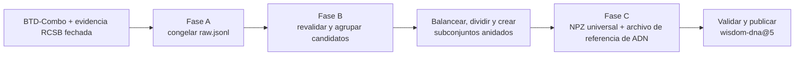
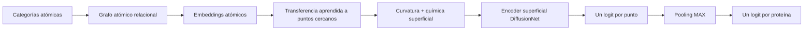

# WISDOM — estructura y aprendizaje superficial de proteínas

[English](README.md) | **Español**

WISDOM estudia si una proteína se une al ADN a partir de su estructura tridimensional. El proyecto
primero construye un conjunto de referencia balanceado con etiquetas positivas y negativas fiables.
Después convierte cada proteína en átomos y puntos de superficie, y entrena modelos que relacionan
la química interna con la superficie expuesta de la molécula.

El preprocesado escribe un archivo NPZ comprimido por proteína. Un NPZ contiene arrays numéricos con
nombre: coordenadas y enlaces atómicos, puntos y normales de la superficie, pequeñas tablas de
vecinos y los operadores necesarios para difundir información sobre esa superficie. Las etiquetas
de ADN se guardan aparte, por lo que el mismo NPZ estructural puede reutilizarse para otra pregunta
científica. La sección 4 presenta cada array antes de introducir sus ecuaciones.

Las tres versiones del modelo responden preguntas distintas. V1 busca la arquitectura básica que
lleva información de los átomos a la superficie. V2 mantiene esa arquitectura y compara formas de
combinar las puntuaciones puntuales en una predicción para la proteína. V3 mantiene la parte atómica
y la combinación final y compara encoders de superficie. El entrenamiento solo utiliza la etiqueta
de la proteína; los puntos donde se conoce contacto con ADN sirven únicamente para medir si el mapa
superficial aprendido tiene sentido.

## 0. Índice

- [1. Inicio rápido](#1-inicio-rápido)
- [2. Instalación](#2-instalación)
  - [2.1. Requisitos](#21-requisitos)
  - [2.2. Instalación automática con Conda](#22-instalación-automática-con-conda)
  - [2.3. Activación, actualizaciones y comprobaciones](#23-activación-actualizaciones-y-comprobaciones)
- [3. Benchmark de unión a ADN y anotaciones](#3-benchmark-de-unión-a-adn-y-anotaciones)
  - [3.1. Por qué la unión a ADN es el primer problema de WISDOM](#31-por-qué-la-unión-a-adn-es-el-primer-problema-de-wisdom)
  - [3.2. Fase A — construcción y congelación de la evidencia de origen](#32-fase-a--construcción-y-congelación-de-la-evidencia-de-origen)
  - [3.3. De la evidencia congelada a un dataset gestionado](#33-de-la-evidencia-congelada-a-un-dataset-gestionado)
  - [3.4. Fase B — diseño de un benchmark balanceado sin fugas](#34-fase-b--diseño-de-un-benchmark-balanceado-sin-fugas)
  - [3.5. Auditoría estadística e interpretación](#35-auditoría-estadística-e-interpretación)
  - [3.6. Fase C — arrays estructurales y referencia superficial](#36-fase-c--arrays-estructurales-y-referencia-superficial)
- [4. Preprocesado estructural](#4-preprocesado-estructural)
  - [4.1. Imagen mental y recorrido completo](#41-imagen-mental-y-recorrido-completo)
  - [4.2. Preparación, ejecución e inspección del dataset](#42-preparación-ejecución-e-inspección-del-dataset)
  - [4.3. De la entrada del manifiesto a coordenadas normalizadas](#43-de-la-entrada-del-manifiesto-a-coordenadas-normalizadas)
  - [4.4. De los átomos normalizados al grafo atómico](#44-de-los-átomos-normalizados-al-grafo-atómico)
  - [4.5. De las esferas atómicas a la geometría superficial](#45-de-las-esferas-atómicas-a-la-geometría-superficial)
  - [4.6. De los puntos superficiales al NPZ final](#46-de-los-puntos-superficiales-al-npz-final)
  - [4.7. Validación, reproducibilidad y ejecución paralela](#47-validación-reproducibilidad-y-ejecución-paralela)
  - [4.8. Arquitectura del código y tests](#48-arquitectura-del-código-y-tests)
  - [4.9. Limitaciones científicas](#49-limitaciones-científicas)
- [5. Modelos entrenables de WISDOM](#5-modelos-entrenables-de-wisdom)
  - [5.1. Índice del dataset y batching de grafos](#51-índice-del-dataset-y-batching-de-grafos)
  - [5.2. Modelos, ecuaciones y formas tensoriales de WISDOMv1](#52-modelos-ecuaciones-y-formas-tensoriales-de-wisdomv1)
  - [5.3. Pooling y diagnósticos de localización de WISDOMv2](#53-pooling-y-diagnósticos-de-localización-de-wisdomv2)
  - [5.4. Comparación de encoders superficiales WISDOMv3](#54-comparación-de-encoders-superficiales-wisdomv3)
  - [5.5. Entrenamiento, evaluación y artefactos](#55-entrenamiento-evaluación-y-artefactos)
  - [5.6. Descubrimiento de conceptos sparse posterior al HPO](#56-descubrimiento-de-conceptos-sparse-posterior-al-hpo)
- [6. Bibliografía](#6-bibliografía)

## 1. Inicio rápido

WISDOM tiene tres acciones ordenadas:

1. `Selection` decide qué proteínas pertenecen a entrenamiento, validación y test.
2. `Preprocessing` convierte esas proteínas en NPZ y publica `wisdom-dna@5`.
3. `Visualization` lee el dataset publicado y crea vistas tridimensionales interactivas.

Las tres acciones se declaran en `experiments/dna_preprocess.yaml`. Su primer argumento es `skip`:
`false` ejecuta una acción y `true` la omite. Los valores incluidos reutilizan un diseño anterior,
ejecutan Preprocessing y solicitan Visualization. La tabla muestra modos más seguros con una sola
finalidad; el YAML conserva sus valores alternativos como comentarios junto a cada paso:

| Acción deseada | `select.skip` | `preprocess.skip` | `visualize.skip` | Entrada necesaria |
|---|---:|---:|---:|---|
| Reconstruir solo la selección | `false` | `true` | `true` | `select.raw_path` apunta a `raw.jsonl`. |
| Reutilizar un diseño completo y construir `wisdom-dna@5` | `true` | `false` | `true` | Configurar `select.existing_design`; el directorio debe contener los splits etiquetados, catálogo, diluciones y el snapshot `structures/index.json`. |
| Visualizar un `wisdom-dna@5` ya publicado | `true` | `true` | `false` | No necesita el diseño; el dataset se resuelve por nombre y versión. |

El flujo completo `true/false/false` puede construir y visualizar una versión nueva con un solo
comando. Visualization recibe `{from: preprocess.dataset}`, así que LambdaForge espera a que termine
la publicación. En el modo de solo visualización se usa `{dataset: wisdom-dna@5}` y esa versión sí
debe existir en el Registry antes de iniciar el flujo.

WISDOM se instala mediante Conda. El instalador del repositorio puede usar una instalación de Conda
existente o instalar Miniforge sin privilegios de administrador, crear el entorno `wisdom` desde
`environment.yml`, obtener un checkout compatible de LambdaForge e instalar ambos proyectos en
modo editable. «Editable» significa que los cambios en el código fuente surten efecto sin volver a
instalar el paquete.

```bash
./install.sh
conda activate wisdom

# Revisa y después prepara el entorno gestionado completo en el clúster de destino.
lf clusters bootstrap citius-ctgpgpu12 --project . --dry-run
lf clusters bootstrap citius-ctgpgpu12 --project .

# Elige primero uno de los modos documentados. Visualizar exige que wisdom-dna@5 ya exista.
lf validate experiments/dna_preprocess.yaml
lf explain experiments/dna_preprocess.yaml
lf run experiments/dna_preprocess.yaml --dry-run
lf run experiments/dna_preprocess.yaml --on citius-ctgpgpu12

lf validate experiments/validate_dna.yaml  # después de publicar wisdom-dna@5
lf validate experiments/wisdom_v1.yaml
lf run experiments/wisdom_v1.yaml --dry-run
lf validate experiments/wisdom_v2.yaml
lf validate experiments/wisdom_v3.yaml

# Después de revisar el ganador del HPO y copiar su artefacto best-model.pt exacto:
lf validate experiments/wisdom_sparse_concepts.yaml
lf run experiments/wisdom_sparse_concepts.yaml --dry-run
```

`validate` comprueba el YAML, los argumentos de los métodos, los imports y las referencias a datos.
`explain` muestra los parámetros resueltos y sus valores por defecto. `run` ejecuta las acciones
activas. El preprocesado solo publica un dataset cuando todos los miembros y el índice son válidos.
Una publicación local tiene esta forma lógica; LambdaForge decide su raíz física:

```text
runs/datasets/published/wisdom-dna/5/<content-id-prefix>/
├── index.jsonl
├── dataset-artifact.json
└── assets/
    ├── <first-protein>/
    │   ├── universal_npz
    │   ├── dna_annotation
    │   ├── source_structure
    │   └── dataset_design/
    │       ├── catalog.csv
    │       ├── preprocessing/{train,val,test}.jsonl
    │       ├── train.txt, validation.txt, test.txt
    │       ├── dilutions/replicate-00/train-<porcentaje>.txt
    │       └── provenance.json
    └── <other-protein>/{universal_npz,dna_annotation,source_structure}
```

`index.jsonl` es el índice del dataset: cada línea identifica una proteína, su partición, categoría
de dificultad (`tier`), etiqueta global de ADN, disponibilidad de referencia local y archivos
(`assets`) con sus huellas SHA-256.
La pertenencia a diluciones es metadata del miembro, así que una vista pequeña reutiliza los mismos
arrays. Los tres manifiestos siguen siendo un contrato previo reutilizable. LambdaForge guarda una
sola vez su catálogo y vistas compactas como el asset `dataset_design` del primer miembro. Las
tablas completas de similitud y el informe estadístico de selección permanecen en la salida
gestionada de `select`, bajo `data/dna/design`, sin prepararse otra vez para generar NPZ.
`dataset-artifact.json` guarda la identidad del contenido y el registro de construcción. Usa
`lf datasets member wisdom-dna@5 MEMBER_ID` para localizar el asset `universal_npz` de un miembro.
La ruta indicada se abre sin pickle así; 4.4–4.6 definen cada array:

```python
import json

import numpy as np

with np.load("/ruta/indicada/por/lambdaforge/universal_npz", allow_pickle=False) as protein:
    atom_positions    = protein["atom_positions"]
    atom_edges        = protein["atom_edge_index"]
    surface_positions = protein["surface_positions"]
    metadata          = json.loads(str(protein["metadata_json"].item()))
```

## 2. Instalación

### 2.1. Requisitos

- Linux o macOS sobre `x86_64`, `aarch64` o Apple Silicon;
- Bash y acceso a Internet para crear inicialmente el entorno y descargar los datos públicos;
- espacio suficiente, local o en el clúster, para archivos de coordenadas, bases de datos de las
  herramientas especializadas, superficies y checkpoints de LambdaForge;
- Conda es opcional antes de instalar: si no existe, `install.sh` ofrece instalar Miniforge en
  `~/miniforge3`;
- no se necesita una GPU NVIDIA para diseñar o preprocesar el dataset. El entrenamiento puede usar
  un entorno CPU o CUDA seleccionado por el perfil de clúster de LambdaForge.

La lista reproducible de paquetes está en [environment.yml](environment.yml). Crea Python 3.11 e
instala Biopython, MMseqs2 y Foldseek desde `conda-forge`/`bioconda`; al instalar WISDOM se resuelven
después las dependencias de Python, entre ellas NumPy, SciPy, scikit-learn, Gemmi, PyTorch,
`robust_laplacian` y LambdaForge. `robust_laplacian` aporta el operador disperso de nube de 4.6;
las secciones 3.2 y 3.4 presentan el papel científico de Gemmi, MMseqs2 y Foldseek.

La tabla `[tool.lambdaforge.environment]` de [pyproject.toml](pyproject.toml) declara ese mismo
`environment.yml` y nombra `mmseqs` y `foldseek` como ejecutables nativos obligatorios. Aquí
«nativo» significa un programa de línea de comandos que no se instala mediante el mecanismo de
paquetes wheel de Python. La declaración forma parte de la identidad del entorno gestionado; no se
repite en cada YAML de experimento.

WISDOM requiere LambdaForge `>=0.14.0` y no fija deliberadamente un límite superior mientras el
proyecto siga la versión actual del framework. Toda acción ejecutable es una subclase directa de
`Work` con un único método `run()`. LambdaForge resuelve files/datasets tipados, mapas acotados,
checkpoints JSON seguros, progreso, publicación inmutable, Registry, logs, recursos, semillas,
búsquedas y ejecuciones. WISDOM conserva la interpretación proteica, la geometría científica, la
validación exacta de NPZ/sidecars y la visualización específica.

### 2.2. Instalación automática con Conda

Clona WISDOM, entra en el repositorio y ejecuta el instalador:

```bash
git clone <URL del repositorio WISDOM>
cd WISDOM
./install.sh
```

El instalador es interactivo para no sustituir un entorno ni escoger un directorio de LambdaForge
sin que el usuario lo vea. En este orden:

1. localiza Conda o propone una instalación de Miniforge limitada al usuario;
2. crea el entorno `wisdom` o propone actualizar el existente con `--prune`;
3. reutiliza `./LambdaForge` o `../LambdaForge`, permite indicar otro checkout o clona el repositorio
   oficial;
4. comprueba que LambdaForge satisface la versión mínima `>=0.14.0`;
5. elimina metadatos editables obsoletos de versiones anteriores de `wisdom-protein` e instala
   LambdaForge y `wisdom[dev]` en modo editable dentro del entorno Conda;
6. opcionalmente comprueba Python, la coherencia de dependencias, LambdaForge, MMseqs2, Foldseek,
   Biopython y el import de WISDOM.

Para aceptar los valores predeterminados sin interacción:

```bash
./install.sh --yes
```

El script no instala paquetes globales del sistema, un controlador NVIDIA ni un toolkit CUDA del
sistema. Si acaba de instalar Miniforge e inicializar la shell, abre un terminal nuevo antes de
activar el entorno.

### 2.3. Activación, actualizaciones y comprobaciones

Activa el entorno en cada terminal nuevo antes de ejecutar WISDOM:

```bash
conda activate wisdom
```

Si Conda aún no está inicializado en la shell actual, carga una vez la ruta que muestra el
instalador o ejecuta `conda init <shell>` y abre un terminal nuevo. Volver a ejecutar `./install.sh`
es la vía prevista para actualizar: permite sincronizar el entorno existente con `environment.yml`,
reutilizar el checkout de LambdaForge elegido y reinstalar ambos proyectos editables.

Estas comprobaciones de solo lectura muestran qué puede ejecutar el entorno:

```bash
python --version
python -m pip check
lf --version
mmseqs version
foldseek version
python -c 'import Bio, gemmi, wisdom; print("Entorno WISDOM correcto")'
```

Para un perfil de clúster con `environment: managed`, prepara el entorno remoto específico del
proyecto desde la raíz del repositorio WISDOM:

```bash
# Inspecciona plataforma, paquetes, ejecutables y conectividad sin cambiar el clúster.
lf clusters bootstrap citius-ctgpgpu12 --project . --dry-run

# Aplica el plan revisado. El comando es idempotente si el entorno ya está completo.
lf clusters bootstrap citius-ctgpgpu12 --project .
lf doctor --on citius-ctgpgpu12
```

`--project .` es importante: indica a bootstrap que lea `pyproject.toml` y `environment.yml` de
WISDOM, construya la wheel de WISDOM y prepare esas dependencias, en lugar de realizar únicamente
un bootstrap genérico del clúster. LambdaForge utiliza su propio ejecutable micromamba verificado
por checksum, por lo que la máquina remota no necesita una instalación global previa de Conda.
Crea un único prefijo inmutable con Python, los paquetes Conda resueltos, LambdaForge, WISDOM y la
versión de PyTorch/CUDA seleccionada; después verifica el inventario Conda y ambos ejecutables
obligatorios antes de permitir reutilizar el entorno. Un `lf run ... --on citius-ctgpgpu12`
posterior descubre automáticamente la misma declaración del proyecto.

`Selection` realiza un segundo preflight inmediato de ejecutables y versiones al principio del
Work, antes de solicitar una estructura a RCSB o iniciar el cálculo de descriptores. Si no se aplicó
el bootstrap, desapareció una herramienta o su comando de versión no funciona, `work.log`
identifica el ejecutable afectado y muestra los comandos exactos para corregirlo localmente o en un
clúster gestionado. El Work posterior `Preprocessing` no necesita MMseqs2 ni Foldseek: consume los
tres manifiestos ya fijados y usa Python/Gemmi, por lo que las herramientas nativas se comprueban
solo antes del paso de selección que las necesita.

LambdaForge 0.14 importa únicamente clases derivadas de `Work`; ya no existen referencias a funciones ejecutables ni
la antigua pila `Task`/`TaskContext`/`PreprocessingTask`. `Selection` usa `self.resume_map` para
reutilizar registros con sus dependencias y `Preprocessing` usa el mismo servicio con validadores
WISDOM para NPZ universales y sidecars de ADN. Ambos emplean cachés gestionadas para coordenadas,
checkpoints validados para tablas especialistas y salidas gestionadas de todo o nada. LambdaForge
también resuelve y ejecuta herramientas externas, captura versiones/logs y proporciona el backend
de clustering HDBSCAN. WISDOM no implementa otro lock de
descarga, protocolo atómico de caché, runner de subprocesos, backend de clustering, Registry ni
publicador. La sección 4.7 explica esta frontera.

## 3. Benchmark de unión a ADN y anotaciones

### 3.1. Por qué la unión a ADN es el primer problema de WISDOM

La primera pregunta de WISDOM es: **¿puede la cadena proteica seleccionada unirse a ADN en un
contexto biológicamente relevante?** Es un buen primer problema porque la unión ocurre en una
superficie tridimensional: el modelo debe relacionar los átomos internos con la forma y la química
expuestas a otra molécula.

Un **benchmark** es una población fija con etiquetas explícitas, particiones de
entrenamiento/validación/test y un protocolo de evaluación. Estas reglas permiten que distintos
modelos respondan a la misma pregunta bajo las mismas condiciones.

La **partición de entrenamiento** ajusta los pesos del modelo. La **partición de validación** compara
configuraciones y elige un checkpoint. La **partición de test** se reserva hasta terminar esas
decisiones y proporciona la estimación final. WISDOM nunca inventa estas particiones al cargar el
modelo.

Cada proteína aceptada tiene asociadas dos respuestas distintas; confundirlas invalidaría el
experimento:

- la **etiqueta global** indica si la proteína completa se considera capaz (`1`) o no capaz (`0`) de
  unirse a ADN;
- la **referencia local** marca los puntos de la superficie que forman una interfaz conocida con
  ADN. También se denomina *ground truth* (GT), es decir, una respuesta de referencia usada para
  evaluar la localización. No se muestra al modelo como entrada ni se usa como objetivo de la
  función de pérdida débilmente supervisada actual.

Una estructura depositada representa solo una situación estudiada experimentalmente. Los
investigadores pueden cristalizar la proteína sola, eliminar regiones flexibles, emplear una
condición sin ADN o depositar solo uno de los estados de un sistema con varias partes. Por tanto,
**«este archivo PDB no contiene ADN» no implica «esta proteína no puede unirse a ADN».** Incluso ver
una proteína cerca del ADN pero sin contacto en un ensamblaje concreto no demuestra que nunca se
una en otras condiciones. WISDOM trata por ello una proteína como *desconocida* mientras no tenga
evidencia positiva o negativa defendible; los registros desconocidos no se transforman en
negativos.

Esto hace que los negativos sean más difíciles que los positivos. Un contacto físico proteína–ADN
respalda un positivo, pero un número finito de estructuras no puede demostrar que una proteína
nunca se una a ADN. WISDOM obtiene su conjunto negativo inicial de **BTD**, el benchmark de Rahman
*et al.* [22]. BTD parte de registros de Swiss-Prot revisados por especialistas, elimina proteínas
anotadas como ligantes conocidos o posibles de ADN/ARN y reduce la redundancia de secuencia. No usa
la ausencia de ADN en una estructura como evidencia negativa.

**BTD-Combo** combina BTD con los benchmarks anteriores PDB1075 y PDB14K y reduce la redundancia en
cada clase. WISDOM usa sus etiquetas como evidencia de origen y añade comprobaciones estructurales
y de contacto porque la evaluación superficial necesita coordenadas. Un negativo queda así bien
curado, pero continúa siendo una etiqueta de benchmark, no una demostración de que la unión sea
imposible en todos los contextos biológicos.

El entrenamiento usa **supervisión débil**: recibe la etiqueta global, mientras que la interfaz
local queda reservada para evaluar. El modelo debe descubrir qué regiones superficiales explican su
decisión sobre la proteína completa.

El flujo completo de selección y preprocesado es:



| Fase | Operación principal | Resultado que recibe la fase siguiente |
|---|---|---|
| A | Reunir etiquetas fiables y estructuras exactas. | Evidencia congelada en `raw.jsonl`; todavía no hay particiones. |
| B | Revalidar, agrupar proteínas relacionadas, balancear, dividir y auditar. | Catálogo fijo, archivos train/validation/test y subconjuntos anidados de train. |
| C | Generar geometría proteica y una referencia de interfaz de ADN separada. | Dataset inmutable validado para entrenamiento y evaluación. |

### 3.2. Fase A — construcción y congelación de la evidencia de origen

La fase A es una preparación que se ejecuta pocas veces. Convierte anotaciones públicas de secuencia
y estructuras experimentales en una tabla fija de candidatos. «Evidencia de origen» significa los
registros reunidos antes de balancear o dividir el conjunto; no significa que sean datos sin
verificar. El diseño y el preprocesado normales reutilizan esa tabla. Para reconstruirla:

```bash
python scripts/create_fasta.py --workers 36
```

La entrada es `scripts/btd_combo.fasta`, una exportación local de BTD-Combo. En FASTA, una línea que
comienza por `>` identifica el registro y las letras siguientes codifican su secuencia de
aminoácidos. El script añade a esos registros una identidad estructural exacta y su evidencia.

La salida es `data/dna/raw/raw.jsonl`, con un objeto JSON por candidato: identificador, cadena,
ensamblaje biológico y copia, etiqueta, evidencia, fuente y secuencia de aminoácidos. Los informes
llaman **población RAW** a esta colección todavía no balanceada. El archivo congelado actual contiene
unos 4.484 candidatos (3.529 positivos y 955 negativos). Es evidencia, todavía no un conjunto de
entrenamiento. `raw.fasta` es solo una vista compatible con herramientas de secuencia.

**A1 — adaptar BTD-Combo a la evaluación de superficies.** BTD-Combo se basa en secuencias, mientras
que WISDOM necesita una cadena tridimensional concreta. El script elimina secuencias ambiguas y
duplicadas y solo acepta un mapeo al **RCSB PDB** cuando coincide la secuencia depositada completa.
RCSB son las siglas de *Research Collaboratory for Structural Bioinformatics*. Su portal es el
centro de datos estadounidense del archivo PDB mundial, la colección pública de estructuras
tridimensionales de macromoléculas [1, 17]. Un identificador como `1ABC_A` representa la cadena A de
la entrada PDB `1ABC`: apunta a coordenadas experimentales, no solo al nombre de una proteína.

La estructura mapeada debe tener resueltos átomos pesados —todos salvo el hidrógeno— para al menos
el 90 % de la secuencia, porque una cadena muy incompleta no permite construir una referencia
superficial fiable. El script reconstruye el **ensamblaje biológico**, la disposición molecular
propuesta como biológicamente activa y no necesariamente el contenido directo de una celda
cristalográfica. Los positivos de BTD solo se conservan si los átomos pesados de la proteína y el
ADN presentan el contacto directo definido matemáticamente en 3.4. Si no aparece ese contacto,
WISDOM no puede obtener la interfaz local basada en coordenadas que necesita y retira el candidato
de este benchmark estructural; no lo convierte en negativo.

Los negativos de BTD siguen una comprobación distinta. Su etiqueta global continúa procediendo del
proceso de curación de BTD explicado en 3.1. WISDOM comprueba que exista una estructura mapeada lo
bastante completa para auditarla y que no contradiga esa etiqueta. Se pone en cuarentena cualquier
negativo cuyo ensamblaje biológico inspeccionado contacte directamente con ADN, además de las
descargas fallidas y auditorías estructurales incompletas. Superar esta comprobación significa
«negativo de BTD sin contradicción en la estructura auditada», no «se ha demostrado
experimentalmente que ningún punto de su superficie puede unirse a ADN». La referencia local de
ceros que se crea después está condicionada a esa etiqueta global aceptada.

**A2 — añadir positivos con interfaces observables.** La segunda fuente es una consulta de RCSB,
congelada por fecha, que busca ensamblajes biológicos experimentales con proteína y ADN. La consulta
solo descubre candidatos: aparecer en el mismo archivo no basta. WISDOM utiliza **Gemmi**, una
biblioteca de biología estructural de código abierto que lee registros PDB/PDBx/mmCIF y aplica sus
operaciones de simetría para construir ensamblajes [3]. Una cadena solo pasa a ser positiva cuando
supera el test de contacto entre átomos pesados de proteína y ADN. Una cadena depositada sin ADN, o
que no lo toca en una estructura que sí lo contiene, permanece desconocida y nunca aporta un
negativo.

**A3 — resolver conflictos y congelar la procedencia.** Una secuencia exacta con etiquetas
incompatibles se pone en cuarentena. El script registra versiones y hashes de las fuentes,
evidencia CSV detallada, `raw.jsonl` tipado y vistas FASTA. El FASTA balanceado solo sirve para
inspección: la fase B siempre lee toda la población RAW para que incluso una proteína omitida pueda
revelar una relación de similitud entre dos proteínas retenidas.

> **Resultado tras la fase A:** cada fila aceptada tiene una fuente de etiqueta, una cadena y un
> ensamblaje RCSB exactos, una secuencia y evidencia reproducible. Todavía no se ha asignado ninguna
> proteína a train, validation o test.

### 3.3. De la evidencia congelada a un dataset gestionado

El paso `select` de [`experiments/dna_preprocess.yaml`](experiments/dna_preprocess.yaml) revalida todos los candidatos RAW,
calcula similitud y descriptores físicos, forma grupos de dependencia y selecciona la población
balanceada que los informes llaman **CANONICAL**. Esta es la población que se divide en particiones.
RAW sigue siendo mayor porque un candidato omitido puede conectar dos
proteínas seleccionadas. El límite de resolución de 4 Å deja un objetivo de 907 miembros por clase
para el RAW actual. Los registros válidos excluidos siguen explicados en `catalog-all.csv`; excluir
significa «fuera del benchmark», no «biológicamente inválido».

Tras finalizar `select`, LambdaForge pasa seis salidas nombradas a `preprocess`: los tres archivos
de partición etiquetados, el catálogo, las diluciones y el snapshot inmutable de coordenadas. La
huella de cada ruta identifica la entrada exacta de la fase C:

```text
data/dna/design/
├── train-labelled.txt
├── validation-labelled.txt
├── test-labelled.txt
├── catalog.csv
├── dilutions/
└── structures/
    ├── index.json
    └── <pdb-id>.cif.gz
```

Los `*-labelled.txt` contienen `RCSB_CHAIN<TAB>ETIQUETA`; por ejemplo,
`1ABC_A<TAB>1`. Definen exactamente qué proteínas y etiquetas entran en cada partición. Dos columnas no
pueden almacenar además el ensamblaje biológico, la copia repetida, la huella de coordenadas, la
evidencia de contacto, el grupo de fuga o el fenotipo. Esa información permanece en `catalog.csv`.

Selection también crea tres JSONL autocontenidos para inspección programática portable. Cada línea
conserva la identidad y etiqueta del TXT junto con todos los campos necesarios del catálogo y sus
diluciones. El pipeline público usa deliberadamente la representación compacta y editable:

- los tres JSONL no necesitan consultar el catálogo;
- los tres `*-labelled.txt` existentes requieren `catalog.csv`, y el directorio opcional
  `dilutions/` recupera las vistas anidadas de entrenamiento.

En ambos casos los archivos de split, no el catálogo, eligen miembros y etiquetas. El catálogo solo
completa la identidad estructural necesaria para reproducir el ensamblaje y la anotación de ADN.
El directorio `structures/` aporta los propios bytes. Selection guarda cada PDB seleccionado una
sola vez aunque se usen varias de sus cadenas.

El archivo se llama `val.jsonl`, pero sus registros mantienen la partición canónica `validation`,
que el entrenamiento expone como `val`. Ningún manifiesto contiene un `structure_path` específico
de una máquina: el preprocesado lo deriva del snapshot portable. Exigir una ruta propia de un
Attempt en `catalog.csv` causaba el fallo anterior y no forma parte del contrato.

Un **Work** de LambdaForge es un paso ejecutable. Una **versión** de dataset identifica contenido
lógico inmutable; un **placement** es una copia física verificada de esa versión en una máquina. El
Registry registra esas copias. El YAML solicita recursos y `workers` limita los registros
concurrentes: reservar 36 CPU no crea por sí solo 36 workers.

LambdaForge 0.14 no tiene una opción `lf run --step`. Se edita el primer parámetro `skip` de cada
paso en el único YAML. La configuración incluida usa `true/false/false`: Selection reenvía el
directorio declarado `data/dna/design`, Preprocessing construye y publica la versión 5 y
Visualization consume la salida denominada `preprocess.dataset`. El tercer paso solo comienza tras
una publicación correcta, por lo que la versión 5 no tiene que existir de antemano. Para ejecutar
solo Visualization se sustituye esa referencia por el selector comentado
`{dataset: wisdom-dna@5}`.

```bash
# Validar y ejecutar la combinación seleccionada.
lf validate experiments/dna_preprocess.yaml
lf explain experiments/dna_preprocess.yaml
lf run experiments/dna_preprocess.yaml --dry-run
lf run experiments/dna_preprocess.yaml --on citius-ctgpgpu12

# En otra terminal, inspeccionar todos los jobs o seguir el log durable de este build.
lf top --history 300
lf logs wisdom-dna-preprocess --follow

# Inspeccionar la versión inmutable y su placement local seleccionado.
lf datasets show wisdom-dna@5
lf datasets stats wisdom-dna@5
lf datasets members wisdom-dna@5 --partition split=train --limit 20
lf datasets verify wisdom-dna@5

# Repetir la auditoría científica completa sin modificar el dataset inmutable.
lf validate experiments/validate_dna.yaml
lf run experiments/validate_dna.yaml --on citius-ctgpgpu12
```

Cuando `select.skip` es true, Selection no descarga, busca similitud, agrupa, balancea ni divide.
Con `existing_design: null` no declara entradas ni salidas del diseño. Si un Preprocessing activo
necesita el diseño previo, se indica el directorio completo en `existing_design` y se restauran las
seis referencias `{from: select.<salida>}`; Selection registra entonces esas rutas sin recalcularlas.
Cuando `preprocess.skip` es true, Preprocessing no lee manifiestos ni publica un dataset.
LambdaForge registra cada entrada, mmCIF y resultado del mapa, así que un reintento compatible
reutiliza validaciones del snapshot y checkpoints por registro. `--restart` descarta los checkpoints
y `--rerun` solicita deliberadamente otra Execution, por lo que no debe usarse solo para continuar.

`existing_design` permanece deliberadamente en `null` cuando `skip=false`. Los
`train-labelled.txt` existentes no modifican una Selection nueva: etiquetas y miembros se vuelven a
calcular desde `raw_path`, y el directorio completo solo se sustituye tras finalizar correctamente.
Declarar además un diseño grande durante la reconstrucción obligaría a LambdaForge a preparar un
directorio de entrada que ningún algoritmo leería.

El Work también copia el resultado completo de forma atómica al `output_directory` configurado. El
YAML lo escribe como `../data/dna/design` porque LambdaForge resuelve las publicaciones desde el
directorio `experiments/`; la ruta resultante del proyecto es `data/dna/design`. `REPORT.md` explica
su auditoría; los archivos `*.txt` contienen IDs
y los `*-labelled.txt` contienen `RCSB_CHAIN<TAB>0|1`. `catalog.csv` es una vista completa cómoda
para auditoría; Selection actual emite además las entradas JSONL autocontenidas equivalentes y el
snapshot exacto de coordenadas comprimidas descrito por `structures/index.json`.

Para disponer del mismo dataset válido en otro clúster se copia la versión inmutable, sin repetir
descubrimiento, mapeo, geometría ni anotación:

```bash
# LambdaForge elige un placement fuente verificado y lo copia al clúster destino.
lf datasets materialize wisdom-dna@5 --on OTRO_CLUSTER --strategy replicate --apply

# O se indican explícitamente origen y destino.
lf datasets replicate wisdom-dna@5 --from citius-ctgpgpu12 --to OTRO_CLUSTER --apply
```

Ambos comandos verifican bytes y registran otro placement. Para reproducir el preprocesado en otro
sitio se transfiere el diseño completo: manifiestos, `catalog.csv`, `dilutions/` y `structures/`.
Una lista de identificadores no puede reproducir las coordenadas auditadas por Selection. `lf top`
muestra el progreso; el log normal anuncia etapas y latidos, y
`verbose: true` añade una línea de inicio/final por registro de evidencia o proteína.

> **Resultado operativo:** las dos primeras acciones crean el diseño autosuficiente y la versión
> inmutable del dataset. Las ejecuciones posteriores pueden reutilizar el diseño completo solo para
> preprocesar; la visualización consume después la versión del Registry sin consultar RCSB.

### 3.4. Fase B — diseño de un benchmark balanceado sin fugas

La fase B valida todo RAW, construye grupos de dependencia, descubre fenotipos físicos, elige
CANONICAL, asigna splits y deriva diluciones de train, en ese orden. Los grupos deben preceder a la
selección: si una proteína B omitida conecta A con C, A y C deben seguir juntas. De otro modo, test
podría contener información ya vista mediante un pariente cercano: una **fuga de datos**. Train
ajusta el modelo, validation guía las decisiones y test se reserva para la estimación final.

**Identidad y revalidación estructural.** Cada fila JSONL indica identificador, ensamblaje, copia,
evidencia de etiqueta, origen, fuente y secuencia. Para cada entrada PDB, un worker acotado descarga
o reutiliza el mmCIF, verifica su hash SHA-256, reconstruye ese ensamblaje biológico y selecciona la
copia declarada. Así no se confunde una cadena del mismo nombre situada en otra copia del
ensamblaje con el mismo objeto físico.

Para un átomo pesado proteico $p$ y otro de ADN $d$, sean $x_p$ y $x_d$ sus centros cartesianos en
ångströms y $r_p$ y $r_d$ sus radios de van der Waals específicos del elemento. Hay contacto directo si

$$
\lVert x_p-x_d\rVert_2 < r_p+r_d+0.5\ \text{Å}.
$$

La norma es la distancia recta. Los 0,5 Å toleran pequeñas incertidumbres de coordenadas alrededor
de las envolventes atómicas; no implican un enlace covalente. Un índice espacial KD-tree evita
comparar cada átomo proteico con cada átomo de ADN. Cada positivo RAW debe reproducir un contacto en
su ensamblaje/copia exactos. La auditoría conserva secuencia, cobertura, método experimental,
resolución, año, tamaño, forma, composición y descriptores de interfaz.

En rayos X y cryo-EM, una resolución mayor significa menos detalle espacial. Las estructuras peores
que el límite predeterminado de 4 Å permanecen en los grupos de dependencia, pero no pueden entrar
en CANONICAL. Los registros sin una resolución numérica comparable, como muchos modelos de NMR,
siguen siendo elegibles en vez de recibir un valor inventado. Cada exclusión aparece en
`quality-exclusions.txt` y `selection-audit.json`.

**Los grupos de fuga usan todos los candidatos RAW.** **MMseqs2** encuentra similitud de secuencia;
**Foldseek** encuentra similitud entre plegamientos tridimensionales que puede persistir cuando las
secuencias divergen. Ambas relaciones pueden hacer dependientes dos ejemplos.

Una arista de dependencia no afirma igual función; solo prohíbe separar el par. MMseqs2 exige
identidad ≥ 0,30, cobertura bidireccional ≥ 0,80 y E-value ≤ 0,001. La identidad es la fracción
coincidente del alineamiento, la cobertura es la fracción alineada de cada secuencia completa y un
E-value menor indica menos coincidencias esperadas por azar. Foldseek exige probabilidad ≥ 0,90,
TM-score normalizado y cobertura ≥ 0,75 y 0,80 en ambas direcciones, y E-value ≤ 0,001. Las
Las secuencias exactas y, por defecto, una misma entrada PDB añaden aristas duras.

Las componentes conexas de la unión de todas las aristas son **grupos de fuga** indivisibles. Así,
A–B y B–C mantienen juntas A, B y C aunque no exista arista A–C. Es una restricción de seguridad,
no una asignación de familia biológica. Las salidas crudas, aristas aceptadas, razones, versiones,
comandos y umbrales quedan en `clusters/` y `provenance.json`.

**Los fenotipos físicos miden representación.** A diferencia de los grupos de fuga, los grupos de
fenotipo describen perfiles medidos parecidos; no definen independencia ni funciones biológicas.
Los globales usan tamaño, forma, composición y compacidad. Los de
interfaz positiva usan densidad de contacto, extensión, número de regiones y composición
contactada. Ayudan a repartir la diversidad observada, pero nunca rompen un grupo de fuga ni se
usan como entrada del modelo.

Antes de HDBSCAN se escala robustamente cada columna finita $j$. Si $x_{ij}$ es el descriptor $j$
de la proteína $i$, $\operatorname{median}_j$ es la mediana de ese descriptor e
$\operatorname{IQR}_j$ es su percentil 75 menos su percentil 25,

$$
z_{ij}=\frac{x_{ij}-\operatorname{median}_j}{\operatorname{IQR}_j}.
$$

El escalado por mediana/IQR limita el efecto de tamaños extremos. **HDBSCAN** encuentra regiones
densas sin fijar antes el número de grupos y marca proteínas aisladas como **ruido**. Aquí ruido
significa «sin grupo denso estable», no «corrupta» ni «negativa». Es preferible a forzar una
estructura excepcional dentro de una familia arbitraria.

La elongación de interfaz
se mide dentro de su plano. Si `s1 >= s2 >= s3` son las dispersiones espaciales principales de los
centros de residuos contactantes, la razón es `s1/s2`; `s3` mide el grosor de la lámina y no se usa
como denominador. Una interfaz casi colineal con `s2` próxima a cero queda no disponible. Así se
evitan razones artificiales cercanas a mil millones del informe preliminar, causadas por dividir
una lámina plana por su grosor casi nulo.

**Selección CANONICAL y splits fijos.** Tras fijar grupos de todo RAW, elegibilidad por calidad y
fenotipos, el valor por defecto conserva todos los negativos elegibles y elige el mismo número de
positivos. Preserva core positivos y aumenta cobertura de
grupos, fenotipos y origen, y desempata con SHA-256 y semilla.
catalog-all.csv conserva RAW; catalog.csv, CANONICAL; selection-audit.json explica los recuentos y
omitted-positives.txt enumera positivos válidos innecesarios para el ratio solicitado.

Un objetivo greedy determinista asigna grupos completos hacia 70% train, 15% validation y 15% test,
penalizando desviaciones de tamaño, clase, fenotipo y origen. Como condiciones duras, cada grupo
ocupa un split y validation/test tienen ambas etiquetas.
train.txt, validation.txt y test.txt son vistas solo con ID de las asignaciones de catalog.csv e
index.jsonl. Sus archivos hermanos `-labelled.txt` añaden una etiqueta binaria separada por tabulador
y se comprueban contra el catálogo. Cada dilución de train contiene las dos vistas.

De forma precisa, para el split $s$, sea $f_s$ su fracción solicitada, $n_s$ su tamaño
observado y $n$ el tamaño canónico. Para una categoría $k$—etiqueta, fenotipo u origen
positivo—sean $n_{s,k}$ y $n_k$ sus recuentos en el split y la población. El optimizador
minimiza una suma cuyos términos de recuento tienen la forma

$$
J_{count}=\sum_s w_{size}\left(\frac{n_s-f_sn}{\max(f_sn,1)}\right)^2
+\sum_s\sum_k w_k\left(\frac{n_{s,k}-f_sn_k}{\max(f_sn_k,1)}\right)^2.
$$

La implementación da más peso a los términos de clase que a los de fenotipo u origen. Elevar al
cuadrado penaliza más las desviaciones grandes y normalizar impide que una categoría frecuente
domine solo por tener más miembros. El algoritmo mantiene contadores incrementales: colocar un
grupo no vuelve a recorrer todo el dataset. Son preferencias blandas de balanceo, nunca permiso
para romper un grupo de fuga.

**Curvas de aprendizaje anidadas.** Las diluciones solo cambian train y conservan grupos completos:
`train-10` está contenido en `train-25`, después `train-50`, hasta `train-100`. Los tamaños exactos
pueden desviarse porque los grupos son indivisibles. Validation y test no cambian.

> **Resultado tras la fase B:** miembros, etiquetas, grupos de fuga, asignaciones de
> train/validation/test y subconjuntos anidados de entrenamiento quedan fijados y auditados. La fase
> C puede añadir geometría, pero no modificar estas decisiones.

### 3.5. Auditoría estadística e interpretación

La fase B termina con una auditoría estadística compacta. `REPORT.md`, los CSV y la evidencia JSON
se generan a partir de los mismos resultados, de modo que el texto y los valores legibles por
programas describen la misma población. Responde cuatro preguntas:

- **balance:** ¿aparecen positivos y negativos en las proporciones previstas en cada partición y
  dilución de entrenamiento?;
- **fugas:** ¿cruza entre entrenamiento, validación y test alguna secuencia exacta, relación de
  similitud estructural o de secuencia aceptada, grupo PDB o componente de dependencia completo?;
- **representación:** ¿conservan las particiones las formas globales y de interfaz observadas
  descubiertas en la fase B, en vez de reservar accidentalmente un tipo de proteína para test?;
- **diluciones:** ¿está cada train pequeño contenido en todos los mayores y compuesto solo por
  grupos de fuga completos?

`design-summary.json` registra los recuentos exactos por split, clase, origen y fenotipo. Informa
una advertencia si un split difiere en más de diez puntos porcentuales entre clases, si un grupo de
fuga RAW contiene al menos el 5% de los candidatos o si un fenotipo estable falta en un split pese a
aparecer en varios grupos indivisibles. Una advertencia requiere interpretación; un fallo duro
(identidad duplicada, grupo cruzado, clase ausente, dilución no anidada o grupo fragmentado) impide
publicar. La cobertura fenotípica sigue siendo un objetivo blando de representatividad porque la
mera presencia de tres grupos no demuestra que puedan satisfacerse simultáneamente todas las
restricciones de clase, grupo y fenotipo. `REPORT.md` explica esos mismos valores en lenguaje ordinario. No
afirma estabilidad ARI, AUROC técnico, SMD, KS ni V de Cramér porque la selección simplificada no
calcula esos análisis.

### 3.6. Fase C — arrays estructurales y referencia superficial

La fase B fijó miembros, etiquetas y particiones, pero no creó la geometría para el modelo. La fase C
escribe dos archivos separados por proteína: un **NPZ universal** con átomos y superficie, y un
archivo complementario de ADN, llamado **sidecar**, ligado a la huella y al orden de puntos de ese
NPZ. El NPZ no contiene etiquetas, particiones, ADN ni objetivos, por lo que otra tarea puede reutilizarlo sin información del benchmark. El
dataset actual deriva cada sidecar positivo de coordenadas de ADN observadas; nunca sustituye en
silencio la ruta de compatibilidad con máscaras de residuos DyProL. La sección 4 deriva los arrays
universales.

Si $s'_i$ es el punto centrado almacenado y $o$ es `coordinate_origin`, la coordenada fuente es
$s_i=s'_i+o$. Para el átomo de ADN $j$, $x_j$ es su centro y $r_j$ su radio de van der Waals
tabulado por Gemmi. La separación física es

$$
d_i=\min_j\left(\lVert s_i-x_j\rVert_2-r_j\right).
$$

Restar el radio transforma distancia entre centros en una aproximación a la distancia desde el
punto superficial a la envolvente de van der Waals del ADN. Con $a=1,4$ Å y $b=3,0$ Å:

$$
y_i^{hard}=\mathbb{1}[d_i\leq a],\qquad
m_i=\mathbb{1}[d_i\leq a\ \lor\ d_i\geq b].
$$

$\mathbb{1}$ vale uno cuando se cumple la condición. `surface_target_hard` almacena
$y_i^{hard}$ y `surface_valid_mask`, $m_i$. Los puntos $a<d_i<b$ forman una banda ambigua:
siguen visibles pero no participan en métricas binarias. Definiendo
$t_i=\operatorname{clip}((d_i-a)/(b-a),0,1)$, el objetivo continuo es

$$
y_i^{soft}=\frac{1+\cos(\pi t_i)}{2}.
$$

Vale uno en la interfaz segura, cero más allá del negativo seguro y cambia suavemente entre ambos.
El sidecar guarda además distancia, máscara de distancia válida, objetivos para umbrales de
sensibilidad, los umbrales, JSON de procedencia y SHA-256 del NPZ base. Los negativos curados tienen
objetivo cero en todo punto válido. Su distancia al ADN no puede calcularse: aparece como NaN solo
donde `surface_distance_valid` es falso, nunca como una distancia cero ficticia.

El sidecar también es un NPZ sin pickle. Aquí `M` es el número de puntos de la superficie base y
`T`, el número de umbrales de sensibilidad configurados. Las máscaras booleanas indican si un valor
puede usarse; siempre deben consultarse antes de interpretar una distancia o un objetivo local.

| Array del sidecar | Forma | Dtype | Significado |
|---|---:|---|---|
| `surface_target_hard` | `[M]` | `uint8` | Target binario de contacto con la separación positiva principal. |
| `surface_valid_mask` | `[M]` | booleano | Puntos aptos para las métricas locales principales. |
| `surface_target_soft` | `[M]` | `float32` | Target suave entre las separaciones positiva y negativa. |
| `surface_distance_to_dna` | `[M]` | `float32` | Separación a la envolvente del ADN en Å, o NaN si no existe. |
| `surface_distance_valid` | `[M]` | booleano | Si la distancia correspondiente tiene significado. |
| `surface_target_hard_sensitivity` | `[M,T]` | `uint8` | Targets binarios para cada umbral de sensibilidad. |
| `local_gt_available` | escalar | booleano | Si la proteína tiene referencia local utilizable. |
| `sensitivity_gaps` | `[T]` | `float32` | Umbrales de sensibilidad en Å, en orden de columna. |
| `base_npz_sha256` | escalar | Unicode fijo | Huella del NPZ universal exacto y de su orden de puntos. |
| `annotation_metadata_json` | escalar | Unicode fijo | Asamblea, umbrales, método, conteos y procedencia. |

Para registros DyProL importados por separado, la ruta de compatibilidad asigna a cada punto la
máscara de su residuo representado más cercano y registra
`local_gt_method=binding_residue_mask`. No posee umbrales de sensibilidad por distancia y no se usa
en `wisdom-dna@5`.

La elegibilidad global y local son distintas. Un positivo fiable puede entrenar con su etiqueta
global aunque no tenga referencia local utilizable. Si no se etiqueta ningún punto superficial,
mantiene `label=1`, recibe una máscara local inválida, queda fuera de las métricas de localización y
se restringe a train; nunca se convierte en una superficie negativa. Las diluciones reutilizan los
mismos bytes NPZ/sidecar y no modifican validation ni test.

Con pesos adimensionales de área representada $w_i>0$, normalizados para sumar uno, se guardan

$$
W_+=\sum_i w_i y_i^{hard},\qquad
W=\sum_i w_i=1,\qquad
f_{interface}=W_+/W.
$$

Son peso representado positivo, peso normalizado total y fracción de interfaz, no áreas físicas en
Ų. Las componentes conexas positivas de la tabla superficial acotada proporcionan
`number_of_positive_regions`, permitiendo estudiar tamaño y regiones sin cambiar el entrenamiento
weakly supervised.

Antes de publicar, el destino rechaza arrays objeto, longitudes incompatibles, máscaras o
probabilidades inválidas, valores de ausencia de distancia incorrectos y discrepancias de huella
NPZ/sidecar. `index.jsonl` registra después la partición, los objetivos, estadísticas y NPZ, sidecar y
estructura fuente con checksum de cada miembro. Las rutas relativas hacen movible la versión; su ID
de contenido depende de miembros y bytes exactos, no del equipo ni del clúster.

> **Resultado tras la fase C:** cada miembro publicado tiene una representación proteica sin
> etiquetas y reutilizable, un sidecar de evaluación de ADN verificado por separado, metadata de
> split fija y procedencia con checksum. Este es el dataset que consume el entrenamiento de WISDOM.

## 4. Preprocesado estructural

El preprocesado convierte archivos de coordenadas destinados a la biología estructural en arrays
numéricos que podrá consumir un modelo de machine learning posterior. Esta sección sigue la
conversión en el mismo orden que el programa. Cada subsección presupone únicamente los conceptos
introducidos antes.

### 4.1. Imagen mental y recorrido completo

**De una proteína física a un archivo de coordenadas.**

Una proteína es una molécula física formada por átomos. Los experimentos y los programas de
predicción estructural no entregan a WISDOM la molécula física, sino un **archivo de coordenadas**.
Este archivo es una tabla estructurada que describe nombres atómicos, elementos químicos y posiciones
tridimensionales. La posición de un átomo es una terna `(x,y,z)` medida en ångströms; un ångström
(Å) equivale a `10^-10 m`.

Los archivos estructurales organizan los átomos en una jerarquía:

- un **átomo** es un elemento químico situado en una posición;
- un **residuo** es un bloque químico, normalmente un aminoácido, que contiene varios átomos;
- una **cadena** es una secuencia ordenada de residuos;
- un **modelo** es una interpretación completa de las coordenadas. Un archivo puede contener varios
  modelos, por ejemplo conformaciones experimentales alternativas.

Las dos familias de formatos admitidas son PDB y PDBx/mmCIF. Codifican ideas estructurales parecidas
con sintaxis diferentes. WISDOM delega su lectura en Gemmi en vez de interpretar manualmente el
texto. Los archivos `.gz` contienen el mismo texto PDB o mmCIF tras descomprimir gzip; gzip cambia el
tamaño de almacenamiento, no el significado molecular.

**Por qué el dataset comienza con un manifiesto TXT.**

Un dataset científico puede mezclar entradas públicas del Protein Data Bank con estructuras
privadas o generadas localmente. Copiarlas todas a un directorio único dificultaría mover, auditar y
reproducir el dataset. Por eso WISDOM parte de un pequeño **manifiesto**: un TXT donde cada línea no
comentada indica de dónde procede una proteína.

La línea puede ser un identificador PDB público como `4hhb_A`, y entonces WISDOM puede obtener el
archivo desde RCSB PDB, o una ruta local como `../structures/model.cif.gz`. El manifiesto es la
definición ordenada del dataset; los archivos de coordenadas son sus entradas físicas. Esta separación
permite reutilizar una caché, descargar entradas públicas ausentes y notificar el fallo de una
proteína sin perder los resultados correctos de las demás.

**Por qué WISDOM usa tres representaciones geométricas diferentes.**

Un modelo geométrico posterior necesita algo más que una tabla desordenada de átomos: necesita saber
qué objetos pueden intercambiar información. WISDOM representa esos intercambios posibles mediante
**grafos**. Un grafo es un conjunto de nodos y un conjunto de aristas; una arista indica que dos nodos
están relacionados. La arista no es por sí sola una fuerza química ni un mensaje aprendido, sino una
conexión estructural fija sobre la que podrá operar un modelo futuro.

Las tres relaciones no tienen el mismo significado físico, por lo que WISDOM no las fuerza a ser
listas genéricas de aristas:

1. El **grafo atómico** usa átomos como nodos. Los enlaces químicos son relaciones discretas, por lo
   que conserva todos los enlaces covalentes necesarios. El contexto espacial se limita a los
   `Kmax` átomos más próximos dentro de un corte físico y evita un grafo por radio denso.
2. La **tabla átomo→superficie** asigna a cada punto los `Jmax` átomos más próximos dentro de un
   corte físico. Es una vecindad local rectangular y enmascarada, no un enlace químico. El modelo
   elige cualquier prefijo `J<=Jmax` sin repetir el preprocesado.
3. Los **operadores diferenciales superficiales** describen cómo se extiende un valor escalar por la
   frontera muestreada y cómo cambia a lo largo de ella. Cumplen el papel que tienen las derivadas
   sobre una superficie lisa. DiffusionNet los usa directamente, por lo que no necesita enviar un
   mensaje aprendido por cada pareja de puntos cercanos.

La salida NPZ contiene medidas fijas, vecindarios acotados y operadores numéricos deterministas,
pero no activaciones neuronales, embeddings, valores de atención ni predicciones.

**El recorrido completo de los datos.**

Con esos objetos en mente, una línea del manifiesto sigue este recorrido:


Cada flecha consume el resultado inmediatamente anterior. La sección 4.2 explica cómo ejecutar e
inspeccionar el recorrido. Las secciones 4.3–4.7 vuelven sobre las mismas flechas con detalle
científico y matemático.

### 4.2. Preparación, ejecución e inspección del dataset

`Selection` escribe su directorio de auditoría bajo `data/dna/design`. Las entradas más sencillas
para el preprocesado son `train-labelled.txt`, `validation-labelled.txt` y `test-labelled.txt`. Cada
línea contiene un identificador, un tabulador y su etiqueta binaria. `catalog.csv` aporta el
ensamblaje, grupo de fuga, fenotipo y evidencia que no caben en esas dos columnas. Las ejecuciones
nuevas de Selection también crean `preprocessing/{train,val,test}.jsonl`, donde cada línea es un
objeto JSON que ya contiene el registro completo. Preprocessing admite ambas representaciones.

Los manifiestos indican **qué** proteínas se procesan; el snapshot `structures/` indica **qué bytes
exactos de coordenadas** fueron aprobados. Por ello, un diseño completo reutilizable también contiene
`structures/index.json` y un mmCIF comprimido por entrada PDB seleccionada. Si faltan esos archivos,
se debe repetir Selection una vez, en lugar de descargar estructuras actuales y tratarlas como si
fueran la evidencia original.

El directorio `data/dna/design` presente actualmente en este workspace se generó antes de añadir los
snapshots estructurales. Sus TXT etiquetados y el catálogo todavía permiten auditar los miembros,
pero el directorio no puede construir por sí solo el esquema 3.0 porque carece de
`structures/index.json`. Ejecuta Selection una vez con el código actual para crear un diseño
completo; los preprocesados posteriores compatibles podrán reutilizarlo sin consultar RCSB.

Cuando Selection se ejecuta en un clúster, su `output_directory` opcional se escribe en el espejo
del proyecto de ese clúster; LambdaForge no copia silenciosamente un directorio de varios gigabytes
de vuelta al equipo local. Una entrada posterior `{file: ../data/dna/design}` exige por ello que las
copias local y remota contengan exactamente los mismos nombres y bytes. La huella del directorio usa
rutas relativas y contenido, no fechas. Si Selection creó el snapshot completo en remoto, se
sincroniza una vez ese directorio al equipo local antes de omitir Selection. La copia se prepara en
otro directorio y solo se renombra como `data/dna/design` después de completar la transferencia;
enviar el Work mientras el directorio activo sigue creciendo registra una copia parcial. Esta
comprobación evita combinar por accidente manifiestos locales con otro snapshot remoto de
coordenadas.

Los archivos están separados para que los papeles supervisados sean visibles, pero Preprocessing
concatena sus registros y deduplica los PDB antes de generar geometría. La geometría molecular no
depende de etiqueta o split, así que cada identificador se procesa una vez. Split y etiqueta entran
solo en `members.jsonl` y en los metadatos del sidecar, nunca en el NPZ universal.
`preprocessing-report.json` aporta el join exacto `identifier -> NPZ`. La validación demuestra que
los manifiestos son disjuntos y que cada miembro conserva etiqueta, grupo de fuga y split.

**Entradas remotas.**

```text
1abc
4hhb_A
4hhb_AB
4hhb_A_B
```

El código de cuatro caracteres `4hhb` es el identificador público asignado por el Protein Data Bank.
Un guion bajo introduce el selector opcional de cadenas descrito en 4.1. Cada campo separado por
guiones bajos contiene un nombre de cadena completo: `4hhb_AB` conserva la única cadena llamada
`AB`, mientras que `4hhb_A_B` conserva dos cadenas llamadas `A` y `B`. Esto importa porque
PDBx/mmCIF permite nombres de cadena de varios caracteres. Las comas y la antigua forma `#A,B` son
inválidas. El selector de la línea es específico de esa proteína y prevalece sobre el ajuste global
`config.chains`.

**Estructuras locales.**

```text
/data/protein.pdb
/data/protein.pdb.gz
/data/protein.cif
/data/protein.mmcif
/data/protein.cif.gz
../structures/protein.mmcif.gz
```

Las rutas relativas se resuelven respecto a su TXT. El nombre local es opaco: `_AB` **no** selecciona
cadenas; quien llama usa en su lugar la configuración global `chains`. Esta gramática local pertenece
al componente estructural reutilizable y sus tests. El diseño WISDOM-DNA de producción solo usa IDs
RCSB verificados. Cualquier Work personalizado futuro que exponga rutas locales debe prepararlas
como entradas de archivo tipadas de LambdaForge, para que sus bytes participen en la huella del Work y
no se reutilice silenciosamente un resultado creado con otras coordenadas.

Solo se aceptan `.pdb`, `.cif`, `.mmcif` y sus variantes comprimidas con gzip. BinaryCIF, MMTF, XML,
trayectorias y contenedores de archivos quedan fuera del contrato actual.

**Configuración y ejecución.**

[`experiments/dna_preprocess.yaml`](experiments/dna_preprocess.yaml) es la entrada pública de datos
de ADN. Contiene `select`, `preprocess` y `visualize`; el primer parámetro de cada paso es `skip`.
Reutilizar Selection requiere el diseño completo existente y `raw_path: null`; las referencias
actuales pasan sus seis salidas con nombre a Preprocessing. El modo completo incluido usa
`true/false/false` y entrega `{from: preprocess.dataset}` a Visualization. Solo preprocesado usa
`true/false/true`. Solo visualización usa `true/true/false`, deja nulos el diseño y las entradas de
preprocesado y cambia el valor de dataset por el selector comentado `{dataset: wisdom-dna@5}`.
Ninguna forma contiene una ruta física al dataset.

```bash
lf validate experiments/dna_preprocess.yaml
lf explain experiments/dna_preprocess.yaml
lf run experiments/dna_preprocess.yaml --dry-run
lf run experiments/dna_preprocess.yaml
```

`validate` detecta argumentos incorrectos, referencias de salida inválidas, evidencia RAW ausente y
callables no disponibles.
`explain` muestra la firma del Work y sus valores configurados/defaults. `--dry-run` no envía jobs
ni transforma proteínas. El último comando genera geometría y anotaciones para el diseño fijo y
solo publica tras validar el índice.

El `Preprocessing.run()` central se lee como cinco etapas: splits, validación del snapshot, geometría,
sidecars y, por último, validación con publicación. Los módulos hermanos contienen cada operación detallada. Dentro
de geometría, `ProteinSource` asigna claves, `ProteinPreprocessor` construye una representación y
`ProteinSink` escribe/revalida su NPZ. LambdaForge gestiona mapas acotados, checkpoints JSON por
elemento, progreso, Attempts, caché e identidad final.

**Referencia de configuración.** «Valor en este YAML» indica la elección incluida, no necesariamente
el valor por defecto de Python. Los valores por defecto exactos y rangos admitidos siguen
documentados junto a cada sección del YAML.

| Parámetro | Valor en este YAML | Significado |
|---|---:|---|
| Tres campos `skip` | `true`; `false`; `false` | Reutiliza la salida de Selection, ejecuta Preprocessing y visualiza su dataset después de publicarlo. |
| `select.existing_design` | `{file: ../data/dna/design}` | Directorio completo de una Selection previa que se reenvía sin recalcular. Se usa null al visualizar solamente o al reconstruir Selection. |
| `train`; `validation`; `test` | `{from: select.train}` y salidas equivalentes | Tres JSONL completos o tres archivos `identificador<TAB>etiqueta`. El flujo actual recibe las salidas etiquetadas reenviadas por `select`. |
| `catalog` | `{from: select.catalog}` | Necesario con TXT etiquetados; aporta ensamblaje, contacto, grupo, fenotipo y evidencia de origen. |
| `dilutions` | `{from: select.dilutions}` | Directorio de vistas `replicate-*/train-*-labelled.txt` guardadas como subsets del dataset. |
| `structures` | `{from: select.structures}` | Snapshot de Selection con un mmCIF comprimido exacto por PDB seleccionado y su `index.json`. Los tres TXT etiquetados no lo sustituyen. |
| `dataset_name` | `wisdom-dna` | Nombre gestionado estable pasado a `self.outputs.dataset`. |
| `dataset_version` | `5` | Release inmutable del esquema 3; cambiar bytes intencionadamente exige otro valor. |
| `include_full_train` | `true` | Incluye todos los miembros del entrenamiento canónico. Se pone a false para construir solo diluciones concretas. |
| `train_dilutions` | `[]` | Unión de vistas que se conservarán, por ejemplo `[replicate-00/train-25]`; se filtra antes de calcular geometría. |
| `include_validation`; `include_test` | `true`; `true` | Incluye cada split de evaluación fijo. Un dataset para HPO suele conservar validación y omitir test. |
| `workers` | `36` | Procesos creados por registro, normalmente uno por CPU solicitada. |
| `requests_per_second` (Selection) | `60,0` | Peticiones RCSB por segundo durante el diseño; Preprocessing no descarga. |
| `verbose` | `false` | Añade líneas por registro; el modo normal mantiene resúmenes y latidos. |
| `retries` (Selection) | `5` | Intentos HTTP adicionales ante un fallo durante el diseño. |
| `progress_log_seconds` | `120,0` | Intervalo del aviso de actividad; `lf top` conserva el recuento exacto. |
| `surface_resolution`; `probe_radius` | `1,0`; `1,4` Å | Separación superficial y radio de sonda. |
| `atom_spatial_radius`; `atom_spatial_k_max` | `6,0 Å`; `32` | Corte atómico físico y mayor presupuesto de vecinos espaciales ordenados guardado una vez. |
| `surface_atom_radius`; `surface_atom_k_max` | `6,0 Å`; `32` | Corte físico de transferencia y anchura máxima de la tabla de átomos próximos. |
| `diffusion_spectral_modes_max`; `surface_neighbor_k_max` | `128`; `24` | Máximo de modos de baja frecuencia y vecinos acotados para operadores diferenciales. |
| `curvature_scales` | `1,5, 2,5, 5,0, 7,5, 10,0` | Superset ordenado de radios en unidades de resolución; conserva las escalas históricas 2,5/5,0. |
| `positive_gap`; `negative_gap` | `1,4`; `3,0` Å | Fronteras seguras de distancia positiva/negativa al ADN. |
| `sensitivity_gaps` | `1,0, 1,4, 2,0` Å | Fronteras positivas alternativas solo de evaluación. |
| `dataset` de visualización | `{from: preprocess.dataset}` | Consume el dataset producido antes en este flujo. Para ejecutar solo Visualization se usa `{dataset: wisdom-dna@5}`, que resuelve una versión existente del Registry. El valor por defecto de Python es null. |
| `identifiers`; `splits`; `labels` | `()`; los tres splits; `(0,1)` | Los IDs exactos sustituyen el muestreo; en otro caso la galería recorre estratos split/clase determinísticamente. |
| `maximum_proteins` | `12` | Tamaño automático; cero renderiza todos los miembros elegibles. Los IDs explícitos nunca se truncan. |
| `maximum_surface_points`; `maximum_mesh_points` | `6000`; `2500` | Límites del navegador para la nube autoritativa y la malla alpha-complex diagnóstica construida antes de abrir la página. |
| `maximum_edges`; `normal_stride`; `normal_length` | `5000`; `25`; `1,5` Å | Límites visuales de grafos y normales. |
| `mesh_alpha` | `4,0` Å | Máximo radio de la esfera circunscrita de un tetraedro de Delaunay conservado; solo cambia la malla diagnóstica. |
| `maximum_vdw_atoms` | `1500` | Límite determinístico de icosaedros con radio físico; todos los átomos siguen siendo seleccionables como marcadores. |
| `resources` | `36 CPU, 120 GiB, 100 GiB storage, 24 h` | Reserva de geometría/anotación. |
| `model_index`; `chains` | `0`; `[]` | Selecciona un modelo de coordenadas, empezando en cero, y opcionalmente cadenas concretas. Una cadena escrita en el identificador prevalece. |
| `include_hydrogens`; `include_waters` | `false`; `false` | Conserva hidrógenos explícitos o agua cristalográfica. WISDOM nunca inventa hidrógenos ausentes. |
| `include_nonpolymer`; `include_metals` | `false`; `false` | Conserva ligandos/otros no polímeros o metales en vez de restringir la geometría a la proteína. |
| `center_coordinates` | `true` | Resta el centroide de los átomos elegidos y guarda el origen retirado para poder recuperar las coordenadas fuente. |

`surface_resolution` controla densidad de candidatos, voxel y escalas de los operadores. Las
escalas de curvatura sí son configurables: un valor `s` ajusta un triplete `[H,K,C]` dentro del radio
`s h`, donde `h=surface_resolution`. Añadir o quitar escalas cambia `surface_curvatures` de
`[M,S,3]` al nuevo número `S`. No hay que editar manualmente ninguna anchura: el entrenamiento la
deriva del prefijo de escalas y de si usa curvatura media, gaussiana, *curvedness* e índice de forma,
y rechaza splits incompatibles.

Preprocessing puede publicar la población completa o una versión experimental menor. Para train25
más validación completa y sin test, se configuran `include_full_train: false`,
`train_dilutions: [replicate-00/train-25]`, `include_validation: true` e `include_test: false`, y se
elige un `dataset_version` nuevo. `DatasetManifests` resuelve esa población antes de iniciar la
geometría. Forma un conjunto único de IDs: una proteína presente en train10 y train25 se procesa una
vez y ambas vistas apuntan al mismo NPZ. No se crea NPZ ni sidecar de test. Los tres manifiestos se
leen para comprobar el diseño fijo, pero un miembro excluido nunca llega a validar estructura ni a
calcular geometría.

El preprocesado estructural no aprende estadísticas de normalización dependientes de la población:
centra cada proteína por separado y usa escalas definidas físicamente. Por ello no puede filtrar
estadísticas de validación o test. El interpretador sparse de 5.6 es el único componente nuevo que
estima media y desviación de todo un conjunto, y las ajusta exclusivamente con la vista de train.

Al publicar el dataset completo, la pertenencia a diluciones es metadata del miembro, no otra copia
de los arrays pesados. El modelo elige `subset: full` o, por ejemplo,
`subset: replicate-00/train-25`. Validación y test no se diluyen. Si una versión selectiva no contiene
test, su YAML de entrenamiento debe usar `evaluate_test: false`.

Los campos de ejecución y los científicos están separados deliberadamente. Cambiar `workers`, la
tasa de descarga, los reintentos, el intervalo de progreso o los recursos solicitados cambia cómo se planifican los
mismos registros; no debe cambiar sus bytes NPZ ni la identidad del dataset. Cambiar un campo
científico modifica la geometría e invalida la reutilización. `PreprocessConfig` ya no contiene
rutas, números de workers, flags de reanudación ni política de fallos.

Durante cada fase paralela larga, `lf top` muestra el contador exacto completado/total de LambdaForge.
El log del Work emite además un aviso breve cada `progress_log_seconds`, de modo que una proteína
lenta no haga parecer que el job está congelado. En un reintento compatible, las estructuras se
restauran desde la caché de LambdaForge tras verificar sus dependencias. Los NPZ geométricos y
sidecars de ADN existentes se abren y validan por completo; solo se recalculan los ausentes,
corruptos o incompatibles con la fuente o configuración actual.

**Inspección de la DatasetVersion con LambdaForge.**

LambdaForge inspecciona pertenencia lógica, identidad inmutable, placements y bytes; no interpreta
geometría molecular. Añade `--on citius-ctgpgpu12` cuando el placement deseado solo está en ese
clúster y `--json` cuando otro programa vaya a consumir la respuesta.

```bash
lf datasets list --all
lf datasets show wisdom-dna@5 --on citius-ctgpgpu12
lf datasets show wisdom-dna@5 --on citius-ctgpgpu12 --schema
lf datasets stats wisdom-dna@5 --on citius-ctgpgpu12
lf datasets locations wisdom-dna@5
lf datasets lineage wisdom-dna@5
lf datasets verify wisdom-dna@5 --on citius-ctgpgpu12
lf datasets members wisdom-dna@5 --on citius-ctgpgpu12 --partition split=train --limit 20
lf datasets member wisdom-dna@5 MEMBER_ID --on citius-ctgpgpu12
lf datasets diff wisdom-dna@4 wisdom-dna@5 --on citius-ctgpgpu12
```

`show` informa de identidad, metadatos, esquema y copia física; `stats` resume particiones, objetivos,
assets y tamaño; `locations` enumera copias físicas sin convertir sus rutas en identidad científica;
`lineage` muestra la ascendencia registrada; `verify` recalcula hashes de la copia; `members`
pagina y filtra miembros; `member` expone objetivos, particiones, metadatos y archivos de uno; `diff`
compara dos versiones inmutables.

El tamaño almacenado exacto es el campo `size_bytes` que devuelve `stats`. Para imprimir únicamente
un valor binario legible, como `5.9GiB`, usa:

```bash
lf datasets stats wisdom-dna@5 --on citius-ctgpgpu12 --json \
  | jq -r '.size_bytes' \
  | numfmt --to=iec-i --suffix=B
```

Este es el tamaño de esa copia física verificada, no el de la caché temporal del Work, la
galería HTML descargada ni el de otra copia replicada.

**Inspección de la geometría proteica.**

Cada entrada correcta genera exactamente un **NPZ**, un contenedor comprimido con varios arrays
NumPy nombrados en un solo archivo. La sección 4.6 describe cada array. El archivo de texto separado
`preprocessing-report.json` contiene registros correctos ordenados con estado (`processed` o
`skipped`), tiempo, bytes de arrays, bytes comprimidos, tamaños de grafos y superficie y avisos. Una
excepción inesperada por registro hace fallar pronto: LambdaForge la guarda en el log del Attempt,
cancela lo pendiente e impide publicar una DatasetVersion incompleta.

`processed` significa que se construyó un NPZ nuevo; `skipped`, que las comprobaciones de reanudación
de 4.7 aceptaron uno científicamente compatible. El JSON interno contiene la **procedencia**: un
registro de auditoría que indica de dónde salieron las
coordenadas, qué ajustes las transformaron y qué versiones de software hicieron el trabajo. La
procedencia no cambia la geometría; permite rastrearla.

Pon `visualize.skip: false`, conserva `{dataset: wisdom-dna@5}` y ejecuta el mismo YAML en una
máquina con un placement verificado. `identifiers` vacío crea una muestra determinística de 12
proteínas que recorre train/validation/test y etiquetas 0/1. Con IDs exactos se renderizan todos en
ese orden. El artefacto gestionado se copia atómicamente a `data/dna/visualizations`; al ejecutar en
remoto esa ruta pertenece al espejo remoto del proyecto, no al sistema de archivos del PC.

Abre `data/dna/visualizations/index.html`. Cada proteína ofrece:

- barras de controles y detalles que pueden cerrarse, reabrirse y ensancharse, secciones plegables,
  actualizaciones WebGL encoladas y presets explícitos para superficie, malla sólida, átomos,
  envolventes de van der Waals, esqueleto, enlaces y grafos completos;
- una nube rotatoria con profundidad y canales para cada radio de curvatura, peso de área,
  componente, componente de normal, distancia firmada a la envolvente, target duro/blando de ADN,
  distancia al ADN, máscaras de validez y targets de sensibilidad presentes;
- gradientes seleccionables, orden de colores reversible y rangos mínimo/máximo robustos y editables
  tanto para la superficie como para los átomos; el tamaño y la opacidad de los puntos son
  ajustables, y la opacidad total es el valor inicial para que las muestras delanteras oculten las
  traseras allí donde sus marcadores se solapan;
- una malla inicialmente opaca y de color uniforme, con controles para el color del material, su
  opacidad o el coloreado opcional mediante el canal científico seleccionado; el color uniforme
  permite leer forma y profundidad sin fragmentar visualmente la superficie en muchos triángulos;
- átomos coloreables por número atómico, tipo de residuo, rol, carga formal, cadena, residuo o radio
  de van der Waals, además de envolventes icosaédricas acotadas cuyos radios usan los valores vdW
  físicos guardados en vez de tamaños de marcador en píxeles;
- capas independientes para esqueleto C-alpha, normales, enlaces de vecindad superficial acotada y aristas atómicas
  espaciales, covalentes o con ambas relaciones;
- inspección mediante clic de todos los escalares disponibles para un átomo o punto superficial
  autoritativo y una herramienta de dos clics que mide distancias centro a centro en ångströms;
- inventario de arrays base/sidecar, formas, dtypes, resúmenes numéricos, procedencia y controles
  automáticos de puntos voladores/interiores, normales, curvatura y conectividad;
- un PLY ASCII en orden completo y su NPZ auxiliar para visores externos como ParaView.

WISDOM calcula la malla una sola vez antes de escribir la página, en lugar de reconstruirla dentro
del navegador en cada cambio. Para cada tetraedro de Delaunay con vértices `q_0,...,q_3`, sea `c` el
centro y `r` el radio de su esfera circunscrita. Entonces

$$
\lVert \mathbf{c}-\mathbf{q}_0 \rVert_2
=\lVert \mathbf{c}-\mathbf{q}_1 \rVert_2
=\lVert \mathbf{c}-\mathbf{q}_2 \rVert_2
=\lVert \mathbf{c}-\mathbf{q}_3 \rVert_2=r.
$$

WISDOM conserva el tetraedro si `r <= mesh_alpha`; una cara triangular pertenece a la frontera
visual cuando aparece exactamente en un tetraedro conservado. Plotly recibe esas caras explícitas,
por lo que mostrar o recolorear la malla ya no recalcula un alpha shape. Antes de representar una
cara con vértices `a`, `b` y `c`, WISDOM calcula su normal geométrica dirigida

$$
\mathbf{n}_f=(\mathbf{b}-\mathbf{a})\times(\mathbf{c}-\mathbf{a}).
$$

Las tres normales superficiales exteriores guardadas se promedian para obtener la dirección de
referencia de la cara. Si su producto escalar con `n_f` es negativo, WISDOM intercambia `b` y `c`.
Así todos los triángulos usan la misma orientación exterior y las caras vecinas no reciben una
iluminación frontal/trasera contradictoria. Si una degeneración numérica o un complejo vacío impiden
obtener esa frontera, la página indica visiblemente que empleó una envolvente convexa de respaldo.

El resultado ayuda a percibir profundidad y forma general, pero no garantiza la topología de una
superficie molecular: el muestreo acotado puede cerrar un bolsillo estrecho u omitir una lámina poco
muestreada. Los marcadores son opacos, pero los puntos traseros aún pueden verse por huecos reales
entre los delanteros; aumentar el tamaño reduce esos huecos y la malla sólida proporciona una
oclusión continua. La malla aparece como derivada, nunca se guarda en el dataset ni entra al modelo.

```python
import json

import numpy as np

with np.load("protein.npz", allow_pickle=False) as archive:
    print(archive.files)
    print("átomos:", archive["atom_positions"].shape[0])
    print("aristas atómicas:", archive["atom_edge_index"].shape[1])
    print("puntos superficiales:", archive["surface_positions"].shape[0])
    print("átomos próximos por punto:", archive["surface_atom_neighbors"].shape[1])
    print("modos de difusión guardados:", archive["diffusion_eigenvalues"].shape[0])
    print(json.loads(str(archive["metadata_json"].item())))
```

LambdaForge 0.14 se concentra en ejecutar Works y gestionar DatasetVersions inmutables; no incluye
un visor molecular de nubes/mallas. Sus comandos inspeccionan contrato y bytes, mientras el tercer
Work de WISDOM realiza la interpretación 3D específica del dominio.

### 4.3. De la entrada del manifiesto a coordenadas normalizadas

**Lenguaje matemático común.**

Las siguientes secciones describen con detalle la transformación anticipada en 4.1. Usan varias
veces una pequeña cantidad de notación, que se introduce aquí antes de depender de ella.

Una letra minúscula en negrita, como `x` o `y`, representa un punto tridimensional. Sus componentes
`x_1`, `x_2` y `x_3` corresponden a los ejes cartesianos x, y, z. Coordenadas, distancias y radios se
miden siempre en ångströms.

La distancia en línea recta o **distancia euclídea** entre `x` e `y` es

```math
d(\mathbf{x},\mathbf{y}) = \lVert \mathbf{x}-\mathbf{y}\rVert_2
                           = \sqrt{\sum_{q=1}^{3}(x_q-y_q)^2}.
```

Aquí `q` recorre los tres ejes. En cada uno se eleva al cuadrado la diferencia, se suman los tres
cuadrados y la raíz devuelve el resultado a unidades de distancia. Las barras dobles con subíndice
`2`, `||.||_2`, son una abreviatura de esta operación.

Muchas reglas posteriores preguntan «¿qué puntos están dentro de un radio?». Recalcular la distancia
de cada par exigiría una tabla cuadrada que crece rápidamente. WISDOM usa un **KD-tree**, un índice
espacial que divide el espacio tridimensional para localizar candidatos cercanos sin enumerarlos
todos. Solo mejora la eficiencia de búsqueda: cada arista o vecindario se acepta usando la distancia
euclídea anterior.

**Obtención y congelación de coordenadas.**

Selection, no Preprocessing, obtiene las coordenadas. Deduplica la parte PDB —`1abc_A` y `1abc_B`
necesitan un único archivo— y solicita a la caché reconstruible de LambdaForge la entrada
PDBx/mmCIF actual de RCSB. `Work.cache.fetch` gestiona el límite de peticiones, reintentos, lock de
escritor, archivos temporales y publicación atómica. Gemmi interpreta después esos bytes antes de
calcular contactos, ensamblajes, descriptores, Foldseek, balanceo o splits.

Cuando ya se conoce la población final, Selection copia en `structures/` solo los PDB usados por
CANONICAL. Los bytes mmCIF descomprimidos se comprimen con nombre vacío y timestamp cero, de forma
que el gzip sea determinista. `structures/index.json` guarda para cada PDB el nombre seguro,
tamaño, SHA-256 del archivo comprimido y SHA-256 del mmCIF descomprimido.

Por tanto, Preprocessing no realiza ninguna petición a RCSB. Su flujo es:

1. comparar los PDB de `structures/index.json` con el catálogo seleccionado;
2. verificar en paralelo los SHA-256 comprimidos y descomprimidos;
3. pedir a Gemmi que interprete cada archivo y exigir al menos un modelo de coordenadas;
4. hacer que `ProteinSource` asigne claves estables de proteína-cadena;
5. resolver cada clave dentro del snapshot validado y generar los NPZ en procesos CPU.

El SHA-256 es deliberadamente exacto, pero ya no crea una dependencia respecto al PDB público del
futuro. Responde «¿siguen siendo estos los bytes auditados por Selection?», no «¿sigue sirviendo
RCSB el mismo archivo?». RCSB puede revisar `5H8W` el próximo año sin afectar a un diseño existente.
Actualizarse a esa revisión es una acción científica explícita: repetir Selection, revalidar
contactos, descriptores y splits, y publicar una nueva versión intencionada del dataset. Mezclar en
silencio coordenadas nuevas con decisiones de selección antiguas sería menos reproducible y podría
cambiar el benchmark.

**La frontera de Gemmi.**

Gemmi es una biblioteca de biología estructural que comprende la sintaxis y los diccionarios de PDB
y PDBx/mmCIF. Tras descomprimir gzip si hace falta, expone elementos, modelos, cadenas, residuos,
átomos, coordenadas, cargas y conexiones mediante una interfaz común. Esta frontera evita que los
muchos casos límite del parseo contaminen la representación científica de WISDOM.

`ProteinStructure` posee el depósito Gemmi mientras se inspecciona. La resolución experimental, el
año de publicación, el método experimental, las secuencias de entidad y los ensamblajes biológicos
son atributos u operaciones directas de ese objeto, no un contenedor de metadatos desconectado. El
lector específico del preprocesado copia después las coordenadas seleccionadas a la jerarquía
`Protein -> Chain -> Residue -> Atom`. El hash de fuente y el origen de coordenadas se guardan en un
valor `PreprocessingProvenance` separado porque describen cómo se produjo la representación, no la
molécula depositada.

**Modelos, cadenas, residuos y filtrado.**

El lector reduce ahora el archivo a la molécula solicitada. Primero valida `model_index`: el valor
predeterminado `0` elige el primer modelo completo y WISDOM no promedia modelos experimentales.
Después enumera las cadenas y rechaza una solicitada que no exista; devolver silenciosamente otra
cadena cambiaría el significado del dataset.

Dentro de esas cadenas, un **residuo polimérico** forma parte de la cadena enlazada de aminoácidos o
ácidos nucleicos. Un **residuo no polimérico** es un componente separado, como un ligando. Agua,
iones metálicos, componentes no poliméricos e hidrógenos pueden conservarse o retirarse por
configuración. Lo retirado no contribuye a geometría ni grafos. WISDOM nunca inventa átomos ni repara
residuos incompletos.

Gemmi reconoce el agua y su categoría `EntityType.Polymer` identifica polímeros. Los metales se
reconocen con su tabla periódica más el conjunto de respaldo de `chemical_data.py`. Un residuo debe
tener número de secuencia: junto con cadena y código de inserción, forma la dirección usada después
para reconectar enlaces a los átomos correctos.

**Posiciones atómicas alternativas.**

Una estructura cristalina puede registrar varias posiciones observadas para un átomo del mismo
nombre. El código **altLoc** etiqueta esas alternativas. La **ocupación** estima la fracción de
moléculas representada por cada alternativa. Como los arrays posteriores necesitan una posición por
átomo, WISDOM conserva un candidato por nombre y lo ordena por:

1. mayor ocupación;
2. código altLoc blanco o `A` frente al resto;
3. blanco antes de `A` y después orden alfabético.

La primera regla elige la observación más frecuente. Blanco y `A` son posiciones principales
convencionales y ganan un empate; el orden alfabético resuelve el resto de forma repetible. Después
se ordenan los nombres dentro de cada residuo, mientras cadenas y residuos conservan el orden fuente.
Los índices resultan deterministas: `0,1,...,N-1` al recorrer la jerarquía.

**Centrado de coordenadas.**

Un archivo coloca la molécula en un marco global arbitrario: trasladar todos los átomos por el mismo
vector cambia sus coordenadas, pero no la forma ni las distancias internas. El centrado elimina esa
traslación irrelevante y mantiene magnitudes numéricas cercanas a la molécula.

Sea `N` el número de átomos conservados y `x_i` la coordenada tridimensional fuente del átomo `i`,
con `i` entre `1` y `N`. Primero se calcula el centroide `o`, promedio por componentes de todas las
posiciones. Después se resta el mismo centroide a cada átomo:

```math
\mathbf{o} = \frac{1}{N}\sum_{i=1}^{N}\mathbf{x}_i,
\qquad
\mathbf{x}'_i = \mathbf{x}_i - \mathbf{o}.
```

La prima en `x'_i` significa «coordenada centrada», no otro átomo. Como se resta el mismo `o`, las
distancias por pares no cambian. `coordinate_origin` guarda `o` como procedencia; sumarlo de nuevo,
`x_i=x'_i+o`, recupera el marco fuente. Si se desactiva el centrado, las coordenadas quedan intactas
y `(0,0,0)` indica que no hubo traslación.

Toda coordenada debe ser finita: NaN e infinito no representan puntos físicos ni distancias válidas.
Debe quedar al menos un número atómico mayor que uno, asegurando que la estructura filtrada no sea
solo una colección aislada de hidrógenos.

**Conexiones declaradas por la fuente.**

Algunos archivos declaran que dos direcciones atómicas están conectadas. WISDOM transforma cada
`(cadena, número de residuo, código de inserción, nombre de átomo)` al índice consecutivo anterior.
Si un extremo fue filtrado, la conexión ya no puede representarse y se omite.

Los términos químicos relevantes son:

- un **enlace covalente** comparte densidad electrónica y forma el esqueleto químico molecular;
- un **enlace disulfuro** es una unión covalente S–S entre azufres de dos cisteínas;
- la **coordinación metálica** asocia un ion metálico con átomos donantes cercanos, pero aquí no
  recibe un orden covalente entero ordinario;
- un **puente de hidrógeno** es una interacción no covalente direccional entre donante y aceptor. Es
  evidencia útil de la fuente, pero no forma parte de la topología covalente de WISDOM.

`ConnectionType` y `BondType` son enums: tablas cerradas que almacenan estos significados como
categorías enteras compactas y validadas, no como texto libre propenso a errores. En mmCIF, la
columna `_struct_conn.pdbx_value_order` usa `sing`, `doub`, `trip` y `arom` para orden simple, doble,
triple y aromático. WISDOM traduce cada código a su enum. Los puentes de hidrógeno quedan en la
procedencia normalizada, pero se excluyen deliberadamente de las aristas covalentes de 4.4.

### 4.4. De los átomos normalizados al grafo atómico

**Conversión de la jerarquía en arrays atómicos.**

La jerarquía construida antes en 4.3 es natural para representar propiedad molecular, pero las bibliotecas numéricas
trabajan eficientemente con arrays rectangulares. `AtomicStructureBuilder` la recorre una vez y
escribe una fila por átomo. `N` sigue siendo el número total de átomos; forma `[N,3]` significa `N`
filas con tres coordenadas y `[N]` un valor por átomo.

Cada átomo ya tiene un índice consecutivo único. Durante el recorrido también se asignan índices
consecutivos de residuo y cadena, permitiendo rastrear cada fila sin duplicar átomos en clases padre.

Los veinte aminoácidos estándar reciben IDs `1..20` según el orden fijo de `AMINO_ACIDS`; `0` indica
desconocido, ligando u otro residuo no canónico. Son categorías, no magnitudes medidas. El rol atómico
usa esta precedencia:

1. hidrógeno;
2. metal;
3. agua;
4. no-polímero;
5. nombre del esqueleto proteico (`N`, `CA`, `C`, `O`, `OXT`);
6. cadena lateral.

El **número atómico** es la cantidad de protones que identifica al elemento. La **carga formal** es
la carga entera de contabilidad escrita por la fuente. El radio van der Waals aproxima el espacio en
contacto no enlazado; el radio covalente aproxima el tamaño al juzgar separaciones enlazadas. Gemmi
aporta ambas tablas. Son entradas geométricas prácticas, no características aprendidas ni una afirmación de
que exista una frontera atómica cuántica exacta y única.

La tabla usa nombres de almacenamiento NumPy. `float32` guarda una medida real en 32 bits; `int8`,
`int16` e `int32` guardan enteros con signo de rango creciente; `uint8`, enteros no negativos entre 0
y 255; y Unicode fijo, texto breve sin objetos Python arbitrarios. Así se mantiene compacto cada
archivo sin perder los rangos necesarios.

| Array | Forma | Dtype | Significado |
|---|---:|---|---|
| `atom_positions` | `[N,3]` | `float32` | Coordenadas cartesianas en Å. |
| `atomic_numbers` | `[N]` | `uint8` | Números atómicos. |
| `residue_type_ids` | `[N]` | `uint8` | Categoría canónica; cero es desconocida. |
| `atom_role_ids` | `[N]` | `uint8` | Categoría gruesa `AtomRole`. |
| `residue_indices` | `[N]` | `int32` | Residuo propietario global consecutivo. |
| `chain_indices` | `[N]` | `int16` | Cadena retenida consecutiva. |
| `formal_charges` | `[N]` | `int8` | Carga formal de entrada. |
| `vdw_radii` | `[N]` | `float32` | Radios van der Waals de Gemmi en Å. |
| `covalent_radii` | `[N]` | `float32` | Radios covalentes de Gemmi en Å. |
| `atom_names` | `[N]` | Unicode fijo | Nombres de auditoría sin `object`. |
| `residue_names` | `[N]` | Unicode fijo | Nombres de residuos para auditoría. |

**Un grafo con dos relaciones.**

Las filas atómicas recién construidas se convierten en nodos. Sea `E_spatial` el conjunto de pares no ordenados
próximos en el espacio y `E_covalent` el conjunto conectado por enlaces químicos reconstruidos. El
conjunto persistido `E_atom` es su unión:

```math
E_{atom} = E_{spatial} \cup E_{covalent}.
```

La unión significa «pertenece a uno o a ambos conjuntos». El grafo es no dirigido: `(i,j)` y `(j,i)`
representan la misma relación, y solo se guarda la versión `i<j`. Un par covalente no se descarta
porque unas coordenadas inusuales lo sitúen fuera del corte espacial.

Un mismo par puede tener ambos significados. `atom_edge_is_covalent` indica si es un enlace químico.
`atom_edge_spatial_rank` guarda su rango determinista, empezando en uno, entre los vecinos más próximos, o `0` cuando
se conserva solo por ser covalente. Así se guarda una topología candidata amplia una sola vez y el
entrenamiento puede elegir cualquier `K<=K_max` sin regenerar el dataset.

**Aristas espaciales.**

Sean `r_a` el `atom_spatial_radius`, `K_max` el límite de vecinos almacenado y `x_i`, `x_j` las
coordenadas de los átomos `i`, `j`. El átomo `j` solo es candidato espacial de `i` si está entre los
`K_max` más próximos dentro del radio físico. Las distancias se ordenan por `(distancia, índice)`,
por lo que incluso los empates exactos son reproducibles. El par candidato no dirigido existe si

```math
(i,j)\in E_{spatial}^{max}
\iff i<j,
\quad \lVert\mathbf{x}_i-\mathbf{x}_j\rVert_2\le r_a,
\quad \min(\rho_i(j),\rho_j(i))\le K_{max},
```

donde `rho_i(j)` es el rango de `j` alrededor de `i`. En entrenamiento, un modelo que elige `K`
conserva los pares espaciales cuyo rango no supera `K`, más todos los pares covalentes aunque queden
fuera. El KD-tree evita una tabla `N x N`, de modo que la memoria crece como `O(N K_max)`. Las
distancias se ordenan en `float64` y se guardan en `float32`.

**Aristas covalentes y precedencia de evidencias.**

Muchos PDB no enumeran todos los enlaces covalentes ordinarios. WISDOM combina declaraciones directas
con reglas químicas conservadoras. Un diccionario indexado por el par ordenado evita duplicados. Si
varias reglas proponen el mismo par, la **precedencia** decide qué evidencia y tipo sobreviven:

1. **Registros explícitos** son conexiones escritas por la fuente y explicadas en 4.3. Los
   registros covalentes, disulfuro y coordinación metálica reciben confianza `1.00` y pueden
   sustituir inferencias porque los aportó el depositante.
2. **Plantillas canónicas** son listas fijas de pares de nombres esperados en el esqueleto y la cadena
   lateral de los veinte aminoácidos estándar; confianza `0.98`.
3. Un **enlace peptídico** conecta el carbono carbonilo `C` de un residuo con el nitrógeno `N` del
   siguiente en la misma cadena. Solo se acepta si `d(C,N)<=1.9 Å`, evitando unir una gran ruptura
   de coordenadas por mera adyacencia de secuencia; confianza `0.99`.
4. Un posible **disulfuro** une los azufres `SG` de dos cisteínas (`CYS`) separados como máximo
   `2.3 Å`; confianza `0.95`.
5. **Fallback no canónico conservador** — solo dentro de un residuo sin plantilla. Los candidatos
   usan radios covalentes `r_i^cov`, `r_j^cov` y distancia euclídea `d_ij`. Una búsqueda amplia
   encuentra pares dentro de 2.3 veces el mayor radio covalente del residuo; después se acepta si

   ```math
   0.4\ \text{Å} \le d_{ij} \le 1.15(r_i^{cov}+r_j^{cov}).
   ```

   El límite inferior rechaza coordenadas coincidentes o choques graves; el superior admite un 15%
   sobre la suma de radios. Se registran como enlaces simples con confianza `0.55` porque la geometría
   es evidencia más débil que una declaración o plantilla conocida.

Las confianzas expresan prioridad determinista, no probabilidades experimentales calibradas. Órdenes:
simple `1`, doble `2`, triple `3`, aromático `1.5`, peptídico `1`, disulfuro `1`; cero cuando no
aplica, incluida coordinación.

Cada arista registra además si comparte residuo y cadena y la separación de índices de residuo. En
una cadena, cero significa mismo residuo, uno residuos adyacentes, etc. Entre cadenas esa distancia de
secuencia no tiene significado y se guarda el mayor `int16` como **centinela**, un valor reservado
que significa «no aplicable». Estas características aportan topología sin reconstruir propiedad a
partir de nombres.

### 4.5. De las esferas atómicas a la geometría superficial

**La superficie representada por WISDOM.**

Los átomos describen materia molecular, pero muchas interacciones suceden en la frontera expuesta al
solvente. WISDOM la aproxima con una **nube de puntos**, un conjunto finito de posiciones en lugar de
una malla triangular.

Imaginemos mover el centro de una sonda esférica de tamaño parecido al agua alrededor de la molécula
sin permitir que entre en ningún átomo. Para el átomo `i`, sea `c_i` su centro, `r_i` su radio van der
Waals y `r_p` el radio de sonda. El centro debe permanecer al menos a `r_i+r_p`, por lo que se define

```math
R_i = r_i + r_p,
```

La esfera expandida sólida de `i` contiene todo punto a distancia no mayor que `R_i`. `Omega` denota
la unión —la región perteneciente al menos a una— de todas esas esferas:

```math
\Omega = \bigcup_i \{\mathbf{x}:\lVert\mathbf{x}-\mathbf{c}_i\rVert_2\le R_i\}.
```

Las llaves describen una esfera sólida y `bigcup_i` las reúne para todos los átomos. WISDOM muestrea
la frontera de `Omega`. Es una aproximación discreta a la **superficie accesible al solvente (SAS)**,
el camino accesible al *centro* de la sonda. Difiere de la **superficie excluida al solvente (SES)**,
la frontera de contacto y reentrante tocada por la sonda. WISDOM no construye sus parches esféricos y
toroidales cóncavos. La sección 4.9 retoma esta limitación.

**Separaciones firmadas de esferas.**

Para decidir si un punto está dentro o fuera de una esfera expandida, WISDOM mide una separación
firmada. Para un punto arbitrario `x`, `||x-c_i||_2` es su distancia al centro `i` y `R_i` el radio
definido justo antes. Su diferencia es

```math
g_i(\mathbf{x}) = \lVert\mathbf{x}-\mathbf{c}_i\rVert_2 - R_i,
\qquad
g(\mathbf{x}) = \min_i g_i(\mathbf{x}).
```

Para una esfera, `g_i(x)=0` significa frontera exacta, un valor positivo es distancia exterior
restante y uno negativo indica penetración. `g(x)=min_i g_i(x)` toma la menor separación entre todos
los átomos; por tanto `g(x)<=0` exactamente cuando alguna esfera contiene `x`, igual que la unión.

Es un **campo implícito** porque su nivel cero define una frontera sin listar triángulos. Fuera de la
unión es la distancia exacta a la esfera expandida más próxima. Dentro de solapes, la separación más
negativa no siempre es la ruta más corta hasta la frontera de la unión, así que WISDOM no afirma que
sea un campo de distancia firmada (SDF) exacto en todas partes. Se evalúa solo donde hace falta, no
se guarda un array regular tridimensional de distancias ni se extrae de él una malla de triángulos.

**Puntos candidatos de Fibonacci.**

La frontera ya existe matemáticamente, pero el modelo necesita un número finito de puntos. Primero se
colocan direcciones candidatas alrededor de cada esfera con un patrón Fibonacci esférico. La
construcción determinista distribuye puntos aproximadamente uniformes sin aleatoriedad, de modo que
una entrada idéntica genera una salida idéntica.

Sea `h=surface_resolution`, espaciado objetivo en ångströms, y `n_i` el número de candidatos crudos
de la esfera `i`. Su área es `4*pi*R_i^2`; dividirla por el presupuesto `0.55*h^2` estima el número:

```math
n_i = \max\left(24,
      \left\lceil\frac{4\pi R_i^2}{0.55h^2}\right\rceil\right)
```

El techo redondea hacia arriba y `max(24,...)` garantiza al menos 24 direcciones incluso en esferas
pequeñas. Para `k=0,...,n_i-1`, primero se elige la coordenada vertical `z_k`. El medio paso `k+1/2`
evita los polos exactos. Después `rho_k` es el radio horizontal necesario para quedar en la esfera
unidad:

```math
z_k = 1 - \frac{2(k+1/2)}{n_i},
\qquad
\rho_k = \sqrt{\max(0,1-z_k^2)},
```

Después `gamma=pi(3-sqrt(5))` es el ángulo áureo en radianes. Avanzar por esta fracción irracional de
vuelta evita alinear repetidamente meridianos. `phi_i` es una rotación fija por átomo, para que
átomos vecinos no comiencen con el mismo patrón:

```math
\gamma = \pi(3-\sqrt{5}),
\qquad
\phi_i = 2\pi\operatorname{frac}(0.7548776662466927i),
\qquad
\theta_k = k\gamma + \phi_i.
```

`frac(a)` es la parte fraccionaria. Finalmente `u_k` combina radio horizontal, ángulo `theta_k` y
altura `z_k`; multiplicarlo por `R_i` y sumar `c_i` lo sitúa sobre la esfera expandida:

```math
\mathbf{u}_k = (\rho_k\cos\theta_k,\rho_k\sin\theta_k,z_k),
\qquad
\mathbf{p}_{ik}=\mathbf{c}_i+R_i\mathbf{u}_k.
```

En este momento todavía hay candidatos ocultos dentro de esferas vecinas. Los dos pasos siguientes
los eliminan y reducen después la densidad del muestreo.

**Eliminación de candidatos enterrados.**

`p_ik` es el candidato `k` de la esfera del átomo `i`, por lo que `i` es su **propietario**. Solo
pertenece a la frontera de la unión si ninguna otra esfera lo cubre desde el solvente. Para cada
átomo distinto `j` se comprueba

```math
\exists j\ne i:
\lVert\mathbf{p}_{ik}-\mathbf{c}_j\rVert_2 < R_j-\tau,
\qquad
\tau=\max(10^{-5},0.02h).
```

El lado izquierdo es la distancia del candidato al centro `j`; el derecho, su radio reducido por la
tolerancia `tau`. Solo se elimina si está claramente dentro, no por redondeo en dos fronteras casi
coincidentes. `tau` es el mayor entre `10^-5 Å` y el 2% de `h`. Con la separación definida antes, la misma
regla es `g_j(p_ik)<-tau`.

El KD-tree solo acelera: devuelve centros hasta el mayor radio expandido más `0.05h`; uno más lejano
no puede contener al candidato. La distancia exacta decide. Los supervivientes se llaman
**candidatos expuestos** porque el centro de la sonda puede alcanzarlos. Si no queda ninguno, no hay
superficie válida para las siguientes etapas y el proceso falla en vez de publicar una vacía.

**Reducción voxel determinista.**

Los candidatos de distintos átomos pueden agruparse en los solapes, inflando densidad y grafo. Por
eso WISDOM coloca una rejilla imaginaria y conserva como máximo uno por celda. Una celda
tridimensional también se llama **voxel**, análogo 3D de un píxel.

Sea `o` el origen formado por las menores coordenadas x, y, z expuestas. No es el centroide de 4.3;
solo ancla la rejilla. Para punto `p`, restar `o`, dividir por lado `h` y aplicar suelo da la celda
entera `q(p)`:

```math
\mathbf{q}(\mathbf{p}) =
\left\lfloor\frac{\mathbf{p}-\mathbf{o}}{h}\right\rfloor.
```

El suelo redondea cada componente hacia abajo: todos los puntos del mismo cubo `h x h x h` reciben
la misma terna. Las celdas se ordenan por x, luego y, luego z. En cada una se elige el candidato
original más cercano a `o+(q+1/2)h`; el orden original resuelve empates. No se mueve, por lo que sigue
sobre una esfera expandida.

El resultado es reproducible y contiene como máximo un punto por voxel, pero puntos de voxels
adyacentes pueden quedar cerca de su cara común. Es control de densidad, no una garantía de distancia
mínima `h` ni un muestreo Poisson-disk/blue-noise óptimo.

**Normales superficiales exteriores.**

Una **normal superficial** es un vector unitario perpendicular a la superficie local. Su orientación
debe apuntar desde la molécula hacia el solvente. En una sola esfera es la dirección normalizada del
centro al punto. En intersecciones, elegir bruscamente un propietario haría saltar las normales, por
lo que WISDOM mezcla direcciones cercanas.

Para punto `p`, se calculan las separaciones `g_j(p)` definidas antes en esta sección. `g_min` es la menor. `sigma` es una
longitud de suavizado: 25% de `h`, pero al menos `10^-3 Å` para evitar dividir por casi cero:

```math
\sigma=\max(0.25h,10^{-3}),
\qquad
g_{min}=\min_j g_j(\mathbf{p}).
```

Solo son activos los átomos con `g_j<=g_min+2.5*sigma`; esferas mucho más alejadas no influyen.
Para el átomo activo `j`, `w_j` decrece exponencialmente al separarse de `g_min` y `nabla g_j` es la
dirección radial exterior unitaria:

```math
w_j=\exp\left(-\frac{g_j-g_{min}}{\sigma}\right),
\qquad
\nabla g_j(\mathbf{p})=
\frac{\mathbf{p}-\mathbf{c}_j}{\lVert\mathbf{p}-\mathbf{c}_j\rVert_2}.
```

Se suman las direcciones ponderadas y se divide por la longitud euclídea de la suma:

```math
\mathbf{n}(\mathbf{p})=
\frac{\sum_j w_j\nabla g_j(\mathbf{p})}
     {\left\lVert\sum_j w_j\nabla g_j(\mathbf{p})\right\rVert_2}.
```

Este suavizado varía más gradualmente en intersecciones. Si contribuciones opuestas casi se cancelan,
normalizar sería indefinido y se usa la radial del propietario como alternativa determinista. Un KD-tree
considera centros hasta el mayor radio más `h`; como al eliminar candidatos enterrados, limita trabajo sin alterar la regla.

`estimate_normals` es una utilidad separada para nubes sintéticas sin esferas propietarias. Usa
vecinos en `3h` o hasta ocho próximos, resta su media y forma la matriz de dispersión `X^T X`. El
análisis de componentes principales (PCA) identifica direcciones de variación; el autovector de
menor autovalor es donde menos varía el vecindario y aproxima la perpendicular. Como el signo de un
autovector es arbitrario, una referencia exterior o regla determinista lo orienta. El `build`
molecular usa la mezcla de separaciones anterior, no estas normales PCA.

**Curvatura a escalas configurables.**

La normal indica hacia dónde mira la superficie; la **curvatura** describe cómo se dobla. Un plano
tiene curvatura cero, una esfera pequeña se curva más que una grande y una silla se dobla con signos
opuestos en dos direcciones. Como una nube muestreada no tiene un único tamaño de vecindario perfecto,
WISDOM estima radios configurables. Si `q_j` es la entrada `j` de `curvature_scales`, el radio
físico del vecindario es

```math
r_j=q_jh.
```

`h` es la resolución superficial introducida antes. El valor predeterminado `q=(2.5,5.0)` usa radios
`2.5h` y `5h`: el primero captura detalle local y el segundo promedia una zona mayor. El YAML puede
añadir, quitar o reordenar multiplicadores positivos únicos. Con menos de siete puntos se usan hasta
doce vecinos, evitando que el ajuste de seis parámetros quede indeterminado.

En punto `p` con normal `n`, se construyen vectores unitarios `t_1`, `t_2` perpendiculares entre sí y
a `n`. Definen el **plano tangente**, aproximación plana local. Para vecino `x`, sea
`delta=x-p`. Los productos escalares lo proyectan sobre ambas tangentes y la normal:

```math
u'=\frac{\delta\cdot\mathbf{t}_1}{r_j},
\qquad
v'=\frac{\delta\cdot\mathbf{t}_2}{r_j},
\qquad
z'=\frac{\delta\cdot\mathbf{n}}{r_j}.
```

Así `(u',v')` sitúa al vecino sobre el plano y `z'` mide altura respecto a él, todo sin unidades.
Dividir por el radio mantiene las columnas numéricamente comparables en cada escala. Se aproxima la
altura adimensional mediante un parche de Monge cuadrático:

```math
z'(u',v') \approx
\frac{1}{2}a{u'}^2+bu'v'+\frac{1}{2}c{v'}^2+du'+ev'+f
```

`a`, `b`, `c` describen flexión de segundo orden; `d`, `e` permiten inclinación residual y `f`
desplazamiento vertical. Los seis coeficientes minimizan el error cuadrático ponderado. Un vecino con
desplazamiento `delta` recibe peso gaussiano

```math
w(\delta)=\exp\left(-\frac{\lVert\delta\rVert_2^2}{r_j^2}\right).
```

por lo que los cercanos influyen más y uno a distancia `s` pesa `exp(-1)`. En notación matricial, `A`
contiene los seis términos, `beta=(a,b,c,d,e,f)` los coeficientes, `z` las alturas y la diagonal `W`
los pesos. Resolver `sqrt(W) A beta = sqrt(W) z` transforma mínimos cuadrados ponderados en
ordinarios. El solver descarta direcciones singulares menores que `0.05` veces la mayor. Este corte
del cinco por ciento impide que muestras escasas o casi colineales amplifiquen ruido hasta producir
picos de curvatura.

Para un parche pequeño casi tangente, los coeficientes de segundo orden aproximan la forma local.
WISDOM usa la matriz 2 por 2 orientada al exterior

```math
S \approx -\frac{1}{r_j}\begin{bmatrix}a&b\\b&c\end{bmatrix}.
```

El signo hace positiva una esfera convexa con normal exterior. Sus autovalores `k_1`, `k_2` son las
**curvaturas principales**, flexiones máxima y mínima en direcciones tangentes perpendiculares. Se
derivan tres canales:

```math
H=\frac{k_1+k_2}{2},
\qquad
K=k_1k_2,
\qquad
C=\sqrt{\frac{k_1^2+k_2^2}{2}}.
```

`H` es curvatura media y conserva orientación global; `K` es gaussiana, positiva si ambas direcciones
se doblan con igual signo, negativa en una silla y cero si alguna es plana; `C` es curvedness, magnitud
no negativa grande cuando alguna principal lo es.

`H` y `C` tienen unidades Å⁻¹ y el producto `K` Å⁻². Si `M` es el número de puntos y `S` el de
escalas configuradas, `surface_curvatures` tiene forma
`[M,S,3]`: punto, escala y canal `(H,K,C)`. Con defaults, `S=2` en radios `(2.5h,5h)`. Un ajuste
no finito se sustituye por cero para no persistir corrupción, pero no se convierte por ello en medida
exacta. Deben considerarse las limitaciones de 3.9.

**Pesos de área.**

La selección voxel puede dejar variaciones de densidad. Para compensarlas, se consulta cada punto y
hasta seis vecinos. Sea `ell_i` la mediana de distancias no nulas desde `i`. Elevar longitud al
cuadrado produce unidades de área. Sea `epsilon_float32` un valor positivo de seguridad que evita
peso cero si coinciden puntos. Se definen proxy crudo `A_i^*` y peso normalizado `w_i`:

```math
A_i^*=\max(\ell_i^2,\epsilon_{float32}),
\qquad
w_i=\frac{A_i^*}{\sum_j A_j^*}.
```

El denominador suma los proxies de los `M` puntos, de modo que los pesos son finitos, positivos,
adimensionales y suman uno. Una zona dispersa tiene mayor espaciado y peso. Un pooling futuro puede
evitar así que una región densa domine solo por tener más muestras. No son áreas Voronoi exactas ni
superficie accesible física (SASA) en Ų; la normalización elimina el área absoluta. Un punto único
recibe peso uno.

### 4.6. De los puntos superficiales al NPZ final

**Diagnóstico temporal de conectividad.**

Los puntos necesitan conectividad local mientras se calculan curvaturas y diagnósticos. Este grafo
temporal no se publica ni lo consumen WISDOMv1/v2. Conectar todos los pares sería denso y podría unir
paredes opuestas; el KD-tree propone solo pares con `d_ij<=2.5h`, donde `h` es la resolución, y se
aplican después dos filtros de orientación.

Sean `n_i`, `n_j` las normales exteriores. Su producto escalar vale `1` si apuntan igual, `0` si son
perpendiculares y `-1` si son opuestas. Se rechaza cuando

```math
\mathbf{n}_i\cdot\mathbf{n}_j < -0.25,
```

para no unir láminas enfrentadas a través de un hueco estrecho. Para el segundo filtro,
`Delta_ij=p_j-p_i` es el desplazamiento de `i` a `j`. Sus productos con las normales miden cuánto
atraviesa la superficie en vez de discurrir sobre ella. Se rechaza si

```math
\max(|\Delta_{ij}\cdot\mathbf{n}_i|,
     |\Delta_{ij}\cdot\mathbf{n}_j|)
>0.8\lVert\Delta_{ij}\rVert_2,
\qquad
\Delta_{ij}=\mathbf{p}_j-\mathbf{p}_i.
```

El lado derecho es el 80% de la longitud total. La arista sobrevive solo si la componente normal no
domina desde ningún extremo. Ambas reglas favorecen recorrido tangente y reducen atajos. Los pares
no dirigidos solo existen durante este cálculo diagnóstico.

Una **componente conexa** es un conjunto maximal de nodos alcanzables siguiendo aristas. Se calcula
en una adyacencia dispersa simétrica: la simetría representa ambos sentidos de cada arista y COO es
una lista eficiente de coordenadas fila-columna no nulas.

Sea `M` el número de puntos. Se avisa si las componentes superan el mayor entre 3 y `floor(M/100)`, o
si las de menos de cinco puntos superan el mayor entre 2 y la mitad del total. Esto detecta
fragmentación inusual; los IDs no afirman clasificar exterior, pockets, canales o cavidades cerradas.

«Componente» describe el **grafo**, no si los átomos correspondientes forman una única proteína. Dos
puntos de componentes distintas realmente no tienen ningún camino de aristas superficiales aceptadas
entre ellos. Puede ser físicamente correcto: dos cadenas seleccionadas quizá no se toquen y la pared
de una cavidad interna sellada está separada de la frontera exterior. También puede ser un artefacto
de discretización: el voxelizado puede dejar un pequeño hueco o los filtros de normales pueden
rechazar la única arista candidata cerca de un pliegue agudo. Una componente de un solo punto es un
punto aislado dentro de este diagnóstico temporal.

Por tanto se permiten varias componentes temporales, pero se informan. Sirven para diagnosticar el
muestreo o la geometría y no se interpretan como dominios biológicos. El operador diferencial que se
describe a continuación se construye directamente desde la nube, no desde este grafo diagnóstico.
Si la propia geometría tiene componentes separadas, la difusión también las mantiene separadas: no
crea una conexión a través del espacio vacío.

**La tabla acotada superficie–átomo.**

Cada punto debe recibir contexto atómico sin materializar todos los pares átomo–punto. Sean `p_s` el
punto `s`, `x_i` el átomo `i`, `r_sa` el `surface_atom_radius` y `J_max` la anchura almacenada.
WISDOM guarda las distancias como números de 32 bits (`float32`). Por ello ordena los átomos dentro
del corte físico por `(distancia float32 almacenada, índice)` y conserva como máximo `J_max`:

```math
i\in A_{J_{max}}(s)
\iff \lVert\mathbf{p}_s-\mathbf{x}_i\rVert_2\le r_{sa}
\text{ y }\rho_s(i)\le J_{max}.
```

El archivo guarda los arrays `[M,J_max]` `surface_atom_neighbors`, `surface_atom_distances`,
`surface_atom_normal_offsets`, `surface_atom_tangential_distances` y `surface_atom_mask`. El padding tiene máscara cero y no participa. En
ejecución, `J<=J_max` selecciona las primeras `J` entradas válidas. No se conecta un átomo lejano para
completar una cuota: si un punto no tiene ninguno dentro de `r_sa`, el preprocesado falla. Dos
distancias distintas durante el cálculo temporal de 64 bits pueden redondearse al mismo valor
`float32`. En ese caso desempata el índice atómico menor. Definir el orden con la precisión guardada
hace que generación y validación sigan coincidiendo después de reabrir el NPZ.

Para el offset `o=x_i-p_s` y la normal superficial normalizada `n_s`, la componente normal firmada
es `z=o·n_s`. WISDOM calcula la magnitud tangencial como `rho=||o-z n_s||`. Es matemáticamente igual
a `sqrt(||o||²-z²)`, pero la proyección vectorial conserva precisión cuando `o` es casi paralelo a
la normal; la expresión con cuadrados restaría dos números casi iguales. Generación y validación
llaman a la misma operación de 64 bits antes de guardar los tres escalares como `float32`.

**Geometría diferencial dispersa.**

DiffusionNet necesita una descripción numérica de cómo varían los valores sobre la superficie. La
**masa** `A` asigna una contribución de área a cada punto. El **laplaciano** `L` es una matriz
dispersa que compara el valor de un punto con los de su vecindad geométrica; un campo suave produce
poca variación bajo este operador. Un **vector propio** `phi_q` es un patrón superficial cuya forma
se conserva al aplicar `L`, y su valor propio `lambda_q` indica la rapidez con que cambia. Los
valores propios bajos describen cambios amplios; los altos, oscilaciones finas.

WISDOM calcula estas cantidades con `robust_laplacian`, el operador de nubes de Sharp y Crane con
licencia MIT que también usa el pipeline oficial de DiffusionNet. Internamente construye
triangulaciones planas locales y devuelve matrices dispersas de rigidez y masa sin calcular todas
las distancias `M x M`. WISDOM resuelve `L phi_q = lambda_q A phi_q` y conserva como máximo los
`Q_max` pares de menor frecuencia. También guarda dos matrices dispersas que aproximan el cambio en
dos direcciones perpendiculares tangentes a la superficie. COO significa que solo se almacenan fila,
columna y valor de cada entrada no nula.

El solver usa **shift-invert** (desplazamiento e inversión), un método numérico que acelera los modos
cercanos a cero sin cambiar el problema de valores propios. Tras normalizar simétricamente la masa,
el laplaciano no tiene valores propios negativos. WISDOM sitúa un desplazamiento pequeño en
`-1e-4 Å^-2`, justo fuera de ese espectro, y pide al solver disperso los modos transformados de mayor
magnitud. Son exactamente los modos originales más próximos a cero. El desplazamiento negativo
también evita factorizar el modo constante justo en su valor singular cero.

Antes de construir estos operadores intrínsecos, WISDOM resta el centroide de los puntos a las
coordenadas temporales. Una traslación común no cambia distancias ni operadores diferenciales, pero
mantener valores próximos a cero evita que un origen de coordenadas grande consuma precisión
numérica. Esto no modifica `surface_positions` en el archivo.

Sea `h` una característica escalar definida en todos los puntos y sea `Phi` la matriz cuyas columnas son
los vectores propios conservados. Un tiempo de difusión `t>=0` produce

```math
h_t=\Phi\,\operatorname{diag}(e^{-t\lambda_q})\,\Phi^\top A h.
```

El factor `exp(-t lambda_q)` queda cerca de uno para un patrón amplio y de baja frecuencia, pero se
hace pequeño para un patrón que cambia rápidamente. Aumentar `t` suaviza por tanto el campo a mayor
distancia; con `t=0` se recupera la parte de `h` representada por los modos conservados. Las matrices
son geometría fija y el modelo aprende tiempos útiles. La construcción puede fallar con muestras
degeneradas o casi colineales; WISDOM rechaza entonces esa proteína en vez de publicar un operador
inválido.

**Esquema de salida NPZ.**

Las tres representaciones convergen ahora en un NPZ. Los arrays se separan por función para que un
consumidor cargue solo lo necesario. En la tabla, `N` es número de átomos, `M` puntos superficiales y
cada columna de aristas es un par. Un **dtype** es el tipo de almacenamiento: `float32` representa un
real de 32 bits e `int32` un entero con signo de 32 bits.

| Grupo | Arrays | Semántica |
|---|---|---|
| Átomos | `atom_positions`, `atomic_numbers`, `residue_type_ids`, `atom_role_ids`, `residue_indices`, `chain_indices`, `formal_charges`, `vdw_radii`, `covalent_radii` | Features estructurales compactas. |
| Química genérica | `atom_hybridization_ids`, `atom_aromaticity`, `atom_hbond_donor`, `atom_hbond_acceptor`, `residue_hydropathy`, `residue_polarity` | Descriptores independientes de la tarea calculados una vez desde identidad atómica/residual y orden covalente. |
| Auditoría | `atom_names`, `residue_names` | Etiquetas Unicode de ancho fijo. |
| Topología atómica | `atom_edge_index`, `atom_edge_distance`, `atom_edge_is_covalent`, `atom_edge_spatial_rank` | Candidatos espaciales acotados y todos los pares covalentes. |
| Enlaces | `atom_edge_bond_type`, `atom_edge_bond_order`, `atom_edge_bond_source`, `atom_edge_bond_confidence` | Tipo, orden, evidencia y confianza heurística. |
| Contexto | `atom_edge_same_residue`, `atom_edge_same_chain`, `atom_edge_residue_separation` | Contexto de propiedad/topología. |
| Superficie | `surface_positions`, `surface_normals`, `surface_curvatures`, `surface_area_weights` | Nube fija y geometría local. |
| Transferencia atómica | `surface_atom_neighbors`, `surface_atom_distances`, `surface_atom_normal_offsets`, `surface_atom_tangential_distances`, `surface_atom_mask` | Tabla con padding de átomos próximos acotada. |
| Espectro de difusión | `diffusion_mass`, `diffusion_eigenvalues`, `diffusion_eigenvectors` | Base espectral generalizada hasta `Q_max`. |
| Gradientes tangentes | `diffusion_gradient_index`, `diffusion_gradient_x`, `diffusion_gradient_y` | Operadores dispersos de derivada direccional. |
| Vecindad de V3 | `surface_neighbors`, `surface_neighbor_distances`, `surface_neighbor_mask` | Vecindad determinista hasta `K_s,max`; las direcciones locales se derivan de posiciones y normales. |
| Provenance | `metadata_json` | Array Unicode escalar, nunca pickle/object. |

Los índices de grafos son `int32`; categorías y flags usan enteros compactos; distancias y geometría
persistida son `float32`. Se excluyen adyacencias densas, one-hot, RBF, vectores relativos,
embeddings, mensajes, parches y etiquetas específicas de modelo.

Los escritores actuales guardan el grupo de química genérica para que cada época y Run de HPO no
derive otra vez los mismos valores. Los NPZ schema-3 iniciales, anteriores a este grupo aditivo
opcional, siguen siendo legibles: el loader obtiene los mismos descriptores desde nombres atómicos,
nombres de residuo, cargas formales y enlaces covalentes. Un grupo presente solo en parte se
rechaza, pues mezclar columnas almacenadas y reconstruidas podría ocultar un archivo dañado.

Estas exclusiones mantienen el preprocesado independiente del modelo. Una adyacencia densa es una
tabla nodo–nodo completa y casi vacía; one-hot expande una categoría en muchas columnas cero/uno; una
RBF (función de base radial) convierte una distancia en varios canales suaves; y embeddings/mensajes
son estados aprendidos por una red. El entrenamiento puede derivarlos de la estructura fija, pero
guardarlos aquí ligaría el dataset a un diseño concreto.

`metadata_json` es la procedencia introducida en 4.2: fuente/ruta/hash/formato, cadenas y modelo,
origen, counts, versiones de esquema/proyecto, configuración científica y hash, versiones de
dependencias y avisos. LambdaForge registra una sola vez por run la identidad del código y el entorno
completo, por lo que WISDOM no repite consultas al commit Git dentro de cada NPZ. Separarla de
`Protein -> Chain -> Residue -> Atom` impide confundir auditoría con estructura molecular.

### 4.7. Validación, reproducibilidad y ejecución paralela

**Validación y publicación atómica.**

Generar arrays no basta: cada etapa presupone formas e índices de la anterior. `ProteinArchive`
comprueba la representación completa antes de publicar el nombre final, convirtiendo corrupción
silenciosa en un fallo por proteína con motivo notificable.

Antes de publicar, `ProteinArchive` comprueba:

- coordenadas atómicas `[N,3]` finitas y no vacías y longitudes de características;
- números atómicos e índices de residuo válidos;
- índices `int32`, extremos en rango, `src<dst`, ausencia de duplicados y distancias coherentes;
- un flag covalente y un rango espacial por arista, conservando todo enlace covalente en ejecución;
- posiciones superficiales `[M,3]` finitas, no vacías, y normales unitarias;
- curvaturas `[M,S,3]` finitas, donde `S` coincide con el número configurado de escalas;
- pesos positivos y finitos que suman uno;
- tablas superficie–átomo y superficie–superficie válidas, acotadas y con máscaras deterministas;
- autovalores, masas y vectores propios finitos y válidos, y gradientes dispersos en rango;
- al menos un átomo próximo válido por punto superficial;
- ausencia de `dtype=object`.

La publicación es **transaccional**: la ruta final solo cambia cuando el archivo nuevo entero es
válido. Se escribe un temporal único, se sincroniza, se reabre con `allow_pickle=False` y se revalidan
los bytes almacenados. Desactivar pickle impide ejecutar objetos Python serializados al cargar el
NPZ. `os.replace` lo publica atómicamente; un proceso fallido no deja un NPZ aparentemente válido.

**Reutilización de run y registros.** Un run interrumpido compatible se reanuda desde checkpoints de
registros de LambdaForge, no desde nombres de fichero. WISDOM vuelve a validar cada archivo antes de
aceptarlo. La llamada resuelta se inspecciona sin iniciar trabajo con:

```bash
lf explain experiments/dna_preprocess.yaml
```

Cambiar bytes de diseño, identidad del código o un ajuste científico crea otra identidad de Work.
Un `name@version` publicado permanece inmutable, así que un cambio intencionado necesita una versión
nueva en lugar de sobrescribir un placement anterior.

**Reanudación por proteína.** Selección, descarga, geometría y anotación usan `resume_map` de
LambdaForge con claves estables, workers acotados, progreso y checkpoints JSON seguros. Restaurar
un checkpoint no evita la validación WISDOM: el validador reabre el NPZ o sidecar exacto, comprueba
las huellas de fuente/configuración/base y repite el esquema numérico. Cada worker escribe un
archivo atómico y devuelve un informe compacto. `ProteinSink.resume` resuelve directamente el único
nombre esperado —se eliminó el antiguo barrido del directorio desde cada worker— y requiere:

```text
source_hash
config_hash
preprocessing_schema_version
```

`source_hash` identifica los bytes exactos; `config_hash`, los ajustes que cambian arrays científicos;
y `preprocessing_schema_version`, cómo se nombran e interpretan. El hash de configuración incluye
modelo/cadenas/filtros/centrado y grafos/superficie, pero no rutas, workers, descarga ni política de
fallos, porque no alteran valores. Solo se reutiliza cuando WISDOM demuestra que el NPZ es válido;
si no, el worker lo recalcula. `lf retry` crea otro Attempt de un Run fallido conservando checkpoints
compatibles; `--restart` descarta ese árbol; `--rerun` crea deliberadamente otra Execution incluso
tras un éxito. El informe final conserva el orden del manifiesto.

**Validación científica al publicar.** La huella de LambdaForge demuestra que los bytes actuales son
los registrados por la tarea, mientras el destino de preprocesado WISDOM comprueba su significado de
dominio antes de publicar cada NPZ. Lo abre sin pickle, valida el esquema completo, recalcula conteos
y distancias, verifica hashes de metadatos/configuración/fuente y contrasta el informe con los arrays.
Los avisos de fragmentación siguen visibles sin convertirse en errores de esquema. La sección 4.2
separa los comandos de inspección de LambdaForge del tercer Work de visualización específico de
WISDOM incluido en el mismo YAML.

La validación superficial va más allá de comprobar arrays. Para un punto `p`, centro atómico `c_i`,
radio de van der Waals `r_i` y radio de la sonda `r_probe`, recalcula la distancia firmada respecto de
las esferas expandidas:

```math
g(p)=\min_i\left(\lVert p-c_i\rVert-r_i-r_{probe}\right).
```

La norma es la distancia euclídea ordinaria en ångströms. Una muestra de la frontera expuesta debe
tener `g(p)` próximo a cero: un valor bastante negativo sitúa el punto dentro de un átomo expandido;
uno positivo por encima de tolerancia lo deja separado o «volando». La tolerancia aceptada es
`max(0.0005 Å, 0.025h)`. El validador reconstruye además la dirección exterior de la envolvente
soft-min y exige que su coseno con la normal guardada sea al menos `0.99`. Comprueba la identidad de
curvatura `C²=2H²-K`, acota la magnitud adimensional `C r` para cada radio ajustado y registra puntos
aislados, componentes conexas, fracción de la componente mayor y arista superficial más larga. El
informe muestra estas cantidades por proteína y sus extremos en todo el dataset.

Los tests numéricos encuentran errores invisibles en una tabla; el visor de WISDOM puede mostrar
patrones espaciales ocultos por un resumen. La sección 4.2 describe posiciones atómicas, puntos,
aristas, normales, targets y la malla alpha-complex derivada. Su aviso es importante: ayuda con la
profundidad, pero no demuestra una topología que el NPZ nunca almacena.

**Paralelismo, fallos y ejecución gestionada.**

Las proteínas son registros independientes y LambdaForge puede transformar varias a la vez.
`workers: 1` es la referencia secuencial. Selección y descarga usan
`resume_map(..., executor="thread")`; geometría y anotación usan
`resume_map(..., executor="process")` para cálculo CPU-bound.
El framework acota workers, conserva el orden, actualiza progreso, cancela pendientes al fallar y
guarda resultados JSON. La elección operativa no cambia el contenido científico.

El paso de selección solicita 36 CPU y emplea como máximo 36 workers de E/S. Un limitador seguro
aplica el techo configurado (60 inicios por segundo en el YAML de producción) y LambdaForge reintenta
fallos transitorios. Se rechazan más workers que CPU; aumentar la tasa debe respetar la política de
RCSB. La latencia y el parseo estructural —no solo la CPU— siguen fijando un mínimo temporal.

La acción pesada usa primero 36 hilos acotados para descargar o restaurar entradas PDB distintas y
después 36 procesos creados —uno por CPU solicitada— para geometría y, posteriormente, anotación.
Ambos mapas CPU consumen la misma caché gestionada, por lo que la anotación no repite descargas.
Cuando Selection aporta el número medido de átomos pesados, geometría envía primero las proteínas
mayores. Los workers siguen tomando registros dinámicamente; el orden solo evita dejar una proteína
excepcionalmente grande como cola serial cuando los demás workers ya están libres. No cambia el
orden de miembros del informe ni ningún array científico.

En LambdaForge 0.14, el bloque `resources` de cada paso determina su reserva absoluta:

```bash
lf run experiments/dna_preprocess.yaml --on citius-ctgpgpu12
```

El Work `preprocess` informa `cpu: 36`, 128 GiB y 24 horas. Su coordinador llama a un mapa acotado con un
pool de 36 procesos para geometría y después anotación; ambos reutilizan la misma reserva de 36
núcleos, no requieren 72. No conviene usar 72
procesos CPU-bound con 36 CPU; la sobresuscripción suele aumentar cambios de contexto y memoria, no
rendimiento. MMseqs2 y Foldseek se ejecutan secuencialmente a nivel dataset usando los 36 hilos,
evitando sobresuscripción anidada con el mapa por PDB.

Geometría convierte una excepción ordinaria de una proteína en un registro fallido en vez de parar
el pool inmediatamente. Las demás proteínas continúan, cada NPZ válido queda en checkpoint y el
informe final identifica la proteína, tipo de excepción, mensaje y tiempo. Después el Work impide
publicar porque falta un miembro seleccionado. Un reintento compatible vuelve a validar los NPZ
correctos y recalcula los fallidos; nunca reutiliza un resultado fallido. Los fallos fuera de ese
límite por registro, la terminación de procesos y los errores de anotación siguen fallando con
normalidad. Los descartes científicos decididos en Selection siguen siendo filas auditadas normales.

NumPy y SciPy pueden abrir hilos matemáticos propios. Si cada proceso crease otro grupo completo,
habría más hilos activos que CPUs asignadas: **sobresuscripción**. WISDOM fija `OMP_NUM_THREADS`,
`MKL_NUM_THREADS`, `OPENBLAS_NUM_THREADS` y `NUMEXPR_NUM_THREADS` a uno antes de importar cálculo en
los procesos.

Cada bloque `resources` solicita CPU, RAM, GPU, almacenamiento y tiempo. Un clúster configurado
ejecuta el mismo YAML; WISDOM no contiene otro script de SSH o del scheduler:

```bash
lf run experiments/dna_preprocess.yaml --on citius-ctgpgpu12
lf jobs show latest
lf datasets show wisdom-dna@5
```

En un entorno gestionado, LambdaForge selecciona una compilación de PyTorch para CPU o CUDA
compatible con el perfil del clúster y el hardware detectado. No instala el driver de NVIDIA. Un
mismo dataset puede tener una copia física verificada en varias máquinas; sus rutas pueden ser
distintas, mientras el nombre lógico `wisdom-dna@5` y la identidad del contenido no cambian.

### 4.8. Arquitectura del código y tests

**Arquitectura del código.**

Todo el código de ejecución vive bajo `src/wisdom`. Las cinco clases `Work` visibles para el usuario
son `Selection`, `Preprocessing`, `Visualization`, `DNAValidation` y `Training`. Selection y
Preprocessing son clases de orquestación cortas bajo `preprocessing/dna`; sus módulos próximos
implementan evidencia, similitud, geometría, anotación y publicación.

Los conceptos estructurales compartidos viven bajo `utils/structure`. `ProteinStructure` representa
un depósito PDB/mmCIF completo y sus ensamblajes; `BiologicalAssembly` expone las cadenas de proteína
y ADN elegidas; y la jerarquía `Protein -> Chain -> Residue -> Atom` representa la molécula filtrada.
La conversión independiente del benchmark desde esa jerarquía a los arrays de WISDOM permanece bajo
`preprocessing/structure`, junto con la validación exacta del NPZ. Esta separación permite que
selección y anotación compartan reglas de ensamblaje sin mezclar etiquetas de ADN con la geometría
universal.

`ProteinPreprocessor` sigue leyendo como la transformación de una proteína descrita en 4.1:


`ProteinArchive` posee el esquema y la validación final. Las categorías cerradas, como rol atómico,
tipo de enlace y relación, usan enums; así un texto libre mal escrito no puede entrar en el archivo.

**Tests.**

```bash
ruff check .
mypy src/wisdom
pytest -q
lf validate experiments/dna_preprocess.yaml
lf validate experiments/validate_dna.yaml
lf validate experiments/wisdom_v1.yaml
lf validate experiments/wisdom_v2.yaml
lf validate experiments/wisdom_v3.yaml
```

Los tests offline cubren PDB/mmCIF/gzip, gramática, errores de modelo/cadena, filtros, altLoc, orden
explícito, plantillas, química peptídica/disulfuro/aromática, unión de relaciones, covalentes fuera de
radio, curvatura de esfera/plano/cilindro/concavidad, determinismo, pesos, integración
fuente→transformación→destino de LambdaForge, equivalencia de procesos CPU, fallos parciales,
invalidación científica de reanudación, identidad del artefacto dataset y debug acotado.

### 4.9. Limitaciones científicas

Estos límites determinan qué conclusiones pueden extraerse de la salida:

- BTD-Combo llama negativa a una secuencia después de excluir proteínas que se sabe que se unen al
  ADN. Es una etiqueta útil para el benchmark, no una prueba experimental de que esa proteína nunca
  pueda unirse al ADN. WISDOM busca estas entradas por secuencia completa exacta, rechaza
  contradicciones por contacto directo y registra cómo obtuvo cada etiqueta. Una
  anotación Gene Ontology `NOT enables DNA binding` aportaría evidencia negativa explícita más
  fuerte, pero es demasiado escasa y estructuralmente incompleta para sustituir con seguridad la
  clase actual; una anotación ausente nunca se convierte en negativa.
- Las API Data/Search de RCSB son servicios públicos vivos. La consulta de descubrimiento fija una
  fecha límite de publicación y las estructuras se cachean con hash de contenido, pero correcciones
  posteriores de entradas antiguas pueden cambiar una reconstrucción futura deliberada y exigir una
  nueva versión de datos.
- Las aristas MMseqs2 exigen al menos 30 % de identidad alineada y 80 % de cobertura de ambas
  secuencias; Foldseek añade aristas estructurales con probabilidad de homología al menos 0,90. Son
  umbrales conservadores que reducen fuga entre familias, pero no prueban función igual o distinta,
  ni garantizan descubrir toda relación evolutiva remota.
- Como explica 4.5, la nube aproxima SAS mediante esferas expandidas, no una SES analítica. No
  contiene parches cóncavos trazados por la superficie de la sonda, malla triangular ni toros.
- La separación firmada de 4.5 da signo interior/exterior y distancia exterior fiable. No se
  persiste como volumen ni se interpreta como distancia interior mínima exacta en solapes.
- La reducción voxel controla densidad de modo determinista. Blue-noise o Poisson-disk intentan además
  uniformar distancias entre vecinos; WISDOM no resuelve esa optimización.
- La curvatura es una aproximación cuadrática local de pendiente pequeña. Vecindarios escasos,
  ruidosos o desiguales pueden sesgarla; sustituir un resultado no finito por cero protege el archivo,
  no demuestra científicamente que la zona sea plana.
- Los pesos expresan espaciado local relativo y suman uno. No son áreas accesibles absolutas en Ų ni
  celdas Voronoi exactas, es decir, regiones más próximas a cada muestra.
- Las aristas aproximan localidad con distancia recta y normales. No calculan una **geodésica**, el
  camino más corto obligado a permanecer sobre la superficie; un paso estrecho difícil aún puede
  ganar un atajo o perder una conexión.
- Las plantillas cubren veinte aminoácidos estándar. La alternativa geométrica para otros residuos no
  sustituye una descripción completa del Chemical Component Dictionary para ligandos y modificaciones.
- Cargas y conexiones dependen de la fuente y Gemmi. WISDOM no añade átomos ausentes ni selecciona
  estados de protonación o tautomería —colocaciones alternativas de hidrógenos y dobles enlaces según
  las condiciones químicas— y no realiza cálculo cuántico.
- Las confianzas solo ordenan las fuentes de evidencia de 4.4. No son probabilidades calibradas
  experimentalmente de que exista un enlace.
- Solo se representa un modelo de coordenadas. Un ensemble de varios modelos o una trayectoria de
  dinámica molecular dependiente del tiempo necesitaría otra dimensión y no está soportado.

## 5. Modelos entrenables de WISDOM

WISDOM recibe una etiqueta para la proteína completa: `1` significa que se une al ADN y `0` que es
negativa según la definición del benchmark de la sección 3. Durante el entrenamiento no recibe la
etiqueta correcta de cada punto superficial. Aun así, produce una puntuación por punto y las combina
en la predicción de la proteína. Esto se llama **supervisión débil**: la etiqueta disponible indica
qué hace la proteína, pero no qué punto lo explica. Las puntuaciones pueden compararse con contactos
conocidos después de predecir, pero no son por sí solas sitios confirmados experimentalmente.

### 5.1. Índice del dataset y batching de grafos

La geometría universal no contiene por sí misma una etiqueta experimental. El flujo de
diseño/anotación añade esos significados al publicar el dataset gestionado. En LambdaForge 0.14,
`WisdomDataset` lee el `index.jsonl` canónico: cada miembro aporta una partición `split` explícita,
un target binario `dna_binding`, assets `universal_npz` y `dna_annotation`, y nombres opcionales de
dilución como `replicate-00/train-25`. Ningún nombre de archivo se interpreta como etiqueta ni se inventa un split
aleatorio. El CSV antiguo `file,label,split` solo se conserva para tests pequeños y uso local
retrocompatible.

Después de filtrar split/vista, `WisdomDataset` abre cada NPZ con `allow_pickle=False`, comprueba los
nombres, esquema y formas tensoriales necesarios y convierte solo esos arrays en tensores. La
validación completa de valores finitos, rangos de grafos y operadores ya se realizó antes de la
publicación inmutable (sección 4.7); recorrer de nuevo todos los arrays de cada proteína en cada
época añadiría CPU sin aportar una garantía científica independiente. El cargador no desplaza
puntos, recalcula aristas ni modifica el resultado del preprocesado.

Las proteínas tienen distinto número de átomos y puntos. `WisdomCollator` concatena sus filas pero
las mantiene matemáticamente separadas. Desplaza extremos atómicos, activa rangos espaciales `<=K`
más todo enlace covalente, expande los pares no dirigidos a ambos sentidos y recorta cada tabla de
átomos próximos a `J`. Los espectros y gradientes quedan en una lista por proteína alineada mediante
`surface_ptr`; una matriz bloque artificial solo consumiría memoria. `surface_batch[p]` identifica
la proteína propietaria del punto `p`.

¿Por qué hace falta esta clase? Un batch de imágenes puede usar un tensor `[B,alto,ancho]` porque
todas comparten ejes rectangulares. Una proteína de 2.000 átomos no se puede apilar directamente con
otra de 700 y sus listas de aristas tampoco tienen igual longitud. Rellenar todos los grafos atómicos
y superficiales hasta la proteína mayor desperdiciaría memoria y crearía nodos falsos que cada
operación tendría que enmascarar. Las GNN de LambdaForge aceptan en cambio un grafo disperso; el
collator hace que varias proteínas parezcan un grafo grande, garantizando que ninguna arista cruce de
una proteína a otra.

Supongamos una proteína A con tres átomos y dos puntos superficiales, seguida de B con dos átomos y
tres puntos. Los índices locales de ambas empiezan en cero:

```text
                         proteína A       B antes del batch       B dentro del batch
índices atómicos         0, 1, 2          0, 1                    3, 4
índices superficiales    0, 1             0, 1, 2                 2, 3, 4
arista atómica           (0, 2)           (0, 1)                  (3, 4)
fila superficie→átomo    (1 → 2)          (2 → 1)                 (4 → 4)
```

El offset atómico de B es tres y el superficial es dos. Una entrada usa el offset superficial para
la propiedad de su fila y el atómico para el ID del átomo almacenado. Tras concatenar,
`surface_batch=[0,0,1,1,1]` indica que los dos primeros puntos pertenecen a A y los tres siguientes a
B; `atom_batch=[0,0,0,1,1]` registra la propiedad atómica equivalente. Los objetivos pasan a
`[y_A,y_B]`. WISDOMv1/v2 usan `surface_batch` para reducir predicciones locales a exactamente un
logit por proteína. El collator comprueba cada extremo desplazado para que un error falle de inmediato
en vez de mezclar proteínas durante el aprendizaje.

Por tanto, «collation» solo cambia contabilidad. No crea aristas científicas, recalcula distancias,
altera coordenadas ni permite fuga de información. Las filas quedan contiguas por eficiencia, pero
los grafos siguen siendo matemáticamente disjuntos.

| Estado activo | ID R-GCN | Significado |
|---:|---:|---|
| rango `<=K`, no covalente | `0` | solo proximidad espacial |
| covalente, rango ausente o `>K` | `1` | solo enlace covalente |
| covalente y rango `<=K` | `2` | espacial y covalente |

### 5.2. Modelos, ecuaciones y formas tensoriales de WISDOMv1

`WisdomV1` combina un encoder atómico acotado, transferencia átomo–superficie aprendida, bloques
DiffusionNet y pooling MAX fijo. Nunca construye un grafo superficial entrenable. Las elecciones
`K`, `J` y `Q` toman prefijos de los candidatos inmutables guardados al preprocesar, de modo que el
HPO cambia el coste sin cambiar la identidad del dataset.

Esta arquitectura es un contrato obligatorio, no un modo de compatibilidad seleccionable. Una
ejecución v1 solo acepta el esquema estructural 3.0, construye la clase exacta `WisdomV1` y comprueba
antes de entrenar que su encoder superficial sea `DiffusionSurfaceEncoder`. No puede volver al
modelo retirado que enviaba mensajes aprendidos por una lista de aristas superficiales guardada. El
collator también entrega al modelo únicamente los enlaces covalentes y los primeros `K` vecinos
espaciales ordenados; nunca el antiguo grafo atómico de radio completo ni un array
`surface_edge_index`.

En este capítulo, `K` es el máximo de vecinos espaciales activos alrededor de un átomo, `J` es el
máximo de átomos cercanos que consulta un punto superficial y `Q` es el número de patrones
superficiales de baja frecuencia que conserva DiffusionNet. Una **característica** (*feature*) es
simplemente una descripción numérica que recibe o produce el modelo. El recorrido completo es:



| Componente | Implementación | Entrada → salida | Qué aprende |
|---|---|---|---|
| Entrada atómica | embeddings más descriptores escalares | registros de átomos `[N]` → `[N,D_in]` | Selecciona identidad, química genérica y contexto estructural sin etiquetas de la tarea. |
| Encoder atómico | LambdaForge `RelationalGCN` | características `[N,E]` o `[N,2E]`, aristas acotadas y relaciones → `[N,D]` | Separa mensajes covalentes y espaciales conservando todo enlace. |
| Transferencia átomo→superficie | `SurfaceAtomTransfer` | embeddings y geometría `[M,J]` → `[M,D]` | Aprende pesos invariantes condicionados por distancia y dirección local. |
| Proyección superficial | LambdaForge `MLP` | features elegidas `[M,D_chem+G]` → `[M,D]` | Fusiona la información activa; una de las dos partes puede faltar en una ablación. |
| Encoder superficial | `DiffusionSurfaceEncoder` | características y operadores espectrales/de gradiente → `[M,D]` | Alterna difusión aprendida, productos de gradientes independientes del marco tangente y MLP puntuales. |
| Capa de salida local (`head`) | `torch.nn.Linear(D,1)` | embedding superficial `[M,D]` → logits `[M]` | Produce evidencia local de clase. |
| Reducción global | LambdaForge `SparseMaxPooling` | logits y `surface_batch` → `[B]` | Implementa la regla existencial MAX MIL fija. |

Un embedding es una tabla de consulta entrenable, no un descriptor químico escrito a mano. R-GCN
significa **red convolucional relacional de grafos**: transforma de modo distinto un vecino
covalente y otro solo espacial. DiffusionNet comunica mediante los operadores intrínsecos de 4.6;
no existe una adyacencia superficial persistida ni entrenable. Un **MLP** o perceptrón multicapa es
una secuencia corta de transformaciones lineales y funciones no lineales aplicada por separado a
cada fila.

**Qué estudia V1.** La arquitectura y MAX permanecen fijos. V1 cambia la información de entrada y
presupuestos moderados de anchura y profundidad. Los argumentos `use_*` activan descriptores
individuales y `atom_feature_preset` ofrece familias coherentes que evitan el producto cartesiano
de diez interruptores:

| Preset | Información proporcionada por átomo |
|---|---|
| `identity` | Identidad aprendida del elemento químico. |
| `identity_residue` | Elemento más identidad aprendida del aminoácido. |
| `identity_chemistry` | Elemento, carga formal, aromaticidad, donante/aceptor de enlace de hidrógeno y clase de hibridación obtenida del orden de enlace. |
| `identity_structural` | Elemento más rol backbone/cadena lateral/metal/otro. |
| `full_generic` | Toda la identidad, química, rol estructural, hidropatía y polaridad anteriores. |
| `constant` | El mismo vector aprendido para todo átomo; conserva grafo y geometría, pero elimina identidad química explícita. |
| `custom` | Los interruptores booleanos individuales escritos por el investigador. |

La carga formal procede de la estructura en unidades de carga elemental. La aromaticidad y la
clase aproximada `sp`/`sp2`/`sp3` se obtienen de los enlaces covalentes. Donante y aceptor usan
nombres conservadores de átomos de residuos estándar; un residuo desconocido queda sin asignar en
vez de recibir química inventada. La hidropatía es el valor de Kyte–Doolittle dividido por 4,5 y
la polaridad una categoría gruesa del residuo. Ninguna propiedad depende de ADN, de la etiqueta o
del sitio de contacto.

SASA (*Solvent Accessible Surface Area*, área accesible al disolvente) no se incluye todavía.
Calcularla bien exige conservar qué parte del área expuesta pertenece a cada átomo; el esquema
inmutable actual no guarda esa propiedad. Aproximarla al cargar sería costoso y ruidoso, por lo que
WISDOM no afirma disponer de SASA hasta que el preprocesado publique una estimación validable.

Los cuatro valores de `relation_mode` solo cambian las aristas que recibe la misma R-GCN.
`full_relational` distingue proximidad, enlace y ambas condiciones. Una pareja enlazada que también
está entre los primeros `K` vecinos se guarda una vez como «ambas». `unified_relation` conserva la
unión pero asigna un solo tipo. `spatial_only` conserva las parejas cuyo rango espacial no supera
`K`, incluidas las enlazadas que cumplen esa condición. `covalent_only` conserva todo enlace y
elimina la proximidad sin enlace. El batch expande cada pareja no dirigida en dos mensajes.

Sean `N` los átomos totales, `M` los puntos superficiales, `B` las proteínas, `E` la anchura del
embedding, `D` la anchura oculta y `S` las escalas de curvatura. La tabla de residuos se omite por
completo en el candidato que usa solo elemento; en el otro se concatenan ambos embeddings. El
`RelationalGCN` emplea las tres relaciones para producir `h_atom[N,D]`.

Para el punto `p`, sea `A_J(p)` el conjunto de sus primeros `J` átomos válidos. Para el átomo `a`,
sean `d_pa` su distancia, `z_pa` el offset firmado sobre la normal, `rho_pa` su magnitud tangencial y
`r_sa` el corte. La transferencia calcula

```math
h_{A\to S}(p)=\sum_{a\in A_J(p)}\alpha_{pa}W_hh_a,
\qquad
\alpha_{pa}=\operatorname{softmax}_{a\in A_J(p)}
g\!\left(d_{pa}/r_{sa},z_{pa}/r_{sa},\rho_{pa}/r_{sa}\right).
```

El MLP `g` solo recibe esos escalares geométricos invariantes y la máscara excluye el padding. El
cálculo se divide en chunks, por lo que las activaciones crecen como `O(chunk_size J D)` y no como
`O(M J D)`. Los `S` tripletes `[H,K,C]` contienen curvatura media, curvatura gaussiana y
*curvedness*. En esta frase `K` es una curvatura, no el presupuesto de vecinos. Cada descriptor
puede desactivarse. El índice de forma opcional se calcula como

```math
S_I=\frac{2}{\pi}\operatorname{atan2}\!\left(2H,
2\sqrt{\max(H^2-K,0)}\right).
```

La raíz recupera la diferencia no negativa entre curvaturas principales y `atan2` permanece
definido en regiones convexas, cóncavas y de silla; un punto numéricamente plano recibe cero.
`surface_feature_mode` aporta solo química transferida, solo geometría o su concatenación.
`transfer_geometry` compara atención basada en distancia con el triplete invariante `(d,z,rho)`.
Los bloques de difusión aplican la ecuación térmica de 4.6 y productos escalares aprendidos de gradientes
tangentes antes de un MLP residual. Esos productos no dependen de los dos ejes perpendiculares
concretos elegidos en el plano tangente.

`Training` calcula la anchura exacta desde el prefijo de escalas y los descriptores elegidos, y los
splits cargados deben coincidir. Cinco escalas con cuatro descriptores producen 20 escalares; tres
escalas con `[H,K,C]` producen nueve. Así el HPO compara prefijos sin reescribir el dataset.

Una capa lineal convierte cada embedding superficial en un logit local `l_p`. Un «logit» es un
número real previo a sigmoid: positivo favorece clase `1`, negativo clase `0` y cero equivale a
probabilidad `0,5`. Para la proteína `b`, sea `P_b` su conjunto de puntos. El logit v1 es MAX:

```math
L_b=\max_{p\in P_b}l_p.
```

Esto es **aprendizaje de instancias múltiples (MIL)**: una proteína es una bolsa de puntos y un punto
muy positivo puede hacer positiva la bolsa completa. MAX expresa esa regla directamente. También
puede reaccionar demasiado a una puntuación alta accidental, que es la única cuestión que prueba v2.
El modelo devuelve `logits[B]` y `surface_logits[M]`; solo los logits de proteína reciben etiquetas
durante el entrenamiento.

Para objetivo `y_b∈{0,1}`, la entropía cruzada binaria con logits de LambdaForge minimiza

```math
\mathcal L_b=-y_b\log\sigma(L_b)-(1-y_b)\log(1-\sigma(L_b)),
```

donde `σ(z)=1/(1+e^{-z})` transforma el logit en probabilidad. AUROC mide con qué frecuencia un
positivo aleatorio queda por encima de un negativo a través de todos los umbrales. AUPRC resume
precisión frente a recall y resulta especialmente informativa cuando hay pocos positivos.

WISDOMv1 no actualiza coordenadas. Las posiciones centradas definen vectores relativos invariantes,
distancias, gradientes tangentes y difusión; los ejes cartesianos absolutos no se usan como features
aprendidas. Los tests de movimiento rígido conservan la salida dentro de la tolerancia numérica.

`wisdom_v1.yaml` es el único experimento V1. La búsqueda adaptativa de LambdaForge muestrea en
conjunto familias de información, relaciones, química/geometría, transferencia, prefijos de
curvatura, anchuras, profundidades, vecinos acotados, modos espectrales, radio, dropout, tasa de
aprendizaje y weight decay. El preset `constant`, cero capas atómicas y cero capas superficiales
incluyen los controles sin química, sin R-GCN y sin DiffusionNet sin crear experimentos separados.
Una profundidad cero es un bypass explícito, no otro algoritmo. La poda adaptativa y la carrera de
semillas evitan evaluar el producto cartesiano completo de este espacio amplio.

La **tasa de aprendizaje** controla el tamaño de cada actualización del optimizador. El **weight
decay** reduce gradualmente pesos grandes para desincentivar soluciones innecesariamente complejas.
El **dropout** oculta al azar una fracción configurada de activaciones intermedias durante el
entrenamiento, evitando depender de un único camino; se desactiva al validar y evaluar.

### 5.3. Pooling y diagnósticos de localización de WISDOMv2

**Pooling** es la operación que combina todos los valores puntuales de una proteína en un único
valor para esa proteína. WISDOMv2 pregunta si una regla distinta de MAX conserva la clasificación y
depende menos de un extremo accidental. Features atómicas, R-GCN, transferencia aprendida,
proyección, DiffusionNet y la capa de salida local quedan fijos; solo cambia el pooling.

MAX y attention usan poolings dispersos de LambdaForge; la media ponderada por área usa su reducción
`Scatter`. Top-k y log-sum-exp compactan solo logits escalares en `X[B,N_max,1]`; una máscara excluye
el padding. La topología atómica sigue dispersa y no se crean aristas superficiales falsas.

La atención global usa `SparseAttentionPooling` de LambdaForge. Sea `h_p∈R^D` la representación
aprendida del punto `p` y `l_p` su logit de positividad independiente. Attention calcula

```math
s_p=\mathbf v^\top\tanh(\mathbf V h_p),
\qquad
\alpha_p=\frac{e^{s_p}}{\sum_{q\in P_b}e^{s_q}},
\qquad
L_b=\sum_{p\in P_b}\alpha_p l_p.
```

`V` proyecta la representación y `v` produce una puntuación. Los pesos `α_p` son positivos y suman
uno dentro de cada proteína. Significan
«importancia para esta decisión de bag», no la positividad local `l_p`, y no deben presentarse
automáticamente como explicación de un sitio funcional.

La interfaz controlada de v2 compara estas reglas:

| Valor YAML | Implementación | Logit de proteína y comportamiento buscado |
|---|---|---|
| `max` | `SparseMaxPooling` | Control existencial v1 exacto: `L_b=max_p l_p`. |
| `mean` | `Scatter.sum` de LambdaForge | Media por área: `L_b=sum_p w_p l_p/sum_p w_p`. |
| `attention` | `SparseAttentionPooling` | Importancia aprendida de `h_p`, aplicada a logits de positividad. |
| `topk` | `FractionalTopKMeanPooling` | Media de los `ceil(f|P_b|)` logits mayores, con `f` entre 1 % y 20 %. |
| `local_mean_max` | Difusión espectral fija más `SparseMaxPooling` | Difunde logits a una escala física y aplica MAX global. |
| `log_sum_exp` | LambdaForge `LogSumExpPooling` normalizado | `L_b=β^-1 log(|P_b|^-1 sum_p exp(βl_p))`, control de máximo suave. |

Para la hipótesis regional, sea `ell` una longitud de difusión física en ångströms y `t=ell^2`. Con
la misma masa `A`, vectores `Phi` y autovalores `lambda_q` de v1 se obtiene

```math
\widetilde{\mathbf l}=\Phi
\operatorname{diag}(e^{-\ell^2\lambda_q})
\Phi^\top A\mathbf l,
\qquad
L_b=\max_{p\in P_b}\widetilde l_p.
```

Es difusión térmica con escala física interpretable, no un número arbitrario de saltos. Un pico
aislado de alta frecuencia se atenúa y una región coherente sobrevive. El operador es fijo y no añade
otro encoder aprendido, por lo que el pooling sigue siendo el único factor de v2. Los tests cubren
preservación de constantes, límite de tiempo casi cero, suavizado y separación entre proteínas.

Log-sum-exp resta internamente su máximo por estabilidad y normaliza por número de puntos. Top-k
fraccional siempre toma al menos uno. Noisy-OR sigue ausente porque considerar miles de puntos como
Bernoulli independientes satura `1-product(1-p)` cerca de uno sin un modelo físico que lo justifique.

V2 expone mapas guardables en el orden original de puntos del NPZ:

- `surface_logits[M]` y `surface_probabilities[M]=sigmoid(surface_logits)`;
- `localization_scores[M]`, distribución con área
  `q_p = w_p exp(l_p) / sum_q(w_q exp(l_q))`, normalizada por proteína;
- `positive_area_fraction[B]`, área representada normalizada con probabilidad local al menos 0,5;
- `maximum_surface_probability[B]`;
- `localization_entropy[B]`, igual a `-sum(q_p log q_p)/log(|P_b|)` con más de un punto. Cerca de
  cero significa concentración y cerca de uno un mapa difuso.

Estos diagnósticos describen el mapa del modelo; no son etiquetas locales ni se añaden a la función de pérdida.
`localization_scores` ofrece una escala común, no necesariamente el peso interno exacto de cada
pooling. Estos diagnósticos del entrenamiento no consumen etiquetas puntuales. El evaluador post-run
separado contrasta el mapa con sidecars de ADN inmutables tras seleccionar el modelo; esa comparación
posterior nunca modifica la función de pérdida ni el objetivo HPO.

### 5.4. Comparación de encoders superficiales WISDOMv3

WISDOMv3 mantiene fijos el encoder atómico, la transferencia acotada, la capa de salida local, MAX,
la función de pérdida y las particiones. Solo cambia el encoder superficial mediante `surface_encoder_type`, por lo que las
diferencias se pueden atribuir a esa hipótesis.

| Valor | Idea implementada | Entrada geométrica |
|---|---|---|
| `diffusion` | Control DiffusionNet de v1. | Espectro, masa y gradientes tangentes. |
| `dmasif` | Convolución geométrica local compacta inspirada en dMaSIF. | Vecinos acotados, distancias y offsets normal/tangente. |
| `deltaconv` | Actualizaciones escalares/vectoriales inspiradas en DeltaConv mediante gradiente y divergencia. | Operadores dispersos precomputados de gradiente tangente. |
| `ptv3` | Atención local serializada compacta inspirada en Point Transformer v3. | Orden Morton y ventanas locales acotadas. |
| `pointmamba` | Barrido de estado bidireccional inspirado en PointMamba. | Orden Morton y posición radial invariante. |

Son implementaciones compactas de los mecanismos publicados, no reproducciones exactas de su
código. Todos ejecutan forward/backward con proteínas sintéticas de tamaño variable; DiffusionNet y
la transferencia por defecto tienen además tests de movimiento rígido y permutación. La
serialización Morton de PTv3/PointMamba introduce deliberadamente un sesgo sensible a orientación,
que no pertenece al modelo invariante por defecto v1/v2. La vecindad cuesta `O(M K_s D)` y la
difusión espectral `O(M Q D)`. El YAML enumera todos los encoders y usa carrera adaptativa de
semillas para concentrar repeticiones en alternativas plausibles; no es otro HPO de capacidad.

Los nombres resumen reglas de comunicación diferentes. El encoder inspirado en dMaSIF pondera un
parche pequeño mediante distancias y concordancia entre normales. DeltaConv alterna características
escalares con vectores tangentes de dos componentes y usa gradiente y divergencia. PTv3 ordena los
puntos mediante un **código Morton**, que intercala bits cuantizados de x/y/z para mantener próximos
en una lista muchos puntos cercanos, y aplica atención solo dentro de ventanas acotadas. PointMamba
usa el mismo orden determinista, pero transmite un estado aprendido compacto hacia delante y hacia
atrás. Los dos últimos órdenes dependen de la orientación de coordenadas; por eso son controles
experimentales y no sustitutos del modelo invariante por defecto.

### 5.5. Entrenamiento, evaluación y artefactos

LambdaForge 0.14 resuelve el dataset inmutable, expande HPO y semillas, asigna Runs independientes
a slots de GPU, captura métricas/artefactos y ordena Runs por el objetivo de validación. El método `Training.run()` posee el
bucle PyTorch transparente: crea loaders explícitos train/validation/test,
aplica `WisdomCollator`, entrena con AdamW y entropía cruzada binaria, y conserva el checkpoint con
mayor utilidad de validación de cuatro métricas definida más abajo. El test solo se lee después de
esa elección.

Los términos de entrenamiento usados a continuación tienen significados concretos:

- una **época** es una pasada completa por los miembros de entrenamiento elegidos;
- una **semilla** inicializa pesos aleatorios y orden de datos, lo que permite repetir el proceso y
  medir la variación causada por el azar del entrenamiento;
- un **candidato** es una combinación de hiperparámetros, como anchura, profundidad, dropout y tasa
  de aprendizaje;
- la **optimización de hiperparámetros (HPO)** compara candidatos con datos de validación;
- un **Run** evalúa un candidato y una semilla;
- un **checkpoint** guarda los pesos del modelo y su estado de evaluación.

`Training` no contiene una rama escrita a mano para cada generación. Un número de versión `N` carga
`wisdom.models.WisdomVN.WisdomVN` y solo pasa los parámetros aceptados por esa clase. Una futura v4
que conserve entradas, firma `forward`, función de pérdida binaria y salidas puede añadirse sin editar el bucle.
Un modelo con otro objetivo, función de pérdida o entrada sí debe cambiar `Training` de forma explícita; asumir
compatibilidad ocultaría un cambio científico.

| Configuración | Responsabilidad |
|---|---|
| `wisdom_v1.yaml` | Único HPO de V1: busca conjuntamente entradas genéricas, relaciones, capacidad, transferencia, curvaturas, optimizador y bypass pequeños; MAX permanece fijo. |
| `wisdom_v2.yaml` | Seis poolings fijos; la carrera adaptativa de semillas cambia el esfuerzo de repetición, pero ninguna otra propiedad del modelo. |
| `wisdom_v3.yaml` | Cinco encoders superficiales fijos; la carrera adaptativa cambia la repetición mientras transferencia y MAX permanecen fijos. |
| `wisdom_sparse_concepts.yaml` | Interpreta una sola vez un checkpoint ganador de V1 indicado explícitamente después del HPO. |

Los tres estudios usan el presupuesto ordenado de semillas `[4,7,32,54,65,94,109,124,142,167]`.
Cada candidato comienza al menos con una semilla compartida. LambdaForge solicita otra mientras la
probabilidad estimada de que el candidato esté a menos de `0.015` de utilidad del incumbent sea al
menos del 5 %. Después confirma el ganador de la búsqueda con semillas nuevas que no guiaron la
búsqueda. V2 y v3 siguen probando un solo factor científico: la carrera cambia la cantidad de
evidencia, no los valores arquitectónicos, los datos, la pérdida ni la validación.

La calidad de un candidato es una composición geométrica de cuatro métricas globales de validación
medidas en la misma época. AUPRC pesa 0,35, balanced accuracy 0,25, y AUROC y el coeficiente de
correlación de Matthews (MCC) pesan 0,20 cada uno. MCC resume las cuatro celdas de la matriz de
confusión binaria. Si `TP`, `TN`, `FP` y `FN` representan verdaderos positivos, verdaderos
negativos, falsos positivos y falsos negativos al umbral de probabilidad 0,5, entonces

```math
\operatorname{MCC}=
\frac{TP\,TN-FP\,FN}
{\sqrt{(TP+FP)(TP+FN)(TN+FP)(TN+FN)}}.
```

MCC vale +1 para decisiones perfectas, 0 para correlación similar al azar y -1 para inversión
completa. Si algún factor del denominador se anula —por ejemplo, cuando un candidato predice una
sola clase—, MCC permanece no disponible. WISDOM registra ese hecho científico como
`val_mcc = null` y `val_mcc_defined = 0`; no inventa un valor de MCC. El HPO usa un componente
separado que siempre existe, `val_mcc_objective`: transforma un MCC válido de `[-1,1]` a `[0,1]` y
asigna cero, la peor utilidad, a un MCC no disponible. Así, un candidato degenerado puede ser
podado normalmente en vez de hacer fallar su Run. LambdaForge combina geométricamente este
componente con AUPRC, AUROC y balanced accuracy. Test y el GT superficial nunca entran en esta
utilidad.

La asignación exterior expone dos GPU H100. `runs_per_gpu: 5` y `max_parallel: 10` permiten como
máximo diez Runs, con cinco procesos independientes compartiendo cada dispositivo. El
`gpu_memory: 20GiB` declarado es el umbral de VRAM libre para admitir cada hijo, no una asignación
forzada ni un límite de memoria de PyTorch. LambdaForge solo lanza un hijo en un dispositivo que lo
cumpla en ese momento; CPU y RAM proceden de la reserva exterior compartida de 36 CPU y 96 GiB.

La memoria de GPU depende sobre todo de las activaciones, no del número de parámetros. Sean `N` los
átomos, `M` los puntos, `K` vecinos espaciales activos, `J` átomos próximos por punto, `Q` modos
espectrales, `D` la anchura y `b` los bytes por valor. Los términos acotados principales tienen orden

```math
M_{activo}\sim bD(NK+MJ+MQ)\ \text{bytes}.
```

La retropropagación conserva entradas hasta calcular sus gradientes. Los mensajes atómicos y gathers
de transferencia se dividen en chunks; ningún término crece como `N^2`, `M^2` ni como todas las
incidencias de un radio. Un batch aún suma proteínas de tamaños distintos. Por ello se informan
`K/J` activos, máximos de átomos/puntos, throughput, bytes NPZ, parámetros y memoria CUDA
asignada/reservada/pico.

La configuración v1 actual usa dieciséis proteínas por batch y `precision: auto`. El batch anterior
de ocho ocupó solo unos 5 GiB en la ejecución H100 observada; duplicarlo aprovecha parte de la
memoria disponible y divide aproximadamente por dos los pasos del optimizador. Como las proteínas
tienen tamaños variables, manda el pico medido y no esta estimación. En CUDA compatible elige
autocast BF16. BF16 guarda las activaciones compatibles en dos bytes en vez de cuatro y
conserva el mismo rango de exponentes que
FP32; los parámetros y el estado de AdamW siguen en FP32, y BF16 no necesita el escalado de
gradientes propio de FP16.

PyTorch CUDA no implementa la multiplicación de matrices dispersas COO en BF16. Por ello,
DiffusionNet desactiva autocast únicamente durante cada multiplicación dispersa del gradiente
tangente, la calcula en FP32 y vuelve inmediatamente a las capas densas compatibles con BF16. Esta
pequeña isla de precisión evita el error `addmm_sparse_cuda` sin desactivar la precisión mixta del
modelo completo. En CPU se usa FP32. El dataset de entrenamiento también deja en disco
coordenadas, normales y objetivos puntuales de ADN porque la función de pérdida global no los consume, y cada lote
terminado se libera antes de validar. Esto reduce memoria e I/O innecesarios sin cambiar grafo,
etiqueta, función de pérdida ni hipótesis del modelo.

Cada Run de v1 mantiene cuatro procesos de entrenamiento que descomprimen y agrupan NPZ mientras la
GPU procesa el batch anterior. Validación/test usan dos procesos temporales, de modo que el trainer
y ambos grupos caben en sus ocho CPU. Cada proceso preobtiene un único batch para acotar la RAM; la
memoria anclada del host y las copias no bloqueantes reducen después las esperas de transferencia. Los
offsets usados como límites Python permanecen en CPU en vez de copiarse a CUDA y releerse una vez
por proteína. Del mismo modo, la pérdida se acumula como escalar CUDA durante toda la época y solo
se convierte una vez a número Python, evitando una sincronización por batch. La validación exhaustiva
permanece en la publicación del dataset y el camino caliente conserva comprobaciones de forma que
no leen valores CUDA desde CPU. Las multiplicaciones FP32 usan la política `medium` de PyTorch; las
derivadas dispersas protegidas continúan en FP32 y las capas densas compatibles siguen bajo BF16.

Con `surface_metrics: true`, una evaluación superficial carga del sidecar de ADN
`surface_target_hard` y `surface_valid_mask`. La máscara elimina la banda de ambigüedad física
descrita en 3.6 y todos los puntos de una proteína positiva sin GT local fiable. Las probabilidades
locales son `sigmoid(surface_logits)`; se comparan con el sidecar solo después de la pasada directa y nunca
entran sus objetivos ni el cálculo de métricas en la función de pérdida o la retropropagación; los logits locales sí
influyen en la predicción global mediante el pooling del modelo.

Se muestran dos agregaciones complementarias. Sea `V` el conjunto de puntos válidos de validación y
sea `V_b` el de puntos válidos de la proteína positiva `b`. Una métrica **micro** se calcula una vez
sobre todos los pares `{(score_p,target_p): p in V}`. Penaliza activaciones locales falsas en
negativos curados, pero una proteína con más muestras superficiales aporta más observaciones. Una
métrica **macro positiva** se calcula por separado en cada `V_b` positivo que contenga puntos de
interfaz y no interfaz, y después se promedia:

```math
Q_{\mathrm{macro\ positiva}}=\frac{1}{|B_+|}\sum_{b\in B_+}Q(V_b).
```

Aquí `B_+` es el conjunto de proteínas positivas evaluables y `Q` puede ser AUPRC, AUROC, balanced
accuracy o F1. El promedio macro da el mismo peso a cada proteína y por eso es el resumen más claro
de localización; el micro añade el comportamiento sobre proteínas globalmente negativas. AUPRC es
la principal métrica superficial descriptiva porque los puntos de interfaz ocupan una fracción
pequeña de la superficie. Su referencia aleatoria es la prevalencia de puntos positivos, por lo que
su valor absoluto debe leerse junto a ese desequilibrio y no como si 0,5 fuese siempre neutral.
AUROC mide ordenación; balanced accuracy y F1 aplican el umbral local fijo de probabilidad 0,5 y son
más sensibles a la calibración.

Los nombres distinguen explícitamente ambas escalas: `val_surface_micro_auprc` y
`val_surface_positive_macro_auprc` no se confunden con componentes HPO como `val_auprc` y
`val_mcc_objective`. Las métricas superficiales pueden subir o bajar durante el entrenamiento, pero nunca
seleccionan checkpoint, reinician la paciencia, podan un candidato ni ordenan el HPO. Dentro de cada
Run, WISDOM selecciona su checkpoint y reinicia la paciencia con la misma utilidad global de cuatro
componentes que LambdaForge usa entre Runs. Así `best-model.pt`, la parada temprana, la poda
adaptativa y el orden final del HPO comparten una única definición de calidad de validación. El
ground truth local permanece exclusivamente diagnóstico.

La validación global continúa tras cada época porque la parada temprana y el HPO necesitan los
cuatro componentes a nivel de proteína en una misma época. La validación superficial cuesta más: descomprime sidecars, conserva una
puntuación por cada punto superficial y ordena grandes conjuntos de puntos para AUPRC y AUROC. Por
eso `surface_metrics_interval` controla únicamente este trabajo diagnóstico. El valor `0`, usado en
los experimentos incluidos, lo omite durante el entrenamiento y lo calcula una vez sobre validación
después de restaurar el mejor checkpoint global. Un valor positivo `N` lo calcula además tras las
épocas `N`, `2N`, `3N`, etc.; la ausencia de puntos intermedios en la curva superficial es
intencionada. Las métricas superficiales de test se siguen calculando una única vez con el
checkpoint restaurado. `surface_metrics: false` desactiva toda lectura de sidecars y todo diagnóstico
local sin cambiar el entrenamiento. Los candidatos podados de forma adaptativa no hacen la
evaluación superficial final de validación ni la de test porque ya no pueden convertirse en el
resultado seleccionado.

Dos reglas de parada distintas evitan desperdiciar esos Runs. Dentro de un entrenamiento,
`epochs: 500` es solo un límite de seguridad: se conserva el mejor checkpoint de validación y
`patience: 30` detiene el bucle tras 30 épocas de validación consecutivas sin aumentar la utilidad
compuesta al menos `minimum_delta: 0.001`. Por separado, LambdaForge comienza a comparar curvas de utilidad
compuesta después de la época 40. Solo poda tras tres confirmaciones distintas y cuando la
probabilidad estimada de quedar a menos de `0.015` de un candidato competitivo baja del 2 %. La
primera regla detecta una meseta en una curva; la segunda descarta un candidato de hiperparámetros
claramente no competitivo. La carrera de semillas es una tercera decisión a nivel de Run: solicita
otra semilla declarada mientras el candidato conserve al menos un 5 % de probabilidad estimada de
equivalencia práctica con el incumbent. Un candidato podado guarda su checkpoint, pero no evalúa
test. El HPO no puede elegir por sí mismo `trials`: 100 es el presupuesto de candidatos declarado
dentro del cual muestrea y ordena configuraciones. Aumentarlo explora más ajustes, pero también
cuesta más y puede sobreajustar decisiones repetidas al mismo split de validación.

Cada Run publica métricas estructuradas en cada época y emite una única línea compacta en directo,
prefijada con su índice de candidato y su semilla. La línea incluye pérdidas de entrenamiento y
validación, AUPRC, AUROC, balanced accuracy y MCC globales, AUPRC superficial micro/macro, AUROC
superficial macro, mejor AUPRC, paciencia usada/total, mayores números de puntos/aristas, tiempo de
espera de datos, tiempo de validación y memoria CUDA. Las curvas estructuradas exponen las entradas
de la composición `val_auprc`, `val_auroc`, `val_balanced_accuracy` y `val_mcc_objective` en la misma época
entera, junto con `val_loss`, `val_patience_used` y `val_patience_remaining`; esta última llega a
cero cuando actúa la parada temprana ordinaria. `val_mcc` conserva el coeficiente científico y
puede estar ausente, mientras `val_mcc_defined` indica si su denominador era válido.
`train_data_wait_seconds` separa la espera de inputs
del cómputo y `val_validation_seconds` muestra el coste de evaluación. `cuda_allocated` es
la memoria ocupada por tensores vivos;
`cuda_reserved` incluye además bloques reutilizables retenidos por el asignador con caché de
PyTorch; y `cuda_peak` es la mayor asignación de tensores vivos observada durante esa época. La
memoria reservada suele crecer hasta el mayor batch encontrado y permanecer allí, por lo que ese
patrón por sí solo no es una fuga. La señal preocupante sería que la memoria asignada continuase
creciendo para grafos de tamaños comparables. WISDOM no llama a `empty_cache()` tras cada batch:
descartar esos bloques reutilizables ralentizaría el entrenamiento sin reducir los tensores que
necesita el siguiente forward. La línea también actualiza el progreso acotado por épocas que muestra
`lf top`. Como v1 permite diez Runs simultáneos, se intercalan como máximo diez secuencias
claramente identificadas.

V2 enumera MAX, mean, attention, top-k mean, difusión/global-MAX y log-sum-exp normalizado. Cada
pooling recibe la misma primera semilla y la carrera adaptativa asigna más semillas según la regla
común descrita arriba. La fracción top-k, anchura de atención, profundidad regional y temperatura
log-sum-exp son controles fijos en esta primera comparación, no más dimensiones de búsqueda
confundentes.

El callable recibe `{dataset: wisdom-dna@5}`, no una ruta absoluta de máquina. LambdaForge resuelve
el selector a la raíz gestionada; `WisdomDataset` lee `index.jsonl`, filtra la partición explícita
`split`, el objetivo de etiqueta y los metadatos de dilución solicitados, y registra la identidad exacta de
contenido/construcción y la copia elegida. Un equipo local y
un clúster pueden guardar copias verificadas en rutas distintas sin editar parámetros ni cambiar la
identidad científica. Construye o materializa la versión antes del HPO; la ausencia de datos nunca
se convierte silenciosamente en split aleatorio ni etiquetas sintéticas.

Las rutas de assets gestionados son nombres lógicos, no nombres de fichero elegidos por el usuario.
Por ello LambdaForge puede publicar un NPZ validado como `assets/<miembro>/universal_npz`, sin el
sufijo `.npz`. `WisdomDataset` identifica esos assets mediante el índice del dataset y el tipo de
medio declarado `application/x-npz`, y después valida sus arrays al cargarlos; no deduce el formato
gestionado a partir del nombre físico.

En un clúster gestionado, primero se garantiza que ese clúster tenga un placement verificado y
después se lanza allí el experimento. No se pasa ninguna ruta al comando de entrenamiento porque el
selector lógico ya está en el YAML:

```bash
lf datasets materialize wisdom-dna@5 --on citius-ctgpgpu12 --strategy replicate --apply
lf run experiments/wisdom_v1.yaml --on citius-ctgpgpu12
```

El clúster de procesos directos usa normalmente leases exclusivos de GPU de LambdaForge y evita
dispositivos con procesos de cálculo externos. Si este host permite deliberadamente que WISDOM use
ambas GPU sin esa exclusión de uso externo, configura una vez el perfil operativo:

```bash
lf clusters set citius-ctgpgpu12 gpu_access.mode shared
lf clusters show citius-ctgpgpu12
```

`shared` no cambia el YAML científico ni elimina `resources.gpu: 2`: ese campo sigue indicando al
controlador adaptativo cuántos slots de GPU debe crear. Solo permite crear esos slots en dispositivos
ya usados por procesos ajenos a LambdaForge. LambdaForge continúa coordinando sus propios Jobs. Usa
este modo únicamente cuando compartir sea intencionado y haya memoria de GPU suficiente; `auto`
restaura la admisión exclusiva conservadora en este host sin SLURM.

Inspecciona composición y planes sin crear estado de estudio:

```bash
lf datasets list --all
lf datasets show wisdom-dna@5
lf datasets locations wisdom-dna@5
lf validate experiments/wisdom_v1.yaml
lf explain experiments/wisdom_v1.yaml
lf run experiments/wisdom_v1.yaml --dry-run

lf validate experiments/wisdom_v2.yaml
lf explain experiments/wisdom_v2.yaml
lf run experiments/wisdom_v2.yaml --dry-run

lf validate experiments/wisdom_v3.yaml
lf explain experiments/wisdom_v3.yaml
lf run experiments/wisdom_v3.yaml --dry-run
```

El comando normal inicia v1; repetir la configuración permite a LambdaForge reutilizar o reanudar su
propia evidencia durable de Works. No edites a mano estados ni archivos de eventos del framework.

```bash
lf run experiments/wisdom_v1.yaml
lf results list
lf results analyze EXECUTION_ID
lf results report EXECUTION_ID --output wisdom-v1-report.html
```

Revisa dispersión entre semillas, curvas, límites sospechosos y simplicidad; no copies el mayor
decimal sin más. Copia entonces los valores de arquitectura base y optimizador v1 seleccionados en el bloque
fijo de `wisdom_v2.yaml` y ejecuta su comparación controlada de pooling:

```bash
lf run experiments/wisdom_v2.yaml
lf results analyze EXECUTION_ID
```

Ejecuta v3 solo después de fijar en su bloque marcado la arquitectura base v1 revisada. Sus cinco valores
comparan entonces la propagación superficial con el mismo MAX y tres semillas emparejadas:

```bash
lf run experiments/wisdom_v3.yaml
lf results analyze EXECUTION_ID
```

Cada Work escribe dos artefactos explícitos junto a la evidencia normal de LambdaForge:

```text
best-model.pt
evaluation.json
```

`best-model.pt` contiene los pesos de mejor validación y los parámetros exactos del modelo.
`evaluation.json` contiene tamaños de split, épocas completadas y elegida, motivo de parada, AUPRC
de validación, métricas de proteína de test y métricas superficiales de test solo evaluativas. Sus
campos de test solo son `null` para un candidato podado por el HPO adaptativo. `BinaryMetricSuite` y
`SurfaceMetricSuite` conservan métricas matemáticamente indefinidas como `null`; nunca las
sustituyen por cero. Los sidecars superficiales quedan fuera de losses, gradientes, HPO y selección
de checkpoint. La inspección NPZ/3D genérica sigue disponible como describe 4.2,
independientemente del entrenamiento.

V1 y v2 omiten coordenadas absolutas, estados vectoriales aprendidos, rondas bidireccionales
átomo↔superficie, aprendizaje contrastivo, modelos de lenguaje y salidas multitarea. V3 implementa
los cinco encoders controlados de 5.4; las generaciones posteriores siguen solo documentadas en
[`docs/model_roadmap.md`](docs/model_roadmap.md). V2 y v3 son ejecutables, pero no deben describirse
como mejores hasta comparar las hipótesis declaradas con etiquetas reales, semillas pareadas y
confirmación independiente.

### 5.6. Descubrimiento de conceptos sparse posterior al HPO

La fase sparse plantea una pregunta distinta al entrenamiento: dado el mejor predictor ya elegido,
¿puede expresarse su representación superficial mediante menos direcciones latentes activas sin
cambiar mucho sus decisiones? Solo se ejecuta tras acabar el HPO. No forma parte de sus epochs ni
de sus candidatos y su optimizador no puede modificar WISDOM.

El punto extraído es `h_p∈R^H`, el tensor que devuelve `WisdomV1.encode_surface` justo después de
DiffusionNet y antes de `local_head`. `p` identifica un punto superficial y `H` es la anchura oculta
del modelo ganador. El `forward` ordinario no cambia:

```mermaid
flowchart LR
    A["HPO V1 terminado"] --> B["best-model.pt ganador revisado"]
    B --> C["WisdomV1 congelado"]
    C --> D["Embeddings de train/validation"]
    D --> E["Modelos probe: K probe = H"]
    E --> F["Codo sparsity/fidelity"]
    F --> G["K final estable, vivo y no redundante"]
    G --> H["Nuevo modelo sparse final"]
    H --> I["Informes, knockouts y puntos destacados"]
```



**Escalado y muestreo sin fuga.** Para la coordenada `j`, el escalador calcula media `mu_j` y
desviación `s_j` solo con train y transforma cualquier punto mediante

```math
\widetilde h_{pj}=\frac{h_{pj}-\mu_j}{\max(s_j,10^{-6})}.
```

Validación reutiliza esas estadísticas; test nunca se abre. Un
`maximum_points_per_protein` igual a cero conserva todos los puntos. Un valor positivo toma como
máximo esa cantidad de cada proteína de forma uniforme y reproducible, para que una superficie muy
grande no domine solo por tener más muestras. El muestreo no mira etiquetas globales ni objetivos
locales y conserva ID de proteína, índice original del punto y coordenadas para visualización. El
experimento sparse incluido selecciona 4096 puntos por proteína; cero queda disponible para un
dataset que quepa con seguridad en memoria y cuyo peso por número de puntos se quiera conservar.

**Modelo y función de pérdida.** Con `K` conceptos candidatos, un encoder lineal seguido de ReLU
produce ceros exactos y otro lineal reconstruye el embedding estandarizado:

```math
c_p=\operatorname{ReLU}(W_e\widetilde h_p+b_e),
\qquad
\widehat h_p=W_dc_p+b_d.
```

`c_p∈R^K` es no negativo. Solo se entrenan `W_e` y `W_d`; la cabeza V1 está congelada. Tras cada
actualización, cada columna del decoder se proyecta a norma euclídea uno,
`||W_{d,:,k}||_2=1`. Sin esta restricción, el decoder podría aumentar su escala mientras el encoder
reduce las activaciones, aparentando mayor sparsity sin cambiar la reconstrucción.

Cada candidato minimiza tres términos que no usan etiquetas:

```math
\mathcal L=
\underbrace{\operatorname{MSE}(\widetilde h,\widehat h)}_{\text{reconstrucción estandarizada}}
+
\underbrace{\frac{\operatorname{MSE}(\ell,\widehat\ell)}
{\operatorname{Var}_{train}(\ell)+10^{-8}}}_{\text{fidelidad del logit local congelado}}
+
\lambda\underbrace{\frac{1}{NK}\sum_{p=1}^{N}\sum_{k=1}^{K}c_{pk}}
_{\text{activación no negativa media}}.
```

`ell=local_head(h)` es el logit local original y `widehat ell` aplica la misma cabeza congelada al
embedding reconstruido tras deshacer el escalado. `N` es el número de puntos de train muestreados.
La estandarización normaliza la reconstrucción y la varianza de logits de train hace comparable la
fidelidad. `lambda` es el único compromiso principal: aumentarlo penaliza activación, pero puede
degradar reconstrucción y fidelidad.

**Selección automática en dos fases.** La fase A fija `K_probe=H` y entrena una cuadrícula logarítmica
pequeña de lambdas, incluido cero, con unas pocas semillas. Registra NMSE de reconstrucción; MSE,
correlación de Pearson y R² de logits locales; MAE/correlación de logits MAX de proteína y diferencia
de probabilidades; media, mediana y percentil 90 de conceptos activos; fracción activa y conceptos
muertos. Todo compara la red congelada con su reconstrucción, sin labels. Una correlación o R²
matemáticamente indefinidos quedan como no disponibles junto a su recuento, nunca como cero.

WISDOM elimina puntos dominados de la curva error–sparsity, escala ambos ejes a `[0,1]` y elige de
forma determinista el punto de la frontera más alejado de la recta entre sus extremos: el codo en el
que ganar sparsity empieza a costar mucha fidelidad. `selected_lambda` permite sobrescribirlo, pero
debe ser uno de los valores calibrados. El CSV y el PNG de toda la curva siempre se conservan.

Las columnas del decoder pueden cambiar de orden entre semillas. Un matching húngaro encuentra la
permutación uno-a-uno con mayor similitud coseno y marca estable una dirección si su media supera
`stability_threshold`. Tasa de activación cero significa `dead`; hasta
`near_dead_threshold`, `near_dead`; por encima de `dominant_threshold`, dominante. Columnas muy
similares se señalan como posible redundancia, sin fusionarlas automáticamente. `K_final` conserva
una representante de cada grupo de direcciones vivas, estables y no redundantes.

La fase B crea desde cero otro modelo con ese `K_final`, prueba tres lambdas alrededor del codo y
elige de nuevo sin labels. Poner cada `c_k` a cero mide por separado el cambio absoluto en logit
local y logit MAX de proteína. Ese *knockout* muestra dependencia causal dentro de la red congelada;
no demuestra causalidad biológica.

La salida gestionada queda separada del entrenamiento:

```text
interpretability/
├── config.yaml
├── summary.json
├── calibration/
│   ├── embedding_scaler.pt
│   ├── calibration_results.csv
│   ├── calibration_curve.csv
│   ├── sampling.jsonl
│   ├── sparsity-fidelity.png
│   └── config.yaml
└── final/
    ├── concept_model.pt
    ├── embedding_scaler.pt
    ├── concept_report.csv
    ├── top_activations.csv
    └── config.yaml
```

`sampling.jsonl` identifica los índices superficiales originales exactos usados para cada proteína
de train y validación sin copiar sus coordenadas fuera del NPZ inmutable. `concept_report.csv`
contiene activación, estado dead/near-dead/dominante, estabilidad, similitud
del decoder, importancia para reconstrucción y ambos knockouts. `top_activations.csv` guarda las
referencias a proteínas, puntos y coordenadas con mayor activación. Son **conceptos latentes
candidatos**, no conceptos biológicos demostrados. Un trabajo posterior podrá compararlos con
propiedades físicas, GT externo, perturbaciones o prototipos; nada de ello decide esta calibración.

LambdaForge 0.14 solo puede enlazar una salida de un paso anterior cuando ese productor se expande
a un único Run. El HPO adaptativo de V1 genera muchos Runs, por lo que no existe un ambiguo
`{from: hpo.best-model}`. Primero se revisa el estudio, se identifica su Run ganador oficial y se
inspecciona su salida:

```bash
lf results list
lf results analyze V1_EXECUTION_ID
lf results show WINNING_RUN_ID --json
```

Después se copia el artefacto `best-model` ganador a la ruta `checkpoint` declarada en
`wisdom_sparse_concepts.yaml` y se ejecuta exactamente un análisis:

```bash
lf validate experiments/wisdom_sparse_concepts.yaml
lf run experiments/wisdom_sparse_concepts.yaml --dry-run
lf run experiments/wisdom_sparse_concepts.yaml --on citius-ctgpgpu12
```

El checkpoint conserva los parámetros del modelo y del collator, por lo que la extracción reproduce
relaciones, prefijo de curvaturas, `K`, `J` y modos espectrales del ganador. Los tests automatizados
cubren el recorrido pequeño de integración; no se mantiene otro YAML de V1 que pueda quedar
desincronizado del experimento real.

## 6. Bibliografía

1. Berman, H. M. et al. (2000). “The Protein Data Bank.” *Nucleic Acids Research*, 28(1),
   235–242. [doi:10.1093/nar/28.1.235](https://doi.org/10.1093/nar/28.1.235).
2. Bourne, P. E. et al. (1997). “Macromolecular Crystallographic Information File.” *Methods in
   Enzymology*, 277, 571–590.
   [doi:10.1016/S0076-6879(97)77032-0](https://doi.org/10.1016/S0076-6879(97)77032-0).
3. Wojdyr, M. (2022). “GEMMI: A library for structural biology.” *Journal of Open Source
   Software*, 7(73), 4200. [doi:10.21105/joss.04200](https://doi.org/10.21105/joss.04200).
4. Lee, B. & Richards, F. M. (1971). “The interpretation of protein structures: Estimation of
   static accessibility.” *Journal of Molecular Biology*, 55(3), 379–400.
   [doi:10.1016/0022-2836(71)90324-X](https://doi.org/10.1016/0022-2836(71)90324-X).
5. Shrake, A. & Rupley, J. A. (1973). “Environment and exposure to solvent of protein atoms:
   Lysozyme and insulin.” *Journal of Molecular Biology*, 79(2), 351–371.
   [doi:10.1016/0022-2836(73)90011-9](https://doi.org/10.1016/0022-2836(73)90011-9).
6. Bondi, A. (1964). “van der Waals Volumes and Radii.” *Journal of Physical Chemistry*, 68(3),
   441–451. [doi:10.1021/j100785a001](https://doi.org/10.1021/j100785a001).
7. Cordero, B. et al. (2008). “Covalent radii revisited.” *Dalton Transactions*, 21, 2832–2838.
   [doi:10.1039/B801115J](https://doi.org/10.1039/B801115J).
8. Saff, E. B. & Kuijlaars, A. B. J. (1997). “Distributing many points on a sphere.” *The
   Mathematical Intelligencer*, 19, 5–11.
   [doi:10.1007/BF03024331](https://doi.org/10.1007/BF03024331).
9. Cazals, F. & Pouget, M. (2005). “Estimating differential quantities using polynomial fitting of
   osculating jets.” *Computer Aided Geometric Design*, 22(2), 121–146.
   [doi:10.1016/j.cagd.2004.09.004](https://doi.org/10.1016/j.cagd.2004.09.004).
10. Bentley, J. L. (1975). “Multidimensional binary search trees used for associative searching.”
    *Communications of the ACM*, 18(9), 509–517.
    [doi:10.1145/361002.361007](https://doi.org/10.1145/361002.361007).
11. Sverrisson, F., Feydy, J., Correia, B. E. & Bronstein, M. M. (2021). “Fast End-to-End Learning
    on Protein Surfaces.” *CVPR 2021*, 15272–15281.
    [Artículo open access](https://openaccess.thecvf.com/content/CVPR2021/html/Sverrisson_Fast_End-to-End_Learning_on_Protein_Surfaces_CVPR_2021_paper.html).
12. Gainza, P. et al. (2020). “Deciphering interaction fingerprints from protein molecular surfaces
    using geometric deep learning.” *Nature Methods*, 17, 184–192.
    [doi:10.1038/s41592-019-0666-6](https://doi.org/10.1038/s41592-019-0666-6).
13. Kipf, T. N. & Welling, M. (2017). “Semi-Supervised Classification with Graph Convolutional
    Networks.” *ICLR 2017*. [arXiv:1609.02907](https://arxiv.org/abs/1609.02907).
14. Schlichtkrull, M. et al. (2018). “Modeling Relational Data with Graph Convolutional Networks.”
    *ESWC 2018*, 593–607. [doi:10.1007/978-3-319-93417-4_38](https://doi.org/10.1007/978-3-319-93417-4_38).
15. Loshchilov, I. & Hutter, F. (2019). “Decoupled Weight Decay Regularization.” *ICLR 2019*.
    [arXiv:1711.05101](https://arxiv.org/abs/1711.05101).
16. Ilse, M., Tomczak, J. M. & Welling, M. (2018). “Attention-based Deep Multiple Instance
    Learning.” *Proceedings of Machine Learning Research*, 80, 2127–2136.
    [Artículo en PMLR](https://proceedings.mlr.press/v80/ilse18a.html).
17. Burley, S. K. et al. (2023). “RCSB Protein Data Bank (RCSB.org): delivery of experimentally
    determined PDB structures alongside one million computed structure models of proteins from
    artificial intelligence/machine learning.” *Nucleic Acids Research*, 51(D1), D488–D508.
    [doi:10.1093/nar/gkac1077](https://doi.org/10.1093/nar/gkac1077).
18. Steinegger, M. & Söding, J. (2017). “MMseqs2 enables sensitive protein sequence searching for
    the analysis of massive data sets.” *Nature Biotechnology*, 35, 1026–1028.
    [doi:10.1038/nbt.3988](https://doi.org/10.1038/nbt.3988).
19. Binns, D. et al. (2009). “QuickGO: a web-based tool for Gene Ontology searching.”
    *Bioinformatics*, 25(22), 3045–3046.
    [doi:10.1093/bioinformatics/btp536](https://doi.org/10.1093/bioinformatics/btp536).
20. Luscombe, N. M., Laskowski, R. A. & Thornton, J. M. (2001). “Amino acid–base interactions: a
    three-dimensional analysis of protein–DNA interactions at an atomic level.” *Nucleic Acids
    Research*, 29(13), 2860–2874.
    [doi:10.1093/nar/29.13.2860](https://doi.org/10.1093/nar/29.13.2860).
21. Li, P., Liu, Y., Liang, L. & Liu, R. (2026). “Datasets for DyProL: Conformational Ensembles of
    Nucleic Acid-Binding Proteins,” versión 1. Zenodo.
    [doi:10.5281/zenodo.19547616](https://doi.org/10.5281/zenodo.19547616).
22. Rahman, C. R. et al. (2025). “Benchmarking recent computational tools for DNA-binding protein
    identification.” *Briefings in Bioinformatics*, 26(1), bbae634.
    [doi:10.1093/bib/bbae634](https://doi.org/10.1093/bib/bbae634).
23. Zhang, C., Zhang, X., Freddolino, L. & Zhang, Y. (2024). “BioLiP2: an updated structure database
    for biologically relevant ligand–protein interactions.” *Nucleic Acids Research*, 52(D1),
    D404–D412. [doi:10.1093/nar/gkad630](https://doi.org/10.1093/nar/gkad630).
24. van Kempen, M. et al. (2024). “Fast and accurate protein structure search with Foldseek.”
    *Nature Biotechnology*, 42, 243–246.
    [doi:10.1038/s41587-023-01773-0](https://doi.org/10.1038/s41587-023-01773-0).
25. Campello, R. J. G. B., Moulavi, D. & Sander, J. (2013). “Density-Based Clustering Based on
    Hierarchical Density Estimates.” *PAKDD 2013*, 160–172.
    [doi:10.1007/978-3-642-37456-2_14](https://doi.org/10.1007/978-3-642-37456-2_14).
26. Gene Ontology Consortium (2026). “Introduction to GO annotations: The NOT modifier.”
    [Guía autoritativa de anotación](https://geneontology.org/docs/go-annotations/).
27. Hubert, L. & Arabie, P. (1985). “Comparing partitions.” *Journal of Classification*, 2,
    193–218. [doi:10.1007/BF01908075](https://doi.org/10.1007/BF01908075).
28. Benjamini, Y. & Hochberg, Y. (1995). “Controlling the False Discovery Rate: A Practical and
    Powerful Approach to Multiple Testing.” *Journal of the Royal Statistical Society: Series B*,
    57(1), 289–300. [doi:10.1111/j.2517-6161.1995.tb02031.x](https://doi.org/10.1111/j.2517-6161.1995.tb02031.x).
29. Plotly Technologies Inc. “Mesh3d traces in Python.”
    [Referencia oficial](https://plotly.com/python/reference/mesh3d/).
30. Kitware Inc. “ParaView User's Guide.”
    [Documentación oficial](https://docs.paraview.org/).
31. Sharp, N., Attaiki, S., Crane, K. & Ovsjanikov, M. (2022). “DiffusionNet:
    Discretization Agnostic Learning on Surfaces.” *ACM Transactions on Graphics*, 41(3).
    [Artículo del autor](https://www.cs.cmu.edu/~kmcrane/Projects/DiffusionNet/DiffusionNet.pdf).
32. Wiersma, R., Nasikun, A., Eisemann, E. & Hildebrandt, K. (2022). “DeltaConv: Anisotropic
    Operators for Geometric Deep Learning on Point Clouds.” *ACM Transactions on Graphics*, 41(4).
    [doi:10.1145/3528223.3530166](https://doi.org/10.1145/3528223.3530166).
33. Wu, X. et al. (2024). “Point Transformer V3: Simpler, Faster, Stronger.” *CVPR 2024*.
    [Artículo abierto](https://openaccess.thecvf.com/content/CVPR2024/html/Wu_Point_Transformer_V3_Simpler_Faster_Stronger_CVPR_2024_paper.html).
34. Liang, D. et al. (2024). “PointMamba: A Simple State Space Model for Point Cloud Analysis.”
    *NeurIPS 2024*.
    [Artículo en actas](https://proceedings.neurips.cc/paper_files/paper/2024/hash/395371f778ebd4854b88521100af30ad-Abstract-Conference.html).
35. Sharp, N. & Crane, K. (2020). “A Laplacian for Nonmanifold Triangle Meshes.”
    *Computer Graphics Forum*, 39(5).
    [doi:10.1111/cgf.14069](https://doi.org/10.1111/cgf.14069).
36. Olshausen, B. A. & Field, D. J. (1996). “Emergence of simple-cell receptive field properties by
    learning a sparse code for natural images.” *Nature*, 381, 607–609.
    [doi:10.1038/381607a0](https://doi.org/10.1038/381607a0).
37. Kuhn, H. W. (1955). “The Hungarian method for the assignment problem.” *Naval Research
    Logistics Quarterly*, 2(1–2), 83–97.
    [doi:10.1002/nav.3800020109](https://doi.org/10.1002/nav.3800020109).

Las implementaciones superficiales de WISDOM se escribieron de forma independiente. Los encoders v3
prueban versiones compactas de mecanismos motivados por dMaSIF, DeltaConv, PTv3 y PointMamba;
WISDOM no copia su código ni afirma identidad arquitectónica con los sistemas publicados.
