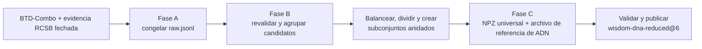

# WISDOM — estructura y aprendizaje superficial de proteínas

[English](README.md) | **Español**

WISDOM estudia si una proteína se une al ADN a partir de su estructura tridimensional. El proyecto
primero construye un conjunto de referencia balanceado con etiquetas positivas y negativas fiables.
Después convierte cada proteína en átomos y puntos de superficie, y entrena modelos que relacionan
la química interna con la superficie expuesta de la molécula.

El preprocesado escribe un archivo NPZ comprimido por proteína. Un NPZ contiene arrays numéricos con
nombre: coordenadas y enlaces atómicos, puntos y normales de la superficie, pequeñas tablas de
vecinos y los operadores necesarios para difundir información sobre esa superficie. Las etiquetas
de ADN se guardan aparte, por lo que el mismo NPZ estructural puede reutilizarse para otra pregunta
científica. La sección 4 presenta cada array antes de introducir sus ecuaciones.

La ruta actual es grafo atómico de dos ramas → DiffusionNet → evidencia local → MAX. El desarrollo
ahora sigue barreras de decisión: primero mide diez semillas completas de V1; después comprueba
pooling, pérdidas débiles e hipótesis arquitectónicas aisladas; y solo entonces congela V1. V2 y las
versiones formales posteriores no son nombres para esas cribas preliminares. El entrenamiento usa
etiquetas de proteína; los contactos conocidos con ADN miden la calidad superficial durante el
desarrollo, pero nunca entran en el gradiente ni en la selección del checkpoint.

## 0. Índice

- [1. Inicio rápido](#1-inicio-rápido)
- [2. Instalación](#2-instalación)
  - [2.1. Requisitos](#21-requisitos)
  - [2.2. Instalación automática con Conda](#22-instalación-automática-con-conda)
  - [2.3. Activación, actualizaciones y comprobaciones](#23-activación-actualizaciones-y-comprobaciones)
- [3. Benchmark de unión a ADN y anotaciones](#3-benchmark-de-unión-a-adn-y-anotaciones)
  - [3.1. Por qué la unión a ADN es el primer problema de WISDOM](#31-por-qué-la-unión-a-adn-es-el-primer-problema-de-wisdom)
  - [3.2. Fase A — construcción y congelación de la evidencia de origen](#32-fase-a--construcción-y-congelación-de-la-evidencia-de-origen)
  - [3.3. De la evidencia congelada a un dataset gestionado](#33-de-la-evidencia-congelada-a-un-dataset-gestionado)
  - [3.4. Fase B — diseño de un benchmark balanceado sin fugas](#34-fase-b--diseño-de-un-benchmark-balanceado-sin-fugas)
  - [3.5. Auditoría estadística e interpretación](#35-auditoría-estadística-e-interpretación)
  - [3.6. Fase C — arrays estructurales y referencia superficial](#36-fase-c--arrays-estructurales-y-referencia-superficial)
  - [3.7. Una segunda tarea: coordinación de zinc verificada](#37-una-segunda-tarea-coordinación-de-zinc-verificada)
- [4. Preprocesado estructural](#4-preprocesado-estructural)
  - [4.1. Imagen mental y recorrido completo](#41-imagen-mental-y-recorrido-completo)
  - [4.2. Preparación, ejecución e inspección del dataset](#42-preparación-ejecución-e-inspección-del-dataset)
  - [4.3. De la entrada del manifiesto a coordenadas normalizadas](#43-de-la-entrada-del-manifiesto-a-coordenadas-normalizadas)
  - [4.4. De los átomos normalizados al grafo atómico](#44-de-los-átomos-normalizados-al-grafo-atómico)
  - [4.5. De las esferas atómicas a la geometría superficial](#45-de-las-esferas-atómicas-a-la-geometría-superficial)
  - [4.6. De los puntos superficiales al NPZ final](#46-de-los-puntos-superficiales-al-npz-final)
  - [4.7. Validación, reproducibilidad y ejecución paralela](#47-validación-reproducibilidad-y-ejecución-paralela)
  - [4.8. Arquitectura del código y tests](#48-arquitectura-del-código-y-tests)
  - [4.9. Limitaciones científicas](#49-limitaciones-científicas)
  - [4.10. Campos físico-químicos superficiales fijos y opcionales](#410-campos-físico-químicos-superficiales-fijos-y-opcionales)
- [5. Modelos entrenables de WISDOM](#5-modelos-entrenables-de-wisdom)
  - [5.1. Índice del dataset y batching de grafos](#51-índice-del-dataset-y-batching-de-grafos)
  - [5.2. Arquitectura adaptativa semántica y WISDOMv1](#52-arquitectura-adaptativa-semántica-y-wisdomv1)
  - [5.3. Caracterización del pooling: curvas fijas y familias adaptativas](#53-caracterización-del-pooling-curvas-fijas-y-familias-adaptativas)
    - [5.3.1. V5c: refinamiento espacial de la evidencia superficial](#531-v5c-refinamiento-espacial-de-la-evidencia-superficial)
  - [5.4. Comparación aplazada de encoders superficiales](#54-comparación-aplazada-de-encoders-superficiales)
  - [5.5. Entrenamiento, evaluación y artefactos](#55-entrenamiento-evaluación-y-artefactos)
  - [5.6. Descubrimiento de conceptos sparse posterior al HPO](#56-descubrimiento-de-conceptos-sparse-posterior-al-hpo)
  - [5.7. Roadmap formal y barreras de decisión](#57-roadmap-formal-y-barreras-de-decisión)
  - [5.8. Análisis de investigación: encontrar evidencia útil](#58-análisis-de-investigación-encontrar-evidencia-útil)
  - [5.9. Interpretar mapas de proteínas y recuperar informes](#59-interpretar-mapas-de-proteínas-y-recuperar-informes)
  - [5.10. Revisión posterior de modelos existentes](#510-revisión-posterior-de-modelos-existentes)
  - [5.11. Evidencia superficial aprendida, explícita e híbrida](#511-evidencia-superficial-aprendida-explícita-e-híbrida)
  - [5.12. Predicción frente a descubrimiento de regiones estructuradas](#512-predicción-frente-a-descubrimiento-de-regiones-estructuradas)
- [6. Bibliografía](#6-bibliografía)

## 1. Inicio rápido

WISDOM tiene tres acciones ordenadas:

1. `Selection` decide qué proteínas pertenecen a entrenamiento, validación y test.
2. `Preprocessing` convierte esas proteínas en NPZ y publica la versión inmutable configurada; la
   receta de cribado incluida publica `wisdom-dna-reduced@6`.
3. `Visualization` lee el dataset publicado y crea vistas tridimensionales interactivas.

Las tres acciones se declaran en `experiments/dna_preprocess.yaml`. Su primer argumento es `skip`:
`false` ejecuta una acción y `true` la omite. Los valores incluidos reutilizan un diseño anterior,
ejecutan Preprocessing y omiten Visualization. La tabla muestra modos más seguros con una sola
finalidad; el YAML conserva sus valores alternativos como comentarios junto a cada paso:

| Acción deseada | `select.skip` | `preprocess.skip` | `visualize.skip` | Entrada necesaria |
|---|---:|---:|---:|---|
| Reconstruir solo la selección | `false` | `true` | `true` | `select.raw_path` apunta a `raw.jsonl`. |
| Reutilizar un diseño completo y construir `wisdom-dna-reduced@6` | `true` | `false` | `true` | Configurar `select.existing_design`; el directorio debe contener los splits etiquetados, catálogo, diluciones y el snapshot `structures/index.json`. |
| Visualizar un `wisdom-dna-reduced@6` ya publicado | `true` | `true` | `false` | No necesita el diseño; el dataset se resuelve por nombre y versión. |

El flujo completo `true/false/false` puede construir y visualizar una versión nueva con un solo
comando. Visualization recibe `{from: preprocess.dataset}`, así que LambdaForge espera a que termine
la publicación. En el modo de solo visualización se usa `{dataset: wisdom-dna-reduced@6}` y esa versión sí
debe existir en el Registry antes de iniciar el flujo.

WISDOM se instala mediante Conda. El instalador del repositorio puede usar una instalación de Conda
existente o instalar Miniforge sin privilegios de administrador, crear el entorno `wisdom` desde
`environment.yml`, obtener un checkout compatible de LambdaForge e instalar ambos proyectos en
modo editable. «Editable» significa que los cambios en el código fuente surten efecto sin volver a
instalar el paquete.

```bash
./install.sh
conda activate wisdom

# Revisa y después prepara el entorno gestionado completo en el clúster de destino.
lf clusters bootstrap citius-ctgpgpu12 --project . --dry-run
lf clusters bootstrap citius-ctgpgpu12 --project .

# Elige primero uno de los modos documentados. Visualizar exige wisdom-dna-reduced@6.
lf validate experiments/dna_preprocess.yaml
lf explain experiments/dna_preprocess.yaml
lf run experiments/dna_preprocess.yaml --dry-run
lf run experiments/dna_preprocess.yaml --on citius-ctgpgpu12

lf validate experiments/validate_dna.yaml  # después de publicar wisdom-dna-reduced@6
lf validate experiments/wisdom_v1a.yaml
lf run experiments/wisdom_v1a.yaml --dry-run
lf validate experiments/wisdom_v4.yaml

# Tras V10 y después de copiar su artefacto best-model.pt revisado:
lf validate experiments/interpretability_sparse_concepts.yaml
lf run experiments/interpretability_sparse_concepts.yaml --dry-run
```

[`experiments/README.md`](experiments/README.md) contiene el orden de ejecución autoritativo. Los
ficheros de construcción usan nombres `stage_*`; no son generaciones formales de WISDOM.

`validate` comprueba el YAML, los argumentos de los métodos, los imports y las referencias a datos.
`explain` muestra los parámetros resueltos y sus valores por defecto. `run` ejecuta las acciones
activas. El preprocesado solo publica un dataset cuando todos los miembros y el índice son válidos.
Una publicación local tiene esta forma lógica; LambdaForge decide su raíz física:

```text
runs/datasets/published/wisdom-dna-reduced/6/<content-id-prefix>/
├── index.jsonl
├── dataset-artifact.json
└── assets/
    ├── <first-protein>/
    │   ├── universal_npz
    │   ├── dna_annotation
    │   ├── source_structure
    │   └── dataset_design/
    │       ├── catalog.csv
    │       ├── preprocessing/{train,val,test}.jsonl
    │       ├── train.txt, validation.txt, test.txt
    │       ├── dilutions/replicate-00/train-<porcentaje>.txt
    │       └── provenance.json
    └── <other-protein>/{universal_npz,dna_annotation,source_structure}
```

`index.jsonl` es el índice del dataset: cada línea identifica una proteína, su partición, categoría
de dificultad (`tier`), etiqueta global de ADN, disponibilidad de referencia local y archivos
(`assets`) con sus huellas SHA-256.
La pertenencia a diluciones es metadata del miembro, así que una vista pequeña reutiliza los mismos
arrays. Los tres manifiestos siguen siendo un contrato previo reutilizable. LambdaForge guarda una
sola vez su catálogo y vistas compactas como el asset `dataset_design` del primer miembro. Las
tablas completas de similitud y el informe estadístico de selección permanecen en la salida
gestionada de `select`, bajo `data/dna/design`, sin prepararse otra vez para generar NPZ.
`dataset-artifact.json` guarda la identidad del contenido y el registro de construcción. Usa
`lf datasets member wisdom-dna-reduced@6 MEMBER_ID` para localizar el asset `universal_npz` de un miembro.
La ruta indicada se abre sin pickle así; 4.4–4.6 definen cada array:

```python
import json

import numpy as np

with np.load("/ruta/indicada/por/lambdaforge/universal_npz", allow_pickle=False) as protein:
    atom_positions    = protein["atom_positions"]
    atom_edges        = protein["atom_edge_index"]
    surface_positions = protein["surface_positions"]
    metadata          = json.loads(str(protein["metadata_json"].item()))
```

## 2. Instalación

### 2.1. Requisitos

- Linux o macOS sobre `x86_64`, `aarch64` o Apple Silicon;
- Bash y acceso a Internet para crear inicialmente el entorno y descargar los datos públicos;
- espacio suficiente, local o en el clúster, para archivos de coordenadas, bases de datos de las
  herramientas especializadas, superficies y checkpoints de LambdaForge;
- Conda es opcional antes de instalar: si no existe, `install.sh` ofrece instalar Miniforge en
  `~/miniforge3`;
- no se necesita una GPU NVIDIA para diseñar o preprocesar el dataset. El entrenamiento puede usar
  un entorno CPU o CUDA seleccionado por el perfil de clúster de LambdaForge.

La lista reproducible de paquetes está en [environment.yml](environment.yml). Crea Python 3.11 e
instala Biopython, MMseqs2 y Foldseek desde `conda-forge`/`bioconda`; al instalar WISDOM se resuelven
después las dependencias de Python, entre ellas NumPy, SciPy, scikit-learn, Gemmi, PyTorch,
`robust_laplacian` y LambdaForge. `robust_laplacian` aporta el operador disperso de nube de 4.6;
las secciones 3.2 y 3.4 presentan el papel científico de Gemmi, MMseqs2 y Foldseek.

La tabla `[tool.lambdaforge.environment]` de [pyproject.toml](pyproject.toml) declara ese mismo
`environment.yml` y nombra `mmseqs` y `foldseek` como ejecutables nativos obligatorios. Aquí
«nativo» significa un programa de línea de comandos que no se instala mediante el mecanismo de
paquetes wheel de Python. La declaración forma parte de la identidad del entorno gestionado; no se
repite en cada YAML de experimento.

WISDOM requiere LambdaForge `>=0.16.0` y no fija deliberadamente un límite superior mientras el
proyecto siga la versión actual del framework. Toda acción ejecutable es una subclase directa de
`Work` con un único método `run()`. LambdaForge resuelve files/datasets tipados, mapas acotados,
checkpoints JSON seguros, progreso, publicación inmutable, Registry, logs, recursos, semillas,
búsquedas y ejecuciones. WISDOM conserva la interpretación proteica, la geometría científica, la
validación exacta de NPZ/sidecars y la visualización específica.

El visor de proteínas de WISDOM y el extra `analysis-report` de LambdaForge usan Plotly `>=7,<8`.
El requisito anterior de WISDOM, `plotly<7`, no puede coexistir con el `plotly>=7` de ese extra:
es un conflicto de dependencias, no un fallo del cluster ni del entrenamiento. Después de actualizar
el repositorio, ejecuta `./install.sh` y luego `lf clusters bootstrap <cluster> --project .` para
reconstruir el entorno gestionado con los requisitos corregidos. No omitas la resolución con
`--no-deps` ni edites los wheels/metadatos en caché: eso ocultaría un entorno incompatible.

Al construir el wheel, WISDOM copia siempre los módulos actuales de `src/`, aunque las copias
antiguas de `build/lib/` tengan fechas de modificación posteriores. Sin esto, un paquete puede
mezclar el informe nuevo de predicciones con el visor antiguo y fallar con
`ProteinVisualizer.render is missing` únicamente al terminar el entrenamiento. Ahora se comprueba
esta interfaz antes de cargar datos o reservar el modelo. Si una ejecución ya enviada presenta
este error, actualiza el repositorio, ejecuta `./install.sh`, prepara el cluster con
`lf clusters bootstrap <cluster> --project .` y envía un Work nuevo desde el YAML actualizado.
Un Work existente conserva su paquete original: reinstalar en local no actualiza los Runs en marcha.
Esta corrección cambia el empaquetado y la detección del error, no modelos, datos ni métricas.

### 2.2. Instalación automática con Conda

Clona WISDOM, entra en el repositorio y ejecuta el instalador:

```bash
git clone <URL del repositorio WISDOM>
cd WISDOM
./install.sh
```

El instalador es interactivo para no sustituir un entorno ni escoger un directorio de LambdaForge
sin que el usuario lo vea. En este orden:

1. localiza Conda o propone una instalación de Miniforge limitada al usuario;
2. crea el entorno `wisdom` o propone actualizar el existente con `--prune`;
3. reutiliza `./LambdaForge` o `../LambdaForge`, permite indicar otro checkout o clona el repositorio
   oficial;
4. comprueba que LambdaForge satisface la versión mínima `>=0.16.0`;
5. elimina metadatos editables obsoletos de versiones anteriores de `wisdom-protein` e instala
   LambdaForge y `wisdom[dev]` en modo editable dentro del entorno Conda;
6. opcionalmente comprueba Python, la coherencia de dependencias, LambdaForge, MMseqs2, Foldseek,
   Biopython y el import de WISDOM.

Para aceptar los valores predeterminados sin interacción:

```bash
./install.sh --yes
```

El script no instala paquetes globales del sistema, un controlador NVIDIA ni un toolkit CUDA del
sistema. Si acaba de instalar Miniforge e inicializar la shell, abre un terminal nuevo antes de
activar el entorno.

### 2.3. Activación, actualizaciones y comprobaciones

Activa el entorno en cada terminal nuevo antes de ejecutar WISDOM:

```bash
conda activate wisdom
```

Si Conda aún no está inicializado en la shell actual, carga una vez la ruta que muestra el
instalador o ejecuta `conda init <shell>` y abre un terminal nuevo. Volver a ejecutar `./install.sh`
es la vía prevista para actualizar: permite sincronizar el entorno existente con `environment.yml`,
reutilizar el checkout de LambdaForge elegido y reinstalar ambos proyectos editables.

Estas comprobaciones de solo lectura muestran qué puede ejecutar el entorno:

```bash
python --version
python -m pip check
lf --version
mmseqs version
foldseek version
python -c 'import Bio, gemmi, wisdom; print("Entorno WISDOM correcto")'
```

Para un perfil de clúster con `environment: managed`, prepara el entorno remoto específico del
proyecto desde la raíz del repositorio WISDOM:

```bash
# Inspecciona plataforma, paquetes, ejecutables y conectividad sin cambiar el clúster.
lf clusters bootstrap citius-ctgpgpu12 --project . --dry-run

# Aplica el plan revisado. El comando es idempotente si el entorno ya está completo.
lf clusters bootstrap citius-ctgpgpu12 --project .
lf doctor --on citius-ctgpgpu12
```

`--project .` es importante: indica a bootstrap que lea `pyproject.toml` y `environment.yml` de
WISDOM, construya la wheel de WISDOM y prepare esas dependencias, en lugar de realizar únicamente
un bootstrap genérico del clúster. LambdaForge utiliza su propio ejecutable micromamba verificado
por checksum, por lo que la máquina remota no necesita una instalación global previa de Conda.
Crea un único prefijo inmutable con Python, los paquetes Conda resueltos, LambdaForge, WISDOM y la
versión de PyTorch/CUDA seleccionada; después verifica el inventario Conda y ambos ejecutables
obligatorios antes de permitir reutilizar el entorno. Un `lf run ... --on citius-ctgpgpu12`
posterior descubre automáticamente la misma declaración del proyecto.

`Selection` realiza un segundo preflight inmediato de ejecutables y versiones al principio del
Work, antes de solicitar una estructura a RCSB o iniciar el cálculo de descriptores. Si no se aplicó
el bootstrap, desapareció una herramienta o su comando de versión no funciona, `work.log`
identifica el ejecutable afectado y muestra los comandos exactos para corregirlo localmente o en un
clúster gestionado. El Work posterior `Preprocessing` no necesita MMseqs2 ni Foldseek: consume los
tres manifiestos ya fijados y usa Python/Gemmi, por lo que las herramientas nativas se comprueban
solo antes del paso de selección que las necesita.

LambdaForge 0.15 importa únicamente clases derivadas de `Work`; ya no existen referencias a funciones ejecutables ni
la antigua pila `Task`/`TaskContext`/`PreprocessingTask`. `Selection` usa `self.resume_map` para
reutilizar registros con sus dependencias y `Preprocessing` usa el mismo servicio con validadores
WISDOM para NPZ universales y sidecars de ADN. Ambos emplean cachés gestionadas para coordenadas,
checkpoints validados para tablas especialistas y salidas gestionadas de todo o nada. LambdaForge
también resuelve y ejecuta herramientas externas, captura versiones/logs y proporciona el backend
de clustering HDBSCAN. WISDOM no implementa otro lock de
descarga, protocolo atómico de caché, runner de subprocesos, backend de clustering, Registry ni
publicador. La sección 4.7 explica esta frontera.

## 3. Benchmark de unión a ADN y anotaciones

### 3.1. Por qué la unión a ADN es el primer problema de WISDOM

La primera pregunta de WISDOM es: **¿puede la cadena proteica seleccionada unirse a ADN en un
contexto biológicamente relevante?** Es un buen primer problema porque la unión ocurre en una
superficie tridimensional: el modelo debe relacionar los átomos internos con la forma y la química
expuestas a otra molécula.

Un **benchmark** es una población fija con etiquetas explícitas, particiones de
entrenamiento/validación/test y un protocolo de evaluación. Estas reglas permiten que distintos
modelos respondan a la misma pregunta bajo las mismas condiciones.

La **partición de entrenamiento** ajusta los pesos del modelo. La **partición de validación** compara
configuraciones y elige un checkpoint. La **partición de test** se reserva hasta terminar esas
decisiones y proporciona la estimación final. WISDOM nunca inventa estas particiones al cargar el
modelo.

Cada proteína aceptada tiene asociadas dos respuestas distintas; confundirlas invalidaría el
experimento:

- la **etiqueta global** indica si la proteína completa se considera capaz (`1`) o no capaz (`0`) de
  unirse a ADN;
- la **referencia local** marca los puntos de la superficie que forman una interfaz conocida con
  ADN. También se denomina *ground truth* (GT), es decir, una respuesta de referencia usada para
  evaluar la localización. No se muestra al modelo como entrada ni se usa como objetivo de la
  función de pérdida débilmente supervisada actual.

Una estructura depositada representa solo una situación estudiada experimentalmente. Los
investigadores pueden cristalizar la proteína sola, eliminar regiones flexibles, emplear una
condición sin ADN o depositar solo uno de los estados de un sistema con varias partes. Por tanto,
**«este archivo PDB no contiene ADN» no implica «esta proteína no puede unirse a ADN».** Incluso ver
una proteína cerca del ADN pero sin contacto en un ensamblaje concreto no demuestra que nunca se
una en otras condiciones. WISDOM trata por ello una proteína como *desconocida* mientras no tenga
evidencia positiva o negativa defendible; los registros desconocidos no se transforman en
negativos.

Esto hace que los negativos sean más difíciles que los positivos. Un contacto físico proteína–ADN
respalda un positivo, pero un número finito de estructuras no puede demostrar que una proteína
nunca se una a ADN. WISDOM obtiene su conjunto negativo inicial de **BTD**, el benchmark de Rahman
*et al.* [22]. BTD parte de registros de Swiss-Prot revisados por especialistas, elimina proteínas
anotadas como ligantes conocidos o posibles de ADN/ARN y reduce la redundancia de secuencia. No usa
la ausencia de ADN en una estructura como evidencia negativa.

**BTD-Combo** combina BTD con los benchmarks anteriores PDB1075 y PDB14K y reduce la redundancia en
cada clase. WISDOM usa sus etiquetas como evidencia de origen y añade comprobaciones estructurales
y de contacto porque la evaluación superficial necesita coordenadas. Un negativo queda así bien
curado, pero continúa siendo una etiqueta de benchmark, no una demostración de que la unión sea
imposible en todos los contextos biológicos.

El entrenamiento usa **supervisión débil**: recibe la etiqueta global, mientras que la interfaz
local queda reservada para evaluar. El modelo debe descubrir qué regiones superficiales explican su
decisión sobre la proteína completa.

El flujo completo de selección y preprocesado es:


```mermaid
flowchart LR
    A["BTD-Combo + evidencia RCSB fechada"] --> B["Fase A<br/>congelar raw.jsonl"]
    B --> C["Fase B<br/>revalidar y agrupar candidatos"]
    C --> D["Balancear, dividir y crear<br/>subconjuntos anidados"]
    D --> E["Fase C<br/>NPZ universal + archivo de referencia de ADN"]
    E --> F["Validar y publicar<br/>wisdom-dna-reduced@6"]
```

| Fase | Operación principal | Resultado que recibe la fase siguiente |
|---|---|---|
| A | Reunir etiquetas fiables y estructuras exactas. | Evidencia congelada en `raw.jsonl`; todavía no hay particiones. |
| B | Revalidar, agrupar proteínas relacionadas, balancear, dividir y auditar. | Catálogo fijo, archivos train/validation/test y subconjuntos anidados de train. |
| C | Generar geometría proteica y una referencia de interfaz de ADN separada. | Dataset inmutable validado para entrenamiento y evaluación. |

### 3.2. Fase A — construcción y congelación de la evidencia de origen

La fase A es una preparación que se ejecuta pocas veces. Convierte anotaciones públicas de secuencia
y estructuras experimentales en una tabla fija de candidatos. «Evidencia de origen» significa los
registros reunidos antes de balancear o dividir el conjunto; no significa que sean datos sin
verificar. El diseño y el preprocesado normales reutilizan esa tabla. Para reconstruirla:

```bash
python scripts/create_fasta.py --workers 36
```

La entrada es `scripts/btd_combo.fasta`, una exportación local de BTD-Combo. En FASTA, una línea que
comienza por `>` identifica el registro y las letras siguientes codifican su secuencia de
aminoácidos. El script añade a esos registros una identidad estructural exacta y su evidencia.

La salida es `data/dna/raw/raw.jsonl`, con un objeto JSON por candidato: identificador, cadena,
ensamblaje biológico y copia, etiqueta, evidencia, fuente y secuencia de aminoácidos. Los informes
llaman **población RAW** a esta colección todavía no balanceada. El archivo congelado actual contiene
unos 4.484 candidatos (3.529 positivos y 955 negativos). Es evidencia, todavía no un conjunto de
entrenamiento. `raw.fasta` es solo una vista compatible con herramientas de secuencia.

**A1 — adaptar BTD-Combo a la evaluación de superficies.** BTD-Combo se basa en secuencias, mientras
que WISDOM necesita una cadena tridimensional concreta. El script elimina secuencias ambiguas y
duplicadas y solo acepta un mapeo al **RCSB PDB** cuando coincide la secuencia depositada completa.
RCSB son las siglas de *Research Collaboratory for Structural Bioinformatics*. Su portal es el
centro de datos estadounidense del archivo PDB mundial, la colección pública de estructuras
tridimensionales de macromoléculas [1, 17]. Un identificador como `1ABC_A` representa la cadena A de
la entrada PDB `1ABC`: apunta a coordenadas experimentales, no solo al nombre de una proteína.

La estructura mapeada debe tener resueltos átomos pesados —todos salvo el hidrógeno— para al menos
el 90 % de la secuencia, porque una cadena muy incompleta no permite construir una referencia
superficial fiable. El script reconstruye el **ensamblaje biológico**, la disposición molecular
propuesta como biológicamente activa y no necesariamente el contenido directo de una celda
cristalográfica. Los positivos de BTD solo se conservan si los átomos pesados de la proteína y el
ADN presentan el contacto directo definido matemáticamente en 3.4. Si no aparece ese contacto,
WISDOM no puede obtener la interfaz local basada en coordenadas que necesita y retira el candidato
de este benchmark estructural; no lo convierte en negativo.

Los negativos de BTD siguen una comprobación distinta. Su etiqueta global continúa procediendo del
proceso de curación de BTD explicado en 3.1. WISDOM comprueba que exista una estructura mapeada lo
bastante completa para auditarla y que no contradiga esa etiqueta. Se pone en cuarentena cualquier
negativo cuyo ensamblaje biológico inspeccionado contacte directamente con ADN, además de las
descargas fallidas y auditorías estructurales incompletas. Superar esta comprobación significa
«negativo de BTD sin contradicción en la estructura auditada», no «se ha demostrado
experimentalmente que ningún punto de su superficie puede unirse a ADN». La referencia local de
ceros que se crea después está condicionada a esa etiqueta global aceptada.

**A2 — añadir positivos con interfaces observables.** La segunda fuente es una consulta de RCSB,
congelada por fecha, que busca ensamblajes biológicos experimentales con proteína y ADN. La consulta
solo descubre candidatos: aparecer en el mismo archivo no basta. WISDOM utiliza **Gemmi**, una
biblioteca de biología estructural de código abierto que lee registros PDB/PDBx/mmCIF y aplica sus
operaciones de simetría para construir ensamblajes [3]. Una cadena solo pasa a ser positiva cuando
supera el test de contacto entre átomos pesados de proteína y ADN. Una cadena depositada sin ADN, o
que no lo toca en una estructura que sí lo contiene, permanece desconocida y nunca aporta un
negativo.

**A3 — resolver conflictos y congelar la procedencia.** Una secuencia exacta con etiquetas
incompatibles se pone en cuarentena. El script registra versiones y hashes de las fuentes,
evidencia CSV detallada, `raw.jsonl` tipado y vistas FASTA. El FASTA balanceado solo sirve para
inspección: la fase B siempre lee toda la población RAW para que incluso una proteína omitida pueda
revelar una relación de similitud entre dos proteínas retenidas.

> **Resultado tras la fase A:** cada fila aceptada tiene una fuente de etiqueta, una cadena y un
> ensamblaje RCSB exactos, una secuencia y evidencia reproducible. Todavía no se ha asignado ninguna
> proteína a train, validation o test.

### 3.3. De la evidencia congelada a un dataset gestionado

El paso `select` de [`experiments/dna_preprocess.yaml`](experiments/dna_preprocess.yaml) revalida todos los candidatos RAW,
calcula similitud y descriptores físicos, forma grupos de dependencia y selecciona la población
balanceada que los informes llaman **CANONICAL**. Esta es la población que se divide en particiones.
RAW sigue siendo mayor porque un candidato omitido puede conectar dos
proteínas seleccionadas. El límite de resolución de 4 Å deja un objetivo de 907 miembros por clase
para el RAW actual. Los registros válidos excluidos siguen explicados en `catalog-all.csv`; excluir
significa «fuera del benchmark», no «biológicamente inválido».

Tras finalizar `select`, LambdaForge pasa seis salidas nombradas a `preprocess`: los tres archivos
de partición etiquetados, el catálogo, las diluciones y el snapshot inmutable de coordenadas. La
huella de cada ruta identifica la entrada exacta de la fase C:

```text
data/dna/design/
├── train-labelled.txt
├── validation-labelled.txt
├── test-labelled.txt
├── catalog.csv
├── dilutions/
└── structures/
    ├── index.json
    └── <pdb-id>.cif.gz
```

Los `*-labelled.txt` contienen `RCSB_CHAIN<TAB>ETIQUETA`; por ejemplo,
`1ABC_A<TAB>1`. Definen exactamente qué proteínas y etiquetas entran en cada partición. Dos columnas no
pueden almacenar además el ensamblaje biológico, la copia repetida, la huella de coordenadas, la
evidencia de contacto, el grupo de fuga o el fenotipo. Esa información permanece en `catalog.csv`.

Selection también crea tres JSONL autocontenidos para inspección programática portable. Cada línea
conserva la identidad y etiqueta del TXT junto con todos los campos necesarios del catálogo y sus
diluciones. El pipeline público usa deliberadamente la representación compacta y editable:

- los tres JSONL no necesitan consultar el catálogo;
- los tres `*-labelled.txt` existentes requieren `catalog.csv`, y el directorio opcional
  `dilutions/` recupera las vistas anidadas de entrenamiento.

En ambos casos los archivos de split, no el catálogo, eligen miembros y etiquetas. El catálogo solo
completa la identidad estructural necesaria para reproducir el ensamblaje y la anotación de ADN.
El directorio `structures/` aporta los propios bytes. Selection guarda cada PDB seleccionado una
sola vez aunque se usen varias de sus cadenas.

El archivo se llama `val.jsonl`, pero sus registros mantienen la partición canónica `validation`,
que el entrenamiento expone como `val`. Ningún manifiesto contiene un `structure_path` específico
de una máquina: el preprocesado lo deriva del snapshot portable. Exigir una ruta propia de un
Attempt en `catalog.csv` causaba el fallo anterior y no forma parte del contrato.

Un **Work** de LambdaForge es un paso ejecutable. Una **versión** de dataset identifica contenido
lógico inmutable; un **placement** es una copia física verificada de esa versión en una máquina. El
Registry registra esas copias. El YAML solicita recursos y `workers` limita los registros
concurrentes: reservar 36 CPU no crea por sí solo 36 workers.

LambdaForge 0.15 no tiene una opción `lf run --step`. Se edita el primer parámetro `skip` de cada
paso en el único YAML. La configuración incluida usa `true/false/true`: Selection reenvía el
directorio declarado `data/dna/design`, Preprocessing construye y publica la versión 6 y
Visualization no hace nada. Para renderizar justo después de publicar se cambia únicamente
`visualize.skip: false`; el tercer paso consume entonces la salida `preprocess.dataset`, por lo que
la versión 6 no tiene que existir de antemano. Para ejecutar solo Visualization se sustituye esa referencia por el selector comentado
`{dataset: wisdom-dna-reduced@6}`.

```bash
# Validar y ejecutar la combinación seleccionada.
lf validate experiments/dna_preprocess.yaml
lf explain experiments/dna_preprocess.yaml
lf run experiments/dna_preprocess.yaml --dry-run
lf run experiments/dna_preprocess.yaml --on citius-ctgpgpu12

# En otra terminal, inspeccionar todos los jobs o seguir el log durable de este build.
lf overview
lf logs wisdom-dna-preprocess --follow

# Inspeccionar la versión inmutable y su placement local seleccionado.
lf datasets show wisdom-dna-reduced@6
lf datasets stats wisdom-dna-reduced@6
lf datasets members wisdom-dna-reduced@6 --partition split=train --limit 20
lf datasets verify wisdom-dna-reduced@6

# Repetir la auditoría científica completa sin modificar el dataset inmutable.
lf validate experiments/validate_dna.yaml
lf run experiments/validate_dna.yaml --on citius-ctgpgpu12
```

Cuando `select.skip` es true, Selection no descarga, busca similitud, agrupa, balancea ni divide.
Con `existing_design: null` no declara entradas ni salidas del diseño. Si un Preprocessing activo
necesita el diseño previo, se indica el directorio completo en `existing_design` y se restauran las
seis referencias `{from: select.<salida>}`; Selection registra entonces esas rutas sin recalcularlas.
Cuando `preprocess.skip` es true, Preprocessing no lee manifiestos ni publica un dataset.
LambdaForge registra cada entrada, mmCIF y resultado del mapa, así que un reintento compatible
reutiliza validaciones del snapshot y checkpoints por registro. `--restart` descarta los checkpoints
y `--rerun` solicita deliberadamente otra Execution, por lo que no debe usarse solo para continuar.

`existing_design` permanece deliberadamente en `null` cuando `skip=false`. Los
`train-labelled.txt` existentes no modifican una Selection nueva: etiquetas y miembros se vuelven a
calcular desde `raw_path`, y el directorio completo solo se sustituye tras finalizar correctamente.
Declarar además un diseño grande durante la reconstrucción obligaría a LambdaForge a preparar un
directorio de entrada que ningún algoritmo leería.

El Work también copia el resultado completo de forma atómica al `output_directory` configurado. El
YAML lo escribe como `../data/dna/design` porque LambdaForge resuelve las publicaciones desde el
directorio `experiments/`; la ruta resultante del proyecto es `data/dna/design`. `REPORT.md` explica
su auditoría; los archivos `*.txt` contienen IDs
y los `*-labelled.txt` contienen `RCSB_CHAIN<TAB>0|1`. `catalog.csv` es una vista completa cómoda
para auditoría; Selection actual emite además las entradas JSONL autocontenidas equivalentes y el
snapshot exacto de coordenadas comprimidas descrito por `structures/index.json`.

Para disponer del mismo dataset válido en otro clúster se copia la versión inmutable, sin repetir
descubrimiento, mapeo, geometría ni anotación:

```bash
# LambdaForge elige un placement fuente verificado y lo copia al clúster destino.
lf datasets materialize wisdom-dna-reduced@6 --on OTRO_CLUSTER --strategy replicate --apply

# O se indican explícitamente origen y destino.
lf datasets replicate wisdom-dna-reduced@6 --from citius-ctgpgpu12 --to OTRO_CLUSTER --apply
```

Ambos comandos verifican bytes y registran otro placement. Para reproducir el preprocesado en otro
sitio se transfiere el diseño completo: manifiestos, `catalog.csv`, `dilutions/` y `structures/`.
Una lista de identificadores no puede reproducir las coordenadas auditadas por Selection. `lf overview` y la Research Console
muestra el progreso; el log normal anuncia etapas y latidos, y
`verbose: true` añade una línea de inicio/final por registro de evidencia o proteína.

> **Resultado operativo:** las dos primeras acciones crean el diseño autosuficiente y la versión
> inmutable del dataset. Las ejecuciones posteriores pueden reutilizar el diseño completo solo para
> preprocesar; la visualización consume después la versión del Registry sin consultar RCSB.

### 3.4. Fase B — diseño de un benchmark balanceado sin fugas

La fase B valida todo RAW, construye grupos de dependencia, descubre fenotipos físicos, elige
CANONICAL, asigna splits y deriva diluciones de train, en ese orden. Los grupos deben preceder a la
selección: si una proteína B omitida conecta A con C, A y C deben seguir juntas. De otro modo, test
podría contener información ya vista mediante un pariente cercano: una **fuga de datos**. Train
ajusta el modelo, validation guía las decisiones y test se reserva para la estimación final.

**Identidad y revalidación estructural.** Cada fila JSONL indica identificador, ensamblaje, copia,
evidencia de etiqueta, origen, fuente y secuencia. Para cada entrada PDB, un worker acotado descarga
o reutiliza el mmCIF, verifica su hash SHA-256, reconstruye ese ensamblaje biológico y selecciona la
copia declarada. Así no se confunde una cadena del mismo nombre situada en otra copia del
ensamblaje con el mismo objeto físico.

Para un átomo pesado proteico $p$ y otro de ADN $d$, sean $x_p$ y $x_d$ sus centros cartesianos en
ångströms y $r_p$ y $r_d$ sus radios de van der Waals específicos del elemento. Hay contacto directo si

$$
\lVert x_p-x_d\rVert_2 < r_p+r_d+0.5\ \text{Å}.
$$

La norma es la distancia recta. Los 0,5 Å toleran pequeñas incertidumbres de coordenadas alrededor
de las envolventes atómicas; no implican un enlace covalente. Un índice espacial KD-tree evita
comparar cada átomo proteico con cada átomo de ADN. Cada positivo RAW debe reproducir un contacto en
su ensamblaje/copia exactos. La auditoría conserva secuencia, cobertura, método experimental,
resolución, año, tamaño, forma, composición y descriptores de interfaz.

En rayos X y cryo-EM, una resolución mayor significa menos detalle espacial. Las estructuras peores
que el límite predeterminado de 4 Å permanecen en los grupos de dependencia, pero no pueden entrar
en CANONICAL. Los registros sin una resolución numérica comparable, como muchos modelos de NMR,
siguen siendo elegibles en vez de recibir un valor inventado. Cada exclusión aparece en
`quality-exclusions.txt` y `selection-audit.json`.

**Los grupos de fuga usan todos los candidatos RAW.** **MMseqs2** encuentra similitud de secuencia;
**Foldseek** encuentra similitud entre plegamientos tridimensionales que puede persistir cuando las
secuencias divergen. Ambas relaciones pueden hacer dependientes dos ejemplos.

Una arista de dependencia no afirma igual función; solo prohíbe separar el par. MMseqs2 exige
identidad ≥ 0,30, cobertura bidireccional ≥ 0,80 y E-value ≤ 0,001. La identidad es la fracción
coincidente del alineamiento, la cobertura es la fracción alineada de cada secuencia completa y un
E-value menor indica menos coincidencias esperadas por azar. Foldseek exige probabilidad ≥ 0,90,
TM-score normalizado y cobertura ≥ 0,75 y 0,80 en ambas direcciones, y E-value ≤ 0,001. Las
Las secuencias exactas y, por defecto, una misma entrada PDB añaden aristas duras.

Las componentes conexas de la unión de todas las aristas son **grupos de fuga** indivisibles. Así,
A–B y B–C mantienen juntas A, B y C aunque no exista arista A–C. Es una restricción de seguridad,
no una asignación de familia biológica. Las salidas crudas, aristas aceptadas, razones, versiones,
comandos y umbrales quedan en `clusters/` y `provenance.json`.

**Los fenotipos físicos miden representación.** A diferencia de los grupos de fuga, los grupos de
fenotipo describen perfiles medidos parecidos; no definen independencia ni funciones biológicas.
Los globales usan tamaño, forma, composición y compacidad. Los de
interfaz positiva usan densidad de contacto, extensión, número de regiones y composición
contactada. Ayudan a repartir la diversidad observada, pero nunca rompen un grupo de fuga ni se
usan como entrada del modelo.

Antes de HDBSCAN se escala robustamente cada columna finita $j$. Si $x_{ij}$ es el descriptor $j$
de la proteína $i$, $\operatorname{median}_j$ es la mediana de ese descriptor e
$\operatorname{IQR}_j$ es su percentil 75 menos su percentil 25,

$$
z_{ij}=\frac{x_{ij}-\operatorname{median}_j}{\operatorname{IQR}_j}.
$$

El escalado por mediana/IQR limita el efecto de tamaños extremos. **HDBSCAN** encuentra regiones
densas sin fijar antes el número de grupos y marca proteínas aisladas como **ruido**. Aquí ruido
significa «sin grupo denso estable», no «corrupta» ni «negativa». Es preferible a forzar una
estructura excepcional dentro de una familia arbitraria.

La elongación de interfaz
se mide dentro de su plano. Si `s1 >= s2 >= s3` son las dispersiones espaciales principales de los
centros de residuos contactantes, la razón es `s1/s2`; `s3` mide el grosor de la lámina y no se usa
como denominador. Una interfaz casi colineal con `s2` próxima a cero queda no disponible. Así se
evitan razones artificiales cercanas a mil millones del informe preliminar, causadas por dividir
una lámina plana por su grosor casi nulo.

**Selección CANONICAL y splits fijos.** Tras fijar grupos de todo RAW, elegibilidad por calidad y
fenotipos, el valor por defecto conserva todos los negativos elegibles y elige el mismo número de
positivos. Preserva core positivos y aumenta cobertura de
grupos, fenotipos y origen, y desempata con SHA-256 y semilla.
catalog-all.csv conserva RAW; catalog.csv, CANONICAL; selection-audit.json explica los recuentos y
omitted-positives.txt enumera positivos válidos innecesarios para el ratio solicitado.

Un objetivo greedy determinista asigna grupos completos hacia 70% train, 15% validation y 15% test,
penalizando desviaciones de tamaño, clase, fenotipo y origen. Como condiciones duras, cada grupo
ocupa un split y validation/test tienen ambas etiquetas.
train.txt, validation.txt y test.txt son vistas solo con ID de las asignaciones de catalog.csv e
index.jsonl. Sus archivos hermanos `-labelled.txt` añaden una etiqueta binaria separada por tabulador
y se comprueban contra el catálogo. Cada dilución de train contiene las dos vistas.

De forma precisa, para el split $s$, sea $f_s$ su fracción solicitada, $n_s$ su tamaño
observado y $n$ el tamaño canónico. Para una categoría $k$—etiqueta, fenotipo u origen
positivo—sean $n_{s,k}$ y $n_k$ sus recuentos en el split y la población. El optimizador
minimiza una suma cuyos términos de recuento tienen la forma

$$
J_{count}=\sum_s w_{size}\left(\frac{n_s-f_sn}{\max(f_sn,1)}\right)^2
+\sum_s\sum_k w_k\left(\frac{n_{s,k}-f_sn_k}{\max(f_sn_k,1)}\right)^2.
$$

La implementación da más peso a los términos de clase que a los de fenotipo u origen. Elevar al
cuadrado penaliza más las desviaciones grandes y normalizar impide que una categoría frecuente
domine solo por tener más miembros. El algoritmo mantiene contadores incrementales: colocar un
grupo no vuelve a recorrer todo el dataset. Son preferencias blandas de balanceo, nunca permiso
para romper un grupo de fuga.

**Curvas de aprendizaje anidadas.** Las diluciones solo cambian train y conservan grupos completos:
`train-10` está contenido en `train-25`, después `train-50`, hasta `train-100`. Los tamaños exactos
pueden desviarse porque los grupos son indivisibles. Validation y test no cambian.

> **Resultado tras la fase B:** miembros, etiquetas, grupos de fuga, asignaciones de
> train/validation/test y subconjuntos anidados de entrenamiento quedan fijados y auditados. La fase
> C puede añadir geometría, pero no modificar estas decisiones.

### 3.5. Auditoría estadística e interpretación

La fase B termina con una auditoría estadística compacta. `REPORT.md`, los CSV y la evidencia JSON
se generan a partir de los mismos resultados, de modo que el texto y los valores legibles por
programas describen la misma población. Responde cuatro preguntas:

- **balance:** ¿aparecen positivos y negativos en las proporciones previstas en cada partición y
  dilución de entrenamiento?;
- **fugas:** ¿cruza entre entrenamiento, validación y test alguna secuencia exacta, relación de
  similitud estructural o de secuencia aceptada, grupo PDB o componente de dependencia completo?;
- **representación:** ¿conservan las particiones las formas globales y de interfaz observadas
  descubiertas en la fase B, en vez de reservar accidentalmente un tipo de proteína para test?;
- **diluciones:** ¿está cada train pequeño contenido en todos los mayores y compuesto solo por
  grupos de fuga completos?

`design-summary.json` registra los recuentos exactos por split, clase, origen y fenotipo. Informa
una advertencia si un split difiere en más de diez puntos porcentuales entre clases, si un grupo de
fuga RAW contiene al menos el 5% de los candidatos o si un fenotipo estable falta en un split pese a
aparecer en varios grupos indivisibles. Una advertencia requiere interpretación; un fallo duro
(identidad duplicada, grupo cruzado, clase ausente, dilución no anidada o grupo fragmentado) impide
publicar. La cobertura fenotípica sigue siendo un objetivo blando de representatividad porque la
mera presencia de tres grupos no demuestra que puedan satisfacerse simultáneamente todas las
restricciones de clase, grupo y fenotipo. `REPORT.md` explica esos mismos valores en lenguaje ordinario. No
afirma estabilidad ARI, AUROC técnico, SMD, KS ni V de Cramér porque la selección simplificada no
calcula esos análisis.

### 3.6. Fase C — arrays estructurales y referencia superficial

La fase B fijó miembros, etiquetas y particiones, pero no creó la geometría para el modelo. La fase C
escribe dos archivos separados por proteína: un **NPZ universal** con átomos y superficie, y un
archivo complementario de ADN, llamado **sidecar**, ligado a la huella y al orden de puntos de ese
NPZ. El NPZ no contiene etiquetas, particiones, ADN ni objetivos, por lo que otra tarea puede reutilizarlo sin información del benchmark. El
dataset actual deriva cada sidecar positivo de coordenadas de ADN observadas; nunca sustituye en
silencio la ruta de compatibilidad con máscaras de residuos DyProL. La sección 4 deriva los arrays
universales.

Si $s'_i$ es el punto centrado almacenado y $o$ es `coordinate_origin`, la coordenada fuente es
$s_i=s'_i+o$. Para el átomo de ADN $j$, $x_j$ es su centro y $r_j$ su radio de van der Waals
tabulado por Gemmi. La separación física es

$$
d_i=\min_j\left(\lVert s_i-x_j\rVert_2-r_j\right).
$$

Restar el radio transforma distancia entre centros en una aproximación a la distancia desde el
punto superficial a la envolvente de van der Waals del ADN. Con $a=1,4$ Å y $b=3,0$ Å:

$$
y_i^{hard}=\mathbb{1}[d_i\leq a],\qquad
m_i=\mathbb{1}[d_i\leq a\ \lor\ d_i\geq b].
$$

$\mathbb{1}$ vale uno cuando se cumple la condición. `surface_target_hard` almacena
$y_i^{hard}$ y `surface_valid_mask`, $m_i$. Los puntos $a<d_i<b$ forman una banda ambigua:
siguen visibles pero no participan en métricas binarias. Definiendo
$t_i=\operatorname{clip}((d_i-a)/(b-a),0,1)$, el objetivo continuo es

$$
y_i^{soft}=\frac{1+\cos(\pi t_i)}{2}.
$$

Vale uno en la interfaz segura, cero más allá del negativo seguro y cambia suavemente entre ambos.
El sidecar guarda además distancia, máscara de distancia válida, objetivos para umbrales de
sensibilidad, los umbrales, JSON de procedencia y SHA-256 del NPZ base. Los negativos curados tienen
objetivo cero en todo punto válido. Su distancia al ADN no puede calcularse: aparece como NaN solo
donde `surface_distance_valid` es falso, nunca como una distancia cero ficticia.

El sidecar también es un NPZ sin pickle. Aquí `M` es el número de puntos de la superficie base y
`T`, el número de umbrales de sensibilidad configurados. Las máscaras booleanas indican si un valor
puede usarse; siempre deben consultarse antes de interpretar una distancia o un objetivo local.

| Array del sidecar | Forma | Dtype | Significado |
|---|---:|---|---|
| `surface_target_hard` | `[M]` | `uint8` | Target binario de contacto con la separación positiva principal. |
| `surface_valid_mask` | `[M]` | booleano | Puntos aptos para las métricas locales principales. |
| `surface_target_soft` | `[M]` | `float32` | Target suave entre las separaciones positiva y negativa. |
| `surface_distance_to_dna` | `[M]` | `float32` | Separación a la envolvente del ADN en Å, o NaN si no existe. |
| `surface_distance_valid` | `[M]` | booleano | Si la distancia correspondiente tiene significado. |
| `surface_target_hard_sensitivity` | `[M,T]` | `uint8` | Targets binarios para cada umbral de sensibilidad. |
| `local_gt_available` | escalar | booleano | Si la proteína tiene referencia local utilizable. |
| `sensitivity_gaps` | `[T]` | `float32` | Umbrales de sensibilidad en Å, en orden de columna. |
| `base_npz_sha256` | escalar | Unicode fijo | Huella del NPZ universal exacto y de su orden de puntos. |
| `annotation_metadata_json` | escalar | Unicode fijo | Asamblea, umbrales, método, conteos y procedencia. |

Para registros DyProL importados por separado, la ruta de compatibilidad asigna a cada punto la
máscara de su residuo representado más cercano y registra
`local_gt_method=binding_residue_mask`. No posee umbrales de sensibilidad por distancia y no se usa
en `wisdom-dna-reduced@6`.

La elegibilidad global y local son distintas. Un positivo fiable puede entrenar con su etiqueta
global aunque no tenga referencia local utilizable. Si no se etiqueta ningún punto superficial,
mantiene `label=1`, recibe una máscara local inválida, queda fuera de las métricas de localización y
se restringe a train; nunca se convierte en una superficie negativa. Las diluciones reutilizan los
mismos bytes NPZ/sidecar y no modifican validation ni test.

Con pesos adimensionales de área representada $w_i>0$, normalizados para sumar uno, se guardan

$$
W_+=\sum_i w_i y_i^{hard},\qquad
W=\sum_i w_i=1,\qquad
f_{interface}=W_+/W.
$$

Son peso representado positivo, peso normalizado total y fracción de interfaz, no áreas físicas en
Ų. Las componentes conexas positivas de la tabla superficial acotada proporcionan
`number_of_positive_regions`, permitiendo estudiar tamaño y regiones sin cambiar el entrenamiento
weakly supervised.

Antes de publicar, el destino rechaza arrays objeto, longitudes incompatibles, máscaras o
probabilidades inválidas, valores de ausencia de distancia incorrectos y discrepancias de huella
NPZ/sidecar. `index.jsonl` registra después la partición, los objetivos, estadísticas y NPZ, sidecar y
estructura fuente con checksum de cada miembro. Las rutas relativas hacen movible la versión; su ID
de contenido depende de miembros y bytes exactos, no del equipo ni del clúster.

> **Resultado tras la fase C:** cada miembro publicado tiene una representación proteica sin
> etiquetas y reutilizable, un sidecar de evaluación de ADN verificado por separado, metadata de
> split fija y procedencia con checksum. Este es el dataset que consume el entrenamiento de WISDOM.

### 3.7. Una segunda tarea: coordinación de zinc verificada

El zinc (Zn) es un ion metálico que puede estabilizar estructuras proteicas o participar en catálisis.
Que aparezca Zn en un depósito no demuestra que todas sus cadenas lo unan, ni que ese contacto sea
fisiológico: pueden intervenir aditivos de cristalización, ocupación incompleta o una cadena vecina.
El flujo distingue un **sitio de coordinación estructuralmente verificado** de una **especificidad
fisiológica por Zn** respaldada de forma independiente. Las comprobaciones geométricas actuales solo
establecen lo primero; conservan la confianza de la evidencia sin elevarla artificialmente.

SAGLZn-II aporta antecedentes e hipótesis químicas, no un dataset que copiar. No se adoptan sus
negativos por ausencia de ligando ni sus splits aleatorios. Un negativo necesita un experimento
explícito de no unión o una anotación experimental curada `NOT` de GO:0008270 (unión a ion zinc), con
referencia, alcance y SHA-256 de la secuencia exacta del sujeto. Así la evidencia queda vinculada a
una proteína y no solo a un nombre PDB parecido. `NOT` niega expresamente una anotación; una anotación
ausente no lo hace. Su interpretación sigue dependiendo de sensibilidad, cobertura y curación del
ensayo. **No hay un inventario público negativo predeterminado**: el investigador debe aportarlo y
revisarlo. La construcción se detiene si no permite splits con ambas clases y sin compartir homólogos.

|Acción|Entrada|Decisión o salida|
|---|---|---|
|`ZincDiscovery`|JSONL negativo revisado y nombre de la captura|Consulta RCSB congelada y candidatos con secuencia/ensamblaje/copia|
|`ZincSelection`|JSONL de candidatos congelado|Coordinación verificada, grupos de fuga RAW, fenotipos separados, balanceo y splits fijos|
|`ZincPreprocessing`|Diseño portable exacto y captura mmCIF|El mismo NPZ universal sin ligandos que para ADN y referencias de Zn separadas|
|`ZincValidation`|DatasetVersion gestionada|Veredicto legible y errores científicos ordenados por proteína|

Antes de ejecutar discovery, crea `data/zinc/negative-evidence.jsonl`. Cada registro necesita
`identifier` (`PDB_AQ` significa una cadena llamada AQ), `sequence`, `label: 0`, `assembly_id`,
`protein_copy` comenzando en uno, `origin` y `label_evidence`. La evidencia experimental contiene
`kind: experimental_non_binding`, `scope: zinc_binding`, `reference`, `assay` y `sequence_sha256`.
Una negación experimental curada utiliza `kind: curated_not_annotation`, el mismo alcance/referencia/
digest, `qualifier: NOT`, `term: GO:0008270` y `evidence_code` EXP, IDA, IPI, IMP, IGI o IEP. Son
categorías de evidencia experimental, no una garantía de cobertura del ensayo. Una secuencia distinta
provoca un error; la evidencia contradictoria sobre una identidad o secuencia exacta queda en
cuarentena, nunca se resuelve cambiando la etiqueta silenciosamente.

```bash
# Revisa los negativos explícitos y elige un release_id nuevo en este YAML primero.
lf run experiments/zinc_discovery.yaml
# Fija la decisión del benchmark, genera geometría y publica wisdom-zinc@1.
lf run experiments/zinc_preprocess.yaml
lf datasets verify wisdom-zinc@1
lf run experiments/validate_zinc.yaml
```

Discovery examina los ensamblajes biológicos declarados y cada copia de cadena, incluidas cadenas
de varios caracteres; no confunde la unidad asimétrica depositada con el objeto biológico. Registra
las alternativas y elige, por cadena depositada, la copia con más donantes de sitios aceptados;
desempata por ensamblaje/copia de forma determinista. Es una regla estructural auditable, no una
inferencia de relevancia fisiológica. Las cadenas sin coordinación aceptada permanecen como
candidatos RAW para conservar sus conexiones de secuencia/estructura antes de excluirlas.

Por defecto se exige ocupación del Zn y sus donantes ≥0,5, al menos dos átomos N/O/S proteicos de
la copia seleccionada a ≤3 Å del Zn y al menos dos residuos coordinantes. La ocupación expresa la
fracción depositada del sitio representada por ese átomo. Agua y ligandos no proteicos no satisfacen
el criterio. No se exige que los residuos sean exclusivamente Cys/His/Glu/Asp. Se conservan socios
entre cadenas, posiciones metálicas, identidades y recuentos; varios sitios de Zn forman una unión,
no un sitio único forzado. El primer conformero de Gemmi es una simplificación determinista, no
un conjunto de estados alternativos. La geometría no resuelve oxidación, protonación, afinidad
fisiológica ni especificidad metálica; hay que revisar los umbrales para el benchmark previsto.

MMseqs2 y Foldseek trabajan sobre **toda la población RAW interpretable**, incluidos descartes
científicos. Sus pares filtrados y las conexiones de secuencia exacta/depósito forman los grupos
transitivos de fuga de la sección 3.4. Se filtra después. Los fenotipos de sitios positivos y de
morfología negativa se ajustan por separado, con escalado mediana/IQR y HDBSCAN/stability nativos
de LambdaForge. Inicialmente se describen los positivos por número de sitios, donantes, residuos
coordinantes, fracción entre cadenas, media/desviación de distancia de coordinación en Å y
fracciones de donantes N/O/S: un resumen de coordinación, no una descripción completa de
la cavidad. Para conservar una interpretación multicluster se exigen al menos dos clusters sin
contar ruido y ARI mínimo 0,7 entre ajustes de la rejilla. ARI mide acuerdo entre asignaciones
(1: idénticas; cerca de 0: acuerdo esperado por azar). El acuerdo cuando todo es ruido no aporta
evidencia útil. Esta comprobación perturba parámetros, no hace bootstrap de la población.

Selection conserva negativos fiables y reparte la cuota positiva entre grupos de fuga, fenotipos
y fuentes. Los splits por grupos son 70/15/15% por defecto; grupos indivisibles pueden impedir
el balanceo exacto, que se informa en vez de afirmarlo. Las diluciones solo reducen train una vez
fijados los grupos; validation/test permanecen iguales. `report.md`, `audit.json`, `split-counts.csv`,
tablas de pares, TXT etiquetados, `selection.jsonl` y `dilutions.json` muestran las decisiones. Un
`diversity.md` explica gráficas de clases y tamaños de grupos, cobertura de fuentes y química,
y diferencias de medias estandarizadas (SMD) para tamaño, resolución y morfología. SMD compara
medias de clases en unidades de desviación combinada; |SMD|≥0,5 señala un posible atajo, no
significancia estadística. Soporte ausente o constante queda no disponible, no cero. Las familias
funcionales se cuentan solo si se aportan; los grupos de fuga no son familias biológicas. Un
TXT de dos columnas no recupera ensamblaje ni coordinación. Preprocessing no debe redescubrir ni
repartir las proteínas a partir de él.

La referencia local de Zn mide el mínimo **gap a un átomo proteico coordinante**: distancia euclídea
del punto al centro del donante menos su radio de van der Waals. El mínimo considera los radios
de todos los donantes relevantes. La región positiva une los sitios verificados. Por defecto los
gaps ≤1,4 Å son positivos, ≥3 Å negativos y los intermedios ambiguos; una transición coseno produce
etiquetas suaves. `zinc_gap` conserva aparte la distancia al centro del Zn menos el radio diagnóstico
1,39 Å; no define la etiqueta principal. Sensibilidades a 1/1,4/2 Å permiten evaluar dependencia del
umbral sin regenerar geometría. Son referencias por proximidad, no probabilidades experimentales
medidas sobre la superficie.

Las coordenadas reales de Zn solo aparecen en evidencia y sidecars de evaluación, nunca en el NPZ
universal ni en la entrada del modelo. Un positivo sin puntos de referencia positivos queda no
disponible, no todo-negativo: puede permanecer en train/clasificación global, pero bloquea publicar
si pertenece a validation/test. No se filtra por comodidad del área positiva o número de fragmentos.
`ZincValidation` comprueba bytes, secuencia, coordinación reproducible, arrays universales completos,
alineación local, grupos/splits y presencia de ambas clases. Una ampliación posterior de campos
explícitos sirve para ambas tareas. También informa cobertura de fuentes/fenotipos/familias, SMD
y química coordinante rara sobre miembros verificados. Tamaños superficiales fuera del intervalo
de 1,5 IQR (cuartiles ampliados 1,5 veces su separación) y fracciones de puntos positivos ≥0,5
piden inspección, no exclusión. Son avisos descriptivos, no pruebas de invalidez física; la fracción
de puntos no estima área ponderada. Las referencias locales ausentes quedan no disponibles y se
informa el soporte del análisis. Este cambio no ha producido un benchmark real de Zn ni resultados
de rendimiento sobre él.

## 4. Preprocesado estructural

El preprocesado convierte archivos de coordenadas destinados a la biología estructural en arrays
numéricos que podrá consumir un modelo de machine learning posterior. Esta sección sigue la
conversión en el mismo orden que el programa. Cada subsección presupone únicamente los conceptos
introducidos antes.

### 4.1. Imagen mental y recorrido completo

**De una proteína física a un archivo de coordenadas.**

Una proteína es una molécula física formada por átomos. Los experimentos y los programas de
predicción estructural no entregan a WISDOM la molécula física, sino un **archivo de coordenadas**.
Este archivo es una tabla estructurada que describe nombres atómicos, elementos químicos y posiciones
tridimensionales. La posición de un átomo es una terna `(x,y,z)` medida en ångströms; un ångström
(Å) equivale a `10^-10 m`.

Los archivos estructurales organizan los átomos en una jerarquía:

- un **átomo** es un elemento químico situado en una posición;
- un **residuo** es un bloque químico, normalmente un aminoácido, que contiene varios átomos;
- una **cadena** es una secuencia ordenada de residuos;
- un **modelo** es una interpretación completa de las coordenadas. Un archivo puede contener varios
  modelos, por ejemplo conformaciones experimentales alternativas.

Las dos familias de formatos admitidas son PDB y PDBx/mmCIF. Codifican ideas estructurales parecidas
con sintaxis diferentes. WISDOM delega su lectura en Gemmi en vez de interpretar manualmente el
texto. Los archivos `.gz` contienen el mismo texto PDB o mmCIF tras descomprimir gzip; gzip cambia el
tamaño de almacenamiento, no el significado molecular.

**Por qué el dataset comienza con un manifiesto TXT.**

Un dataset científico puede mezclar entradas públicas del Protein Data Bank con estructuras
privadas o generadas localmente. Copiarlas todas a un directorio único dificultaría mover, auditar y
reproducir el dataset. Por eso WISDOM parte de un pequeño **manifiesto**: un TXT donde cada línea no
comentada indica de dónde procede una proteína.

La línea puede ser un identificador PDB público como `4hhb_A`, y entonces WISDOM puede obtener el
archivo desde RCSB PDB, o una ruta local como `../structures/model.cif.gz`. El manifiesto es la
definición ordenada del dataset; los archivos de coordenadas son sus entradas físicas. Esta separación
permite reutilizar una caché, descargar entradas públicas ausentes y notificar el fallo de una
proteína sin perder los resultados correctos de las demás.

**Por qué WISDOM usa tres representaciones geométricas diferentes.**

Un modelo geométrico posterior necesita algo más que una tabla desordenada de átomos: necesita saber
qué objetos pueden intercambiar información. WISDOM representa esos intercambios posibles mediante
**grafos**. Un grafo es un conjunto de nodos y un conjunto de aristas; una arista indica que dos nodos
están relacionados. La arista no es por sí sola una fuerza química ni un mensaje aprendido, sino una
conexión estructural fija sobre la que podrá operar un modelo futuro.

Las tres relaciones no tienen el mismo significado físico, por lo que WISDOM no las fuerza a ser
listas genéricas de aristas:

1. El **grafo atómico** usa átomos como nodos. Los enlaces químicos son relaciones discretas, por lo
   que conserva todos los enlaces covalentes necesarios. El contexto espacial se limita a los
   `Kmax` átomos más próximos dentro de un corte físico y evita un grafo por radio denso.
2. La **tabla átomo→superficie** asigna a cada punto los `Jmax` átomos más próximos dentro de un
   corte físico. Es una vecindad local rectangular y enmascarada, no un enlace químico. El modelo
   elige cualquier prefijo `J<=Jmax` sin repetir el preprocesado.
3. Los **operadores diferenciales superficiales** describen cómo se extiende un valor escalar por la
   frontera muestreada y cómo cambia a lo largo de ella. Cumplen el papel que tienen las derivadas
   sobre una superficie lisa. DiffusionNet los usa directamente, por lo que no necesita enviar un
   mensaje aprendido por cada pareja de puntos cercanos.

La salida NPZ contiene medidas fijas, vecindarios acotados y operadores numéricos deterministas,
pero no activaciones neuronales, embeddings, valores de atención ni predicciones.

**El recorrido completo de los datos.**

Con esos objetos en mente, una línea del manifiesto sigue este recorrido:


```mermaid
flowchart LR
    A["Entrada del manifiesto"] --> B["Coordenadas PDB o mmCIF"]
    B --> C["Modelo y cadenas seleccionados"]
    C --> D["Átomos y relaciones covalentes/espaciales"]
    D --> E["Superficie molecular muestreada"]
    E --> F["Tablas de átomos cercanos y operadores superficiales"]
    F --> G["NPZ validado"]
```

Cada flecha consume el resultado inmediatamente anterior. La sección 4.2 explica cómo ejecutar e
inspeccionar el recorrido. Las secciones 4.3–4.7 vuelven sobre las mismas flechas con detalle
científico y matemático.

### 4.2. Preparación, ejecución e inspección del dataset

`Selection` escribe su directorio de auditoría bajo `data/dna/design`. Las entradas más sencillas
para el preprocesado son `train-labelled.txt`, `validation-labelled.txt` y `test-labelled.txt`. Cada
línea contiene un identificador, un tabulador y su etiqueta binaria. `catalog.csv` aporta el
ensamblaje, grupo de fuga, fenotipo y evidencia que no caben en esas dos columnas. Las ejecuciones
nuevas de Selection también crean `preprocessing/{train,val,test}.jsonl`, donde cada línea es un
objeto JSON que ya contiene el registro completo. Preprocessing admite ambas representaciones.

Los manifiestos indican **qué** proteínas se procesan; el snapshot `structures/` indica **qué bytes
exactos de coordenadas** fueron aprobados. Por ello, un diseño completo reutilizable también contiene
`structures/index.json` y un mmCIF comprimido por entrada PDB seleccionada. Si faltan esos archivos,
se debe repetir Selection una vez, en lugar de descargar estructuras actuales y tratarlas como si
fueran la evidencia original.

El directorio `data/dna/design` presente actualmente en este workspace se generó antes de añadir los
snapshots estructurales. Sus TXT etiquetados y el catálogo todavía permiten auditar los miembros,
pero el directorio no puede construir por sí solo el esquema 3.0 porque carece de
`structures/index.json`. Ejecuta Selection una vez con el código actual para crear un diseño
completo; los preprocesados posteriores compatibles podrán reutilizarlo sin consultar RCSB.

Cuando Selection se ejecuta en un clúster, su `output_directory` opcional se escribe en el espejo
del proyecto de ese clúster; LambdaForge no copia silenciosamente un directorio de varios gigabytes
de vuelta al equipo local. Una entrada posterior `{file: ../data/dna/design}` exige por ello que las
copias local y remota contengan exactamente los mismos nombres y bytes. La huella del directorio usa
rutas relativas y contenido, no fechas. Si Selection creó el snapshot completo en remoto, se
sincroniza una vez ese directorio al equipo local antes de omitir Selection. La copia se prepara en
otro directorio y solo se renombra como `data/dna/design` después de completar la transferencia;
enviar el Work mientras el directorio activo sigue creciendo registra una copia parcial. Esta
comprobación evita combinar por accidente manifiestos locales con otro snapshot remoto de
coordenadas.

Los archivos están separados para que los papeles supervisados sean visibles, pero Preprocessing
concatena sus registros y deduplica los PDB antes de generar geometría. La geometría molecular no
depende de etiqueta o split, así que cada identificador se procesa una vez. Split y etiqueta entran
solo en `members.jsonl` y en los metadatos del sidecar, nunca en el NPZ universal.
`preprocessing-report.json` aporta el join exacto `identifier -> NPZ`. La validación demuestra que
los manifiestos son disjuntos y que cada miembro conserva etiqueta, grupo de fuga y split.

**Entradas remotas.**

```text
1abc
4hhb_A
4hhb_AB
4hhb_A_B
```

El código de cuatro caracteres `4hhb` es el identificador público asignado por el Protein Data Bank.
Un guion bajo introduce el selector opcional de cadenas descrito en 4.1. Cada campo separado por
guiones bajos contiene un nombre de cadena completo: `4hhb_AB` conserva la única cadena llamada
`AB`, mientras que `4hhb_A_B` conserva dos cadenas llamadas `A` y `B`. Esto importa porque
PDBx/mmCIF permite nombres de cadena de varios caracteres. Las comas y la antigua forma `#A,B` son
inválidas. El selector de la línea es específico de esa proteína y prevalece sobre el ajuste global
`config.chains`.

**Estructuras locales.**

```text
/data/protein.pdb
/data/protein.pdb.gz
/data/protein.cif
/data/protein.mmcif
/data/protein.cif.gz
../structures/protein.mmcif.gz
```

Las rutas relativas se resuelven respecto a su TXT. El nombre local es opaco: `_AB` **no** selecciona
cadenas; quien llama usa en su lugar la configuración global `chains`. Esta gramática local pertenece
al componente estructural reutilizable y sus tests. El diseño WISDOM-DNA de producción solo usa IDs
RCSB verificados. Cualquier Work personalizado futuro que exponga rutas locales debe prepararlas
como entradas de archivo tipadas de LambdaForge, para que sus bytes participen en la huella del Work y
no se reutilice silenciosamente un resultado creado con otras coordenadas.

Solo se aceptan `.pdb`, `.cif`, `.mmcif` y sus variantes comprimidas con gzip. BinaryCIF, MMTF, XML,
trayectorias y contenedores de archivos quedan fuera del contrato actual.

**Configuración y ejecución.**

[`experiments/dna_preprocess.yaml`](experiments/dna_preprocess.yaml) es la entrada pública de datos
de ADN. Contiene `select`, `preprocess` y `visualize`; el primer parámetro de cada paso es `skip`.
Reutilizar Selection requiere el diseño completo existente y `raw_path: null`; las referencias
actuales pasan sus seis salidas con nombre a Preprocessing. El modo incluido es solo preprocesado y
usa `true/false/true`. Para construir y visualizar en una ejecución se usa `true/false/false` y se
entrega `{from: preprocess.dataset}` a Visualization. Solo visualización usa `true/true/false`, deja
nulos el diseño y las entradas de preprocesado y cambia el valor de dataset por el selector
comentado `{dataset: wisdom-dna-reduced@6}`.
Ninguna forma contiene una ruta física al dataset.

```bash
lf validate experiments/dna_preprocess.yaml
lf explain experiments/dna_preprocess.yaml
lf run experiments/dna_preprocess.yaml --dry-run
lf run experiments/dna_preprocess.yaml
```

`validate` detecta argumentos incorrectos, referencias de salida inválidas, evidencia RAW ausente y
callables no disponibles.
`explain` muestra la firma del Work y sus valores configurados/defaults. `--dry-run` no envía jobs
ni transforma proteínas. El último comando genera geometría y anotaciones para el diseño fijo y
solo publica tras validar el índice.

El `Preprocessing.run()` central se lee como cinco etapas: splits, validación del snapshot, geometría,
sidecars y, por último, validación con publicación. Los módulos hermanos contienen cada operación detallada. Dentro
de geometría, `ProteinSource` asigna claves, `ProteinPreprocessor` construye una representación y
`ProteinSink` escribe/revalida su NPZ. LambdaForge gestiona mapas acotados, checkpoints JSON por
elemento, progreso, Attempts, caché e identidad final.

**Referencia de configuración.** «Valor en este YAML» indica la elección incluida, no necesariamente
el valor por defecto de Python. Los valores por defecto exactos y rangos admitidos siguen
documentados junto a cada sección del YAML.

| Parámetro | Valor en este YAML | Significado |
|---|---:|---|
| Tres campos `skip` | `true`; `false`; `true` | Reutiliza Selection, ejecuta Preprocessing y omite la visualización. |
| `select.existing_design` | `{file: ../data/dna/design}` | Directorio completo de una Selection previa que se reenvía sin recalcular. Se usa null al visualizar solamente o al reconstruir Selection. |
| `train`; `validation`; `test` | `{from: select.train}` y salidas equivalentes | Tres JSONL completos o tres archivos `identificador<TAB>etiqueta`. El flujo actual recibe las salidas etiquetadas reenviadas por `select`. |
| `catalog` | `{from: select.catalog}` | Necesario con TXT etiquetados; aporta ensamblaje, contacto, grupo, fenotipo y evidencia de origen. |
| `dilutions` | `{from: select.dilutions}` | Directorio de vistas `replicate-*/train-*-labelled.txt` guardadas como subsets del dataset. |
| `structures` | `{from: select.structures}` | Snapshot de Selection con un mmCIF comprimido exacto por PDB seleccionado y su `index.json`. Los tres TXT etiquetados no lo sustituyen. |
| `dataset_name` | `wisdom-dna-reduced` | Nombre gestionado pasado a `self.outputs.dataset`; el valor por defecto de Python es `wisdom-dna`. |
| `dataset_version` | `6` | Release inmutable del esquema 3; el valor por defecto de Python es `5` y cambiar bytes exige otra versión. |
| `include_full_train` | `false` | Excluye miembros de train ajenos a la dilución elegida; el valor por defecto de Python es true. |
| `train_dilutions` | `[replicate-00/train-25]` | Conserva esta vista anidada de train; el valor por defecto de Python es vacío. El filtro precede a la geometría. |
| `include_validation`; `include_test` | `true`; `false` | Conserva validación completa y omite bytes del test durante HPO; ambos valores por defecto de Python son true. |
| `workers` | `36` | Procesos creados por registro, normalmente uno por CPU solicitada. |
| `requests_per_second` (Selection) | `60,0` | Peticiones RCSB por segundo durante el diseño; Preprocessing no descarga. |
| `verbose` | `false` | Añade líneas por registro; el modo normal mantiene resúmenes y latidos. |
| `retries` (Selection) | `5` | Intentos HTTP adicionales ante un fallo durante el diseño. |
| `progress_log_seconds` | `120,0` | Intervalo del aviso de actividad; `lf overview` y la Research Console conservan el recuento exacto. |
| `surface_resolution`; `probe_radius` | `1,0`; `1,4` Å | Separación superficial y radio de sonda. |
| `atom_spatial_radius`; `atom_spatial_k_max` | `6,0 Å`; `32` | Corte atómico físico y mayor presupuesto de vecinos espaciales ordenados guardado una vez. |
| `surface_atom_radius`; `surface_atom_k_max` | `6,0 Å`; `32` | Corte físico de transferencia y anchura máxima de la tabla de átomos próximos. |
| `diffusion_spectral_modes_max`; `surface_neighbor_k_max` | `128`; `24` | Máximo de modos de baja frecuencia y vecinos acotados para operadores diferenciales. |
| `curvature_scales` | `1,5, 2,5, 5,0, 7,5, 10,0` | Superset ordenado de radios en unidades de resolución; conserva las escalas históricas 2,5/5,0. |
| `positive_gap`; `negative_gap` | `1,4`; `3,0` Å | Fronteras seguras de distancia positiva/negativa al ADN. |
| `sensitivity_gaps` | `1,0, 1,4, 2,0` Å | Fronteras positivas alternativas solo de evaluación. |
| `dataset` de visualización | `{from: preprocess.dataset}` | Consume el dataset producido antes en este flujo. Para ejecutar solo Visualization se usa `{dataset: wisdom-dna-reduced@6}`, que resuelve la versión actual del Registry. El valor por defecto de Python es null. |
| `identifiers`; `splits`; `labels` | `()`; los tres splits; `(0,1)` | Los IDs exactos sustituyen el muestreo; en otro caso la galería recorre estratos split/clase determinísticamente. |
| `maximum_proteins` | `12` | Tamaño automático; cero renderiza todos los miembros elegibles. Los IDs explícitos nunca se truncan. |
| `maximum_surface_points`; `maximum_mesh_points` | `6000`; `2500` | Límites del navegador para la nube autoritativa y la malla alpha-complex diagnóstica construida antes de abrir la página. |
| `maximum_edges`; `normal_stride`; `normal_length` | `5000`; `25`; `1,5` Å | Límites visuales de grafos y normales. |
| `mesh_alpha` | `4,0` Å | Máximo radio de la esfera circunscrita de un tetraedro de Delaunay conservado; solo cambia la malla diagnóstica. |
| `maximum_vdw_atoms` | `1500` | Límite determinístico de icosaedros con radio físico; todos los átomos siguen siendo seleccionables como marcadores. |
| `resources` | `36 CPU, 120 GiB, 100 GiB storage, 24 h` | Reserva de geometría/anotación. |
| `model_index`; `chains` | `0`; `[]` | Selecciona un modelo de coordenadas, empezando en cero, y opcionalmente cadenas concretas. Una cadena escrita en el identificador prevalece. |
| `include_hydrogens`; `include_waters` | `false`; `false` | Conserva hidrógenos explícitos o agua cristalográfica. WISDOM nunca inventa hidrógenos ausentes. |
| `include_nonpolymer`; `include_metals` | `false`; `false` | Conserva ligandos/otros no polímeros o metales en vez de restringir la geometría a la proteína. |
| `center_coordinates` | `true` | Resta el centroide de los átomos elegidos y guarda el origen retirado para poder recuperar las coordenadas fuente. |

`surface_resolution` controla densidad de candidatos, voxel y escalas de los operadores. Las
escalas de curvatura sí son configurables: un valor `s` ajusta un triplete `[H,K,C]` dentro del radio
`s h`, donde `h=surface_resolution`. Añadir o quitar escalas cambia `surface_curvatures` de
`[M,S,3]` al nuevo número `S`. No hay que editar manualmente ninguna anchura: el entrenamiento la
deriva del prefijo de escalas y de si usa curvatura media, gaussiana, *curvedness* e índice de forma,
y rechaza splits incompatibles.

Preprocessing puede publicar la población completa o una versión experimental menor. Para train25
más validación completa y sin test, se configuran `include_full_train: false`,
`train_dilutions: [replicate-00/train-25]`, `include_validation: true` e `include_test: false`, y se
elige un `dataset_version` nuevo. `DatasetManifests` resuelve esa población antes de iniciar la
geometría. Forma un conjunto único de IDs: una proteína presente en train10 y train25 se procesa una
vez y ambas vistas apuntan al mismo NPZ. No se crea NPZ ni sidecar de test. Los tres manifiestos se
leen para comprobar el diseño fijo, pero un miembro excluido nunca llega a validar estructura ni a
calcular geometría.

El preprocesado estructural no aprende estadísticas de normalización dependientes de la población:
centra cada proteína por separado y usa escalas definidas físicamente. Por ello no puede filtrar
estadísticas de validación o test. El interpretador sparse de 5.6 es el único componente nuevo que
estima media y desviación de todo un conjunto, y las ajusta exclusivamente con la vista de train.

Al publicar el dataset completo, la pertenencia a diluciones es metadata del miembro, no otra copia
de los arrays pesados. El modelo elige `subset: full` o, por ejemplo,
`subset: replicate-00/train-25`. Validación y test no se diluyen. Si una versión selectiva no contiene
test, su YAML de entrenamiento debe usar `evaluate_test: false`.

Los campos de ejecución y los científicos están separados deliberadamente. Cambiar `workers`, la
tasa de descarga, los reintentos, el intervalo de progreso o los recursos solicitados cambia cómo se planifican los
mismos registros; no debe cambiar sus bytes NPZ ni la identidad del dataset. Cambiar un campo
científico modifica la geometría e invalida la reutilización. `PreprocessConfig` ya no contiene
rutas, números de workers, flags de reanudación ni política de fallos.

Durante cada fase paralela larga, `lf overview` y la Research Console muestran el contador exacto completado/total de LambdaForge.
El log del Work emite además un aviso breve cada `progress_log_seconds`, de modo que una proteína
lenta no haga parecer que el job está congelado. En un reintento compatible, las estructuras se
restauran desde la caché de LambdaForge tras verificar sus dependencias. Los NPZ geométricos y
sidecars de ADN existentes se abren y validan por completo; solo se recalculan los ausentes,
corruptos o incompatibles con la fuente o configuración actual.

**Inspección de la DatasetVersion con LambdaForge.**

LambdaForge inspecciona pertenencia lógica, identidad inmutable, placements y bytes; no interpreta
geometría molecular. Añade `--on citius-ctgpgpu12` cuando el placement deseado solo está en ese
clúster y `--json` cuando otro programa vaya a consumir la respuesta.

```bash
lf datasets list --all
lf datasets show wisdom-dna-reduced@6 --on citius-ctgpgpu12
lf datasets show wisdom-dna-reduced@6 --on citius-ctgpgpu12 --schema
lf datasets stats wisdom-dna-reduced@6 --on citius-ctgpgpu12
lf datasets locations wisdom-dna-reduced@6
lf datasets lineage wisdom-dna-reduced@6
lf datasets verify wisdom-dna-reduced@6 --on citius-ctgpgpu12
lf datasets members wisdom-dna-reduced@6 --on citius-ctgpgpu12 --partition split=train --limit 20
lf datasets member wisdom-dna-reduced@6 MEMBER_ID --on citius-ctgpgpu12
```

`show` informa de identidad, metadatos, esquema y copia física; `stats` resume particiones, objetivos,
assets y tamaño; `locations` enumera copias físicas sin convertir sus rutas en identidad científica;
`lineage` muestra la ascendencia registrada; `verify` recalcula hashes de la copia; `members`
pagina y filtra miembros; `member` expone objetivos, particiones, metadatos y archivos de uno; `diff`
compara dos versiones inmutables.

El tamaño almacenado exacto es el campo `size_bytes` que devuelve `stats`. Para imprimir únicamente
un valor binario legible, como `5.9GiB`, usa:

```bash
lf datasets stats wisdom-dna-reduced@6 --on citius-ctgpgpu12 --json \
  | jq -r '.size_bytes' \
  | numfmt --to=iec-i --suffix=B
```

Este es el tamaño de esa copia física verificada, no el de la caché temporal del Work, la
galería HTML descargada ni el de otra copia replicada.

**Inspección de la geometría proteica.**

Cada entrada correcta genera exactamente un **NPZ**, un contenedor comprimido con varios arrays
NumPy nombrados en un solo archivo. La sección 4.6 describe cada array. El archivo de texto separado
`preprocessing-report.json` contiene registros correctos ordenados con estado (`processed` o
`skipped`), tiempo, bytes de arrays, bytes comprimidos, tamaños de grafos y superficie y avisos. Una
excepción inesperada por registro hace fallar pronto: LambdaForge la guarda en el log del Attempt,
cancela lo pendiente e impide publicar una DatasetVersion incompleta.

`processed` significa que se construyó un NPZ nuevo; `skipped`, que las comprobaciones de reanudación
de 4.7 aceptaron uno científicamente compatible. El JSON interno contiene la **procedencia**: un
registro de auditoría que indica de dónde salieron las
coordenadas, qué ajustes las transformaron y qué versiones de software hicieron el trabajo. La
procedencia no cambia la geometría; permite rastrearla.

Pon `visualize.skip: false`, conserva `{dataset: wisdom-dna-reduced@6}` y ejecuta el mismo YAML en una
máquina con un placement verificado. `identifiers` vacío crea una muestra determinística de 12
proteínas que recorre train/validation/test y etiquetas 0/1. Con IDs exactos se renderizan todos en
ese orden. El artefacto gestionado se copia atómicamente a `data/dna/visualizations`; al ejecutar en
remoto esa ruta pertenece al espejo remoto del proyecto, no al sistema de archivos del PC.

Abre `data/dna/visualizations/index.html`. Cada proteína ofrece:

- barras de controles y detalles que pueden cerrarse, reabrirse y ensancharse, secciones plegables,
  actualizaciones WebGL encoladas y presets explícitos para superficie, malla sólida, átomos,
  envolventes de van der Waals, esqueleto, enlaces y grafos completos;
- una nube rotatoria con profundidad y canales para cada radio de curvatura, peso de área,
  componente, componente de normal, distancia firmada a la envolvente, target duro/blando de ADN,
  distancia al ADN, máscaras de validez y targets de sensibilidad presentes;
- gradientes seleccionables, orden de colores reversible y rangos mínimo/máximo robustos y editables
  tanto para la superficie como para los átomos; el tamaño y la opacidad de los puntos son
  ajustables, y la opacidad total es el valor inicial para que las muestras delanteras oculten las
  traseras allí donde sus marcadores se solapan;
- una malla inicialmente opaca y de color uniforme, con controles para el color del material, su
  opacidad o el coloreado opcional mediante el canal científico seleccionado; el color uniforme
  permite leer forma y profundidad sin fragmentar visualmente la superficie en muchos triángulos;
- átomos coloreables por número atómico, tipo de residuo, rol, carga formal, cadena, residuo o radio
  de van der Waals, además de envolventes icosaédricas acotadas cuyos radios usan los valores vdW
  físicos guardados en vez de tamaños de marcador en píxeles;
- capas independientes para esqueleto C-alpha, normales, enlaces de vecindad superficial acotada y aristas atómicas
  espaciales, covalentes o con ambas relaciones;
- inspección mediante clic de todos los escalares disponibles para un átomo o punto superficial
  autoritativo y una herramienta de dos clics que mide distancias centro a centro en ångströms;
- inventario de arrays base/sidecar, formas, dtypes, resúmenes numéricos, procedencia y controles
  automáticos de puntos voladores/interiores, normales, curvatura y conectividad;
- un PLY ASCII en orden completo y su NPZ auxiliar para visores externos como ParaView.

WISDOM calcula la malla una sola vez antes de escribir la página, en lugar de reconstruirla dentro
del navegador en cada cambio. Para cada tetraedro de Delaunay con vértices `q_0,...,q_3`, sea `c` el
centro y `r` el radio de su esfera circunscrita. Entonces

$$
\lVert \mathbf{c}-\mathbf{q}_0 \rVert_2
=\lVert \mathbf{c}-\mathbf{q}_1 \rVert_2
=\lVert \mathbf{c}-\mathbf{q}_2 \rVert_2
=\lVert \mathbf{c}-\mathbf{q}_3 \rVert_2=r.
$$

WISDOM conserva el tetraedro si `r <= mesh_alpha`; una cara triangular pertenece a la frontera
visual cuando aparece exactamente en un tetraedro conservado. Plotly recibe esas caras explícitas,
por lo que mostrar o recolorear la malla ya no recalcula un alpha shape. Antes de representar una
cara con vértices `a`, `b` y `c`, WISDOM calcula su normal geométrica dirigida

$$
\mathbf{n}_f=(\mathbf{b}-\mathbf{a})\times(\mathbf{c}-\mathbf{a}).
$$

Las tres normales superficiales exteriores guardadas se promedian para obtener la dirección de
referencia de la cara. Si su producto escalar con `n_f` es negativo, WISDOM intercambia `b` y `c`.
Así todos los triángulos usan la misma orientación exterior y las caras vecinas no reciben una
iluminación frontal/trasera contradictoria. Si una degeneración numérica o un complejo vacío impiden
obtener esa frontera, la página indica visiblemente que empleó una envolvente convexa de respaldo.

El resultado ayuda a percibir profundidad y forma general, pero no garantiza la topología de una
superficie molecular: el muestreo acotado puede cerrar un bolsillo estrecho u omitir una lámina poco
muestreada. Los marcadores son opacos, pero los puntos traseros aún pueden verse por huecos reales
entre los delanteros; aumentar el tamaño reduce esos huecos y la malla sólida proporciona una
oclusión continua. La malla aparece como derivada, nunca se guarda en el dataset ni entra al modelo.

```python
import json

import numpy as np

with np.load("protein.npz", allow_pickle=False) as archive:
    print(archive.files)
    print("átomos:", archive["atom_positions"].shape[0])
    print("aristas atómicas:", archive["atom_edge_index"].shape[1])
    print("puntos superficiales:", archive["surface_positions"].shape[0])
    print("átomos próximos por punto:", archive["surface_atom_neighbors"].shape[1])
    print("modos de difusión guardados:", archive["diffusion_eigenvalues"].shape[0])
    print(json.loads(str(archive["metadata_json"].item())))
```

LambdaForge 0.15 se concentra en ejecutar Works y gestionar DatasetVersions inmutables; no incluye
un visor molecular de nubes/mallas. Sus comandos inspeccionan contrato y bytes, mientras el tercer
Work de WISDOM realiza la interpretación 3D específica del dominio.

### 4.3. De la entrada del manifiesto a coordenadas normalizadas

**Lenguaje matemático común.**

Las siguientes secciones describen con detalle la transformación anticipada en 4.1. Usan varias
veces una pequeña cantidad de notación, que se introduce aquí antes de depender de ella.

Una letra minúscula en negrita, como `x` o `y`, representa un punto tridimensional. Sus componentes
`x_1`, `x_2` y `x_3` corresponden a los ejes cartesianos x, y, z. Coordenadas, distancias y radios se
miden siempre en ångströms.

La distancia en línea recta o **distancia euclídea** entre `x` e `y` es

```math
d(\mathbf{x},\mathbf{y}) = \lVert \mathbf{x}-\mathbf{y}\rVert_2
                           = \sqrt{\sum_{q=1}^{3}(x_q-y_q)^2}.
```

Aquí `q` recorre los tres ejes. En cada uno se eleva al cuadrado la diferencia, se suman los tres
cuadrados y la raíz devuelve el resultado a unidades de distancia. Las barras dobles con subíndice
`2`, `||.||_2`, son una abreviatura de esta operación.

Muchas reglas posteriores preguntan «¿qué puntos están dentro de un radio?». Recalcular la distancia
de cada par exigiría una tabla cuadrada que crece rápidamente. WISDOM usa un **KD-tree**, un índice
espacial que divide el espacio tridimensional para localizar candidatos cercanos sin enumerarlos
todos. Solo mejora la eficiencia de búsqueda: cada arista o vecindario se acepta usando la distancia
euclídea anterior.

**Obtención y congelación de coordenadas.**

Selection, no Preprocessing, obtiene las coordenadas. Deduplica la parte PDB —`1abc_A` y `1abc_B`
necesitan un único archivo— y solicita a la caché reconstruible de LambdaForge la entrada
PDBx/mmCIF actual de RCSB. `Work.cache.fetch` gestiona el límite de peticiones, reintentos, lock de
escritor, archivos temporales y publicación atómica. Gemmi interpreta después esos bytes antes de
calcular contactos, ensamblajes, descriptores, Foldseek, balanceo o splits.

Cuando ya se conoce la población final, Selection copia en `structures/` solo los PDB usados por
CANONICAL. Los bytes mmCIF descomprimidos se comprimen con nombre vacío y timestamp cero, de forma
que el gzip sea determinista. `structures/index.json` guarda para cada PDB el nombre seguro,
tamaño, SHA-256 del archivo comprimido y SHA-256 del mmCIF descomprimido.

Por tanto, Preprocessing no realiza ninguna petición a RCSB. Su flujo es:

1. comparar los PDB de `structures/index.json` con el catálogo seleccionado;
2. verificar en paralelo los SHA-256 comprimidos y descomprimidos;
3. pedir a Gemmi que interprete cada archivo y exigir al menos un modelo de coordenadas;
4. hacer que `ProteinSource` asigne claves estables de proteína-cadena;
5. resolver cada clave dentro del snapshot validado y generar los NPZ en procesos CPU.

El SHA-256 es deliberadamente exacto, pero ya no crea una dependencia respecto al PDB público del
futuro. Responde «¿siguen siendo estos los bytes auditados por Selection?», no «¿sigue sirviendo
RCSB el mismo archivo?». RCSB puede revisar `5H8W` el próximo año sin afectar a un diseño existente.
Actualizarse a esa revisión es una acción científica explícita: repetir Selection, revalidar
contactos, descriptores y splits, y publicar una nueva versión intencionada del dataset. Mezclar en
silencio coordenadas nuevas con decisiones de selección antiguas sería menos reproducible y podría
cambiar el benchmark.

**La frontera de Gemmi.**

Gemmi es una biblioteca de biología estructural que comprende la sintaxis y los diccionarios de PDB
y PDBx/mmCIF. Tras descomprimir gzip si hace falta, expone elementos, modelos, cadenas, residuos,
átomos, coordenadas, cargas y conexiones mediante una interfaz común. Esta frontera evita que los
muchos casos límite del parseo contaminen la representación científica de WISDOM.

`ProteinStructure` posee el depósito Gemmi mientras se inspecciona. La resolución experimental, el
año de publicación, el método experimental, las secuencias de entidad y los ensamblajes biológicos
son atributos u operaciones directas de ese objeto, no un contenedor de metadatos desconectado. El
lector específico del preprocesado copia después las coordenadas seleccionadas a la jerarquía
`Protein -> Chain -> Residue -> Atom`. El hash de fuente y el origen de coordenadas se guardan en un
valor `PreprocessingProvenance` separado porque describen cómo se produjo la representación, no la
molécula depositada.

**Modelos, cadenas, residuos y filtrado.**

El lector reduce ahora el archivo a la molécula solicitada. Primero valida `model_index`: el valor
predeterminado `0` elige el primer modelo completo y WISDOM no promedia modelos experimentales.
Después enumera las cadenas y rechaza una solicitada que no exista; devolver silenciosamente otra
cadena cambiaría el significado del dataset.

Dentro de esas cadenas, un **residuo polimérico** forma parte de la cadena enlazada de aminoácidos o
ácidos nucleicos. Un **residuo no polimérico** es un componente separado, como un ligando. Agua,
iones metálicos, componentes no poliméricos e hidrógenos pueden conservarse o retirarse por
configuración. Lo retirado no contribuye a geometría ni grafos. WISDOM nunca inventa átomos ni repara
residuos incompletos.

Gemmi reconoce el agua y su categoría `EntityType.Polymer` identifica polímeros. Los metales se
reconocen con su tabla periódica más el conjunto de respaldo de `chemical_data.py`. Un residuo debe
tener número de secuencia: junto con cadena y código de inserción, forma la dirección usada después
para reconectar enlaces a los átomos correctos.

**Posiciones atómicas alternativas.**

Una estructura cristalina puede registrar varias posiciones observadas para un átomo del mismo
nombre. El código **altLoc** etiqueta esas alternativas. La **ocupación** estima la fracción de
moléculas representada por cada alternativa. Como los arrays posteriores necesitan una posición por
átomo, WISDOM conserva un candidato por nombre y lo ordena por:

1. mayor ocupación;
2. código altLoc blanco o `A` frente al resto;
3. blanco antes de `A` y después orden alfabético.

La primera regla elige la observación más frecuente. Blanco y `A` son posiciones principales
convencionales y ganan un empate; el orden alfabético resuelve el resto de forma repetible. Después
se ordenan los nombres dentro de cada residuo, mientras cadenas y residuos conservan el orden fuente.
Los índices resultan deterministas: `0,1,...,N-1` al recorrer la jerarquía.

**Centrado de coordenadas.**

Un archivo coloca la molécula en un marco global arbitrario: trasladar todos los átomos por el mismo
vector cambia sus coordenadas, pero no la forma ni las distancias internas. El centrado elimina esa
traslación irrelevante y mantiene magnitudes numéricas cercanas a la molécula.

Sea `N` el número de átomos conservados y `x_i` la coordenada tridimensional fuente del átomo `i`,
con `i` entre `1` y `N`. Primero se calcula el centroide `o`, promedio por componentes de todas las
posiciones. Después se resta el mismo centroide a cada átomo:

```math
\mathbf{o} = \frac{1}{N}\sum_{i=1}^{N}\mathbf{x}_i,
\qquad
\mathbf{x}'_i = \mathbf{x}_i - \mathbf{o}.
```

La prima en `x'_i` significa «coordenada centrada», no otro átomo. Como se resta el mismo `o`, las
distancias por pares no cambian. `coordinate_origin` guarda `o` como procedencia; sumarlo de nuevo,
`x_i=x'_i+o`, recupera el marco fuente. Si se desactiva el centrado, las coordenadas quedan intactas
y `(0,0,0)` indica que no hubo traslación.

Toda coordenada debe ser finita: NaN e infinito no representan puntos físicos ni distancias válidas.
Debe quedar al menos un número atómico mayor que uno, asegurando que la estructura filtrada no sea
solo una colección aislada de hidrógenos.

**Conexiones declaradas por la fuente.**

Algunos archivos declaran que dos direcciones atómicas están conectadas. WISDOM transforma cada
`(cadena, número de residuo, código de inserción, nombre de átomo)` al índice consecutivo anterior.
Si un extremo fue filtrado, la conexión ya no puede representarse y se omite.

Los términos químicos relevantes son:

- un **enlace covalente** comparte densidad electrónica y forma el esqueleto químico molecular;
- un **enlace disulfuro** es una unión covalente S–S entre azufres de dos cisteínas;
- la **coordinación metálica** asocia un ion metálico con átomos donantes cercanos, pero aquí no
  recibe un orden covalente entero ordinario;
- un **puente de hidrógeno** es una interacción no covalente direccional entre donante y aceptor. Es
  evidencia útil de la fuente, pero no forma parte de la topología covalente de WISDOM.

`ConnectionType` y `BondType` son enums: tablas cerradas que almacenan estos significados como
categorías enteras compactas y validadas, no como texto libre propenso a errores. En mmCIF, la
columna `_struct_conn.pdbx_value_order` usa `sing`, `doub`, `trip` y `arom` para orden simple, doble,
triple y aromático. WISDOM traduce cada código a su enum. Los puentes de hidrógeno quedan en la
procedencia normalizada, pero se excluyen deliberadamente de las aristas covalentes de 4.4.

### 4.4. De los átomos normalizados al grafo atómico

**Conversión de la jerarquía en arrays atómicos.**

La jerarquía construida antes en 4.3 es natural para representar propiedad molecular, pero las bibliotecas numéricas
trabajan eficientemente con arrays rectangulares. `AtomicStructureBuilder` la recorre una vez y
escribe una fila por átomo. `N` sigue siendo el número total de átomos; forma `[N,3]` significa `N`
filas con tres coordenadas y `[N]` un valor por átomo.

Cada átomo ya tiene un índice consecutivo único. Durante el recorrido también se asignan índices
consecutivos de residuo y cadena, permitiendo rastrear cada fila sin duplicar átomos en clases padre.

Los veinte aminoácidos estándar reciben IDs `1..20` según el orden fijo de `AMINO_ACIDS`; `0` indica
desconocido, ligando u otro residuo no canónico. Son categorías, no magnitudes medidas. El rol atómico
usa esta precedencia:

1. hidrógeno;
2. metal;
3. agua;
4. no-polímero;
5. nombre del esqueleto proteico (`N`, `CA`, `C`, `O`, `OXT`);
6. cadena lateral.

El **número atómico** es la cantidad de protones que identifica al elemento. La **carga formal** es
la carga entera de contabilidad escrita por la fuente. El radio van der Waals aproxima el espacio en
contacto no enlazado; el radio covalente aproxima el tamaño al juzgar separaciones enlazadas. Gemmi
aporta ambas tablas. Son entradas geométricas prácticas, no características aprendidas ni una afirmación de
que exista una frontera atómica cuántica exacta y única.

La tabla usa nombres de almacenamiento NumPy. `float32` guarda una medida real en 32 bits; `int8`,
`int16` e `int32` guardan enteros con signo de rango creciente; `uint8`, enteros no negativos entre 0
y 255; y Unicode fijo, texto breve sin objetos Python arbitrarios. Así se mantiene compacto cada
archivo sin perder los rangos necesarios.

| Array | Forma | Dtype | Significado |
|---|---:|---|---|
| `atom_positions` | `[N,3]` | `float32` | Coordenadas cartesianas en Å. |
| `atomic_numbers` | `[N]` | `uint8` | Números atómicos. |
| `residue_type_ids` | `[N]` | `uint8` | Categoría canónica; cero es desconocida. |
| `atom_role_ids` | `[N]` | `uint8` | Categoría gruesa `AtomRole`. |
| `residue_indices` | `[N]` | `int32` | Residuo propietario global consecutivo. |
| `chain_indices` | `[N]` | `int16` | Cadena retenida consecutiva. |
| `formal_charges` | `[N]` | `int8` | Carga formal de entrada. |
| `vdw_radii` | `[N]` | `float32` | Radios van der Waals de Gemmi en Å. |
| `covalent_radii` | `[N]` | `float32` | Radios covalentes de Gemmi en Å. |
| `atom_names` | `[N]` | Unicode fijo | Nombres de auditoría sin `object`. |
| `residue_names` | `[N]` | Unicode fijo | Nombres de residuos para auditoría. |

**Un grafo con dos relaciones.**

Las filas atómicas recién construidas se convierten en nodos. Sea `E_spatial` el conjunto de pares no ordenados
próximos en el espacio y `E_covalent` el conjunto conectado por enlaces químicos reconstruidos. El
conjunto persistido `E_atom` es su unión:

```math
E_{atom} = E_{spatial} \cup E_{covalent}.
```

La unión significa «pertenece a uno o a ambos conjuntos». El grafo es no dirigido: `(i,j)` y `(j,i)`
representan la misma relación, y solo se guarda la versión `i<j`. Un par covalente no se descarta
porque unas coordenadas inusuales lo sitúen fuera del corte espacial.

Un mismo par puede tener ambos significados. `atom_edge_is_covalent` indica si es un enlace químico.
`atom_edge_spatial_rank` guarda su rango determinista, empezando en uno, entre los vecinos más próximos, o `0` cuando
se conserva solo por ser covalente. Así se guarda una topología candidata amplia una sola vez y el
entrenamiento puede elegir cualquier `K<=K_max` sin regenerar el dataset.

**Aristas espaciales.**

Sean `r_a` el `atom_spatial_radius`, `K_max` el límite de vecinos almacenado y `x_i`, `x_j` las
coordenadas de los átomos `i`, `j`. El átomo `j` solo es candidato espacial de `i` si está entre los
`K_max` más próximos dentro del radio físico. Las distancias se ordenan por `(distancia, índice)`,
por lo que incluso los empates exactos son reproducibles. El par candidato no dirigido existe si

```math
(i,j)\in E_{spatial}^{max}
\iff i<j,
\quad \lVert\mathbf{x}_i-\mathbf{x}_j\rVert_2\le r_a,
\quad \min(\rho_i(j),\rho_j(i))\le K_{max},
```

donde `rho_i(j)` es el rango de `j` alrededor de `i`. En entrenamiento, un modelo que elige `K`
conserva los pares espaciales cuyo rango no supera `K`, más todos los pares covalentes aunque queden
fuera. El KD-tree evita una tabla `N x N`, de modo que la memoria crece como `O(N K_max)`. Las
distancias se ordenan en `float64` y se guardan en `float32`.

**Aristas covalentes y precedencia de evidencias.**

Muchos PDB no enumeran todos los enlaces covalentes ordinarios. WISDOM combina declaraciones directas
con reglas químicas conservadoras. Un diccionario indexado por el par ordenado evita duplicados. Si
varias reglas proponen el mismo par, la **precedencia** decide qué evidencia y tipo sobreviven:

1. **Registros explícitos** son conexiones escritas por la fuente y explicadas en 4.3. Los
   registros covalentes, disulfuro y coordinación metálica reciben confianza `1.00` y pueden
   sustituir inferencias porque los aportó el depositante.
2. **Plantillas canónicas** son listas fijas de pares de nombres esperados en el esqueleto y la cadena
   lateral de los veinte aminoácidos estándar; confianza `0.98`.
3. Un **enlace peptídico** conecta el carbono carbonilo `C` de un residuo con el nitrógeno `N` del
   siguiente en la misma cadena. Solo se acepta si `d(C,N)<=1.9 Å`, evitando unir una gran ruptura
   de coordenadas por mera adyacencia de secuencia; confianza `0.99`.
4. Un posible **disulfuro** une los azufres `SG` de dos cisteínas (`CYS`) separados como máximo
   `2.3 Å`; confianza `0.95`.
5. **Fallback no canónico conservador** — solo dentro de un residuo sin plantilla. Los candidatos
   usan radios covalentes `r_i^cov`, `r_j^cov` y distancia euclídea `d_ij`. Una búsqueda amplia
   encuentra pares dentro de 2.3 veces el mayor radio covalente del residuo; después se acepta si

   ```math
   0.4\ \text{Å} \le d_{ij} \le 1.15(r_i^{cov}+r_j^{cov}).
   ```

   El límite inferior rechaza coordenadas coincidentes o choques graves; el superior admite un 15%
   sobre la suma de radios. Se registran como enlaces simples con confianza `0.55` porque la geometría
   es evidencia más débil que una declaración o plantilla conocida.

Las confianzas expresan prioridad determinista, no probabilidades experimentales calibradas. Órdenes:
simple `1`, doble `2`, triple `3`, aromático `1.5`, peptídico `1`, disulfuro `1`; cero cuando no
aplica, incluida coordinación.

Cada arista registra además si comparte residuo y cadena y la separación de índices de residuo. En
una cadena, cero significa mismo residuo, uno residuos adyacentes, etc. Entre cadenas esa distancia de
secuencia no tiene significado y se guarda el mayor `int16` como **centinela**, un valor reservado
que significa «no aplicable». Estas características aportan topología sin reconstruir propiedad a
partir de nombres.

### 4.5. De las esferas atómicas a la geometría superficial

**La superficie representada por WISDOM.**

Los átomos describen materia molecular, pero muchas interacciones suceden en la frontera expuesta al
solvente. WISDOM la aproxima con una **nube de puntos**, un conjunto finito de posiciones en lugar de
una malla triangular.

Imaginemos mover el centro de una sonda esférica de tamaño parecido al agua alrededor de la molécula
sin permitir que entre en ningún átomo. Para el átomo `i`, sea `c_i` su centro, `r_i` su radio van der
Waals y `r_p` el radio de sonda. El centro debe permanecer al menos a `r_i+r_p`, por lo que se define

```math
R_i = r_i + r_p,
```

La esfera expandida sólida de `i` contiene todo punto a distancia no mayor que `R_i`. `Omega` denota
la unión —la región perteneciente al menos a una— de todas esas esferas:

```math
\Omega = \bigcup_i \{\mathbf{x}:\lVert\mathbf{x}-\mathbf{c}_i\rVert_2\le R_i\}.
```

Las llaves describen una esfera sólida y `bigcup_i` las reúne para todos los átomos. WISDOM muestrea
la frontera de `Omega`. Es una aproximación discreta a la **superficie accesible al solvente (SAS)**,
el camino accesible al *centro* de la sonda. Difiere de la **superficie excluida al solvente (SES)**,
la frontera de contacto y reentrante tocada por la sonda. WISDOM no construye sus parches esféricos y
toroidales cóncavos. La sección 4.9 retoma esta limitación.

**Separaciones firmadas de esferas.**

Para decidir si un punto está dentro o fuera de una esfera expandida, WISDOM mide una separación
firmada. Para un punto arbitrario `x`, `||x-c_i||_2` es su distancia al centro `i` y `R_i` el radio
definido justo antes. Su diferencia es

```math
g_i(\mathbf{x}) = \lVert\mathbf{x}-\mathbf{c}_i\rVert_2 - R_i,
\qquad
g(\mathbf{x}) = \min_i g_i(\mathbf{x}).
```

Para una esfera, `g_i(x)=0` significa frontera exacta, un valor positivo es distancia exterior
restante y uno negativo indica penetración. `g(x)=min_i g_i(x)` toma la menor separación entre todos
los átomos; por tanto `g(x)<=0` exactamente cuando alguna esfera contiene `x`, igual que la unión.

Es un **campo implícito** porque su nivel cero define una frontera sin listar triángulos. Fuera de la
unión es la distancia exacta a la esfera expandida más próxima. Dentro de solapes, la separación más
negativa no siempre es la ruta más corta hasta la frontera de la unión, así que WISDOM no afirma que
sea un campo de distancia firmada (SDF) exacto en todas partes. Se evalúa solo donde hace falta, no
se guarda un array regular tridimensional de distancias ni se extrae de él una malla de triángulos.

**Puntos candidatos de Fibonacci.**

La frontera ya existe matemáticamente, pero el modelo necesita un número finito de puntos. Primero se
colocan direcciones candidatas alrededor de cada esfera con un patrón Fibonacci esférico. La
construcción determinista distribuye puntos aproximadamente uniformes sin aleatoriedad, de modo que
una entrada idéntica genera una salida idéntica.

Sea `h=surface_resolution`, espaciado objetivo en ångströms, y `n_i` el número de candidatos crudos
de la esfera `i`. Su área es `4*pi*R_i^2`; dividirla por el presupuesto `0.55*h^2` estima el número:

```math
n_i = \max\left(24,
      \left\lceil\frac{4\pi R_i^2}{0.55h^2}\right\rceil\right)
```

El techo redondea hacia arriba y `max(24,...)` garantiza al menos 24 direcciones incluso en esferas
pequeñas. Para `k=0,...,n_i-1`, primero se elige la coordenada vertical `z_k`. El medio paso `k+1/2`
evita los polos exactos. Después `rho_k` es el radio horizontal necesario para quedar en la esfera
unidad:

```math
z_k = 1 - \frac{2(k+1/2)}{n_i},
\qquad
\rho_k = \sqrt{\max(0,1-z_k^2)},
```

Después `gamma=pi(3-sqrt(5))` es el ángulo áureo en radianes. Avanzar por esta fracción irracional de
vuelta evita alinear repetidamente meridianos. `phi_i` es una rotación fija por átomo, para que
átomos vecinos no comiencen con el mismo patrón:

```math
\gamma = \pi(3-\sqrt{5}),
\qquad
\phi_i = 2\pi\operatorname{frac}(0.7548776662466927i),
\qquad
\theta_k = k\gamma + \phi_i.
```

`frac(a)` es la parte fraccionaria. Finalmente `u_k` combina radio horizontal, ángulo `theta_k` y
altura `z_k`; multiplicarlo por `R_i` y sumar `c_i` lo sitúa sobre la esfera expandida:

```math
\mathbf{u}_k = (\rho_k\cos\theta_k,\rho_k\sin\theta_k,z_k),
\qquad
\mathbf{p}_{ik}=\mathbf{c}_i+R_i\mathbf{u}_k.
```

En este momento todavía hay candidatos ocultos dentro de esferas vecinas. Los dos pasos siguientes
los eliminan y reducen después la densidad del muestreo.

**Eliminación de candidatos enterrados.**

`p_ik` es el candidato `k` de la esfera del átomo `i`, por lo que `i` es su **propietario**. Solo
pertenece a la frontera de la unión si ninguna otra esfera lo cubre desde el solvente. Para cada
átomo distinto `j` se comprueba

```math
\exists j\ne i:
\lVert\mathbf{p}_{ik}-\mathbf{c}_j\rVert_2 < R_j-\tau,
\qquad
\tau=\max(10^{-5},0.02h).
```

El lado izquierdo es la distancia del candidato al centro `j`; el derecho, su radio reducido por la
tolerancia `tau`. Solo se elimina si está claramente dentro, no por redondeo en dos fronteras casi
coincidentes. `tau` es el mayor entre `10^-5 Å` y el 2% de `h`. Con la separación definida antes, la misma
regla es `g_j(p_ik)<-tau`.

El KD-tree solo acelera: devuelve centros hasta el mayor radio expandido más `0.05h`; uno más lejano
no puede contener al candidato. La distancia exacta decide. Los supervivientes se llaman
**candidatos expuestos** porque el centro de la sonda puede alcanzarlos. Si no queda ninguno, no hay
superficie válida para las siguientes etapas y el proceso falla en vez de publicar una vacía.

**Reducción voxel determinista.**

Los candidatos de distintos átomos pueden agruparse en los solapes, inflando densidad y grafo. Por
eso WISDOM coloca una rejilla imaginaria y conserva como máximo uno por celda. Una celda
tridimensional también se llama **voxel**, análogo 3D de un píxel.

Sea `o` el origen formado por las menores coordenadas x, y, z expuestas. No es el centroide de 4.3;
solo ancla la rejilla. Para punto `p`, restar `o`, dividir por lado `h` y aplicar suelo da la celda
entera `q(p)`:

```math
\mathbf{q}(\mathbf{p}) =
\left\lfloor\frac{\mathbf{p}-\mathbf{o}}{h}\right\rfloor.
```

El suelo redondea cada componente hacia abajo: todos los puntos del mismo cubo `h x h x h` reciben
la misma terna. Las celdas se ordenan por x, luego y, luego z. En cada una se elige el candidato
original más cercano a `o+(q+1/2)h`; el orden original resuelve empates. No se mueve, por lo que sigue
sobre una esfera expandida.

El resultado es reproducible y contiene como máximo un punto por voxel, pero puntos de voxels
adyacentes pueden quedar cerca de su cara común. Es control de densidad, no una garantía de distancia
mínima `h` ni un muestreo Poisson-disk/blue-noise óptimo.

**Normales superficiales exteriores.**

Una **normal superficial** es un vector unitario perpendicular a la superficie local. Su orientación
debe apuntar desde la molécula hacia el solvente. En una sola esfera es la dirección normalizada del
centro al punto. En intersecciones, elegir bruscamente un propietario haría saltar las normales, por
lo que WISDOM mezcla direcciones cercanas.

Para punto `p`, se calculan las separaciones `g_j(p)` definidas antes en esta sección. `g_min` es la menor. `sigma` es una
longitud de suavizado: 25% de `h`, pero al menos `10^-3 Å` para evitar dividir por casi cero:

```math
\sigma=\max(0.25h,10^{-3}),
\qquad
g_{min}=\min_j g_j(\mathbf{p}).
```

Solo son activos los átomos con `g_j<=g_min+2.5*sigma`; esferas mucho más alejadas no influyen.
Para el átomo activo `j`, `w_j` decrece exponencialmente al separarse de `g_min` y `nabla g_j` es la
dirección radial exterior unitaria:

```math
w_j=\exp\left(-\frac{g_j-g_{min}}{\sigma}\right),
\qquad
\nabla g_j(\mathbf{p})=
\frac{\mathbf{p}-\mathbf{c}_j}{\lVert\mathbf{p}-\mathbf{c}_j\rVert_2}.
```

Se suman las direcciones ponderadas y se divide por la longitud euclídea de la suma:

```math
\mathbf{n}(\mathbf{p})=
\frac{\sum_j w_j\nabla g_j(\mathbf{p})}
     {\left\lVert\sum_j w_j\nabla g_j(\mathbf{p})\right\rVert_2}.
```

Este suavizado varía más gradualmente en intersecciones. Si contribuciones opuestas casi se cancelan,
normalizar sería indefinido y se usa la radial del propietario como alternativa determinista. Un KD-tree
considera centros hasta el mayor radio más `h`; como al eliminar candidatos enterrados, limita trabajo sin alterar la regla.

`estimate_normals` es una utilidad separada para nubes sintéticas sin esferas propietarias. Usa
vecinos en `3h` o hasta ocho próximos, resta su media y forma la matriz de dispersión `X^T X`. El
análisis de componentes principales (PCA) identifica direcciones de variación; el autovector de
menor autovalor es donde menos varía el vecindario y aproxima la perpendicular. Como el signo de un
autovector es arbitrario, una referencia exterior o regla determinista lo orienta. El `build`
molecular usa la mezcla de separaciones anterior, no estas normales PCA.

**Curvatura a escalas configurables.**

La normal indica hacia dónde mira la superficie; la **curvatura** describe cómo se dobla. Un plano
tiene curvatura cero, una esfera pequeña se curva más que una grande y una silla se dobla con signos
opuestos en dos direcciones. Como una nube muestreada no tiene un único tamaño de vecindario perfecto,
WISDOM estima radios configurables. Si `q_j` es la entrada `j` de `curvature_scales`, el radio
físico del vecindario es

```math
r_j=q_jh.
```

`h` es la resolución superficial introducida antes. El valor predeterminado `q=(2.5,5.0)` usa radios
`2.5h` y `5h`: el primero captura detalle local y el segundo promedia una zona mayor. El YAML puede
añadir, quitar o reordenar multiplicadores positivos únicos. Con menos de siete puntos se usan hasta
doce vecinos, evitando que el ajuste de seis parámetros quede indeterminado.

En punto `p` con normal `n`, se construyen vectores unitarios `t_1`, `t_2` perpendiculares entre sí y
a `n`. Definen el **plano tangente**, aproximación plana local. Para vecino `x`, sea
`delta=x-p`. Los productos escalares lo proyectan sobre ambas tangentes y la normal:

```math
u'=\frac{\delta\cdot\mathbf{t}_1}{r_j},
\qquad
v'=\frac{\delta\cdot\mathbf{t}_2}{r_j},
\qquad
z'=\frac{\delta\cdot\mathbf{n}}{r_j}.
```

Así `(u',v')` sitúa al vecino sobre el plano y `z'` mide altura respecto a él, todo sin unidades.
Dividir por el radio mantiene las columnas numéricamente comparables en cada escala. Se aproxima la
altura adimensional mediante un parche de Monge cuadrático:

```math
z'(u',v') \approx
\frac{1}{2}a{u'}^2+bu'v'+\frac{1}{2}c{v'}^2+du'+ev'+f
```

`a`, `b`, `c` describen flexión de segundo orden; `d`, `e` permiten inclinación residual y `f`
desplazamiento vertical. Los seis coeficientes minimizan el error cuadrático ponderado. Un vecino con
desplazamiento `delta` recibe peso gaussiano

```math
w(\delta)=\exp\left(-\frac{\lVert\delta\rVert_2^2}{r_j^2}\right).
```

por lo que los cercanos influyen más y uno a distancia `s` pesa `exp(-1)`. En notación matricial, `A`
contiene los seis términos, `beta=(a,b,c,d,e,f)` los coeficientes, `z` las alturas y la diagonal `W`
los pesos. Resolver `sqrt(W) A beta = sqrt(W) z` transforma mínimos cuadrados ponderados en
ordinarios. El solver descarta direcciones singulares menores que `0.05` veces la mayor. Este corte
del cinco por ciento impide que muestras escasas o casi colineales amplifiquen ruido hasta producir
picos de curvatura.

Para un parche pequeño casi tangente, los coeficientes de segundo orden aproximan la forma local.
WISDOM usa la matriz 2 por 2 orientada al exterior

```math
S \approx -\frac{1}{r_j}\begin{bmatrix}a&b\\b&c\end{bmatrix}.
```

El signo hace positiva una esfera convexa con normal exterior. Sus autovalores `k_1`, `k_2` son las
**curvaturas principales**, flexiones máxima y mínima en direcciones tangentes perpendiculares. Se
derivan tres canales:

```math
H=\frac{k_1+k_2}{2},
\qquad
K=k_1k_2,
\qquad
C=\sqrt{\frac{k_1^2+k_2^2}{2}}.
```

`H` es curvatura media y conserva orientación global; `K` es gaussiana, positiva si ambas direcciones
se doblan con igual signo, negativa en una silla y cero si alguna es plana; `C` es curvedness, magnitud
no negativa grande cuando alguna principal lo es.

`H` y `C` tienen unidades Å⁻¹ y el producto `K` Å⁻². Si `M` es el número de puntos y `S` el de
escalas configuradas, `surface_curvatures` tiene forma
`[M,S,3]`: punto, escala y canal `(H,K,C)`. Con defaults, `S=2` en radios `(2.5h,5h)`. Un ajuste
no finito se sustituye por cero para no persistir corrupción, pero no se convierte por ello en medida
exacta. Deben considerarse las limitaciones de 3.9.

**Pesos de área.**

La selección voxel puede dejar variaciones de densidad. Para compensarlas, se consulta cada punto y
hasta seis vecinos. Sea `ell_i` la mediana de distancias no nulas desde `i`. Elevar longitud al
cuadrado produce unidades de área. Sea `epsilon_float32` un valor positivo de seguridad que evita
peso cero si coinciden puntos. Se definen proxy crudo `A_i^*` y peso normalizado `w_i`:

```math
A_i^*=\max(\ell_i^2,\epsilon_{float32}),
\qquad
w_i=\frac{A_i^*}{\sum_j A_j^*}.
```

El denominador suma los proxies de los `M` puntos, de modo que los pesos son finitos, positivos,
adimensionales y suman uno. Una zona dispersa tiene mayor espaciado y peso. Un pooling futuro puede
evitar así que una región densa domine solo por tener más muestras. No son áreas Voronoi exactas ni
superficie accesible física (SASA) en Ų; la normalización elimina el área absoluta. Un punto único
recibe peso uno.

### 4.6. De los puntos superficiales al NPZ final

**Diagnóstico temporal de conectividad.**

Los puntos necesitan conectividad local mientras se calculan curvaturas y diagnósticos. Este grafo
temporal no se publica ni lo consumen WISDOMv1/v2. Conectar todos los pares sería denso y podría unir
paredes opuestas; el KD-tree propone solo pares con `d_ij<=2.5h`, donde `h` es la resolución, y se
aplican después dos filtros de orientación.

Sean `n_i`, `n_j` las normales exteriores. Su producto escalar vale `1` si apuntan igual, `0` si son
perpendiculares y `-1` si son opuestas. Se rechaza cuando

```math
\mathbf{n}_i\cdot\mathbf{n}_j < -0.25,
```

para no unir láminas enfrentadas a través de un hueco estrecho. Para el segundo filtro,
`Delta_ij=p_j-p_i` es el desplazamiento de `i` a `j`. Sus productos con las normales miden cuánto
atraviesa la superficie en vez de discurrir sobre ella. Se rechaza si

```math
\max(|\Delta_{ij}\cdot\mathbf{n}_i|,
     |\Delta_{ij}\cdot\mathbf{n}_j|)
>0.8\lVert\Delta_{ij}\rVert_2,
\qquad
\Delta_{ij}=\mathbf{p}_j-\mathbf{p}_i.
```

El lado derecho es el 80% de la longitud total. La arista sobrevive solo si la componente normal no
domina desde ningún extremo. Ambas reglas favorecen recorrido tangente y reducen atajos. Los pares
no dirigidos solo existen durante este cálculo diagnóstico.

Una **componente conexa** es un conjunto maximal de nodos alcanzables siguiendo aristas. Se calcula
en una adyacencia dispersa simétrica: la simetría representa ambos sentidos de cada arista y COO es
una lista eficiente de coordenadas fila-columna no nulas.

Sea `M` el número de puntos. Se avisa si las componentes superan el mayor entre 3 y `floor(M/100)`, o
si las de menos de cinco puntos superan el mayor entre 2 y la mitad del total. Esto detecta
fragmentación inusual; los IDs no afirman clasificar exterior, pockets, canales o cavidades cerradas.

«Componente» describe el **grafo**, no si los átomos correspondientes forman una única proteína. Dos
puntos de componentes distintas realmente no tienen ningún camino de aristas superficiales aceptadas
entre ellos. Puede ser físicamente correcto: dos cadenas seleccionadas quizá no se toquen y la pared
de una cavidad interna sellada está separada de la frontera exterior. También puede ser un artefacto
de discretización: el voxelizado puede dejar un pequeño hueco o los filtros de normales pueden
rechazar la única arista candidata cerca de un pliegue agudo. Una componente de un solo punto es un
punto aislado dentro de este diagnóstico temporal.

Por tanto se permiten varias componentes temporales, pero se informan. Sirven para diagnosticar el
muestreo o la geometría y no se interpretan como dominios biológicos. El operador diferencial que se
describe a continuación se construye directamente desde la nube, no desde este grafo diagnóstico.
Si la propia geometría tiene componentes separadas, la difusión también las mantiene separadas: no
crea una conexión a través del espacio vacío.

**La tabla acotada superficie–átomo.**

Cada punto debe recibir contexto atómico sin materializar todos los pares átomo–punto. Sean `p_s` el
punto `s`, `x_i` el átomo `i`, `r_sa` el `surface_atom_radius` y `J_max` la anchura almacenada.
WISDOM guarda las distancias como números de 32 bits (`float32`). Por ello ordena los átomos dentro
del corte físico por `(distancia float32 almacenada, índice)` y conserva como máximo `J_max`:

```math
i\in A_{J_{max}}(s)
\iff \lVert\mathbf{p}_s-\mathbf{x}_i\rVert_2\le r_{sa}
\text{ y }\rho_s(i)\le J_{max}.
```

El archivo guarda los arrays `[M,J_max]` `surface_atom_neighbors`, `surface_atom_distances`,
`surface_atom_normal_offsets`, `surface_atom_tangential_distances` y `surface_atom_mask`. El padding tiene máscara cero y no participa. En
ejecución, `J<=J_max` selecciona las primeras `J` entradas válidas. No se conecta un átomo lejano para
completar una cuota: si un punto no tiene ninguno dentro de `r_sa`, el preprocesado falla. Dos
distancias distintas durante el cálculo temporal de 64 bits pueden redondearse al mismo valor
`float32`. En ese caso desempata el índice atómico menor. Definir el orden con la precisión guardada
hace que generación y validación sigan coincidiendo después de reabrir el NPZ.

Para el offset `o=x_i-p_s` y la normal superficial normalizada `n_s`, la componente normal firmada
es `z=o·n_s`. WISDOM calcula la magnitud tangencial como `rho=||o-z n_s||`. Es matemáticamente igual
a `sqrt(||o||²-z²)`, pero la proyección vectorial conserva precisión cuando `o` es casi paralelo a
la normal; la expresión con cuadrados restaría dos números casi iguales. Generación y validación
llaman a la misma operación de 64 bits antes de guardar los tres escalares como `float32`.

**Geometría diferencial dispersa.**

DiffusionNet necesita una descripción numérica de cómo varían los valores sobre la superficie. La
**masa** `A` asigna una contribución de área a cada punto. El **laplaciano** `L` es una matriz
dispersa que compara el valor de un punto con los de su vecindad geométrica; un campo suave produce
poca variación bajo este operador. Un **vector propio** `phi_q` es un patrón superficial cuya forma
se conserva al aplicar `L`, y su valor propio `lambda_q` indica la rapidez con que cambia. Los
valores propios bajos describen cambios amplios; los altos, oscilaciones finas.

WISDOM calcula estas cantidades con `robust_laplacian`, el operador de nubes de Sharp y Crane con
licencia MIT que también usa el pipeline oficial de DiffusionNet. Internamente construye
triangulaciones planas locales y devuelve matrices dispersas de rigidez y masa sin calcular todas
las distancias `M x M`. WISDOM resuelve `L phi_q = lambda_q A phi_q` y conserva como máximo los
`Q_max` pares de menor frecuencia. También guarda dos matrices dispersas que aproximan el cambio en
dos direcciones perpendiculares tangentes a la superficie. COO significa que solo se almacenan fila,
columna y valor de cada entrada no nula.

El solver usa **shift-invert** (desplazamiento e inversión), un método numérico que acelera los modos
cercanos a cero sin cambiar el problema de valores propios. Tras normalizar simétricamente la masa,
el laplaciano no tiene valores propios negativos. WISDOM sitúa un desplazamiento pequeño en
`-1e-4 Å^-2`, justo fuera de ese espectro, y pide al solver disperso los modos transformados de mayor
magnitud. Son exactamente los modos originales más próximos a cero. El desplazamiento negativo
también evita factorizar el modo constante justo en su valor singular cero.

Antes de construir estos operadores intrínsecos, WISDOM resta el centroide de los puntos a las
coordenadas temporales. Una traslación común no cambia distancias ni operadores diferenciales, pero
mantener valores próximos a cero evita que un origen de coordenadas grande consuma precisión
numérica. Esto no modifica `surface_positions` en el archivo.

Sea `h` una característica escalar definida en todos los puntos y sea `Phi` la matriz cuyas columnas son
los vectores propios conservados. Un tiempo de difusión `t>=0` produce

```math
h_t=\Phi\,\operatorname{diag}(e^{-t\lambda_q})\,\Phi^\top A h.
```

El factor `exp(-t lambda_q)` queda cerca de uno para un patrón amplio y de baja frecuencia, pero se
hace pequeño para un patrón que cambia rápidamente. Aumentar `t` suaviza por tanto el campo a mayor
distancia; con `t=0` se recupera la parte de `h` representada por los modos conservados. Las matrices
son geometría fija y el modelo aprende tiempos útiles. La construcción puede fallar con muestras
degeneradas o casi colineales; WISDOM rechaza entonces esa proteína en vez de publicar un operador
inválido.

**Esquema de salida NPZ.**

Las tres representaciones convergen ahora en un NPZ. Los arrays se separan por función para que un
consumidor cargue solo lo necesario. En la tabla, `N` es número de átomos, `M` puntos superficiales y
cada columna de aristas es un par. Un **dtype** es el tipo de almacenamiento: `float32` representa un
real de 32 bits e `int32` un entero con signo de 32 bits.

| Grupo | Arrays | Semántica |
|---|---|---|
| Átomos | `atom_positions`, `atomic_numbers`, `residue_type_ids`, `atom_role_ids`, `residue_indices`, `chain_indices`, `formal_charges`, `vdw_radii`, `covalent_radii` | Features estructurales compactas. |
| Química genérica | `atom_hybridization_ids`, `atom_aromaticity`, `atom_hbond_donor`, `atom_hbond_acceptor`, `residue_hydropathy`, `residue_polarity` | Descriptores independientes de la tarea calculados una vez desde identidad atómica/residual y orden covalente. |
| Auditoría | `atom_names`, `residue_names` | Etiquetas Unicode de ancho fijo. |
| Topología atómica | `atom_edge_index`, `atom_edge_distance`, `atom_edge_is_covalent`, `atom_edge_spatial_rank` | Candidatos espaciales acotados y todos los pares covalentes. |
| Enlaces | `atom_edge_bond_type`, `atom_edge_bond_order`, `atom_edge_bond_source`, `atom_edge_bond_confidence` | Tipo, orden, evidencia y confianza heurística. |
| Contexto | `atom_edge_same_residue`, `atom_edge_same_chain`, `atom_edge_residue_separation` | Contexto de propiedad/topología. |
| Superficie | `surface_positions`, `surface_normals`, `surface_curvatures`, `surface_area_weights` | Nube fija y geometría local. |
| Transferencia atómica | `surface_atom_neighbors`, `surface_atom_distances`, `surface_atom_normal_offsets`, `surface_atom_tangential_distances`, `surface_atom_mask` | Tabla con padding de átomos próximos acotada. |
| Espectro de difusión | `diffusion_mass`, `diffusion_eigenvalues`, `diffusion_eigenvectors` | Base espectral generalizada hasta `Q_max`. |
| Gradientes tangentes | `diffusion_gradient_index`, `diffusion_gradient_x`, `diffusion_gradient_y` | Operadores dispersos de derivada direccional. |
| Vecindad de V3 | `surface_neighbors`, `surface_neighbor_distances`, `surface_neighbor_mask` | Vecindad determinista hasta `K_s,max`; las direcciones locales se derivan de posiciones y normales. |
| Provenance | `metadata_json` | Array Unicode escalar, nunca pickle/object. |

Los índices de grafos son `int32`; categorías y flags usan enteros compactos; distancias y geometría
persistida son `float32`. Se excluyen adyacencias densas, one-hot, RBF, vectores relativos,
embeddings, mensajes, parches y etiquetas específicas de modelo.

Los escritores actuales guardan el grupo de química genérica para que cada época y Run de HPO no
derive otra vez los mismos valores. Los NPZ schema-3 iniciales, anteriores a este grupo aditivo
opcional, siguen siendo legibles: el loader obtiene los mismos descriptores desde nombres atómicos,
nombres de residuo, cargas formales y enlaces covalentes. Un grupo presente solo en parte se
rechaza, pues mezclar columnas almacenadas y reconstruidas podría ocultar un archivo dañado.

Estas exclusiones mantienen el preprocesado independiente del modelo. Una adyacencia densa es una
tabla nodo–nodo completa y casi vacía; one-hot expande una categoría en muchas columnas cero/uno; una
RBF (función de base radial) convierte una distancia en varios canales suaves; y embeddings/mensajes
son estados aprendidos por una red. El entrenamiento puede derivarlos de la estructura fija, pero
guardarlos aquí ligaría el dataset a un diseño concreto.

`metadata_json` es la procedencia introducida en 4.2: fuente/ruta/hash/formato, cadenas y modelo,
origen, counts, versiones de esquema/proyecto, configuración científica y hash, versiones de
dependencias y avisos. LambdaForge registra una sola vez por run la identidad del código y el entorno
completo, por lo que WISDOM no repite consultas al commit Git dentro de cada NPZ. Separarla de
`Protein -> Chain -> Residue -> Atom` impide confundir auditoría con estructura molecular.

### 4.7. Validación, reproducibilidad y ejecución paralela

**Validación y publicación atómica.**

Generar arrays no basta: cada etapa presupone formas e índices de la anterior. `ProteinArchive`
comprueba la representación completa antes de publicar el nombre final, convirtiendo corrupción
silenciosa en un fallo por proteína con motivo notificable.

Antes de publicar, `ProteinArchive` comprueba:

- coordenadas atómicas `[N,3]` finitas y no vacías y longitudes de características;
- números atómicos e índices de residuo válidos;
- índices `int32`, extremos en rango, `src<dst`, ausencia de duplicados y distancias coherentes;
- un flag covalente y un rango espacial por arista, conservando todo enlace covalente en ejecución;
- posiciones superficiales `[M,3]` finitas, no vacías, y normales unitarias;
- curvaturas `[M,S,3]` finitas, donde `S` coincide con el número configurado de escalas;
- pesos positivos y finitos que suman uno;
- tablas superficie–átomo y superficie–superficie válidas, acotadas y con máscaras deterministas;
- autovalores, masas y vectores propios finitos y válidos, y gradientes dispersos en rango;
- al menos un átomo próximo válido por punto superficial;
- ausencia de `dtype=object`.

La publicación es **transaccional**: la ruta final solo cambia cuando el archivo nuevo entero es
válido. Se escribe un temporal único, se sincroniza, se reabre con `allow_pickle=False` y se revalidan
los bytes almacenados. Desactivar pickle impide ejecutar objetos Python serializados al cargar el
NPZ. `os.replace` lo publica atómicamente; un proceso fallido no deja un NPZ aparentemente válido.

**Reutilización de run y registros.** Un run interrumpido compatible se reanuda desde checkpoints de
registros de LambdaForge, no desde nombres de fichero. WISDOM vuelve a validar cada archivo antes de
aceptarlo. La llamada resuelta se inspecciona sin iniciar trabajo con:

```bash
lf explain experiments/dna_preprocess.yaml
```

Cambiar bytes de diseño, identidad del código o un ajuste científico crea otra identidad de Work.
Un `name@version` publicado permanece inmutable, así que un cambio intencionado necesita una versión
nueva en lugar de sobrescribir un placement anterior.

**Reanudación por proteína.** Selección, descarga, geometría y anotación usan `resume_map` de
LambdaForge con claves estables, workers acotados, progreso y checkpoints JSON seguros. Restaurar
un checkpoint no evita la validación WISDOM: el validador reabre el NPZ o sidecar exacto, comprueba
las huellas de fuente/configuración/base y repite el esquema numérico. Cada worker escribe un
archivo atómico y devuelve un informe compacto. `ProteinSink.resume` resuelve directamente el único
nombre esperado —se eliminó el antiguo barrido del directorio desde cada worker— y requiere:

```text
source_hash
config_hash
preprocessing_schema_version
```

`source_hash` identifica los bytes exactos; `config_hash`, los ajustes que cambian arrays científicos;
y `preprocessing_schema_version`, cómo se nombran e interpretan. El hash de configuración incluye
modelo/cadenas/filtros/centrado y grafos/superficie, pero no rutas, workers, descarga ni política de
fallos, porque no alteran valores. Solo se reutiliza cuando WISDOM demuestra que el NPZ es válido;
si no, el worker lo recalcula. `lf retry` crea otro Attempt de un Run fallido conservando checkpoints
compatibles; `--restart` descarta ese árbol; `--rerun` crea deliberadamente otra Execution incluso
tras un éxito. El informe final conserva el orden del manifiesto.

**Validación científica al publicar.** La huella de LambdaForge demuestra que los bytes actuales son
los registrados por la tarea, mientras el destino de preprocesado WISDOM comprueba su significado de
dominio antes de publicar cada NPZ. Lo abre sin pickle, valida el esquema completo, recalcula conteos
y distancias, verifica hashes de metadatos/configuración/fuente y contrasta el informe con los arrays.
Los avisos de fragmentación siguen visibles sin convertirse en errores de esquema. La sección 4.2
separa los comandos de inspección de LambdaForge del tercer Work de visualización específico de
WISDOM incluido en el mismo YAML.

La validación superficial va más allá de comprobar arrays. Para un punto `p`, centro atómico `c_i`,
radio de van der Waals `r_i` y radio de la sonda `r_probe`, recalcula la distancia firmada respecto de
las esferas expandidas:

```math
g(p)=\min_i\left(\lVert p-c_i\rVert-r_i-r_{probe}\right).
```

La norma es la distancia euclídea ordinaria en ångströms. Una muestra de la frontera expuesta debe
tener `g(p)` próximo a cero: un valor bastante negativo sitúa el punto dentro de un átomo expandido;
uno positivo por encima de tolerancia lo deja separado o «volando». La tolerancia aceptada es
`max(0.0005 Å, 0.025h)`. El validador reconstruye además la dirección exterior de la envolvente
soft-min y exige que su coseno con la normal guardada sea al menos `0.99`. Comprueba la identidad de
curvatura `C²=2H²-K`, acota la magnitud adimensional `C r` para cada radio ajustado y registra puntos
aislados, componentes conexas, fracción de la componente mayor y arista superficial más larga. El
informe muestra estas cantidades por proteína y sus extremos en todo el dataset.

Los tests numéricos encuentran errores invisibles en una tabla; el visor de WISDOM puede mostrar
patrones espaciales ocultos por un resumen. La sección 4.2 describe posiciones atómicas, puntos,
aristas, normales, targets y la malla alpha-complex derivada. Su aviso es importante: ayuda con la
profundidad, pero no demuestra una topología que el NPZ nunca almacena.

**Paralelismo, fallos y ejecución gestionada.**

Las proteínas son registros independientes y LambdaForge puede transformar varias a la vez.
`workers: 1` es la referencia secuencial. Selección y descarga usan
`resume_map(..., executor="thread")`; geometría y anotación usan
`resume_map(..., executor="process")` para cálculo CPU-bound.
El framework acota workers, conserva el orden, actualiza progreso, cancela pendientes al fallar y
guarda resultados JSON. La elección operativa no cambia el contenido científico.

El paso de selección solicita 36 CPU y emplea como máximo 36 workers de E/S. Un limitador seguro
aplica el techo configurado (60 inicios por segundo en el YAML de producción) y LambdaForge reintenta
fallos transitorios. Se rechazan más workers que CPU; aumentar la tasa debe respetar la política de
RCSB. La latencia y el parseo estructural —no solo la CPU— siguen fijando un mínimo temporal.

La acción pesada usa primero 36 hilos acotados para descargar o restaurar entradas PDB distintas y
después 36 procesos creados —uno por CPU solicitada— para geometría y, posteriormente, anotación.
Ambos mapas CPU consumen la misma caché gestionada, por lo que la anotación no repite descargas.
Cuando Selection aporta el número medido de átomos pesados, geometría envía primero las proteínas
mayores. Los workers siguen tomando registros dinámicamente; el orden solo evita dejar una proteína
excepcionalmente grande como cola serial cuando los demás workers ya están libres. No cambia el
orden de miembros del informe ni ningún array científico.

En LambdaForge 0.15, el bloque `resources` de cada paso determina su reserva absoluta:

```bash
lf run experiments/dna_preprocess.yaml --on citius-ctgpgpu12
```

El Work `preprocess` informa `cpu: 36`, 128 GiB y 24 horas. Su coordinador llama a un mapa acotado con un
pool de 36 procesos para geometría y después anotación; ambos reutilizan la misma reserva de 36
núcleos, no requieren 72. No conviene usar 72
procesos CPU-bound con 36 CPU; la sobresuscripción suele aumentar cambios de contexto y memoria, no
rendimiento. MMseqs2 y Foldseek se ejecutan secuencialmente a nivel dataset usando los 36 hilos,
evitando sobresuscripción anidada con el mapa por PDB.

Geometría convierte una excepción ordinaria de una proteína en un registro fallido en vez de parar
el pool inmediatamente. Las demás proteínas continúan, cada NPZ válido queda en checkpoint y el
informe final identifica la proteína, tipo de excepción, mensaje y tiempo. Después el Work impide
publicar porque falta un miembro seleccionado. Un reintento compatible vuelve a validar los NPZ
correctos y recalcula los fallidos; nunca reutiliza un resultado fallido. Los fallos fuera de ese
límite por registro, la terminación de procesos y los errores de anotación siguen fallando con
normalidad. Los descartes científicos decididos en Selection siguen siendo filas auditadas normales.

NumPy y SciPy pueden abrir hilos matemáticos propios. Si cada proceso crease otro grupo completo,
habría más hilos activos que CPUs asignadas: **sobresuscripción**. WISDOM fija `OMP_NUM_THREADS`,
`MKL_NUM_THREADS`, `OPENBLAS_NUM_THREADS` y `NUMEXPR_NUM_THREADS` a uno antes de importar cálculo en
los procesos.

Cada bloque `resources` solicita CPU, RAM, GPU, almacenamiento y tiempo. Un clúster configurado
ejecuta el mismo YAML; WISDOM no contiene otro script de SSH o del scheduler:

```bash
lf run experiments/dna_preprocess.yaml --on citius-ctgpgpu12
lf jobs show latest
lf datasets show wisdom-dna-reduced@6
```

En un entorno gestionado, LambdaForge selecciona una compilación de PyTorch para CPU o CUDA
compatible con el perfil del clúster y el hardware detectado. No instala el driver de NVIDIA. Un
mismo dataset puede tener una copia física verificada en varias máquinas; sus rutas pueden ser
distintas, mientras el nombre lógico `wisdom-dna-reduced@6` y la identidad del contenido no cambian.

### 4.8. Arquitectura del código y tests

**Arquitectura del código.**

Todo el código de ejecución vive bajo `src/wisdom`. Las cinco clases `Work` visibles para el usuario
son `Selection`, `Preprocessing`, `Visualization`, `DNAValidation` y `Training`. Selection y
Preprocessing son clases de orquestación cortas bajo `preprocessing/dna`; sus módulos próximos
implementan evidencia, similitud, geometría, anotación y publicación.

Los conceptos estructurales compartidos viven bajo `utils/structure`. `ProteinStructure` representa
un depósito PDB/mmCIF completo y sus ensamblajes; `BiologicalAssembly` expone las cadenas de proteína
y ADN elegidas; y la jerarquía `Protein -> Chain -> Residue -> Atom` representa la molécula filtrada.
La conversión independiente del benchmark desde esa jerarquía a los arrays de WISDOM permanece bajo
`preprocessing/structure`, junto con la validación exacta del NPZ. Esta separación permite que
selección y anotación compartan reglas de ensamblaje sin mezclar etiquetas de ADN con la geometría
universal.

`ProteinPreprocessor` sigue leyendo como la transformación de una proteína descrita en 4.1:


```mermaid
flowchart LR
    A[TXT etiquetado del split] --> B[ProteinSource]
    B --> C[StructureResolver]
    C --> D[ProteinReader]
    D --> E[Protein → Chain → Residue → Atom]
    E --> F[AtomicStructureBuilder]
    F --> G[SurfaceBuilder]
    G --> H[ProteinSink]
    H --> I[Validación de ProteinArchive]
    I --> J[NPZ universal]
```

`ProteinArchive` posee el esquema y la validación final. Las categorías cerradas, como rol atómico,
tipo de enlace y relación, usan enums; así un texto libre mal escrito no puede entrar en el archivo.

**Tests.**

```bash
ruff check .
mypy src/wisdom
pytest -q
lf validate experiments/dna_preprocess.yaml
lf validate experiments/validate_dna.yaml
lf validate experiments/wisdom_v1a.yaml
lf validate experiments/wisdom_v4.yaml
lf validate experiments/wisdom_v10.yaml
```

Los tests offline cubren PDB/mmCIF/gzip, gramática, errores de modelo/cadena, filtros, altLoc, orden
explícito, plantillas, química peptídica/disulfuro/aromática, unión de relaciones, covalentes fuera de
radio, curvatura de esfera/plano/cilindro/concavidad, determinismo, pesos, integración
fuente→transformación→destino de LambdaForge, equivalencia de procesos CPU, fallos parciales,
invalidación científica de reanudación, identidad del artefacto dataset y debug acotado.

### 4.9. Limitaciones científicas

Estos límites determinan qué conclusiones pueden extraerse de la salida:

- BTD-Combo llama negativa a una secuencia después de excluir proteínas que se sabe que se unen al
  ADN. Es una etiqueta útil para el benchmark, no una prueba experimental de que esa proteína nunca
  pueda unirse al ADN. WISDOM busca estas entradas por secuencia completa exacta, rechaza
  contradicciones por contacto directo y registra cómo obtuvo cada etiqueta. Una
  anotación Gene Ontology `NOT enables DNA binding` aportaría evidencia negativa explícita más
  fuerte, pero es demasiado escasa y estructuralmente incompleta para sustituir con seguridad la
  clase actual; una anotación ausente nunca se convierte en negativa.
- Las API Data/Search de RCSB son servicios públicos vivos. La consulta de descubrimiento fija una
  fecha límite de publicación y las estructuras se cachean con hash de contenido, pero correcciones
  posteriores de entradas antiguas pueden cambiar una reconstrucción futura deliberada y exigir una
  nueva versión de datos.
- Las aristas MMseqs2 exigen al menos 30 % de identidad alineada y 80 % de cobertura de ambas
  secuencias; Foldseek añade aristas estructurales con probabilidad de homología al menos 0,90. Son
  umbrales conservadores que reducen fuga entre familias, pero no prueban función igual o distinta,
  ni garantizan descubrir toda relación evolutiva remota.
- Como explica 4.5, la nube aproxima SAS mediante esferas expandidas, no una SES analítica. No
  contiene parches cóncavos trazados por la superficie de la sonda, malla triangular ni toros.
- La separación firmada de 4.5 da signo interior/exterior y distancia exterior fiable. No se
  persiste como volumen ni se interpreta como distancia interior mínima exacta en solapes.
- La reducción voxel controla densidad de modo determinista. Blue-noise o Poisson-disk intentan además
  uniformar distancias entre vecinos; WISDOM no resuelve esa optimización.
- La curvatura es una aproximación cuadrática local de pendiente pequeña. Vecindarios escasos,
  ruidosos o desiguales pueden sesgarla; sustituir un resultado no finito por cero protege el archivo,
  no demuestra científicamente que la zona sea plana.
- Los pesos expresan espaciado local relativo y suman uno. No son áreas accesibles absolutas en Ų ni
  celdas Voronoi exactas, es decir, regiones más próximas a cada muestra.
- Las aristas aproximan localidad con distancia recta y normales. No calculan una **geodésica**, el
  camino más corto obligado a permanecer sobre la superficie; un paso estrecho difícil aún puede
  ganar un atajo o perder una conexión.
- Las plantillas cubren veinte aminoácidos estándar. La alternativa geométrica para otros residuos no
  sustituye una descripción completa del Chemical Component Dictionary para ligandos y modificaciones.
- Cargas y conexiones dependen de la fuente y Gemmi. WISDOM no añade átomos ausentes ni selecciona
  estados de protonación o tautomería —colocaciones alternativas de hidrógenos y dobles enlaces según
  las condiciones químicas— y no realiza cálculo cuántico.
- Las confianzas solo ordenan las fuentes de evidencia de 4.4. No son probabilidades calibradas
  experimentalmente de que exista un enlace.
- Solo se representa un modelo de coordenadas. Un ensemble de varios modelos o una trayectoria de
  dinámica molecular dependiente del tiempo necesitaría otra dimensión y no está soportado.

### 4.10. Campos físico-químicos superficiales fijos y opcionales

La forma superficial no identifica por sí sola la química cercana. Los campos fijos opcionales
sitúan propiedades proteicas interpretables sobre la superficie existente sin modificar coordenadas,
orden de vecinos ni NPZ universal. Un sidecar sin pickle contiene `feature_values[M,K]`, nombres
ordenados `feature_names[K]`, digest del NPZ exacto y metadatos versionados. M cuenta puntos y K campos.
Los metadatos registran unidades, anchura del kernel, radio/límite de vecinos, reglas y aproximaciones.
El esquema de campos 1.0 es independiente del estructural universal 3.0 y de las anotaciones de tarea.

```bash
# Elige familia/versión nueva y campos antes de ejecutar.
lf run experiments/surface_features.yaml
# Cinco alternativas: control aprendido, dos conjuntos explícitos y dos híbridos tardíos.
lf run experiments/surface_representation_ablation.yaml
```

`generic_basic` incluye carga formal, donante/aceptor de puentes de hidrógeno, aromaticidad,
hidropatía, polaridad y campos N/O/S. `generic_minimal` contiene carga/donante/aceptor;
`generic_chemistry`, los seis primeros; `generic_elemental`, los tres últimos. Las reglas de átomo/
residuo aproximan la capacidad de donar/aceptar un puente de hidrógeno, no afinidad por Zn. La carga
formal no es carga parcial ni potencial electrostático. La hidropatía utiliza la escala de residuos
Kyte–Doolittle existente dividida por 4,5: una convención intrínseca, no un ajuste sobre el dataset.
`feature_names` añade campos individuales y `exclude` retira nombres conocidos. Un nombre desconocido
falla, en lugar de generar silenciosamente un canal de ceros.

Para el punto p, el átomo vecino válido a está a distancia d en Å. Con anchura positiva σ
(2 Å por defecto), su peso gaussiano fijo es:

$$w_{pa}=\exp[-d_{pa}^{2}/(2\sigma^{2})].$$

Solo interviene la vecindad inmutable de radio/Jmax. Hidropatía y polaridad utilizan
`sum(w*f)/sum(w)`, cero si la vecindad está vacía. Los campos químicos de recuento usan `sum(w*f)`:
son proxies de recuento ponderado, **no densidades físicas normalizadas por volumen**. Jmax puede
truncar vecindades densas. Las curvaturas mantienen su recorrido aprendido original.

`zinc_interpretable` añade `zn_lewis_strict`, campos N/O/S motivados por Zn, densidad donante CHED,
`zn_specificity_ratio`, `ched_ca_compactness` y `ched_constellation_score`. CHED significa residuos
Cys, His, Glu y Asp. La elegibilidad Lewis estricta incluye sus sitios N/O/S nombrados y O/OXT del
esqueleto con carga formal no positiva; excluye N amida, pero desconoce tautomería/protonación de His
y pKa de Cys. Es una heurística conservadora de identidad, no fuerza donante medida. El cociente de
especificidad divide el recuento N/O/S de CHED por el total N/O/S, cero si no tiene soporte. Metadatos
distintos separan los campos generales y motivados por Zn; ninguno contiene Zn observado ni GT.

La compacidad CA considera al menos dos carbonos alfa CHED almacenados, su dispersión espacial
gaussiana R en Å y devuelve `sigma/(sigma+R)`; con menos de dos devuelve cero. El score de
constelación multiplica esa cantidad por la fracción presente de los cuatro tipos CHED. Son hipótesis
geométricas acotadas, no puntuaciones de sitios Zn validadas. Dependen de la vecindad almacenada,
pueden tener poco soporte superficial y requieren ablación. No se incluye silenciosamente AAindex
(base de escalas de propiedades de residuos), predicción de protonación ni electrostática continua.

La ampliación congela las medias μ y desviaciones típicas poblacionales s de los puntos de train.
Todos los splits utilizan la misma transformación, con ε=10⁻⁸:

$$\widehat{x}_{pk}=(x_{pk}-\mu_k^{train})/(s_k^{train}+\varepsilon).$$

k identifica un campo; media/desviación se calculan solo sobre puntos de la partición train publicada.
Superficies grandes aportan más puntos: es una ponderación explícita por puntos, no igualdad entre
proteínas. Validation/test no ajustan transformaciones propias. El JSON conserva IDs/digests de
train, recuentos y orden de campos. Las vistas diluidas reutilizan el ajuste de train completo de
esa versión; si debe ajustarse solo sobre la población reducida, publica primero la versión reducida.
Épsilon evita dividir por cero: un campo constante en train queda centrado a cero allí, pero
un valor distinto en validación puede producir una magnitud grande que debe revisarse. No se
reescala por proteína. Los assets
opcionales requieren una DatasetVersion nueva; las anteriores siguen funcionando en modo aprendido.

## 5. Modelos entrenables de WISDOM

WISDOM recibe una etiqueta para la proteína completa: `1` significa positiva según la política de
evidencia de la tarea y `0` negativa con respaldo explícito. La tarea histórica por defecto es unión
al ADN; Zn utiliza el mismo predictor con sus propios metadatos de etiqueta y anotación (sección 3).
Durante el entrenamiento no recibe la
etiqueta correcta de cada punto superficial. Aun así, produce una puntuación por punto y las combina
en la predicción de la proteína. Esto se llama **supervisión débil**: la etiqueta disponible indica
qué hace la proteína, pero no qué punto lo explica. Las puntuaciones pueden compararse con contactos
conocidos después de predecir, pero no son por sí solas sitios confirmados experimentalmente.

### 5.1. Índice del dataset y batching de grafos

La geometría universal no contiene por sí misma una etiqueta experimental. El flujo de
diseño/anotación añade esos significados al publicar el dataset gestionado. En LambdaForge 0.15,
`WisdomDataset` lee el `index.jsonl` canónico: cada miembro aporta una partición `split` explícita,
un target binario `dna_binding`, assets `universal_npz` y `dna_annotation`, y nombres opcionales de
dilución como `replicate-00/train-25`. Ningún nombre de archivo se interpreta como etiqueta ni se inventa un split
aleatorio. El CSV antiguo `file,label,split` solo se conserva para tests pequeños y uso local
retrocompatible.

Después de filtrar split/vista, `WisdomDataset` abre cada NPZ con `allow_pickle=False`, comprueba los
nombres, esquema y formas tensoriales necesarios y convierte solo esos arrays en tensores. La
validación completa de valores finitos, rangos de grafos y operadores ya se realizó antes de la
publicación inmutable (sección 4.7); recorrer de nuevo todos los arrays de cada proteína en cada
época añadiría CPU sin aportar una garantía científica independiente. El cargador no desplaza
puntos, recalcula aristas ni modifica el resultado del preprocesado.

Las proteínas tienen distinto número de átomos y puntos. `WisdomCollator` concatena sus filas pero
las mantiene matemáticamente separadas. Desplaza extremos atómicos, activa rangos espaciales `<=K`
más todo enlace covalente, expande los pares no dirigidos a ambos sentidos y recorta cada tabla de
átomos próximos a `J`. Los espectros y gradientes quedan en una lista por proteína alineada mediante
`surface_ptr`; una matriz bloque artificial solo consumiría memoria. `surface_batch[p]` identifica
la proteína propietaria del punto `p`.

¿Por qué hace falta esta clase? Un batch de imágenes puede usar un tensor `[B,alto,ancho]` porque
todas comparten ejes rectangulares. Una proteína de 2.000 átomos no se puede apilar directamente con
otra de 700 y sus listas de aristas tampoco tienen igual longitud. Rellenar todos los grafos atómicos
y superficiales hasta la proteína mayor desperdiciaría memoria y crearía nodos falsos que cada
operación tendría que enmascarar. Las GNN de LambdaForge aceptan en cambio un grafo disperso; el
collator hace que varias proteínas parezcan un grafo grande, garantizando que ninguna arista cruce de
una proteína a otra.

Supongamos una proteína A con tres átomos y dos puntos superficiales, seguida de B con dos átomos y
tres puntos. Los índices locales de ambas empiezan en cero:

```text
                         proteína A       B antes del batch       B dentro del batch
índices atómicos         0, 1, 2          0, 1                    3, 4
índices superficiales    0, 1             0, 1, 2                 2, 3, 4
arista atómica           (0, 2)           (0, 1)                  (3, 4)
fila superficie→átomo    (1 → 2)          (2 → 1)                 (4 → 4)
```

El offset atómico de B es tres y el superficial es dos. Una entrada usa el offset superficial para
la propiedad de su fila y el atómico para el ID del átomo almacenado. Tras concatenar,
`surface_batch=[0,0,1,1,1]` indica que los dos primeros puntos pertenecen a A y los tres siguientes a
B; `atom_batch=[0,0,0,1,1]` registra la propiedad atómica equivalente. Los objetivos pasan a
`[y_A,y_B]`. WISDOMv1/v2 usan `surface_batch` para reducir predicciones locales a exactamente un
logit por proteína. El collator comprueba cada extremo desplazado para que un error falle de inmediato
en vez de mezclar proteínas durante el aprendizaje.

Por tanto, «collation» solo cambia contabilidad. No crea aristas científicas, recalcula distancias,
altera coordenadas ni permite fuga de información. Las filas quedan contiguas por eficiencia, pero
los grafos siguen siendo matemáticamente disjuntos.

| Estado de la arista tras agrupar | Máscara espacial | Máscara covalente | Aporte al modelo |
|---|---:|---:|---|
| rango `<=K`, sin enlace | `true` | `false` | solo rama espacial |
| enlazada, rango ausente o `>K` | `false` | `true` | solo rama covalente |
| enlazada y rango `<=K` | `true` | `true` | un aporte de cada rama física |

El último caso no se codifica como una tercera relación «ambas». Proximidad y enlace siguen siendo
dos hechos físicos distintos, por lo que sus gates globales pueden apagar cada aporte por separado.

<!-- La arquitectura discreta anterior queda en el historial, no en la documentación renderizada.

Documentación retirada de WISDOMv1 con características discretas

`WisdomV1` combina un encoder atómico acotado, transferencia átomo–superficie aprendida, bloques
DiffusionNet, una cabeza de evidencia local y pooling MAX fijo. El interruptor controlado
`surface_geometry_transfer` prueba si la forma del punto debe modificar la atención atómica; su
valor por defecto, false, selecciona exactamente la transferencia V1 anterior. Nunca construye un
grafo superficial entrenable. Las elecciones `K`, `J` y `Q` toman
prefijos de candidatos inmutables guardados al preprocesar, de modo que el HPO cambia el coste sin
cambiar la identidad del dataset.

Esta arquitectura es un contrato obligatorio, no un modo de compatibilidad seleccionable. Una
ejecución v1 solo acepta el esquema estructural 3.0, construye la clase exacta `WisdomV1` y comprueba
antes de entrenar que su encoder superficial sea `DiffusionSurfaceEncoder`. No puede volver al
modelo retirado que enviaba mensajes aprendidos por una lista de aristas superficiales guardada. El
collator también entrega al modelo únicamente los enlaces covalentes y los primeros `K` vecinos
espaciales ordenados; nunca el antiguo grafo atómico de radio completo ni un array
`surface_edge_index`.

En este capítulo, `K` es el máximo de vecinos espaciales activos alrededor de un átomo, `J` es el
máximo de átomos cercanos que consulta un punto superficial y `Q` es el número de patrones
superficiales de baja frecuencia que conserva DiffusionNet. Una **característica** (*feature*) es
simplemente una descripción numérica que recibe o produce el modelo. El recorrido completo es:


```mermaid
flowchart LR
    A["Categorías atómicas"] --> B["Grafo atómico relacional"]
    B --> C["Mensajes opcionalmente condicionados por distancia"]
    C --> D["Embeddings atómicos"]
    D --> E["Transferencia atómica condicionable por la forma del punto"]
    E --> F["Curvatura + química superficial"]
    F --> G["Encoder superficial DiffusionNet"]
    G --> H["Cabeza de evidencia puntual o multiescala"]
    H --> I["Un logit por punto"]
    I --> J["Pooling MAX"]
    J --> K["Un logit por proteína"]
```

| Componente | Implementación | Entrada → salida | Qué aprende |
|---|---|---|---|
| Entrada atómica | embeddings más descriptores escalares | registros de átomos `[N]` → `[N,D_in]` | Selecciona identidad, química genérica y contexto estructural sin etiquetas de la tarea. |
| Encoder atómico | LambdaForge `RelationalGCN`, con distancia opcional | features `[N,E]` o `[N,2E]`, aristas acotadas, relaciones y distancias opcionales → `[N,D]` | Separa mensajes covalentes/espaciales y puede distinguir aristas cercanas de lejanas. |
| Transferencia átomo→superficie | `SurfaceAtomTransfer` | embeddings, geometría de pareja `[M,J]` y forma gated opcional del punto → `[M,D]` | Aprende qué átomos cercanos importan; el spike de V1 prueba si un mismo átomo debe recibir distinto peso en una cavidad, cresta o zona plana. |
| Proyección superficial | LambdaForge `MLP` | features elegidas `[M,D_chem+G]` → `[M,D]` | Fusiona la información activa; una de las dos partes puede faltar en una ablación. |
| Encoder superficial | `DiffusionSurfaceEncoder` | características y operadores espectrales/de gradiente → `[M,D]` | Alterna difusión aprendida, productos de gradientes independientes del marco tangente y MLP puntuales. |
| Cabeza de evidencia local | control lineal o un único MLP pequeño | `[M,D]` o multiescala `[M,3D]` → logits `[M]` | Compara evidencia puntual con contexto regional corto/medio explícito. |
| Reducción global | LambdaForge `SparseMaxPooling` | logits y `surface_batch` → `[B]` | Implementa la regla existencial MAX MIL fija. |

Un embedding es una tabla de consulta entrenable, no un descriptor químico escrito a mano. R-GCN
significa **red convolucional relacional de grafos**: transforma de modo distinto un vecino
covalente y otro solo espacial. DiffusionNet comunica mediante los operadores intrínsecos de 4.6;
no existe una adyacencia superficial persistida ni entrenable. Un **MLP** o perceptrón multicapa es
una secuencia corta de transformaciones lineales y funciones no lineales aplicada por separado a
cada fila.

**Qué estudia V1.** La arquitectura y MAX permanecen fijos. V1 cambia la información de entrada y
presupuestos moderados de anchura y profundidad. Los argumentos `use_*` activan descriptores
individuales y `atom_feature_preset` ofrece familias coherentes que evitan el producto cartesiano
de diez interruptores:

| Preset | Información proporcionada por átomo |
|---|---|
| `identity` | Identidad aprendida del elemento químico. |
| `identity_residue` | Elemento más identidad aprendida del aminoácido. |
| `identity_chemistry` | Elemento, carga formal, aromaticidad, donante/aceptor de enlace de hidrógeno y clase de hibridación obtenida del orden de enlace. |
| `identity_structural` | Elemento más rol backbone/cadena lateral/metal/otro. |
| `full_generic` | Toda la identidad, química, rol estructural, hidropatía y polaridad anteriores. |
| `constant` | El mismo vector aprendido para todo átomo; conserva grafo y geometría, pero elimina identidad química explícita. |
| `custom` | Los interruptores booleanos individuales escritos por el investigador. |

La carga formal procede de la estructura en unidades de carga elemental. La aromaticidad y la
clase aproximada `sp`/`sp2`/`sp3` se obtienen de los enlaces covalentes. Donante y aceptor usan
nombres conservadores de átomos de residuos estándar; un residuo desconocido queda sin asignar en
vez de recibir química inventada. La hidropatía es el valor de Kyte–Doolittle dividido por 4,5 y
la polaridad una categoría gruesa del residuo. Ninguna propiedad depende de ADN, de la etiqueta o
del sitio de contacto.

SASA (*Solvent Accessible Surface Area*, área accesible al disolvente) no se incluye todavía.
Calcularla bien exige conservar qué parte del área expuesta pertenece a cada átomo; el esquema
inmutable actual no guarda esa propiedad. Aproximarla al cargar sería costoso y ruidoso, por lo que
WISDOM no afirma disponer de SASA hasta que el preprocesado publique una estimación validable.

Los cuatro valores de `relation_mode` solo cambian las aristas que recibe la misma R-GCN.
`full_relational` distingue proximidad, enlace y ambas condiciones. Una pareja enlazada que también
está entre los primeros `K` vecinos se guarda una vez como «ambas». `unified_relation` conserva la
unión pero asigna un solo tipo. `spatial_only` conserva las parejas cuyo rango espacial no supera
`K`, incluidas las enlazadas que cumplen esa condición. `covalent_only` conserva todo enlace y
elimina la proximidad sin enlace. El batch expande cada pareja no dirigida en dos mensajes y copia
la misma `atom_edge_distance` en ambas direcciones. Con `atomic_edge_features: none`, WISDOM llama a
la R-GCN original de LambdaForge, que es el control exacto. Con `distance`, cada mensaje relacional
ordinario `m_ij` se multiplica por una puerta escalar aprendida:

```math
m'_{ij}=2\,\sigma\!\left(a_l\frac{d_{ij}}{r_d}+b_l\right)m_{ij}.
```

Aquí `d_ij` es la distancia entre centros atómicos en ångströms, `r_d` es
`atomic_edge_distance_scale` (6 Å por defecto), `a_l` y `b_l` son dos escalares aprendidos para la
capa `l` y `σ` es sigmoid. El factor dos hace que la puerta valga uno cuando su entrada afín vale
cero. Las matrices relacionales, la transformación propia del nodo, la media por relación, los
residuales y los chunks acotados siguen siendo las operaciones nativas de R-GCN. La distancia cambia
la intensidad del mensaje; no crea aristas ni revela etiquetas de ADN.

Sean `N` los átomos totales, `M` los puntos superficiales, `B` las proteínas, `E` la anchura del
embedding, `D` la anchura oculta y `S` las escalas de curvatura. La tabla de residuos se omite por
completo en el candidato que usa solo elemento; en el otro se concatenan ambos embeddings. El
`RelationalGCN` emplea las tres relaciones para producir `h_atom[N,D]`.

Para el punto `p`, sea `A_J(p)` el conjunto de sus primeros `J` átomos válidos. Para el átomo `a`,
sean `d_pa` su distancia, `z_pa` el offset firmado sobre la normal, `rho_pa` su magnitud tangencial y
`r_sa` el corte. La transferencia calcula

```math
h_{A\to S}(p)=\sum_{a\in A_J(p)}\alpha_{pa}W_hh_a,
\qquad
\alpha_{pa}=\operatorname{softmax}_{a\in A_J(p)}g(s_{pa}).
```

La puntuación obligatoria usa la distancia normalizada; residuos con gates añaden la orientación y
el embedding atómico invariante `h_a`. Así, dos átomos químicamente distintos pueden recibir pesos
diferentes aunque su geometría relativa coincida. La ablación controlada
`surface_geometry_transfer` añade un cuarto residuo en el que el vector de forma del punto `p`, ya
transformado y gated, interacciona con `h_a` y `(d_pa,z_pa,rho_pa)`. La interacción exacta se explica
en la sección 5.2. Desactivar la ablación construye la transferencia anterior sin ese scorer. La
máscara excluye el padding antes de softmax: los pesos válidos suman uno y el padding recibe
exactamente cero. El
cálculo se divide en chunks, por lo que las activaciones crecen como `O(chunk_size J D)` y no como
`O(M J D)`. Los `S` tripletes `[H,K,C]` contienen curvatura media, curvatura gaussiana y
*curvedness*. En esta frase `K` es una curvatura, no el presupuesto de vecinos. Cada descriptor
puede desactivarse. El índice de forma opcional se calcula como

```math
S_I=\frac{2}{\pi}\operatorname{atan2}\!\left(2H,
2\sqrt{\max(H^2-K,0)}\right).
```

La raíz recupera la diferencia no negativa entre curvaturas principales y `atan2` permanece
definido en regiones convexas, cóncavas y de silla; un punto numéricamente plano recibe cero.
`surface_feature_mode` aporta solo química transferida, solo geometría o su concatenación.
`transfer_geometry` compara atención basada en distancia con el triplete invariante `(d,z,rho)`.
Los bloques de difusión aplican la ecuación térmica de 4.6 y productos escalares aprendidos de gradientes
tangentes antes de un MLP residual. Esos productos no dependen de los dos ejes perpendiculares
concretos elegidos en el plano tangente.

`Training` calcula la anchura exacta desde el prefijo de escalas y los descriptores elegidos, y los
splits cargados deben coincidir. Cinco escalas con cuatro descriptores producen 20 escalares; tres
escalas con `[H,K,C]` producen nueve. Así el HPO compara prefijos sin reescribir el dataset.

La cabeza de evidencia local tiene dos alternativas. `pointwise`, el valor por defecto compatible
con versiones anteriores, aplica la misma capa lineal al embedding final `h_p∈R^D`.
`multiscale_diffusion` le aporta primero contexto fijo de corto y medio alcance. Para una longitud
de difusión `ell`, calcula

```math
\mathcal D_{\ell}(H)=\Phi
\operatorname{diag}\!\left(e^{-\lambda_q\ell^2}\right)
\Phi^\top A H.
```

`H∈R^{M×D}` reúne el embedding final de cada punto, `A` contiene las masas de área, `Phi∈R^{M×Q}`
los autovectores retenidos del Laplaciano y `lambda_q` la frecuencia del modo `q` en Å⁻². El tiempo
térmico es `ell²`: `ell` es una longitud característica de suavizado, no un vecindario de radio
duro. Cada proteína se difunde por separado y cada escala sigue devolviendo `[M,D]`. WISDOM usa las
longitudes fijas 3 y 6 Å y concatena

```math
E=\left[H\;\middle|\;\mathcal D_{3\,\text{Å}}(H)\;\middle|\;
\mathcal D_{6\,\text{Å}}(H)\right]\in\mathbb R^{M\times 3D},
\qquad
l=\operatorname{MLP}_{3D\to16\to1}(E).
```

Esto **no** ejecuta tres DiffusionNet. El encoder aprendido se ejecuta una vez; después, el operador
espectral ya almacenado suaviza dos veces sus canales finales. Solo tras concatenarlos, un único MLP
pequeño compartido produce un logit por punto. Por tanto, `surface_logits[p]` es evidencia directa
del punto en modo `pointwise` y evidencia regional centrada en `p` en modo multiescala.

La cabeza local convierte cada fila de evidencia en un logit local `l_p`. Un «logit» es un
número real previo a sigmoid: positivo favorece clase `1`, negativo clase `0` y cero equivale a
probabilidad `0,5`. Para la proteína `b`, sea `P_b` su conjunto de puntos. El logit v1 es MAX:

```math
L_b=\max_{p\in P_b}l_p.
```

Esto es **aprendizaje de instancias múltiples (MIL)**: una proteína es una bolsa de puntos y un punto
muy positivo puede hacer positiva la bolsa completa. MAX expresa esa regla directamente. También
puede reaccionar demasiado a una puntuación alta accidental, que es la única cuestión que prueba v2.
El modelo devuelve `logits[B]` y `surface_logits[M]`; solo los logits de proteína reciben etiquetas
durante el entrenamiento.

Para objetivo `y_b∈{0,1}`, la entropía cruzada binaria con logits de LambdaForge minimiza

```math
\mathcal L_b=-y_b\log\sigma(L_b)-(1-y_b)\log(1-\sigma(L_b)),
```

donde `σ(z)=1/(1+e^{-z})` transforma el logit en probabilidad. AUROC mide con qué frecuencia un
positivo aleatorio queda por encima de un negativo a través de todos los umbrales. AUPRC resume
precisión frente a recall y resulta especialmente informativa cuando hay pocos positivos.

WISDOMv1 no actualiza coordenadas. Las posiciones centradas definen vectores relativos invariantes,
distancias, gradientes tangentes y difusión; los ejes cartesianos absolutos no se usan como features
aprendidas. Los tests de movimiento rígido conservan la salida dentro de la tolerancia numérica.

Los YAML de campaña están ordenados de V1 a V9. La implementación del modelo aún puede exponer una búsqueda adaptativa de LambdaForge que muestrea en
conjunto familias de información, relaciones, química/geometría, transferencia, prefijos de
curvatura, anchuras, profundidades, vecinos acotados, modos espectrales, radio, dropout, tasa de
aprendizaje y weight decay. También muestrea las tres preguntas binarias independientes
`atomic_edge_features`, `transfer_attention_mode` y `surface_evidence_mode`; su escala de
normalización, las dos longitudes de difusión y la anchura de la cabeza permanecen fijas para no
abrir otra búsqueda enorme. El preset `constant`, cero capas atómicas y cero capas superficiales
incluyen los controles sin química, sin R-GCN y sin DiffusionNet sin crear experimentos separados.
Una profundidad cero es un bypass explícito, no otro algoritmo. La poda adaptativa y la carrera de
semillas evitan evaluar el producto cartesiano completo de este espacio amplio.

La **tasa de aprendizaje** controla el tamaño de cada actualización del optimizador. El **weight
decay** reduce gradualmente pesos grandes para desincentivar soluciones innecesariamente complejas.
El **dropout** oculta al azar una fracción configurada de activaciones intermedias durante el
entrenamiento, evitando depender de un único camino; se desactiva al validar y evaluar.

-->

### 5.2. Arquitectura adaptativa semántica y WISDOMv1

WISDOM debe poder reutilizarse más allá del benchmark actual de unión a ADN. Una característica
inútil para una tarea puede ser esencial para otra, por lo que V1 ya no pide a la optimización de
hiperparámetros (HPO) que construya una arquitectura de entrada distinta en cada entrenamiento.
Siempre ofrece la misma información física, genérica y barata, y aprende qué fuentes opcionales
puede apagar. Esta es la **arquitectura adaptativa semántica**.

La diferencia es importante. Un peso neuronal normal responde «¿cómo transformo esta señal
numérica?». Un **gate semántico** responde una pregunta más amplia y con nombre, por ejemplo
«¿utiliza esta tarea la identidad del residuo?» o «¿aporta algo la rama covalente?». Los gates son
parámetros globales: un valor se comparte entre todos los átomos, puntos, proteínas y capas. No se
deciden de nuevo para cada proteína.


```mermaid
flowchart LR
    A["Todos los descriptores atómicos genéricos"] --> B["Gates semánticos"]
    B --> C["Ramas atómicas espacial + covalente"]
    C --> D["Transferencia por distancia + orientación/contenido/interacción puntual"]
    D --> E["Contexto atómico + curvaturas con gate"]
    E --> F["Proyección superficial"]
    F --> G["V1: DiffusionNet"]
    G --> H["Un logit local por punto"]
    H --> I["V1: pooling MAX"]
    I --> J["Un logit por proteína"]
```

**Por qué se necesita un gate Hard Concrete.** Multiplicar una característica por un escalar libre
no crea un interruptor fiable: un peso posterior puede crecer y compensar un multiplicador pequeño.
WISDOM utiliza la relajación Hard Concrete de una decisión L0. L0 significa contar caminos activos,
no reducir el tamaño de sus pesos. Para el gate `g`, el modelo aprende un parámetro real
`log_alpha_g`. Durante entrenamiento obtiene un número uniforme `u` en `(0,1)` y calcula

```math
s_g=\sigma\!\left(\frac{\log u-\log(1-u)+\log\alpha_g}{\beta}\right),
\qquad
z_g=\min\!\left(1,\max\!\left(0,s_g(\zeta-\gamma)+\gamma\right)\right).
```

Aquí `sigma` es la sigmoide, `beta=2/3` es la temperatura fija y los extremos fijos son
`gamma=-0.1` y `zeta=1.1`. Estirar fuera de `[0,1]` y recortar después crea ceros y unos exactos.
La muestra conserva gradiente dentro del intervalo, por lo que la retropropagación normal aprende
`log_alpha_g`. Antes de los logaritmos, `u` se separa numéricamente de cero y uno. Todos los gates
empiezan con una probabilidad activa cercana a 0,95: el modelo recibe inicialmente casi toda la
información razonable y el entrenamiento debe aportar evidencia para eliminarla.

En validación, test e inferencia no se muestrea. Se usa el valor reproducible

```math
\bar z_g=\min\!\left(1,\max\!\left(0,
\sigma(\log\alpha_g)(\zeta-\gamma)+\gamma\right)\right).
```

La probabilidad analítica de que un gate no sea cero es

```math
p_g=P(z_g>0)=\sigma\!\left(\log\alpha_g-
\beta\log\!\left(\frac{-\gamma}{\zeta}\right)\right).
```

`p_g` es una probabilidad esperada de actividad; `bar z_g` es el multiplicador determinista de una
predicción. Ninguno demuestra que una característica sea biológicamente importante. Fuentes
correlacionadas pueden sustituirse y un gate puede seguir activo porque su coste sea bajo. El
diagnóstico causal adecuado es una ablación forzada posterior: cargar el mismo checkpoint, forzar
un gate a cero y medir el cambio de rendimiento.

**El término L0 de entrenamiento.** Las etiquetas de proteína siguen definiendo la pérdida
predictiva. Si `L_task` es la entropía cruzada binaria y `lambda_gate` es el parámetro YAML
`gate_lambda`, se minimiza

```math
\mathcal L_{train}=\mathcal L_{task}+\lambda_{gate}\,\mathcal L_{gate}.
```

Cada gate cuesta una unidad. Para un gate sin padre, su coste efectivo esperado es `p_g`. Para un
hijo se multiplican las probabilidades de todo su camino. Por ejemplo,

```math
p_{effective}(\text{orden de enlace})=
p(\text{contexto atómico superficial})\,
p(\text{rama covalente})\,
p(\text{orden de enlace}).
```

Si `G` es la cantidad de gates y `A(g)` contiene el gate `g` y todos sus ancestros, el regularizador
implementado, con coste unitario, es

```math
\mathcal L_{gate}=\frac{1}{G}\sum_{g=1}^{G}
\prod_{a\in A(g)}p_a.
```

Por tanto, es la media de las probabilidades efectivas y permanece entre cero y uno aunque un
esquema futuro añada canales. Un hijo situado detrás de un padre cerrado no se cobra
como si su información aún llegase a la predicción. La jerarquía solo cambia la penalización: no
crea ramas dependientes de cada dato ni salta capas dinámicamente. `gate_lambda=0` es el control sin
presión de sparsity. Valores mayores exigen más evidencia predictiva para conservar un camino.
WISDOM busca un único `gate_lambda`, no una cantidad objetivo de gates, porque fijar esa cantidad
supondría afirmar sin evidencia cuánta complejidad necesita cualquier tarea futura.

Los gates usan la misma tasa de aprendizaje que la red, pero un grupo AdamW separado y sin weight
decay. Hard Concrete ya aporta su presión estructural; aplicar además decaimiento a `log_alpha`
introduciría otra preferencia más difícil de interpretar.

**Qué se controla con gates.** La identidad del elemento permanece siempre activa: un modelo
atómico sin elementos químicos perdería su significado básico. El resto de fuentes disponibles e
independientes de la tarea tiene un nombre estable:

| Familia | Gates y significado práctico |
|---|---|
| Entrada atómica | Tipo de residuo, carga formal, aromaticidad, capacidad donante/aceptora de puentes de hidrógeno, hibridación, papel del átomo, hidropatía y polaridad del residuo. Un gate controla un embedding categórico completo o un canal escalar, nunca una dimensión latente. |
| Topología atómica | `atomic_graph.spatial` y `atomic_graph.covalent`; ambas dependen de `surface.atom_context`. Una pareja cercana y enlazada contribuye a ambas ramas. |
| Enriquecimiento de aristas | En la rama espacial: distancia, mismo residuo, misma cadena y separación de residuos; en la covalente: distancia, orden de enlace y mismo residuo. El origen y la confianza del enlace son procedencia —registran de dónde salió una afirmación— y nunca son predictores. |
| Transferencia átomo→superficie | Residuos de orientación y contenido atómico, más la interacción opcional con la geometría del punto. La distancia es la base física obligatoria. |
| Entrada superficial | Contexto atómico completo y cada canal de curvatura media, gaussiana, curvedness e índice de forma en cada escala física almacenada. |

La jerarquía completa de padres es:

```text
surface.atom_context
├── atom.residue_type, atom.formal_charge, atom.aromaticity
├── atom.hbond_donor, atom.hbond_acceptor, atom.hybridization, atom.atom_role
├── atom.residue_hydropathy, atom.residue_polarity
├── atomic_graph.spatial
│   ├── edge.spatial.distance, edge.spatial.same_residue
│   └── edge.spatial.same_chain, edge.spatial.residue_separation
├── atomic_graph.covalent
│   ├── edge.covalent.distance, edge.covalent.bond_order
│   └── edge.covalent.same_residue
├── transfer.orientation
├── transfer.atom_content
└── transfer.point_geometry (solo si surface_geometry_transfer=true)

surface.curvature.{mean,gaussian,curvedness,shape_index}.scale_i
```

Aquí `scale_i` es la posición, empezando en cero, de una escala física en el NPZ; cada pareja
descriptor/escala es un gate raíz independiente. La identidad elemental no aparece porque siempre
está activa. La procedencia y confianza del enlace tampoco aparecen: describen el preprocesado, no
la física molecular, y podrían crear atajos específicos del dataset.

El encoder atómico conserva proximidad espacial y enlace covalente como dos ramas físicas, no como
identificadores mutuamente excluyentes. En la capa `l`, una versión simplificada de la actualización
es

```math
h_i^{l+1}=h_i^l+z_{spatial}\,\Delta h_{i,spatial}^l
                 +z_{covalent}\,\Delta h_{i,covalent}^l.
```

Cada rama conserva un mensaje válido sin atributos. Sus descriptores de arista entran mediante un
pequeño condicionador residual con gates; apagar todos los descriptores no desactiva la rama. Los
mensajes se acumulan con índices sparse y nunca se construye una matriz densa de distancias
`N x N`. El collator mantiene una lista unión de aristas y dos máscaras booleanas, y conserva
alineados los atributos al filtrar por el presupuesto vecinal `K`, duplicar direcciones y desplazar
los índices de proteínas en un batch disjunto.

Para un punto superficial `p` y un átomo cercano `a`, `d_pa` es su distancia, `z_pa` el
desplazamiento firmado sobre la normal saliente, `rho_pa` la distancia tangencial y `h_a` el
embedding del átomo. La puntuación escalar de transferencia es

```math
q_{pa}=q_{distance}(d_{pa})
 +z_{orientation}\,q_{orientation}(d_{pa},z_{pa},\rho_{pa})
 +z_{content}\,q_{content}(d_{pa},h_a)
 +z_{point}\,\Delta q_{pa}.
```

El término nuevo solo existe si `surface_geometry_transfer=true`. Sea `g_p` exactamente el vector
superficial ya existente después de sus transformaciones actuales y de los gates por feature y
escala. Contiene curvatura media, curvatura gaussiana y curvedness transformadas, además del índice
de forma calculado durante el entrenamiento, para cada escala guardada. Sea
`r_pa=(d_pa/r_sa,z_pa/r_sa,rho_pa/r_sa)` la geometría normalizada de la pareja. WISDOM calcula la
interacción de bajo rango

```math
\Delta q_{pa}=w^\mathsf{T}\left[
\tanh(Ug_p)\odot\operatorname{SiLU}(Vh_a+Rr_{pa})
\right].
```

Aquí `U`, `V`, `R` y `w` son proyecciones aprendidas, y `⊙` representa multiplicación elemento a
elemento. El factor izquierdo depende del punto superficial; el derecho, del átomo candidato y de
su relación con ese punto. El producto puede por tanto cambiar las puntuaciones *relativas* de los
átomos. En cambio, sumar un escalar exclusivo del punto `f(g_p)` a todos los candidatos no serviría:
`softmax(q_pa+f(g_p))=softmax(q_pa)`. La proyección `U` no tiene bias, de modo que cerrar todos los
gates de curvatura hace `g_p=0` y anula exactamente el nuevo residuo. Cerrar
`transfer.point_geometry` produce el mismo control de forma directa.

Un softmax con máscara sobre un máximo de `J` átomos válidos convierte esas puntuaciones en pesos;
su suma ponderada crea el contexto atómico de `p`. Todas las entradas de la interacción son
invariantes frente a trasladar o rotar la proteína completa. Esto no es atención Transformer: es un
pequeño scorer escalar local sobre una vecindad física acotada. Las proyecciones de bajo rango evitan
construir una concatenación ancha `[M,J,H+G]` y los chunks existentes mantienen acotada la memoria
de activaciones. No se añade ningún array ni paso de preprocesado: después, `surface_projection`
vuelve a concatenar el mismo `g_p` con el contexto atómico, exactamente como antes.

La superficie recibe también cuatro descripciones de forma en cada escala guardada. La curvatura
media mide flexión promedio; la gaussiana distingue regiones tipo cúpula y tipo silla; curvedness
mide la magnitud de la flexión; y el índice de forma lleva el tipo local a un intervalo acotado. Con
curvatura media `H` y gaussiana `K`, WISDOM calcula

```math
S_I=\frac{2}{\pi}\operatorname{atan2}\!\left(
2H,2\sqrt{\max(H^2-K,0)}\right).
```

La curvatura media, gaussiana y curvedness se transforman como `tanh(H)`, `tanh(K)` y `tanh(C)`
antes de aplicar sus gates; el índice de forma, que ya está acotado, no se transforma. Los canales
de ancho fijo se concatenan con el contexto atómico. Cerrar un gate escribe ceros; la forma del tensor no depende de
una muestra aleatoria. Posiciones, normales, masas de área, autovalores/autovectores laplacianos,
operadores de gradiente e índices vecinos describen el dominio sobre el que opera la red; no son
afirmaciones opcionales sobre características y no llevan gate.

Tras DiffusionNet, una capa lineal compartida produce un logit local `l_p` para cada punto
superficial `p`. Un logit es una puntuación sin acotar antes de convertirla en probabilidad:
`sigmoid(l_p)` pertenece a `[0,1]`. Para la proteína `b`, cuyo conjunto de puntos es `P_b`, V1 usa
la regla existencial MIL fija

```math
L_b=\max_{p\in P_b}l_p.
```

Por tanto, una región muy positiva puede hacer positiva la predicción de la proteína. En el baseline
solo el logit `L_b` se compara con la etiqueta binaria. Las etiquetas locales de contacto con ADN no
entran en el entrenamiento. No se afirma que MAX sea universalmente óptimo: la sección 5.3 realiza
una prueba preliminar antes de asignar una versión formal a un estudio de pooling.

**Orden experimental actual.** Los nombres cortos van de `wisdom_v1a.yaml` a
`wisdom_v10.yaml`. Estas etiquetas ordenan la campaña de construcción; no representan diez
generaciones validadas del modelo. V1a–V1c diagnostican la variación entre semillas, V2 elige la
inicialización, V3 el estabilizador del optimizador, V4 hace el HPO general, V5 comprueba el pooling,
V6a–V6c estudian por separado las familias de pérdidas débiles y V6d ajusta su contribución conjunta.
V7 compara cabezas, V8 prueba cambios arquitectónicos aislados, V9 hace el reajuste final y V10
confirma la configuración congelada con semillas nuevas. [`experiments/README.md`](experiments/README.md)
contiene el orden autoritativo. Las generaciones científicas formales del roadmap son otro concepto.

Los logits de proteína reciben entropía cruzada binaria. Las etiquetas superficiales no entran en
gradientes, aprendizaje de gates ni selección de checkpoint dentro de un Run. Sus métricas
agregadas de validación sí forman parte del objetivo declarado de la campaña y, por tanto, pueden
guiar el HPO o pruning entre experimentos, como explica la sección 5.5; las etiquetas de test siguen
selladas. La primera pérdida débil está implementada mediante `negative_surface_lambda`, que vale
cero por defecto. Solo usa el hecho lógico de que una proteína negativa curada no contiene un sitio
positivo; nunca lee etiquetas puntuales. Cada época registra pérdida de tarea, pérdida de bags
negativos, regularización de gates, su total y fracciones activas.

El mejor checkpoint guarda pesos normales, todos los `log_alpha`, nombres y padres estables, las
constantes Hard Concrete, `gate_lambda`, pooling, encoder superficial y parámetros del modelo.
`gate_summary.json` informa para cada gate de su padre, `log_alpha`, probabilidad activa, valor
determinista y probabilidad efectiva de camino, además de medias por familia. Entre varias seeds,
probabilidades estables y efectos coherentes de ablación forzada son evidencia más fuerte que el
valor de una sola ejecución; la variabilidad es un diagnóstico, no un objetivo HPO. LambdaForge
registra además el número total de parámetros, el número de parámetros de gates y la cantidad de
gates semánticos; los dos últimos deberían ser diminutos frente al predictor.

### 5.3. Caracterización del pooling: curvas fijas y familias adaptativas

**Pooling** convierte la evidencia local de todos los puntos de una proteína en una puntuación
global. Un valor aislado muy alto puede hacer que MAX clasifique bien una proteína mientras localiza
mal su región de unión. V5 pregunta qué familias clasifican **y** localizan bien, no solo cuál obtiene
la mayor puntuación global.

V5a y V5b conservan los valores actuales de V5: encoder atómico, transferencia átomo-superficie,
DiffusionNet, salida local, perfiles de inicialización y optimización, datos y penalización de gates.
Cada candidato entrena pesos y gates nuevos con las mismas cuatro semillas **4, 7, 32, 54**.
Solo varían el pooling y sus parámetros aplicables. La supervisión sigue siendo BCE de proteína
más la penalización de gates existente; las etiquetas superficiales solo sirven para evaluar,
la cabeza sigue siendo `single` y el test permanece cerrado. Los barridos finitos se completan sin
poda competitiva ni selección adaptativa de semillas. Sigue activa la paciencia ordinaria de
30 épocas: completar un candidato no obliga a entrenarlo durante 500 épocas.

**Orden de estudios.** V5a compara ahora las once familias implementadas, los dos scorers de
attention y LSE fijo/curriculum. V5b no repite esas rejillas: compara un escalar aprendido con
la referencia fija de V5a escogida por el investigador en cada familia. Son LSE, regional, AutoPool,
GeM y MAX–MEAN aprendidos. Los pesos de attention y del operador multiescala son partes aprendidas
intrínsecas de sus operadores de V5a, no un nuevo encoder ni un experimento de inicialización escalar.

**Medida por puntos frente a área representada.** Sea `P_b` el conjunto de puntos de la proteína
`b`, `N_b` su cantidad, `l_p` el logit de positividad de un punto y `A_p>0` su área
representada en Ų. Un logit es una puntuación real sin límites; su sigmoide
`p_p=1/(1+exp(-l_p))` es una probabilidad. Definimos la medida normalizada `m_p` del pooling:

```math
m_p=\begin{cases}
1/N_b & \text{point},\\
A_p/\sum_{q\in P_b}A_q & \text{area}.
\end{cases}
```

Ambas medidas suman uno por proteína. La primera da igual influencia a cada muestra; la segunda
da igual influencia a igual área aunque cambie la densidad de muestreo. No suponemos que una sea
mejor: `pooling_area_mode: point | area` es una comparación explícita. El valor de compatibilidad
`legacy` conserva media por área y attention, Top-K y LSE por puntos. MAX no tiene una variante
por área con significado. La difusión regional ya usa la masa geométrica, por lo que tampoco
duplicamos sus configuraciones con un selector de área sin efecto.

**Familias sobre logits (V5a).**

| Familia | Cálculo | Qué controla el parámetro |
|---|---|---|
| MAX | `L_b=max_p l_p` | Un único punto fuerte puede decidir la clasificación. |
| Mean | `L_b=sum_p m_p l_p` | Usa toda la superficie, con medida por puntos o área. |
| Attention | `L_b=sum_p alpha_p l_p` | Aprende qué representaciones puntuales importan para la decisión global. |
| Top-K | Media en la fracción de mayor puntuación | `topk_fraction=f` controla cuánta superficie se conserva. |
| Local-mean-MAX | Difusión térmica seguida de MAX | `regional_diffusion_scale=ell` es una longitud física en Å. |
| LSE | Log-sum-exp normalizado | `log_sum_exp_beta=beta>0` controla la concentración cerca del máximo. |

En attention, `h_p` representa el punto. El score simple usa una proyección afín `V`, tanh
(una activación acotada) y un vector aprendido `w`. La variante gated añade una proyección afín
`U` y multiplica componente a componente por puertas sigmoides; `⊙` denota esa multiplicación:

```math
s_p^{simple}=w^\top\tanh(Vh_p),\qquad
s_p^{gated}=w^\top[\tanh(Vh_p)\odot\sigma(Uh_p)],\qquad
\alpha_p=\frac{m_p e^{s_p}}{\sum_{q\in P_b}m_qe^{s_q}}.
```

Las proyecciones incluyen sesgos y conservan el dropout configurado. El área entra como medida
previa, equivalente a sumar `log(m_p)` antes del softmax. Los pesos de attention significan
**importancia para clasificar**, no probabilidad de unión local: `surface_logits` sigue siendo la
predicción local. La atención simple conserva el scorer de LambdaForge y sus claves de checkpoint.
La variante gated es una hipótesis controlada inspirada en
[Ilse et al.](https://proceedings.mlr.press/v80/ilse18a.html).

Top-K por puntos conserva los `ceil(f*N_b)` logits mayores y calcula su media, manteniendo el
redondeo anterior. Top-K por área ordena los logits y acumula área normalizada hasta cubrir
exactamente `f`. Si el área anterior es `C`, el punto de frontera contribuye solo
`min(m_p,max(f-C,0))`. Se divide la suma ponderada por `f`. Dividir un punto en copias idénticas
con mitad de área no cambia el resultado. Con áreas uniformes, ambas variantes coinciden cuando
`f*N_b` es entero; en otro caso la cobertura exacta necesariamente difiere del redondeo hacia
arriba anterior. Es una diferencia de discretización deliberada, no un error.

LSE usa la misma medida:

```math
L_b=\frac{1}{\beta}\log\!\left(\sum_{p\in P_b}m_p e^{\beta l_p}\right).
```

Beta pequeño se aproxima a la media correspondiente; beta grande se aproxima a MAX. WISDOM
resta el máximo antes de exponenciar y conserva beta como tensor si se aprende. Ambas medidas
coinciden con áreas uniformes. La temperatura no es una longitud física: su efecto depende de la
magnitud de los logits, por lo que se registra su media absoluta y desviación estándar.

El pooling regional usa la matriz de masa `A`, autovectores ortonormales respecto a la masa
`Phi` y autovalores del Laplaciano `lambda_q` (Å⁻²). Con longitud `ell`, el tiempo térmico es
`ell²`:

```math
\widetilde{\mathbf l}=\Phi\operatorname{diag}(e^{-\ell^2\lambda_q})\Phi^\top A\mathbf l,
\qquad L_b=\max_p\widetilde l_p.
```

Esto atenúa cambios espaciales rápidos antes de elegir una región. Las longitudes positivas usan
la aproximación espectral truncada almacenada; **una longitud float cero la evita y reproduce MAX
exactamente**. Una longitud aprendida conserva el gradiente a través de la exponencial. Se modifica
la agregación, no DiffusionNet.

Una longitud positiva muy pequeña sigue usando una reconstrucción truncada, no el control exacto
de longitud cero. Longitudes grandes atenúan los modos retenidos no constantes; cada componente
conectada conserva su modo constante si está presente en el espectro almacenado. Eso no tiene
por qué equivaler a la media de toda la proteína.

**Familias adicionales de V5a y refinamiento de escalares aprendidos en V5b.** Los poolings sobre probabilidades calculan primero
`p_p` y convierten su probabilidad agregada `P_b` en el logit recortado de forma segura
`log(P_b/(1-P_b))`. Se conserva así la interfaz BCEWithLogits. Media de probabilidades no es
media de logits: la sigmoide no es lineal, y la distinción es deliberada.

| Familia | Regla | Parámetro fijo / aprendido |
|---|---|---|
| Gated attention | Fórmula de attention anterior | Anchura y medida; los pesos del scorer se aprenden normalmente. |
| LSE adaptativo | Mismo LSE normalizado | Beta aprendido o programado desde 1 hasta un extremo fijo. |
| Regional aprendido | Misma difusión seguida de MAX | Una longitud térmica física aprendida. |
| Linear softmax | `P_b=sum(m*p²)/sum(m*p)` | Sin parámetro escalar; denominador protegido numéricamente. |
| AutoPool | `w_p ∝ m_p exp(alpha*p_p); P_b=sum(w*p)` | Alpha no negativo: cero es media de probabilidades; al crecer enfatiza picos. |
| GeM | `P_b=(sum(m*p^r))^(1/r)` | Potencia r ≥ 1: uno es media de probabilidades; al crecer se acerca a su máximo. |
| MAX–MEAN | `L_b=lambda*max(l)+(1-lambda)*sum(m*l)` | Mezcla convexa de logits; sus extremos recuperan los controles. |
| Regional multiescala | Mezcla convexa de logits regionales | Solo pesos softmax globales en longitudes fijas 0, 1.5, 3, 6, 12 Å. |

AutoPool sigue la idea de agregación de [McFee et al.](https://arxiv.org/abs/1804.10070), restringida
a alpha no negativo. GeM adapta la media generalizada de
[Radenović et al.](https://arxiv.org/abs/1711.02512) a probabilidades. Son hipótesis de WISDOM, no
reproducciones exactas de los modelos completos originales. GeM calcula en log-probabilidades
para evitar que `p^r` se redondee a cero. Las reducciones float32 y el recorte de probabilidades
con epsilon de máquina evitan logits globales infinitos; los gradientes pueden anularse al saturar.

Los escalares aprendidos usan un parámetro libre `theta` transformado mediante sigmoide. Beta,
longitud y potencia GeM interpolan entre sus límites en coordenadas logarítmicas; alpha y la mezcla
lo hacen en coordenadas ordinarias. Nunca salen de sus intervalos, usan el AdamW normal y se
guardan en `state_dict`.

| Familia / parámetro público de límites | Dominio por defecto del constructor | Dominio V5b / valor inicial |
|---|---|---|
| LSE / `log_sum_exp_beta_bounds` | beta ∈ [0.25, 200] | [0.005, 2560] / beta=0.25, medida por área |
| Regional / `regional_diffusion_scale_bounds` | ell ∈ [0.05, 12] Å | [0.05, 128] Å / ell=16 Å |
| AutoPool / `autopool_alpha_bounds` | alpha ∈ [0, 50] | [0, 2000] / alpha=500, medida por puntos |
| GeM / `gem_power_bounds` | r ∈ [1, 32] | [1, 2048] / r=2, medida por puntos |
| MAX–MEAN / dominio convexo propio | lambda ∈ [0, 1] | [0, 1] / lambda=0.95, medida por puntos |

V5b usa `*_mode=learned` y un único `*_init` por familia. El valor inicial no fija el resultado:
la BCE de proteína propaga gradientes por el pooling y actualiza ese escalar junto al backbone.
Las inicializaciones reproducen las referencias declaradas de V5a, en vez de sustituir 16 Å por
6 Å o alpha=500 por 5. Los límites son restricciones fijas deliberadas, no nuevos factores HPO.
Los intervalos ampliados incluyen los valores no triviales de V5a y margen por encima de sus
extremos; los casos exactos de identidad/media quedan como controles fijos de V5a. La inicialización
debe estar estrictamente dentro del intervalo. Los límites de longitud/beta deben ser positivos,
los de AutoPool no negativos y los de GeM al menos uno. Cambiar límites también cambia las
coordenadas de optimización: no se deben modificar durante un estudio. WISDOM guarda los cuatro
límites en `model_parameters` del checkpoint; hay que restaurarlos junto con `state_dict`.
Los checkpoints históricos sin estos campos mantienen los límites anteriores. Los modos fijos usan
`log_sum_exp_beta`, `regional_diffusion_scale`, `autopool_alpha`, `gem_power`
o `max_mean_lambda`. `log_sum_exp_mode=curriculum` empieza con beta en 1 y lo aumenta
linealmente hacia `pooling_curriculum_end_beta`. El valor por defecto de Python mantiene beta
constante el primer 30 % del máximo de épocas: con 500 épocas, el primer cambio sería en la 152,
después de la paciencia de 30. Por eso V5a fija `pooling_curriculum_hold_fraction=0`: el primer
cambio ocurre en la época 2. La paciencia aún puede detenerlo antes del valor final.
El extremo 1 es un control deliberado de beta constante.
Beta se guarda en el checkpoint:
restaurar la mejor época también restaura su agregación real. Valores aprendidos, fijos y pesos
multiescala se registran cada época y aparecen en `evaluation.json` como
`pooling_parameter_trajectory` y `selected_pooling_parameters`. La configuración del
constructor permanece en `model_parameters`.

**Cobertura y diseño de rangos.** V5a reúne las once familias implementadas en un único Study.
Sus **206 candidatos × cuatro semillas = 824 Runs requeridos** incluyen las dos variantes de
attention y LSE fijo/curriculum. V5b contiene **cinco candidatos aprendidos × cuatro semillas =
20 Runs**, uno por LSE, regional, AutoPool, GeM y MAX–MEAN. Ninguna familia aparece por primera
vez en V5b. Reutiliza los resultados de las referencias declaradas: no reentrena controles ni busca
inicializaciones. Es una inicialización escalar informada por validación, no una reutilización de
los pesos del backbone de V5a. El backbone comienza con las mismas semillas emparejadas.
Se comprueba si adaptar el escalar mejora el ajuste escogido, no si cualquier inicio sustituye al HPO.

**¿Qué recibe el pooling aprendido?** Regional, LSE y MAX–MEAN agregan logits locales;
AutoPool y GeM agregan sus probabilidades sigmoides. Cada escalar V5b es compartido por todas las
proteínas: no hay una red que produzca una temperatura distinta según el embedding de cada una.
En AutoPool, la derivada de la probabilidad agregada respecto a alpha es la varianza ponderada
de las probabilidades puntuales: `dP_b/dalpha=sum_p w_p*p_p²-P_b²`. Es no negativa y pequeña
cuando las probabilidades coinciden o domina un peso. Por eso un alpha alto puede dejar de moverse
porque el operador ya es casi MAX, no porque falle autograd. Las longitudes regionales grandes
también suprimen modos espectrales no constantes y pueden dejar un gradiente débil.
AdamW recibe el parámetro escalar libre con el mismo learning rate y weight decay que los pesos
ordinarios no asociados a gates. El decaimiento actúa sobre esa coordenada, no directamente sobre
la longitud física. Revisa las curvas `pooling_*` y `final_pooling_*` del checkpoint restaurado.
Attention es distinto: puntúa embeddings, pero sigue ponderando logits locales. Ya aprende en V5a,
igual que los pesos regionales multiescala; repetirlos en V5b no aislaría fijo frente a escalar aprendido.
Temperaturas condicionadas por embeddings o agregación de vectores cambiarían la hipótesis y
requieren otro experimento.

| Familia de V5a | Rango o control | Candidatos |
|---|---|---:|
| MAX / mean | MAX exacto; media completa por puntos/área | 1 / 2 |
| Attention | Simple/gated, ocho anchuras de 4 a 512, puntos/área | 32 |
| Top-K | Trece fracciones de 0.0005 a 1, incluyendo 0.6 y 0.8 | 26 |
| Regional | Dieciséis longitudes de 0 a 64 Å | 16 |
| LSE | Dieciséis betas fijos 0.01–1280; once extremos de curriculum 1–1280; puntos/área | 54 |
| Linear softmax | Control sobre probabilidades por puntos/área | 2 |
| AutoPool | Trece alphas fijos 0–1000; puntos/área | 26 |
| GeM | Doce potencias fijas 1–1024; puntos/área | 24 |
| MAX–MEAN | Once pesos 0–1, con extremos exactos y próximos; puntos/área | 22 |
| Regional multiescala | Banco existente de cinco longitudes y sus pesos convexos aprendidos | 1 |

Las rejillas conservan los valores fijos anteriores y continúan más allá de los antiguos máximos,
con separaciones crecientes. No buscan simplemente el parámetro mayor. Top-K con 1 y MAX–MEAN
con 0 recuperan la media de logits correspondiente; MAX–MEAN con 1 y longitud regional 0 recuperan
MAX. AutoPool con alpha 0 y GeM con potencia 1 recuperan, en cambio, una media de probabilidades.
Esos casos equivalentes son controles deliberados, no mecanismos nuevos. Fracciones Top-K muy
pequeñas pueden seleccionar el mismo punto cuando la proteína tiene pocas muestras.

Betas LSE, alphas AutoPool y potencias GeM grandes exploran un comportamiento próximo a MAX;
sus valores bajos prueban agregación amplia. Las longitudes regionales positivas exploran suavizado
local hasta escalas de proteína con el mismo espectro almacenado. El banco multiescala conserva
0, 1.5, 3, 6 y 12 Å: no se inventa un banco configurable ni un operador nuevo. Reducciones muy
selectivas pueden concentrar legítimamente el gradiente en pocos puntos o saturar tras recortar
probabilidades. Las pruebas de forward/backward cubren los extremos escritos, pero no demuestran
una mejora científica.

**Ganar en el borde no significa ser óptimo.** Si la mejora con varias semillas continúa en el
último valor de una rejilla sin límite matemático, el rango queda abierto: hay que planificar otra
extensión antes de afirmar que existe una meseta. Se revisan equivalencia práctica o empeoramiento
en varios valores vecinos, incertidumbre emparejada, calidad superficial y coste; dos resultados
planos pero ruidosos no bastan. No amplíes la rejilla a mitad del estudio tras mirar el test.
El límite real de Top-K es 1: no puede cubrir más superficie, y ya se prueba la media completa.
V5b usa los límites ampliados explícitos de la tabla; alcanzar uno sigue siendo una limitación
que interpretar, no permiso para ampliarlo a mitad del estudio.

Cada YAML sigue siendo **un único Study nativo**. `when: {pooling_type: {in: [...]}}` activa el
área solo en familias aplicables; la igualdad activa los parámetros propios de familia/protocolo.
Los parámetros inactivos no aparecen, ni se rellenan con valores de Python. V5a conserva su único
MAX de referencia; V5b no tiene un candidato MAX. Se mantienen las semillas `[4, 7, 32, 54]`,
el backbone, el objetivo y `Training.analysis_profile`. El YAML solo añade pequeños ajustes de
métricas: no implementa otro planificador ni motor de análisis. `wisdom_v5.yaml` se ha retirado;
V5a/V5b son los estudios vigentes. V5b refina parámetros aprendidos, no guarda familias pendientes de comparar.
Sus inicios y medidas son decisiones declaradas a partir de V5a, no evidencia independiente ni
una elección automática de ganador científico.

La asignación operativa actual de V5a es de tres GPU, 42 CPU, 96 GiB de RAM y 1000 horas;
V5b solicita tres GPU, 36 CPU, 96 GiB de RAM y 168 horas. Sus presupuestos de lanzamiento son de
1000 y 168 horas respectivamente; nunca amplían el límite del scheduler. Cambiar recursos no
cambia las rejillas científicas ni las semillas emparejadas. Estos diseños mayores pueden
no terminar dentro del límite: cobertura incompleta o detenida por presupuesto no es un sweep
completo. Los 824/20 Runs requeridos no son una estimación de duración.

En cada familia se revisan los mejores representantes fijos y aprendidos, diferencias punto/área,
variación entre semillas emparejadas, G, S, coupling, regret, fidelidad y tiempo (la sección 5.5
define estas métricas). Una familia queda dominada solo si otra no es significativamente peor en
las dimensiones revisadas y es mejor en al menos una, considerando la incertidumbre. Se mantienen
aproximadamente **2–4 familias no dominadas**, no un único ganador. Cuatro semillas permiten una
comparación controlada, no garantizan certeza estadística. Los espacios de pérdidas de V6 no se
modifican: adaptarlos a esa shortlist será otra tarea. Mejorar en el nuevo máximo de beta, alpha,
potencia o longitud sigue dejando el rango abierto; no justifica cambiar esta rejilla a mitad del estudio.

La fidelidad por borrado/inserción no está disponible para las dos familias regionales porque
eliminar puntos invalidaría su operador fijo. No disponer de esa métrica no equivale a cero ni a
fallo. No se implementan Top-K aprendido ni Noisy-OR ingenuo: el primero introduciría otra
temperatura y pregunta; el segundo saturaría con miles de puntos supuestamente independientes.

Cada proteína se agrega por separado mediante reducciones indexadas de LambdaForge.
Top-K ordena en O(M log M); las demás reducciones escalares son lineales y la difusión regional
usa la base espectral acotada existente. No se crea una matriz de distancias M×M ni embeddings
rellenados. Los mapas conservan el orden original del NPZ. `localization_scores` sigue siendo
un diagnóstico común por área, no el peso interno de todas las familias; `positive_area_fraction`,
`maximum_surface_probability` y `localization_entropy` resumen el mapa sin crear etiquetas
de entrenamiento. Solo la evaluación de desarrollo lo compara con los sidecars de ADN inmutables.

#### 5.3.1. V5c: refinamiento espacial de la evidencia superficial

Una puntuación global alta no garantiza una zona de unión coherente: un punto positivo aislado
puede dominar MAX. V5c inserta un operador diferenciable entre la cabeza local y el pooling,
**dentro del forward de entrenamiento**, para comprobar si la coherencia espacial mejora la
localización o clasificación. No cambia el preprocesado, el backbone ni las pérdidas débiles.

El flujo es embeddings H → cabeza local → logits crudos r → refinador → logits refinados →
pooling existente → BCE de proteína. Un logit es una puntuación real cuya sigmoide es una
probabilidad. Los gradientes de BCE atraviesan el refinador hasta la cabeza local y el backbone,
incluso si el operador no tiene parámetros. Attention sigue calculando pesos desde H; solo refina
los valores agregados. DiffusionNet difunde embeddings, V5c refina evidencia escalar y las pérdidas
de suavidad V6 penalizan el campo en la pérdida. Son mecanismos distintos; V5c no activa V6.

**Contexto geométrico compartido.** Posiciones x_i en Å, normales unitarias n_i, áreas a_i,
curvaturas, embeddings y operadores espectrales existentes entran por referencia en un contexto
inmutable sin etiquetas. Los refinadores de grafo usan la unión no dirigida E de vecinos acotados
almacenados, eliminan aristas recíprocas duplicadas y descartan relleno, conexiones consigo mismo
y entre proteínas. No calculan otro KNN ni matrices de distancias entre todos los pares ni
requieren regenerar el dataset. r_i es la evidencia cruda y z_i un campo intermedio.

| Refinador | Forward | Parámetros aprendibles |
|---|---|---|
| `none` | Identidad exacta | Ninguno |
| `heat` | Calor espectral de longitud fija | Ninguno |
| `learned_heat` | El mismo calor con una longitud global | Una coordenada escalar acotada |
| `geometric_anisotropic` | Conductancia geométrica y medias vecinales convexas | Ninguno |
| `embedding_anisotropic` | Conductancia espacial/de coseno y medias vecinales | Ninguno |
| `learned_anisotropic` | Pequeño scorer de conductancia simétrico y medias vecinales | Proyección de puntos y MLP de aristas |
| `graph_tv` | Descenso estabilizado truncado de variación total sobre grafo | Ninguno |
| `crf` | Campo medio Potts binario, truncado y amortiguado | Ninguno |

**Calor e identidad.** Phi contiene autovectores superficiales retenidos, ortonormales respecto
a la masa; Lambda es la diagonal de autovalores en Å⁻², A la diagonal de áreas y ell una longitud
en Å. La primitiva compartida DiffusionSurfaceEncoder calcula

$$
\widetilde r=\Phi\exp(-\ell^2\Lambda)\Phi^T A r.
$$

ell=0 fijo devuelve el propio tensor: una longitud **positiva** pequeña sigue proyectando al
espectro truncado y no es identidad exacta. El calor aprendido usa BoundedScalar logarítmico en
[0.05,12] Å con inicio estrictamente interior; la saturación numérica puede alcanzar un extremo.
El forward conserva ell como tensor para que el gradiente llegue a su coordenada cruda.
local_mean_max histórico sigue siendo calor seguido de MAX, sin cambiar sus checkpoints;
equivale conceptualmente a heat-refiner + MAX y no es un cuarto pooling de V5c.

**Refinamiento anisotrópico local.** Cada canal de curvatura se divide por uno en sus propias
unidades basadas en Å y se transforma con log1p con signo; las escalas/canales forman k_i.
d_ij es la distancia euclídea y delta_k² la media de diferencias cuadradas entre k_i y k_j.
Con anchos positivos sigma_x, sigma_n y sigma_k, la conductancia geométrica es

$$
w_{ij}=\exp\left(-\frac{d_{ij}^2}{2\sigma_x^2}
-\frac{1-n_i\cdot n_j}{\sigma_n}
-\frac{\operatorname{mean}((k_i-k_j)^2)}{2\sigma_k^2}\right).
$$

Los defaults son sigma_x=2 Å, sigma_n=0.25 y sigma_k=1. Son pesos de geometría física genérica,
nunca de GT de unión. Con D_i=sum_j w_ij, se parte de z=r y se repite

$$
m_i=\frac{\sum_j w_{ij}z_j}{D_i},\qquad
z_i^{new}=(1-\alpha)z_i+\alpha m_i.
$$

Alpha en [0,1] mantiene actualizaciones convexas. Los puntos de grado cero conservan su evidencia.
La conductancia por embeddings usa exp(-d²/(2 sigma_x²)-(1-cos(H_i,H_j))/tau), con H normalizado.
Por defecto se desconecta del gradiente solo la construcción de esta guía: los logits crudos
siguen transmitiendo gradientes a H. embedding_detach=false permite gradientes por la guía.

La conductancia aprendible usa u=tanh(Linear(H)), ocho canales proyectados por punto. La entrada
simétrica de arista de 19 componentes es
[|u_i-u_j|,u_i*u_j,d_ij/sigma_x,1-dot(n_i,n_j),delta_k²].
Una MLP tanh de anchura 32 y una sigmoide producen pesos en [0,1], con la misma normalización
local. Tanto el scorer como los embeddings reciben gradientes. La media/desviación registrada
de conductancia corresponde al **último batch evaluado**, no a una media de epoch.

**Graph-TV.** La variación total mide diferencias vecinales. Las áreas a_bar_i se normalizan
a media uno por proteína. La energía suavizada implementada es

$$
E(z)=\frac12\sum_i\bar a_i(z_i-r_i)^2+
\lambda_{TV}\sum_{(i,j)\in E}w_{ij}\sqrt{(z_i-z_j)^2+\epsilon^2}.
$$

Partiendo de z=r, cinco pasos diferenciables calculan
z_i ← z_i - eta*grad_i(E)/(a_bar_i+2 lambda_TV D_i/epsilon).
La diagonal positiva acota la curvatura de la energía: eta en (0,1] es una relajación conservadora.
Los defaults son eta=0.5 y epsilon=0.1 en unidades de logit; lambda=0 es identidad exacta.
Es una aproximación desplegada sobre grafo inspirada en eliminación de ruido por TV [41],
no un mínimo exacto ni el algoritmo original de imágenes.

**CRF disperso.** Un campo aleatorio condicional expresa preferencia por que estados binarios
vecinos coincidan. Los pesos se normalizan simétricamente como c_ij=w_ij/max(D_i,D_j), con sumas
por fila como máximo uno. Para estados y_i en {0,1}, la energía Potts atractiva es

$$
E(y)=-\sum_i r_i y_i+\lambda_{CRF}\sum_{(i,j)\in E}c_{ij}[y_i\ne y_j].
$$

El corchete vale uno si discrepan. Se parte de q_i=sigmoid(r_i) y se sustituyen los estados
vecinos inciertos por sus probabilidades en cinco iteraciones de campo medio amortiguadas:

$$
q_i^{proposal}=\operatorname{sigmoid}\left(r_i+
\lambda_{CRF}\sum_j c_{ij}(2q_j-1)\right),\qquad
q_i^{new}=(1-\delta)q_i+\delta q_i^{proposal}.
$$

El signo fomenta acuerdo, y delta=0.5 modera la actualización. Se devuelve logit(q), acotando q
con epsilon FP32 para obtener aritmética finita; puntos aislados e intensidad cero conservan
los logits crudos. Es campo medio Potts disperso y truncado, no DenseCRF [42], y no garantiza
convergencia.

**Configuración pública.** Todos los sufijos siguientes llevan el prefijo surface_refiner_.
Son defaults reales de Training/modelo, no dimensiones adicionales del sweep.

| Sufijo | Default | Significado / restricción |
|---|---:|---|
| type | none | Uno de los ocho operadores |
| heat_length / heat_length_init | 3 / 3 | Longitud fija no negativa / aprendida interior, en Å |
| strength / steps | 0.5 / 2 | Fracción anisotrópica convexa / número no negativo de pasos |
| geometry_sigma / normal_sigma / curvature_sigma | 2 / 0.25 / 1 | Anchos positivos de conductancia |
| embedding_temperature / embedding_detach | 0.5 / true | Ancho positivo de coseno / desconectar solo la guía |
| learned_hidden_dim | 32 | Anchura positiva de la MLP de aristas |
| tv_lambda / tv_steps / tv_step_size / tv_epsilon | 0.05 / 5 / 0.5 / 0.1 | Peso/pasos no negativos, relajación en (0,1], suavizado positivo |
| crf_strength / crf_steps / crf_damping | 0.5 / 5 / 0.5 | Peso/pasos no negativos, amortiguación en (0,1] |

El YAML V5c conserva el backbone revisado V5a/V5b y las semillas [4,7,32,54]. Cruza tres poolings
provisionales: MAX, LSE por área con beta fija 0.25 y Attention por área con scorer simple de
anchura 256. Sustituye los valores marcados de LSE/Attention por representantes revisados antes
de una campaña definitiva, sin abrir otro grid de pooling.

Refinamientos: none=1; heat=3 longitudes [1.5,3,6] Å; learned heat=3 inicios [1.5,3,6] Å;
geometric=2 y embedding=2 intensidades [0.35,0.65]; anisotropía aprendible=1; TV=3 pesos
[0.01,0.05,0.1]; CRF=3 intensidades [0.25,0.5,1].
Así, 18 opciones × 3 poolings = **54 candidatos y 216 Runs requeridos**.
Los parámetros hijos inactivos están ausentes, la paciencia no cambia y test permanece cerrado.
El presupuesto de siete días puede censurar cobertura: no garantiza completar el sweep.

**Evidencia e interpretación.** surface_logits/surface_probabilities representan el campo
refinado realmente agregado; raw_surface_logits/raw_surface_probabilities exponen la cabeza
local. refined_surface_logits/refined_surface_probabilities también identifican el mapa
operativo explícitamente. Con none, raw/refined son el mismo tensor y no aparecen claves nuevas
en el state_dict.

Las métricas superficiales principales y el acoplamiento usan evidencia refinada.
val_surface_raw_positive_macro_auprc, AUPRC normalizada, masa/pico negativos y métricas top-k
usan exactamente los mismos puntos GT válidos y proteínas de soporte.
val_surface_refinement_gain es AUPRC macro positiva refinada menos cruda, **sin recortar**:
negativo significa peor ordenación. Con none se reutilizan las métricas principales y la ganancia
es cero cuando está definida, sin otra evaluación. Los valores indefinidos siguen no disponibles
con recuentos de soporte. No son pérdidas ni selectores de checkpoint. G global sigue seleccionando checkpoints
y W sigue siendo el objetivo de desarrollo existente. Revisa S, G, ganancia raw/refined,
negativos, top-k, regret, estabilidad entre semillas y coste medido por separado.

Los artefactos best-model conservan configuración, pesos aprendidos, parámetros físicos del
refinador y métricas raw/refined de esos pesos. Los modelos anteriores usan none por defecto y
siguen siendo cargables estrictamente. El borrado de vértices no está disponible con refinadores
activos porque cambia su operador; agregar un subconjunto ya refinado omitiría la intervención
sobre el modelo completo. El sweep fija faithfulness_audit=false y visualization.mode=none.

Después, experiments/visualization/wisdom_v5c.yaml reutiliza la revisión sin entrenamiento
(sección 5.10). Elige IDs explícitos para comparar la **misma proteína** entre poolings/refinadores
seleccionados; filtra estudios grandes para respetar el presupuesto del informe. Los canales
HTML/PLY compartidos incluyen logits/probabilidades crudos, logits/predicción refinados,
diferencia refined-minus-raw y GT soft/hard. El NPZ completo de predicción es opcional.
El muestreo visual nunca limita las métricas científicas.


### 5.4. Comparación aplazada de encoders superficiales

Los encoders alternativos están implementados como infraestructura, pero ningún YAML actual ejecuta
su comparación. Esa pregunta corresponde a la WISDOM V5 formal y debe esperar a que V1 esté
congelada. El futuro YAML deberá mantener fijos encoder atómico, transferencia, salida local,
pooling, pérdida débil, cabeza y datos, y cambiar únicamente `surface_encoder_type`.

| Valor | Idea implementada | Entrada geométrica |
|---|---|---|
| `diffusion` | Control DiffusionNet de v1. | Espectro, masa y gradientes tangentes. |
| `dmasif` | Convolución geométrica local compacta inspirada en dMaSIF. | Vecinos acotados, distancias y offsets normal/tangente. |
| `deltaconv` | Actualizaciones escalares/vectoriales inspiradas en DeltaConv mediante gradiente y divergencia. | Operadores dispersos precomputados de gradiente tangente. |
| `ptv3` | Atención local serializada compacta inspirada en Point Transformer v3. | Orden Morton y ventanas locales acotadas. |
| `pointmamba` | Barrido de estado bidireccional inspirado en PointMamba. | Orden Morton y posición radial invariante. |

Son implementaciones compactas de los mecanismos publicados, no reproducciones exactas de su
código. Todos ejecutan forward/backward con proteínas sintéticas de tamaño variable; DiffusionNet y
la transferencia por defecto tienen además tests de movimiento rígido y permutación. La
serialización Morton de PTv3/PointMamba introduce deliberadamente un sesgo sensible a orientación,
que no pertenece al modelo invariante por defecto de V1. La vecindad cuesta `O(M K_s D)` y la
difusión espectral `O(M Q D)`. Que las clases existan en el código indica preparación técnica, no
demuestra que la comparación se haya ejecutado ni que algún encoder mejore WISDOM.

Los nombres resumen reglas de comunicación diferentes. El encoder inspirado en dMaSIF pondera un
parche pequeño mediante distancias y concordancia entre normales. DeltaConv alterna características
escalares con vectores tangentes de dos componentes y usa gradiente y divergencia. PTv3 ordena los
puntos mediante un **código Morton**, que intercala bits cuantizados de x/y/z para mantener próximos
en una lista muchos puntos cercanos, y aplica atención solo dentro de ventanas acotadas. PointMamba
usa el mismo orden determinista, pero transmite un estado aprendido compacto hacia delante y hacia
atrás. Los dos últimos órdenes dependen de la orientación de coordenadas; por eso son controles
experimentales y no sustitutos del modelo invariante por defecto.

### 5.5. Entrenamiento, evaluación y artefactos

LambdaForge 0.15 resuelve el dataset inmutable, expande HPO y semillas, asigna Runs independientes
a slots de GPU, captura métricas/artefactos y ordena Runs por el objetivo de validación. El método `Training.run()` posee el
bucle PyTorch transparente: crea loaders explícitos train/validation/test,
aplica `WisdomCollator`, entrena con AdamW y entropía cruzada binaria, y conserva el checkpoint con
mayor score de proteína `G` definido más abajo. El ground truth superficial no puede cambiar ese
checkpoint. El test solo se lee después de elegirlo y los YAML de HPO incluidos mantienen su
evaluación desactivada.

Los términos de entrenamiento usados a continuación tienen significados concretos:

- una **época** es una pasada completa por los miembros de entrenamiento elegidos;
- una **semilla** inicializa pesos aleatorios y orden de datos, lo que permite repetir el proceso y
  medir la variación causada por el azar del entrenamiento;
- un **candidato** es una combinación de hiperparámetros, como anchura, profundidad, dropout y tasa
  de aprendizaje;
- la **optimización de hiperparámetros (HPO)** compara candidatos con datos de validación;
- un **Run** evalúa un candidato y una semilla;
- un **checkpoint** guarda los pesos del modelo y su estado de evaluación.

`Training` no contiene una rama escrita a mano para cada generación. Un número de versión `N` carga
`wisdom.models.WisdomVN.WisdomVN` y solo pasa los parámetros aceptados por esa clase. Una futura v4
que conserve entradas, firma `forward`, función de pérdida binaria y salidas puede añadirse sin editar el bucle.
Un modelo con otro objetivo, función de pérdida o entrada sí debe cambiar `Training` de forma explícita; asumir
compatibilidad ocultaría un cambio científico.

| Configuración | Responsabilidad |
|---|---|
| `V1a`–`V1c` | Miden la variación del baseline y separan sus dos fuentes aleatorias sin HPO. |
| `V2`–`V3` | Eligen inicialización y estabilidad del optimizador por separado para combinar ambos ganadores. |
| `wisdom_v4.yaml` | Busca anchuras, profundidades, vecindades y regularización del núcleo con MAX fijo. |
| `wisdom_v5a.yaml`, `wisdom_v5b.yaml` | Caracterizan familias fijas/adaptativas y conservan una shortlist antes de la supervisión local débil. |
| `V6a`–`V6c` | Añaden familias de pérdidas débiles secuencialmente y solo cuando la decisión previa lo justifica. |
| `wisdom_v6d.yaml` | Ajusta conjuntamente pérdidas negativas, regionales y de suavidad que ya mostraron señal. |
| `V7`–`V8` | Comparan relaciones entre cabezas y después spikes arquitectónicos aislados. |
| `V9`–`V10` | Reajustan valores sensibles y confirman la configuración congelada con semillas nuevas. |
| `interpretability_sparse_concepts.yaml` | Analiza a posteriori un checkpoint congelado explícito. |

`model_version` es solo un selector interno de capacidades: `1` obliga a usar la interfaz
MAX/DiffusionNet original, `2` expone pooling, cabezas y spikes, y `3` expone encoders superficiales
alternativos. No es un número de etapa ni afirma que exista una versión científica formal.

La inicialización y la estabilización del optimizador también son selectores independientes.
`initialization_profile` controla solo el estado del modelo en la época cero, mientras
`optimization_profile` controla warm-up, clipping o promediado de pesos. Así, una inicialización
como `gate_warmup` sigue activa cuando la V3 prueba `ema_0999`. El antiguo
`stability_profile` solo se acepta para reproducir YAML archivados y no puede mezclarse con los dos
selectores nuevos.

El baseline usa las diez semillas ordenadas `[4,7,32,54,65,94,109,124,142,167]` y ninguna puede
podarse. Las comparaciones finitas de un factor (V2, V3, V5, V6a–V6c, V7 y V8) usan el
`sweep.space` explícito de LambdaForge 0.15. Todas las celdas declaradas son obligatorias. El
controlador inicia cada celda con la misma semilla del proyecto, abre otro bloque completo de
semillas compartidas cuando termina el anterior y se detiene mediante un análisis emparejado válido
bajo inspecciones repetidas del `objective.practical_margin` declarado. V5a/V5b fijan en cambio
exactamente cuatro semillas históricas emparejadas por candidato, sin ampliación automática.
Los sweeps fijos nunca usan
pruning HPO de curvas, seed racing por celda ni confirmación exclusiva del ganador. V4, V6d y V9
usan en cambio `search.goal: optimize`: LambdaForge elige automáticamente propuestas, replicación,
pruning, convergencia y semillas de confirmación disjuntas porque su objetivo es una optimización
multidimensional eficiente. En ambos modos, omitir los límites de ejecución permite que ARI asigne
Runs según las CPU, GPU, memoria libre real y picos medidos de la reserva.

Los YAML omiten campos del framework cuando los valores predeterminados de LambdaForge 0.15 ya
expresan esa política: el nombre procede del fichero y la concurrencia, la admisión por memoria de
GPU, las semillas de búsqueda y la parada del controlador son automáticas. El objetivo personalizado
conserva `mode: max` porque la ruta de ejecución actual lo exige. `lf config resolve FICHERO`
muestra sus valores concretos resueltos. V1a/V1b/V1c
conservan las semillas históricas explícitas y V10 mantiene un conjunto de confirmación nuevo porque
esas identidades forman parte de su pregunta científica, no de la planificación de recursos.

El baseline fija `negative_surface_lambda: 0.0`. Un estudio posterior puede activarlo. Para una
proteína negativa `i`, sean `l_ip` el logit local y `a_ip` el peso de área normalizado para que los
pesos de la proteína sumen uno. La pérdida añadida es

```math
L_{neg}=\frac{1}{|B_-|}\sum_{i\in B_-}\sum_p a_{ip}\,\operatorname{softplus}(l_{ip}).
```

`softplus(l)=-log(sigmoid(-l))` es la entropía cruzada de un punto negativo. No usa ground truth
superficial: deriva de la definición curada del bag negativo. Las proteínas positivas se excluyen
porque su etiqueta débil solo afirma que existe alguna región positiva, no cuál. La primera criba
prevista usa pesos 0,1, 0,3 y 1,0 después de fijar el pooling.

V6b prueba por separado la existencia positiva, la existencia tras una difusión intrínseca fija y
el ranking de regiones positivas por encima de las negativas. V6c prueba por separado un intervalo
esperado de área positiva, la variación total entre puntos vecinos y la energía intrínseca de
Dirichlet. Son priors débiles: usan la etiqueta de proteína y la geometría superficial, pero nunca
el ground truth local de contacto con ADN. Estudiarlos primero por separado permite saber qué
supuesto ayuda y evita que un coeficiente oculte el efecto de otro.

V6d solo se ejecuta si hay un término creíble de cada familia. Su configuración por defecto combina
la pérdida negativa anterior, la existencia positiva regional y el suavizado de Dirichlet. Sea
`L_BCE` la entropía cruzada binaria de proteína, `L_reg` la pérdida que exige que el mayor logit
difundido de una proteína positiva sea positivo y `L_D` la energía espectral normalizada de su mapa
de probabilidades. La pérdida de entrenamiento optimizada es

```math
L_{V6d}=L_{BCE}+\lambda_{neg}L_{neg}+\lambda_{reg}L_{reg}
         +\lambda_D L_D+\lambda_{gate}L_{gate}.
```

El generador de candidatos toma valores del producto cartesiano de tres alternativas para
`lambda_neg`, `lambda_reg` y `lambda_D`. Es un HPO de interacciones, no un barrido de un solo
factor, por lo que LambdaForge asigna evidencia de forma adaptativa, detiene curvas de aprendizaje
no competitivas y confirma las mezclas mejor respaldadas con su flujo disjunto de semillas de
confirmación. Si V6b o V6c elige otra familia, su clave `*_lambda` existente sustituye a la regional
o Dirichlet en `wisdom_v6d.yaml`; TV y Dirichlet nunca se activan a la vez.

WISDOM busca producir un mapa superficial con significado, no solo una etiqueta correcta para la
proteína. Por ello, el protocolo de desarrollo registra tres cantidades distintas. `G` mide la
clasificación de proteínas, `S` mide la localización en proteínas positivas y `C` mide si el
checkpoint que parece mejor sin etiquetas superficiales también localiza bien. El score de proteína
es

```math
G=0.70P+0.30A,
```

donde `P` es la AUPRC de proteína y `A` su AUROC. Ambas son independientes de un umbral: la
selección no cambia solo porque un candidato esté calibrado de otra forma alrededor de 0,5. AUPRC
recibe más peso por el desequilibrio de clases. `G`, y solo `G`, selecciona el checkpoint y controla
la paciencia ordinaria.

El score principal de localización es

```math
S=\operatorname{mean}_{b\in B_+}\operatorname{AUPRC}(V_b),
```

donde `B_+` contiene las proteínas de validación con etiqueta global positiva y ground truth local
utilizable, y `V_b` contiene los puntos superficiales no ambiguos de esa proteína. Este promedio
macro positivo da un voto a cada proteína, independientemente de la densidad con que se muestreó su
superficie.

En la época `t`, sean `G_t` y `S_t` ambos scores. El checkpoint disponible sin ground truth local es
`t_G=argmax_t G_t`; el mejor checkpoint superficial conocido retrospectivamente es
`t_S=argmax_t S_t`. Su **regret de selección superficial** es

```math
R=S_{t_S}-S_{t_G}.
```

Un `R` cercano a cero significa que seleccionar solo por proteína también encontró un mapa casi
óptimo. Un `R` grande descubre un desacoplamiento peligroso: el checkpoint que desplegaríamos sin
etiquetas locales localiza mucho peor. WISDOM también calcula la correlación de rangos de Spearman
`rho` entre las curvas observadas `G_t` y `S_t`. Spearman compara el orden y no presupone una
relación lineal. El valor principal descarta el primer 30 % de las épocas observadas, donde ambos
scores pueden subir desde una inicialización no informativa; también se conserva el valor de toda
la curva. Un `rho` positivo significa que los checkpoints globalmente mejores tienden a localizar
mejor; cero indica poco acuerdo de orden y un valor negativo indica objetivos enfrentados.

El regret y la correlación tardía forman el score de acoplamiento:

```math
C_R=1-\min\left(\frac{R}{0.20},1\right),
\qquad
C=0.70C_R+0.30\frac{\rho+1}{2}.
```

El componente de regret llega a cero al perder 0,20 de AUPRC superficial; no concede tolerancia
adicional a desacoplamientos mayores. Recibe más peso porque responde a la pregunta operativa.
Con menos de dos puntos
de curva no constantes, Spearman no está definido y permanece como `null` en el informe; solo el
score combinado usa el valor neutro `rho=0` para poder ordenar un Run temprano.

Finalmente, LambdaForge ordena los candidatos de arquitectura completados con el score congelado

```math
W=0.35G+0.45S+0.20C.
```

Los componentes se registran como `val_wisdom_hpo_global`, `val_wisdom_hpo_surface`,
`val_wisdom_hpo_coupling` y `val_wisdom_hpo_score`. La localización
tiene el mayor peso porque es la finalidad distintiva de WISDOM; la clasificación global sigue
siendo esencial porque es la única supervisión de entrenamiento; el acoplamiento penaliza
arquitecturas cuyo comportamiento global y local no coincide. Estos coeficientes son constantes del
protocolo, no hiperparámetros. Las etiquetas superficiales de validación pueden guiar el desarrollo
de arquitectura y pooling, pero nunca entran en loss, backward, logits locales, cálculo del pooling,
elección del checkpoint ni ninguna decisión basada en el test reservado.

El informe también guarda `val_global_selected_epoch`, `val_surface_best_epoch` y
`val_surface_best_score`. Estos valores permiten auditar el regret: el primero es la época elegida
sin etiquetas locales, mientras que el segundo es el óptimo superficial retrospectivo que solo se
usa para medir cuánta calidad de localización perdió esa elección desplegable.

**Auditoría por subgrupos.** Una media buena puede ocultar un modelo que solo funciona con
proteínas grandes, superficies muestreadas con muchos puntos o una familia estructural dominante.
Por ello WISDOM vuelve a calcular `G`, `S` sobre proteínas positivas, regret, acoplamiento y `W`
dentro de subgrupos de validación. El número de átomos y el número de puntos superficiales se
dividen en cuartiles empíricos; las proteínas positivas también se dividen según la fracción de sus
puntos válidos que pertenece al sitio de unión. Se informan además el nivel de dificultad del
dataset, el fenotipo de forma global y el fenotipo de interfaz positiva cuando hay suficientes
miembros. Los tamaños se obtienen de los tensores que realmente consume el modelo, no de
aproximaciones guardadas en el catálogo.

Estas filas son diagnósticos, no objetivos adicionales. Un subgrupo de tamaño o fenotipo necesita
las dos clases de proteína para que existan su AUROC y `G`, y necesita positivos con etiquetas
locales para que exista `S`. Un cuartil de prevalencia del sitio contiene solo positivos por
definición, así que su AUROC global, `G` y `W` permanecen como `null` en vez de inventar un valor.
Los grupos de fenotipo requieren al menos ocho proteínas o cuatro mapas locales evaluables; se
omiten muestras menores porque el resultado de una sola proteína no demuestra el comportamiento de
una familia. Los grupos de fuga nunca se interpretan como familias biológicas: solo mantienen
estructuras relacionadas dentro del mismo split. Ningún valor de subgrupo modifica gradientes,
paciencia, selección del checkpoint u objetivo HPO; sirve para comprobar si una mejora se reparte
por el benchmark o se concentra en una parte estrecha.

MCC sigue siendo un diagnóstico global importante. Resume las cuatro celdas de la matriz de
confusión binaria. Si `TP`, `TN`, `FP` y `FN` representan verdaderos positivos, verdaderos
negativos, falsos positivos y falsos negativos al umbral de probabilidad 0,5, entonces

```math
\operatorname{MCC}=
\frac{TP\,TN-FP\,FN}
{\sqrt{(TP+FP)(TP+FN)(TN+FP)(TN+FN)}}.
```

MCC vale +1 para decisiones perfectas, 0 para correlación similar al azar y -1 para inversión
completa. Si algún factor del denominador se anula —por ejemplo, cuando un candidato predice una
sola clase—, MCC permanece no disponible. WISDOM registra ese hecho como `val_mcc = null` y
`val_mcc_defined = 0`; no inventa un valor. `val_mcc_objective` se conserva por compatibilidad
diagnóstica, pero MCC no forma parte de `G`, `C` ni `W`.

El baseline no contiene sección `search`. LambdaForge expande las diez semillas en Runs completos
de una GPU y no poda curvas débiles ni asigna semillas de confirmación. Cada Run solicita ocho CPU
y 24 GiB de RAM; cuatro loaders persistentes dejan capacidad para validación y el entrenador. Es un
estudio de medida, no una búsqueda barata del ganador.

La memoria de GPU depende sobre todo de las activaciones, no del número de parámetros. Sean `N` los
átomos, `M` los puntos, `K` vecinos espaciales activos, `J` átomos próximos por punto, `Q` modos
espectrales, `D` la anchura y `b` los bytes por valor. Los términos acotados principales tienen orden

```math
M_{activo}\sim bD(NK+MJ+MQ)\ \text{bytes}.
```

La retropropagación conserva entradas hasta calcular sus gradientes. Los mensajes atómicos y gathers
de transferencia se dividen en chunks; ningún término crece como `N^2`, `M^2` ni como todas las
incidencias de un radio. Un batch aún suma proteínas de tamaños distintos. Por ello se informan
`K/J` activos, máximos de átomos/puntos, throughput, bytes NPZ, parámetros y memoria CUDA
asignada/reservada/pico.

La configuración v1 actual usa dieciséis proteínas por batch y `precision: auto`. El batch anterior
de ocho ocupó solo unos 5 GiB en la ejecución H100 observada; duplicarlo aprovecha parte de la
memoria disponible y divide aproximadamente por dos los pasos del optimizador. Como las proteínas
tienen tamaños variables, manda el pico medido y no esta estimación. En CUDA compatible elige
autocast BF16. BF16 guarda las activaciones compatibles en dos bytes en vez de cuatro y
conserva el mismo rango de exponentes que
FP32; los parámetros y el estado de AdamW siguen en FP32, y BF16 no necesita el escalado de
gradientes propio de FP16.

PyTorch CUDA no implementa la multiplicación de matrices dispersas COO en BF16. Por ello,
DiffusionNet desactiva autocast únicamente durante cada multiplicación dispersa del gradiente
tangente, la calcula en FP32 y vuelve inmediatamente a las capas densas compatibles con BF16. Esta
pequeña isla de precisión evita el error `addmm_sparse_cuda` sin desactivar la precisión mixta del
modelo completo. En CPU se usa FP32. El dataset de entrenamiento también deja en disco
coordenadas, normales y objetivos puntuales de ADN porque la función de pérdida global no los consume, y cada lote
terminado se libera antes de validar. Esto reduce memoria e I/O innecesarios sin cambiar grafo,
etiqueta, función de pérdida ni hipótesis del modelo.

Cada Run de v1 mantiene cuatro procesos de entrenamiento que descomprimen y agrupan NPZ mientras la
GPU procesa el batch anterior. Validación/test usan dos procesos temporales, de modo que el trainer
y ambos grupos caben en sus ocho CPU. Cada proceso preobtiene un único batch para acotar la RAM; la
memoria anclada del host y las copias no bloqueantes reducen después las esperas de transferencia. Los
offsets usados como límites Python permanecen en CPU en vez de copiarse a CUDA y releerse una vez
por proteína. Del mismo modo, la pérdida se acumula como escalar CUDA durante toda la época y solo
se convierte una vez a número Python, evitando una sincronización por batch. La validación exhaustiva
permanece en la publicación del dataset y el camino caliente conserva comprobaciones de forma que
no leen valores CUDA desde CPU. Las multiplicaciones FP32 usan la política `medium` de PyTorch; las
derivadas dispersas protegidas continúan en FP32 y las capas densas compatibles siguen bajo BF16.

Con `surface_metrics: true`, una evaluación superficial carga del sidecar de ADN
`surface_target_hard` y `surface_valid_mask`. La máscara elimina la banda de ambigüedad física
descrita en 3.6 y todos los puntos de una proteína positiva sin GT local fiable. Las probabilidades
locales son `sigmoid(surface_logits)`; se comparan con el sidecar solo después de la pasada directa y nunca
entran sus objetivos ni el cálculo de métricas en la función de pérdida o la retropropagación; los logits locales sí
influyen en la predicción global mediante el pooling del modelo.

Se muestran dos agregaciones complementarias. Sea `V` el conjunto de puntos válidos de validación y
sea `V_b` el de puntos válidos de la proteína positiva `b`. Una métrica **micro** se calcula una vez
sobre todos los pares `{(score_p,target_p): p in V}`. Penaliza activaciones locales falsas en
negativos curados, pero una proteína con más muestras superficiales aporta más observaciones. Una
métrica **macro positiva** se calcula por separado en cada `V_b` positivo que contenga puntos de
interfaz y no interfaz, y después se promedia:

```math
Q_{\mathrm{macro\ positiva}}=\frac{1}{|B_+|}\sum_{b\in B_+}Q(V_b).
```

Aquí `B_+` es el conjunto de proteínas positivas evaluables y `Q` puede ser AUPRC, AUROC, balanced
accuracy o F1. El promedio macro da el mismo peso a cada proteína y por eso es el resumen más claro
de localización; el micro añade el comportamiento sobre proteínas globalmente negativas. AUPRC es
la principal métrica superficial descriptiva porque los puntos de interfaz ocupan una fracción
pequeña de la superficie. Su referencia aleatoria es la prevalencia de puntos positivos, por lo que
su valor absoluto debe leerse junto a ese desequilibrio y no como si 0,5 fuese siempre neutral.
AUROC mide ordenación; balanced accuracy y F1 aplican el umbral local fijo de probabilidad 0,5 y son
más sensibles a la calibración.

Los nombres distinguen explícitamente ambas escalas: `val_surface_micro_auprc` y
`val_surface_positive_macro_auprc` no se confunden con componentes HPO como `val_auprc` y
`val_mcc_objective`. Las métricas superficiales nunca eligen un checkpoint ni reinician la paciencia
ordinaria: dentro de cada Run esas decisiones usan solo `G`. Sí entran en `val_wisdom_hpo_score`,
por lo que LambdaForge puede podar y ordenar candidatos de arquitectura o pooling mediante el
objetivo completo de desarrollo. Esta separación comprueba si seleccionar por proteína conserva
una buena superficie y, al mismo tiempo, permite descartar una arquitectura que produzca mapas
sistemáticamente espurios.

La AUPRC absoluta depende de la fracción positiva. Para la proteína positiva `b`, sean `pi_b` la
prevalencia de interfaz y `AP_b` su AUPRC. También se informa

```math
nAP_b=\frac{AP_b-\pi_b}{1-\pi_b}.
```

Cero equivale al ranking aleatorio para esa prevalencia y uno a un ranking perfecto. La media macro
es `val_surface_positive_macro_normalized_auprc`; es diagnóstica y no sustituye a `S`.

En las proteínas negativas todo punto válido debería ser negativo. Sean `a_bp` los pesos de área
normalizados y `q_bp` las probabilidades locales. WISDOM registra la masa positiva media por
proteína `sum_p a_bp q_bp` y el pico `max_p q_bp` como
`val_surface_negative_positive_mass` y `val_surface_negative_peak`. Una masa baja evita regiones
falsas extensas; un pico bajo evita incluso un hotspot falso extremo.

La ordenación por sí sola no indica cuánto se concentra la región con puntuación mayor. Para cada
proteína positiva evaluable, WISDOM ordena los puntos válidos por probabilidad e inspecciona el 5 %,
10 % y 25 % superior. El **recall top-fraction** es la fracción de toda la interfaz real encontrada
en esa selección. El **enrichment** divide la tasa positiva de la selección por la tasa positiva de
toda la superficie. Un enrichment de `1` equivale a una ordenación aleatoria; valores mayores que
`1` indican concentración de puntos de interfaz. Los nombres registrados van de
`val_surface_positive_macro_top_5_recall` a `...top_25_recall`, con métricas `...enrichment`
equivalentes. Por último, `val_surface_confidence_quality_spearman` compara la confianza global de
cada proteína positiva con su propia AUPRC superficial. Pregunta si una confianza global alta
también indica un mapa local fiable; permanece como diagnóstico y no entra en `W`.
Con attention pooling se añaden tres diagnósticos para no confundir atención con evidencia local:
AUPRC de los pesos de atención, correlación de rangos entre atención y logits, y entropía de
atención normalizada. Una atención puede clasificar bien y localizar mal; esa discrepancia es un
resultado científico, no un fallo de implementación.

La validación global continúa tras cada época porque la selección de checkpoint y la paciencia
necesitan `G`. La validación superficial cuesta más: descomprime sidecars, conserva una puntuación
por punto y ordena colecciones para calcular métricas de ranking. `surface_metrics_interval`
controla este trabajo. Los YAML de baseline y criba usan `1`, porque regret y correlación necesitan curvas
`G_t/S_t` emparejadas en cada época. El valor `0` es un modo diagnóstico más barato: evalúa la
superficie una vez tras restaurar el mejor checkpoint global, por lo que existe `S` pero no una
correlación temporal. Un valor positivo `N` evalúa las épocas `N`, `2N`, `3N`, etc. Las métricas
superficiales de test, cuando se activan explícitamente, se calculan una sola vez con el checkpoint
restaurado. `surface_metrics: false` desactiva la lectura de objetivos y el cálculo de
métricas locales sin cambiar el entrenamiento. Si `surface_visualization` vale `report`, `viewer` o `full`, la muestra
HTML limitada todavía abre sus sidecars para mostrar los canales GT junto a las predicciones.
Los candidatos podados de forma adaptativa no hacen la evaluación superficial final de validación
ni la de test porque ya no pueden convertirse en el resultado seleccionado.

Usa una sola correspondencia `visualization` dentro de `with` para controlar la representación.
El modo por defecto es `none`: no genera visores ni pestañas vacías, aunque la opción antigua
`surface_report` sea true. V1a/V1b/V1c y la confirmación final activan informes ligeros; los HPO
grandes los desactivan para no acumular cientos de documentos. Las métricas superficiales numéricas
se controlan de forma independiente.

```yaml
visualization:                      # Presentation only; no scientific hyperparameter changes.
  mode: report                      # Embedded LF report; none disables viewers completely.
  content: predictions              # Probability, raw logits and soft/hard GT; full adds structure.
  maximum_points: 2000               # Display only; all points still contribute to metrics.
  maximum_proteins: 4                # Balanced sample per evaluated split; zero requests all.
  report_budget_mib: 4.0             # Per-Run document budget; LF also caps the whole report.
  # identifiers: [1ABC_A]            # Optional exact evaluated IDs instead of the sample.
```

Los valores por defecto son: `mode=none`, `content=predictions`, `maximum_points=2000`,
`maximum_proteins=12`, `report_budget_mib=4.0`, `identifiers=()`, `threshold=0.5`,
`embed_report=true`. Los modos son `none/report/viewer/full`; los contenidos, `predictions/full`.
El límite de puntos es positivo, el de proteínas no negativo, el presupuesto está en (0,16] MiB
y el umbral en [0,1]. Los valores indicados sustituyen sus equivalentes antiguos `surface_*`,
que siguen disponibles en llamadas por compatibilidad. No mezcles ambas formas en YAML nuevos.

`report` integra una sola galería comprimida y sin conexión, con una biblioteca Plotly y páginas
de proteínas abiertas bajo demanda. `viewer` escribe además HTML/PLY; `full` añade
`surface_prediction_probability[M]`, `surface_prediction_hard[M]`, umbral y mejor epoch
en un NPZ por proteína evaluada. `content: predictions` incorpora solo predicción, logits originales
y GT disponible; `content: full` recupera el inspector estructural. La sección 5.9 explica el
muestreo de representación, las omisiones por tamaño y las limitaciones.

Con `evaluate_test: false`, los informes usan solo validación. El acceso a test sigue siendo
explícito y posterior a la selección del checkpoint. Los Runs podados no crean mapas finales;
los fallidos no pueden publicar visores sin terminar. LF limita cada documento a 16 MiB y todas
las secciones del proyecto a 64 MiB por informe. El informe de una semilla elegida no es una
estimación imparcial de variabilidad entre semillas. Cambiar el YAML no regenera HTML ya exportado
y WISDOM no añade ranking ni entrenamiento oculto posterior al estudio.

Dentro de un entrenamiento, `epochs: 500` es un límite de seguridad: se conserva el mejor
checkpoint y `patience: 30` detiene el bucle tras 30 épocas sin aumentar `G` al menos
`minimum_delta: 0.001`. Esta regla de meseta sigue activa en el baseline de semillas, pero no existe
poda HPO entre candidatos porque el fichero no tiene sección `search`. Los sweeps V5a/V5b también
desactivan poda competitiva y selección adaptativa de semillas; la paciencia ordinaria sigue activa.

Cada Run publica métricas estructuradas en cada época y emite una única línea compacta en directo,
prefijada con su índice de candidato y su semilla. La línea incluye pérdidas de entrenamiento y
validación, AUPRC, AUROC, balanced accuracy y MCC globales, AUPRC superficial micro/macro, AUROC
superficial macro, regret, acoplamiento, `wisdom_hpo_score`, mejor AUPRC, paciencia usada/total,
mayores números de puntos/aristas, tiempo de espera de datos, tiempo de validación y memoria CUDA.
Las curvas estructuradas exponen `val_auprc`, `val_auroc`, `val_balanced_accuracy`,
`val_wisdom_hpo_global`, `val_wisdom_hpo_surface`, `val_wisdom_hpo_coupling`,
`val_protein_global_score`, `val_surface_selected_score`, `val_surface_selection_regret`,
`val_global_surface_spearman`, `val_surface_coupling_score` y `val_wisdom_hpo_score`, junto con
`val_loss`, `val_patience_used` y `val_patience_remaining`; esta última llega a
cero cuando actúa la parada temprana ordinaria. `val_mcc` conserva el coeficiente científico y
puede estar ausente, mientras `val_mcc_defined` indica si su denominador era válido. Los nuevos
diagnósticos son `val_surface_negative_positive_mass`, `val_surface_negative_peak` y
`val_surface_positive_macro_normalized_auprc`. `train_data_wait_seconds` separa la espera de inputs
del cómputo y `val_validation_seconds` muestra el coste completo de evaluación. Las métricas
`val_forward_seconds`, `val_forward_proteins_per_second` y
`val_forward_milliseconds_per_protein` aíslan la inferencia del modelo de la lectura de NPZ, el
cálculo de métricas y la generación de informes. En CUDA se usan eventos que no sincronizan cada
batch; en CPU se usa un reloj monotónico. Son comparaciones operativas, no scores científicos, y
nunca intervienen en el HPO. `cuda_allocated` es
la memoria ocupada por tensores vivos;
`cuda_reserved` incluye además bloques reutilizables retenidos por el asignador con caché de
PyTorch; y `cuda_peak` es la mayor asignación de tensores vivos observada durante esa época. La
memoria reservada suele crecer hasta el mayor batch encontrado y permanecer allí, por lo que ese
patrón por sí solo no es una fuga. La señal preocupante sería que la memoria asignada continuase
creciendo para grafos de tamaños comparables. WISDOM no llama a `empty_cache()` tras cada batch:
descartar esos bloques reutilizables ralentizaría el entrenamiento sin reducir los tensores que
necesita el siguiente forward. La línea también actualiza el progreso acotado por épocas de
`lf overview` y la Research Console. Como el HPO puede empaquetar varios Runs por GPU, sus líneas pueden intercalarse; el
prefijo de trial y semilla permite identificar cada secuencia.

Las comparaciones con DiffusionNet también emiten
`initial_diffusion_time_minimum/mean/median/maximum` y sus equivalentes `final_...`.
`evaluation.json` conserva el mismo resumen por separado para cada bloque. Un tiempo de calor `t`
se mide en ångströms cuadrados y corresponde a una longitud característica aproximada de
`sqrt(t)` ångströms; comparar ambas distribuciones muestra si distintas inicializaciones
multiescala convergen hacia escalas físicas parecidas.

Los estudios autoritativos de pooling son V5a (206 candidatos de todas las familias) y V5b (cinco de escalares aprendidos),
descritos en la sección 5.3. Cada candidato recibe las mismas cuatro semillas. Sus curvas y las
trayectorias de parámetros aprendidos se revisan junto a las métricas locales y globales para
proponer una shortlist, no un ganador universal.

El callable de entrenamiento recibe `{dataset: wisdom-dna-reduced@6}`, no una ruta absoluta de
máquina. LambdaForge resuelve
el selector a la raíz gestionada; `WisdomDataset` lee `index.jsonl`, filtra la partición explícita
`split`, el objetivo de etiqueta y los metadatos de dilución solicitados, y registra la identidad exacta de
contenido/construcción y la copia elegida. Un equipo local y
un clúster pueden guardar copias verificadas en rutas distintas sin editar parámetros ni cambiar la
identidad científica. Construye o materializa la versión antes del HPO; la ausencia de datos nunca
se convierte silenciosamente en split aleatorio ni etiquetas sintéticas.

Las rutas de assets gestionados son nombres lógicos, no nombres de fichero elegidos por el usuario.
Por ello LambdaForge puede publicar un NPZ validado como `assets/<miembro>/universal_npz`, sin el
sufijo `.npz`. `WisdomDataset` identifica esos assets mediante el índice del dataset y el tipo de
medio declarado `application/x-npz`, y después valida sus arrays al cargarlos; no deduce el formato
gestionado a partir del nombre físico.

En un clúster gestionado, primero se garantiza que ese clúster tenga un placement verificado y
después se lanza allí el experimento. No se pasa ninguna ruta al comando de entrenamiento porque el
selector lógico ya está en el YAML:

```bash
lf datasets materialize wisdom-dna-reduced@6 --on citius-ctgpgpu12 --strategy replicate --apply
lf run experiments/wisdom_v1a.yaml --on citius-ctgpgpu12
```

El clúster de procesos directos usa normalmente leases exclusivos de GPU de LambdaForge y evita
dispositivos con procesos de cálculo externos. Si este host permite deliberadamente que WISDOM use
ambas GPU sin esa exclusión de uso externo, configura una vez el perfil operativo:

```bash
lf clusters set citius-ctgpgpu12 gpu_access.mode shared
lf clusters show citius-ctgpgpu12
```

`shared` no cambia el YAML científico ni elimina `resources.gpu`: ese campo es la reserva externa
de GPU. Solo permite admitir Runs en dispositivos ya usados por procesos ajenos a LambdaForge.
LambdaForge 0.15 deriva después el empaquetado de Runs hijos según la capacidad real. Usa
este modo únicamente cuando compartir sea intencionado y haya memoria de GPU suficiente; `auto`
restaura la admisión exclusiva conservadora en este host sin SLURM.

Inspecciona composición y planes sin crear estado de estudio:

```bash
lf datasets list --all
lf datasets show wisdom-dna-reduced@6
lf datasets locations wisdom-dna-reduced@6
lf validate experiments/wisdom_v1a.yaml
lf explain experiments/wisdom_v1a.yaml
lf run experiments/wisdom_v1a.yaml --dry-run

lf validate experiments/wisdom_v4.yaml
lf explain experiments/wisdom_v4.yaml
lf config resolve experiments/wisdom_v4.yaml
lf run experiments/wisdom_v4.yaml --dry-run
```

El comando normal inicia la V1a; repetirlo permite a LambdaForge reutilizar o reanudar su
evidencia durable. No edites a mano estados ni archivos de eventos del framework.

```bash
lf run experiments/wisdom_v1a.yaml
lf results list
lf results analyze EXECUTION_ID
lf results report EXECUTION_ID --output wisdom-v1a-report.html
```

Revisa dispersión entre semillas, curvas, límites sospechosos y simplicidad; no copies el mayor
decimal sin más. Después separa ambas fuentes aleatorias, elige inicialización y optimizador,
ejecuta el HPO general restaurado y comprueba el pooling:

```bash
lf run experiments/wisdom_v1b.yaml
lf run experiments/wisdom_v1c.yaml
lf run experiments/wisdom_v2.yaml
lf run experiments/wisdom_v3.yaml
lf run experiments/wisdom_v4.yaml
lf run experiments/wisdom_v5a.yaml
lf run experiments/wisdom_v5b.yaml
lf results analyze EXECUTION_ID
```

Continúa solo cuando se supere cada barrera. Las etapas de pérdidas son secuenciales y condicionales;
después vienen cabezas, arquitectura, reajuste final y confirmación sin poda:

```bash
lf run experiments/wisdom_v6a.yaml
lf run experiments/wisdom_v6b.yaml       # existencia positiva; solo si V6a aporta señal
lf run experiments/wisdom_v6b2.yaml      # existencia regional, independiente
lf run experiments/wisdom_v6b3.yaml      # ranking regional, independiente
lf run experiments/wisdom_v6c.yaml       # cardinalidad; solo ante un fallo restante diagnosticado
lf run experiments/wisdom_v6c2.yaml      # variación total, independiente
lf run experiments/wisdom_v6c3.yaml      # energía de Dirichlet, independiente
lf run experiments/wisdom_v6d.yaml       # solo si una pérdida de cada familia aporta señal
lf run experiments/wisdom_v7.yaml
lf run experiments/wisdom_v8.yaml
lf run experiments/wisdom_v9.yaml
lf run experiments/wisdom_v10.yaml
lf results analyze EXECUTION_ID
```

Antes de cada ejecución posterior, copia cada ganador revisado en los campos marcados `REPLACE`.
La tabla completa está en [`experiments/README.md`](experiments/README.md).

Cada Training Work completo y no podado escribe estas salidas explícitas junto a la evidencia normal
de LambdaForge:

```text
best-model.pt
gate-summary.json
evaluation.json
surface-predictions/
├── index.html
├── plotly.min.js
└── validation/
    ├── index.html
    ├── surface-predictions.json
    ├── predictions/<proteína>.npz
    └── proteins/<muestra-balanceada>.{html,ply}
```

`best-model.pt` contiene los pesos de mejor validación y los parámetros exactos del modelo.
`evaluation.json` también registra los tres modos de V1, longitudes de difusión, anchuras de entrada
y oculta de evidencia, parámetros totales, parámetros de la cabeza y cuántos añade frente a la
cabeza lineal. Contiene tamaños de split, épocas completadas y elegida, motivo de parada, AUPRC
de validación, métricas de proteína de test y métricas superficiales de test solo evaluativas. Sus
campos de test solo son `null` para un candidato podado por el HPO adaptativo. `BinaryMetricSuite` y
`SurfaceMetricSuite` conservan métricas matemáticamente indefinidas como `null`; nunca las
sustituyen por cero. Los sidecars superficiales quedan fuera de losses, gradientes, HPO y selección
de checkpoint. La inspección NPZ/3D genérica sigue disponible como describe 4.2,
independientemente del entrenamiento.
`gate-summary.json` registra las compuertas semánticas aprendidas.
`surface-predictions/index.html` es la página de entrada a los mapas locales. Su manifiesto de split
guarda métricas superficiales agregadas, números de puntos, etiquetas y enlaces relativos; el NPZ
por proteína conserva todas las predicciones aunque solo una muestra limitada reciba archivos HTML
y PLY interactivos. Si se activa la evaluación de test, se añade un directorio `test/` paralelo.

V1 y v2 omiten coordenadas absolutas, estados vectoriales aprendidos, rondas bidireccionales
átomo↔superficie, aprendizaje contrastivo, modelos de lenguaje y salidas multitarea. V3 implementa
los cinco encoders controlados de 5.4; las generaciones posteriores siguen solo documentadas en
[`docs/model_roadmap.md`](docs/model_roadmap.md). V2 y v3 son ejecutables, pero no deben describirse
como mejores hasta comparar las hipótesis declaradas con etiquetas reales, semillas pareadas y
confirmación independiente.

### 5.6. Descubrimiento de conceptos sparse posterior al HPO

La fase sparse plantea una pregunta distinta al entrenamiento: dado el mejor predictor ya elegido,
¿puede expresarse su representación superficial mediante menos direcciones latentes activas sin
cambiar mucho sus decisiones? Solo se ejecuta tras acabar el HPO. No forma parte de sus epochs ni
de sus candidatos y su optimizador no puede modificar WISDOM.

El punto extraído es exactamente la fila que recibe `local_head`. En modo puntual es el embedding
de DiffusionNet `h_p∈R^D`; en modo multiescala es la fila concatenada `e_p∈R^{3D}` definida en 5.2.
`p` identifica un punto superficial y `D` es la anchura oculta del modelo ganador. El `forward`
ordinario no cambia. Así el modelo sparse conserva la representación relevante para la decisión con
cualquiera de las dos cabezas ganadoras de V1:


```mermaid
flowchart LR
    A["HPO V1 terminado"] --> B["best-model.pt ganador revisado"]
    B --> C["WisdomV1 congelado"]
    C --> D["Entradas de local_head de train/validation"]
    D --> E["Modelos probe: K probe = anchura de entrada"]
    E --> F["Codo sparsity/fidelity"]
    F --> G["K final estable, vivo y no redundante"]
    G --> H["Nuevo modelo sparse final"]
    H --> I["Informes, knockouts y puntos destacados"]
```

**Escalado y muestreo sin fuga.** Para la coordenada `j`, el escalador calcula media `mu_j` y
desviación `s_j` solo con train y transforma cualquier punto mediante

```math
\widetilde h_{pj}=\frac{h_{pj}-\mu_j}{\max(s_j,10^{-6})}.
```

Validación reutiliza esas estadísticas; test nunca se abre. Un
`maximum_points_per_protein` igual a cero conserva todos los puntos. Un valor positivo toma como
máximo esa cantidad de cada proteína de forma uniforme y reproducible, para que una superficie muy
grande no domine solo por tener más muestras. El muestreo no mira etiquetas globales ni objetivos
locales y conserva ID de proteína, índice original del punto y coordenadas para visualización. El
experimento sparse incluido selecciona 4096 puntos por proteína; cero queda disponible para un
dataset que quepa con seguridad en memoria y cuyo peso por número de puntos se quiera conservar.

**Modelo y función de pérdida.** Con `K` conceptos candidatos, un encoder lineal seguido de ReLU
produce ceros exactos y otro lineal reconstruye el embedding estandarizado:

```math
c_p=\operatorname{ReLU}(W_e\widetilde h_p+b_e),
\qquad
\widehat h_p=W_dc_p+b_d.
```

`c_p∈R^K` es no negativo. Solo se entrenan `W_e` y `W_d`; la cabeza V1 está congelada, ya sea la
lineal o el MLP multiescala. Tras cada
actualización, cada columna del decoder se proyecta a norma euclídea uno,
`||W_{d,:,k}||_2=1`. Sin esta restricción, el decoder podría aumentar su escala mientras el encoder
reduce las activaciones, aparentando mayor sparsity sin cambiar la reconstrucción.

Cada candidato minimiza tres términos que no usan etiquetas:

```math
\mathcal L=
\underbrace{\operatorname{MSE}(\widetilde h,\widehat h)}_{\text{reconstrucción estandarizada}}
+
\underbrace{\frac{\operatorname{MSE}(\ell,\widehat\ell)}
{\operatorname{Var}_{train}(\ell)+10^{-8}}}_{\text{fidelidad del logit local congelado}}
+
\lambda\underbrace{\frac{1}{NK}\sum_{p=1}^{N}\sum_{k=1}^{K}c_{pk}}
_{\text{activación no negativa media}}.
```

`ell=local_head(h)` es el logit local original y `widehat ell` aplica la misma cabeza congelada al
embedding reconstruido tras deshacer el escalado. `N` es el número de puntos de train muestreados.
La estandarización normaliza la reconstrucción y la varianza de logits de train hace comparable la
fidelidad. `lambda` es el único compromiso principal: aumentarlo penaliza activación, pero puede
degradar reconstrucción y fidelidad.

**Selección automática en dos fases.** La fase A fija `K_probe=H` y entrena una cuadrícula logarítmica
pequeña de lambdas, incluido cero, con unas pocas semillas. Registra NMSE de reconstrucción; MSE,
correlación de Pearson y R² de logits locales; MAE/correlación de logits MAX de proteína y diferencia
de probabilidades; media, mediana y percentil 90 de conceptos activos; fracción activa y conceptos
muertos. Todo compara la red congelada con su reconstrucción, sin labels. Una correlación o R²
matemáticamente indefinidos quedan como no disponibles junto a su recuento, nunca como cero.

WISDOM elimina puntos dominados de la curva error–sparsity, escala ambos ejes a `[0,1]` y elige de
forma determinista el punto de la frontera más alejado de la recta entre sus extremos: el codo en el
que ganar sparsity empieza a costar mucha fidelidad. `selected_lambda` permite sobrescribirlo, pero
debe ser uno de los valores calibrados. El CSV y el PNG de toda la curva siempre se conservan.

Las columnas del decoder pueden cambiar de orden entre semillas. Un matching húngaro encuentra la
permutación uno-a-uno con mayor similitud coseno y marca estable una dirección si su media supera
`stability_threshold`. Tasa de activación cero significa `dead`; hasta
`near_dead_threshold`, `near_dead`; por encima de `dominant_threshold`, dominante. Columnas muy
similares se señalan como posible redundancia, sin fusionarlas automáticamente. `K_final` conserva
una representante de cada grupo de direcciones vivas, estables y no redundantes.

La fase B crea desde cero otro modelo con ese `K_final`, prueba tres lambdas alrededor del codo y
elige de nuevo sin labels. Poner cada `c_k` a cero mide por separado el cambio absoluto en logit
local y logit MAX de proteína. Ese *knockout* muestra dependencia causal dentro de la red congelada;
no demuestra causalidad biológica.

La salida gestionada queda separada del entrenamiento:

```text
interpretability/
├── config.yaml
├── summary.json
├── calibration/
│   ├── embedding_scaler.pt
│   ├── calibration_results.csv
│   ├── calibration_curve.csv
│   ├── sampling.jsonl
│   ├── sparsity-fidelity.png
│   └── config.yaml
└── final/
    ├── concept_model.pt
    ├── embedding_scaler.pt
    ├── concept_report.csv
    ├── top_activations.csv
    └── config.yaml
```

`sampling.jsonl` identifica los índices superficiales originales exactos usados para cada proteína
de train y validación sin copiar sus coordenadas fuera del NPZ inmutable. `concept_report.csv`
contiene activación, estado dead/near-dead/dominante, estabilidad, similitud
del decoder, importancia para reconstrucción y ambos knockouts. `top_activations.csv` guarda las
referencias a proteínas, puntos y coordenadas con mayor activación. Son **conceptos latentes
candidatos**, no conceptos biológicos demostrados. Un trabajo posterior podrá compararlos con
propiedades físicas, GT externo, perturbaciones o prototipos; nada de ello decide esta calibración.

LambdaForge 0.15 solo puede enlazar una salida de un paso anterior cuando ese productor se expande
a un único Run. El HPO adaptativo de V1 genera muchos Runs, por lo que no existe un ambiguo
`{from: hpo.best-model}`. Primero se revisa el estudio, se identifica su Run ganador oficial y se
inspecciona su salida:

```bash
lf results list
lf results analyze V1_EXECUTION_ID
lf results show WINNING_RUN_ID --json
```

Después se copia el artefacto `best-model` ganador a la ruta `checkpoint` declarada en
`interpretability_sparse_concepts.yaml` y se ejecuta exactamente un análisis:

```bash
lf validate experiments/interpretability_sparse_concepts.yaml
lf run experiments/interpretability_sparse_concepts.yaml --dry-run
lf run experiments/interpretability_sparse_concepts.yaml --on citius-ctgpgpu12
```

El checkpoint conserva los parámetros del modelo y del collator, por lo que la extracción reproduce
la definición de gates semánticos, el vocabulario completo de curvaturas, `K`, `J` y modos
espectrales del ganador. Los tests automatizados
cubren el recorrido pequeño de integración; no se mantiene otro YAML de V1 que pueda quedar
desincronizado del experimento real.

### 5.7. Roadmap formal y barreras de decisión

Los YAML `stage_*` son las **etapas de campaña necesarias para decidir y congelar V1**. No afirman
que ya existan todas las generaciones formales posteriores. V1 solo puede congelarse cuando los
estudios de semillas, inicialización, optimizador, pooling, loss débil, cabezas y arquitectura hayan
producido una elección estable. Esta distinción evita confundir un nombre de fichero cómodo con
evidencia científica.

El primer prerrequisito posterior que puede implementarse sin elegir todavía un ganador V1 es la
correspondencia física entre dos discretizaciones superficiales. No se pueden comparar índices: al
muestrear dos veces la misma superficie molecular suelen cambiar tanto los índices como el número
de puntos. Para un punto de referencia `p_i` y otro punto `q_j`, WISDOM conserva el par solo cuando
`q_j` es el candidato más cercano, la consulta inversa devuelve `p_i`, su separación euclídea no
supera `r` y sus normales concuerdan:

```math
j=\operatorname*{argmin}_k\lVert p_i-q_k\rVert_2,
\qquad
\lVert p_i-q_j\rVert_2\le r,
\qquad
\frac{n_i^\mathsf{T}m_j}{\lVert n_i\rVert_2\lVert m_j\rVert_2}\ge c.
```

Aquí `n_i` y `m_j` son normales exteriores, `r` es una distancia máxima pequeña en ångströms y `c`
es el coseno mínimo entre normales. Un KD-tree busca solo el candidato más cercano y evita crear
una matriz densa de distancias entre todos los puntos.

Para logits emparejados, la auditoría V2 dispone ahora de métricas sin target: correlación de
Spearman entre logits, correlación de Pearson entre probabilidades, divergencia de Jensen–Shannon y
distancia de variación total entre mapas normalizados, solapamiento top-5% y top-10%, y varianza
regional de probabilidad. La media de sus formas acotadas de acuerdo produce
`view_surface_consistency`. Este score mide repetibilidad, no corrección: solo proteínas de
validación con GT local pueden demostrar si una consistencia alta predice una AUPRC superficial
alta. La implementación está preparada, pero ningún YAML actual inventa varias vistas a partir de
un NPZ; las entradas de igual densidad, multirresolución y rediscretización completa todavía exigen
un contrato de datos deliberado después de congelar V1.

| Generación formal | Pregunta | Frontera ejecutable actual |
|---|---|---|
| V2 | ¿Aportan las vistas físicamente equivalentes información complementaria o de fiabilidad? | Hay primitivas de correspondencia/consistencia; generar vistas, auditar shortcuts/identificabilidad y probar invariancia a discretización esperan a V1 congelada. |
| V3 | ¿Puede el muestreo de vistas durante training absorber la invariancia útil de V2? | Solo se ejecuta si V2 muestra oracle headroom, agregación útil o desacuerdo que predice errores. |
| V4 | ¿Qué familias de pooling siguen siendo competitivas sobre el backbone congelado? | `wisdom_v5a.yaml`/`wisdom_v5b.yaml` caracterizan familias antes de congelar V1; una comparación formal posterior puede repetir el estudio tras congelarlo. |
| V5 | ¿Qué encoder superficial mejora la calidad con un coste razonable? | Las clases existen, pero ningún YAML actual las compara; el estudio formal espera al backbone previo congelado. |
| V6 | ¿Permite la autosupervisión validada un test-time training seguro por proteína? | No se habilita hasta que una loss SSL prediga calidad superficial o consistencia y se calibre un límite de cambio de probabilidad. |
| V7 | ¿Ayuda un refinamiento recurrente con pesos compartidos? | No se habilita hasta disponer de una operación de refinamiento útil y estable para los unrolls entrenados. |

El experimento final leave-one-phenomenon-out también es un requisito real de datos, no un switch de
software. La unión a ADN aporta un solo fenómeno; probar transferencia exige varios fenómenos
curados por separado con GT local ocultable. Inventar una partición aleatoria no comprobaría la
afirmación del plan maestro.

### 5.8. Análisis de investigación: encontrar evidencia útil

Un estudio puede registrar cientos de valores. Un buen resultado binario de proteína no implica
que su superficie destaque la región de contacto con el ADN, y una medida de memoria no mide
acierto. WISDOM describe por ello sus métricas a **Research Analysis de LambdaForge**: el framework
organiza las observaciones, detecta medidas ausentes o constantes, compara candidatos y propone
relaciones que merece la pena inspeccionar. WISDOM no implementa otro motor de descubrimiento.

`Training.analysis_profile`, construido por `WisdomAnalysisProfile`, aporta una declaración central
para todos los experimentos de entrenamiento. Cambia la interpretación y navegación, no la loss,
la selección de checkpoints, el espacio de búsqueda, las semillas, el pruning ni los pesos del
objetivo. Esta integración requiere LambdaForge 0.16. El perfil se resuelve antes de ejecutar y se
guarda en `analysis-semantics.json`; cambiar después una clase o YAML no reinterpreta silenciosamente
un estudio ya registrado.

| Evidencia | Nombres registrados principales | Qué observar |
|---|---|---|
| Calidad de proteína | `val_auprc`, `val_auroc`, `val_mcc`, `val_balanced_accuracy` | Calidad del ranking y de las decisiones con umbral sobre proteínas de validación. MCC no está disponible si su denominador es cero. |
| Localización | `val_surface_positive_macro_auprc`, `val_surface_positive_macro_auroc` | Si las puntuaciones locales recuperan la interfaz, dando el mismo peso a cada proteína positiva evaluable. `surface_micro_*` agrupa los puntos y da más influencia a las nubes grandes. |
| Acuerdo global/local | `val_global_surface_spearman`, `val_surface_selection_regret` | Si la calidad global y local mejoran juntas entre épocas y cuánta localización se pierde al seleccionar el checkpoint solo por calidad global. |
| Descomposición de selección | `val_wisdom_hpo_global`, `val_wisdom_hpo_surface`, `val_wisdom_hpo_coupling`, `val_wisdom_hpo_score` | Las cantidades G, S, C, W existentes, definidas en §5.5. Sus fórmulas son dependencias, no descubrimientos científicos independientes. |
| Controles negativos | `val_surface_negative_positive_mass`, `val_surface_negative_peak` | Activación falsa repartida sobre una superficie negativa o concentrada en su punto más intenso; menor es preferible. |
| Fidelidad | `val_faithfulness_deletion_top_minus_random_10`, métricas correspondientes de inserción | Si modificar una región de alta evidencia afecta más al modelo que una región aleatoria de igual área. Es comportamiento del modelo, no prueba de un mecanismo biológico. |
| Robustez | `val_subgroup_*`, opcionales `val_view_*` | Rendimiento dentro de estratos con soporte suficiente o acuerdo entre vistas físicamente alineadas. El acuerdo por sí solo no demuestra acierto. |
| Recursos | `train_epoch_seconds`, `train_cuda_peak_gib`, `resource.gpu_seconds`, `resource.peak_vram` | Coste frente a calidad. Se distinguen las muestras por época y los costes de ejecuciones completas del framework. |
| Soporte y controles | Recuentos de puntos/proteínas, paciencia, ecos de topología, learning rate | Cuánta evidencia respalda el resultado y qué se ejecutó. Se ocultan del descubrimiento habitual, no se borran. |

Aquí, *regret* es la mejor AUPRC superficial observada menos su valor en la época elegida por la
calidad de proteína G. Cero indica que la selección conservó la mejor localización observada; una
brecha positiva señala un óptimo superficial perdido. La correlación de Spearman compara el orden
de los valores G/S emparejados, no su magnitud absoluta. Su versión principal omite el primer 30%
de épocas observadas; curvas constantes o cortas pueden hacerla indefinida. Ni un regret bajo ni
una correlación alta garantizan por sí solos una superficie útil: un mapa siempre malo puede tener
ambos. También hay que inspeccionar el valor absoluto de S.

**Familias, alias y evidencia ausente.** Una familia agrupa medidas de la misma cantidad bajo
distintas condiciones. Por ejemplo, el recall de la fracción mejor puntuada tiene coordenadas
5%, 10%, 25%; borrado/inserción combina estrategia de selección y fracciones 1%, 2%, 5%, 10%, 20%.
Las familias de cuartiles y dificultad conservan sus etiquetas y recuentos. Las etiquetas de
fenotipo dependen del dataset: las desconocidas reciben descripciones por patrones sin inventar
clusters; se puede añadir una familia nativa explícita al conocer las etiquetas reales.

La búsqueda usa nombres estables, descripciones, etiquetas legibles y alias: `surface correlation`
encuentra `val_global_surface_spearman`, y `gpu memory` encuentra `train_cuda_peak_gib`. Los
duplicados existentes, como `val_protein_global_score`, siguen registrados pero se marcan como
derivados idénticos de la cantidad canónica. `derived_from` describe también la dependencia de W
respecto a G/S/C y la identidad `view_map_l1 = 2 * view_map_total_variation`. Así una fórmula o una
medida renombrada no se presenta como evidencia independiente.

Las preguntas de atención, fidelidad y vistas son opcionales. Un pooling sin atención no recibe
una puntuación de atención inventada. El Training actual no produce observaciones multivista;
sus entradas del catálogo describen el evaluador existente sin programar evaluaciones adicionales.
Los poolings de difusión regional omiten la fidelidad por eliminación de puntos porque quitar
vértices invalidaría su operador almacenado. Soporte cero significa evidencia no disponible,
no un mapa de calidad cero.

**Abrir la evidencia.** Usa el identificador real de ejecución que muestra LambdaForge:

```bash
lf results analyze EXECUTION --recompute --json
lf results report EXECUTION --output research.html
lf export STUDY --output ./exports
```

Para un estudio remoto, exporta su evidencia mediante el comando nativo:

```bash
lf export STUDY --output ./exports
```

Abre el `reports/study-analysis.html` generado (el comando imprime su ruta Analysis), después
**WISDOM proteins**, elige Trial/semilla y una proteína. `lf results report` lee resultados
disponibles localmente y no acepta `--on`; la acción HTML del Study en la TUI es la otra vía remota.
Para incluir nuevas ejecuciones hay que regenerar el informe. No se visualizan Runs antiguos
retroactivamente.

El informe HTML es una copia sin conexión: regénéralo para incluir nuevas ejecuciones. Research
muestra hallazgos priorizados; Metrics & health permite buscar el catálogo y consultar cobertura
y dispersión. Activa **Show constants / missing / hidden** para inspeccionar recuentos, controles o
métricas ausentes. **Inspect** explica soporte, método y limitaciones de un hallazgo; **Explore
these observations** muestra los candidatos que lo sustentan. Ctrl/⌘ K busca métricas, parámetros,
familias y hallazgos. Para analizar resultados remotos localmente primero se exporta el estudio;
exportarlo no vuelve a entrenar.

Las preguntas configuradas comparan G/S, acoplamiento y regret, localización y controles negativos,
localización y fidelidad, atención y evidencia local, robustez por subgrupos y calidad frente a
memoria/tiempo. Las comparaciones con parámetros de pooling usan el espacio activo real de
LambdaForge; WISDOM no reinterpreta las condiciones `when`. Las categorías y prioridades orientan
un análisis acotado, no garantizan probar todos los pares. El soporte de semillas, la fidelidad
comparable, la escasez de observaciones, la redundancia, los diagnósticos estadísticos y el ranking
de hallazgos pertenecen al framework. Una asociación exploratoria sugiere un experimento
controlado, no una conclusión causal.

**Cambios de configuración y seguridad.** Todos los experimentos heredan el perfil de clase.
V5a/V5b añaden pequeños ajustes nativos `analysis.metrics` de prioridad para destacar atención y
controles de intervención; no repiten el catálogo. Un YAML de un solo Work coloca `analysis` junto
a `run`; uno compuesto lo coloca en cada step, no en la raíz. Los ajustes de métricas fusionan
campos, las familias se reemplazan por nombre y `questions`/`defaults` reemplazan listas completas.
No uses una clave ficticia `analysis.profile: wisdom`. El perfil distingue validación y test,
incluyendo métricas derivadas transitivamente de test. LambdaForge rechaza test en objetivos y
restricciones y lo excluye del descubrimiento provisional. Inspeccionar test al final tampoco
autoriza usarlo para elegir un modelo.

Al terminar se vuelven a registrar todas las métricas binarias disponibles de validación, incluidas
loss y F1, desde el checkpoint elegido por G; las superficiales se recalculan sobre esos pesos
restaurados. Los resúmenes de curvas conservan su etiqueta propia. Las trayectorias de recursos
mantienen su agregación real: `train_cuda_peak_gib` es el pico de la última época registrada,
mientras que `resource.peak_vram` es la mediana de picos de ejecuciones completas comparables
medida por el framework.

Queda una limitación del framework: el registro numérico no permite sustituir una métrica finita
anterior por una ausencia terminal explícita. Si MCC pasa a ser indefinido en el checkpoint elegido,
el JSON de WISDOM conserva `null` y `val_mcc_defined=0`, pero una tabla terminal genérica puede
conservar un MCC finito anterior. No interpretes ese número desactualizado como evidencia del
checkpoint elegido. WISDOM no inventa un cero ni modifica LambdaForge para ocultarlo: hace falta
soporte nativo para una observación terminal ausente. Tampoco existen en el esquema público actual
grupos de métricas independientes, reglas condicionadas al soporte ni
coordenadas de familias inferidas automáticamente del dataset. Categorías, metadatos y preguntas
opcionales cubren las partes utilizables; [el informe de integración](docs/WISDOM_RESEARCH_ANALYSIS.md)
enumera las limitaciones exactas pendientes.

### 5.9. Interpretar mapas de proteínas y recuperar informes

Una galería vacía no siempre significa que falten predicciones. Lee el mensaje:

| Mensaje | Significado y acción |
|---|---|
| Visualización desactivada | `visualization.mode: none` no crea pestañas nuevas; un informe antiguo puede tener una vacía |
| Visores omitidos por presupuesto | Se generaron inspectores, pero no cabían: usa `content: predictions`, reduce `maximum_points` o aumenta `report_budget_mib` hasta 16 |
| Run fallido antes de publicar | No existe un visor terminado de ese Run; recupera su ejecución original mediante LF |
| IDs solicitados ausentes | Elige IDs del split evaluado; las imágenes no autorizan abrir otras particiones |

Un estudio fallido puede contener Runs correctos con informes. Comprueba el Run y la semilla de
origen: la galería de una semilla correcta no es el resultado de la semilla fallida. Cambiar el YAML
no reescribe HTML histórico.

El inspector ligero muestra probabilidad, logit original, predicción dura con umbral ajustable y
referencia soft/hard disponible (GT). Un logit es la puntuación sin acotar del modelo antes de
convertirla en probabilidad; los logits positivos corresponden a probabilidades superiores a 0.5.
Cambiar un umbral visual cambia una decisión, no el modelo ni sus métricas científicas.
La referencia ausente sigue siendo no disponible.

Solo se reduce la representación: se incorporan como máximo `maximum_points` índices originales
espaciados uniformemente, con coordenadas y valores redondeados a cuatro decimales. Los índices
conservan la correspondencia predicción/GT. Las métricas y exportaciones numéricas opcionales
mantienen todos los puntos y su precisión. Una nube reducida puede omitir una región pequeña de
unión: aumenta el límite o usa `content: full` para inspeccionar la estructura. La vista ligera
no calcula ni incorpora átomos, malla, normales o curvaturas para ocultarlos después.

La generación ocurre una vez al terminar un Run elegible, usando su checkpoint restaurado elegido
por validación de proteínas y la inferencia superficial final. No hay reentrenamiento ni imágenes
por epoch. `surface_metrics_interval` controla las métricas numéricas de forma independiente.
`report` escribe el `protein-report` integrado y archivos pequeños de auditoría e índice;
`viewer` añade HTML/PLY independientes; `full` guarda también NPZ de predicción. Modo de exportación
y contenido son independientes: `content: full` recupera capas estructurales, mientras que
`mode: full` controla la exportación numérica.

Exporta la evidencia existente mediante LF. Su informe HTML contiene **WISDOM proteins** e
identifica la semilla de origen. Los artefactos `protein-report` y `surface-predictions` se conservan
dentro de la ejecución exportada. `validation/surface-predictions.json` registra miembros evaluados,
visores seleccionados, mejor epoch y configuración de representación:

```bash
lf export WORK_ID --output ./exports
```

**No hay un callback para elegir la mejor semilla al terminar el estudio.** Se han retirado los
YAML VVAL separados. La API pública de LF verificada no ofrece actualmente un hook posterior
al estudio para hacer inferencia solo con el candidato y la semilla ganadores finales.
WISDOM no presenta la generación por Run como si fuera ese comportamiento ni añade un coordinador
de ranking oculto. Mantén `mode: none` en HPO grandes y usa la revisión explícita posterior
de §5.10 cuando necesites mapas después del estudio.
Los informes activados siguen siendo por Run/semilla: no sustituyen las estadísticas de semillas
repetidas, cambian HPO, eligen un nuevo checkpoint ni abren test sin autorización.

### 5.10. Revisión posterior de modelos existentes

Ahora puedes crear mapas de proteínas **después** del entrenamiento sin iniciar otro entreno.
Un checkpoint es un archivo con los pesos guardados y su configuración de inferencia. La revisión
restaura ese archivo exacto, congela sus pesos y hace pasar proteínas por él. No elige otro epoch,
modifica el HPO original ni convierte imágenes descriptivas en un ganador científico.

| Flujo | Evidencia científica disponible | Acción de WISDOM |
|---|---|---|
| Exportar estudio → importar con LF → ResultStore | Configuraciones y repeticiones elegibles | StudyReview permite elegir Trials, filtrar parámetros, examinar compromisos G/S y seleccionar semillas medianas o extremas |
| Selección nativa de producto → exportar/importar ModelSet | Solo checkpoints promovidos deliberadamente | ModelSetReview evalúa esos archivos independientes; el estudio productor puede haberse borrado |

Un **Trial** es una configuración de hiperparámetros, una **semilla** identifica una repetición
estocástica y una **Execution** una ejecución concreta de LF. ResultStore es el índice local de
ejecuciones registradas por LF. Un ModelSet es un producto científico duradero que contiene pesos
seleccionados, sus métricas exactas y las identidades de las entradas; no es un acceso indirecto
a las rutas de la máquina original.

**Empieza con un estudio importado.** Exporta desde un host con acceso al estudio, transfiere el
directorio indicado y regístralo localmente. Sustituye los dos marcadores por los nombres reales:

~~~bash
lf export SOURCE_EXECUTION_ID --output ./exports
lf import ./exports/PRINTED_PACKAGE_DIRECTORY --apply
lf results list
~~~

Pon el ID registrado en source_execution de experiments/visualization/wisdom_v1a.yaml. Su política
muestra juntas las semillas mejor/mediana/peor; usa mode: median para una repetición típica o all
para todas las elegibles. El DatasetVersion exacto del entrenamiento también necesita una
ubicación local registrada en LF.

~~~bash
lf validate experiments/visualization/wisdom_v1a.yaml
lf explain experiments/visualization/wisdom_v1a.yaml
lf run experiments/visualization/wisdom_v1a.yaml --dry-run
lf run experiments/visualization/wisdom_v1a.yaml
lf results report REVIEW_EXECUTION_ID --output review.html
~~~

Abre review.html y entra en **WISDOM proteins**. review-audit.json y los proteins.csv por modelo
y partición conservan la cobertura numérica y el motivo de selección de cada imagen.
Los Runs fallidos o recortados se excluyen, no se convierten en modelos de puntuación cero.
Un estudio fallido puede contener Runs completados que sí se pueden revisar.

**Elige qué inspeccionar.** Si hay varios Trials, hace falta una política explícita: all, índices
explicit, parameter_filter, best_by_metric, top_k_by_metric o pareto. Los rankings agregan las
métricas del checkpoint entre semillas mediante la mediana por defecto; se puede escoger mean.
Pareto conserva configuraciones que no son peores en todas las métricas solicitadas: muestra
compromisos entre clasificación y superficie, sin sustituirlos por la puntuación combinada.
Las políticas de semillas incluyen median, worst, best, representative, all y explicit.
Una semilla mediana es una repetición central observada, no unos pesos promediados.

La importación histórica de V5a no tiene métricas asociadas al artefacto best-model. Su YAML usa
`trial_selection: {mode: all}` y `seed_selection: {mode: explicit, seeds: [4]}`: todas las configuraciones,
una repetición fijada deliberadamente, sin afirmar que la semilla sea la mejor o la mediana. Esta
importación tiene 206 configuraciones, por lo que la revisión hace 206 evaluaciones sin entrenar.
Puedes reducir el coste mediante índices de Trial explícitos o los filtros comentados. El límite
de bytes del visor puede omitir imágenes, no la evaluación numérica. Pareto y mediana quedan como
ejemplos comentados para checkpoints nuevos con las métricas asociadas necesarias; las métricas
más recientes del Run no las sustituyen porque pueden describir otro epoch.
V5b revisa cinco escalares aprendidos informados por V5a;
LSE fijo o curriculum pertenece a V5a. Un parámetro condicional inactivo no equivale a uno activo
con valor null. Los V1b y V1c actuales son estudios separados con un Work: sus controles de azar
no deben inventarse como dos Trials de un mismo estudio.

Para revisar rápidamente tres proteínas, edita templates/explicit_proteins.yaml: elige Trial,
semilla y tres identificadores exactos. evaluation_scope: explicit filtra **antes** de que el
modelo reciba un batch. Solo se evalúan esas proteínas y las métricas agregadas indican que
describen ese subconjunto. El modo full por defecto evalúa toda la partición y después selecciona
imágenes contrastantes. Los casos diagnósticos incluyen extremos de localización positiva,
falsos positivos/negativos globales, picos en negativos y discordancia global/local.
Estas imágenes deliberadamente inusuales no estiman la precisión biológica media.

**Transfiere solo modelos seleccionados.** La selección nativa crea copias independientes:

~~~bash
lf products select SOURCE_EXECUTION_ID \
  --name review-models --contract wisdom/review-models:v1 \
  --policy experiments/visualization/policies/top3-wisdom-score.yaml --apply
lf products export review-models --output ./modelset-export --apply
lf products import ./modelset-export --apply
lf products verify review-models
lf validate experiments/visualization/templates/modelset_review.yaml
lf run experiments/visualization/templates/modelset_review.yaml
lf results report REVIEW_EXECUTION_ID --output modelset-review.html
~~~

El Work receptor usa metadatos tipados ProductInput y acceso verificado a los archivos, sin buscar
el productor. La selección nativa admite top-k y agrupación exacta, no semillas medianas ni Pareto;
para eso está StudyReview. La política de familias agrupa solo pooling_type, no todos sus parámetros.
No se añade una StudyDecision automática a los diagnósticos del baseline.

**¿Qué puntuaciones pertenecen a los pesos guardados?** Los nuevos artefactos best-model registran
su epoch exacto, AP/AUROC globales y G, AP superficial y S del modelo restaurado cuando existen,
y W/C con el contexto de la curva observada. El regret usa el máximo S observado menos el S de
**este** checkpoint, no un último epoch distinto. Las definiciones G/S/C/W siguen siendo las de
§5.5. No se inventan coupling ni W con menos de dos observaciones emparejadas: usa global_score
o selección explícita en ese caso. Los checkpoints históricos sin estos metadatos se pueden
revisar con políticas all/explicit tanto de Trials como de semillas; las últimas métricas del
Run no permiten llamarlos honestamente «mejor» o «mediano».
ModelValidation conserva únicamente la compatibilidad con lectura directa de exports.

Valores por defecto: solo validación, test bloqueado, semilla mediana por wisdom_score,
cobertura numérica completa, imágenes diagnósticas (dos por categoría), predicción/logit/GT,
2.000 puntos de representación, 12 visores por modelo/partición, umbral 0,5,
14 MiB por documento y sin copias NPZ de predicciones. Los ejemplos limitan los visores a ocho.
Los límites visuales no reducen puntos ni precisión de las métricas; las omisiones y GT ausente
se indican. Test requiere allow_test: true y sigue siendo descriptivo, nunca una nueva fuente
para seleccionar hiperparámetros. Si faltan pesos, se necesita recuperación nativa, no reentrenado
oculto. La identidad del dataset debe coincidir aunque cambie su ubicación.

**Requisito de build.** Estas APIs existen en el main de LF inspeccionado, que aún declara 0.17.0
aunque las documenta como Unreleased. El número de versión no basta: comprueba ProductInput,
SelectionPolicy, importación/execution_directory de ResultStore y outputs.html_section.
WISDOM no inventa un mínimo de dependencia publicado. La
[guía completa de revisión y configuración](experiments/visualization/README.md), en inglés,
explica ambos flujos, las limitaciones históricas y los ejemplos de cada estudio.


### 5.11. Evidencia superficial aprendida, explícita e híbrida

La cabeza local tiene ahora un contrato de evidencia explícito. Para el punto p, h es la salida
aprendida de H componentes de DiffusionNet y x contiene K campos fijos normalizados con train. Recibe z:

$$z_p=h_p\quad\text{(learned)},\qquad z_p=x_p\quad\text{(explicit)},\qquad
z_p=[h_p\Vert x_p]\quad\text{(hybrid)}.$$

Concatenar añade componentes; no suma cantidades físicas distintas. `learned` sigue siendo el
predeterminado, K=0, y no carga assets opcionales. `explicit` omite por completo encoder atómico,
transferencia átomo→superficie y DiffusionNet, congelando sus parámetros no usados; no simula H=0
dentro de capas que exigen anchuras positivas. Su cabeza entrenable recibe K campos. `hybrid`
conserva el recorrido aprendido y añade x **después** de DiffusionNet, antes de la cabeza local.
No introduce fusión temprana, arquitectura vectorial, otro pooling ni pérdida local supervisada.

```yaml
surface_representation_mode: hybrid  # learned (default), explicit, or hybrid.
surface_feature_group: generic_minimal  # Optional group; default null.
surface_features: [hydropathy]  # Ordered appended names; default empty.
surface_feature_exclude: []  # Remove selected known names; default empty.
```

`surface_evidence_features` es siempre el tensor real H, K o H+K. Attention lo puntúa con una
anchura de entrada correspondiente, sin rellenar ni truncar para ocultar discrepancias. Los demás
poolings agregan los logits locales resultantes. Los checkpoints guardan modo, K, orden de campos,
estadísticas de train y descriptor de tarea para reconstruir la misma representación. Campos y
etiquetas superficiales tienen claves separadas; las etiquetas no están en la lista de entradas del
forward. Los metadatos de tarea nombran etiqueta global y asset local; índices antiguos de ADN
conservan su interpretación histórica.

El sweep pareado fija arquitectura, pérdida, pooling y datos. Prueba la fuente de información,
no demuestra una mejora científica general. Hay que comparar métricas proteicas, localización,
fallos, tiempo y parámetros activos entre semillas repetidas. No se presume un resultado de Zn
ni una mejora híbrida. Integridad, tests y configuración válida solo establecen ejecutabilidad.

### 5.12. Predicción frente a descubrimiento de regiones estructuradas

El predictor produce evidencia puntual y decisión proteica. Un sistema de descubrimiento futuro
compararía **regiones de distintas proteínas** para proponer patrones reutilizables. Una clasificación
alta o un mapa vistoso no demuestran conceptos biológicos descubiertos. El flujo existente de
conceptos sparse sigue separado; las siguientes alternativas son investigación, no nuevos backends
de clustering implementados.

Una región puede representarse como conjunto ponderado de features puntuales y distancias internas
sobre su superficie. Resumirla con una media pierde organización espacial. El transporte óptimo (OT)
ordinario empareja masa entre vectores según costes de features entre regiones. Gromov–Wasserstein
(GW) empareja mediante **relaciones internas de distancia**, admitiendo marcos de coordenadas
distintos. Fused GW combina química/features y distancias estructurales. Ninguno elimina por sí solo
confusión por procedencia, tamaño u homología: hacen falta controles de solo geometría y solo features.
Matrices densas de distancias y acoplamiento pueden dominar tiempo/memoria; corresponde a un estudio
post-hoc acotado de regiones, no al preprocesado disperso ni al recorrido crítico del entrenamiento.

Se pueden comparar química fija, evidencia aprendida, combinaciones y representaciones de conjuntos
aprendidas e invariantes al orden (Deep Sets). Los representantes de clusters deben incluir medoides:
regiones reales que minimizan la distancia interna del grupo, no solo una media quizá inexistente.
Hay que comprobar estabilidad ante semillas, umbrales de extracción y definiciones próximas de región,
y comparar con homología/procedencia antes de interpretar biología. OT/GW/FGW y métricas aprendidas
de conjuntos **no se implementan en este cambio**. La memoria desarrolla sus alternativas matemáticas
y limitaciones sin inventar resultados.

## 6. Bibliografía

Fuentes adicionales para campos opcionales/Zn: [RCSB Search API](https://search.rcsb.org/),
[calificadores de anotación Gene Ontology](https://geneontology.org/docs/go-annotations/),
[MetalPDB](https://metalpdb.cerm.unifi.it/),
[ZincBind](https://pmc.ncbi.nlm.nih.gov/articles/PMC6361820/),
[transporte óptimo estructurado / FGW](https://proceedings.mlr.press/v97/titouan19a.html) y
[Deep Sets](https://papers.nips.cc/paper/6931-deep-sets). Las bases metálicas pueden ayudar a curar
sitios positivos, pero no aportan automáticamente inventarios de negativos explícitos.

1. Berman, H. M. et al. (2000). “The Protein Data Bank.” *Nucleic Acids Research*, 28(1),
   235–242. [doi:10.1093/nar/28.1.235](https://doi.org/10.1093/nar/28.1.235).
2. Bourne, P. E. et al. (1997). “Macromolecular Crystallographic Information File.” *Methods in
   Enzymology*, 277, 571–590.
   [doi:10.1016/S0076-6879(97)77032-0](https://doi.org/10.1016/S0076-6879(97)77032-0).
3. Wojdyr, M. (2022). “GEMMI: A library for structural biology.” *Journal of Open Source
   Software*, 7(73), 4200. [doi:10.21105/joss.04200](https://doi.org/10.21105/joss.04200).
4. Lee, B. & Richards, F. M. (1971). “The interpretation of protein structures: Estimation of
   static accessibility.” *Journal of Molecular Biology*, 55(3), 379–400.
   [doi:10.1016/0022-2836(71)90324-X](https://doi.org/10.1016/0022-2836(71)90324-X).
5. Shrake, A. & Rupley, J. A. (1973). “Environment and exposure to solvent of protein atoms:
   Lysozyme and insulin.” *Journal of Molecular Biology*, 79(2), 351–371.
   [doi:10.1016/0022-2836(73)90011-9](https://doi.org/10.1016/0022-2836(73)90011-9).
6. Bondi, A. (1964). “van der Waals Volumes and Radii.” *Journal of Physical Chemistry*, 68(3),
   441–451. [doi:10.1021/j100785a001](https://doi.org/10.1021/j100785a001).
7. Cordero, B. et al. (2008). “Covalent radii revisited.” *Dalton Transactions*, 21, 2832–2838.
   [doi:10.1039/B801115J](https://doi.org/10.1039/B801115J).
8. Saff, E. B. & Kuijlaars, A. B. J. (1997). “Distributing many points on a sphere.” *The
   Mathematical Intelligencer*, 19, 5–11.
   [doi:10.1007/BF03024331](https://doi.org/10.1007/BF03024331).
9. Cazals, F. & Pouget, M. (2005). “Estimating differential quantities using polynomial fitting of
   osculating jets.” *Computer Aided Geometric Design*, 22(2), 121–146.
   [doi:10.1016/j.cagd.2004.09.004](https://doi.org/10.1016/j.cagd.2004.09.004).
10. Bentley, J. L. (1975). “Multidimensional binary search trees used for associative searching.”
    *Communications of the ACM*, 18(9), 509–517.
    [doi:10.1145/361002.361007](https://doi.org/10.1145/361002.361007).
11. Sverrisson, F., Feydy, J., Correia, B. E. & Bronstein, M. M. (2021). “Fast End-to-End Learning
    on Protein Surfaces.” *CVPR 2021*, 15272–15281.
    [Artículo open access](https://openaccess.thecvf.com/content/CVPR2021/html/Sverrisson_Fast_End-to-End_Learning_on_Protein_Surfaces_CVPR_2021_paper.html).
12. Gainza, P. et al. (2020). “Deciphering interaction fingerprints from protein molecular surfaces
    using geometric deep learning.” *Nature Methods*, 17, 184–192.
    [doi:10.1038/s41592-019-0666-6](https://doi.org/10.1038/s41592-019-0666-6).
13. Kipf, T. N. & Welling, M. (2017). “Semi-Supervised Classification with Graph Convolutional
    Networks.” *ICLR 2017*. [arXiv:1609.02907](https://arxiv.org/abs/1609.02907).
14. Schlichtkrull, M. et al. (2018). “Modeling Relational Data with Graph Convolutional Networks.”
    *ESWC 2018*, 593–607. [doi:10.1007/978-3-319-93417-4_38](https://doi.org/10.1007/978-3-319-93417-4_38).
15. Loshchilov, I. & Hutter, F. (2019). “Decoupled Weight Decay Regularization.” *ICLR 2019*.
    [arXiv:1711.05101](https://arxiv.org/abs/1711.05101).
16. Ilse, M., Tomczak, J. M. & Welling, M. (2018). “Attention-based Deep Multiple Instance
    Learning.” *Proceedings of Machine Learning Research*, 80, 2127–2136.
    [Artículo en PMLR](https://proceedings.mlr.press/v80/ilse18a.html).
17. Burley, S. K. et al. (2023). “RCSB Protein Data Bank (RCSB.org): delivery of experimentally
    determined PDB structures alongside one million computed structure models of proteins from
    artificial intelligence/machine learning.” *Nucleic Acids Research*, 51(D1), D488–D508.
    [doi:10.1093/nar/gkac1077](https://doi.org/10.1093/nar/gkac1077).
18. Steinegger, M. & Söding, J. (2017). “MMseqs2 enables sensitive protein sequence searching for
    the analysis of massive data sets.” *Nature Biotechnology*, 35, 1026–1028.
    [doi:10.1038/nbt.3988](https://doi.org/10.1038/nbt.3988).
19. Binns, D. et al. (2009). “QuickGO: a web-based tool for Gene Ontology searching.”
    *Bioinformatics*, 25(22), 3045–3046.
    [doi:10.1093/bioinformatics/btp536](https://doi.org/10.1093/bioinformatics/btp536).
20. Luscombe, N. M., Laskowski, R. A. & Thornton, J. M. (2001). “Amino acid–base interactions: a
    three-dimensional analysis of protein–DNA interactions at an atomic level.” *Nucleic Acids
    Research*, 29(13), 2860–2874.
    [doi:10.1093/nar/29.13.2860](https://doi.org/10.1093/nar/29.13.2860).
21. Li, P., Liu, Y., Liang, L. & Liu, R. (2026). “Datasets for DyProL: Conformational Ensembles of
    Nucleic Acid-Binding Proteins,” versión 1. Zenodo.
    [doi:10.5281/zenodo.19547616](https://doi.org/10.5281/zenodo.19547616).
22. Rahman, C. R. et al. (2025). “Benchmarking recent computational tools for DNA-binding protein
    identification.” *Briefings in Bioinformatics*, 26(1), bbae634.
    [doi:10.1093/bib/bbae634](https://doi.org/10.1093/bib/bbae634).
23. Zhang, C., Zhang, X., Freddolino, L. & Zhang, Y. (2024). “BioLiP2: an updated structure database
    for biologically relevant ligand–protein interactions.” *Nucleic Acids Research*, 52(D1),
    D404–D412. [doi:10.1093/nar/gkad630](https://doi.org/10.1093/nar/gkad630).
24. van Kempen, M. et al. (2024). “Fast and accurate protein structure search with Foldseek.”
    *Nature Biotechnology*, 42, 243–246.
    [doi:10.1038/s41587-023-01773-0](https://doi.org/10.1038/s41587-023-01773-0).
25. Campello, R. J. G. B., Moulavi, D. & Sander, J. (2013). “Density-Based Clustering Based on
    Hierarchical Density Estimates.” *PAKDD 2013*, 160–172.
    [doi:10.1007/978-3-642-37456-2_14](https://doi.org/10.1007/978-3-642-37456-2_14).
26. Gene Ontology Consortium (2026). “Introduction to GO annotations: The NOT modifier.”
    [Guía autoritativa de anotación](https://geneontology.org/docs/go-annotations/).
27. Hubert, L. & Arabie, P. (1985). “Comparing partitions.” *Journal of Classification*, 2,
    193–218. [doi:10.1007/BF01908075](https://doi.org/10.1007/BF01908075).
28. Benjamini, Y. & Hochberg, Y. (1995). “Controlling the False Discovery Rate: A Practical and
    Powerful Approach to Multiple Testing.” *Journal of the Royal Statistical Society: Series B*,
    57(1), 289–300. [doi:10.1111/j.2517-6161.1995.tb02031.x](https://doi.org/10.1111/j.2517-6161.1995.tb02031.x).
29. Plotly Technologies Inc. “Mesh3d traces in Python.”
    [Referencia oficial](https://plotly.com/python/reference/mesh3d/).
30. Kitware Inc. “ParaView User's Guide.”
    [Documentación oficial](https://docs.paraview.org/).
31. Sharp, N., Attaiki, S., Crane, K. & Ovsjanikov, M. (2022). “DiffusionNet:
    Discretization Agnostic Learning on Surfaces.” *ACM Transactions on Graphics*, 41(3).
    [Artículo del autor](https://www.cs.cmu.edu/~kmcrane/Projects/DiffusionNet/DiffusionNet.pdf).
32. Wiersma, R., Nasikun, A., Eisemann, E. & Hildebrandt, K. (2022). “DeltaConv: Anisotropic
    Operators for Geometric Deep Learning on Point Clouds.” *ACM Transactions on Graphics*, 41(4).
    [doi:10.1145/3528223.3530166](https://doi.org/10.1145/3528223.3530166).
33. Wu, X. et al. (2024). “Point Transformer V3: Simpler, Faster, Stronger.” *CVPR 2024*.
    [Artículo abierto](https://openaccess.thecvf.com/content/CVPR2024/html/Wu_Point_Transformer_V3_Simpler_Faster_Stronger_CVPR_2024_paper.html).
34. Liang, D. et al. (2024). “PointMamba: A Simple State Space Model for Point Cloud Analysis.”
    *NeurIPS 2024*.
    [Artículo en actas](https://proceedings.neurips.cc/paper_files/paper/2024/hash/395371f778ebd4854b88521100af30ad-Abstract-Conference.html).
35. Sharp, N. & Crane, K. (2020). “A Laplacian for Nonmanifold Triangle Meshes.”
    *Computer Graphics Forum*, 39(5).
    [doi:10.1111/cgf.14069](https://doi.org/10.1111/cgf.14069).
36. Olshausen, B. A. & Field, D. J. (1996). “Emergence of simple-cell receptive field properties by
    learning a sparse code for natural images.” *Nature*, 381, 607–609.
    [doi:10.1038/381607a0](https://doi.org/10.1038/381607a0).
37. Kuhn, H. W. (1955). “The Hungarian method for the assignment problem.” *Naval Research
    Logistics Quarterly*, 2(1–2), 83–97.
    [doi:10.1002/nav.3800020109](https://doi.org/10.1002/nav.3800020109).
38. Louizos, C., Welling, M. & Kingma, D. P. (2018). “Learning Sparse Neural Networks through
    L0 Regularization.” *ICLR 2018*.
    [Artículo en OpenReview](https://openreview.net/forum?id=H1Y8hhg0b).
39. McFee, B., Salamon, J. & Bello, J. P. (2018). “Adaptive pooling operators for weakly labeled
    sound event detection.” [Prepublicación de los autores](https://arxiv.org/abs/1804.10070).
40. Radenović, F., Tolias, G. & Chum, O. “Fine-tuning CNN Image Retrieval with No Human
    Annotation.” [Prepublicación de los autores](https://arxiv.org/abs/1711.02512).
41. Rudin, L. I., Osher, S. & Fatemi, E. (1992). “Nonlinear total variation based noise
    removal algorithms.” *Physica D*, 60, 259–268.
    [doi:10.1016/0167-2789(92)90242-F](https://doi.org/10.1016/0167-2789(92)90242-F).
42. Krähenbühl, P. & Koltun, V. (2011). “Efficient Inference in Fully Connected CRFs with
    Gaussian Edge Potentials.” *NeurIPS 2011*.
    [Artículo en actas](https://papers.nips.cc/paper_files/paper/2011/hash/beda24c1e1b46055dff2c39c98fd6fc1-Abstract.html).

Las implementaciones superficiales de WISDOM se escribieron de forma independiente. Los encoders v3
prueban versiones compactas de mecanismos motivados por dMaSIF, DeltaConv, PTv3 y PointMamba;
WISDOM no copia su código ni afirma identidad arquitectónica con los sistemas publicados.
