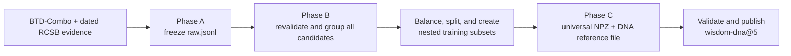
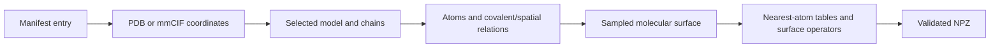
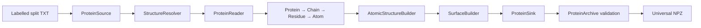
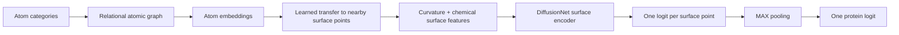

# WISDOM — protein structure and surface learning

**English** | [Español](README.es.md)

WISDOM studies whether a protein binds DNA from its three-dimensional structure. The project first
builds a balanced benchmark with reliable positive and negative labels. It then converts every
protein into atoms plus sampled surface points and trains models that connect internal chemistry to
the exposed molecular surface.

Preprocessing writes one compressed NPZ file per protein. An NPZ contains named numeric arrays:
atom coordinates and bonds, surface points and normals, small local-neighbour tables, and the
operators needed to diffuse information over the surface. DNA labels are stored separately, so the
same structural NPZ can be reused for another scientific question. Section 4 introduces every array
before giving its equations.

The three model versions answer separate questions. V1 determines which generic atom/surface
information and how much capacity a fixed R-GCN → DiffusionNet → MAX architecture needs. V2 keeps
that representation fixed and compares ways of combining point scores into one protein prediction.
V3 keeps the atomic part and final combination fixed and compares surface encoders. Training uses
only the whole-protein label; known DNA-contact points only measure whether the learned surface map
is meaningful. After V1 HPO, a separate optional analysis can compress the winning model's surface
embeddings into sparse latent candidates without changing the predictor or using any label.

## 0. Table of contents

- [1. Quick start](#1-quick-start)
- [2. Installation](#2-installation)
  - [2.1. Requirements](#21-requirements)
  - [2.2. Automated Conda installation](#22-automated-conda-installation)
  - [2.3. Activation, updates, and installation checks](#23-activation-updates-and-installation-checks)
- [3. DNA-binding benchmark and annotations](#3-dna-binding-benchmark-and-annotations)
  - [3.1. Why DNA binding is the first WISDOM problem](#31-why-dna-binding-is-the-first-wisdom-problem)
  - [3.2. Phase A — constructing and freezing the source evidence](#32-phase-a--constructing-and-freezing-the-source-evidence)
  - [3.3. From frozen evidence to a managed dataset](#33-from-frozen-evidence-to-a-managed-dataset)
  - [3.4. Phase B — designing a balanced benchmark without leakage](#34-phase-b--designing-a-balanced-benchmark-without-leakage)
  - [3.5. Statistical audit and interpretation](#35-statistical-audit-and-interpretation)
  - [3.6. Phase C — structural arrays and surface reference data](#36-phase-c--structural-arrays-and-surface-reference-data)
- [4. Structural preprocessing](#4-structural-preprocessing)
  - [4.1. Mental model and complete data journey](#41-mental-model-and-complete-data-journey)
  - [4.2. Preparing, running, and inspecting a dataset](#42-preparing-running-and-inspecting-a-dataset)
  - [4.3. From manifest entry to normalized coordinates](#43-from-manifest-entry-to-normalized-coordinates)
  - [4.4. From normalized atoms to the atomic graph](#44-from-normalized-atoms-to-the-atomic-graph)
  - [4.5. From atomic spheres to surface geometry](#45-from-atomic-spheres-to-surface-geometry)
  - [4.6. From surface points to the final NPZ](#46-from-surface-points-to-the-final-npz)
  - [4.7. Validation, reproducibility, and parallel execution](#47-validation-reproducibility-and-parallel-execution)
  - [4.8. Code architecture and testing](#48-code-architecture-and-testing)
  - [4.9. Scientific limitations](#49-scientific-limitations)
- [5. Trainable WISDOM models](#5-trainable-wisdom-models)
  - [5.1. Dataset index and graph batching](#51-dataset-index-and-graph-batching)
  - [5.2. WISDOMv1 models, equations, and tensor shapes](#52-wisdomv1-models-equations-and-tensor-shapes)
  - [5.3. WISDOMv2 pooling and localization diagnostics](#53-wisdomv2-pooling-and-localization-diagnostics)
  - [5.4. WISDOMv3 surface-encoder comparison](#54-wisdomv3-surface-encoder-comparison)
  - [5.5. Training, evaluation, and artifacts](#55-training-evaluation-and-artifacts)
  - [5.6. Post-HPO sparse concept discovery](#56-post-hpo-sparse-concept-discovery)
- [6. Bibliography](#6-bibliography)

## 1. Quick start

WISDOM has three ordered actions:

1. `Selection` decides which proteins belong to train, validation, and test.
2. `Preprocessing` converts those proteins into NPZ files and publishes `wisdom-dna@5`.
3. `Visualization` reads the published dataset and creates interactive three-dimensional views.

All three actions are declared in `experiments/dna_preprocess.yaml`. Their first argument is
`skip`: `false` runs an action and `true` omits it. The checked-in values reuse a prior design,
run Preprocessing, and request Visualization. The table below shows the safer single-purpose modes;
the YAML contains their alternative values as comments beside each step:

| Intended action | `select.skip` | `preprocess.skip` | `visualize.skip` | Required input |
|---|---:|---:|---:|---|
| Rebuild the selection only | `false` | `true` | `true` | `select.raw_path` points to `raw.jsonl`. |
| Reuse a complete design and build `wisdom-dna@5` | `true` | `false` | `true` | Set `select.existing_design`; the directory must include the labelled splits, catalog, dilutions, and `structures/index.json` snapshot. |
| Visualize an existing `wisdom-dna@5` | `true` | `true` | `false` | No design directory; the dataset is resolved by name and version. |

The complete `true/false/false` workflow can build and then visualize a new version in one command:
Visualization receives `{from: preprocess.dataset}`, so LambdaForge waits for the publication.
Visualization-only instead uses `{dataset: wisdom-dna@5}`, which requires that exact version to
exist in the Registry before the workflow starts.

WISDOM is installed through Conda. The repository's installer can use an existing Conda
installation or install Miniforge without administrator privileges, create the `wisdom` environment
from `environment.yml`, obtain a compatible LambdaForge checkout, and install both projects in
editable mode. “Editable” means that source-code changes take effect without reinstalling.

```bash
./install.sh
conda activate wisdom

# Review and then prepare the complete managed environment on the target cluster.
lf clusters bootstrap citius-ctgpgpu12 --project . --dry-run
lf clusters bootstrap citius-ctgpgpu12 --project .

# Choose one documented YAML mode first. Visualization-only requires an existing wisdom-dna@5.
lf validate experiments/dna_preprocess.yaml
lf explain experiments/dna_preprocess.yaml
lf run experiments/dna_preprocess.yaml --dry-run
lf run experiments/dna_preprocess.yaml --on citius-ctgpgpu12

lf validate experiments/validate_dna.yaml  # after wisdom-dna@5 exists
lf validate experiments/wisdom_v1.yaml
lf run experiments/wisdom_v1.yaml --dry-run
lf validate experiments/wisdom_v2.yaml
lf validate experiments/wisdom_v3.yaml

# After reviewing the HPO winner and copying its exact best-model.pt artifact:
lf validate experiments/wisdom_sparse_concepts.yaml
lf run experiments/wisdom_sparse_concepts.yaml --dry-run
```

`validate` checks the YAML, method arguments, imports, and dataset/file references. `explain` shows
the resolved parameters and defaults. `run` executes the enabled actions. Preprocessing publishes a
dataset only after all members and the index pass validation. A local publication has this logical
shape; LambdaForge chooses its physical root:

```text
runs/datasets/published/wisdom-dna/5/<content-id-prefix>/
├── index.jsonl
├── dataset-artifact.json
└── assets/
    ├── <first-protein>/
    │   ├── universal_npz
    │   ├── dna_annotation
    │   ├── source_structure
    │   └── dataset_design/
    │       ├── catalog.csv
    │       ├── preprocessing/{train,val,test}.jsonl
    │       ├── train.txt, validation.txt, test.txt
    │       ├── dilutions/replicate-00/train-<percent>.txt
    │       └── provenance.json
    └── <other-protein>/{universal_npz,dna_annotation,source_structure}
```

`index.jsonl` is the dataset index: each line names one protein, its partition, difficulty category
(`tier`), global DNA label, availability of local reference data, and files (`assets`) with recorded
SHA-256 fingerprints. Dilution membership is member metadata, so a smaller view reuses the same arrays. The
three preprocessing manifests remain a reusable upstream contract. LambdaForge stores their compact
catalog/views once as the first member's `dataset_design` directory asset; it does not duplicate
them for every protein. The complete similarity tables and statistical selection report remain in
the separately managed `select` output under `data/dna/design`, where they can be audited without
being staged again for NPZ generation.
`dataset-artifact.json` stores the content identity and build record. Use
`lf datasets member wisdom-dna@5 MEMBER_ID` to find one member's `universal_npz` asset. Open the
reported path without pickle as follows; Sections 4.4–4.6 define every array.

```python
import json

import numpy as np

with np.load("/path/reported/by/lambdaforge/universal_npz", allow_pickle=False) as protein:
    atom_positions    = protein["atom_positions"]
    atom_edges        = protein["atom_edge_index"]
    surface_positions = protein["surface_positions"]
    metadata          = json.loads(str(protein["metadata_json"].item()))
```

## 2. Installation

### 2.1. Requirements

- Linux or macOS on `x86_64`, `aarch64`, or Apple Silicon;
- Bash and Internet access for the initial environment and public-data downloads;
- enough local or cluster storage for coordinate files, specialist-tool databases, surfaces, and
  LambdaForge checkpoints;
- Conda is optional before installation: `install.sh` offers to install Miniforge under
  `~/miniforge3` when no Conda installation is found;
- an NVIDIA GPU is not required to design or preprocess the dataset. Training can use a managed
  CPU or CUDA environment selected by the LambdaForge cluster profile.

The reproducible package list is [environment.yml](environment.yml). It creates Python 3.11 and
installs Biopython, MMseqs2, and Foldseek from `conda-forge`/`bioconda`; Python dependencies such as
NumPy, SciPy, scikit-learn, Gemmi, PyTorch, `robust_laplacian`, and LambdaForge are then resolved
while WISDOM is installed. `robust_laplacian` provides the sparse point-cloud operator in Section
4.6; Gemmi, MMseqs2, and Foldseek are introduced scientifically in Sections 3.2 and 3.4.

The `[tool.lambdaforge.environment]` table in [pyproject.toml](pyproject.toml) declares this same
`environment.yml` and names `mmseqs` and `foldseek` as mandatory native executables. “Native” here
means a command-line program installed outside Python's wheel mechanism. The declaration is part of
the managed-environment identity; it is not repeated in each experiment YAML.

WISDOM requires LambdaForge `>=0.14.0` and deliberately sets no upper version bound while the
project follows the current framework release. Every executable action is a direct `Work` subclass with one
`run()` method. LambdaForge is the source of truth for typed file/dataset resolution, bounded maps,
safe JSON checkpoints, progress, immutable dataset publication, the placement Registry, logs,
resources, seeds, search, and run management. WISDOM remains responsible for protein
interpretation, scientific geometry, exact NPZ/sidecar validation, and protein visualization.

### 2.2. Automated Conda installation

Clone WISDOM, enter the repository, and run the executable installer:

```bash
git clone <WISDOM repository URL>
cd WISDOM
./install.sh
```

The installer is interactive so that it never silently replaces an environment or chooses an
unexpected LambdaForge directory. In order, it:

1. finds Conda, or offers a user-local Miniforge installation;
2. creates the `wisdom` environment, or offers to update an existing one with `--prune`;
3. reuses `./LambdaForge` or `../LambdaForge`, asks for another checkout, or clones the official
   repository;
4. verifies that LambdaForge satisfies the minimum version `>=0.14.0`;
5. removes obsolete editable `wisdom-protein` metadata from older releases, then installs
   LambdaForge and `wisdom[dev]` in editable mode inside the Conda environment;
6. optionally checks Python, dependency consistency, LambdaForge, MMseqs2, Foldseek, Biopython, and
   the WISDOM import.

For a non-interactive installation that accepts these defaults, use:

```bash
./install.sh --yes
```

The script does not install system-wide packages, an NVIDIA driver, or a system CUDA toolkit. If it
installs Miniforge and initializes the shell, open a new terminal before activation.

### 2.3. Activation, updates, and installation checks

Activate the environment in every new terminal before running WISDOM:

```bash
conda activate wisdom
```

If Conda has not yet been initialized for the current shell, load it once using the path printed by
the installer, or run `conda init <shell>` and open a new terminal. Running `./install.sh` again is
the supported update path: it can update the existing environment from `environment.yml`, reuse the
chosen LambdaForge checkout, and reinstall both editable projects.

These read-only checks confirm what the environment can execute:

```bash
python --version
python -m pip check
lf --version
mmseqs version
foldseek version
python -c 'import Bio, gemmi, wisdom; print("WISDOM environment OK")'
```

For a cluster profile with `environment: managed`, prepare the project-specific remote environment
from the WISDOM repository root:

```bash
# Inspect the exact platform, packages, executables, and connectivity without changing the cluster.
lf clusters bootstrap citius-ctgpgpu12 --project . --dry-run

# Apply the reviewed plan. This command is idempotent for an already complete environment.
lf clusters bootstrap citius-ctgpgpu12 --project .
lf doctor --on citius-ctgpgpu12
```

`--project .` is significant: it tells bootstrap to read WISDOM's `pyproject.toml` and
`environment.yml`, build the WISDOM wheel, and prepare those dependencies instead of performing only
a generic cluster bootstrap. LambdaForge uses its checksum-verified micromamba executable, so the
remote machine does not need a pre-existing global Conda installation. It creates one immutable
prefix containing Python, the resolved Conda packages, LambdaForge, WISDOM, and the selected
PyTorch/CUDA build; then it verifies the Conda inventory and both required executables before the
environment can be reused. A later `lf run ... --on citius-ctgpgpu12` discovers the same project
declaration automatically.

`Selection` performs a second, immediate executable and version preflight at the beginning of
the Work, before requesting any RCSB structure or starting descriptor computation. If bootstrap was
not applied, a tool disappeared, or its version command is unusable, `work.log` identifies the
failing executable and prints the exact local and managed-cluster remediation commands. The later
`Preprocessing` Work does not require MMseqs2 or Foldseek: it consumes the three already fixed
manifests and uses Python/Gemmi for geometry, so native tools are checked only before selection.

LambdaForge 0.14 imports only classes derived from `Work`; function targets and the former
`Task`/`TaskContext`/`PreprocessingTask` stack no longer exist. `Selection` uses
`self.resume_map` for dependency-aware record reuse, and `Preprocessing` uses the same service with
WISDOM validators for universal NPZs and DNA sidecars. Both use managed cache files for coordinates,
validated checkpoints for specialist tables, and managed outputs for all-or-nothing publication.
LambdaForge also resolves and executes external tools, captures their versions/logs, and provides
the HDBSCAN clustering backend. WISDOM does not implement another downloader lock,
atomic-cache protocol, subprocess runner, clustering backend, Registry, or publisher. Section 4.7
explains this boundary.

## 3. DNA-binding benchmark and annotations

### 3.1. Why DNA binding is the first WISDOM problem

WISDOM's first question is: **can the selected protein chain bind DNA in a biologically relevant
setting?** This is a useful first problem because binding happens at a three-dimensional surface:
the model must relate internal atoms to the shape and chemistry exposed to another molecule.

A **benchmark** is a fixed population with explicit labels, train/validation/test partitions, and
an evaluation protocol. These rules let different models answer the same question under the same
conditions.

The **training partition** adjusts model weights. The **validation partition** compares settings and
selects a checkpoint. The **test partition** is held back until those choices are complete and gives
the final estimate. WISDOM never creates these partitions randomly during model loading.

There are two different answers associated with each accepted protein, and confusing them would
invalidate the experiment:

- the **global label** answers whether the whole protein is considered DNA-binding (`1`) or
  non-DNA-binding (`0`);
- the **local reference** marks the surface points that form a known DNA interface. It is also
  called local *ground truth* (GT): a reference answer used to evaluate localization, not an input
  shown to the model and not a target used by the present weakly supervised loss.

A deposited structure is only one experimentally studied snapshot. Researchers may crystallize a
protein alone, remove flexible regions, use a condition without DNA, or deposit only one state of a
multi-part system. Therefore, **“this PDB file contains no DNA” does not imply “this protein cannot
bind DNA.”** Even seeing a protein near DNA without contact in one assembly does not prove that it
never binds under another condition. WISDOM consequently treats a protein as *unknown* unless it
has defensible positive or negative evidence; unknown records are not relabelled as negatives.

This makes negatives harder than positives. A physical protein–DNA contact supports a positive,
but finitely many structures cannot prove that a protein never binds DNA. WISDOM therefore starts
its negative pool from **BTD**, the benchmark of Rahman *et al.* [22]. BTD begins with expert-reviewed
Swiss-Prot records, removes proteins annotated as known or possible DNA/RNA binders, and reduces
sequence redundancy. It does not treat the absence of DNA from one structure as negative evidence.

**BTD-Combo** combines BTD with the older PDB1075 and PDB14K benchmarks and reduces redundancy in
each class. WISDOM uses its labels as source evidence, then adds structure and contact checks because
surface evaluation needs coordinates. A negative is therefore well curated, but it is still a
benchmark label—not proof that binding is impossible in every biological context.

Training is **weakly supervised**: it uses the global label, while the local interface is reserved
for evaluation. The model must therefore discover which surface regions explain its whole-protein
decision.

The complete selection and preprocessing flow is:



| Phase | Main operation | Result used by the next phase |
|---|---|---|
| A | Gather defensible labels and exact structures. | Frozen `raw.jsonl`; no split exists yet. |
| B | Revalidate evidence, group related proteins, balance, split, and audit. | Fixed catalog, train/validation/test files, and nested train subsets. |
| C | Generate protein geometry and a separate DNA-interface reference. | Validated immutable dataset for training and evaluation. |

### 3.2. Phase A — constructing and freezing the source evidence

Phase A is an infrequent preparation step. It converts public sequence annotations and experimental
structures into a fixed candidate table. “Source evidence” means these collected records before
balancing or splitting; it does not mean unverified data. Normal dataset design and preprocessing
reuse the resulting table. Rebuild it explicitly with:

```bash
python scripts/create_fasta.py --workers 36
```

The input is `scripts/btd_combo.fasta`, a local BTD-Combo export. In FASTA, a line beginning with
`>` names a record and the following letters encode its amino-acid sequence. The script adds exact
structure identity and evidence to these sequence-only records.

The output is `data/dna/raw/raw.jsonl`, with one JSON object per candidate: identifier, chain,
biological assembly and copy, label, evidence, source, and amino-acid sequence. Reports call this
unbalanced collection the **RAW population**. The current frozen file has about 4,484 candidates
(3,529 positive and 955 negative). It is evidence, not yet a training set. `raw.fasta` is only a
compatibility view for sequence tools.

**A1 — make BTD-Combo compatible with surface evaluation.** BTD-Combo is sequence based, whereas
WISDOM requires a specific three-dimensional chain. The script removes ambiguous and duplicate
sequences, then accepts a mapping to the Research Collaboratory for Structural Bioinformatics
Protein Data Bank (**RCSB PDB**) only when the complete deposited sequence matches. The RCSB PDB is
the United States data center and web portal for the worldwide PDB archive, the public collection of
three-dimensional macromolecular structures [1, 17]. An identifier such as `1ABC_A` means chain A of
PDB entry `1ABC`; it points to experimental coordinates, not merely a protein name.

The mapped structure must resolve heavy atoms—atoms other than hydrogen—for at least 90% of the
sequence, because a severely incomplete chain cannot support a trustworthy surface reference. The
script reconstructs the stated **biological assembly**, the molecular arrangement proposed to be
biologically active rather than merely the contents of one crystallographic box. BTD positives are
kept only when protein and DNA heavy atoms make the direct contact defined mathematically in Section
3.4. Without such contact, WISDOM cannot obtain the required coordinate-based local interface and
removes that candidate from this structural benchmark; it does not change it into a negative.

BTD negatives undergo a different check. Their global negative label still comes from the BTD
curation procedure explained in Section 3.1. WISDOM asks whether a sufficiently complete mapped
structure can be audited and whether that structure contradicts the label. Any negative whose
inspected biological assembly directly contacts DNA is quarantined, as are failed downloads and
incomplete structural audits. Passing this check means “BTD negative with no contradiction in the
audited structure,” not “every surface point was experimentally proven unable to bind DNA.” The
all-zero local reference used later is conditional on that accepted global label.

**A2 — add positives with observable interfaces.** The second source is a date-frozen RCSB query
for experimental biological assemblies containing both protein and DNA. This query only discovers
candidates: inclusion in the same file is not sufficient. WISDOM uses **Gemmi**, an open-source
structural-biology library that reads PDB/PDBx/mmCIF records and applies their assembly symmetry
operations [3], to reconstruct the selected assembly. A chain becomes positive only after the
protein–DNA heavy-atom contact test succeeds. A deposited chain without DNA, or a chain that does
not touch DNA in one DNA-containing structure, stays unknown and never supplies a negative.

**A3 — resolve conflicts and freeze provenance.** An exact sequence with incompatible labels is
quarantined. The script records source versions and hashes, detailed CSV evidence, typed
`raw.jsonl`, and FASTA views. The balanced FASTA is only an inspection aid: Phase B always reads the
full RAW population so even an omitted protein can reveal a similarity link between retained ones.

> **Result after Phase A:** every accepted row has a label source, an exact RCSB chain/assembly, a
> sequence, and reproducible evidence. No protein has yet been selected for train, validation, or
> test.

### 3.3. From frozen evidence to a managed dataset

The `select` step in [`experiments/dna_preprocess.yaml`](experiments/dna_preprocess.yaml) revalidates all RAW candidates,
computes similarity and physical descriptors, forms dependency groups, and selects the balanced
population that reports call **CANONICAL**. This is the population assigned to partitions. RAW
remains larger because even an omitted candidate
may connect two selected proteins. The production 4 Å resolution ceiling leaves a target of 907
members per class for the current RAW file. All valid but excluded records remain explained in
`catalog-all.csv`; exclusion means “outside this benchmark,” not “biologically invalid.”

After `select` succeeds, LambdaForge passes six named outputs to `preprocess`: the three labelled
split files, catalog, dilution directory, and immutable coordinate snapshot. Each path is
fingerprinted as an exact Phase C input:

```text
data/dna/design/
├── train-labelled.txt
├── validation-labelled.txt
├── test-labelled.txt
├── catalog.csv
├── dilutions/
└── structures/
    ├── index.json
    └── <pdb-id>.cif.gz
```

The `*-labelled.txt` files contain `RCSB_CHAIN<TAB>LABEL`; for example,
`1ABC_A<TAB>1`. They define exactly which proteins and labels enter each split. Two columns cannot
also store the selected biological assembly, repeated chain copy, coordinate digest, contact
evidence, leakage group, or phenotype. That information remains in `catalog.csv`.

Selection also writes three self-contained JSONL files for portable programmatic inspection. Each
line carries the TXT identity and label plus every required catalog field and dilution membership.
The public pipeline deliberately uses the compact, human-editable representation:

- the three JSONL files need no catalog join;
- the three existing `*-labelled.txt` files require `catalog.csv`, and the optional `dilutions/`
  directory restores the nested training views.

In both cases the split files, not the catalog, choose membership and labels. The catalog only
completes the structural identity needed to reproduce the selected assembly and DNA annotation.
The `structures/` directory supplies the bytes themselves. Selection stores each selected PDB once,
even when several selected chains use it.

The file is called `val.jsonl` because it is a direct workflow input; its records retain the
canonical partition value `validation`, which the training API exposes through the shorter `val`.
No manifest contains a machine-specific `structure_path`: preprocessing derives it from the
portable snapshot. Requiring an attempt-local path from `catalog.csv` caused the former failure and
is not part of the contract.

A LambdaForge **Work** is one executable step. A dataset **version** identifies immutable logical
content; a **placement** is a verified physical copy of that version on one machine. The Registry
tracks those placements. The YAML requests resources, while `workers` limits concurrent records;
reserving 36 CPUs does not by itself create 36 workers.

LambdaForge 0.14 has no `lf run --step` option. Edit the first `skip` parameter of each step in the
single YAML. The checked-in configuration has `true/false/false`: Selection forwards the declared
`data/dna/design` directory, Preprocessing builds and publishes version 5, and Visualization consumes
the named `preprocess.dataset` output. The third step starts only after successful publication, so
version 5 does not have to exist beforehand. In visualization-only mode, replace that output
reference with the commented Registry selector `{dataset: wisdom-dna@5}`.

```bash
# Validate and run the selected combination.
lf validate experiments/dna_preprocess.yaml
lf explain experiments/dna_preprocess.yaml
lf run experiments/dna_preprocess.yaml --dry-run
lf run experiments/dna_preprocess.yaml --on citius-ctgpgpu12

# In another terminal, inspect all jobs or follow this build's durable log.
lf top --history 300
lf logs wisdom-dna-preprocess --follow

# Inspect the immutable version and its selected local placement.
lf datasets show wisdom-dna@5
lf datasets stats wisdom-dna@5
lf datasets members wisdom-dna@5 --partition split=train --limit 20
lf datasets verify wisdom-dna@5

# Repeat the complete scientific audit without modifying the immutable dataset.
lf validate experiments/validate_dna.yaml
lf run experiments/validate_dna.yaml --on citius-ctgpgpu12
```

When `select.skip` is true, Selection performs no downloads, similarity search, clustering,
balancing, or splitting. With `existing_design: null` it declares no design input or output. If a
later active Preprocessing step needs the prior design, set `existing_design` to that complete
directory and restore the six `{from: select.<output>}` bindings; Selection then registers those
paths without recomputing them. When `preprocess.skip` is true, Preprocessing reads no manifests and
publishes no dataset. LambdaForge records each input, mmCIF, and map result, so a compatible retry
reuses valid snapshot checks and per-record checkpoints. `--restart` explicitly discards the
selected Run's checkpoints; `--rerun` deliberately asks for a new Execution and should not be used
merely to continue.

`existing_design` is deliberately `null` while `skip=false`. Existing `train-labelled.txt` files
do not modify a fresh Selection: labels and membership are recomputed from `raw_path`, and the
complete output directory is replaced only after success. Leaving a large prior design declared
while rebuilding would make LambdaForge stage an input that no algorithm reads.

The Work also copies the complete result atomically to the configured `output_directory`. The YAML
spells this as `../data/dna/design` because LambdaForge resolves publication paths from the
`experiments/` directory; the resulting project path is `data/dna/design`. `REPORT.md` explains its
audit; `*.txt` files contain IDs and
`*-labelled.txt` files contain `RCSB_CHAIN<TAB>0|1`. `catalog.csv` is a convenient full audit view;
current Selection additionally emits the equivalent self-contained JSONL inputs and the exact
compressed coordinate snapshot listed by `structures/index.json`.

To place the same valid dataset on another cluster, copy the immutable version rather than rerunning
discovery, mapping, geometry, and annotation:

```bash
# Let LambdaForge choose a verified source placement and copy it to the target cluster.
lf datasets materialize wisdom-dna@5 --on OTHER_CLUSTER --strategy replicate --apply

# Or name both ends explicitly.
lf datasets replicate wisdom-dna@5 --from citius-ctgpgpu12 --to OTHER_CLUSTER --apply
```

Both commands verify bytes and register another placement of the same version. To reproduce
preprocessing elsewhere, transfer the complete design: manifests, `catalog.csv`, `dilutions/`, and
`structures/`. A list of identifiers cannot reproduce the coordinates audited by Selection.
`lf top` shows exact map counts; normal logs
announce each phase and periodic liveness, while `verbose: true` adds one start/completion line per
evidence or protein record.

> **Operational result:** the first two Works create the self-contained design and immutable
> DatasetVersion. Later preprocessing-only runs reuse the complete design; visualization can then
> consume the Registry version independently, without contacting RCSB.

### 3.4. Phase B — designing a balanced benchmark without leakage

Phase B validates all RAW records, builds dependency groups, discovers physical phenotypes, selects
CANONICAL membership, assigns splits, and derives train-only dilutions—in that order. Groups must
precede selection: if omitted protein B links A to C, A and C must still stay in one split. Otherwise
the test set could contain information already seen through a close relative, which is **data
leakage**. Train adjusts the model, validation guides choices, and test remains reserved for the
final estimate.

**Identity and structural revalidation.** Each JSONL row explicitly names its identifier, assembly,
protein copy, label evidence, origin, source, and sequence. For each PDB entry, a bounded worker
downloads or reuses the mmCIF, verifies its SHA-256 file digest, reconstructs that biological
assembly, and selects the declared chain copy. This prevents an equally named chain in another
assembly copy from being treated as the same physical object.

For protein heavy atom $p$ and DNA heavy atom $d$, let their Cartesian centres be $x_p$ and $x_d$ in
ångströms, and let $r_p$ and $r_d$ be their element-specific van der Waals radii. A direct contact is

$$
\lVert x_p-x_d\rVert_2 < r_p+r_d+0.5\ \text{Å}.
$$

The norm is straight-line distance. The extra 0.5 Å allows small coordinate uncertainty around the
atom envelopes; it does not imply a covalent bond. A KD-tree spatial index avoids comparing every
protein atom with every DNA atom. Every RAW positive must reproduce a contact in its exact
assembly/copy. The audit retains sequence, coverage, experimental method, resolution, release year,
size, shape, composition, and interface descriptors.

For X-ray and cryo-EM structures, larger resolution values mean less spatial detail. Structures
worse than the 4 Å default remain in dependency grouping but cannot enter CANONICAL. Records without
a comparable numeric resolution, such as many NMR models, remain eligible rather than receiving an
invented value. Every exclusion appears in `quality-exclusions.txt` and `selection-audit.json`.

**Leakage groups use all RAW candidates.** **MMseqs2** finds sequence similarity; **Foldseek** finds
three-dimensional fold similarity that can remain after sequences diverge. Both are needed because
either relation can make two examples statistically dependent.

A dependency edge does not claim equal function; it only forbids a cross-split comparison. MMseqs2
adds an edge for identity ≥ 0.30, bidirectional coverage ≥ 0.80, and E-value ≤ 0.001. Identity is the
matching fraction of an alignment, coverage is the aligned fraction of each complete sequence, and
smaller E-values mean fewer matches of this strength are expected by chance. Foldseek requires
probability ≥ 0.90, normalized TM-score ≥ 0.75 and coverage ≥ 0.80 in both directions, and E-value
≤ 0.001. Exact sequences and, by default, a shared PDB entry add hard edges.

The connected components of the union of all edges are indivisible **leakage groups**. Thus A–B and
B–C keep A, B, and C together even without an A–C edge. This grouping is a safety constraint, not a
biological family assignment. Raw tool output, accepted edges, reasons, versions, commands, and
thresholds remain under `clusters/` and `provenance.json`.

**Physical phenotypes measure representation.** Unlike leakage groups, phenotype clusters describe
similar measured profiles; they do not constrain independence or define biological functions.
Global phenotypes use size, shape, composition, and compactness descriptors.
Positive-interface phenotypes separately use contact density, interface extent, region count, and
contacted composition. They help distribute observed diversity across splits but never break a
leakage group or become a model input.

Before HDBSCAN, each finite descriptor column $j$ is robustly scaled. If $x_{ij}$ is descriptor $j$
for protein $i$, $\operatorname{median}_j$ is that descriptor's population median, and
$\operatorname{IQR}_j$ is its 75th percentile minus its 25th percentile, then

$$
z_{ij}=\frac{x_{ij}-\operatorname{median}_j}{\operatorname{IQR}_j}.
$$

Median/IQR scaling limits the influence of extreme sizes. **HDBSCAN** finds dense regions without a
preselected number of clusters and marks isolated proteins as **noise**. Here noise means “no stable
dense group,” not “corrupt” or “negative.” That is preferable to forcing unusual structures into an
arbitrary family.

Interface elongation is measured inside the interface plane. If `s1 >= s2 >= s3` are the principal
spatial spreads of contacting residue centres, the aspect ratio is `s1/s2`; `s3` describes sheet
thickness and is deliberately not the denominator. A nearly collinear interface with `s2` close to
zero is recorded as unavailable. This avoids the artificial ratios near one billion present in the
preliminary report, where a planar patch had mistakenly been divided by its near-zero thickness.

**CANONICAL selection and fixed splits.** Only after full-RAW groups, the quality eligibility flag,
and phenotypes exist does the default policy retain all eligible negatives and choose the same
number of positives. It preserves available
core positives, then increases leakage-group, phenotype, and origin coverage while using a seeded
SHA-256 tie-break. catalog-all.csv preserves
every valid RAW candidate; catalog.csv contains selected members; selection-audit.json explains all
counts; omitted-positives.txt lists valid positives not needed by the requested ratio.

A deterministic greedy objective assigns entire leakage groups toward 70% train, 15% validation,
and 15% test. It penalizes deviations in size, class count, phenotype distributions, and origin.
Hard checks require one split per group and both labels in validation and test. train.txt,
validation.txt, and test.txt are
ID-only views of the same assignments stored in catalog.csv and final index.jsonl. Their
`-labelled.txt` siblings add a tab-separated binary label and are checked against the catalog.
Every training dilution has the same pair of views.

More precisely, for split $s$, let $f_s$ be its requested fraction, $n_s$ its observed size,
and $n$ the canonical size. For any category $k$—a label, phenotype, or positive origin—let
$n_{s,k}$ and $n_k$ be its split and population counts. The optimizer minimizes a sum whose
count terms have the form

$$
J_{count}=\sum_s w_{size}\left(\frac{n_s-f_sn}{\max(f_sn,1)}\right)^2
+\sum_s\sum_k w_k\left(\frac{n_{s,k}-f_sn_k}{\max(f_sn_k,1)}\right)^2.
$$

The implementation gives class terms more weight than phenotype/origin terms. Squaring penalizes
large deviations more strongly, while normalization prevents a frequent category from dominating
only because it has more members. The algorithm maintains incremental counters, so placing one
group does not rescan the full dataset. These are soft balancing preferences, never permission to
break a leakage group.

**Nested learning curves.** Dilutions alter training only and preserve complete dependency groups:
`train-10` is contained in `train-25`, then `train-50`, up to `train-100`. Exact sizes may differ
slightly because groups are indivisible. Validation and test stay identical.

> **Result after Phase B:** membership, labels, leakage groups, train/validation/test assignments,
> and nested training subsets are fixed and audited. Phase C may add geometry, but it may not change
> any of these decisions.

### 3.5. Statistical audit and interpretation

Phase B ends with a compact statistical audit. `REPORT.md`, CSV files, and JSON evidence are
generated from the same results, so the prose and machine-readable values describe the same
population. It answers four questions:

- **balance:** do positives and negatives occur in the intended proportions in every split and
  training dilution?
- **leakage:** does any exact sequence, accepted sequence/structure similarity edge, PDB group, or
  complete dependency component cross train, validation, and test?
- **representation:** do the splits preserve the observed global and positive-interface shapes
  found in Phase B, rather than accidentally reserving one kind of protein for test only?
- **dilutions:** is each smaller train set contained in every larger one and composed of complete
  leakage groups only?

`design-summary.json` records the exact counts by split, class, origin and phenotype. It reports a
warning when a split differs by more than ten percentage points between classes, when one RAW
leakage group contains at least 5% of all candidates, or when a stable phenotype is absent from one
split despite appearing in several indivisible groups. A warning asks for interpretation; a hard
failure (duplicate identity, crossed group, missing class, non-nested dilution or fragmented group)
prevents publication. Phenotype coverage remains a soft representativeness objective because the
mere presence of three groups does not prove that all class, group and phenotype constraints can be
satisfied simultaneously. `REPORT.md` explains these same values in ordinary language. It deliberately
does not claim ARI stability, technical-only AUROC, SMD, KS or Cramér's V because the simplified
selection does not compute those analyses.

### 3.6. Phase C — structural arrays and surface reference data

Phase B fixed membership, labels, and splits but did not create model-ready geometry. Phase C writes
two separate files per protein: a **universal NPZ** with atoms and surface geometry, and a DNA
**sidecar**, meaning a small companion file, tied to that NPZ fingerprint and point order. The NPZ contains no label, split, DNA, or
target field, so another task can reuse it without benchmark information. The current dataset
derives every positive sidecar from observed DNA coordinates; it never silently substitutes the
separate DyProL residue-mask compatibility route. Section 4 derives the universal arrays.

The base surface is centered for numerical stability. If $s'_i$ is stored point $i$ and $o$ is
the stored `coordinate_origin`, its source-frame coordinate is $s_i=s'_i+o$. For DNA atom $j$,
let $x_j$ be its source-frame centre and $r_j$ its Gemmi-tabulated van der Waals radius. The
physical surface gap is

$$
d_i=\min_j\left(\lVert s_i-x_j\rVert_2-r_j\right).
$$

Subtracting the DNA atom radius changes a centre distance into an approximate distance from the
protein surface point to the DNA van der Waals envelope. With positive gap $a=1.4$ Å and negative
gap $b=3.0$ Å, the primary arrays are defined as follows:

$$
y_i^{hard}=\mathbb{1}[d_i\leq a],\qquad
m_i=\mathbb{1}[d_i\leq a\ \lor\ d_i\geq b].
$$

Here $\mathbb{1}$ is one when its condition is true. `surface_target_hard` stores
$y_i^{hard}$; `surface_valid_mask` stores $m_i$. Points with $a<d_i<b$ form an ambiguity band:
they remain available for visualization but are excluded from binary surface metrics. The soft
target changes continuously rather than jumping at one cutoff. With
$t_i=\operatorname{clip}((d_i-a)/(b-a),0,1)$,

$$
y_i^{soft}=\frac{1+\cos(\pi t_i)}{2}.
$$

Thus it is exactly one at or inside the confident interface, exactly zero beyond the confident
negative boundary, and smooth between them. The sidecar also stores `surface_distance_to_dna`, a
distance-validity mask, hard targets for configured sensitivity cutoffs, those cutoff values, a
schema/provenance JSON scalar, and the SHA-256 of the exact base NPZ. Curated global negatives have
hard/soft zero at every valid point. Their DNA distance is not computable, so it is NaN only where
`surface_distance_valid` is false; it is never disguised as zero distance.

The sidecar is itself a pickle-free NPZ. Here `M` is the number of points in the base surface and
`T` is the number of configured sensitivity cutoffs. Boolean masks answer whether a value may be
used; they must always be consulted before interpreting a distance or local target.

| Sidecar array | Shape | Dtype | Meaning |
|---|---:|---|---|
| `surface_target_hard` | `[M]` | `uint8` | Binary contact target at the primary positive gap. |
| `surface_valid_mask` | `[M]` | Boolean | Points eligible for primary local metrics. |
| `surface_target_soft` | `[M]` | `float32` | Smooth target between the positive and negative gaps. |
| `surface_distance_to_dna` | `[M]` | `float32` | Signed DNA-envelope gap in Å, or NaN when unavailable. |
| `surface_distance_valid` | `[M]` | Boolean | Whether the corresponding distance is meaningful. |
| `surface_target_hard_sensitivity` | `[M,T]` | `uint8` | Binary targets under every sensitivity cutoff. |
| `local_gt_available` | scalar | Boolean | Whether this protein has usable local reference data. |
| `sensitivity_gaps` | `[T]` | `float32` | Sensitivity cutoffs in Å, in column order. |
| `base_npz_sha256` | scalar | fixed Unicode | Fingerprint of the exact universal NPZ and point order. |
| `annotation_metadata_json` | scalar | fixed Unicode | Assembly, thresholds, method, counts, and provenance. |

For separately imported DyProL records, the compatibility route assigns each surface point the mask
of its nearest represented residue and records `local_gt_method=binding_residue_mask`. It has no
DNA-distance sensitivity thresholds and is not used by `wisdom-dna@5`.

Global and local eligibility differ. A reliable positive can train from its global label even when
no local reference is usable. A positive with zero labelled surface points keeps `label=1`, receives
an invalid local mask, is excluded from localization metrics, and is restricted to train; it never
becomes an all-negative surface. Dilution views reuse the same NPZ/sidecar bytes and never change
validation or test.

With dimensionless represented-area weights $w_i>0$ normalized so that their sum is one, annotation
records

$$
W_+=\sum_i w_i y_i^{hard},\qquad
W=\sum_i w_i=1,\qquad
f_{interface}=W_+/W.
$$

These are positive represented weight, total normalized weight, and interface fraction—not physical
areas in Ų. Connected components of positive points in the bounded surface-neighbour table give
`number_of_positive_regions`, enabling site-size and single-/multi-region analyses without changing
weakly supervised training.

Before publication, the sink rejects object arrays, length mismatches, invalid masks/probabilities,
incorrect missing-distance values, and NPZ/sidecar fingerprint disagreement. `index.jsonl` then
records each member's split, targets, statistics, and checksummed NPZ, sidecar, and source structure.
Relative paths make the version movable; its content ID depends on membership and exact bytes, not
the workstation or cluster path.

> **Result after Phase C:** every published member has a reusable label-free protein representation,
> a separately verified DNA evaluation sidecar, fixed split metadata, and checksummed provenance.
> This is the dataset consumed by WISDOM training.

## 4. Structural preprocessing

Preprocessing is the conversion from coordinate files written for structural biology into numeric
arrays that a later machine-learning model can consume. This section follows that conversion in the
same order as the program. Each subsection assumes only the concepts introduced before it.

### 4.1. Mental model and complete data journey

**From a physical protein to a coordinate file.**

A protein is a physical molecule made from atoms. Experiments and structure-prediction programs do
not give WISDOM the physical molecule itself; they provide a **coordinate file**. Such a file is a
structured table describing atom names, chemical elements, and three-dimensional positions. The
position of one atom is a triple `(x, y, z)` measured in ångströms, where one ångström (Å) is
`10^-10 m`.

Structural files organize atoms into a hierarchy:

- an **atom** is one chemical element at one position;
- a **residue** is a chemical building block, usually one amino acid, containing several atoms;
- a **chain** is an ordered sequence of residues;
- a **model** is one complete coordinate interpretation of the structure. A file may contain
  several models, for example alternative experimental conformations.

The two supported format families are PDB and PDBx/mmCIF. They encode broadly the same structural
ideas with different syntax. WISDOM delegates their parsing to Gemmi rather than trying to interpret
their text manually. Compressed `.gz` files contain the same PDB or mmCIF text after gzip
decompression; gzip changes storage size, not molecular meaning.

**Why the dataset starts with a TXT manifest.**

A scientific dataset may mix public Protein Data Bank entries with private or locally generated
coordinate files. Copying all structures into one directory would make the dataset harder to move,
audit, and reproduce. WISDOM therefore starts from a small **manifest**: a TXT file in which every
non-comment line says where one protein comes from.

A line can be a public PDB identifier such as `4hhb_A`, in which case WISDOM can obtain the
coordinate file from RCSB PDB, or a local path such as `../structures/model.cif.gz`. The manifest is
the ordered definition of the dataset; the coordinate files are its physical inputs. This separation
lets the same manifest work with an existing cache, download missing public entries, and report a
failure for one protein without losing successful results for the others.

**Why WISDOM uses three different geometric representations.**

A later geometric model needs more than an unordered table of atoms. It needs to know which objects
may exchange information. WISDOM represents those possible exchanges with **graphs**. A graph is a
set of nodes plus a set of edges; an edge says that two nodes are related. The edge is not itself a
chemical force or a learned message. It is a fixed structural connection on which a future model may
operate.

The three relations do not have the same physical meaning, so WISDOM does not force all of them
into generic edge lists:

1. The **atomic graph** uses atoms as nodes. Chemical bonds are discrete relations, so every required
   covalent edge is retained. Spatial context is limited to the nearest `Kmax` atoms inside a
   physical cutoff, preventing a dense radius graph.
2. The **atom-to-surface table** gives each surface point the nearest `Jmax` atoms inside a physical
   cutoff. It stores a rectangular, masked local neighborhood because proximity is not a chemical
   bond. A model chooses any prefix `J<=Jmax` without preprocessing again.
3. The **surface differential operators** describe how a scalar value can spread over the sampled
   boundary and how it changes along that boundary. They play the role that derivatives play on a
   smooth surface. DiffusionNet uses them directly, so it does not need to send a learned message
   through every nearby point pair.

The NPZ contains fixed measurements, bounded neighborhoods, and deterministic numerical operators,
but no neural-network activations, embeddings, attention values, or predictions.

**The complete data journey.**

With those objects in mind, one manifest line follows this path:



Each arrow consumes the result immediately above it. Section 4.2 explains how to run and inspect this
journey. Sections 4.3–4.7 then revisit the same arrows in scientific and mathematical detail.

### 4.2. Preparing, running, and inspecting a dataset

`Selection` writes its audit directory under `data/dna/design`. The simplest preprocessing inputs
are `train-labelled.txt`, `validation-labelled.txt`, and `test-labelled.txt`. Each line contains a
protein identifier, a tab, and its binary label. `catalog.csv` supplies the assembly, leakage group,
phenotype, and evidence fields that do not fit in those two columns. New Selection runs also create
equivalent `preprocessing/{train,val,test}.jsonl` files, where one JSON object on each line already
contains that complete record. Preprocessing accepts either representation.

The manifests say **which** proteins to process; the `structures/` snapshot says **which exact
coordinate bytes** were approved. A reusable complete design therefore also contains
`structures/index.json` and one compressed mmCIF per selected PDB entry. If those files are absent,
rerun Selection once instead of downloading current structures and pretending they are the original
selection evidence.

The `data/dna/design` directory currently present in this workspace was produced before structural
snapshots were added. Its labelled TXT files and catalog remain useful for auditing membership, but
the directory cannot by itself build schema 3.0 because it has no `structures/index.json`. Run
Selection once with the current code to create a complete design; compatible later preprocessing
runs can then reuse it without querying RCSB.

When Selection runs on a cluster, its optional `output_directory` is written to that cluster's
project mirror; LambdaForge does not silently copy a gigabyte-scale directory back to the local
machine. A later `{file: ../data/dna/design}` input therefore requires the local and remote copies
to contain exactly the same filenames and bytes. The directory fingerprint uses relative names and
file contents, not timestamps. If Selection produced the complete snapshot remotely, synchronize
that directory locally once before using the skipped-Selection mode. Copy into a separate staging
directory and rename it to `data/dna/design` only after the transfer finishes; submitting while the
live directory is still growing fingerprints a partial copy. This check prevents local manifests
from being combined accidentally with a different remote coordinate snapshot.

The files are separate so their supervised roles are visible, but preprocessing concatenates their
records and deduplicates source PDB entries before geometry. Molecular geometry does not depend on a
label or split, so every selected identifier is processed once. Split membership and labels enter
only the final `members.jsonl` and DNA sidecar metadata; they are never inferred from filenames or
inserted into the universal NPZ. `preprocessing-report.json` is the exact `identifier -> NPZ` join
used by annotation. Automated validation proves that the three manifests are disjoint and that every
published member retains its declared label, leakage group, and split.

**Remote entries.**

```text
1abc
4hhb_A
4hhb_AB
4hhb_A_B
```

The four-character code `4hhb` is the public identifier assigned by the Protein Data Bank. An
underscore introduces the optional chain selector described in Section 4.1. A complete chain name
occupies each underscore-separated field: `4hhb_AB` retains the single chain named `AB`, whereas
`4hhb_A_B` retains two chains named `A` and `B`. This matters because PDBx/mmCIF permits chain names
with several characters. Commas and the former `#A,B` form are invalid. A selector on the line is
specific to that protein and therefore takes precedence over the global `config.chains` setting.

**Local structures.**

```text
/data/protein.pdb
/data/protein.pdb.gz
/data/protein.cif
/data/protein.mmcif
/data/protein.cif.gz
../structures/protein.mmcif.gz
```

Relative paths are resolved relative to their TXT file. A local filename is opaque: `_AB` in a
local filename is **not** interpreted as a chain selector; a caller uses the global `chains`
configuration instead. This local-path grammar belongs to the reusable structural component and its
tests. The production WISDOM-DNA design uses verified RCSB identifiers only. Any future custom Work
that exposes local paths must stage them as typed LambdaForge file inputs so their bytes participate
in the Work fingerprint rather than silently reusing results from different coordinates.

Only `.pdb`, `.cif`, `.mmcif`, and their gzip-compressed variants are accepted. BinaryCIF, MMTF,
XML, trajectories, and archive containers are outside the current input contract.

**Configuration and execution.**

[`experiments/dna_preprocess.yaml`](experiments/dna_preprocess.yaml) is the public DNA data entry
point. It contains `select`, `preprocess`, and `visualize`; the first parameter of each step is
`skip`. Selection reuse for an active Preprocessing step requires the complete existing design and
`raw_path: null`; the current input bindings pass its six named outputs to Preprocessing.
The checked-in complete mode uses `true/false/false` and passes `{from: preprocess.dataset}` to
Visualization. Preprocessing-only uses `true/false/true`. Visualization-only uses
`true/true/false`, leaves the design and preprocessing inputs null, and switches the dataset value
to the commented `{dataset: wisdom-dna@5}` selector. Neither form contains a physical dataset path.

```bash
lf validate experiments/dna_preprocess.yaml
lf explain experiments/dna_preprocess.yaml
lf run experiments/dna_preprocess.yaml --dry-run
lf run experiments/dna_preprocess.yaml
```

`validate` catches malformed arguments, invalid output references, missing RAW evidence, and
unavailable Python callables.
`explain` reveals the Work signature and its configured/default parameters. `--dry-run` submits
nothing and transforms no proteins. The final command generates geometry and annotations for the
fixed design and publishes only after the final index validates.

The central `Preprocessing.run()` reads like five stages: read split files, validate snapshots,
generate universal geometry, project DNA sidecars, then validate and publish.
Sibling modules contain each detailed operation. Within geometry, `ProteinSource` assigns stable
keys, `ProteinPreprocessor` builds one representation, and `ProteinSink` writes/revalidates its NPZ.
LambdaForge owns bounded maps, per-item JSON checkpoints, progress, attempts, cache files, and final
dataset identity.

**Configuration reference.** “Value in this YAML” reports the checked-in choice, not necessarily
the Python default. The exact defaults and accepted ranges remain documented beside each YAML
section.

| Parameter | Value in this YAML | Meaning |
|---|---:|---|
| Three `skip` fields | `true`; `false`; `false` | Reuse Selection output, run Preprocessing, and visualize the dataset output after publication. |
| `select.existing_design` | `{file: ../data/dna/design}` | Complete prior Selection directory forwarded without recomputation. Set it to null for visualization-only or while rebuilding Selection. |
| `train`; `validation`; `test` | `{from: select.train}` and equivalent outputs | Three complete JSONL files or three `identifier<TAB>label` split files. The current workflow receives the labelled outputs forwarded by `select`. |
| `catalog` | `{from: select.catalog}` | Required with labelled TXT inputs; supplies assembly, contact, group, phenotype, and source-evidence fields. |
| `dilutions` | `{from: select.dilutions}` | Directory of `replicate-*/train-*-labelled.txt` views stored as dataset subset membership. |
| `structures` | `{from: select.structures}` | Selection snapshot containing one exact compressed mmCIF per selected PDB plus `index.json`. The three labelled TXT files cannot replace it. |
| `dataset_name` | `wisdom-dna` | Stable managed dataset name passed to `self.outputs.dataset`. |
| `dataset_version` | `5` | Immutable schema-3 release label; intended byte changes require a new value. |
| `include_full_train` | `true` | Include every canonical training member. Set false when building only named dilutions. |
| `train_dilutions` | `[]` | Union of views to retain, for example `[replicate-00/train-25]`; filtering happens before geometry. |
| `include_validation`; `include_test` | `true`; `true` | Include each fixed evaluation split. Screening datasets normally keep validation and omit test. |
| `workers` | `36` | Spawned record processes, normally one per requested CPU. |
| `requests_per_second` (Selection) | `60.0` | Aggregate RCSB request starts per second while designing; Preprocessing performs no downloads. |
| `verbose` | `false` | Add per-record debug lines; normal mode keeps phase summaries and heartbeats. |
| `retries` (Selection) | `5` | Additional HTTP attempts after a failed structure request during design only. |
| `progress_log_seconds` | `120.0` | Heartbeat interval for long parallel phases; exact counts remain in `lf top`. |
| `surface_resolution`; `probe_radius` | `1.0`; `1.4` Å | Surface spacing and solvent-probe radius. |
| `atom_spatial_radius`; `atom_spatial_k_max` | `6.0 Å`; `32` | Physical atom cutoff and largest ranked spatial-neighbor budget persisted once. |
| `surface_atom_radius`; `surface_atom_k_max` | `6.0 Å`; `32` | Physical transfer cutoff and largest nearest-atom table width persisted once. |
| `diffusion_spectral_modes_max`; `surface_neighbor_k_max` | `128`; `24` | Maximum low-frequency modes and bounded local neighbors used to construct differential operators. |
| `curvature_scales` | `1.5, 2.5, 5.0, 7.5, 10.0` | Ordered curvature-radius superset in surface-resolution units; it retains the historical 2.5/5.0 scales. |
| `positive_gap`; `negative_gap` | `1.4`; `3.0` Å | Confident positive/negative DNA surface-gap boundaries. |
| `sensitivity_gaps` | `1.0, 1.4, 2.0` Å | Evaluation-only alternative positive boundaries. |
| `dataset` (visualization) | `{from: preprocess.dataset}` | Consume the dataset produced earlier in this workflow. For visualization-only, use `{dataset: wisdom-dna@5}` to resolve an existing Registry version. The Python default is null. |
| `identifiers`; `splits`; `labels` | `()`; all three splits; `(0,1)` | Exact IDs override automatic sampling; otherwise the gallery cycles deterministically across eligible split/class strata. |
| `maximum_proteins` | `12` | Automatic gallery size; zero renders all eligible members. Explicit IDs are never truncated. |
| `maximum_surface_points`; `maximum_mesh_points` | `6000`; `2500` | Browser payload bounds for the authoritative cloud and server-built diagnostic alpha-complex mesh. |
| `maximum_edges`; `normal_stride`; `normal_length` | `5000`; `25`; `1.5` Å | Display-only graph and normal-vector limits. |
| `mesh_alpha` | `4.0` Å | Largest retained Delaunay-tetrahedron circumsphere radius; it changes only the diagnostic mesh. |
| `maximum_vdw_atoms` | `1500` | Deterministic cap for physical-radius icosahedra; every atom remains selectable as a marker. |
| `resources` | `36 CPU, 120 GiB, 100 GiB storage, 24 h` | Geometry/annotation Work allocation. |
| `model_index`; `chains` | `0`; `[]` | Select one zero-based coordinate model and, optionally, named chains. A chain written in an identifier takes precedence. |
| `include_hydrogens`; `include_waters` | `false`; `false` | Keep explicit hydrogen atoms or crystallographic water. WISDOM never invents missing hydrogens. |
| `include_nonpolymer`; `include_metals` | `false`; `false` | Keep ligands/other non-polymers or metal atoms instead of restricting geometry to the protein polymer. |
| `center_coordinates` | `true` | Subtract the selected atoms' centroid and record the removed origin so source coordinates remain recoverable. |

`surface_resolution` controls candidate density, voxel size, and operator length scales. Curvature
scales are independently configurable: a value `s` fits one `[H,K,C]` triplet inside radius `s h`,
where `h=surface_resolution`. Adding or removing scales changes `surface_curvatures` from
`[M,S,3]` to the new number `S`. No model-width field needs manual editing: training combines the
runtime scale prefix with the enabled curvature descriptors and rejects inconsistent splits. The
production superset corresponds to physical radii 1.5, 2.5, 5.0, 7.5, and 10.0 Å at the selected
1.0 Å resolution; a trial can retain the first one, first three, or all five without rewriting NPZ
bytes.

Preprocessing can publish either the complete population or an economical experimental version.
For train25 plus complete validation and no test, set `include_full_train: false`,
`train_dilutions: [replicate-00/train-25]`, `include_validation: true`, and
`include_test: false`, then choose a new immutable `dataset_version`. `DatasetManifests` resolves
this population before geometry begins. It forms a unique set of identifiers, so a protein that
belongs to train10 and train25 is still processed once and both views reference the same NPZ. No
test NPZ or sidecar is produced in this mode. The three manifest files are still read to verify the
fixed design, but excluded members never reach structure validation or geometry.

The structural pipeline does not fit data-dependent normalization statistics: coordinates are
centered per protein and descriptor scales are fixed physical definitions. Therefore it cannot
leak validation/test population statistics. The later sparse interpreter is the only new component
that estimates a dataset-wide mean and standard deviation, and Section 5.6 explains why it fits
them exclusively on the selected training view.

When a full dataset is published, dilution membership is member metadata rather than a second copy
of heavy arrays. Choose the amount used by a model with `subset: full` or, for example,
`subset: replicate-00/train-25`. Validation and test membership never change merely because a
smaller training view is selected. A selectively published dataset may intentionally contain no
test split; its training YAML must set `evaluate_test: false`.

The execution fields and scientific fields are intentionally separate. Changing `workers`, the
download rate, retry count, progress interval, or requested resources changes how the same records are scheduled;
it must not change their NPZ bytes or dataset identity. Changing a scientific field changes the
geometry and therefore invalidates reuse. WISDOM no longer carries paths, worker counts, resume
flags, or failure policy inside `PreprocessConfig`.

During each long parallel phase, `lf top` displays LambdaForge's exact completed/total counter.
The Work log also emits one short heartbeat every `progress_log_seconds`, so a quiet protein cannot
make the job look frozen. On a compatible retry, structure downloads come from dependency-checked
LambdaForge cache entries. Geometry and annotation both use `resume_map`; restored JSON checkpoints
are accepted only after the referenced NPZ or sidecar is reopened and scientifically validated.
Only missing, corrupt, source-mismatched, or configuration-mismatched records are recomputed.

**Inspecting the DatasetVersion with LambdaForge.**

LambdaForge inspects logical membership, immutable identity, placements, and bytes; it does not
interpret molecular geometry. Add `--on citius-ctgpgpu12` when the desired placement exists only on
that cluster, and add `--json` when another program will consume the answer.

```bash
lf datasets list --all
lf datasets show wisdom-dna@5 --on citius-ctgpgpu12
lf datasets show wisdom-dna@5 --on citius-ctgpgpu12 --schema
lf datasets stats wisdom-dna@5 --on citius-ctgpgpu12
lf datasets locations wisdom-dna@5
lf datasets lineage wisdom-dna@5
lf datasets verify wisdom-dna@5 --on citius-ctgpgpu12
lf datasets members wisdom-dna@5 --on citius-ctgpgpu12 --partition split=train --limit 20
lf datasets member wisdom-dna@5 MEMBER_ID --on citius-ctgpgpu12
lf datasets diff wisdom-dna@4 wisdom-dna@5 --on citius-ctgpgpu12
```

`show` reports identity, metadata, schema, and selected placement; `stats` summarizes partitions,
targets, assets, and size; `locations` lists physical copies without making their paths part of the
scientific identity; `lineage` reports recorded build ancestry; `verify` rehashes the placement;
`members` pages/filter members; `member` exposes one member's targets, partitions, metadata, and
assets; and `diff` compares two immutable versions.

The exact stored size is the `size_bytes` field returned by `stats`. To print only a binary
human-readable value such as `5.9GiB`, use:

```bash
lf datasets stats wisdom-dna@5 --on citius-ctgpgpu12 --json \
  | jq -r '.size_bytes' \
  | numfmt --to=iec-i --suffix=B
```

This is the size of that verified physical placement, not the transient Work cache, downloaded HTML
gallery, or another replicated placement.

**Inspecting protein geometry.**

Each successful input produces exactly one **NPZ**, a compressed container holding several named
NumPy arrays in one file. Section 4.6 describes every stored array. `preprocessing-report.json` is a
separate text report containing ordered successful records with status (`processed` or `skipped`),
elapsed time, array bytes, compressed file bytes, graph sizes, surface size, and warnings. An
unexpected per-record exception is fail-fast: LambdaForge records it in the Attempt log, cancels
pending work, and prevents publication of an incomplete DatasetVersion.

`processed` means a new NPZ was built; `skipped` means an existing scientifically compatible NPZ was
accepted by the resume checks in Section 4.7. The JSON metadata inside each NPZ is **provenance**:
an audit record of where the
coordinates came from, which settings transformed them, and which software versions performed the
work. Provenance does not change molecular geometry; it makes that geometry traceable.

Set `visualize.skip: false`, keep its `{dataset: wisdom-dna@5}` selector, and run the same YAML on a
machine that has a verified placement. Empty `identifiers` creates a deterministic 12-protein sample
that cycles through train/validation/test and labels 0/1. Supplying exact IDs renders all of them in
the requested order. The managed artifact is also copied atomically to the configured
`data/dna/visualizations`; on remote execution that conventional path is in the remote project
mirror, not the workstation filesystem.

Open `data/dna/visualizations/index.html`. Every protein page provides:

- independently closable, reopenable, and expandable control/detail sidebars, collapsible sections,
  queued WebGL updates, and explicit presets for surface, solid mesh, atoms, van der Waals envelopes,
  backbone, bonds, and complete graph inspection;
- a depth-buffered, rotatable surface cloud and a scalar selector for every curvature radius,
  surface area weight, component, normal component, signed envelope gap, hard/soft DNA target,
  DNA distance, validity mask, and sensitivity target present in its NPZ/sidecar;
- independently selectable gradients, reversible colour order, and editable robust minimum/maximum
  ranges for both surface and atom channels; point size and opacity are adjustable, while full
  opacity is the default so foreground samples occlude background samples where their markers
  overlap;
- a fully opaque, uniformly coloured mesh by default, with controls for material colour, opacity,
  or optional colouring by the selected scientific channel; uniform colouring makes shape and
  depth legible without visually fragmenting the surface into many scalar-coloured triangles;
- atom markers recolourable by element number, residue type, role, formal charge, chain, residue, or
  van der Waals radius, plus bounded icosahedral envelopes whose radii use the stored physical vdW
  values rather than screen-space marker sizes;
- independent layers for the C-alpha backbone, outward normals, bounded surface-neighbour links, and spatial,
  covalent, or combined atomic edges;
- click inspection of every available scalar on an atom or authoritative surface point, and a
  two-click Euclidean distance tool reporting centre-to-centre distance in ångströms;
- the complete base/sidecar array inventory, shapes, dtypes, numerical summaries, provenance, and
  automatic flying/interior-point, normal, curvature, and connectivity checks;
- a full-order ASCII PLY plus companion NPZ for external tools such as ParaView.

The mesh is computed once by WISDOM before writing the page, rather than repeatedly inside the
browser. For each Delaunay tetrahedron with vertices `q_0,...,q_3`, let `c` be the centre and `r` the
radius of its circumsphere. They satisfy

$$
\lVert \mathbf{c}-\mathbf{q}_0 \rVert_2
=\lVert \mathbf{c}-\mathbf{q}_1 \rVert_2
=\lVert \mathbf{c}-\mathbf{q}_2 \rVert_2
=\lVert \mathbf{c}-\mathbf{q}_3 \rVert_2=r.
$$

WISDOM retains the tetrahedron when `r <= mesh_alpha`; a triangular face is part of the displayed
boundary when it occurs in exactly one retained tetrahedron. Plotly receives those explicit faces,
so showing or recolouring the mesh no longer recomputes an alpha shape. Before rendering a face with
vertices `a`, `b`, and `c`, WISDOM computes its directed geometric normal

$$
\mathbf{n}_f=(\mathbf{b}-\mathbf{a})\times(\mathbf{c}-\mathbf{a}).
$$

The three stored outward surface normals are averaged to obtain the face reference direction. If
their dot product with `n_f` is negative, WISDOM exchanges `b` and `c`. All triangles consequently
use the same outward winding, preventing neighbouring faces from receiving contradictory front/back
lighting. If numerical degeneracy or an empty complex prevents this boundary, the page visibly
reports a convex-hull fallback.

The mesh result helps perceive depth and gross morphology but is not guaranteed to reproduce
molecular-surface topology: bounded sampling can bridge a narrow pocket or omit a weakly sampled
sheet. The point markers are opaque, but rear markers can remain visible through real gaps between
front markers; increasing point size reduces those gaps and the solid mesh provides continuous
occlusion. The mesh is visibly marked as derived, is never stored in the managed dataset, and is
never supplied to a model.

Useful inspection code:

```python
import json

import numpy as np

with np.load("protein.npz", allow_pickle=False) as archive:
    print(archive.files)
    print("atoms:", archive["atom_positions"].shape[0])
    print("atomic edges:", archive["atom_edge_index"].shape[1])
    print("surface points:", archive["surface_positions"].shape[0])
    print("nearest atoms per point:", archive["surface_atom_neighbors"].shape[1])
    print("stored diffusion modes:", archive["diffusion_eigenvalues"].shape[0])
    print(json.loads(str(archive["metadata_json"].item())))
```

LambdaForge 0.14 deliberately concentrates on Work execution and immutable DatasetVersions; it has
no built-in molecular point-cloud/mesh viewer. The commands above inspect the dataset contract and
bytes, while WISDOM's third Work performs the domain-specific 3D interpretation.

### 4.3. From manifest entry to normalized coordinates

**Shared mathematical language.**

The remaining sections describe the detailed transformation previewed in Section 4.1. They use a
small amount of notation repeatedly, so it is introduced here before any algorithm depends on it.

A bold lowercase letter such as `x` or `y` represents a three-dimensional point. Its three
components are `x_1`, `x_2`, and `x_3`, corresponding to the Cartesian x, y, and z axes. All
coordinates, distances, and radii use ångströms.

The straight-line or **Euclidean distance** between points `x` and `y` is

```math
d(\mathbf{x},\mathbf{y}) = \lVert \mathbf{x}-\mathbf{y}\rVert_2
                           = \sqrt{\sum_{q=1}^{3}(x_q-y_q)^2}.
```

Here `q` visits the three coordinate axes. For each axis, the difference is squared; the three
squares are added; and the square root converts that sum back to a distance. The double bars with
subscript `2`, `||.||_2`, are a compact name for this operation.

Many later rules ask “which points lie within a radius?” Recomputing the distance between every pair
would require a square table that grows rapidly with molecule size. WISDOM instead uses a
**KD-tree**, a spatial index that partitions three-dimensional space so nearby candidates can be
found without enumerating all pairs. The KD-tree changes search efficiency only: every accepted
edge or neighborhood is still decided by the Euclidean distance above.

**Obtaining and freezing coordinate files.**

Selection, not Preprocessing, obtains coordinates. It deduplicates the PDB part—so `1abc_A` and
`1abc_B` require one coordinate file—and asks LambdaForge's reconstructible cache for the current
RCSB PDBx/mmCIF entry. `Work.cache.fetch` owns request limiting, retries, writer locking, temporary
files, and atomic cache publication. Gemmi then parses those bytes before any contact, assembly,
descriptor, Foldseek, balancing, or split decision is made.

After final membership is known, Selection copies only the PDB entries used by CANONICAL into
`structures/`. The uncompressed mmCIF bytes are compressed with an empty filename and timestamp
zero, making gzip output deterministic. `structures/index.json` records, for every PDB, its safe
filename, byte count, SHA-256 of the compressed archive, and SHA-256 of the uncompressed mmCIF.

Preprocessing consequently performs no RCSB request. Its flow is:

1. compare the PDB set in `structures/index.json` with the selected catalog;
2. verify compressed and uncompressed SHA-256 values in parallel;
3. ask Gemmi to parse every stored archive and require at least one coordinate model;
4. let `ProteinSource` assign stable protein-chain keys;
5. resolve each key inside this validated snapshot and generate the NPZ in CPU processes.

A SHA-256 here is deliberately exact, but it no longer creates a dependency on the future public
PDB. It answers “are these still the bytes Selection audited?”, not “does RCSB still serve the same
file?”. RCSB may revise `5H8W` next year without affecting an existing design. Updating to that
revision is an explicit scientific action: rerun Selection, revalidate contacts/descriptors and
splits, and publish a new intended dataset version. Silently mixing new coordinates with old
selection decisions would be less reproducible and potentially change the benchmark.

**The Gemmi boundary.**

Gemmi is a structural-biology library that understands the syntax and data dictionaries of PDB and
PDBx/mmCIF. After decompressing gzip when necessary, it exposes elements, models, chains, residues,
atoms, coordinates, charges, and source-declared connections through one programming interface.
This boundary matters because format parsing has many edge cases that are unrelated to WISDOM's
scientific representation.

`ProteinStructure` owns the Gemmi deposition while it is being inspected. Experimental resolution,
release year, experimental method, entity sequences, and biological assemblies are direct
attributes or operations of that object rather than a disconnected metadata container. The
preprocessing-specific reader then copies the selected coordinates into the simpler
`Protein -> Chain -> Residue -> Atom` hierarchy. Source hash and coordinate origin are kept in a
separate `PreprocessingProvenance` value because they describe how the representation was produced,
not the deposited molecule.

**Models, chains, residues, and filtering.**

The reader now narrows the parsed file to the molecule requested by the manifest and configuration.
It first validates `model_index`. The default `0` means the first complete coordinate model; WISDOM
does not average several experimental models. It then enumerates chain names and rejects a requested
chain that does not exist, because silently returning a different chain would corrupt dataset
meaning.

Within selected chains, a **polymer residue** belongs to the linked amino-acid or nucleic-acid chain.
A **non-polymer residue** is a separate component such as a ligand. Water molecules, metal ions,
non-polymer components, and hydrogen atoms can each be retained or removed by configuration. These
filters run before graph and surface construction, so removed matter contributes to neither
geometry nor edges. WISDOM never invents missing atoms or repairs incomplete residues.

Water recognition uses Gemmi. Its `EntityType.Polymer` category supplies polymer identity. Metal
recognition uses Gemmi's periodic-table classification plus the centralized fallback set in
`chemical_data.py`. A residue must have a numeric sequence ID: that number, together with chain and
optional insertion code, is the address later used to reconnect bonds to the correct atoms.

**Alternate atom locations.**

A crystal structure can record more than one observed position for the same named atom. The
**alternate-location code**, usually called altLoc, labels those alternatives. **Occupancy** is the
source's estimated fraction of molecules represented by one alternative. Because downstream arrays
require one position per atom, WISDOM retains at most one candidate for each atom name and ranks it
by:

1. larger occupancy;
2. blank or `A` alternate-location code over other codes;
3. blank before `A`, then alphabetical code order.

The first rule chooses the most prevalent observation. Blank and `A` are conventional primary
locations and win an occupancy tie; the final alphabetical rule makes any remaining tie repeatable.
Atom names are then emitted in sorted order within each residue. Chains and residues preserve source
order. Consequently atom indices are deterministic and equal `0, 1, ..., N-1` in hierarchy order.

**Coordinate centering.**

A coordinate file places the molecule in an arbitrary global frame: translating every atom by the
same vector changes the file coordinates but not molecular shape or internal distances. Centering
removes that irrelevant translation and keeps numeric magnitudes close to the molecule.

Let `N` be the number of retained atoms. Let `x_i` be the three-dimensional source coordinate of
atom `i`, where `i` runs from `1` to `N`. First compute the centroid `o`, the componentwise average
position of all retained atoms. Then subtract that same centroid from every atom:

```math
\mathbf{o} = \frac{1}{N}\sum_{i=1}^{N}\mathbf{x}_i,
\qquad
\mathbf{x}'_i = \mathbf{x}_i - \mathbf{o}.
```

The prime in `x'_i` means “centered coordinate”; it is not a second atom. Because the same `o` was
subtracted everywhere, pairwise distances are unchanged. `coordinate_origin` stores `o` as
provenance. Adding it back, `x_i=x'_i+o`, recovers the source frame. If centering is disabled,
WISDOM leaves coordinates untouched and records `(0,0,0)` to indicate that no translation occurred.

Every coordinate must be finite: NaN and positive/negative infinity cannot define a physical point
or a valid distance. At least one retained atom must have atomic number greater than one, which
ensures the filtered structure is not an isolated collection of hydrogen atoms.

**Connections declared by the source.**

Some coordinate files explicitly state that two atom addresses are connected. WISDOM maps each
address `(chain, residue number, insertion code, atom name)` to the consecutive atom index created
above. A connection whose endpoint was filtered out cannot be represented and is skipped.

The relevant chemical terms are:

- a **covalent bond** means atoms share electron density and form the molecule's chemical skeleton;
- a **disulfide bond** is a covalent S–S link between sulfur atoms of two cysteine residues;
- **metal coordination** associates a metal ion with surrounding donor atoms but is not assigned an
  ordinary integer covalent bond order here;
- a **hydrogen bond** is a directional non-covalent interaction involving a hydrogen donor and an
  acceptor. It is useful source evidence, but it is not part of WISDOM's covalent topology.

`ConnectionType` and `BondType` are enums: closed tables that store these meanings as compact,
validated integer categories rather than error-prone free text. In mmCIF, the source column
`_struct_conn.pdbx_value_order` uses `sing`, `doub`, `trip`, and `arom` to mean single, double,
triple, and aromatic bond order. WISDOM translates each code to its enum value. Hydrogen-bond
records remain in the normalized source provenance but are deliberately excluded when Section 4.4
constructs the covalent edges.

### 4.4. From normalized atoms to the atomic graph

**Turning the hierarchy into atomic arrays.**

The hierarchy built earlier in Section 4.3 is natural for reasoning about molecular ownership, but numerical
libraries work efficiently with rectangular arrays. `AtomicStructureBuilder` therefore traverses
the hierarchy once and writes one row per atom. `N` continues to mean the total retained atom count;
shape `[N,3]` means `N` rows with three coordinate values, while `[N]` means one value per atom.

Each atom already has its unique consecutive index. During traversal, the builder additionally
assigns consecutive residue and chain indices so every row can be traced back to its owner without
duplicating atom objects inside parent classes.

The twenty standard amino acids receive canonical residue IDs `1..20` in the fixed order listed by
`AMINO_ACIDS`; `0` means unknown, ligand, or otherwise non-canonical. These IDs are categories, not
measured quantities. Coarse atom roles are assigned with this precedence:

1. hydrogen;
2. metal;
3. water;
4. non-polymer;
5. backbone atom name (`N`, `CA`, `C`, `O`, `OXT`);
6. side chain.

An atom's **atomic number** is the proton count that identifies its element. **Formal charge** is the
integer bookkeeping charge written by the source. Van der Waals radius approximates the space
occupied in non-bonded contact; covalent radius approximates size when judging bonded separation.
Gemmi supplies both radius tables. They are pragmatic geometric inputs, not learned features and not
a claim that an atom has one exact quantum-mechanical boundary.

The table below uses NumPy storage names. `float32` stores a real-valued measurement in 32 bits;
`int8`, `int16`, and `int32` store signed integers of increasing range; `uint8` stores only
nonnegative integers from 0 to 255; and fixed Unicode stores short text without arbitrary Python
objects. These choices keep one protein compact while retaining the required value ranges.

| Array | Shape | Dtype | Meaning |
|---|---:|---|---|
| `atom_positions` | `[N,3]` | `float32` | Centered or original Cartesian coordinates in Å. |
| `atomic_numbers` | `[N]` | `uint8` | Element atomic numbers. |
| `residue_type_ids` | `[N]` | `uint8` | Canonical residue category; zero is unknown. |
| `atom_role_ids` | `[N]` | `uint8` | Coarse `AtomRole` category. |
| `residue_indices` | `[N]` | `int32` | Global consecutive residue ownership. |
| `chain_indices` | `[N]` | `int16` | Consecutive retained-chain ownership. |
| `formal_charges` | `[N]` | `int8` | Input formal charge. |
| `vdw_radii` | `[N]` | `float32` | Gemmi van der Waals radii in Å. |
| `covalent_radii` | `[N]` | `float32` | Gemmi covalent radii in Å. |
| `atom_names` | `[N]` | fixed Unicode | Audit names without `dtype=object`. |
| `residue_names` | `[N]` | fixed Unicode | Audit residue names without duplication in domain objects. |

**One graph with two relations.**

The atom rows just constructed become graph nodes. Let `E_spatial` be the set of unordered atom pairs
that are close in three-dimensional space, and let `E_covalent` be the set joined by reconstructed
chemical bonds. The persisted edge set `E_atom` contains the union of both sets:

```math
E_{atom} = E_{spatial} \cup E_{covalent}.
```

The union symbol means “present in either set or in both.” The graph is undirected, so `(i,j)` and
`(j,i)` mean the same relationship; WISDOM stores only the version with `i<j`. A covalent pair is not
discarded merely because unusual coordinates place it beyond the spatial cutoff.

One pair can carry both meanings. `atom_edge_is_covalent` records whether it is a chemical bond.
`atom_edge_spatial_rank` stores its deterministic one-based nearest-neighbour rank, or `0` when the
pair is retained only because it is covalent. This stores one generous candidate topology while allowing
training to choose any `K<=K_max` without regenerating the dataset.

**Spatial edges.**

Let `r_a` denote `atom_spatial_radius`, `K_max` the stored neighbour limit, and `x_i`, `x_j` the
coordinates of atoms `i`, `j`. Atom `j` is a spatial candidate for `i` only when it is among the
`K_max` closest atoms inside the physical radius. Distances are ranked by `(distance, atom index)`,
which makes exact-distance ties reproducible. The stored undirected candidate pair exists when

```math
(i,j)\in E_{spatial}^{max}
\iff i<j,
\quad \lVert\mathbf{x}_i-\mathbf{x}_j\rVert_2\le r_a,
\quad \min(\rho_i(j),\rho_j(i))\le K_{max},
```

where `rho_i(j)` is the rank of `j` around `i`. At runtime a model selecting `K` keeps spatial pairs
whose stored rank is at most `K`, plus every covalent pair irrespective of rank. The KD-tree avoids
an `N x N` distance table, so memory grows as `O(N K_max)`. Distances use `float64` while ranking and
`float32` in the archive.

**Covalent edges and evidence precedence.**

Many PDB files do not enumerate every ordinary covalent bond. WISDOM therefore combines direct
source declarations with conservative chemistry rules. A dictionary keyed by the ordered atom pair
prevents duplicates. When several rules suggest the same pair, **precedence** decides which evidence
label and bond type survive:

1. **Explicit records** are connections written in the source file and explained in Section 4.3.
   Covalent, disulfide, and metal-coordinate records receive confidence `1.00` and may replace an
   inferred value because the depositor supplied them directly.
2. **Canonical templates** are fixed lists of expected atom-name pairs in the backbone and side
   chain of each of the twenty standard amino acids; confidence `0.98`.
3. A **peptide bond** connects the carbonyl carbon named `C` of one polymer residue to the nitrogen
   named `N` of the next residue in the same chain. It is accepted only when `d(C,N)<=1.9 Å`, so
   sequence adjacency alone cannot bridge a large coordinate break; confidence `0.99`.
4. A possible **disulfide** joins the sulfur atoms named `SG` in two cysteine (`CYS`) residues when
   their separation is at most `2.3 Å`; confidence `0.95`.
5. **Conservative non-canonical fallback** — only within one residue absent from the standard
   templates. Let `r_i^cov` and `r_j^cov` be the covalent radii of candidate atoms and let `d_ij` be
   their Euclidean distance. A broad KD-tree search first finds pairs within 2.3 times the largest
   covalent radius in that residue. A pair is then accepted only when

   ```math
   0.4\ \text{Å} \le d_{ij} \le 1.15(r_i^{cov}+r_j^{cov}).
   ```

   The lower bound rejects coincident or severely clashing coordinates. The upper bound allows a
   15% tolerance beyond the sum of both covalent radii. These inferred single bonds have confidence
   `0.55` because geometry alone is weaker evidence than a source record or known template.

The confidence values encode deterministic source priority; they are heuristics, not calibrated
experimental probabilities. Numeric bond orders are single `1`, double `2`, triple `3`, aromatic
`1.5`, peptide `1`, disulfide `1`, and zero when an order does not apply (including coordination).

Every atomic edge also records whether both endpoints belong to the same residue, whether they
belong to the same chain, and their residue-index separation. Within one chain, separation zero
means one residue, one means adjacent residues, and so on. For atoms in different chains that number
has no meaningful sequence interpretation, so the largest `int16` value is stored as a **sentinel**,
a reserved value meaning “not applicable.” These fields give future models topology without asking
them to recover ownership from atom names.

### 4.5. From atomic spheres to surface geometry

**The surface represented by WISDOM.**

Atoms alone describe molecular matter, but many interactions occur at the boundary exposed to the
surrounding solvent. WISDOM approximates that boundary with a **point cloud**, a finite set of
positions rather than a triangle mesh.

Imagine moving the center of a spherical water-sized probe around the molecule without allowing the
probe to enter any atom. For atom `i`, let `c_i` be its center, `r_i` its van der Waals radius, and
`r_p` the configured probe radius. The probe center must remain at least `r_i+r_p` from `c_i`, so
define the expanded radius

```math
R_i = r_i + r_p.
```

The solid expanded sphere of atom `i` contains every point no farther than `R_i` from `c_i`. The
symbol `Omega` denotes the union—the region belonging to at least one—of all expanded spheres:

```math
\Omega = \bigcup_i \{\mathbf{x}:\lVert\mathbf{x}-\mathbf{c}_i\rVert_2\le R_i\}.
```

The braces describe one solid sphere; `bigcup_i` joins them for every atom. WISDOM samples the
boundary of `Omega`. This is a discrete approximation to the **solvent-accessible surface (SAS)**,
the path accessible to the *center* of the probe. It differs from the **solvent-excluded surface
(SES)**, the contact and inward-curving boundary touched by the probe itself. WISDOM does not
construct the SES's re-entrant spherical and toroidal patches. Section 4.9 returns to this
scientific limitation.

**Signed sphere gaps.**

To decide whether a point lies outside or inside an expanded sphere, WISDOM measures a signed gap.
For an arbitrary point `x`, `||x-c_i||_2` is its distance to atom center `i`, and `R_i` is the
expanded radius defined just above. Their difference is

```math
g_i(\mathbf{x}) = \lVert\mathbf{x}-\mathbf{c}_i\rVert_2 - R_i,
\qquad
g(\mathbf{x}) = \min_i g_i(\mathbf{x}).
```

For one sphere, `g_i(x)=0` means exactly on its boundary, a positive value is the remaining outside
distance, and a negative value means penetration inside the sphere. Taking `g(x)=min_i g_i(x)` asks
for the smallest gap among all atoms. Therefore `g(x)<=0` precisely when at least one sphere contains
`x`, matching membership of the union `Omega`.

This is an **implicit field** because its zero value defines a boundary without listing triangles.
Outside the union it is the exact distance to the nearest expanded sphere. Inside overlapping
spheres, however, the most negative sphere gap is not always the shortest route back to the union
boundary. WISDOM therefore does not claim that this is an exact signed-distance field (SDF)
everywhere. It evaluates gaps only where needed, stores no regular three-dimensional distance array,
and does not extract a triangle mesh from such a volume.

**Fibonacci candidate points.**

The boundary now exists mathematically, but WISDOM still needs finitely many sample points for the
model. It first places candidate directions around every expanded sphere using a spherical Fibonacci
pattern. This deterministic construction spreads points approximately uniformly without random
sampling, so identical input produces identical output.

Let `h` denote `surface_resolution`, the target spacing in ångströms. Let `n_i` be the number of raw
candidates assigned to expanded sphere `i`. Its surface area is `4*pi*R_i^2`; dividing by the target
area budget `0.55*h^2` estimates the required count:

```math
n_i = \max\left(24,
      \left\lceil\frac{4\pi R_i^2}{0.55h^2}\right\rceil\right)
```

The ceiling rounds a fractional count upward, and `max(24,...)` ensures that even a small sphere
receives at least 24 directions. For candidate index `k=0,...,n_i-1`, WISDOM first chooses vertical
coordinate `z_k`. The half step `k+1/2` avoids placing a point exactly at either pole. It then obtains
the horizontal radius `rho_k` needed to remain on the unit sphere:

```math
z_k = 1 - \frac{2(k+1/2)}{n_i},
\qquad
\rho_k = \sqrt{\max(0,1-z_k^2)},
```

Next `gamma=pi(3-sqrt(5))` is the golden angle in radians. Advancing longitude by this irrational
fraction of a full turn avoids repeatedly aligning points on the same meridians. `phi_i` is a fixed
atom-specific rotation, so neighboring atoms do not begin with identical patterns:

```math
\gamma = \pi(3-\sqrt{5}),
\qquad
\phi_i = 2\pi\operatorname{frac}(0.7548776662466927i),
\qquad
\theta_k = k\gamma + \phi_i.
```

Here `frac(a)` means the fractional part of `a`. Finally, `u_k` is the unit direction assembled from
horizontal radius, angle `theta_k`, and height `z_k`. Scaling it by `R_i` and adding center `c_i`
moves it onto atom `i`'s expanded sphere:

```math
\mathbf{u}_k = (\rho_k\cos\theta_k,\rho_k\sin\theta_k,z_k),
\qquad
\mathbf{p}_{ik}=\mathbf{c}_i+R_i\mathbf{u}_k.
```

At this stage candidates still include points hidden inside neighboring expanded spheres. Section
The next two steps remove those points and then reduce sampling density.

**Removing buried candidates.**

Candidate `p_ik` is the `k`th point sampled on atom `i`, so atom `i` is its **owner**. A point on the
owner sphere is part of the union boundary only if no other expanded sphere covers it from the
solvent. For every other atom `j`, WISDOM tests

```math
\exists j\ne i:
\lVert\mathbf{p}_{ik}-\mathbf{c}_j\rVert_2 < R_j-\tau,
\qquad
\tau=\max(10^{-5},0.02h).
```

The left side is the candidate-to-center distance. The right side is sphere `j`'s radius reduced by
the small tolerance `tau`. Thus a candidate is removed only when it lies clearly inside sphere `j`,
not when floating-point roundoff places two boundaries almost together. `tau` is the larger of
`10^-5 Å` and 2% of target spacing `h`. Using the signed gap defined above, the same decision is
`g_j(p_ik)<-tau`.

The KD-tree is only an acceleration structure: it returns centers within the largest possible
expanded radius plus `0.05h`; a center beyond that distance cannot contain this candidate. Exact
Euclidean distances still decide removal. Surviving points are called **exposed candidates** because
the probe center can reach them. If none survive, there is no valid surface to pass to later stages,
so preprocessing fails instead of publishing an empty and misleading representation.

**Deterministic voxel reduction.**

Fibonacci candidates from different atoms can cluster where spheres meet. Keeping all of them would
make surface density depend strongly on overlap and would enlarge the graph. WISDOM therefore lays
an imaginary regular grid over the point cloud and retains at most one candidate per grid cell. A
grid cell is also called a **voxel**, the three-dimensional analogue of a pixel.

Let `o` be a three-component origin formed from the smallest exposed x, y, and z coordinates. It is
not the molecular centroid from Section 4.3; it merely anchors the voxel grid. For exposed point
`p`, subtracting `o`, dividing each component by voxel side `h`, and applying floor produces integer
cell coordinate `q(p)`:

```math
\mathbf{q}(\mathbf{p}) =
\left\lfloor\frac{\mathbf{p}-\mathbf{o}}{h}\right\rfloor.
```

The floor operation rounds each component downward, so every point in the same `h x h x h` cube gets
the same integer triple. Cells are sorted first by x index, then y, then z. Within one occupied cell,
the target center is `o+(q+1/2)h`; WISDOM selects the original candidate closest to that target, with
original candidate order resolving an exact tie. It never moves the selected point, so that point
remains exactly on an expanded sphere.

The result is reproducible and has at most one point per voxel. It is a density-control rule, not a
guarantee that every pair of retained points is at least `h` apart; adjacent voxels may hold points
near their shared face. In particular, it is not an optimal Poisson-disk or blue-noise sample.

**Outward surface normals.**

A **surface normal** is a unit vector perpendicular to the local surface. Its orientation matters:
WISDOM needs it to point from the molecule toward solvent, called the outward direction. At a smooth
point belonging to one sphere, that direction is simply the normalized vector from atom center to
surface point. Near overlapping sphere boundaries, abruptly choosing one owner would make normals
jump, so nearby sphere directions are blended.

For retained point `p`, compute the signed gaps `g_j(p)` defined earlier in this section. Let `g_min` be
the smallest nearby gap. Let `sigma` be a smoothing length: 25% of resolution `h`, but never below
`10^-3 Å` to avoid unstable division by an almost-zero value:

```math
\sigma=\max(0.25h,10^{-3}),
\qquad
g_{min}=\min_j g_j(\mathbf{p}),
```

Only atoms with `g_j<=g_min+2.5*sigma` are active; spheres much farther from the local envelope
cannot influence its orientation. For active atom `j`, `w_j` decreases exponentially as its gap
moves above `g_min`. The gradient `nabla g_j` is its outward radial unit direction:

```math
w_j=\exp\left(-\frac{g_j-g_{min}}{\sigma}\right),
\qquad
\nabla g_j(\mathbf{p})=
\frac{\mathbf{p}-\mathbf{c}_j}{\lVert\mathbf{p}-\mathbf{c}_j\rVert_2}.
```

The weighted directions are added and the sum is divided by its Euclidean length, producing one unit
normal:

```math
\mathbf{n}(\mathbf{p})=
\frac{\sum_j w_j\nabla g_j(\mathbf{p})}
     {\left\lVert\sum_j w_j\nabla g_j(\mathbf{p})\right\rVert_2}.
```

This soft-min-like blend varies more smoothly at sphere intersections than selecting one gradient.
If opposite contributions nearly cancel to a zero vector, normalization would be undefined, so the
owner-sphere radial direction provides a deterministic fallback. A KD-tree considers only atoms
within the largest expanded radius plus `h`; as in buried-candidate removal above, this limits work rather than
changing the displayed weighting rule.

`estimate_normals` is a separate utility for synthetic and test point clouds that have no owner
spheres. It uses neighbors within `3h` or up to eight nearest points, subtracts their mean, and forms
the scatter matrix `X^T X`. Principal-component analysis (PCA) finds directions of local variation;
the eigenvector with the smallest eigenvalue is the direction in which the neighborhood varies
least, so it approximates the perpendicular. Eigenvectors have arbitrary sign, therefore an outward
reference or deterministic sign rule orients them. Molecular `build` uses the signed-gap blend above,
not these PCA normals.

**Curvature at configurable scales.**

The normal says which way the surface faces; **curvature** describes how it bends. A plane has zero
curvature. A small sphere bends more sharply than a large sphere. A saddle bends in opposite
directions along two perpendicular axes. Because a sampled and possibly noisy surface has no single
perfect neighborhood size, WISDOM estimates curvature independently at configured radii. If
`q_j` is entry `j` of `curvature_scales`, its physical neighborhood radius is

```math
r_j=q_jh.
```

Here `h` is the surface resolution introduced above. The default `q=(2.5,5.0)` therefore uses radii
`2.5h` and `5h`: the first captures more local bending and the second averages over a wider region.
The YAML may add, remove, or reorder positive unique multipliers. If a radius contains fewer than
seven points, up to twelve nearest points are used so the six-parameter fit below is not
underdetermined.

At retained point `p` with unit normal `n`, WISDOM constructs two unit vectors `t_1` and `t_2` that
are perpendicular to `n` and to each other. They span the local **tangent plane**, the plane that
best represents a tiny flat patch around `p`. For neighbor `x`, define displacement `delta=x-p`.
Dot products project that displacement onto the two tangent directions and the normal direction:

```math
u'=\frac{\delta\cdot\mathbf{t}_1}{r_j},
\qquad
v'=\frac{\delta\cdot\mathbf{t}_2}{r_j},
\qquad
z'=\frac{\delta\cdot\mathbf{n}}{r_j}.
```

Thus `(u',v')` locates the neighbor across the tangent plane and `z'` measures height above or below
that plane, all without units. Dividing by the fitting radius keeps columns numerically comparable
for every configured scale. WISDOM approximates dimensionless height with a quadratic **Monge
patch**:

```math
z'(u',v') \approx
\frac{1}{2}a{u'}^2+bu'v'+\frac{1}{2}c{v'}^2+du'+ev'+f
```

The coefficients `a`, `b`, and `c` describe second-order bending. Coefficients `d` and `e` allow a
small residual tilt, and `f` allows a vertical offset. There are six unknown coefficients, which are
chosen by weighted least squares: the sum of squared prediction errors is minimized. A neighbor with
displacement `delta` receives Gaussian weight

```math
w(\delta)=\exp\left(-\frac{\lVert\delta\rVert_2^2}{r_j^2}\right).
```

so nearby samples influence the fit more strongly, while a point exactly one radius away receives
weight `exp(-1)`. In matrix notation, `A` contains the six polynomial terms for all neighbors,
`beta=(a,b,c,d,e,f)` contains the unknown coefficients, `z` contains observed heights, and diagonal
matrix `W` contains the weights. Solving `sqrt(W) A beta = sqrt(W) z` is the standard weighted
least-squares transformation. The solver discards singular directions smaller than `0.05` times the
largest singular value. This five-percent cutoff prevents sparse, nearly collinear samples from
amplifying numerical noise into curvature spikes.

For a sufficiently small, nearly tangent patch, the second-order coefficients approximate the local
shape operator. WISDOM uses the outward-oriented 2-by-2 matrix

```math
S \approx -\frac{1}{r_j}\begin{bmatrix}a&b\\b&c\end{bmatrix}.
```

The minus sign follows the chosen height/normal convention and makes an outward-oriented convex
sphere positive. The two eigenvalues `k_1` and `k_2` of `S` are the **principal curvatures**: the
maximum and minimum normal bending along perpendicular tangent directions. WISDOM derives three
summary channels:

```math
H=\frac{k_1+k_2}{2},
\qquad
K=k_1k_2,
\qquad
C=\sqrt{\frac{k_1^2+k_2^2}{2}}.
```

`H` is mean curvature and preserves the overall signed bending orientation. `K` is Gaussian
curvature: it is positive when both principal directions bend with the same sign, negative for a
saddle, and zero when at least one direction is locally flat. `C` is curvedness, a nonnegative
magnitude that is large whenever either principal curvature is large.

Since curvature is inverse length, `H` and `C` have units Å⁻¹; multiplying two curvatures gives `K`
units Å⁻². If `M` is the retained point count and `S` is the configured scale count,
`surface_curvatures` has shape `[M,S,3]`: point, scale, and `(H,K,C)` channel. With defaults, `S=2`
at radii `(2.5h,5h)`. A non-finite numerical fit is
replaced by zero so corrupt numeric values cannot enter storage, but this fallback does not turn a
sparse neighborhood into an exact measurement. The limitations in Section 4.9 should therefore be
considered when interpreting curvature.

**Area weights.**

A uniformly sampled surface gives every point roughly equal represented area, but voxel selection
can leave local density variation. To compensate, WISDOM queries each point plus up to six nearest
neighbors. Let `ell_i` be the median distance from point `i` to those non-self neighbors. Squaring a
length gives area units, so the unnormalized proxy is `ell_i^2`.

Let `epsilon_float32` be the smallest positive safety value used here to prevent a zero weight when
coincident points occur. Define raw proxy `A_i^*` and normalized weight `w_i` as

```math
A_i^*=\max(\ell_i^2,\epsilon_{float32}),
\qquad
w_i=\frac{A_i^*}{\sum_j A_j^*}.
```

The denominator adds the raw proxies of all `M` surface points, so normalized weights are finite,
positive, dimensionless, and sum to one. A sparse region has larger neighbor spacing and therefore a
larger weight. Future weighted pooling can use these values so dense regions do not dominate merely
because they contain more samples. The weights are not exact Voronoi cell areas or physical
solvent-accessible surface area (SASA) in Ų; normalization deliberately removes absolute area. A
one-point surface receives weight one.

### 4.6. From surface points to the final NPZ

**Temporary connectivity diagnostic.**

The retained points need local connectivity while curvatures and diagnostics are computed. This
temporary graph is never published and is never consumed by WISDOMv1/v2. Connecting every pair
would be dense and could join opposite walls, so WISDOM asks a KD-tree only for pairs whose
Euclidean separation `d_ij` is at most `2.5h`, where `h` is surface resolution, then applies two
orientation filters.

Let `n_i` and `n_j` be the outward normals at candidate points `i` and `j`. Their dot product is `1`
when they point the same way, `0` when perpendicular, and `-1` when opposite. The pair is rejected
when

```math
\mathbf{n}_i\cdot\mathbf{n}_j < -0.25,
```

so strongly opposed surface sheets do not connect merely because they are close across a narrow
gap. For the second filter, let `Delta_ij=p_j-p_i` be the displacement from point `i` to point `j`.
The dot products with each normal measure how much of that displacement travels through the surface
rather than along it. Reject when

```math
\max(|\Delta_{ij}\cdot\mathbf{n}_i|,
     |\Delta_{ij}\cdot\mathbf{n}_j|)
>0.8\lVert\Delta_{ij}\rVert_2,
\qquad
\Delta_{ij}=\mathbf{p}_j-\mathbf{p}_i.
```

The right side is 80% of total displacement length. Therefore an edge survives only when its
normal-direction component is not too dominant from either endpoint. Together the rules favor local
tangent travel and reduce shortcuts between nearby opposite walls. Surviving undirected pairs exist
only during this diagnostic calculation.

A **connected component** is a maximal set of nodes reachable from one another by following graph
edges. WISDOM computes components on a sparse symmetric adjacency matrix: “symmetric” represents both
directions of each undirected edge, while COO is simply a memory-efficient list of nonzero row and
column coordinates.

Let `M` be the surface-point count. A warning is emitted when the number of components exceeds the
larger of 3 and `floor(M/100)`, or when components with fewer than five points exceed the larger of 2
and half the component count. These warnings highlight unusual fragmentation. Component IDs do not
claim that one component is an exterior surface, pocket, channel, or sealed cavity.

The word “component” describes the **graph**, not whether the corresponding atoms form one protein.
Two points in different components really do have no path made of accepted surface edges between
them. That can be physically correct: two selected chains may not touch, and the wall of a sealed
internal cavity is disconnected from the exterior boundary. It can also be a discretization
artifact: voxel sampling may leave a small gap, or the normal filters may reject the only candidate
edge near a sharp crease. A one-point component is an isolated sample in this temporary diagnostic.

Multiple temporary components are therefore permitted but reported. They diagnose sampling or
geometry and are not interpreted as biological domains. The differential operator below is built
directly from the point cloud rather than this diagnostic graph. If the geometry itself has separate
components, diffusion also keeps them separate; it does not create a connection through empty space.

**The bounded surface-to-atom table.**

Every surface point must receive atomic context without materializing all atom–point pairs. Let
`p_s` be point `s`, `x_i` atom `i`, `r_sa` the configured `surface_atom_radius`, and `J_max` the
stored width. WISDOM stores distances as 32-bit floating-point numbers (`float32`). It therefore
ranks atoms inside the physical cutoff by `(stored float32 distance, atom index)` and keeps at most
`J_max`:

```math
i\in A_{J_{max}}(s)
\iff \lVert\mathbf{p}_s-\mathbf{x}_i\rVert_2\le r_{sa}
\text{ and }\rho_s(i)\le J_{max}.
```

The archive stores fixed `[M,J_max]` arrays `surface_atom_neighbors`, `surface_atom_distances`,
`surface_atom_normal_offsets`, `surface_atom_tangential_distances`, and `surface_atom_mask`. Padding has mask zero and never participates. A
runtime choice `J<=J_max` selects the first `J` valid entries. There is no fallback to a distant atom:
if a point has no atom inside `r_sa`, preprocessing fails. Two distances that differ in the
temporary 64-bit calculation can round to the same stored `float32` value. In that case the smaller
atom index resolves the tie. Defining the order at storage precision ensures that generation and
validation still agree after reopening the NPZ.

For offset `o=x_i-p_s` and normalized surface normal `n_s`, the signed normal component is
`z=o·n_s`. WISDOM computes tangential magnitude as `rho=||o-z n_s||`. This is mathematically equal
to `sqrt(||o||²-z²)`, but the vector-projection form remains accurate when `o` is almost parallel to
the normal; the squared form would subtract two nearly equal numbers. Generation and validation call
the same 64-bit operation before the three scalars are stored as `float32`.

**Sparse differential geometry.**

DiffusionNet needs a numerical description of how values vary over the surface. The **mass** `A`
assigns an area contribution to each sampled point. The **Laplacian** `L` is a sparse matrix that
compares a value at one point with values in its local geometric neighbourhood; smooth fields have
small variation under this operator. An **eigenvector** `phi_q` is a surface pattern whose shape is
preserved by `L`, while its eigenvalue `lambda_q` tells how rapidly that pattern varies. Low
eigenvalues describe broad changes and high eigenvalues describe fine oscillations.

WISDOM computes these quantities with the MIT-licensed `robust_laplacian` point-cloud operator of
Sharp and Crane, also used by the official DiffusionNet point-cloud pipeline. It constructs local
planar triangulations internally and returns sparse stiffness and area-mass matrices without forming
all `M x M` point distances. WISDOM solves `L phi_q = lambda_q A phi_q` and keeps at most `Q_max`
low-frequency pairs. It also stores two sparse matrices that approximate change along two
perpendicular directions tangent to the surface. COO means that only the row, column, and value of
each non-zero matrix entry are stored.

The eigensolver uses **shift-invert**, a numerical method that accelerates recovery of modes near
zero without changing the eigenproblem. After symmetric mass normalization, the Laplacian has no
negative eigenvalues. WISDOM places a small shift at `-1e-4 Å^-2`, just outside that spectrum, and
asks the sparse solver for the transformed modes with largest magnitude. Those are exactly the
original modes nearest zero. The negative shift also avoids trying to factor the constant mode at
its singular value zero.

Before constructing these intrinsic operators, WISDOM subtracts the surface-point centroid from
the temporary coordinates. Distances and differential operators are unchanged by a common
translation, but keeping values near zero prevents a large coordinate origin from consuming
floating-point precision. This does not alter the stored `surface_positions`.

Let `h` be one scalar feature over all points and place the retained eigenvectors in the columns of
`Phi`. A diffusion time `t>=0` produces

```math
h_t=\Phi\,\operatorname{diag}(e^{-t\lambda_q})\,\Phi^\top A h.
```

The factor `exp(-t lambda_q)` is close to one for a broad, low-frequency pattern and becomes small
for a rapidly varying pattern. Increasing `t` therefore smooths the field farther over the surface;
at `t=0` the formula reproduces the part of `h` represented by the retained modes. The matrices are
fixed geometry, while the model learns useful diffusion times. The point-cloud construction still
depends on local planar triangulation and may fail on degenerate or nearly collinear samples; WISDOM
then rejects that protein instead of publishing an invalid operator.

**NPZ output schema.**

All three representations now meet in one NPZ. Arrays are separated by role so consumers can load
only what they need. In the table, `N` is atom count, `M` is surface-point count, and edge arrays use
one column per stored pair. A **dtype** is the numeric storage type: for example, `float32` is a
32-bit real number and `int32` a 32-bit signed integer.

| Group | Arrays | Semantics |
|---|---|---|
| Atoms | `atom_positions`, `atomic_numbers`, `residue_type_ids`, `atom_role_ids`, `residue_indices`, `chain_indices`, `formal_charges`, `vdw_radii`, `covalent_radii` | Compact structural atom features. |
| Generic chemistry | `atom_hybridization_ids`, `atom_aromaticity`, `atom_hbond_donor`, `atom_hbond_acceptor`, `residue_hydropathy`, `residue_polarity` | Task-independent descriptors computed once from atom/residue identity and covalent bond order. |
| Audit labels | `atom_names`, `residue_names` | Fixed-width Unicode labels. |
| Atomic topology | `atom_edge_index`, `atom_edge_distance`, `atom_edge_is_covalent`, `atom_edge_spatial_rank` | Bounded spatial candidates plus all covalent pairs. |
| Bond semantics | `atom_edge_bond_type`, `atom_edge_bond_order`, `atom_edge_bond_source`, `atom_edge_bond_confidence` | Chemical type, numeric order, evidence, and heuristic confidence. |
| Atomic context | `atom_edge_same_residue`, `atom_edge_same_chain`, `atom_edge_residue_separation` | Ownership/topological context. |
| Surface | `surface_positions`, `surface_normals`, `surface_curvatures`, `surface_area_weights` | Fixed point cloud and local geometry. |
| Atom transfer | `surface_atom_neighbors`, `surface_atom_distances`, `surface_atom_normal_offsets`, `surface_atom_tangential_distances`, `surface_atom_mask` | Padded bounded nearest-atom table. |
| Diffusion spectrum | `diffusion_mass`, `diffusion_eigenvalues`, `diffusion_eigenvectors` | Generalized spectral basis up to `Q_max`. |
| Tangent gradients | `diffusion_gradient_index`, `diffusion_gradient_x`, `diffusion_gradient_y` | Sparse directional derivative operators. |
| V3 neighbourhood | `surface_neighbors`, `surface_neighbor_distances`, `surface_neighbor_mask` | Bounded deterministic point neighbourhood up to `K_s,max`; local direction scalars are derived from stored positions/normals. |
| Provenance | `metadata_json` | Scalar JSON Unicode array, never pickle/object. |

Graph indices are `int32`; categorical IDs and flags use compact integer dtypes; distances and
persisted geometry are `float32`. The NPZ intentionally excludes dense adjacency, one-hot features,
RBF expansions, relative vectors, embeddings, messages, patches, and model-specific labels.

Current writers persist the generic-chemistry group so repeated epochs and HPO Runs do not derive
the same values again. Early schema-3 archives that predate this optional additive group remain
readable: the loader derives the identical descriptors from their atom names, residue names,
formal charges, and covalent bonds. A partially present group is rejected because mixing stored
and reconstructed columns could conceal a damaged archive.

Those exclusions keep preprocessing model-independent. A dense adjacency is a full node-by-node
table including mostly absent edges; one-hot encoding expands a category into many zero/one columns;
an RBF (radial basis function) expansion converts a distance into several smooth response channels;
and embeddings/messages are learned neural-network states. A training pipeline may derive such
values from the fixed structure, but storing them here would bind the dataset to one model design.

`metadata_json` is the provenance record introduced in Section 4.2. It includes source
identifier/path/hash/format, selected chains and model, coordinate origin, representation counts,
schema/project versions, effective scientific configuration and hash, dependency versions, and
warnings. LambdaForge records code identity and the complete execution environment once at run
level, so WISDOM does not duplicate Git commit probing inside every protein NPZ. Keeping provenance
separate from the `Protein -> Chain -> Residue -> Atom` hierarchy prevents audit data from being
mistaken for molecular structure.

### 4.7. Validation, reproducibility, and parallel execution

**Validation and atomic publication.**

Producing arrays is not enough: every stage assumes shapes and indices established by the preceding
stage. `ProteinArchive` therefore checks the complete representation before any final filename is
published. This turns silent corruption into a per-protein failure with a reportable reason.

Before publication, `ProteinArchive` verifies:

- nonempty finite `[N,3]` atomic coordinates and matching feature lengths;
- valid atomic numbers and nonnegative residue indices;
- `int32` graph indices, in-range endpoints, `src<dst`, no duplicates, and consistent distances;
- one covalent flag and spatial rank per atomic edge, with every covalent pair retained at runtime;
- nonempty finite `[M,3]` surface positions and unit normals;
- finite `[M,S,3]` curvatures, with `S` equal to the configured number of scales;
- positive finite area weights summing to one;
- valid padded surface-to-atom and surface-neighbour tables with deterministic masks and bounds;
- finite nonnegative eigenvalues, mass, orthonormal eigenvectors, and valid sparse gradients;
- absence of `dtype=object`.

NPZ publication is **transactional**, meaning that the final path changes only after the whole new
file is valid. WISDOM writes a uniquely named temporary file, flushes and synchronizes it, reopens it
with `allow_pickle=False`, and revalidates the exact stored arrays and metadata JSON. Disabling pickle
prevents NPZ loading from executing serialized Python objects. `os.replace` then publishes the file
atomically. A failed worker cannot leave an apparently valid final NPZ.

**Run and record reuse.** A matching failed Run retries with LambdaForge's compatible Work
checkpoints, not from filenames alone. WISDOM additionally revalidates molecular records before
reusing their atomically written archives. Inspect the resolved call without starting work with:

```bash
lf explain experiments/dna_preprocess.yaml
```

Changing declared design bytes, code identity, or a scientific setting creates a different Work
identity. A successfully published `name@version` remains immutable, so intended new content needs a
new explicit dataset version rather than overwriting an old placement.

**Per-protein resume.** Selection, structure retrieval, geometry, and DNA annotation use
LambdaForge `resume_map` with stable keys, bounded workers, live progress, and safe JSON result
checkpoints. Restoring a geometry or annotation checkpoint does not bypass WISDOM validation: the
map validator reopens the exact NPZ or sidecar, verifies source/configuration/base fingerprints, and
reruns the numerical schema checks. Each worker writes one atomic archive under the Work checkpoint
root and returns only a compact report. `ProteinSink.resume` resolves the one expected filename
directly—the former directory-wide scan from every worker was removed—and requires:

```text
source_hash
config_hash
preprocessing_schema_version
```

`source_hash` identifies exact coordinate bytes; `config_hash` identifies settings that can change
scientific arrays; and `preprocessing_schema_version` identifies how arrays are named and interpreted.
The configuration hash includes model/chain/filter/centering and graph/surface settings, but excludes
operational paths, worker counts, download policy, and failure policy because those do not alter
array values. A record is reused only when WISDOM proves the current NPZ scientifically reusable;
otherwise the worker recomputes it. `lf retry` creates a new Attempt for a failed Run while retaining
compatible checkpoints; `--restart` discards that checkpoint tree; `--rerun` creates a deliberately
new Execution even after success. Final reports are restored to manifest order.

**Scientific validation at publication.** LambdaForge's artifact digest proves that current bytes
equal the bytes recorded by the task, while WISDOM's preprocessing sink checks the domain meaning
before publishing every NPZ. It opens the archive without pickle, validates the complete schema,
recomputes counts and distances, verifies metadata/configuration/source hashes, and compares report
values with loaded arrays. Scientific surface-fragmentation warnings remain visible without becoming
schema errors. Section 4.2 separates LambdaForge's dataset inspection commands from WISDOM's third,
domain-specific visualization Work in the same YAML.

Surface validation goes beyond array bookkeeping. For surface point `p`, atom centre `c_i`, van der
Waals radius `r_i`, and probe radius `r_probe`, it recomputes the signed expanded-sphere gap

```math
g(p)=\min_i\left(\lVert p-c_i\rVert-r_i-r_{probe}\right).
```

The norm is ordinary Euclidean distance in ångströms. An exposed sampled boundary should have
`g(p)` close to zero: a substantially negative value places the point inside an expanded atom, while
a positive value above tolerance makes it a detached or “flying” point. The accepted tolerance is
`max(0.0005 Å, 0.025h)`. The validator also reconstructs the outward direction from the smooth
soft-min envelope and requires its cosine with the stored normal to be at least `0.99`. It verifies
the curvature identity `C²=2H²-K`, bounds the dimensionless magnitude `C r` at every fitted radius,
and reports isolated points, connected components, the largest-component fraction, and longest
surface edge. These quantities appear both per protein and as readable dataset extrema.

Numerical tests can reveal errors invisible in a table, while WISDOM's dataset-native viewer can
reveal spatial patterns hidden by one summary number. Section 4.2 describes its atomic positions,
surface points, graph edges, normals, targets, and derived alpha-complex mesh. The warning attached to
that mesh matters: it aids depth perception but cannot prove topology that the NPZ never stores.

**Parallelism, failures, and managed execution.**

Proteins are independent records, so LambdaForge may transform several at once. `workers: 1` is the
sequential reference behavior. Selection and retrieval use
`resume_map(..., executor="thread")` to overlap public I/O; geometry and annotation use
`resume_map(..., executor="process")` for CPU-bound work. The
framework bounds workers, preserves input order, updates progress, cancels pending work after an
error, and checkpoints JSON results. This operational choice must not alter scientific content.

The selection step requests 36 CPUs and uses at most 36 bounded I/O workers. A single thread-safe
limiter applies the configured request-start ceiling (60 per second in the production YAML), while
LambdaForge retries transient failures. Raising workers above the CPU allocation is rejected;
raising the request rate must respect RCSB service policy. Inspecting many candidates can still
require hours because remote latency and structure parsing—not CPU computation alone—set a lower
bound.

The heavy recipe first uses 36 bounded threads to fetch or restore distinct selected PDB entries,
then 36 spawned processes—one per requested CPU—for geometry and, afterwards, annotation. Both CPU
maps consume the same managed coordinate cache, so annotation does not repeat public downloads.
When Selection supplies its measured heavy-atom counts, geometry submits larger proteins first.
Workers still take records dynamically; this order merely avoids leaving one exceptionally large
protein as a serial tail after the other workers have become idle. It does not change member order
in the report or any scientific array.

In LambdaForge 0.14, each sequence step's resource block determines its absolute reservation:

```bash
lf run experiments/dna_preprocess.yaml --on citius-ctgpgpu12
```

The `preprocess` Work reports `cpu: 36`, 128 GiB, and 24 hours. Its coordinator calls a bounded map
with a configured 36-process pool for geometry and then annotation, so both reuse the same 36-core
reservation instead of requiring 72 cores. Do not use 72 CPU-bound
processes with a 36-CPU allocation; oversubscription normally increases context switching and memory
pressure rather than throughput. MMseqs2 and Foldseek run sequentially at dataset level and receive
all 36 threads, which avoids nested oversubscription with the per-PDB map.

Geometry catches an ordinary per-protein exception as a failed record instead of terminating the
pool immediately. Other proteins continue, every valid NPZ is checkpointed, and the final report
names the failed identifier, exception type, message, and elapsed time. The Work then blocks dataset
publication because a selected member is missing. A compatible retry revalidates successful NPZs
and recomputes failed records; it never treats a failed result as reusable. Failures outside that
record boundary, process termination, and annotation errors still fail the Run normally. Scientific
candidate omissions made during Selection remain ordinary audited design rows.

NumPy and SciPy may themselves start native math threads. If every Python process started another
full thread pool, the machine could run far more active threads than allocated CPUs, a condition
called **oversubscription**. WISDOM therefore sets `OMP_NUM_THREADS`, `MKL_NUM_THREADS`,
`OPENBLAS_NUM_THREADS`, and `NUMEXPR_NUM_THREADS` to one before importing numerical work in workers.

Each `resources` block requests CPU, RAM, GPU, storage, and time. A configured cluster runs the same
YAML; WISDOM does not contain a separate SSH or scheduler script:

```bash
lf run experiments/dna_preprocess.yaml --on citius-ctgpgpu12
lf jobs show latest
lf datasets show wisdom-dna@5
```

For a managed environment, LambdaForge selects a PyTorch CPU or CUDA build compatible with the
cluster profile and detected hardware. It does not install an NVIDIA driver. The same dataset may
have a verified physical copy on several machines; those paths may differ, while the logical name
`wisdom-dna@5` and its content identity remain the same.

### 4.8. Code architecture and testing

**Code architecture.**

All runtime code lives under `src/wisdom`. The five user-facing `Work` classes are `Selection`,
`Preprocessing`, `Visualization`, `DNAValidation`, and `Training`. Selection and Preprocessing are
short orchestration classes under `preprocessing/dna`; adjacent modules implement evidence,
similarity, geometry, annotation, and publication.

Shared structural concepts live under `utils/structure`. `ProteinStructure` represents a complete
PDB/mmCIF deposition and its assemblies; `BiologicalAssembly` exposes the selected protein and DNA
chains; and the hierarchy `Protein -> Chain -> Residue -> Atom` represents the filtered molecule.
The benchmark-independent conversion from that hierarchy to WISDOM arrays remains under
`preprocessing/structure`, together with exact NPZ validation. This separation lets selection and
annotation share assembly rules without mixing DNA labels into universal geometry.

`ProteinPreprocessor` still reads like the one-protein sequence in Section 4.1:



`ProteinArchive` owns the schema and final validation. Closed categories such as atom role, bond
type, and relation use enums, so misspelled free-text values cannot enter the archive.

**Testing.**

```bash
ruff check .
mypy src/wisdom
pytest -q
lf validate experiments/dna_preprocess.yaml
lf validate experiments/validate_dna.yaml
lf validate experiments/wisdom_v1.yaml
lf validate experiments/wisdom_v2.yaml
lf validate experiments/wisdom_v3.yaml
```

Tests are offline and cover PDB/mmCIF/gzip, input grammar, model and chain errors, filters, alternate
locations, explicit bond order, templates, peptide/disulfide/aromatic chemistry, relation unions,
covalent edges outside the radius, sphere/plane/cylinder/concave curvature, surface determinism,
area weights, LambdaForge source→transform→sink integration, CPU-process equivalence, partial
failure, scientific resume invalidation, dataset-artifact identity, and bounded debug sampling.

### 4.9. Scientific limitations

These limits define what conclusions may safely be drawn from the output:

- BTD-Combo calls a sequence negative after excluding proteins known to bind DNA; this is a useful
  benchmark label, not experimental proof that the protein can never bind DNA. WISDOM maps these
  records by exact full sequence, rejects direct-contact contradictions, and records how each label
  was obtained. Gene Ontology `NOT enables DNA
  binding` would provide stronger explicit negative evidence, but such annotations are too sparse
  and structurally incomplete to replace the current negative class safely; missing annotation is
  never converted into a negative.
- The RCSB Data/Search APIs are live public services. The discovery query has a fixed release-date
  cutoff and downloaded structures are content-hashed/cached, but later corrections to old entries
  can still change a deliberate future raw build and therefore require a new data version.
- MMseqs2 edges use at least 30% aligned identity and 80% coverage of both sequences; Foldseek adds
  structure-based edges at homology probability at least 0.90. These conservative thresholds reduce
  family leakage but cannot establish equal or different molecular function, and neither search can
  prove that all remote evolutionary relationships have been found.
- As explained in Section 4.5, the point cloud approximates SAS with expanded spheres, not an
  analytical SES. It therefore lacks the inward re-entrant patches traced by the probe surface and
  has no triangle mesh or torus construction.
- The signed gap in Section 4.5 provides reliable inside/outside sign and outside distance. It is
  neither stored as a volume nor interpreted as exact shortest interior distance where spheres
  overlap.
- Voxel reduction is deterministic density control. Blue-noise or Poisson-disk sampling additionally
  tries to distribute nearest-neighbor distances evenly; WISDOM does not solve that optimization.
- Curvature is a local small-slope quadratic approximation. Few, noisy, or uneven neighbors can bias
  it, and replacing a non-finite fit by zero is a storage safeguard rather than scientific evidence
  of flatness.
- Area weights express relative local spacing and sum to one. They are not absolute square-ångström
  solvent-accessible areas or exact Voronoi cells (regions closest to each sample).
- Surface edges approximate locality using straight-line distance and normals. They do not compute a
  **geodesic**, the shortest path constrained to remain on the surface, so difficult narrow passages
  may still gain a shortcut or lose a valid connection.
- Bond templates cover the twenty standard amino acids. The distance-based fallback for other
  residues cannot replace a complete Chemical Component Dictionary description of ligands and
  modified residues.
- Charges and explicit connections are limited by source records and Gemmi interpretation. WISDOM
  neither adds missing atoms nor selects protonation/tautomeric states—alternative placements of
  hydrogens and double bonds that depend on chemical conditions—and performs no quantum calculation.
- Bond confidence values only rank the evidence sources in Section 4.4. They are not experimentally
  calibrated probabilities that a bond truly exists.
- Only one selected coordinate model is represented. A multi-model ensemble or time-dependent
  molecular-dynamics trajectory would require an additional dimension and is not supported.

## 5. Trainable WISDOM models

WISDOM receives one label for a complete protein: `1` means DNA-binding and `0` means negative under
the benchmark definition in Section 3. It does not receive a correct label for every surface point
during training. The model nevertheless produces one score per point and combines those scores into
the protein prediction. This setting is called **weak supervision**: the available label says what
the whole protein does, but not which point caused it. Point scores can therefore be compared with
known contacts after prediction, but they are not experimentally validated sites by themselves.

### 5.1. Dataset index and graph batching

Universal geometry itself has no experimental label. The design/annotation flow adds those
meanings when it publishes the managed dataset. In LambdaForge 0.14, `WisdomDataset` reads the
canonical `index.jsonl`: each member supplies an explicit `split` partition, a binary
`dna_binding` target, `universal_npz` and `dna_annotation` assets, and optional dilution names such
as `replicate-00/train-25`. No filename is interpreted as a label and no random split is invented. The older
`file,label,split` CSV remains readable only for small tests and backwards-compatible local use.

After filtering the requested split/view, `WisdomDataset` opens each NPZ with
`allow_pickle=False`, checks the schema, required names and tensor shapes, and converts only those
arrays to tensors. Complete finite-value, graph-range and operator validation already happened
before immutable dataset publication (Section 4.7); repeating those full-array scans for every
protein in every epoch would add CPU work without adding an independent scientific guarantee. The
loader does not move points, recompute edges, or mutate preprocessing output.

Proteins have different atom and surface counts. `WisdomCollator` concatenates atom/point rows but
keeps proteins mathematically separate. It offsets atomic endpoints, activates spatial ranks
`<=K` plus every covalent edge, expands stored undirected atom pairs to both message directions,
and slices each nearest-atom row to `J`. Spectra and sparse gradient operators remain a per-protein
list aligned by `surface_ptr`; building one artificial block matrix would add memory without adding
scientific information. `surface_batch[p]` records the owner of point `p`.

Why is this class necessary? A normal image batch can use a tensor such as `[B,height,width]`
because every image has the same rectangular axes. A protein with 2,000 atoms cannot be stacked
directly with one containing 700 atoms, and their edge lists have different lengths as well. Padding
all proteins to the largest would waste memory and create fake nodes. LambdaForge's atomic GNN
accepts one sparse disjoint graph, while surface operators remain separate per protein.

Consider protein A with three atoms and two surface points, followed by protein B with two atoms and
three surface points. Their local indices both start at zero:

```text
                         protein A       protein B before batching    protein B in batch
atom indices             0, 1, 2         0, 1                         3, 4
surface indices          0, 1            0, 1, 2                      2, 3, 4
atom edge                (0, 2)          (0, 1)                       (3, 4)
surface→atom row         (1 → 2)         (2 → 1)                     (4 → 4)
```

The atom offset for B is three and its surface offset is two. A table entry uses the surface offset
for row ownership and the atom offset for its stored atom ID. After concatenation,
`surface_batch=[0,0,1,1,1]` says that the first two surface rows belong to A and the next three to B;
`atom_batch=[0,0,0,1,1]` records the analogous atomic ownership. Targets become `[y_A,y_B]`.
WISDOMv1/v2 use `surface_batch` to reduce local predictions into exactly one protein logit. The
collator checks every shifted endpoint so an offset error fails immediately instead of mixing two
proteins during learning.

“Collation” therefore changes bookkeeping only. It does not create scientific edges, recompute
distances, alter coordinates or allow information leakage. At the end of a batch the node rows are
contiguous for efficiency, but the graphs remain mathematically disjoint.

| Active state | R-GCN ID | Meaning |
|---:|---:|---|
| rank `<=K`, not covalent | `0` | spatial proximity only |
| covalent, rank absent or `>K` | `1` | covalent bond only |
| covalent and rank `<=K` | `2` | both spatial and covalent |

### 5.2. WISDOMv1 models, equations, and tensor shapes

`WisdomV1` combines a bounded atomic encoder, learned atom-to-surface transfer, DiffusionNet surface
blocks, and fixed MAX pooling. The model never constructs a trainable surface graph. Runtime choices
`K`, `J`, and `Q` select prefixes of the larger immutable candidates stored during preprocessing,
so HPO changes compute without changing dataset identity.

This architecture is an enforced contract, not a selectable compatibility mode. A v1 run accepts
only structural schema 3.0, constructs the exact `WisdomV1` class, and checks that its surface
encoder is `DiffusionSurfaceEncoder` before training starts. It cannot fall back to the retired
model that passed learned messages over a stored surface edge list. The collator likewise sends the
model only covalent edges plus the first `K` ranked spatial neighbours, never the old full-radius
atomic graph or a `surface_edge_index` array.

In this chapter, `K` is the maximum number of spatial neighbours activated around one atom, `J` is
the maximum nearby atoms consulted by one surface point, and `Q` is the number of low-frequency
surface patterns retained by DiffusionNet. A **feature** is simply a numeric description supplied to
or produced by a model. The full forward path is:



| Component | Implementation | Input → output | What it learns |
|---|---|---|---|
| Atom input | embeddings plus scalar descriptors | atom records `[N]` → `[N,D_in]` | Selects identity, generic chemistry, and structural context without task labels. |
| Atomic encoder | LambdaForge `RelationalGCN` | features `[N,E]` or `[N,2E]`, bounded edges, relation IDs → `[N,D]` | Separates covalent and spatial messages while retaining every bond. |
| Atom→surface transfer | `SurfaceAtomTransfer` | atom embeddings and `[M,J]` geometry → `[M,D]` | Learns invariant distance/direction-conditioned weights over nearby atoms. |
| Surface projection | LambdaForge `MLP` | selected chemical/geometric features `[M,D_chem+G]` → `[M,D]` | Fuses the enabled information point by point; either term may be absent in an ablation. |
| Surface encoder | `DiffusionSurfaceEncoder` | point features plus spectral/gradient operators → `[M,D]` | Alternates learned heat diffusion, frame-independent products of tangent gradients, and pointwise MLPs. |
| Local output layer (`head`) | `torch.nn.Linear(D,1)` | surface embedding `[M,D]` → local logits `[M]` | Converts each learned point description into local class evidence. |
| Global reduction | LambdaForge `SparseMaxPooling` | local logits and `surface_batch` → `[B]` | Implements the fixed existential MAX MIL rule. |

An embedding is a trainable lookup table, not a hand-written chemical descriptor. R-GCN means
**relational graph convolutional network**: a covalent neighbour is transformed differently from a
spatial-only neighbour. DiffusionNet communicates through the intrinsic operators in Section 4.6;
there is no persisted or trainable surface adjacency. An **MLP** (multilayer perceptron) is a short
sequence of linear transformations and nonlinear activation functions applied independently to each
row.

**What V1 tests.** The architecture and MAX pooling above remain fixed. V1 changes the information
entering that architecture and its modest width/depth budgets. Atom features can be enabled
individually with the `use_*` arguments, while `atom_feature_preset` supplies coherent families
that avoid a Cartesian product of ten Boolean switches:

| Preset | Information supplied per atom |
|---|---|
| `identity` | Learned chemical-element identity. |
| `identity_residue` | Element plus learned amino-acid identity. |
| `identity_chemistry` | Element, formal charge, aromatic flag, hydrogen-bond donor/acceptor flags, and a bond-order-derived hybridization class. |
| `identity_structural` | Element plus backbone/side-chain/metal/other role. |
| `full_generic` | Every identity, chemistry, structural-role, hydropathy, and polarity descriptor above. |
| `constant` | One shared learned vector for every atom; graph and geometry remain, but explicit chemical identity is removed. |
| `custom` | The exact individual Boolean switches written by the researcher. |

Formal charge comes from the source structure in elementary-charge units. Aromaticity and the
coarse `sp`/`sp2`/`sp3` category are derived from stored covalent bond orders. Donor and acceptor
flags use conservative standard-residue atom names; unknown residues remain unassigned instead of
receiving guessed chemistry. Hydropathy is the Kyte–Doolittle residue value divided by 4.5, and
polarity is a coarse standard-residue category. None of these descriptors refers to DNA, a label,
or a contact site. Residue properties remain optional because residue identity can encode related
information.

SASA (solvent-accessible surface area) is deliberately absent from this version. Reliable atomic
SASA requires preserving how much exposed area belongs to each atom, not merely noticing a nearby
surface point. The current immutable schema does not store that ownership, and reconstructing it
approximately in the loader would add expensive noise. WISDOM therefore does not claim a SASA
feature until preprocessing can publish and validate a physical area estimate.

The four `relation_mode` values change only which edge information reaches the same R-GCN. In
`full_relational`, spatial-only, covalent-only, and “both” pairs use IDs 0, 1, and 2. A bond that is
also one of the first `K` spatial neighbours is stored once and marked “both”, never duplicated.
`unified_relation` retains the same union but assigns one relation ID. `spatial_only` retains pairs
whose spatial rank is at most `K`, including bonded pairs that meet that geometric rule.
`covalent_only` retains every bond and removes spatial-only pairs. Batching expands each retained
undirected pair into its two message directions.

Let `N` be the total atoms, `M` the total surface points, `B` the proteins in one batch, `E` the
embedding width, `D` the hidden width, and `S` the configured curvature scales. The residue table is
omitted entirely for the element-only HPO candidate; otherwise both embeddings are concatenated.
LambdaForge's `RelationalGCN` uses the three edge relations to produce `h_atom[N,D]`.

For surface point `p`, let `A_J(p)` be its first `J` valid nearby atoms. For atom `a`, let `d_pa` be
its distance to the point and let `r_sa` be the transfer cutoff. The transfer computes

```math
h_{A\to S}(p)=\sum_{a\in A_J(p)}\alpha_{pa}W_hh_a,
\qquad
\alpha_{pa}=\operatorname{softmax}_{a\in A_J(p)}
g\!\left(d_{pa}/r_{sa},z_{pa}/r_{sa},\rho_{pa}/r_{sa}\right).
```

Here `z_pa` is the signed offset along the point normal and `rho_pa` the tangential magnitude. The
scoring MLP `g` sees only these rotation-invariant geometric scalars; masks exclude padding. Computation is chunked
over surface points, so activation memory is `O(chunk_size J D)` instead of `O(M J D)`. Each point
also has `S` curvature triplets `[H,K,C]`: mean curvature `H`, Gaussian curvature `K`, and curvedness
`C`. In this formula only, `K` denotes Gaussian curvature rather than the atomic-neighbour budget
introduced above. Each descriptor can be disabled. The optional shape index is

```math
S_I=\frac{2}{\pi}\operatorname{atan2}\!\left(2H,
2\sqrt{\max(H^2-K,0)}\right).
```

The square-root term recovers the non-negative difference between the two principal curvatures.
`atan2` remains defined across convex, saddle, and concave patches; a numerically flat point with
both arguments zero is assigned zero. `surface_feature_mode` feeds only transferred chemistry,
only these geometric descriptors, or their concatenation to the same projection.
`transfer_geometry` compares attention based on distance `d` alone with the full invariant triplet
`(d,z,rho)`. Diffusion blocks then apply the spectral heat equation from Section 4.6 and learned
scalar products of tangent gradients. Those products do not depend on which two perpendicular axes
were chosen in the tangent plane.

`Training` derives the exact width from the chosen scale prefix and descriptor switches, and all
loaded splits must agree. Five scales with four descriptors produce 20 geometric scalars; a
three-scale `[H,K,C]` trial produces nine. This prevents stale widths and lets HPO compare nested
scale sets without rewriting immutable data.

A single linear layer maps each final surface embedding to one unconstrained local logit `l_p`.
“Logit” means a real number before a sigmoid: positive values favour class `1`, negative values
favour class `0`, and zero corresponds to probability `0.5`. For protein `b`, let `P_b` be its point
set. The v1 protein logit is deliberately MAX:

```math
L_b=\max_{p\in P_b} l_p.
```

This is **multiple-instance learning (MIL)**: a protein is a bag of surface points, and one strongly
positive point can make the complete bag positive. MAX expresses that rule directly. It can also
overreact to one accidental high score, which is the single question tested by v2. The model returns
`logits[B]` and `surface_logits[M]`; only the protein logits receive training labels.

For target `y_b∈{0,1}`, LambdaForge's binary cross-entropy with logits minimizes

```math
\mathcal L_b=-y_b\log\sigma(L_b)-(1-y_b)\log(1-\sigma(L_b)),
```

where `σ(z)=1/(1+e^{-z})` converts a logit into a probability. AUROC measures how often a randomly
chosen positive is ranked above a randomly chosen negative across all thresholds. AUPRC summarizes
precision versus recall and is especially informative when positives are rare.

WISDOMv1 does not update coordinates. Centered positions define invariant relative vectors,
distances, tangent gradients, and diffusion operators; raw absolute Cartesian axes are not used as
learned features. Rigid translation and rotation tests therefore preserve its output within numeric
tolerance.

`wisdom_v1.yaml` is the single V1 experiment. Its adaptive LambdaForge search jointly samples
coherent feature families, relation modes, chemistry/geometry inputs, transfer geometry, curvature
prefixes, widths, depths, bounded-neighbour budgets, spectral modes, radius, dropout, learning
rate, and weight decay. The `constant` feature preset, zero atomic layers, and zero surface layers
place the no-chemistry, no-R-GCN, and no-DiffusionNet controls in the same search without creating
separate experiment files. A zero layer is an explicit bypass, not another message algorithm.
This broad search is less convenient for attributing one isolated effect, but LambdaForge's
adaptive candidate pruning and seed racing are specifically used to avoid evaluating the complete
Cartesian product.

The **learning rate** controls the size of each optimizer update. **Weight decay** gradually shrinks
large weights to discourage unnecessarily complex solutions. **Dropout** randomly hides a configured
fraction of intermediate activations during training, forcing the model not to rely on one pathway;
it is disabled during validation and test.

### 5.3. WISDOMv2 pooling and localization diagnostics

**Pooling** is the operation that combines all point-level values belonging to one protein into one
protein-level value. WISDOMv2 asks whether a pooling rule other than v1 MAX can preserve
classification while depending less on one accidental extreme point. Atomic features, R-GCN,
learned atom transfer, projection, DiffusionNet, and the local output layer remain fixed; only pooling changes.

MAX and attention use LambdaForge's sparse indexed poolers; the area-weighted mean uses its sparse
`Scatter` reduction. Top-k and log-sum-exp compact only scalar logits into `X[B,N_max,1]`, where
`N_max` is the largest point count in that batch, and a Boolean mask excludes padding. Atomic
topology stays sparse; no surface adjacency or fake padded edges are created.

Global attention uses LambdaForge `SparseAttentionPooling`. Let `h_p∈R^D` be the learned
representation of point `p`, and let `l_p` be its separate positivity logit. Attention computes

```math
s_p=\mathbf v^\top\tanh(\mathbf V h_p),
\qquad
\alpha_p=\frac{e^{s_p}}{\sum_{q\in P_b}e^{s_q}},
\qquad
L_b=\sum_{p\in P_b}\alpha_p l_p.
```

Matrix `V` projects the representation and vector `v` produces one score. Weights `α_p` are
positive and sum to one within a protein. They
mean “importance for this bag decision”; they are not the same quantity as local positivity `l_p`
and must not be presented automatically as a functional-site explanation.

The controlled v2 interface compares these rules:

| YAML value | Implementation | Protein logit and intended behavior |
|---|---|---|
| `max` | `SparseMaxPooling` | Exact v1 existential control: `L_b=max_p l_p`. |
| `mean` | `Scatter.sum` from LambdaForge | Area-weighted mean: `L_b=sum_p w_p l_p/sum_p w_p`. |
| `attention` | `SparseAttentionPooling` | Learned normalized importance from `h_p`, applied to positivity logits. |
| `topk` | `FractionalTopKMeanPooling` | Mean of the largest `ceil(f|P_b|)` logits, with `f` from 1% to 20%. |
| `local_mean_max` | Fixed spectral diffusion plus `SparseMaxPooling` | Diffuse scalar logits over a physical length scale, then take global MAX. |
| `log_sum_exp` | normalized `LogSumExpPooling` | `L_b=β^-1 log(|P_b|^-1 sum_p exp(βl_p))`, a smooth-max control. |

For the regional hypothesis, let `ell` be a physical diffusion length in ångströms and set
`t=ell^2`. Using the same mass `A`, eigenvectors `Phi`, and eigenvalues `lambda_q` as v1 gives

```math
\widetilde{\mathbf l}=\Phi
\operatorname{diag}(e^{-\ell^2\lambda_q})
\Phi^\top A\mathbf l,
\qquad
L_b=\max_{p\in P_b}\widetilde l_p.
```

This is heat diffusion with a physically interpretable scale rather than an arbitrary number of
graph hops. An isolated high-frequency spike is attenuated, while a broad coherent region survives.
The operator is fixed and introduces no extra learned encoder, so pooling remains the only v2 factor.
Tests cover constant preservation, the near-zero-time limit, smoothing, and batch isolation.

Log-sum-exp subtracts its maximum internally for numerical stability and normalizes by point count.
Fractional top-k always selects at least one point. Noisy-OR remains absent because treating thousands
of points as independent Bernoulli variables makes `1-product(1-p)` saturate near one without a
justified physical independence model.

V2 exposes maps that can be saved in the original NPZ point order:

- `surface_logits[M]` and `surface_probabilities[M]=sigmoid(surface_logits)`;
- `localization_scores[M]`, an area-aware distribution
  `q_p = w_p exp(l_p) / sum_q(w_q exp(l_q))` normalized separately per protein;
- `positive_area_fraction[B]`, the normalized represented area with local probability at least 0.5;
- `maximum_surface_probability[B]`;
- `localization_entropy[B]`, equal to `-sum(q_p log q_p)/log(|P_b|)` for bags with more than one
  point. Values near zero indicate concentration and values near one indicate a diffuse map.

These diagnostics describe the model's own map; they are not local labels and are not added to the
loss. In particular, `localization_scores` are a common comparison scale, not necessarily the exact
internal weight of every pooler. These training-time diagnostics do not consume point labels. The
separate post-run evaluator may compare the map with immutable DNA sidecars after model selection;
that later comparison never changes the loss or HPO objective.

### 5.4. WISDOMv3 surface-encoder comparison

WISDOMv3 holds the atomic encoder, bounded transfer, local output layer, MAX pooling, loss, and data splits
fixed. It changes only the surface encoder through `surface_encoder_type`, so differences can be
attributed to that hypothesis rather than to simultaneous changes in supervision or pooling.

| Value | Implemented idea | Geometric input |
|---|---|---|
| `diffusion` | The v1 DiffusionNet control. | Spectrum, mass, tangent gradients. |
| `dmasif` | A compact dMaSIF-style learned local geometric convolution. | Bounded neighbours, distances, normal/tangent offsets. |
| `deltaconv` | DeltaConv-style scalar/vector updates using gradient and divergence. | Precomputed sparse tangent-gradient operators. |
| `ptv3` | Compact Point Transformer v3-style serialized local attention. | Morton ordering plus bounded local windows. |
| `pointmamba` | PointMamba-style bidirectional state-space scan over a deterministic point order. | Morton order and invariant radial position. |

These are compact WISDOM implementations of the published mechanisms, not claims of exact source
code reproduction. Every encoder runs forward/backward on variable-size synthetic proteins; the
default DiffusionNet and transfer additionally have rigid-motion and permutation tests. Morton
serialization in PTv3/PointMamba is a deliberate orientation-sensitive experimental bias, not a
property of the invariant v1/v2 default. The bounded table keeps local encoders at `O(M K_s D)`; spectral
diffusion uses `O(M Q D)`. The experiment YAML enumerates every encoder and uses adaptive seed
racing to concentrate repetitions on plausible alternatives; it is not a second capacity HPO.

The names summarize different communication rules. The dMaSIF-like encoder weights a small patch
using distances and agreement between surface normals. DeltaConv alternates scalar features with
two-component tangent vectors and uses gradient/divergence operations. PTv3 orders points by a
**Morton code**, which interleaves quantized x/y/z bits so many nearby points remain near each other
in a one-dimensional list, and applies attention only inside bounded windows. PointMamba uses the
same deterministic ordering but passes a compact learned state forward and backward through the
list. The latter two orderings depend on coordinate orientation, which is why they are experimental
controls rather than replacements for the invariant default.

### 5.5. Training, evaluation, and artifacts

LambdaForge 0.14 resolves the immutable dataset, expands HPO values and seeds, assigns independent
Runs to GPU slots, captures metrics/artifacts, and ranks Runs by the declared validation objective. The public
`Training.run()` method owns the transparent PyTorch loop: it creates explicit train/validation/test
loaders, applies `WisdomCollator`, trains with AdamW and binary cross-entropy, and preserves the
checkpoint with the greatest four-metric validation utility defined below. Test data are read only
after that choice.

The training terms used below have precise meanings:

- an **epoch** is one complete pass over the selected training members;
- a **seed** initializes random weights and data ordering, allowing repeatability and measurement of
  variation caused by training randomness;
- a **candidate** is one hyperparameter combination, such as a width, depth, dropout, and learning
  rate;
- **hyperparameter optimization (HPO)** compares candidates using validation data;
- a **Run** evaluates one candidate and seed;
- a **checkpoint** is a saved set of model weights and its evaluation state.

`Training` does not contain a separate hard-coded branch for every generation. A version number `N`
loads `wisdom.models.WisdomVN.WisdomVN` and forwards only parameters accepted by that class. A future
v4 that preserves the current inputs, forward signature, binary loss, and outputs can therefore be
added without editing the loop. A model with a new target, loss, or input must change `Training`
explicitly; automatic compatibility would hide a scientific change.

| Configuration | Responsibility |
|---|---|
| `wisdom_v1.yaml` | The only V1 HPO: jointly search generic inputs, relations, capacity, transfer, curvature choices, optimizer values, and the small bypass controls while MAX remains fixed. |
| `wisdom_v2.yaml` | Six fixed pooling alternatives; adaptive seed racing changes replication effort but no other model property. |
| `wisdom_v3.yaml` | Five fixed surface encoders; adaptive seed racing changes replication effort while transfer and MAX stay fixed. |
| `wisdom_sparse_concepts.yaml` | Interpret one explicit winning V1 checkpoint exactly once after HPO. |

All three studies use the ordered seed budget `[4,7,32,54,65,94,109,124,142,167]`. Every candidate
starts with at least one shared seed. LambdaForge requests another seed while the estimated
probability that the candidate lies within `0.015` utility of the incumbent remains at least 5%.
It then confirms the winning search result on fresh seeds that were not used to guide the search.
V2 and v3 still test only one scientific factor: racing affects the amount of evidence collected,
not architecture values, data membership, loss, or validation definitions.

Candidate quality is a geometric composite of four protein-level validation metrics measured at
the same epoch. AUPRC has weight 0.35, balanced accuracy 0.25, and AUROC and Matthews correlation
coefficient (MCC) 0.20 each. MCC summarizes all four cells of the binary confusion matrix. If
`TP`, `TN`, `FP`, and `FN` denote true positives, true negatives, false positives, and false
negatives at probability threshold 0.5, then

```math
\operatorname{MCC}=
\frac{TP\,TN-FP\,FN}
{\sqrt{(TP+FP)(TP+FN)(TN+FP)(TN+FN)}}.
```

MCC is +1 for perfect decisions, 0 for chance-like correlation, and -1 for complete inversion. It
remains unavailable when any denominator factor vanishes—for example, when a candidate predicts
only one class. WISDOM reports that scientific fact as `val_mcc = null` and
`val_mcc_defined = 0`; it does not invent an MCC value. HPO uses the separate, always-defined
`val_mcc_objective`: a valid MCC is mapped from `[-1,1]` to `[0,1]`, while an unavailable MCC
receives zero, the worst utility. A degenerate candidate can therefore be pruned normally instead
of crashing its Run. LambdaForge geometrically combines this component with AUPRC, AUROC, and
balanced accuracy. Test metrics and surface ground truth never enter this utility.

The broad V1 allocation exposes two H100 GPUs. `runs_per_gpu: 5` and `max_parallel: 10` permit at
most ten spawned Runs, with five independent processes sharing each device. The declared
`gpu_memory: 20GiB` is the free-VRAM admission threshold for each child, not a forced allocation or
PyTorch memory limit. LambdaForge launches a child only on a device that currently satisfies it;
CPU and host RAM come from the shared 36-CPU/96-GiB outer reservation.

GPU memory is controlled mainly by activations, not parameter count. Let `N` be atoms, `M` surface
points, `K` active spatial neighbours, `J` nearby atoms per point, `Q` spectral modes, `D` hidden
width, and `b` bytes per activation. The principal bounded terms have order

```math
M_{active}\sim bD(NK+MJ+MQ)\ \text{bytes}.
```

Backpropagation retains additional inputs until gradients are computed. Atomic messages and transfer
gathers are chunked; no term grows as `N^2`, `M^2`, or all radius incidences. A batch still sums
different protein sizes, so `batch_size` is not a fixed memory unit. Reported `active K/J`, largest
atoms/points per batch, throughput, NPZ bytes, parameter count, and CUDA allocated/reserved/peak
memory make this scaling observable.

The current v1 configuration uses sixteen proteins per batch and `precision: auto`. The previous
batch of eight occupied only about 5 GiB on the observed H100 run, so doubling it uses part of the
available memory while halving the number of optimizer steps; variable protein sizes still make the
reported peak, rather than this estimate, authoritative. On compatible
CUDA hardware it selects BF16 autocast. BF16 stores
eligible activations in two bytes instead of four while retaining the same exponent range as FP32;
model parameters and AdamW state remain FP32, and BF16 does not need FP16-style gradient scaling.
PyTorch CUDA does not implement sparse COO matrix multiplication in BF16. DiffusionNet therefore
disables autocast only around each tangent-gradient sparse multiplication, performs that operation
in FP32, and immediately returns to BF16-eligible dense layers. This small precision island avoids
`addmm_sparse_cuda` failures without disabling mixed precision for the complete model.
CPU execution falls back to FP32. The training dataset also leaves coordinates, normals, and DNA
point targets on disk because the global-label loss does not consume them, and each completed batch
is released before validation. These changes reduce memory and unnecessary I/O without changing
the graph, label, loss, or model hypothesis.

Four persistent training-loader workers per v1 Run decompress and collate NPZ files while the
preceding batch runs on the GPU. Validation/test use two temporary workers, keeping the trainer and
both pools within its eight-CPU share. Each worker prefetches one batch, which bounds host memory;
pinned host buffers and non-blocking copies then reduce transfer stalls. CPU prefix offsets remain on the host
instead of being copied to CUDA and read back once per protein. Likewise, training loss stays as a
CUDA scalar throughout the epoch and is converted to a Python number only once, rather than forcing
a synchronization after every batch. Exhaustive value checks remain at dataset publication, while
the hot model path keeps shape checks that do not read CUDA values back to the CPU. FP32 matrix
multiplication uses PyTorch's `medium` policy; the explicitly protected sparse derivatives remain
FP32 and BF16-compatible dense layers remain under autocast.

When `surface_metrics: true`, a surface evaluation loads `surface_target_hard` and
`surface_valid_mask` from the DNA sidecar. The mask removes the physical ambiguity band described
in Section 3.6 and every point belonging to a positive protein without reliable local GT. Local
probabilities are `sigmoid(surface_logits)`; they are compared with the sidecar only after the
forward pass. The sidecar targets and metric calculations are never passed to the loss or backward
pass; local logits still influence the global prediction through the model's pooling rule.

Two complementary aggregations are reported. Let `V` be all valid validation points and let `V_b`
be the valid points of positive protein `b`. A **micro** metric is computed once from the pooled
pairs `{(score_p,target_p): p in V}`. It penalizes false local activations on curated negatives, but
a protein with more surface samples contributes more observations. A **positive macro** metric is
computed independently on every positive `V_b` containing both interface and non-interface points,
then averaged:

```math
Q_{\mathrm{positive\ macro}}=\frac{1}{|B_+|}\sum_{b\in B_+}Q(V_b).
```

Here `B_+` is the set of evaluable positive proteins and `Q` is AUPRC, AUROC, balanced accuracy, or
F1. Macro averaging gives every protein equal weight and is therefore the clearer localization
summary; micro performance additionally reflects behaviour on globally negative proteins. AUPRC
is the primary descriptive surface metric because interface points occupy a small fraction of a
surface. Its random baseline is the positive-point prevalence, so its absolute value must be read
beside that imbalance rather than as if 0.5 were universally neutral. AUROC measures ranking,
whereas balanced accuracy and F1 apply the fixed local probability threshold 0.5 and are more
sensitive to calibration.

These names are deliberately separate from protein classification: for example,
`val_surface_micro_auprc` and `val_surface_positive_macro_auprc` cannot be confused with the HPO
components such as `val_auprc` and `val_mcc_objective`. Surface metrics may rise or fall during training but
never select a checkpoint, reset patience, prune a candidate, or rank HPO candidates. Within each
Run, WISDOM selects its checkpoint and resets patience with the same four-component global utility
that LambdaForge uses across Runs. This makes `best-model.pt`, early stopping, adaptive pruning, and
final HPO ranking refer to one definition of validation quality. Local ground truth remains purely
diagnostic.

Global validation still runs after every epoch because early stopping and HPO need all four
protein-level components at one shared epoch. Surface validation is more expensive: it decompresses sidecars, retains a score for every
surface point, and sorts large point collections for AUPRC and AUROC. The
`surface_metrics_interval` setting therefore controls only this diagnostic work. A value of `0`,
used by the supplied experiments, skips it during training and calculates it once on the validation
set after restoring the best global checkpoint. A positive value `N` additionally calculates it
after epochs `N`, `2N`, `3N`, and so on; missing intermediate points in the surface-metric curve are
intentional. Final test surface metrics are still calculated once from the restored checkpoint.
Setting `surface_metrics: false` disables all sidecar loading and local diagnostics without
changing training. Adaptively pruned candidates perform neither final validation nor test surface
evaluation because they cannot become the selected result.

Two separate stopping rules avoid wasting those Runs. Within one training, `epochs: 500` is only a
safety ceiling: the best validation checkpoint is retained, and `patience: 30` stops after 30
consecutive validation epochs without a composite-utility gain of at least
`minimum_delta: 0.001`. Separately,
LambdaForge begins comparing concurrent composite-utility curves after epoch 40. It prunes only
after three distinct confirmations and only when the estimated probability of remaining within
`0.015` of a competitive candidate falls below 2%. The first rule detects a plateau in one learning
curve; the second rejects a clearly uncompetitive hyperparameter candidate. Seed racing is a third,
run-level allocation decision: it requests another authored seed only while the candidate has at
least 5% estimated probability of practical equivalence to the incumbent. A pruned candidate is
checkpointed but does not evaluate test. The HPO cannot choose `trials` itself: 100 is the authored
candidate budget within which it samples and ranks configurations. Increasing it explores more
settings but also costs more and can overfit repeated decisions to the same validation split.

Every Run publishes structured metrics each epoch and emits one compact live line prefixed with its
trial index and seed. The line includes training and validation loss, validation AUPRC, AUROC,
balanced accuracy, MCC, surface micro/macro AUPRC, surface macro AUROC, best AUPRC, used/total
patience, largest batched point/edge counts, data-wait time, validation time, and CUDA memory.
Structured curves expose the composite inputs `val_auprc`, `val_auroc`,
`val_balanced_accuracy`, and `val_mcc_objective` at the same integer epoch, together with `val_loss`,
`val_patience_used`, and `val_patience_remaining`; the latter reaches zero when ordinary early
stopping activates. `val_mcc` remains the scientific coefficient and can be absent, while
`val_mcc_defined` records whether its denominator was valid. `train_data_wait_seconds` separates
input starvation from GPU computation,
while `val_validation_seconds` exposes evaluation cost. `cuda_allocated` is memory
occupied by live tensors; `cuda_reserved` also includes reusable blocks held by PyTorch's caching
allocator; and `cuda_peak` is the largest live-tensor allocation observed in that epoch. Reserved
memory commonly rises to the largest batch encountered and stays there, so that pattern alone is
not a leak. A continuing increase in allocated memory for comparable graph sizes would be the
warning sign. WISDOM deliberately does not call `empty_cache()` after every batch because that
would discard reusable blocks and slow training without reducing the tensors required by the next
forward pass. The progress line also updates LambdaForge's bounded epoch progress for `lf top`.
Because v1 permits ten concurrent Runs, at most ten clearly labelled sequences are interleaved.

V2 enumerates MAX, mean, attention, top-k mean, diffusion/global-MAX, and normalized log-sum-exp.
Every pooling receives the same first seed, and adaptive racing assigns further seeds according to
the shared evidence rule above. The top-k fraction, attention width, regional depth, and
log-sum-exp temperature are fixed controls in this first pooling comparison rather than additional
confounded search dimensions.

The callable receives `{dataset: wisdom-dna@5}`, not a machine-specific absolute path. LambdaForge
resolves the selector to the managed root; `WisdomDataset` reads `index.jsonl`, filters the explicit
`split` partition, label target, and requested dilution metadata, and records the exact content/build
identity plus selected placement in materialized evidence. A local workstation and a cluster may
hold verified copies at different paths without editing model parameters or changing scientific
identity. Build or materialize the immutable version before HPO; missing data is never silently
converted into a random split or synthetic labels.

Managed asset paths are logical names, not user filenames. LambdaForge may therefore publish a
validated NPZ as `assets/<member>/universal_npz` without a `.npz` suffix. `WisdomDataset` identifies
such assets from the dataset index and declared `application/x-npz` media type, then validates their
arrays when loading; it does not infer a managed format from the physical filename.

On a managed cluster, first ensure that cluster has a verified placement, then launch the experiment
on the same cluster. No dataset path is passed to the training command because the logical selector
already lives in the YAML:

```bash
lf datasets materialize wisdom-dna@5 --on citius-ctgpgpu12 --strategy replicate --apply
lf run experiments/wisdom_v1.yaml --on citius-ctgpgpu12
```

The direct-process cluster normally uses exclusive LambdaForge GPU leases and avoids devices with
external compute processes. If this host deliberately permits WISDOM to use both GPUs without that
external-use exclusion, configure the operational cluster profile once:

```bash
lf clusters set citius-ctgpgpu12 gpu_access.mode shared
lf clusters show citius-ctgpgpu12
```

`shared` does not change the scientific YAML or remove `resources.gpu: 2`: that field still tells
the adaptive controller how many GPU slots to create. It only allows those slots on devices already
used by non-LambdaForge processes. LambdaForge continues coordinating its own Jobs. Use this mode
only when sharing is intentional and GPU memory is sufficient; `auto` restores conservative
exclusive admission on this non-SLURM host.

Inspect composition and plans without creating study state:

```bash
lf datasets list --all
lf datasets show wisdom-dna@5
lf datasets locations wisdom-dna@5
lf validate experiments/wisdom_v1.yaml
lf explain experiments/wisdom_v1.yaml
lf run experiments/wisdom_v1.yaml --dry-run

lf validate experiments/wisdom_v2.yaml
lf explain experiments/wisdom_v2.yaml
lf run experiments/wisdom_v2.yaml --dry-run

lf validate experiments/wisdom_v3.yaml
lf explain experiments/wisdom_v3.yaml
lf run experiments/wisdom_v3.yaml --dry-run
```

Start v1 with the normal command. Repeating the exact command lets LambdaForge reuse or resume its
own durable Work evidence; never edit framework state or event files manually.

```bash
lf run experiments/wisdom_v1.yaml
lf results list
lf results analyze EXECUTION_ID
lf results report EXECUTION_ID --output wisdom-v1-report.html
```

Review seed dispersion, learning curves, suspicious search boundaries, and model simplicity; do not
copy the largest decimal blindly. Then copy the selected v1 backbone/optimizer values into the
clearly marked fixed block of `wisdom_v2.yaml` and run its controlled pooling comparison:

```bash
lf run experiments/wisdom_v2.yaml
lf results analyze EXECUTION_ID
```

Run v3 only after fixing the reviewed v1 backbone in its marked block. Its five values then compare
surface propagation with the same MAX pooling and three paired seeds:

```bash
lf run experiments/wisdom_v3.yaml
lf results analyze EXECUTION_ID
```

Each Training Work writes two explicit artifacts beside LambdaForge's normal run evidence:

```text
best-model.pt
evaluation.json
```

`best-model.pt` contains the best-validation weights and exact model parameters. `evaluation.json`
contains split sizes, completed and selected epochs, stopping reason, validation AUPRC, held-out
protein metrics, and evaluation-only test surface metrics. Its test fields are `null` only for a
candidate pruned by adaptive HPO. `BinaryMetricSuite` and `SurfaceMetricSuite` preserve
mathematically undefined metrics as `null`; they never replace them with zero. Local surface
sidecars remain excluded from losses, gradients, HPO, and checkpoint selection. Generic NPZ/3D
inspection remains available as described in Section 4.2, independently of training.

V1 and v2 omit raw absolute coordinates, vector-valued learned states, bidirectional atom↔surface
rounds, contrastive learning, protein language models, and multi-task outputs. V3 implements the
five controlled surface encoders in Section 5.4; later roadmap generations remain documentation-only
in [`docs/model_roadmap.md`](docs/model_roadmap.md). V2 and v3 are technically executable but must not be
described as better until the declared poolings are compared on real labels with paired seeds and
disjoint confirmation.

### 5.6. Post-HPO sparse concept discovery

The optional sparse stage asks a different question from V1 training: given the already selected
best predictor, can its final surface representation be expressed by fewer active latent directions
without changing its decisions much? It runs only after HPO. It never runs per epoch or per trial,
and its optimizer cannot update WISDOM.

The extraction point is the tensor `h_p∈R^H` returned by `WisdomV1.encode_surface` immediately after
DiffusionNet and before `local_head`. Here `p` identifies one sampled surface point and `H` is the
winning model's hidden width. The ordinary `forward` output is unchanged. The sequence is:


**Train-only scaling and sampling.** For embedding coordinate `j`, the scaler computes training
mean `mu_j` and standard deviation `s_j`, then transforms any point as

```math
\widetilde h_{pj}=\frac{h_{pj}-\mu_j}{\max(s_j,10^{-6})}.
```

Only the selected training view contributes `mu_j` and `s_j`; validation reuses them and test is
never opened. A zero `maximum_points_per_protein` keeps every point. A positive value samples at
most that many points uniformly and reproducibly from each protein, preventing one very large
surface from dominating merely because it has more samples. Sampling does not inspect protein
labels or local targets. The selected protein ID, original surface-point index, and coordinates are
retained for later visualization. The supplied sparse experiment selects 4,096 points per protein;
zero remains available for a dataset that safely fits in memory and deliberately preserves its
point-count weighting.

**Sparse model and loss.** For `K` candidate concepts, one linear encoder plus ReLU produces exact
zeros, and one linear decoder reconstructs the standardized embedding:

```math
c_p=\operatorname{ReLU}(W_e\widetilde h_p+b_e),
\qquad
\widehat h_p=W_dc_p+b_d.
```

`c_p∈R^K` is non-negative. `W_e` and `W_d` are the only trainable concept-model weights; the V1
head remains frozen. Every decoder column is projected to unit Euclidean norm after an optimizer
step, `||W_{d,:,k}||_2=1`. Without that constraint, the decoder could multiply a column by a large
number while the encoder divided its activation by the same number, artificially reducing the
sparsity penalty without changing reconstruction.

The candidate minimizes three label-free terms:

```math
\mathcal L=
\underbrace{\operatorname{MSE}(\widetilde h,\widehat h)}_{\text{standardized reconstruction}}
+
\underbrace{\frac{\operatorname{MSE}(\ell,\widehat\ell)}
{\operatorname{Var}_{train}(\ell)+10^{-8}}}_{\text{frozen local-logit fidelity}}
+
\lambda\underbrace{\frac{1}{NK}\sum_{p=1}^{N}\sum_{k=1}^{K}c_{pk}}
_{\text{mean non-negative activation}}.
```

`ell=local_head(h)` is the original local logit and `widehat ell` applies that same frozen head to
the decoded embedding after inverse scaling. `N` is the number of sampled training points.
Standardization makes ordinary MSE a normalized reconstruction error; division by train-logit
variance makes fidelity comparable across checkpoints. `lambda` is the single sparsity trade-off:
larger values make activation costly but may damage reconstruction or predictor fidelity.

**Automatic two-phase choice.** Phase A sets `K_probe=H` and fits the small configurable logarithmic
lambda grid, including `lambda=0`. For each value and seed it reports reconstruction MSE; local-logit
MSE, Pearson correlation, and R²; MAX-pooled protein-logit MAE/correlation and probability MAE; the
mean, median, and 90th percentile number of active concepts per point; active fraction; and dead
features. None needs a label: each comparison is between the original frozen predictor and its
reconstruction. Pearson correlation and R² are recorded as unavailable, with their observation
counts, when a constant vector makes the mathematical denominator zero; they are never replaced by
a misleading zero score.

The seed-averaged curve has two axes to minimize: active fraction and combined reconstruction/
fidelity error. Dominated points are removed. After both axes are scaled to `[0,1]`, WISDOM selects
the frontier point with greatest perpendicular distance from the line joining its extremes—the
deterministic knee where extra sparsity starts costing fidelity. `selected_lambda` can override the
choice, but must name a calibrated value. The CSV and PNG curve are always kept.

Decoder directions from different seeds can appear in a different order. Hungarian matching finds
the one-to-one permutation with greatest total cosine similarity, after which a concept is stable
when its mean matched cosine reaches `stability_threshold`. Activation rate zero means `dead`;
rates at most the documented `near_dead_threshold` mean `near_dead`; rates above
`dominant_threshold` are flagged as dominant. Strongly similar decoder columns are warnings, not
silently merged. To estimate `K_final`, WISDOM considers live and stable columns in decreasing
stability order and retains one representative from each group whose cosine reaches the redundancy
threshold. This avoids the erroneous alternative of deleting both members of a similar pair.

Phase B creates a new model at that exact `K_final`; it does not prune the probe. It fits three
lambda values around the selected knee, repeats the same label-free selection, and retains the best
seed at the final lambda. For each final concept, setting `c_k=0` measures the resulting absolute
change in local logits and in MAX-pooled protein logits. This is causal only with respect to the
frozen network representation. It is not proof that the concept is a causal biological mechanism.

The managed `interpretability/` output contains:

```text
interpretability/
├── config.yaml
├── summary.json
├── calibration/
│   ├── embedding_scaler.pt
│   ├── calibration_results.csv
│   ├── calibration_curve.csv
│   ├── sampling.jsonl
│   ├── sparsity-fidelity.png
│   └── config.yaml
└── final/
    ├── concept_model.pt
    ├── embedding_scaler.pt
    ├── concept_report.csv
    ├── top_activations.csv
    └── config.yaml
```

`sampling.jsonl` identifies the exact original surface-point indices used for every train and
validation protein without copying their coordinates out of the immutable NPZ. `concept_report.csv`
contains activation, dead/near-dead/dominant, stability, decoder similarity,
reconstruction importance, and both knockout effects per concept. `top_activations.csv` records the
highest activating protein/point/coordinate references. These are **candidate latent concepts**,
not demonstrated biological concepts. Later studies may compare them with physical properties,
external contact ground truth, perturbations, patches, or prototypes, but this implementation does
not use those signals to create or select them.

LambdaForge 0.14 requires a named downstream output to come from exactly one Run. An adaptive V1
HPO expands to many Runs, so there is intentionally no ambiguous `{from: hpo.best-model}` shortcut.
First inspect the terminal study, identify its officially selected Run, and inspect that Run's
output metadata:

```bash
lf results list
lf results analyze V1_EXECUTION_ID
lf results show WINNING_RUN_ID --json
```

Copy the winning `best-model` artifact to the path declared as `checkpoint` in
`wisdom_sparse_concepts.yaml`; then validate and execute exactly one analysis:

```bash
lf validate experiments/wisdom_sparse_concepts.yaml
lf run experiments/wisdom_sparse_concepts.yaml --dry-run
lf run experiments/wisdom_sparse_concepts.yaml --on citius-ctgpgpu12
```

The checkpoint records both model parameters and collator budgets, so extraction reproduces the
winning relation mode, curvature prefix, `K`, `J`, and spectral modes. Small end-to-end behavior is
covered by automated tests rather than another user-facing experiment; this avoids maintaining a
second V1 configuration whose parameters could drift away from the production search.

## 6. Bibliography

1. Berman, H. M. et al. (2000). “The Protein Data Bank.” *Nucleic Acids Research*, 28(1),
   235–242. [doi:10.1093/nar/28.1.235](https://doi.org/10.1093/nar/28.1.235).
2. Bourne, P. E. et al. (1997). “Macromolecular Crystallographic Information File.” *Methods in
   Enzymology*, 277, 571–590.
   [doi:10.1016/S0076-6879(97)77032-0](https://doi.org/10.1016/S0076-6879(97)77032-0).
3. Wojdyr, M. (2022). “GEMMI: A library for structural biology.” *Journal of Open Source
   Software*, 7(73), 4200. [doi:10.21105/joss.04200](https://doi.org/10.21105/joss.04200).
4. Lee, B. & Richards, F. M. (1971). “The interpretation of protein structures: Estimation of
   static accessibility.” *Journal of Molecular Biology*, 55(3), 379–400.
   [doi:10.1016/0022-2836(71)90324-X](https://doi.org/10.1016/0022-2836(71)90324-X).
5. Shrake, A. & Rupley, J. A. (1973). “Environment and exposure to solvent of protein atoms:
   Lysozyme and insulin.” *Journal of Molecular Biology*, 79(2), 351–371.
   [doi:10.1016/0022-2836(73)90011-9](https://doi.org/10.1016/0022-2836(73)90011-9).
6. Bondi, A. (1964). “van der Waals Volumes and Radii.” *Journal of Physical Chemistry*, 68(3),
   441–451. [doi:10.1021/j100785a001](https://doi.org/10.1021/j100785a001).
7. Cordero, B. et al. (2008). “Covalent radii revisited.” *Dalton Transactions*, 21, 2832–2838.
   [doi:10.1039/B801115J](https://doi.org/10.1039/B801115J).
8. Saff, E. B. & Kuijlaars, A. B. J. (1997). “Distributing many points on a sphere.” *The
   Mathematical Intelligencer*, 19, 5–11.
   [doi:10.1007/BF03024331](https://doi.org/10.1007/BF03024331).
9. Cazals, F. & Pouget, M. (2005). “Estimating differential quantities using polynomial fitting of
   osculating jets.” *Computer Aided Geometric Design*, 22(2), 121–146.
   [doi:10.1016/j.cagd.2004.09.004](https://doi.org/10.1016/j.cagd.2004.09.004).
10. Bentley, J. L. (1975). “Multidimensional binary search trees used for associative searching.”
    *Communications of the ACM*, 18(9), 509–517.
    [doi:10.1145/361002.361007](https://doi.org/10.1145/361002.361007).
11. Sverrisson, F., Feydy, J., Correia, B. E. & Bronstein, M. M. (2021). “Fast End-to-End Learning
    on Protein Surfaces.” *CVPR 2021*, 15272–15281.
    [Open-access paper](https://openaccess.thecvf.com/content/CVPR2021/html/Sverrisson_Fast_End-to-End_Learning_on_Protein_Surfaces_CVPR_2021_paper.html).
12. Gainza, P. et al. (2020). “Deciphering interaction fingerprints from protein molecular surfaces
    using geometric deep learning.” *Nature Methods*, 17, 184–192.
    [doi:10.1038/s41592-019-0666-6](https://doi.org/10.1038/s41592-019-0666-6).
13. Kipf, T. N. & Welling, M. (2017). “Semi-Supervised Classification with Graph Convolutional
    Networks.” *ICLR 2017*. [arXiv:1609.02907](https://arxiv.org/abs/1609.02907).
14. Schlichtkrull, M. et al. (2018). “Modeling Relational Data with Graph Convolutional Networks.”
    *ESWC 2018*, 593–607. [doi:10.1007/978-3-319-93417-4_38](https://doi.org/10.1007/978-3-319-93417-4_38).
15. Loshchilov, I. & Hutter, F. (2019). “Decoupled Weight Decay Regularization.” *ICLR 2019*.
    [arXiv:1711.05101](https://arxiv.org/abs/1711.05101).
16. Ilse, M., Tomczak, J. M. & Welling, M. (2018). “Attention-based Deep Multiple Instance
    Learning.” *Proceedings of Machine Learning Research*, 80, 2127–2136.
    [PMLR paper](https://proceedings.mlr.press/v80/ilse18a.html).
17. Burley, S. K. et al. (2023). “RCSB Protein Data Bank (RCSB.org): delivery of experimentally
    determined PDB structures alongside one million computed structure models of proteins from
    artificial intelligence/machine learning.” *Nucleic Acids Research*, 51(D1), D488–D508.
    [doi:10.1093/nar/gkac1077](https://doi.org/10.1093/nar/gkac1077).
18. Steinegger, M. & Söding, J. (2017). “MMseqs2 enables sensitive protein sequence searching for
    the analysis of massive data sets.” *Nature Biotechnology*, 35, 1026–1028.
    [doi:10.1038/nbt.3988](https://doi.org/10.1038/nbt.3988).
19. Binns, D. et al. (2009). “QuickGO: a web-based tool for Gene Ontology searching.”
    *Bioinformatics*, 25(22), 3045–3046.
    [doi:10.1093/bioinformatics/btp536](https://doi.org/10.1093/bioinformatics/btp536).
20. Luscombe, N. M., Laskowski, R. A. & Thornton, J. M. (2001). “Amino acid–base interactions: a
    three-dimensional analysis of protein–DNA interactions at an atomic level.” *Nucleic Acids
    Research*, 29(13), 2860–2874.
    [doi:10.1093/nar/29.13.2860](https://doi.org/10.1093/nar/29.13.2860).
21. Li, P., Liu, Y., Liang, L. & Liu, R. (2026). “Datasets for DyProL: Conformational Ensembles of
    Nucleic Acid-Binding Proteins,” version 1. Zenodo.
    [doi:10.5281/zenodo.19547616](https://doi.org/10.5281/zenodo.19547616).
22. Rahman, C. R. et al. (2025). “Benchmarking recent computational tools for DNA-binding protein
    identification.” *Briefings in Bioinformatics*, 26(1), bbae634.
    [doi:10.1093/bib/bbae634](https://doi.org/10.1093/bib/bbae634).
23. Zhang, C., Zhang, X., Freddolino, L. & Zhang, Y. (2024). “BioLiP2: an updated structure database
    for biologically relevant ligand–protein interactions.” *Nucleic Acids Research*, 52(D1),
    D404–D412. [doi:10.1093/nar/gkad630](https://doi.org/10.1093/nar/gkad630).
24. van Kempen, M. et al. (2024). “Fast and accurate protein structure search with Foldseek.”
    *Nature Biotechnology*, 42, 243–246.
    [doi:10.1038/s41587-023-01773-0](https://doi.org/10.1038/s41587-023-01773-0).
25. Campello, R. J. G. B., Moulavi, D. & Sander, J. (2013). “Density-Based Clustering Based on
    Hierarchical Density Estimates.” *PAKDD 2013*, 160–172.
    [doi:10.1007/978-3-642-37456-2_14](https://doi.org/10.1007/978-3-642-37456-2_14).
26. Gene Ontology Consortium (2026). “Introduction to GO annotations: The NOT modifier.”
    [Authoritative annotation guide](https://geneontology.org/docs/go-annotations/).
27. Hubert, L. & Arabie, P. (1985). “Comparing partitions.” *Journal of Classification*, 2,
    193–218. [doi:10.1007/BF01908075](https://doi.org/10.1007/BF01908075).
28. Benjamini, Y. & Hochberg, Y. (1995). “Controlling the False Discovery Rate: A Practical and
    Powerful Approach to Multiple Testing.” *Journal of the Royal Statistical Society: Series B*,
    57(1), 289–300. [doi:10.1111/j.2517-6161.1995.tb02031.x](https://doi.org/10.1111/j.2517-6161.1995.tb02031.x).
29. Plotly Technologies Inc. “Mesh3d traces in Python.”
    [Official reference](https://plotly.com/python/reference/mesh3d/).
30. Kitware Inc. “ParaView User's Guide.”
    [Official documentation](https://docs.paraview.org/).
31. Sharp, N., Attaiki, S., Crane, K. & Ovsjanikov, M. (2022). “DiffusionNet:
    Discretization Agnostic Learning on Surfaces.” *ACM Transactions on Graphics*, 41(3).
    [Author paper](https://www.cs.cmu.edu/~kmcrane/Projects/DiffusionNet/DiffusionNet.pdf).
32. Wiersma, R., Nasikun, A., Eisemann, E. & Hildebrandt, K. (2022). “DeltaConv: Anisotropic
    Operators for Geometric Deep Learning on Point Clouds.” *ACM Transactions on Graphics*, 41(4).
    [doi:10.1145/3528223.3530166](https://doi.org/10.1145/3528223.3530166).
33. Wu, X. et al. (2024). “Point Transformer V3: Simpler, Faster, Stronger.” *CVPR 2024*.
    [Open-access paper](https://openaccess.thecvf.com/content/CVPR2024/html/Wu_Point_Transformer_V3_Simpler_Faster_Stronger_CVPR_2024_paper.html).
34. Liang, D. et al. (2024). “PointMamba: A Simple State Space Model for Point Cloud Analysis.”
    *NeurIPS 2024*.
    [Proceedings paper](https://proceedings.neurips.cc/paper_files/paper/2024/hash/395371f778ebd4854b88521100af30ad-Abstract-Conference.html).
35. Sharp, N. & Crane, K. (2020). “A Laplacian for Nonmanifold Triangle Meshes.”
    *Computer Graphics Forum*, 39(5).
    [doi:10.1111/cgf.14069](https://doi.org/10.1111/cgf.14069).
36. Olshausen, B. A. & Field, D. J. (1996). “Emergence of simple-cell receptive field properties by
    learning a sparse code for natural images.” *Nature*, 381, 607–609.
    [doi:10.1038/381607a0](https://doi.org/10.1038/381607a0).
37. Kuhn, H. W. (1955). “The Hungarian method for the assignment problem.” *Naval Research
    Logistics Quarterly*, 2(1–2), 83–97.
    [doi:10.1002/nav.3800020109](https://doi.org/10.1002/nav.3800020109).

WISDOM's surface implementations were written independently. The v3 encoders test compact versions
of mechanisms motivated by dMaSIF, DeltaConv, PTv3, and PointMamba; WISDOM neither copies their code
nor claims architectural identity with the published systems.
