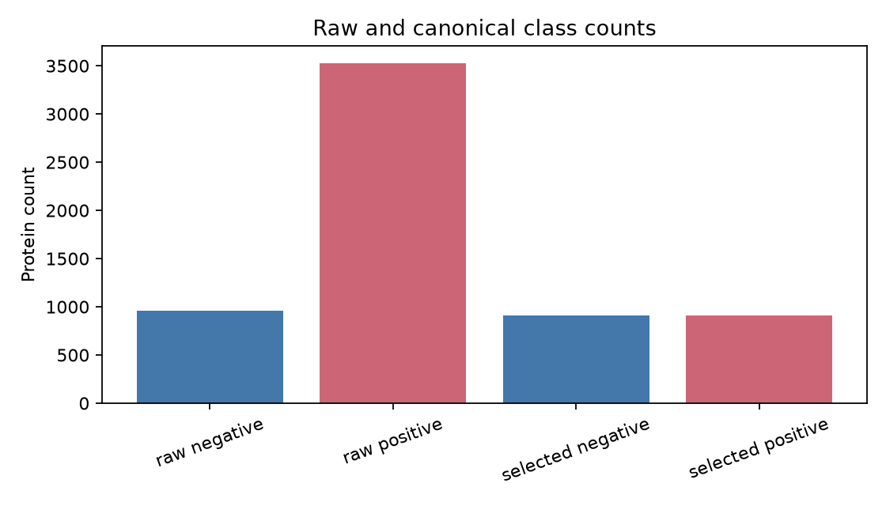
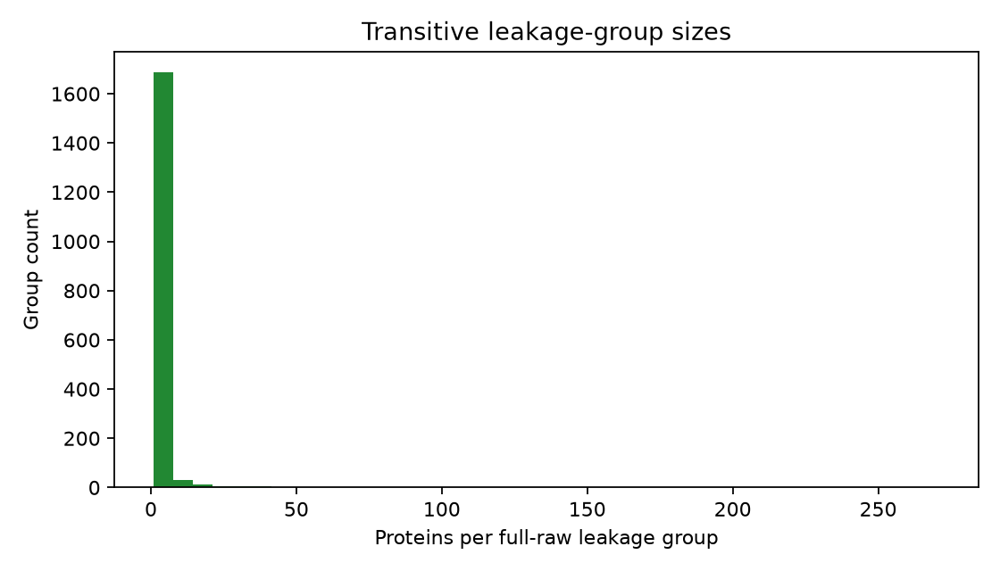
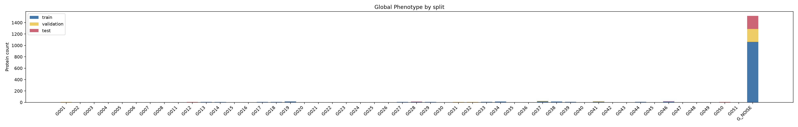
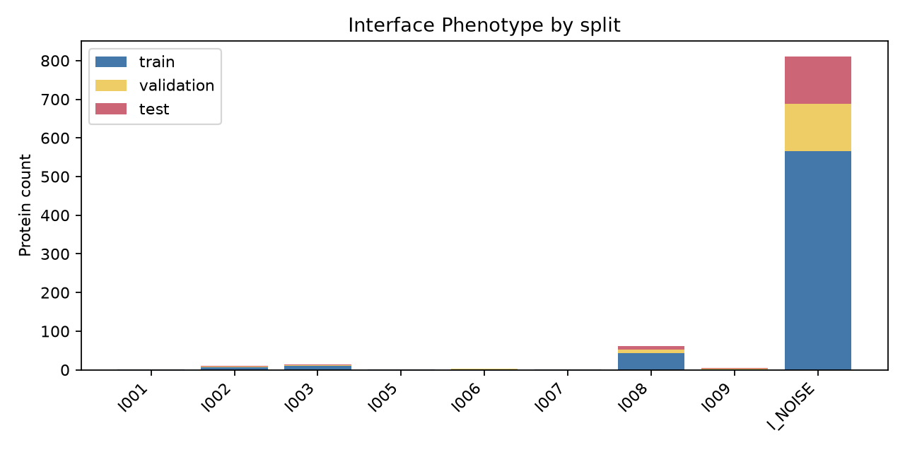
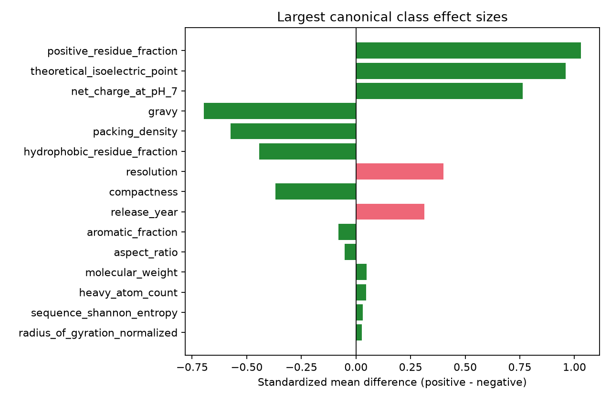
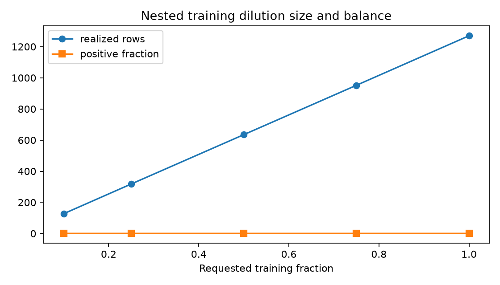
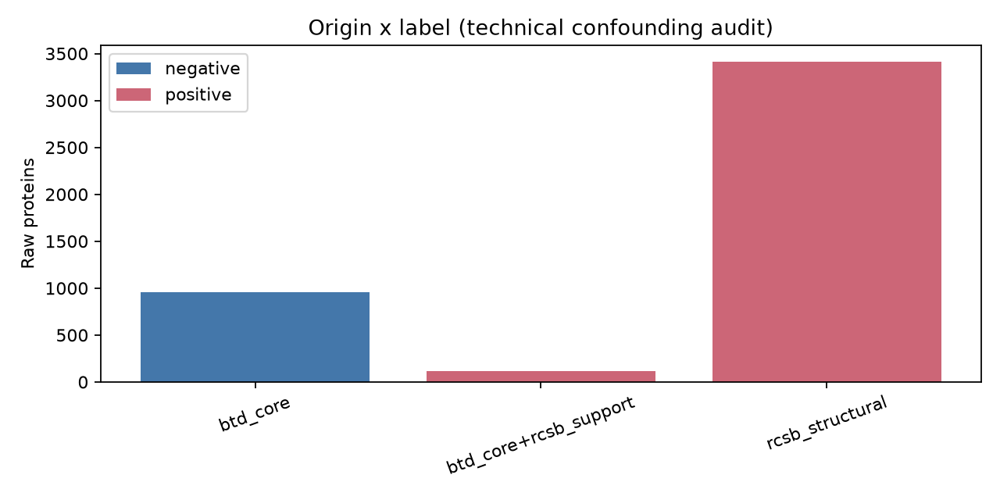
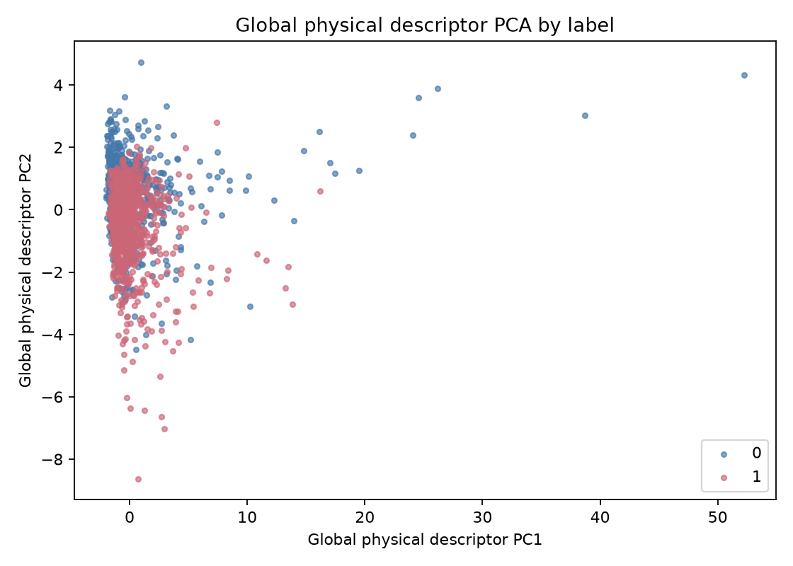
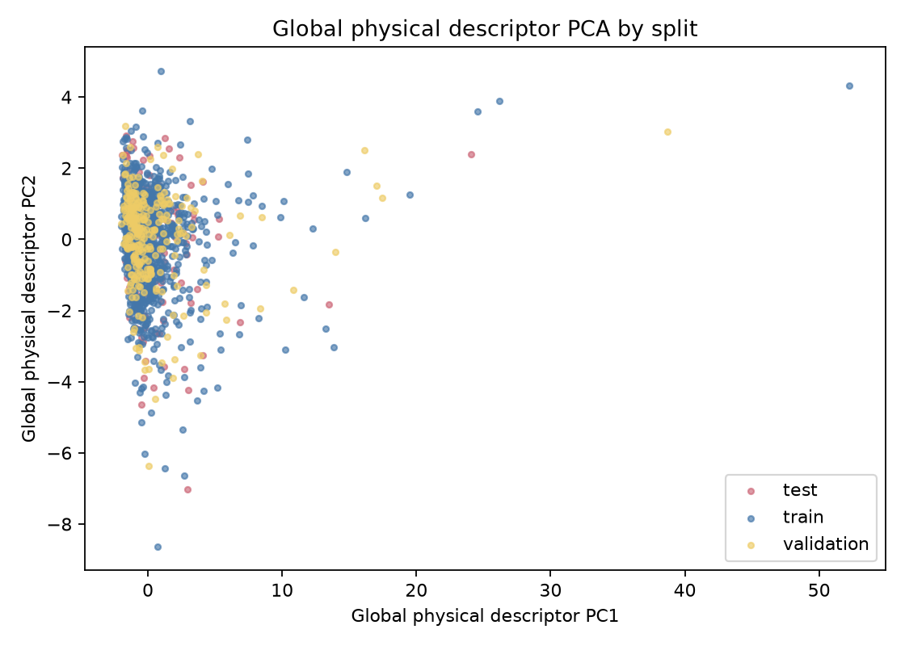

# WISDOM-DNA dataset-design report

## 1. Executive verdict

**Design status: PASS.** PASS means that the software verified the declared input, kept every hard sequence/structure/provenance group inside one split, retained both classes in validation and test, and wrote a reproducible output. It does **not** mean that the dataset is free of biological or acquisition bias; those risks are measured below.

The raw evidence contains **4484 proteins**: 3529 positive and 955 negative. The canonical set contains **1814 proteins**: 907 positive and 907 negative. A positive label means that DNA binding is supported by the declared benchmark evidence and a protein--DNA heavy-atom contact was revalidated in the selected biological assembly. A negative label is accepted only from the curated BTD benchmark exclusion protocol and after contradiction checks; absence of DNA from a PDB structure is never used as negative evidence.

The selected set has **1666 independent leakage groups** and **1814 distinct exact sequences**. The largest raw transitive group has **271 proteins** (6.0% of raw evidence).

## 2. How to read the output

`catalog.csv` is the authoritative row-level table. `proteins.txt` and the three split TXT files contain one `RCSB_CHAIN` identifier per line for label-free geometry. Files ending in `-labelled.txt` contain `RCSB_CHAIN<TAB>LABEL`, where `0` means the curated negative class and `1` the contact-supported positive class. These labelled files are convenient views; downstream code must still join against `catalog.csv` when it needs assembly, copy, provenance, or evidence-tier information.

`catalog-all.csv` preserves every raw candidate, including omitted and quality-excluded rows. `clusters/` contains the pair evidence that created leakage groups. `descriptors/` contains the measured protein properties. `statistics/` contains exact machine-readable values and the plots explained in section 8.

## 3. Selection, quality, and class balance

Class balance prevents a trivial majority-class predictor from appearing useful. The requested positive:negative ratio was **1.0:1**; the realized ratio is **1.000:1**. Proteins were removed from the positive majority at leakage-group-aware deterministic priorities; the negative pool was not enlarged with uncertain examples.

The quality filter retained **4248** of 4484 candidates and excluded **236**. For fitted X-ray or cryo-EM structures, the configured resolution ceiling is **4.000 Å**. Smaller resolution values describe finer experimental detail. Missing resolution is reported as missing rather than invented, and it is not automatically rejected because methods such as NMR do not have the same resolution field.

The evidence-tier counts below make label semantics explicit. They are provenance, not model inputs, and their association with the label is expected by construction.

| Label evidence tier | Raw proteins | Selected proteins |
|---|---:|---:|
| `benchmark_exclusion_derived_negative` | 955 | 907 |
| `direct_structural_dna_contact` | 3529 | 907 |

## 4. Leakage protection and split composition

A leakage edge joins two proteins when they pass the configured MMseqs2 sequence thresholds, Foldseek structure thresholds, have exactly the same sequence, represent the same logical identity, or come from the same PDB deposition when that policy is enabled. Transitive closure matters: if A resembles B and B resembles C, all three belong to one indivisible leakage group even if A and C do not directly pass a threshold. This prevents close relatives from making evaluation artificially easy.

| Split | Proteins | Positive | Negative | Positive fraction |
|---|---:|---:|---:|---:|
| train | 1270 | 635 | 635 | 50.0% |
| validation | 272 | 136 | 136 | 50.0% |
| test | 272 | 136 | 136 | 50.0% |

No leakage group, exact sequence, same-PDB edge, accepted MMseqs2 edge, or accepted Foldseek edge crosses these splits. Split sizes can differ slightly from requested fractions because breaking a large group would violate the stronger leakage rule.

After seeding rare feasible phenotypes, the deterministic optimizer minimizes normalized squared deviations. Its count term is `sum_s w_size ((n_s-f_s n)/max(f_s n,1))^2 + sum_s sum_k w_k ((n_s,k-f_s n_k)/max(f_s n_k,1))^2`. Here `f_s` is the requested split fraction, `n_s` its protein count, `n` the canonical count, and `k` is a class, phenotype, or positive-origin category. Technical means add `sum_s sum_t w_technical ((mean_s,t-mean_t)/max(abs(mean_t),1))^2`. Normalization stops frequent categories from dominating only because they are numerous; squaring penalizes large deviations. These remain soft preferences and cannot split a dependency group.

The objective improved from **9.527** to **6.450** through **27 accepted group moves**. Lower is better only for this declared weighted objective; it is not a biological score.

## 5. Physical diversity and clustering

Two different clustering problems are kept separate. MMseqs2/Foldseek edges define **dependency groups** from evolutionary sequence or structure similarity; those groups are hard split constraints and never claim a phenotype. HDBSCAN instead explores **phenotypes** in a table of measured physical descriptors; its labels help audit diversity and balance but never override a dependency group or become a DNA-binding target.

HDBSCAN is a density-based clustering algorithm: it groups proteins only where the descriptor space contains sufficiently dense, stable neighborhoods and marks unsupported cases as noise. A `G_` phenotype describes whole-protein shape and chemistry without using the DNA label. An `I_` phenotype describes the geometry of a revalidated positive DNA-contact region. `G_NOISE` or `I_NOISE` is not an error and not a new biological family; it means that these measurements do not support a stable dense assignment under the selected settings.

Stability is summarized by the adjusted Rand index, `ARI = (RI - E[RI]) / (max(RI) - E[RI])`. Here RI counts whether pairs of proteins are grouped consistently, and `E[RI]` is the agreement expected by chance. ARI = 1 means identical partitions; values near 0 mean chance-level agreement. WISDOM compares the selected HDBSCAN setting with neighboring settings and rejects the phenotype partition when median ARI is below the configured **0.600** threshold.

On the quality-eligible population, global clustering found **51 dense phenotypes** with a noise fraction of **0.644**. Its median neighboring-parameter adjusted Rand index (ARI) is **0.794**. After quality filtering and class selection, **83.7%** of canonical members are `G_NOISE`; selection can change this fraction without refitting or relabeling the raw phenotype model.

Positive-interface clustering found **9 dense phenotypes** with noise fraction **0.781** and median-grid ARI **0.782**.

## 6. Statistical balance

For each continuous feature, the standardized mean difference (SMD) is the positive-minus-negative mean divided by the pooled standard deviation: `SMD = (mean_positive - mean_negative) / s_pooled`, where `s_pooled` combines the two within-class variances. Zero means equal means; the sign gives direction; absolute values around 0.25 and 0.50 trigger the configured warning and strong-warning levels. The Kolmogorov--Smirnov (KS) statistic is `KS = sup_x |F_positive(x) - F_negative(x)|`, the largest vertical separation between the two empirical cumulative distributions. It ranges from 0 (same observed distribution) to 1 (fully separated). Normalized Wasserstein distance is the one-dimensional transport distance divided by `s_pooled`; it measures how far observations would need to move, in pooled-standard-deviation units, to transform one distribution into the other. FDR values adjust repeated-test p-values; they indicate evidence against identical distributions, not the practical size or cause of a difference.

| Feature | Type | SMD | KS | KS FDR | Wasserstein | Interpretation |
|---|---|---:|---:|---:|---:|---|
| `sequence_length` | model_visible_global | 0.021 | 0.092 | 0.002 | 0.162 | Mean separation is below the configured warning threshold. |
| `molecular_weight` | model_visible_global | 0.048 | 0.082 | 0.007 | 0.156 | Mean separation is below the configured warning threshold. |
| `theoretical_isoelectric_point` | model_visible_global | 0.960 | 0.395 | 0.000 | 0.962 | Large class shift; inspect as a possible shortcut or biology. |
| `net_charge_at_pH_7` | model_visible_global | 0.763 | 0.387 | 0.000 | 0.763 | Large class shift; inspect as a possible shortcut or biology. |
| `gravy` | model_visible_global | -0.695 | 0.288 | 0.000 | 0.695 | Large class shift; inspect as a possible shortcut or biology. |
| `aromatic_fraction` | model_visible_global | -0.080 | 0.044 | 0.341 | 0.086 | Mean separation is below the configured warning threshold. |
| `positive_residue_fraction` | model_visible_global | 1.028 | 0.451 | 0.000 | 1.028 | Large class shift; inspect as a possible shortcut or biology. |
| `negative_residue_fraction` | model_visible_global | -0.010 | 0.045 | 0.329 | 0.137 | Mean separation is below the configured warning threshold. |
| `polar_residue_fraction` | model_visible_global | -0.018 | 0.045 | 0.329 | 0.088 | Mean separation is below the configured warning threshold. |
| `hydrophobic_residue_fraction` | model_visible_global | -0.442 | 0.178 | 0.000 | 0.442 | Noticeable class shift; monitor downstream sensitivity. |
| `sequence_shannon_entropy` | model_visible_global | 0.031 | 0.069 | 0.031 | 0.077 | Mean separation is below the configured warning threshold. |
| `coordinate_coverage` | technical_nuisance | -0.016 | 0.056 | 0.134 | 0.043 | Mean separation is below the configured warning threshold. |
| `heavy_atom_count` | model_visible_global | 0.047 | 0.079 | 0.009 | 0.155 | Mean separation is below the configured warning threshold. |
| `radius_of_gyration` | model_visible_global | -0.009 | 0.116 | 0.000 | 0.212 | Mean separation is below the configured warning threshold. |
| `radius_of_gyration_normalized` | model_visible_global | 0.026 | 0.245 | 0.000 | 0.257 | Mean separation is below the configured warning threshold. |
| `aspect_ratio` | model_visible_global | -0.053 | 0.114 | 0.000 | 0.147 | Mean separation is below the configured warning threshold. |
| `compactness` | model_visible_global | -0.370 | 0.245 | 0.000 | 0.404 | Noticeable class shift; monitor downstream sensitivity. |
| `packing_density` | model_visible_global | -0.573 | 0.312 | 0.000 | 0.574 | Large class shift; inspect as a possible shortcut or biology. |
| `resolution` | technical_nuisance | 0.401 | 0.287 | 0.000 | 0.447 | Noticeable class shift; monitor downstream sensitivity. |
| `release_year` | technical_nuisance | 0.313 | 0.221 | 0.000 | 0.315 | Noticeable class shift; monitor downstream sensitivity. |

For categorical features, Cramér's V measures association with the binary label. Its uncorrected form is `V = sqrt((chi2 / n) / min(r - 1, c - 1))`, where `chi2` is the contingency-table statistic, `n` is the number of proteins, and `r` and `c` are the row and column counts. WISDOM uses the finite-sample bias-corrected form. V ranges from 0 (no observed association) to 1 (perfect separation). A high value for acquisition origin or experimental method is a confounding risk; a high value for a label-free physical phenotype may represent biology but still deserves controlled evaluation.

| Categorical feature | Categories | Cramér's V | Chi-square FDR | Interpretation |
|---|---:|---:|---:|---|
| `origin` | 3 | 1.000 | 0.000 | Association exceeds the configured warning threshold. |
| `experimental_method` | 7 | 0.048 | 0.118 | Association is below the configured warning threshold. |
| `global_phenotype` | 50 | 0.221 | 0.000 | Association exceeds the configured warning threshold. |

The complete contingency counts/proportions are in `statistics/categorical-balance.csv`; all population means, standard deviations, medians, interquartile ranges, 5th/25th/75th/95th percentiles, finite counts, and missing counts are in `statistics/raw-summary.json` and `statistics/selected-summary.json`. Split-pair SMD, KS, and Jensen--Shannon values are in `statistics/split-balance.csv`. Jensen--Shannon divergence is a symmetric comparison of category proportions: 0 bits means identical proportions and 1 bit is maximal separation for two distributions.

## 7. Shortcut diagnostics and learning curves

The diagnostic regressions are deliberately small and are not WISDOM models. Their cross-validation keeps complete leakage groups together. AUROC is the probability that a randomly chosen positive receives a higher score than a randomly chosen negative (0.5 is random ranking; 1 is perfect). AUPRC emphasizes precision/recall for positives; its no-skill reference equals the positive fraction. Balanced accuracy averages positive and negative recall, so 0.5 is the binary no-skill reference even when class counts differ.

| Diagnostic feature family | AUROC mean ± SD | AUPRC mean ± SD | Balanced accuracy mean ± SD | Meaning |
|---|---:|---:|---:|---|
| `technical_with_origin` | 1.000 ± 0.000 | 1.000 ± 0.000 | 1.000 ± 0.000 | Strong shortcut warning: these non-WISDOM features separate labels well. |
| `technical_without_origin` | 0.685 ± 0.038 | 0.675 ± 0.030 | 0.635 ± 0.027 | Diagnostic discrimination is below the configured technical red flag. |
| `simple_global_model_visible` | 0.840 ± 0.024 | 0.824 ± 0.025 | 0.752 ± 0.026 | Diagnostic discrimination is below the configured technical red flag. |

The model with `origin` directly tests whether source provenance reveals the label. The technical model without origin tests resolution, coordinate coverage, release year, and experimental method. The simple global model tests whether basic whole-protein properties already separate the task. High values do not prove that WISDOM will exploit a shortcut, but they require source-aware controls and cautious interpretation.

Training dilutions remove complete training leakage groups only. Validation and test never change, and smaller subsets are nested inside larger subsets within a replicate. Therefore a learning curve measures the effect of training evidence without changing the evaluation question.

| Replicate | Training view | Requested | Realized proteins | Positive | Negative | Groups |
|---|---|---:|---:|---:|---:|---:|
| replicate-00 | train-10 | 10% | 127 | 63 | 64 | 119 |
| replicate-00 | train-25 | 25% | 318 | 159 | 159 | 310 |
| replicate-00 | train-50 | 50% | 635 | 317 | 318 | 627 |
| replicate-00 | train-75 | 75% | 952 | 476 | 476 | 944 |
| replicate-00 | train-100 | 100% | 1270 | 635 | 635 | 1252 |

## 8. Plot-by-plot guide

- **`class-counts.png`:** bar height is protein count. Compare raw and selected   bars to see exactly how majority reduction created the canonical class ratio.
- **`origin-by-label.png`:** each bar is a data origin and colors are labels. A   color confined to one origin means provenance can reveal the answer; this is   technical confounding, not evidence of DNA-binding biology.
- **`leakage-group-sizes.png`:** the horizontal axis is proteins per transitive   group and the vertical axis is the number of groups of that size. A long right   tail explains why exact target split sizes may be impossible without leakage.
- **`smd-forest.png`:** each horizontal bar is positive-minus-negative mean   separation in pooled standard deviations. Distance from zero matters; color   distinguishes technical nuisance variables from model-visible global ones.
- **`global-phenotypes.png`:** each bar is one label-free whole-protein phenotype   and segments show fixed splits. Missing rare phenotypes in a split can be   mathematically unavoidable when too few independent leakage groups carry them.
- **`interface-phenotypes.png`:** the same split coverage view, but only for   contact-supported positive interfaces. It cannot describe negatives because   they have no positive DNA-contact interface by definition.
- **`global-pca-by-label.png`:** the first two principal components are linear   summaries of scaled global descriptors; points are colored by label. Visible   separation suggests a global biological or technical shortcut, but overlap   does not prove the full high-dimensional distributions are equal.
- **`global-pca-by-split.png`:** the same coordinates colored by split. Similar   clouds support distribution comparability; separation calls for the exact   split statistics rather than a visual conclusion alone.
- **`dilutions.png`:** requested fraction is on the horizontal axis. One series   shows realized protein count and the other positive fraction. Nonlinear count   steps are expected because complete leakage groups cannot be split.

## 9. Warnings and scientific limitations

- **strong_warning — class_continuous_shift (gravy):** A model-visible difference may be real biology or a global shortcut; it is not automatically bias. Observed value: -0.695; configured threshold: 0.250.
- **strong_warning — class_continuous_shift (net_charge_at_pH_7):** A model-visible difference may be real biology or a global shortcut; it is not automatically bias. Observed value: 0.763; configured threshold: 0.250.
- **strong_warning — class_continuous_shift (packing_density):** A model-visible difference may be real biology or a global shortcut; it is not automatically bias. Observed value: -0.573; configured threshold: 0.250.
- **strong_warning — class_continuous_shift (positive_residue_fraction):** A model-visible difference may be real biology or a global shortcut; it is not automatically bias. Observed value: 1.028; configured threshold: 0.250.
- **strong_warning — class_continuous_shift (theoretical_isoelectric_point):** A model-visible difference may be real biology or a global shortcut; it is not automatically bias. Observed value: 0.960; configured threshold: 0.250.
- **warning — class_categorical_association (global_phenotype):** This category is associated with the label. Origin/method associations are technical confounding risks; phenotype associations are descriptive. Observed value: 0.221; configured threshold: 0.200.
- **warning — class_categorical_association (origin):** This category is associated with the label. Origin/method associations are technical confounding risks; phenotype associations are descriptive. Observed value: 1.000; configured threshold: 0.200.
- **warning — class_continuous_shift (compactness):** A model-visible difference may be real biology or a global shortcut; it is not automatically bias. Observed value: -0.370; configured threshold: 0.250.
- **warning — class_continuous_shift (hydrophobic_residue_fraction):** A model-visible difference may be real biology or a global shortcut; it is not automatically bias. Observed value: -0.442; configured threshold: 0.250.
- **warning — class_continuous_shift (release_year):** A technical difference is a possible nuisance confounder. Observed value: 0.313; configured threshold: 0.250.
- **warning — class_continuous_shift (resolution):** A technical difference is a possible nuisance confounder. Observed value: 0.401; configured threshold: 0.250.
- **warning — class_distribution_shift (compactness):** Positive and negative empirical distributions differ substantially. Observed value: 0.245; configured threshold: 0.200.
- **warning — class_distribution_shift (gravy):** Positive and negative empirical distributions differ substantially. Observed value: 0.288; configured threshold: 0.200.
- **warning — class_distribution_shift (net_charge_at_pH_7):** Positive and negative empirical distributions differ substantially. Observed value: 0.387; configured threshold: 0.200.
- **warning — class_distribution_shift (packing_density):** Positive and negative empirical distributions differ substantially. Observed value: 0.312; configured threshold: 0.200.
- **warning — class_distribution_shift (positive_residue_fraction):** Positive and negative empirical distributions differ substantially. Observed value: 0.451; configured threshold: 0.200.
- **warning — class_distribution_shift (radius_of_gyration_normalized):** Positive and negative empirical distributions differ substantially. Observed value: 0.245; configured threshold: 0.200.
- **warning — class_distribution_shift (release_year):** Positive and negative empirical distributions differ substantially. Observed value: 0.221; configured threshold: 0.200.
- **warning — class_distribution_shift (resolution):** Positive and negative empirical distributions differ substantially. Observed value: 0.287; configured threshold: 0.200.
- **warning — class_distribution_shift (theoretical_isoelectric_point):** Positive and negative empirical distributions differ substantially. Observed value: 0.395; configured threshold: 0.200.
- **warning — giant_leakage_group (giant_leakage_group):** A large transitive homology component limits independent split balance; it was kept intact because leakage takes priority over balance. Observed value: 0.060; configured threshold: 0.050.
- **warning — global_phenotype_noise (global_phenotype_noise):** Most selected proteins do not belong to a stable dense global phenotype. Leakage safety is unaffected, but phenotype-stratified conclusions have limited coverage and should treat G_NOISE as an explicit population. Observed value: 0.837; configured threshold: 0.500.
- **warning — phenotype_split_coverage (global_phenotype:G007):** At least three leakage groups carry this phenotype, but the current joint assignment does not cover every split. Overlapping phenotype memberships may make the apparently feasible coverage incompatible. Observed value: 3.000; configured threshold: not available.
- **warning — phenotype_split_coverage (global_phenotype:G020):** At least three leakage groups carry this phenotype, but the current joint assignment does not cover every split. Overlapping phenotype memberships may make the apparently feasible coverage incompatible. Observed value: 3.000; configured threshold: not available.
- **warning — phenotype_split_coverage (global_phenotype:G021):** At least three leakage groups carry this phenotype, but the current joint assignment does not cover every split. Overlapping phenotype memberships may make the apparently feasible coverage incompatible. Observed value: 3.000; configured threshold: not available.
- **warning — phenotype_split_coverage (global_phenotype:G025):** At least three leakage groups carry this phenotype, but the current joint assignment does not cover every split. Overlapping phenotype memberships may make the apparently feasible coverage incompatible. Observed value: 3.000; configured threshold: not available.
- **warning — phenotype_split_coverage (global_phenotype:G030):** At least three leakage groups carry this phenotype, but the current joint assignment does not cover every split. Overlapping phenotype memberships may make the apparently feasible coverage incompatible. Observed value: 3.000; configured threshold: not available.
- **warning — phenotype_split_coverage (global_phenotype:G043):** At least three leakage groups carry this phenotype, but the current joint assignment does not cover every split. Overlapping phenotype memberships may make the apparently feasible coverage incompatible. Observed value: 3.000; configured threshold: not available.
- **warning — phenotype_split_coverage (global_phenotype:G045):** At least three leakage groups carry this phenotype, but the current joint assignment does not cover every split. Overlapping phenotype memberships may make the apparently feasible coverage incompatible. Observed value: 3.000; configured threshold: not available.
- **warning — phenotype_split_coverage (global_phenotype:G047):** At least three leakage groups carry this phenotype, but the current joint assignment does not cover every split. Overlapping phenotype memberships may make the apparently feasible coverage incompatible. Observed value: 3.000; configured threshold: not available.
- **warning — phenotype_split_coverage (interface_phenotype:I006):** At least three leakage groups carry this phenotype, but the current joint assignment does not cover every split. Overlapping phenotype memberships may make the apparently feasible coverage incompatible. Observed value: 3.000; configured threshold: not available.

The most important irreducible limitation is negative evidence. BTD negatives are benchmark negatives obtained by exclusion from curated protein annotations, not a universal experimental proof that a protein can never bind DNA in any condition. The builder rejects direct structural contradictions and never turns PDB non-contact or missing DNA into a negative, but incomplete biological knowledge remains possible. Source-class association must therefore be reported and controlled in model interpretation.

HDBSCAN phenotypes are descriptor-space summaries, not biological ground-truth families. Statistical p-values depend strongly on sample size and must be read with effect sizes. Finally, group-safe splitting limits known homology leakage under declared thresholds; it cannot guarantee the absence of every unknown evolutionary relationship.

## 10. Reproduction checklist

1. Inspect `provenance.json` for the raw-input hash, parameters, seed, and    structure hashes.
2. Confirm `design-summary.json` says `PASS` and review every item in    `statistics/warnings.json`.
3. Use `catalog.csv` for scientific joins; use ID-only TXT files for structural    preprocessing and labelled TXT files for manual/audit views.
4. Preserve validation/test exactly. Use only the nested training TXT files for    learning-curve experiments.
5. Treat this report as an interpretation layer and CSV/JSON files as exact    numerical evidence.
